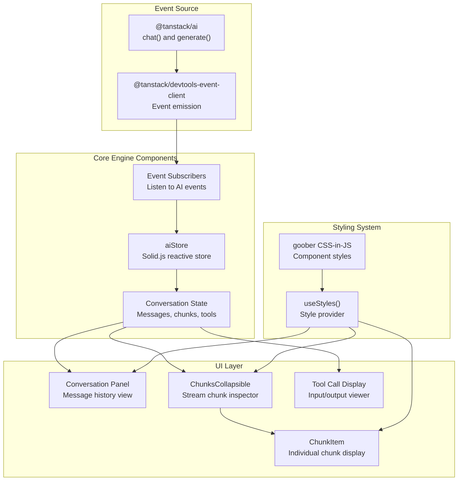
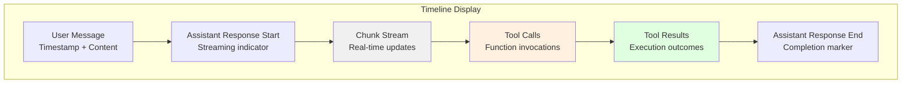
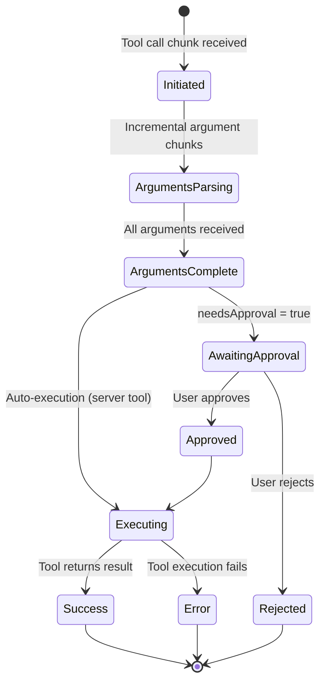
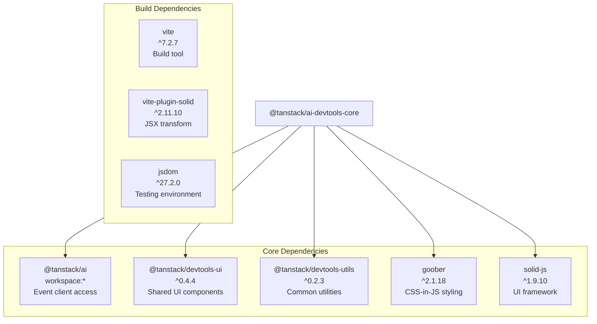
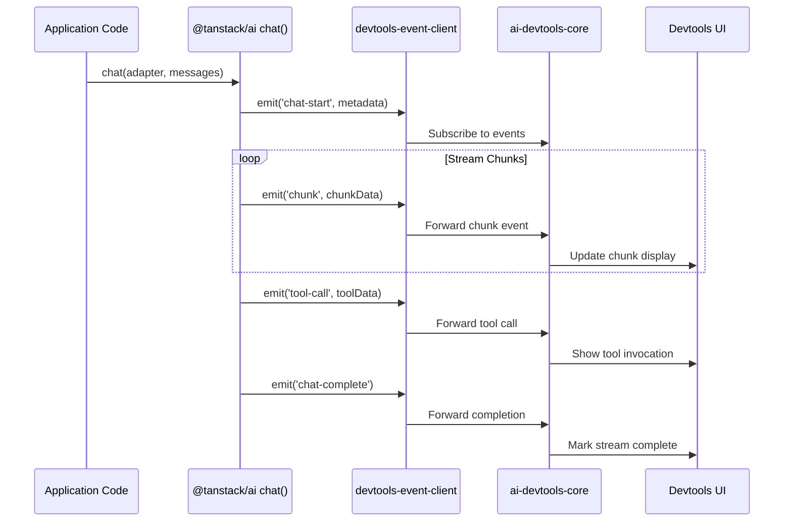
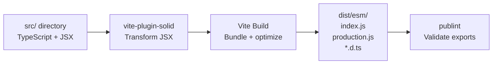
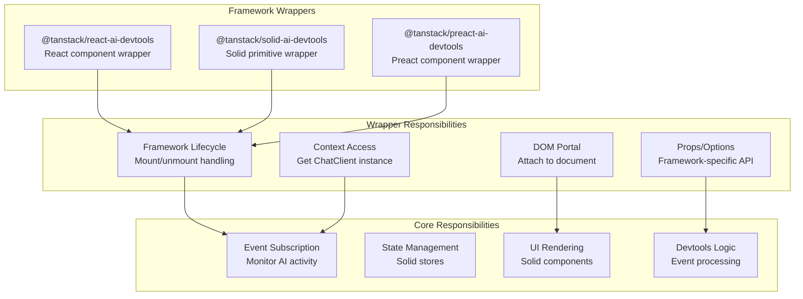
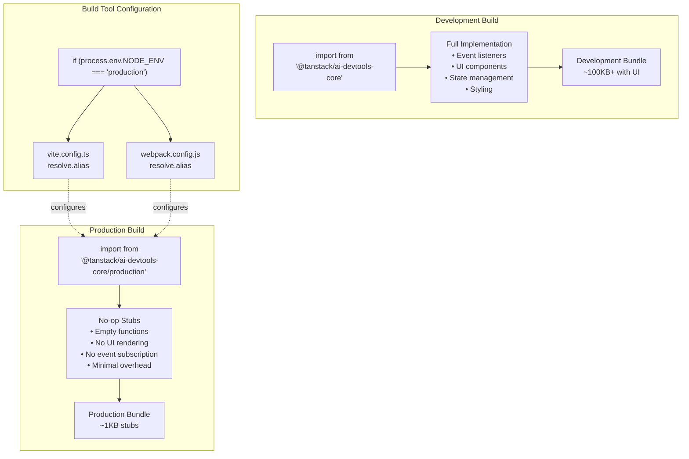
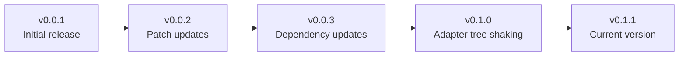

# Core Devtools (@tanstack/ai-devtools)

<details>
<summary>Relevant source files</summary>

The following files were used as context for generating this wiki page:

- [docs/getting-started/devtools.md](docs/getting-started/devtools.md)
- [examples/vanilla-chat/package.json](examples/vanilla-chat/package.json)
- [packages/typescript/ai-client/package.json](packages/typescript/ai-client/package.json)
- [packages/typescript/ai-devtools/package.json](packages/typescript/ai-devtools/package.json)
- [packages/typescript/ai/package.json](packages/typescript/ai/package.json)
- [packages/typescript/preact-ai-devtools/CHANGELOG.md](packages/typescript/preact-ai-devtools/CHANGELOG.md)
- [packages/typescript/preact-ai-devtools/README.md](packages/typescript/preact-ai-devtools/README.md)
- [packages/typescript/preact-ai-devtools/package.json](packages/typescript/preact-ai-devtools/package.json)
- [packages/typescript/preact-ai-devtools/src/AiDevtools.tsx](packages/typescript/preact-ai-devtools/src/AiDevtools.tsx)
- [packages/typescript/preact-ai-devtools/src/index.ts](packages/typescript/preact-ai-devtools/src/index.ts)
- [packages/typescript/preact-ai-devtools/src/plugin.tsx](packages/typescript/preact-ai-devtools/src/plugin.tsx)
- [packages/typescript/react-ai-devtools/package.json](packages/typescript/react-ai-devtools/package.json)
- [packages/typescript/solid-ai-devtools/package.json](packages/typescript/solid-ai-devtools/package.json)

</details>

## Purpose and Scope

The Core Devtools package (`@tanstack/ai-devtools-core` on npm) provides framework-agnostic developer tools for debugging and inspecting TanStack AI interactions in real-time. The devtools offer three primary capabilities:

1. **Stream Inspection**: Monitor individual stream chunks as they arrive from AI providers
2. **Message History Visualization**: Inspect the full conversation history with detailed message parts
3. **Tool Call Tracking**: Track tool invocations, arguments, results, and approval flows

The core implementation is built with Solid.js for fine-grained reactivity and minimal bundle size. Framework-specific wrapper packages (`@tanstack/react-ai-devtools`, `@tanstack/solid-ai-devtools`, `@tanstack/preact-ai-devtools`) consume this core to provide idiomatic integrations.

For information about framework-specific devtools integrations, see [Framework-Specific Devtools](#8.2).

**Sources:** [packages/typescript/ai-devtools/package.json:1-61]()

## Core Engine Architecture

The devtools engine operates through an event-driven architecture that monitors AI interactions in real-time. The system consists of three primary subsystems: event capture, state management, and UI rendering.

### System Architecture



**Sources:** [packages/typescript/ai-devtools/package.json:48-54](), [packages/typescript/ai-devtools/src/components/conversation/ChunksCollapsible.tsx:1-56]()

### Event Capture System

The core engine integrates with `@tanstack/ai` through the `@tanstack/devtools-event-client` interface. When the `chat()` or `generate()` functions execute, they emit events that the devtools subscribes to:

| Event Type      | Payload                | Purpose                   |
| --------------- | ---------------------- | ------------------------- |
| Stream Start    | Conversation ID, Model | Initialize tracking       |
| Chunk Received  | Chunk data, Type       | Capture individual chunks |
| Tool Call       | Tool name, Arguments   | Track tool invocations    |
| Tool Result     | Result data, Status    | Monitor tool execution    |
| Stream Complete | Final state            | Mark conversation end     |
| Error           | Error details          | Capture failures          |

**Sources:** [packages/typescript/ai/package.json:57-60](), [packages/typescript/ai-devtools/package.json:48-49]()

### State Management with Solid.js

The devtools uses Solid.js stores for reactive state management. The `aiStore` maintains:

```typescript
interface Chunk {
  type: 'content' | 'tool_call' | 'thinking' | 'done' | 'error'
  content?: string
  delta?: string
  chunkCount?: number
  // Additional type-specific fields
}

interface ConversationState {
  messages: Array<UIMessage>
  chunks: Array<Chunk>
  isStreaming: boolean
  toolCalls: Array<ToolCallState>
}
```

Solid.js provides fine-grained reactivity, meaning UI components only re-render when specific state values change, not on every update to the entire store.

**Sources:** [packages/typescript/ai-devtools/src/components/conversation/ChunksCollapsible.tsx:6]()

## Stream Inspection

Stream inspection is the core capability for monitoring AI responses as they arrive. The devtools capture and display individual stream chunks with detailed metadata.

### Chunk Collection and Aggregation

The `ChunksCollapsible` component demonstrates the stream inspection interface:

```typescript
// Accumulate content from content chunks
const accumulatedContent = () =>
  props.chunks
    .filter((c) => c.type === 'content' && (c.content || c.delta))
    .map((c) => c.delta || c.content)
    .join('')

// Calculate total raw chunks
const totalRawChunks = () =>
  props.chunks.reduce((sum, c) => sum + (c.chunkCount || 1), 0)
```

**Sources:** [packages/typescript/ai-devtools/src/components/conversation/ChunksCollapsible.tsx:15-23]()

### Chunk Types and Visualization

The devtools categorize chunks by type and provide visual indicators:

| Chunk Type  | Visual Indicator | Purpose                                     |
| ----------- | ---------------- | ------------------------------------------- |
| `content`   | Text preview     | Display generated text content              |
| `tool_call` | Tool badge       | Show function calling activity              |
| `thinking`  | Thinking badge   | Display extended reasoning (Claude, Gemini) |
| `done`      | Completion badge | Mark stream completion                      |
| `error`     | Error badge      | Highlight failures                          |

**Sources:** [packages/typescript/ai-devtools/src/components/conversation/ChunksCollapsible.tsx:1-56]()

### Collapsible Chunk Inspector

The chunk inspector provides a collapsible details view:

```typescript
<details class={styles().conversationDetails.chunksDetails}>
  <summary class={styles().conversationDetails.chunksSummary}>
    <div class={styles().conversationDetails.chunksSummaryRow}>
      <span>▶</span>
      <span>📦 {totalRawChunks()} chunks</span>
      <ChunkBadges chunks={props.chunks} />
    </div>
    {/* Content Preview */}
    <Show when={accumulatedContent()}>
      <div class={styles().conversationDetails.contentPreview}>
        {accumulatedContent()}
      </div>
    </Show>
  </summary>
  {/* Individual chunk items */}
  <For each={props.chunks}>
    {(chunk, index) => (
      <ChunkItem chunk={chunk} index={index()} variant="small" />
    )}
  </For>
</details>
```

The summary line shows:

1. Total chunk count (including batched chunks via `chunkCount`)
2. Type badges indicating chunk categories
3. Preview of accumulated content (first ~100 characters)

Expanding the details reveals individual `ChunkItem` components with full chunk data.

**Sources:** [packages/typescript/ai-devtools/src/components/conversation/ChunksCollapsible.tsx:26-54]()

### Individual Chunk Display

The `ChunkItem` component renders detailed information for each chunk:

- Chunk index and type badge
- Timestamp (if available)
- Full content or delta
- Tool call arguments (for tool_call chunks)
- Raw chunk data (collapsible JSON view)

This enables developers to debug streaming issues, inspect incremental updates, and verify chunk-by-chunk behavior.

**Sources:** [packages/typescript/ai-devtools/src/components/conversation/ChunksCollapsible.tsx:48-50]()

## Message History Visualization

The devtools provide comprehensive message history visualization, showing the complete conversation state including user messages, assistant responses, and system prompts.

### Message Part Inspection

Messages are decomposed into parts for detailed inspection:

| Part Type     | Display         | Information Shown                          |
| ------------- | --------------- | ------------------------------------------ |
| `text`        | Text content    | Raw text content, markdown rendering       |
| `tool-call`   | Tool invocation | Function name, arguments, call ID          |
| `tool-result` | Tool output     | Result data, execution status, timing      |
| `thinking`    | Reasoning trace | Extended thinking content (Claude, Gemini) |
| `image`       | Image reference | URL, MIME type, dimensions                 |
| `file`        | File attachment | Filename, size, MIME type                  |

The devtools render each part type with appropriate formatting and collapsible sections for large content.

**Sources:** [packages/typescript/ai-devtools/src/components/conversation/ChunksCollapsible.tsx:1-56]()

### Conversation Timeline

The conversation panel displays messages in chronological order with visual indicators:



**Sources:** [packages/typescript/ai-devtools/src/components/conversation/ChunksCollapsible.tsx:1-56]()

### Streaming State Indicators

During active streaming, the devtools show:

1. **Streaming Badge**: Visual indicator that response is in progress
2. **Chunk Counter**: Real-time count of received chunks
3. **Content Preview**: Accumulated content as it streams
4. **Type Badges**: Indicators for different chunk types

This allows developers to monitor streaming performance and identify bottlenecks.

**Sources:** [packages/typescript/ai-devtools/src/components/conversation/ChunksCollapsible.tsx:26-44]()

## Tool Call Tracking

The devtools provide detailed tracking of tool invocations throughout the conversation lifecycle.

### Tool Call States

Tool calls progress through multiple states:



Each state transition is tracked with timestamps and displayed in the devtools UI.

**Sources:** [packages/typescript/ai-devtools/package.json:48-54]()

### Tool Call Display

For each tool call, the devtools show:

1. **Tool Metadata**
   - Tool name and description
   - Call ID for correlation
   - Invocation timestamp

2. **Arguments**
   - Schema-validated input
   - Type information
   - Raw JSON view (collapsible)

3. **Execution Details**
   - Execution status (pending/success/error)
   - Execution duration
   - Server vs. client tool indicator

4. **Results**
   - Structured output
   - Error messages (if failed)
   - Result type validation

5. **Approval Flow** (if `needsApproval: true`)
   - Approval request UI
   - User decision (approved/rejected)
   - Approval timestamp

**Sources:** [packages/typescript/ai-devtools/src/components/conversation/ChunksCollapsible.tsx:1-56]()

### Badge System

The `ChunkBadges` component provides visual indicators for chunk types:

- **Tool Call Badge**: Indicates tool invocations
- **Thinking Badge**: Shows extended reasoning chunks
- **Error Badge**: Highlights error chunks
- **Done Badge**: Marks completion

Badges appear in both the collapsed summary view and individual chunk displays.

**Sources:** [packages/typescript/ai-devtools/src/components/conversation/ChunksCollapsible.tsx:33]()

## Package Structure and Exports

The package provides two distinct exports optimized for different environments:

### Development Export

```typescript
import {} from /* devtools components */ '@tanstack/ai-devtools-core'
```

The default export at `./dist/esm/index.js` includes:

- Complete devtools UI implementation
- Event listeners and state management
- Solid.js components and reactivity
- goober styling system
- Full debugging capabilities

**Sources:** [packages/typescript/ai-devtools/package.json:15-19]()

### Production Export

```typescript
import {} from /* no-op stubs */ '@tanstack/ai-devtools-core/production'
```

The production export at `./dist/esm/production.js` provides no-op stub implementations that:

- Have minimal runtime cost (~1KB)
- Return empty/default values
- Skip event subscription
- Render no UI

This allows developers to keep devtools imports in source code while automatically disabling them in production through build tool configuration (Vite alias, Webpack alias, etc.).

**Sources:** [packages/typescript/ai-devtools/package.json:20-23]()

### Dependency Graph



**Sources:** [packages/typescript/ai-devtools/package.json:48-60]()

## Integration with @tanstack/ai

The devtools integrate with the core `@tanstack/ai` package through the event client system:

### Event Client Architecture



The `@tanstack/devtools-event-client` is re-exported from `@tanstack/ai` and provides the event emission infrastructure.

**Sources:** [packages/typescript/ai/package.json:57-60](), [packages/typescript/ai-devtools/package.json:48-49]()

### TanStack Devtools UI Components

The `@tanstack/devtools-ui` package provides shared components:

- **Panel System**: Collapsible panels for organizing information
- **Tree Views**: Hierarchical data display
- **JSON Inspector**: Syntax-highlighted JSON viewer
- **Theme Provider**: Consistent theming across TanStack devtools

These components are customized with AI-specific logic in the core package.

**Sources:** [packages/typescript/ai-devtools/package.json:50]()

### Styling with goober

The `goober` library (~1KB) provides CSS-in-JS capabilities:

```typescript
// Style definition example
const styles = css`
  .chunksDetails {
    border: 1px solid var(--border-color);
    border-radius: 4px;
    margin: 8px 0;
  }

  .chunksSummary {
    cursor: pointer;
    padding: 8px;
    background: var(--summary-bg);
  }
`
```

The `useStyles()` hook provides access to the style system with theme support.

**Sources:** [packages/typescript/ai-devtools/package.json:52](), [packages/typescript/ai-devtools/src/components/conversation/ChunksCollapsible.tsx:12-13]()

## Build System and Scripts

The package uses Vite with the Solid.js plugin for building:

### Build Scripts

| Script        | Command                    | Purpose                                           |
| ------------- | -------------------------- | ------------------------------------------------- |
| `build`       | `vite build`               | Compile TypeScript and Solid.js JSX to ESM output |
| `clean`       | `premove ./build ./dist`   | Remove build artifacts                            |
| `test:build`  | `publint --strict`         | Validate package structure and exports            |
| `test:eslint` | `eslint ./src`             | Lint source files                                 |
| `test:lib`    | `vitest --passWithNoTests` | Run unit tests (currently none)                   |
| `test:types`  | `tsc`                      | Type check without emitting                       |

**Sources:** [packages/typescript/ai-devtools/package.json:31-39]()

### Build Pipeline



The `vite-plugin-solid` transforms Solid.js JSX into optimized JavaScript, while Vite handles TypeScript compilation, bundling, and type declaration generation.

**Sources:** [packages/typescript/ai-devtools/package.json:55-60]()

## Framework Integration Pattern

Framework-specific packages provide thin wrappers around the core:

### Wrapper Architecture



**Sources:** [packages/typescript/react-ai-devtools/package.json:50-53](), [packages/typescript/solid-ai-devtools/package.json:49-52]()

### Wrapper Packages

| Package                        | Peer Dependencies      | Wrapper Type                   |
| ------------------------------ | ---------------------- | ------------------------------ |
| `@tanstack/react-ai-devtools`  | React ^17, ^18, or ^19 | Component with lifecycle hooks |
| `@tanstack/solid-ai-devtools`  | solid-js >=1.9.7       | Native Solid primitive         |
| `@tanstack/preact-ai-devtools` | preact >=10.0.0        | Component with lifecycle hooks |

All wrappers depend on both `@tanstack/ai-devtools-core` and `@tanstack/devtools-utils`.

**Sources:** [packages/typescript/react-ai-devtools/package.json:50-62](), [packages/typescript/solid-ai-devtools/package.json:49-60](), [pnpm-lock.yaml:651-680]()

## Production vs Development Builds



The dual export strategy allows developers to:

1. Keep devtools imports in source code
2. Automatically swap to production stubs via build configuration
3. Eliminate devtools overhead in production without code changes
4. Avoid accidental inclusion of devtools UI in production bundles

**Sources:** [packages/typescript/ai-devtools/package.json:15-25](), [packages/typescript/react-ai-devtools/package.json:30-43](), [packages/typescript/solid-ai-devtools/package.json:15-26]()

## Testing Infrastructure

The core devtools package includes minimal test infrastructure due to its UI-focused nature:

| Script        | Purpose                    | Configuration                              |
| ------------- | -------------------------- | ------------------------------------------ |
| `test:lib`    | Run unit tests with Vitest | Passes with no tests (`--passWithNoTests`) |
| `test:types`  | Type checking              | Uses `tsc` compiler                        |
| `test:eslint` | Linting                    | ESLint on `./src`                          |

The `jsdom` dev dependency suggests some UI component testing may be configured, even if no tests currently exist.

**Sources:** [packages/typescript/ai-devtools/package.json:30-39](), [packages/typescript/ai-devtools/package.json:55-60]()

## Version History

The package follows semantic versioning and is coordinated with framework wrapper releases through Changesets:



All framework wrappers maintain synchronized version numbers with the core package.

**Sources:** [packages/typescript/react-ai-devtools/CHANGELOG.md:1-49](), [packages/typescript/ai-devtools/package.json:3]()

## Usage Context

Applications integrate the devtools through framework wrappers, not directly. The core package is an internal dependency that provides the implementation consumed by `@tanstack/react-ai-devtools` and `@tanstack/solid-ai-devtools`.

For implementation details and usage examples, see [Framework-Specific Devtools](#8.2).

**Sources:** [packages/typescript/react-ai-devtools/package.json:50-52](), [packages/typescript/solid-ai-devtools/package.json:49-51]()
