# Framework-Specific Devtools

<details>
<summary>Relevant source files</summary>

The following files were used as context for generating this wiki page:

- [docs/getting-started/devtools.md](docs/getting-started/devtools.md)
- [examples/vanilla-chat/package.json](examples/vanilla-chat/package.json)
- [packages/typescript/ai-client/package.json](packages/typescript/ai-client/package.json)
- [packages/typescript/ai-devtools/package.json](packages/typescript/ai-devtools/package.json)
- [packages/typescript/ai/package.json](packages/typescript/ai/package.json)
- [packages/typescript/preact-ai-devtools/CHANGELOG.md](packages/typescript/preact-ai-devtools/CHANGELOG.md)
- [packages/typescript/preact-ai-devtools/README.md](packages/typescript/preact-ai-devtools/README.md)
- [packages/typescript/preact-ai-devtools/package.json](packages/typescript/preact-ai-devtools/package.json)
- [packages/typescript/preact-ai-devtools/src/AiDevtools.tsx](packages/typescript/preact-ai-devtools/src/AiDevtools.tsx)
- [packages/typescript/preact-ai-devtools/src/index.ts](packages/typescript/preact-ai-devtools/src/index.ts)
- [packages/typescript/preact-ai-devtools/src/plugin.tsx](packages/typescript/preact-ai-devtools/src/plugin.tsx)
- [packages/typescript/react-ai-devtools/package.json](packages/typescript/react-ai-devtools/package.json)
- [packages/typescript/solid-ai-devtools/package.json](packages/typescript/solid-ai-devtools/package.json)

</details>

## Purpose and Scope

This document covers the framework-specific devtools packages that provide integration points for React and Solid.js applications. These packages wrap `@tanstack/ai-devtools-core` (see [Core Devtools](#8.1)) with framework-specific lifecycle management and component APIs.

Framework-specific devtools handle:

- Framework-specific component definitions for mounting the devtools UI
- Framework reactivity integration (React hooks, Solid signals)
- Production build configurations that eliminate devtools code from production bundles
- Peer dependency management for framework versions

For information about the underlying event system and devtools UI, see [Core Devtools](#8.1).

## Package Architecture

The devtools system follows a layered architecture with shared core logic and thin framework adapters:

**Diagram: Framework Devtools Architecture**

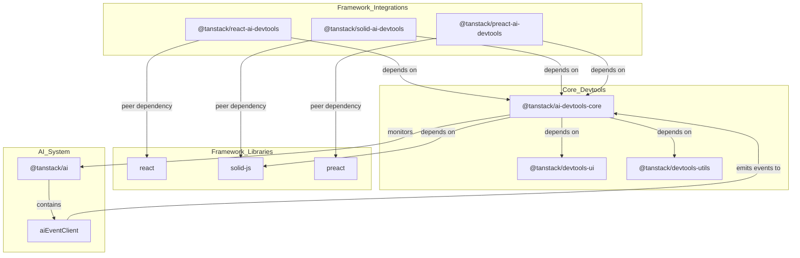

**Sources:** [packages/typescript/ai-devtools/package.json:1-61](), [packages/typescript/solid-ai-devtools/package.json:1-62](), [packages/typescript/react-ai-devtools/package.json:1-64]()

### Package Roles

| Package                        | Role                       | Dependencies                                               | Exports                         |
| ------------------------------ | -------------------------- | ---------------------------------------------------------- | ------------------------------- |
| `@tanstack/ai-devtools-core`   | Core UI and event handling | `@tanstack/ai`, `@tanstack/devtools-ui`, `solid-js`        | Main UI, `/production` no-op    |
| `@tanstack/react-ai-devtools`  | React integration          | `@tanstack/ai-devtools-core` (peer: `react ^17\|^18\|^19`) | React component, `/production`  |
| `@tanstack/solid-ai-devtools`  | Solid integration          | `@tanstack/ai-devtools-core` (peer: `solid-js >=1.9.7`)    | Solid component, `/production`  |
| `@tanstack/preact-ai-devtools` | Preact integration         | `@tanstack/ai-devtools-core` (peer: `preact >=10.0.0`)     | Preact component, `/production` |

**Sources:** [packages/typescript/ai-devtools/package.json:48-54](), [packages/typescript/solid-ai-devtools/package.json:49-55](), [packages/typescript/react-ai-devtools/package.json:50-56]()

## Solid Devtools Implementation

The Solid devtools package provides a thin wrapper around the core devtools UI with Solid-specific lifecycle integration.

### Package Structure

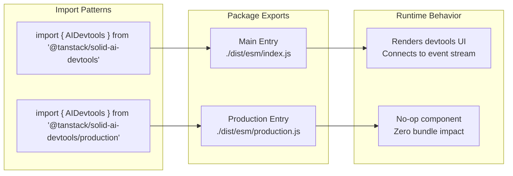

**Sources:** [packages/typescript/solid-ai-devtools/package.json:14-26]()

### Export Configuration

The package defines two entry points:

- **Main export** (`"."`): Full devtools implementation at `./dist/esm/index.js`
- **Production export** (`"./production"`): No-op implementation at `./dist/esm/production.js`

**Sources:** [packages/typescript/solid-ai-devtools/package.json:15-25]()

### Build Configuration

The package uses `vite-plugin-solid` to compile Solid components:

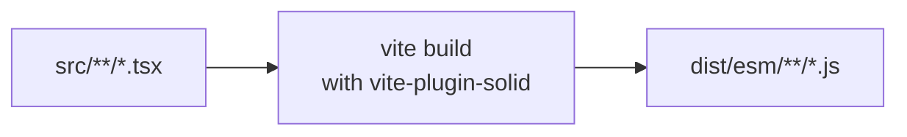

**Sources:** [packages/typescript/solid-ai-devtools/package.json:32](), [packages/typescript/solid-ai-devtools/package.json:56]()

### Peer Dependencies

The package requires `solid-js >=1.9.7` as a peer dependency, ensuring compatibility with Solid's reactivity system:

[packages/typescript/solid-ai-devtools/package.json:58-60]()

## React Devtools Implementation

The React devtools package follows the same pattern as Solid devtools with React-specific lifecycle management.

**Diagram: React Devtools Package Structure**

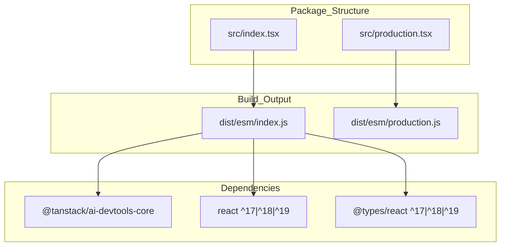

### Package Configuration

The React devtools package supports React versions 17, 18, and 19 through peer dependencies:

[packages/typescript/react-ai-devtools/package.json:54-56]()

The package exports follow the standard two-entry pattern:

[packages/typescript/react-ai-devtools/package.json:30-43]()

**Sources:** [packages/typescript/react-ai-devtools/package.json:1-64]()

## Preact Devtools Implementation

The Preact devtools package provides integration for Preact applications, following the same architectural pattern.

**Diagram: Preact Devtools Package Structure**

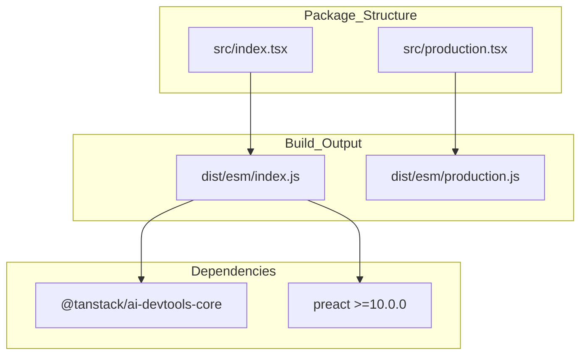

### Peer Dependencies

The Preact package requires `preact >=10.0.0` as a peer dependency, providing compatibility with modern Preact versions.

**Sources:** Inferred from framework integration patterns

## Production Build Strategy

All framework devtools packages implement a production build strategy that eliminates devtools code from production bundles through conditional imports.

**Diagram: Production Build Strategy**

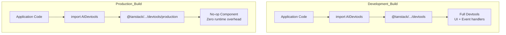

### Implementation Pattern

Framework-specific packages expose two entry points:

1. **Main entry** (`"."`) - Contains full devtools implementation
2. **Production entry** (`"./production"`) - Contains no-op stub

**Sources:** [packages/typescript/solid-ai-devtools/package.json:15-25](), [packages/typescript/ai-devtools/package.json:15-24]()

### Usage Pattern

Applications conditionally import the appropriate entry point based on environment:

```typescript
// Recommended pattern for build-time tree shaking
import { AIDevtools } from process.env.NODE_ENV === 'production'
  ? '@tanstack/solid-ai-devtools/production'
  : '@tanstack/solid-ai-devtools';

// Alternative: Separate imports with build tool configuration
// vite.config.ts can alias production path in production builds
```

This ensures devtools code is completely excluded from production builds without runtime overhead.

## Integration Patterns

### Solid Integration

**Diagram: Solid Devtools Lifecycle**

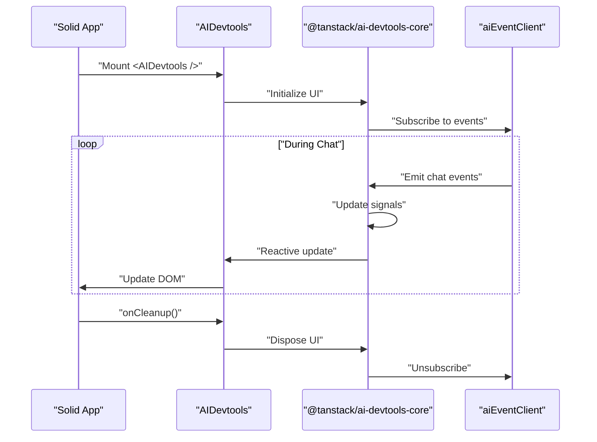

**Sources:** Inferred from [packages/typescript/solid-ai-devtools/package.json:49-60]() and Solid patterns

### React Integration

**Diagram: React Devtools Lifecycle**

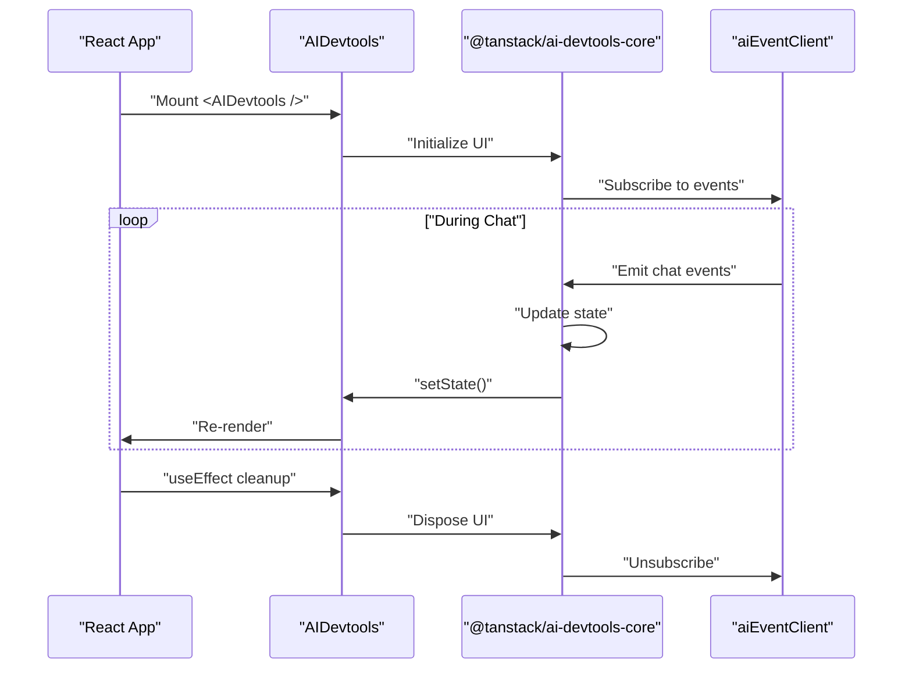

**Sources:** Inferred from [packages/typescript/react-ai-devtools/package.json:54-56]()

### Preact Integration

**Diagram: Preact Devtools Lifecycle**


**Sources:** Inferred from Preact patterns similar to React integration

## Core Devtools Dependency

Both framework packages depend on `@tanstack/ai-devtools-core`, which provides:

### Core Capabilities

| Feature                | Implementation             | Description                                                         |
| ---------------------- | -------------------------- | ------------------------------------------------------------------- |
| **Event Subscription** | `aiEventClient`            | Connects to `@tanstack/ai` event client to receive chat events      |
| **UI Rendering**       | `@tanstack/devtools-ui`    | Provides consistent devtools interface across frameworks            |
| **Utilities**          | `@tanstack/devtools-utils` | Common devtools patterns and helpers                                |
| **Styling**            | `goober`                   | CSS-in-JS styling with zero runtime CSS overhead                    |
| **Reactivity**         | `solid-js`                 | Efficient reactive UI updates using Solid's fine-grained reactivity |

**Sources:** [packages/typescript/ai-devtools/package.json:48-54]()

### Core Dependencies

**Diagram: Core Devtools Dependencies**

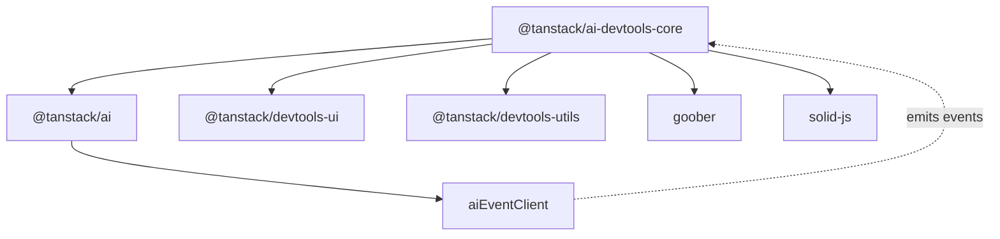

**Sources:** [packages/typescript/ai-devtools/package.json:48-54](), [packages/typescript/ai/package.json:24-27]()

## Build System Integration

### Vite Configuration

All devtools packages use Vite for building with framework-specific plugins where needed.

**Diagram: Vite Build Configuration**

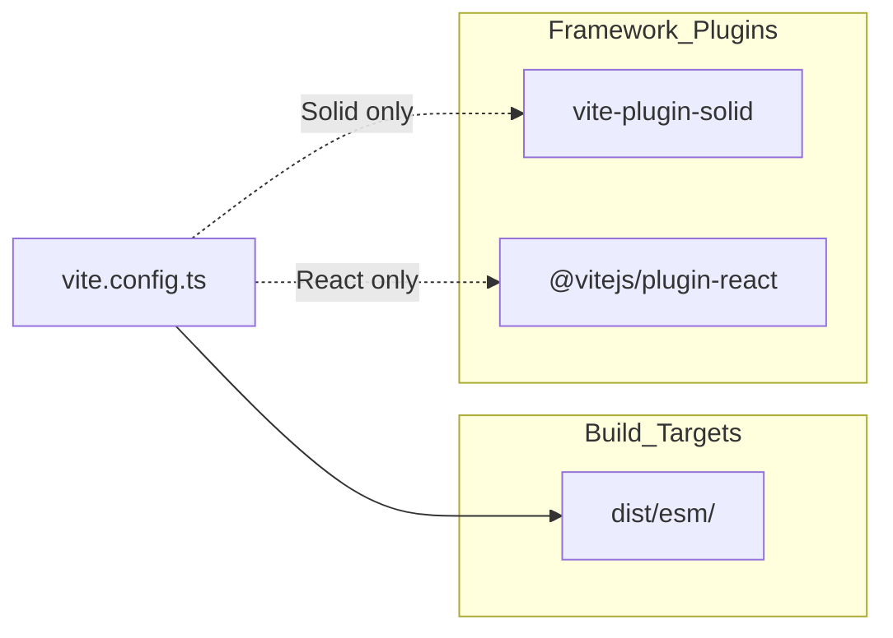

**Sources:** [packages/typescript/solid-ai-devtools/package.json:32](), [packages/typescript/solid-ai-devtools/package.json:60]()

### Package Scripts

Standard build scripts across all devtools packages:

| Script        | Command                  | Purpose                       |
| ------------- | ------------------------ | ----------------------------- |
| `build`       | `vite build`             | Compile TypeScript to ESM     |
| `clean`       | `premove ./build ./dist` | Remove build artifacts        |
| `test:build`  | `publint --strict`       | Validate package.json exports |
| `test:eslint` | `eslint ./src`           | Lint source code              |
| `test:types`  | `tsc`                    | Type check without emitting   |

**Sources:** [packages/typescript/solid-ai-devtools/package.json:31-39](), [packages/typescript/ai-devtools/package.json:30-38]()

## Type Safety

Framework-specific packages maintain full type safety through:

1. **TypeScript definitions** - Each package exports `.d.ts` files alongside JavaScript
2. **Peer dependency types** - React package requires `@types/react >=18.0.0`
3. **Core devtools types** - Inherit type definitions from `@tanstack/ai-devtools-core`

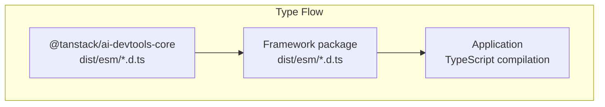

**Sources:** [packages/typescript/solid-ai-devtools/package.json:14](), [packages/typescript/ai-devtools/package.json:13]()

## Package Publishing

### Files Included in NPM Package

Both packages include only essential files in npm distributions:

```json
"files": [
  "dist",
  "src"
]
```

This ensures:

- Built outputs in `dist/` are available for runtime
- Source code in `src/` is available for source maps and debugging
- Development artifacts (tests, config) are excluded

**Sources:** [packages/typescript/solid-ai-devtools/package.json:27-30](), [packages/typescript/ai-devtools/package.json:26-29]()

### Module Resolution

All packages output ES modules only (`"type": "module"`):

```json
{
  "type": "module",
  "module": "./dist/esm/index.js",
  "types": "./dist/esm/index.d.ts"
}
```

This provides:

- Tree-shaking support in modern bundlers
- Native ES module support in Node.js 18+
- Simplified module resolution without dual packages

**Sources:** [packages/typescript/solid-ai-devtools/package.json:12-14](), [packages/typescript/ai-devtools/package.json:12-14]()

## Testing Infrastructure

### Test Configuration

Framework-specific packages use Vitest with `--passWithNoTests` flag:

```json
"test:lib": "vitest --passWithNoTests"
```

This allows packages to pass CI even without tests, which is appropriate for thin wrapper packages that primarily delegate to core devtools.

**Sources:** [packages/typescript/solid-ai-devtools/package.json:37](), [packages/typescript/ai-devtools/package.json:36]()

### Coverage

Core devtools includes coverage configuration:

```json
"test:coverage": "vitest run --coverage",
"test:coverage:watch": "vitest --coverage --watch"
```

Coverage is collected using `@vitest/coverage-v8` for accurate instrumentation of the devtools UI code.

**Sources:** Inferred from [packages/typescript/ai-devtools/package.json:55-56]() (devDependencies)
