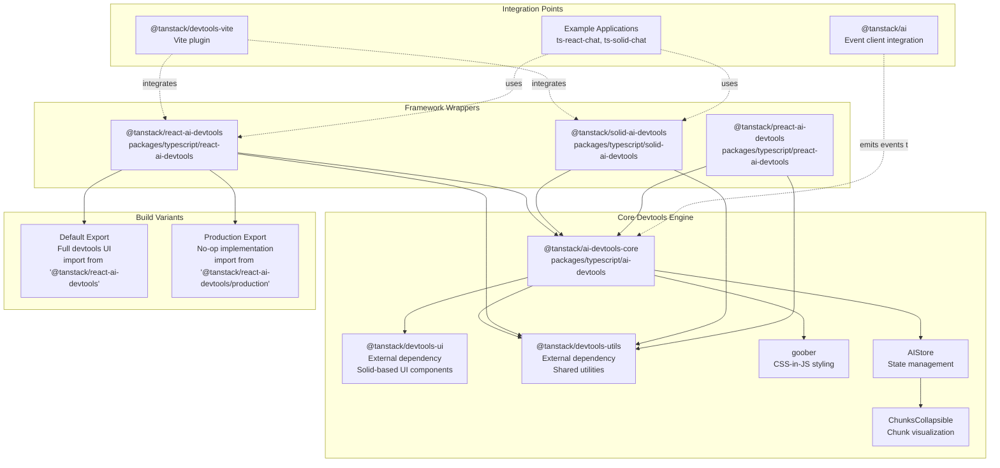
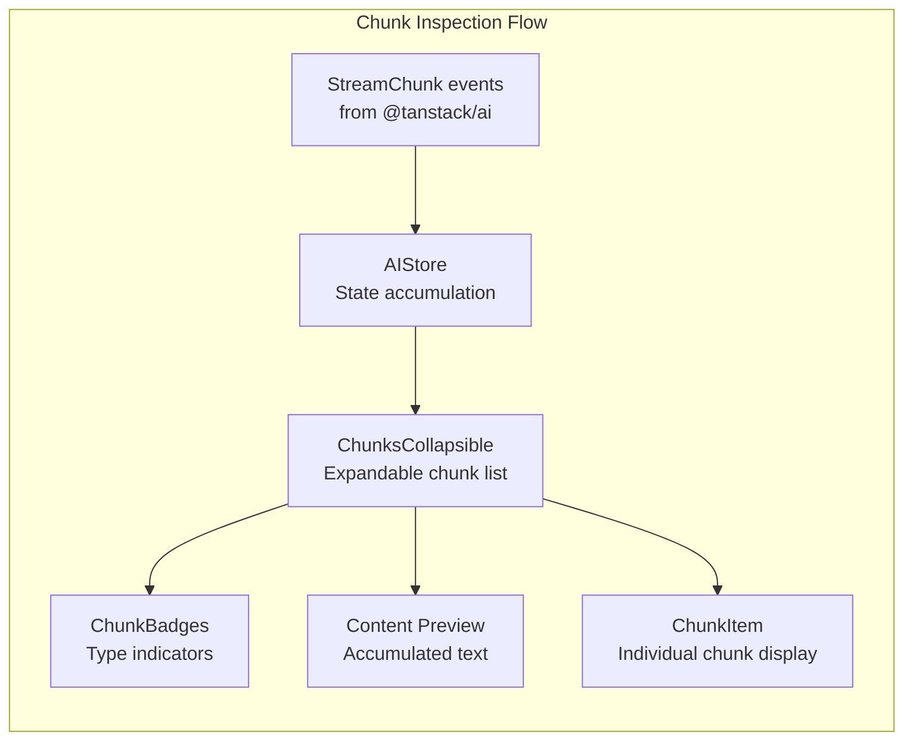
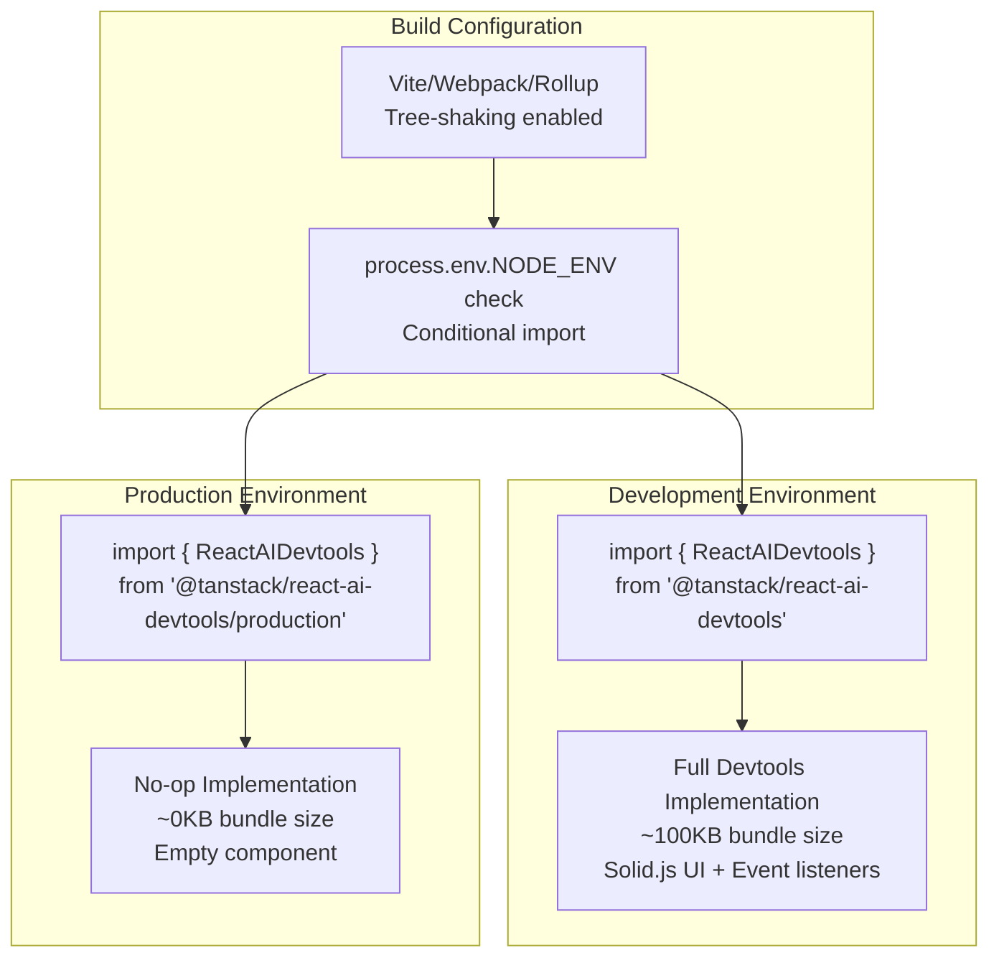
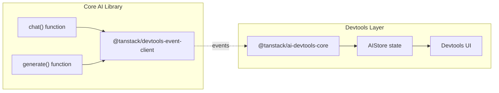

# Developer Tools

<details>
<summary>Relevant source files</summary>

The following files were used as context for generating this wiki page:

- [docs/getting-started/devtools.md](docs/getting-started/devtools.md)
- [examples/vanilla-chat/package.json](examples/vanilla-chat/package.json)
- [packages/typescript/ai-client/package.json](packages/typescript/ai-client/package.json)
- [packages/typescript/ai-devtools/package.json](packages/typescript/ai-devtools/package.json)
- [packages/typescript/ai/package.json](packages/typescript/ai/package.json)
- [packages/typescript/preact-ai-devtools/CHANGELOG.md](packages/typescript/preact-ai-devtools/CHANGELOG.md)
- [packages/typescript/preact-ai-devtools/README.md](packages/typescript/preact-ai-devtools/README.md)
- [packages/typescript/preact-ai-devtools/package.json](packages/typescript/preact-ai-devtools/package.json)
- [packages/typescript/preact-ai-devtools/src/AiDevtools.tsx](packages/typescript/preact-ai-devtools/src/AiDevtools.tsx)
- [packages/typescript/preact-ai-devtools/src/index.ts](packages/typescript/preact-ai-devtools/src/index.ts)
- [packages/typescript/preact-ai-devtools/src/plugin.tsx](packages/typescript/preact-ai-devtools/src/plugin.tsx)
- [packages/typescript/react-ai-devtools/package.json](packages/typescript/react-ai-devtools/package.json)
- [packages/typescript/solid-ai-devtools/package.json](packages/typescript/solid-ai-devtools/package.json)

</details>

This document describes the debugging and inspection tools provided by TanStack AI for monitoring AI interactions during development. These tools enable developers to inspect streaming responses, view message history, track tool calls, and debug conversation flows.

For information about the core AI functionality being debugged, see [Core Library](#3). For framework integration patterns that use these devtools, see [Framework Integrations](#6).

---

## Overview

The TanStack AI devtools ecosystem consists of three layers:

1. **Core devtools engine** (`@tanstack/ai-devtools-core`) - A framework-agnostic visualization and inspection engine built with Solid.js
2. **Framework-specific wrappers** - React, Solid, and Preact packages that provide idiomatic integration patterns for each framework
3. **Production build variants** - Tree-shakeable production exports that compile to no-ops

All devtools packages provide dual exports: a full-featured development build at the default import and a production no-op build at the `/production` subpath.

---

## Devtools Package Architecture



**Sources:** [packages/typescript/ai-devtools/package.json:1-61](), [packages/typescript/react-ai-devtools/package.json:1-64](), [packages/typescript/solid-ai-devtools/package.json:1-62](), [pnpm-lock.yaml:651-680]()

---

## Core Devtools Package Structure

| Property             | Value                                                                                     | Description                |
| -------------------- | ----------------------------------------------------------------------------------------- | -------------------------- |
| **Package Name**     | `@tanstack/ai-devtools-core`                                                              | Core devtools engine       |
| **Version**          | `0.1.2`                                                                                   | Current release version    |
| **Entry Point**      | `./dist/esm/index.js`                                                                     | Main development build     |
| **Production Entry** | `./dist/esm/production.js`                                                                | No-op production build     |
| **Key Dependencies** | `@tanstack/ai`, `@tanstack/devtools-ui`, `@tanstack/devtools-utils`, `goober`, `solid-js` | Runtime dependencies       |
| **Build Tool**       | `vite build`                                                                              | Uses Vite for bundling     |
| **UI Framework**     | Solid.js                                                                                  | Internal UI implementation |

The core package architecture uses Solid.js as its UI framework, even when consumed by React or Preact applications. This allows the devtools to maintain a single, consistent UI implementation across all framework wrappers.

**Sources:** [packages/typescript/ai-devtools/package.json:1-61]()

---

## Framework-Specific Wrapper Packages

### React Devtools

```typescript
// Package: @tanstack/react-ai-devtools
// Location: packages/typescript/react-ai-devtools

// Development usage
import { ReactAIDevtools } from '@tanstack/react-ai-devtools'

// Production usage (no-op)
import { ReactAIDevtools } from '@tanstack/react-ai-devtools/production'
```

| Property                 | Value                                                                                         |
| ------------------------ | --------------------------------------------------------------------------------------------- |
| **Package Name**         | `@tanstack/react-ai-devtools`                                                                 |
| **Peer Dependencies**    | `react: ^17.0.0 \|\| ^18.0.0 \|\| ^19.0.0`, `@types/react: ^17.0.0 \|\| ^18.0.0 \|\| ^19.0.0` |
| **Core Dependency**      | `@tanstack/ai-devtools-core` (workspace)                                                      |
| **Utilities Dependency** | `@tanstack/devtools-utils: ^0.2.3`                                                            |

**Sources:** [packages/typescript/react-ai-devtools/package.json:1-64]()

### Solid Devtools

```typescript
// Package: @tanstack/solid-ai-devtools
// Location: packages/typescript/solid-ai-devtools

// Development usage
import { SolidAIDevtools } from '@tanstack/solid-ai-devtools'

// Production usage (no-op)
import { SolidAIDevtools } from '@tanstack/solid-ai-devtools/production'
```

| Property                 | Value                                    |
| ------------------------ | ---------------------------------------- |
| **Package Name**         | `@tanstack/solid-ai-devtools`            |
| **Peer Dependencies**    | `solid-js: >=1.9.7`                      |
| **Core Dependency**      | `@tanstack/ai-devtools-core` (workspace) |
| **Utilities Dependency** | `@tanstack/devtools-utils: ^0.2.3`       |

**Sources:** [packages/typescript/solid-ai-devtools/package.json:1-62]()

### Preact Devtools

```typescript
// Package: @tanstack/preact-ai-devtools
// Location: packages/typescript/preact-ai-devtools

// Expected usage pattern (similar to React)
import { PreactAIDevtools } from '@tanstack/preact-ai-devtools'
import { PreactAIDevtools } from '@tanstack/preact-ai-devtools/production'
```

The Preact devtools package follows the same pattern as React and Solid, providing a thin wrapper around the core devtools engine with Preact-specific lifecycle integration.

**Sources:** [pnpm-lock.yaml:1-100]()

---

## Devtools Capabilities

### Stream Inspection

The devtools provide real-time visualization of streaming AI responses. The core component for this is `ChunksCollapsible`, which displays individual chunks with metadata.



The `ChunksCollapsible` component provides:

- Aggregate chunk count with badge indicators
- Expandable/collapsible chunk list
- Accumulated content preview for text chunks
- Individual chunk details with type-specific rendering

**Sources:** [packages/typescript/ai-devtools/src/components/conversation/ChunksCollapsible.tsx:1-56]()

### Chunk Display Implementation

```typescript
// From: packages/typescript/ai-devtools/src/components/conversation/ChunksCollapsible.tsx

interface ChunksCollapsibleProps {
  chunks: Array<Chunk>
}

// Key features:
// 1. Accumulated content calculation
const accumulatedContent = () =>
  props.chunks
    .filter((c) => c.type === 'content' && (c.content || c.delta))
    .map((c) => c.delta || c.content)
    .join('')

// 2. Total raw chunk count
const totalRawChunks = () =>
  props.chunks.reduce((sum, c) => sum + (c.chunkCount || 1), 0)

// 3. Expandable details with summary
<details class={styles().conversationDetails.chunksDetails}>
  <summary>
    {totalRawChunks()} chunks
    <ChunkBadges chunks={props.chunks} />
    <div class={contentPreview}>{accumulatedContent()}</div>
  </summary>
  <div>
    <For each={props.chunks}>
      {(chunk, index) => <ChunkItem chunk={chunk} index={index()} />}
    </For>
  </div>
</details>
```

**Sources:** [packages/typescript/ai-devtools/src/components/conversation/ChunksCollapsible.tsx:8-56]()

### Message History Visualization

The devtools maintain a conversation store (`AIStore`) that tracks:

- Complete message history with role information
- Message part structure (text, tool calls, tool results)
- Chunk-level granularity for each message
- Temporal ordering and streaming state

### Tool Call Tracking

The devtools visualize:

- Tool call initiation with input schemas
- Tool execution state (pending, executing, complete)
- Tool results and errors
- Approval flow states for tools requiring user confirmation

---

## Integration Patterns

### Vite Plugin Integration

Example applications use `@tanstack/devtools-vite` for seamless development integration:

```typescript
// Example: ts-react-chat and ts-solid-chat
// From: pnpm-lock.yaml dependencies

devDependencies: {
  '@tanstack/devtools-vite': '^0.3.11'
}
```

The Vite plugin provides:

- Automatic devtools injection in development
- Conditional compilation for production builds
- WebSocket communication for devtools panel

**Sources:** [pnpm-lock.yaml:147-149](), [pnpm-lock.yaml:413-415]()

### Example Application Usage

#### React Integration Example

```typescript
// From: examples/ts-react-chat
// Dependencies from pnpm-lock.yaml:286-288

import { ReactAIDevtools } from '@tanstack/react-ai-devtools'

function App() {
  return (
    <>
      <ChatInterface />
      <ReactAIDevtools />
    </>
  )
}
```

#### Solid Integration Example

```typescript
// From: examples/ts-solid-chat
// Dependencies from pnpm-lock.yaml:361-363

import { SolidAIDevtools } from '@tanstack/solid-ai-devtools'

function App() {
  return (
    <>
      <ChatInterface />
      <SolidAIDevtools />
    </>
  )
}
```

**Sources:** [pnpm-lock.yaml:286-288](), [pnpm-lock.yaml:361-363]()

---

## Production Build Strategy

### Tree-Shaking Architecture



### Export Structure

Each framework wrapper provides dual exports:

| Export Path                              | Purpose                   | Bundle Impact                     |
| ---------------------------------------- | ------------------------- | --------------------------------- |
| `@tanstack/react-ai-devtools`            | Full development devtools | ~100KB (Solid.js + UI components) |
| `@tanstack/react-ai-devtools/production` | No-op production build    | ~0KB (empty component)            |
| `@tanstack/solid-ai-devtools`            | Full development devtools | ~100KB (Solid.js + UI components) |
| `@tanstack/solid-ai-devtools/production` | No-op production build    | ~0KB (empty component)            |

**Sources:** [packages/typescript/react-ai-devtools/package.json:30-42](), [packages/typescript/solid-ai-devtools/package.json:15-25]()

---

## Event Client Integration

The devtools consume events from `@tanstack/ai` via the devtools event client:



The event client provides:

- Chunk-level streaming events
- Tool call lifecycle events
- Message boundary markers
- Error and completion signals

**Sources:** [packages/typescript/ai/package.json:57-59](), [packages/typescript/ai-devtools/package.json:48-53]()

---

## Build and Test Configuration

### Core Devtools Build Setup

```json
// From: packages/typescript/ai-devtools/package.json:30-38

"scripts": {
  "build": "vite build",
  "clean": "premove ./build ./dist",
  "test:build": "publint --strict",
  "test:eslint": "eslint ./src",
  "test:lib": "vitest --passWithNoTests",
  "test:types": "tsc"
}
```

The build process uses:

- **Vite** for bundling with ESM output
- **publint** for package.json validation
- **Vitest** for unit testing
- **TypeScript** for type checking
- **ESLint** for code linting

**Sources:** [packages/typescript/ai-devtools/package.json:30-38]()

### Framework Wrapper Build Setup

React and Solid devtools packages use identical build configurations:

```json
// Pattern shared across react-ai-devtools and solid-ai-devtools

"scripts": {
  "build": "vite build",
  "test:build": "publint --strict",
  "test:types": "tsc",
  "test:lib": "vitest --passWithNoTests"
}
```

**Sources:** [packages/typescript/react-ai-devtools/package.json:17-25](), [packages/typescript/solid-ai-devtools/package.json:31-39]()

---

## Nx Task Dependencies

The devtools packages integrate with the monorepo's Nx task orchestration:

```json
// From: nx.json:27-60

"targetDefaults": {
  "build": {
    "cache": true,
    "dependsOn": ["^build"],
    "inputs": ["production", "^production"],
    "outputs": ["{projectRoot}/build", "{projectRoot}/dist"]
  },
  "test:lib": {
    "cache": true,
    "dependsOn": ["^build"],
    "inputs": ["default", "^production"]
  },
  "test:types": {
    "cache": true,
    "dependsOn": ["^build"],
    "inputs": ["default", "^production"]
  }
}
```

This ensures:

1. Core devtools builds before framework wrappers
2. Test runs use cached production builds
3. Type checking validates against built declarations

**Sources:** [nx.json:27-60]()

---

## CI/CD Integration

### Release Workflow

```yaml
# From: .github/workflows/release.yml

- name: Run Tests
  run: pnpm run test:ci

- name: Run Changesets (version or publish)
  uses: changesets/action@v1.5.3
  with:
    version: pnpm run changeset:version
    publish: pnpm run changeset:publish
```

The devtools packages follow the monorepo's coordinated release process:

1. All tests run before publishing (including devtools tests)
2. Changesets manages version bumping across packages
3. Documentation regenerates post-publish

**Sources:** [.github/workflows/release.yml:32-43]()

### Autofix Workflow

```yaml
# From: .github/workflows/autofix.yml

- name: Fix formatting
  run: pnpm format

- name: Apply fixes
  uses: autofix-ci/action@635ffb0c9798bd160680f18fd73371e355b85f27
```

Devtools source files participate in automated formatting and linting fixes.

**Sources:** [.github/workflows/autofix.yml:24-27]()
