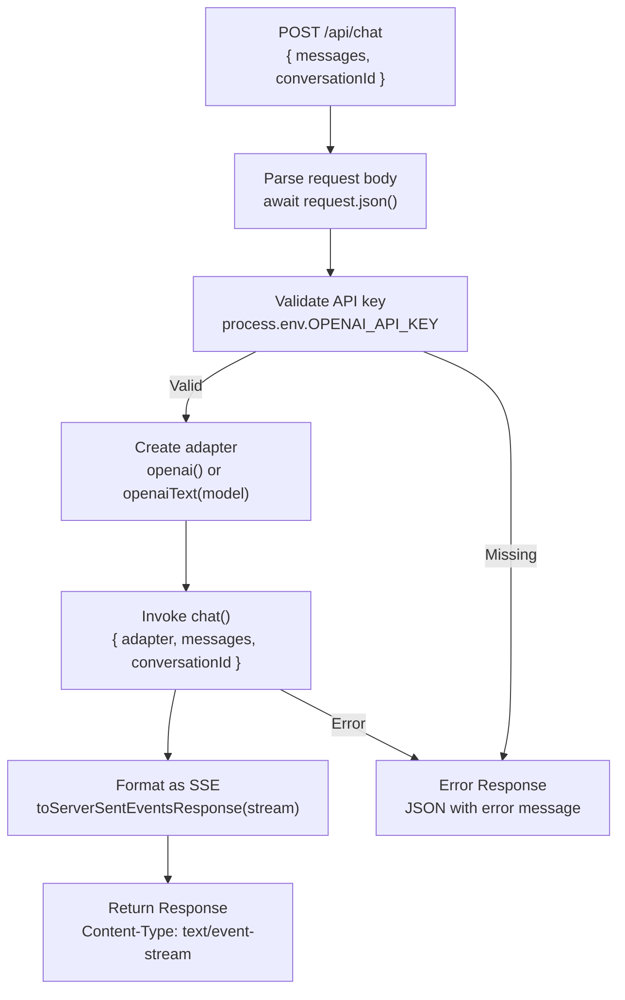
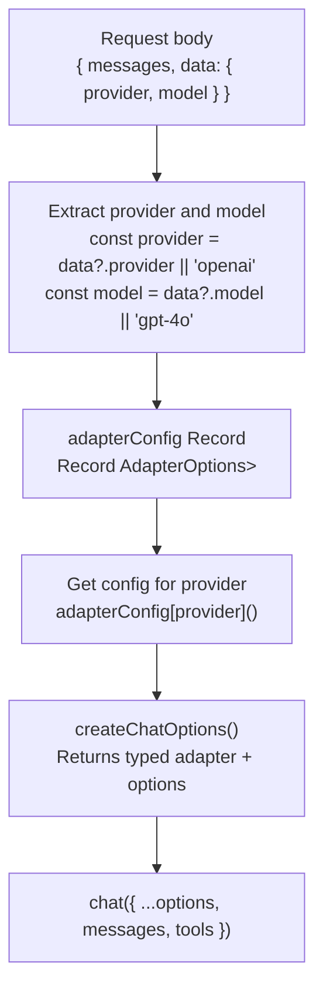
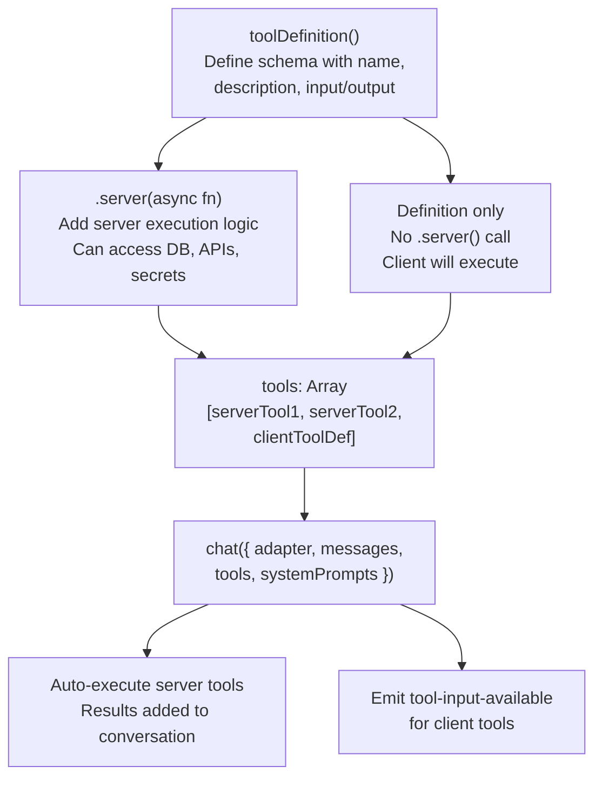

# API Route Implementation Patterns

<details>
<summary>Relevant source files</summary>

The following files were used as context for generating this wiki page:

- [docs/adapters/anthropic.md](docs/adapters/anthropic.md)
- [docs/adapters/gemini.md](docs/adapters/gemini.md)
- [docs/adapters/ollama.md](docs/adapters/ollama.md)
- [docs/adapters/openai.md](docs/adapters/openai.md)
- [docs/getting-started/quick-start.md](docs/getting-started/quick-start.md)
- [examples/ts-react-chat/src/lib/model-selection.ts](examples/ts-react-chat/src/lib/model-selection.ts)
- [examples/ts-react-chat/src/routes/api.tanchat.ts](examples/ts-react-chat/src/routes/api.tanchat.ts)
- [packages/typescript/ai-gemini/src/adapters/text.ts](packages/typescript/ai-gemini/src/adapters/text.ts)
- [packages/typescript/ai-gemini/src/model-meta.ts](packages/typescript/ai-gemini/src/model-meta.ts)
- [packages/typescript/ai-gemini/src/text/text-provider-options.ts](packages/typescript/ai-gemini/src/text/text-provider-options.ts)
- [packages/typescript/ai-gemini/tests/gemini-adapter.test.ts](packages/typescript/ai-gemini/tests/gemini-adapter.test.ts)
- [packages/typescript/ai-openai/live-tests/tool-test-empty-object.ts](packages/typescript/ai-openai/live-tests/tool-test-empty-object.ts)
- [packages/typescript/ai/src/activities/chat/stream/processor.ts](packages/typescript/ai/src/activities/chat/stream/processor.ts)

</details>

This page documents common patterns for implementing chat API routes with TanStack AI. These patterns show how to structure API endpoints that use the `chat()` function, select provider adapters, configure tools, and handle streaming responses.

For information about the core `chat()` function, see [chat() and generate() Functions](#3.1). For provider adapter details, see [AI Provider Adapters](#3.3).

---

## Overview

API routes in TanStack AI follow a consistent pattern across frameworks:

1. **Parse Request** - Extract messages, provider selection, and options from request body
2. **Select Adapter** - Choose and configure the appropriate provider adapter
3. **Configure Chat** - Set up tools, system prompts, and model options
4. **Stream Response** - Format the streaming output for client consumption

This page demonstrates these patterns using examples from the codebase, with emphasis on type-safe adapter configuration and flexible provider switching.

Sources: [docs/getting-started/quick-start.md:1-262](), [examples/ts-react-chat/src/routes/api.tanchat.ts:1-171]()

---

## Basic API Route Pattern

The minimal API route implementation follows this structure:



**Basic API Route Flow**

The basic pattern validates the API key, creates an adapter, invokes `chat()`, and formats the streaming response. Error handling returns JSON responses with appropriate status codes.

### TanStack Start Implementation

```typescript
// Location: API route handler
// Pattern from: docs/getting-started/quick-start.md:30-75

POST /api/chat handler:
  1. Check for OPENAI_API_KEY in process.env
  2. If missing, return JSON error with status 500
  3. Parse request body: { messages, conversationId }
  4. Create stream: chat({ adapter: openai(), messages, model: "gpt-4o", conversationId })
  5. Return toServerSentEventsResponse(stream)
  6. Catch errors and return JSON error responses
```

The handler extracts `messages` and optional `conversationId` from the request body. The `openai()` adapter factory uses `OPENAI_API_KEY` from environment variables automatically.

Sources: [docs/getting-started/quick-start.md:23-76]()

### Next.js Implementation

```typescript
// Location: app/api/chat/route.ts
// Pattern from: docs/getting-started/quick-start.md:80-122

export async function POST(request: Request):
  1. Check for OPENAI_API_KEY
  2. Parse request.json() for messages and conversationId
  3. Create stream: chat({ adapter: openaiText("gpt-4o"), messages, conversationId })
  4. Return toServerSentEventsResponse(stream)
  5. Catch and format errors
```

Next.js uses the `openaiText()` adapter factory with explicit model selection. Both patterns follow the same core structure but adapt to their respective framework conventions.

Sources: [docs/getting-started/quick-start.md:78-122]()

---

## Multi-Provider Adapter Selection

A common pattern is to allow the client to select which AI provider to use. This requires maintaining a type-safe configuration for each provider.



**Multi-Provider Selection Flow**

The adapter configuration map provides type-safe access to provider-specific options. The `createChatOptions()` helper ensures the adapter and its options are correctly typed.

### Adapter Configuration Map Pattern

```typescript
// Location: examples/ts-react-chat/src/routes/api.tanchat.ts:71-117
// Type definition: examples/ts-react-chat/src/routes/api.tanchat.ts:22

type Provider = 'openai' | 'anthropic' | 'gemini' | 'ollama' | 'grok'

// Pre-define typed adapter configurations with full type inference
const adapterConfig: Record<Provider, () => { adapter: AnyTextAdapter }> = {
  anthropic: () =>
    createChatOptions({
      adapter: anthropicText(
        (model || 'claude-sonnet-4-5') as 'claude-sonnet-4-5'
      ),
    }),
  gemini: () =>
    createChatOptions({
      adapter: geminiText((model || 'gemini-2.5-flash') as 'gemini-2.5-flash'),
      modelOptions: {
        thinkingConfig: { includeThoughts: true, thinkingBudget: 100 },
      },
    }),
  grok: () =>
    createChatOptions({
      adapter: grokText((model || 'grok-3') as 'grok-3'),
      modelOptions: {},
    }),
  ollama: () =>
    createChatOptions({
      adapter: ollamaText((model || 'gpt-oss:120b') as 'gpt-oss:120b'),
      modelOptions: { think: 'low', options: { top_k: 1 } },
      temperature: 12,
    }),
  openai: () =>
    createChatOptions({
      adapter: openaiText((model || 'gpt-4o') as 'gpt-4o'),
      temperature: 2,
      modelOptions: {},
    }),
}

// Get typed adapter options
const options = adapterConfig[provider]()
```

This pattern provides:

- **Type Safety** - `createChatOptions()` infers adapter-specific option types
- **Centralization** - All provider configurations in one place
- **Extensibility** - Easy to add new providers
- **Default Values** - Fallback models for each provider

Sources: [examples/ts-react-chat/src/routes/api.tanchat.ts:76-117]()

### Provider-Specific Model Options

Each provider adapter accepts different `modelOptions`. The type system enforces correct options for each provider:

| Provider  | Common Options                             | Provider-Specific Options                           |
| --------- | ------------------------------------------ | --------------------------------------------------- |
| OpenAI    | `temperature`, `maxTokens`, `topP`         | `reasoning.effort`, `tool_choice`, `stream_options` |
| Anthropic | `temperature`, `maxTokens`                 | `thinking.budget_tokens`, `thinking.type`           |
| Gemini    | `temperature`, `maxTokens`, `topP`, `topK` | `thinkingConfig`, `safetySettings`, `cachedContent` |
| Ollama    | `temperature`, `topP`, `topK`              | `num_gpu`, `num_ctx`, `think`                       |
| Grok      | `temperature`, `maxTokens`                 | Standard text options                               |

Sources: [packages/typescript/ai-gemini/src/model-meta.ts:1-998](), [docs/adapters/gemini.md:102-139](), [docs/adapters/openai.md:101-133](), [docs/adapters/anthropic.md:101-133](), [docs/adapters/ollama.md:120-137]()

---

## Tool Configuration Pattern

Tools can be added to API routes by passing them to the `chat()` function. The route can include both server tools (with execution logic) and client tool definitions (for client-side execution).



**Tool Configuration Pattern**

Server tools execute automatically during the chat loop. Client tool definitions (without `.server()`) signal to the client that it should handle execution.

### Server Tool Implementation

```typescript
// Location: examples/ts-react-chat/src/routes/api.tanchat.ts:46-52, 128-134
// Tool definitions: examples/ts-react-chat/src/lib/guitar-tools.ts (referenced)

// Server tool with execution logic
const addToCartToolServer = addToCartToolDef.server((args) => ({
  success: true,
  cartId: 'CART_' + Date.now(),
  guitarId: args.guitarId,
  quantity: args.quantity,
  totalItems: args.quantity,
}))

// Mix of server tools and client tool definitions
const stream = chat({
  ...options,
  tools: [
    getGuitars, // Server tool - executes on server
    recommendGuitarToolDef, // No .server() - client executes
    addToCartToolServer, // Server tool with implementation
    addToWishListToolDef, // Client tool definition
    getPersonalGuitarPreferenceToolDef, // Client tool definition
  ],
  systemPrompts: [SYSTEM_PROMPT],
  agentLoopStrategy: maxIterations(20),
  messages,
  abortController,
  conversationId,
})
```

Key tool patterns:

- **Server Tools** - Include `.server()` implementation for automatic execution
- **Client Tools** - Pass definition only (no `.server()`) to signal client execution
- **Mixed Arrays** - Combine both server and client tools in the same array
- **Agent Loop** - Use `maxIterations()` to limit auto-execution cycles

Sources: [examples/ts-react-chat/src/routes/api.tanchat.ts:46-52](), [examples/ts-react-chat/src/routes/api.tanchat.ts:128-140]()

### Tool Execution Flow

The `chat()` function automatically:

1. Detects when the LLM calls a tool
2. Checks if the tool has `.server()` implementation
3. If yes: Executes the tool and adds result to conversation
4. If no: Emits `tool-input-available` chunk for client handling
5. Continues the conversation with tool results

See [Isomorphic Tool System](#3.2) for detailed tool architecture.

Sources: [examples/ts-react-chat/src/routes/api.tanchat.ts:125-141](), [docs/guides/tools.md:234-262]()

---

## System Prompts and Instructions

System prompts provide instructions to the LLM. They can be added as an array of strings:

```typescript
// Location: examples/ts-react-chat/src/routes/api.tanchat.ts:24-45, 135

const SYSTEM_PROMPT = `You are a helpful assistant for a guitar store.

CRITICAL INSTRUCTIONS - YOU MUST FOLLOW THIS EXACT WORKFLOW:

When a user asks for a guitar recommendation:
1. FIRST: Use the getGuitars tool (no parameters needed)
2. SECOND: Use the recommendGuitar tool with the ID of the guitar
3. NEVER write a recommendation directly - ALWAYS use the recommendGuitar tool

IMPORTANT:
- The recommendGuitar tool will display the guitar in a special format
- You MUST use recommendGuitar for ANY guitar recommendation
- ONLY recommend guitars from our inventory (use getGuitars first)
- The recommendGuitar tool has a buy button - this is how customers purchase
- Do NOT describe the guitar yourself - let the recommendGuitar tool do it`

const stream = chat({
  adapter: openaiText('gpt-4o'),
  messages,
  tools: [getGuitars, recommendGuitarToolDef, ...],
  systemPrompts: [SYSTEM_PROMPT], // Array of instructions
  agentLoopStrategy: maxIterations(20),
})
```

System prompts are particularly useful for:

- **Tool Usage Instructions** - Guiding when and how to call tools
- **Workflow Enforcement** - Specifying exact sequences of actions
- **Constraints** - Limiting what the LLM should/shouldn't do
- **Context Setting** - Establishing the assistant's role and domain

Sources: [examples/ts-react-chat/src/routes/api.tanchat.ts:24-45](), [examples/ts-react-chat/src/routes/api.tanchat.ts:135]()

---

## Agent Loop Configuration

The `agentLoopStrategy` option controls automatic tool execution cycles:

```typescript
// Location: examples/ts-react-chat/src/routes/api.tanchat.ts:4-6, 136
// Import: import { maxIterations } from '@tanstack/ai'

const stream = chat({
  adapter: openaiText('gpt-4o'),
  messages,
  tools: [getGuitars, recommendGuitarToolDef, ...],
  systemPrompts: [SYSTEM_PROMPT],
  agentLoopStrategy: maxIterations(20), // Maximum 20 tool execution cycles
  conversationId,
})
```

The agent loop allows the LLM to:

1. Call a tool
2. Receive the tool's output
3. Process the output and potentially call another tool
4. Repeat until done or max iterations reached

Without `agentLoopStrategy`, tool execution stops after one round. The `maxIterations()` helper prevents infinite loops in multi-step tool workflows.

Common values:

- `maxIterations(1)` - Single tool call allowed
- `maxIterations(5)` - Up to 5 sequential tool calls
- `maxIterations(20)` - Complex multi-step workflows

Sources: [examples/ts-react-chat/src/routes/api.tanchat.ts:3-7](), [examples/ts-react-chat/src/routes/api.tanchat.ts:136]()

---

## Abort Signal Handling

Proper abort signal handling prevents resource leaks when clients disconnect:

```typescript
// Location: examples/ts-react-chat/src/routes/api.tanchat.ts:58-66, 138-141, 154-156

export async function POST({ request }) {
  // Capture request signal BEFORE reading body
  const requestSignal = request.signal

  // Check if already aborted
  if (requestSignal.aborted) {
    return new Response(null, { status: 499 }) // Client Closed Request
  }

  // Create abort controller for chat
  const abortController = new AbortController()

  const body = await request.json()
  const { messages, data } = body

  try {
    const stream = chat({
      adapter: openaiText('gpt-4o'),
      messages,
      tools: [...],
      abortController, // Pass abort controller
      conversationId,
    })

    // Pass abort controller to SSE response formatter
    return toServerSentEventsResponse(stream, { abortController })
  } catch (error: any) {
    // Check if error is due to abort
    if (error.name === 'AbortError' || abortController.signal.aborted) {
      return new Response(null, { status: 499 })
    }
    // ... other error handling
  }
}
```

Abort handling pattern:

1. **Capture Signal Early** - Get `request.signal` before consuming the body
2. **Check Initial State** - Return early if already aborted
3. **Create Controller** - Make an `AbortController` for the chat stream
4. **Pass to chat()** - Include `abortController` in options
5. **Pass to Formatter** - Include `abortController` in `toServerSentEventsResponse()`
6. **Handle Abort Errors** - Return 499 status for client disconnections

This prevents orphaned streams that continue after clients disconnect, saving API costs and server resources.

Sources: [examples/ts-react-chat/src/routes/api.tanchat.ts:58-66](), [examples/ts-react-chat/src/routes/api.tanchat.ts:138-141](), [examples/ts-react-chat/src/routes/api.tanchat.ts:154-156]()

---

## Error Handling Pattern

Robust error handling includes validation, API errors, and abort handling:

```typescript
// Location: examples/ts-react-chat/src/routes/api.tanchat.ts:119-166

export async function POST({ request }) {
  const requestSignal = request.signal

  if (requestSignal.aborted) {
    return new Response(null, { status: 499 })
  }

  const abortController = new AbortController()
  const body = await request.json()
  const { messages, data } = body

  // Extract provider and model
  const provider: Provider = data?.provider || 'openai'
  const model: string = data?.model || 'gpt-4o'
  const conversationId: string | undefined = data?.conversationId

  try {
    // Get typed adapter options
    const options = adapterConfig[provider]()

    const stream = chat({
      ...options,
      tools: [...],
      systemPrompts: [SYSTEM_PROMPT],
      agentLoopStrategy: maxIterations(20),
      messages,
      abortController,
      conversationId,
    })

    return toServerSentEventsResponse(stream, { abortController })
  } catch (error: any) {
    console.error('[API Route] Error in chat request:', {
      message: error?.message,
      name: error?.name,
      status: error?.status,
      statusText: error?.statusText,
      code: error?.code,
      type: error?.type,
      stack: error?.stack,
      error: error,
    })

    // If request was aborted, return early (don't send error response)
    if (error.name === 'AbortError' || abortController.signal.aborted) {
      return new Response(null, { status: 499 })
    }

    // Return JSON error for other failures
    return new Response(
      JSON.stringify({
        error: error.message || 'An error occurred',
      }),
      {
        status: 500,
        headers: { 'Content-Type': 'application/json' },
      }
    )
  }
}
```

Error handling checklist:

- ✓ Check `requestSignal.aborted` before processing
- ✓ Create `AbortController` for the chat stream
- ✓ Log detailed error information
- ✓ Distinguish abort errors from other errors
- ✓ Return 499 status for client disconnections
- ✓ Return JSON error responses with 500 status for failures
- ✓ Include error message in response body

Sources: [examples/ts-react-chat/src/routes/api.tanchat.ts:119-166]()

### Response Format Selection

The TypeScript SDK provides multiple response formatting utilities:

| Function                       | Return Type                  | Protocol | Use Case                               |
| ------------------------------ | ---------------------------- | -------- | -------------------------------------- |
| `toServerSentEventsResponse()` | `Response`                   | SSE      | TanStack Start, Next.js, standard HTTP |
| `toServerSentEventsStream()`   | `ReadableStream<string>`     | SSE      | Custom streaming implementations       |
| `toHttpStream()`               | `ReadableStream<Uint8Array>` | NDJSON   | Alternative to SSE                     |

All formatters accept an optional `{ abortController }` parameter for proper cleanup on client disconnection.

Sources: [docs/getting-started/quick-start.md:59](), [docs/getting-started/quick-start.md:109]()

---

## Request Validation Pattern

Validate incoming requests to ensure they contain required fields:

```typescript
export async function POST({ request }) {
  // Parse request body
  const body = await request.json()

  // Destructure with defaults
  const {
    messages, // Required: conversation history
    data = {}, // Optional: client metadata
  } = body

  // Validate messages array
  if (!messages || !Array.isArray(messages)) {
    return new Response(JSON.stringify({ error: 'Invalid messages array' }), {
      status: 400,
      headers: { 'Content-Type': 'application/json' },
    })
  }

  // Extract optional parameters with defaults
  const provider: Provider = data?.provider || 'openai'
  const model: string = data?.model || getDefaultModel(provider)
  const conversationId: string | undefined = data?.conversationId

  // Proceed with validated inputs
  const stream = chat({
    adapter: getAdapter(provider, model),
    messages,
    conversationId,
  })
}
```

Validation checklist:

- Verify `messages` is an array
- Provide defaults for optional parameters
- Return 400 status for invalid requests
- Extract provider and model from `data` object
- Use type-safe parameter extraction

Sources: [examples/ts-react-chat/src/routes/api.tanchat.ts:68-74](), [docs/getting-started/quick-start.md:47-48]()

---

## Framework-Specific Implementations

Different frameworks provide different patterns for implementing API routes, but all follow the same core logic.

### Framework Comparison

| Framework      | Route Definition                 | Request Type                  | Response Helper                |
| -------------- | -------------------------------- | ----------------------------- | ------------------------------ |
| TanStack Start | `createFileRoute('/api/chat')`   | `{ request: Request }`        | `toServerSentEventsResponse()` |
| Next.js        | `export async function POST()`   | `Request`                     | `toServerSentEventsResponse()` |
| SvelteKit      | `export async function POST()`   | `RequestEvent`                | `toServerSentEventsResponse()` |
| Express        | `app.post('/api/chat')`          | `req: Request, res: Response` | Manual SSE writing             |
| Remix          | `export async function action()` | `ActionFunctionArgs`          | `toServerSentEventsResponse()` |

All frameworks receive messages via POST body and return SSE streams. The core `chat()` invocation is identical across frameworks.

Sources: [docs/getting-started/quick-start.md:23-76](), [docs/getting-started/quick-start.md:78-122]()

### TanStack Start Pattern

```typescript
// File: src/routes/api.chat.ts
import { createFileRoute } from '@tanstack/react-router'
import { chat, toServerSentEventsResponse } from '@tanstack/ai'

export const Route = createFileRoute('/api/chat')({
  server: {
    handlers: {
      POST: async ({ request }) => {
        const { messages, conversationId } = await request.json()
        const stream = chat({ adapter: openai(), messages, conversationId })
        return toServerSentEventsResponse(stream)
      },
    },
  },
})
```

Sources: [docs/getting-started/quick-start.md:30-75]()

### Next.js App Router Pattern

```typescript
// File: app/api/chat/route.ts
import { chat, toServerSentEventsResponse } from '@tanstack/ai'
import { openaiText } from '@tanstack/ai-openai'

export async function POST(request: Request) {
  const { messages, conversationId } = await request.json()
  const stream = chat({
    adapter: openaiText('gpt-4o'),
    messages,
    conversationId,
  })
  return toServerSentEventsResponse(stream)
}
```

Sources: [docs/getting-started/quick-start.md:80-121]()

---

## Summary

The server examples demonstrate various approaches to integrating TanStack AI on the backend:

1. **Node.js/Express** - Standalone Express servers with explicit route handling
2. **SvelteKit** - Full-stack framework with file-based API routes
3. **TanStack Start** - Server functions with seamless client integration
4. **PHP Slim** - PHP proxy implementation with manual SSE formatting
5. **Python FastAPI** - Python async implementation with native streaming

All follow the same core pattern:

1. Receive POST request with messages and options
2. Call `chat()` (or equivalent) with provider adapter
3. Format stream as SSE or HTTP stream
4. Return streaming response to client

For client-side integration, see [Framework Integrations](#6). For the core `chat()` function, see [chat() Function](#3.1).

Sources: [packages/typescript/smoke-tests/e2e/package.json:1-39](), [examples/ts-vue-chat/package.json:1-40](), [examples/ts-svelte-chat/package.json:1-41]()
