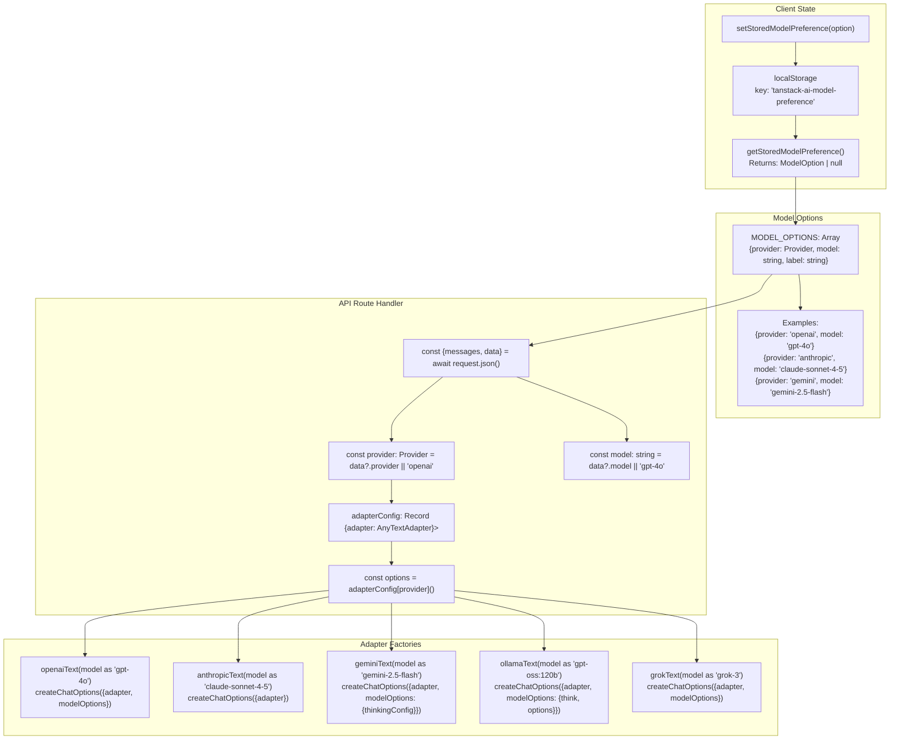
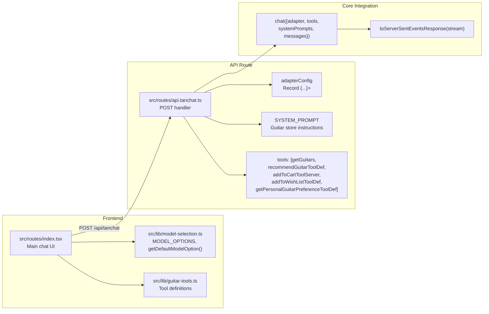
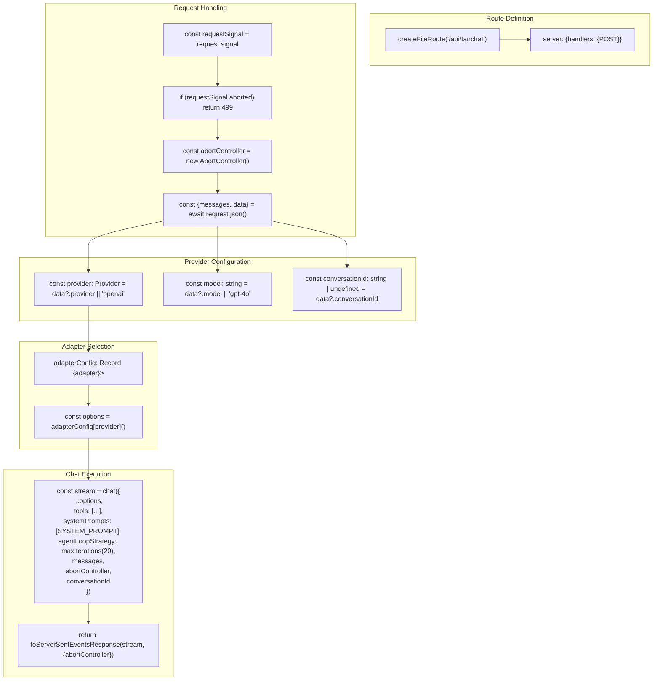
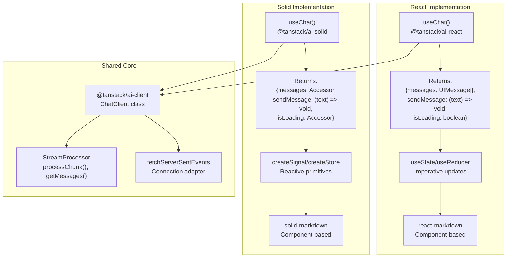
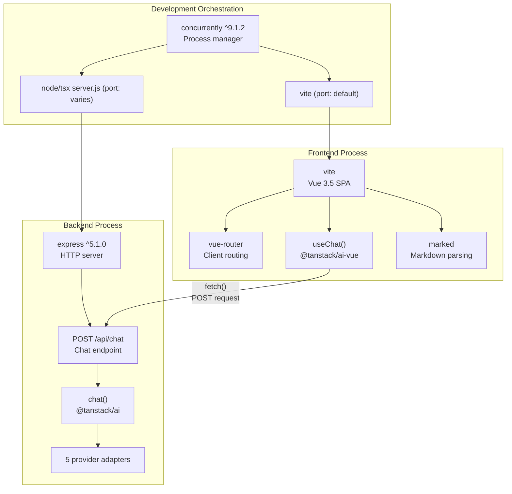
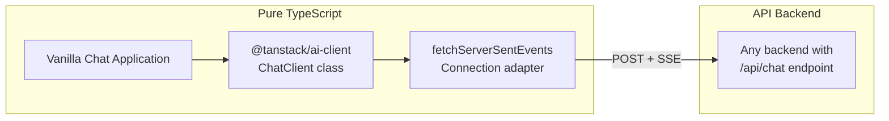
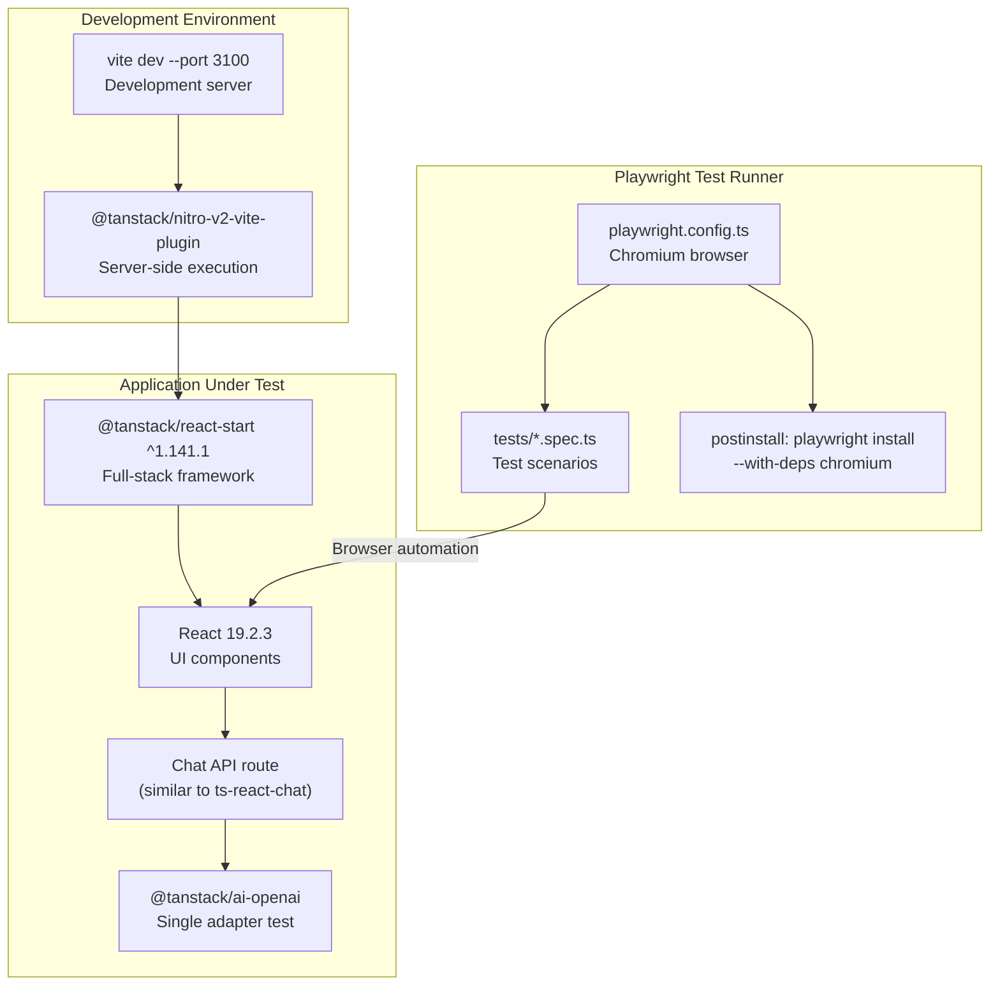

# Full-Stack Chat Examples

<details>
<summary>Relevant source files</summary>

The following files were used as context for generating this wiki page:

- [docs/adapters/anthropic.md](docs/adapters/anthropic.md)
- [docs/adapters/gemini.md](docs/adapters/gemini.md)
- [docs/adapters/ollama.md](docs/adapters/ollama.md)
- [docs/adapters/openai.md](docs/adapters/openai.md)
- [docs/getting-started/quick-start.md](docs/getting-started/quick-start.md)
- [examples/ts-react-chat/src/lib/model-selection.ts](examples/ts-react-chat/src/lib/model-selection.ts)
- [examples/ts-react-chat/src/routes/api.tanchat.ts](examples/ts-react-chat/src/routes/api.tanchat.ts)
- [examples/ts-svelte-chat/CHANGELOG.md](examples/ts-svelte-chat/CHANGELOG.md)
- [examples/ts-svelte-chat/package.json](examples/ts-svelte-chat/package.json)
- [examples/ts-vue-chat/CHANGELOG.md](examples/ts-vue-chat/CHANGELOG.md)
- [examples/ts-vue-chat/package.json](examples/ts-vue-chat/package.json)
- [packages/typescript/ai-gemini/CHANGELOG.md](packages/typescript/ai-gemini/CHANGELOG.md)
- [packages/typescript/ai-gemini/src/adapters/text.ts](packages/typescript/ai-gemini/src/adapters/text.ts)
- [packages/typescript/ai-gemini/src/model-meta.ts](packages/typescript/ai-gemini/src/model-meta.ts)
- [packages/typescript/ai-gemini/src/text/text-provider-options.ts](packages/typescript/ai-gemini/src/text/text-provider-options.ts)
- [packages/typescript/ai-gemini/tests/gemini-adapter.test.ts](packages/typescript/ai-gemini/tests/gemini-adapter.test.ts)
- [packages/typescript/ai-openai/CHANGELOG.md](packages/typescript/ai-openai/CHANGELOG.md)
- [packages/typescript/ai-openai/live-tests/tool-test-empty-object.ts](packages/typescript/ai-openai/live-tests/tool-test-empty-object.ts)
- [packages/typescript/ai/src/activities/chat/stream/processor.ts](packages/typescript/ai/src/activities/chat/stream/processor.ts)
- [packages/typescript/smoke-tests/adapters/CHANGELOG.md](packages/typescript/smoke-tests/adapters/CHANGELOG.md)
- [packages/typescript/smoke-tests/adapters/package.json](packages/typescript/smoke-tests/adapters/package.json)
- [packages/typescript/smoke-tests/e2e/CHANGELOG.md](packages/typescript/smoke-tests/e2e/CHANGELOG.md)
- [packages/typescript/smoke-tests/e2e/package.json](packages/typescript/smoke-tests/e2e/package.json)

</details>

## Purpose and Scope

This page documents the example applications included in the TanStack AI repository. These examples demonstrate full-stack chat implementations across different frameworks (React, Solid, Svelte, Vue) and a vanilla TypeScript implementation. Each example showcases provider selection, tool calling, markdown rendering, and streaming chat responses.

For information about API route implementation patterns in general, see [API Route Implementation Patterns](#10.2). For provider-specific configuration details, see [Provider Configuration Examples](#10.3).

## Example Applications Overview

The repository includes five full-stack chat examples and two smoke test suites:

| Example                   | Framework                        | Backend        | Features                                                                                                 | Port |
| ------------------------- | -------------------------------- | -------------- | -------------------------------------------------------------------------------------------------------- | ---- |
| ts-react-chat             | React 19 + TanStack Router/Start | TanStack Start | All 5 providers, guitar store tools, markdown with react-markdown, syntax highlighting with highlight.js | 3000 |
| ts-solid-chat             | Solid 5.20 + SolidKit 2.15       | SolidKit       | All 5 providers, markdown with solid-markdown, syntax highlighting with marked-highlight                 | 3000 |
| ts-svelte-chat            | Svelte 5 + SvelteKit             | SvelteKit      | All 5 providers, markdown with marked, syntax highlighting with highlight.js                             | 3000 |
| ts-vue-chat               | Vue 3.5 + Vue Router             | Express        | All 5 providers, markdown with marked, concurrent dev servers                                            | 3000 |
| vanilla-chat              | Pure TypeScript                  | None           | @tanstack/ai-client only, no framework dependencies                                                      | N/A  |
| @tanstack/tests-adapters  | N/A                              | CLI            | Schema transformation tests, function calling validation for all 5 adapters                              | N/A  |
| @tanstack/smoke-tests-e2e | React + TanStack Start           | TanStack Start | Playwright browser automation, full-stack chat testing with OpenAI only                                  | 3100 |

**Sources:** [examples/ts-react-chat/package.json:1-41](), [examples/ts-solid-chat/package.json:1-42](), [examples/ts-svelte-chat/package.json:1-42](), [examples/ts-vue-chat/package.json:1-41](), [packages/typescript/smoke-tests/adapters/package.json:1-31](), [packages/typescript/smoke-tests/e2e/package.json:1-40]()

## Common Architecture Patterns

All framework examples follow a similar architecture pattern with variations in framework-specific implementations.

### Request/Response Flow

Request/Response Flow with Actual Code Entities

```mermaid
sequenceDiagram
    participant Browser
    participant useChat as "useChat()<br/>@tanstack/ai-react"
    participant APIRoute as "/api/tanchat<br/>Route.server.handlers.POST"
    participant chatFn as "chat()<br/>@tanstack/ai"
    participant Adapter as "openaiText(model)<br/>anthropicText(model)<br/>geminiText(model)"
    participant Provider as "OpenAI/Anthropic/Gemini<br/>API"

    Browser->>useChat: "sendMessage(text)"
    useChat->>useChat: "messages: UIMessage[]"
    useChat->>APIRoute: "POST {messages, data: {provider, model, conversationId}}"

    APIRoute->>APIRoute: "const {messages, data} = await request.json()"
    APIRoute->>APIRoute: "const provider = data?.provider"
    APIRoute->>APIRoute: "const options = adapterConfig[provider]()"
    APIRoute->>chatFn: "chat({adapter, messages, tools, systemPrompts,<br/>conversationId, agentLoopStrategy})"
    chatFn->>Adapter: "adapter.chatStream(options)"
    Adapter->>Provider: "HTTP POST (streaming)"

    loop Stream Processing
        Provider-->>Adapter: "Provider-specific chunk"
        Adapter->>Adapter: "Normalize to StreamChunk"
        Adapter-->>chatFn: "ContentStreamChunk | ToolCallStreamChunk"
        chatFn-->>APIRoute: "AsyncIterable<StreamChunk>"
        APIRoute->>APIRoute: "toServerSentEventsResponse(stream, {abortController})"
        APIRoute-->>useChat: "SSE: data: {type, ...}\
\
"
        useChat->>useChat: "StreamProcessor.processChunk()"
        useChat-->>Browser: "Re-render with updated messages"
    end

    Provider-->>Adapter: "Finish"
    Adapter-->>chatFn: "DoneStreamChunk"
    chatFn-->>APIRoute: "Stream complete"
    APIRoute-->>useChat: "SSE: [DONE]"
    useChat->>useChat: "isLoading = false"
```

**Sources:** [examples/ts-react-chat/src/routes/api.tanchat.ts:54-170](), [packages/typescript/ai/src/activities/chat/stream/processor.ts:168-462]()

### Provider Selection Architecture

Provider Selection Implementation with Code Entities



**Sources:** [examples/ts-react-chat/src/lib/model-selection.ts:1-126](), [examples/ts-react-chat/src/routes/api.tanchat.ts:68-117]()

## React Example (ts-react-chat)

The React example uses TanStack Router and TanStack Start for full-stack integration.

### Key Files and Structure



**Sources:** [examples/ts-react-chat/src/routes/api.tanchat.ts:1-171](), [examples/ts-react-chat/src/lib/model-selection.ts:1-126]()

### API Route Implementation

The React example's API route at [examples/ts-react-chat/src/routes/api.tanchat.ts:54-170]() demonstrates the canonical pattern.

#### Route Structure



#### Implementation Details

**Abort Handling:**
The route carefully manages request cancellation to prevent memory leaks:

- [Line 59](): Captures `request.signal` before reading body (body consumption may mark request as aborted)
- [Lines 62-64](): Returns HTTP 499 (Client Closed Request) if already aborted
- [Line 66](): Creates local `AbortController` for the chat stream
- [Lines 154-156](): Catches `AbortError` and returns 499 instead of 500

**Provider Configuration Pattern:**
[Lines 78-117]() define `adapterConfig` as a typed map from `Provider` to adapter factory functions:

| Provider    | Factory Call                                  | Model Options                                                  |
| ----------- | --------------------------------------------- | -------------------------------------------------------------- |
| `anthropic` | `anthropicText(model as 'claude-sonnet-4-5')` | None                                                           |
| `gemini`    | `geminiText(model as 'gemini-2.5-flash')`     | `thinkingConfig: {includeThoughts: true, thinkingBudget: 100}` |
| `grok`      | `grokText(model as 'grok-3')`                 | None                                                           |
| `ollama`    | `ollamaText(model as 'gpt-oss:120b')`         | `think: 'low', options: {top_k: 1}`                            |
| `openai`    | `openaiText(model as 'gpt-4o')`               | `temperature: 2`                                               |

Each factory returns `createChatOptions()` result for type safety. Model strings are cast to specific model types for autocomplete.

**Tool Configuration:**
[Lines 128-134]() pass 5 tools to `chat()`:

| Tool                                 | Type   | Implementation                                                |
| ------------------------------------ | ------ | ------------------------------------------------------------- |
| `getGuitars`                         | Server | Returns guitar inventory from database                        |
| `recommendGuitarToolDef`             | Client | `.def` only, client handles display                           |
| `addToCartToolServer`                | Server | `addToCartToolDef.server((args) => ({success, cartId, ...}))` |
| `addToWishListToolDef`               | Client | `.def` only                                                   |
| `getPersonalGuitarPreferenceToolDef` | Client | `.def` only                                                   |

**System Prompt:**
[Lines 24-45]() define `SYSTEM_PROMPT` with explicit workflow instructions:

1. First call `getGuitars()` tool (no parameters)
2. Then call `recommendGuitar(id)` tool with selected guitar ID
3. Never write recommendations directly - always use `recommendGuitar` tool

This ensures the LLM uses tools instead of generating unformatted text responses.

**Agent Loop Configuration:**
[Line 136]() sets `agentLoopStrategy: maxIterations(20)` to allow multi-turn tool execution cycles with a safety limit of 20 iterations.

**Error Handling:**
[Lines 143-166]() implement comprehensive error handling:

- Logs error details with structured metadata (message, name, status, code, type, stack)
- Detects abort errors and returns 499 status
- Returns 500 with JSON error message for other failures

**Sources:** [examples/ts-react-chat/src/routes/api.tanchat.ts:1-171]()

### Dependencies

React Example Package Dependencies

| Package                  | Version      | Purpose                                                                                            |
| ------------------------ | ------------ | -------------------------------------------------------------------------------------------------- |
| `@tanstack/ai`           | workspace:\* | Core functions: `chat()`, `createChatOptions()`, `toServerSentEventsResponse()`, `maxIterations()` |
| `@tanstack/ai-client`    | workspace:\* | `ChatClient` class for headless state management                                                   |
| `@tanstack/ai-react`     | workspace:\* | `useChat()` hook, `fetchServerSentEvents()` connection adapter                                     |
| `@tanstack/ai-openai`    | workspace:\* | `openaiText()` adapter factory                                                                     |
| `@tanstack/ai-anthropic` | workspace:\* | `anthropicText()` adapter factory                                                                  |
| `@tanstack/ai-gemini`    | workspace:\* | `geminiText()` adapter factory                                                                     |
| `@tanstack/ai-ollama`    | workspace:\* | `ollamaText()` adapter factory                                                                     |
| `@tanstack/ai-grok`      | workspace:\* | `grokText()` adapter factory                                                                       |
| `@tanstack/react-router` | Latest       | `createFileRoute()`, routing                                                                       |
| `@tanstack/react-start`  | Latest       | Full-stack framework, server handlers                                                              |
| `react`                  | ^19.2.3      | UI framework                                                                                       |
| `react-dom`              | ^19.2.3      | DOM rendering                                                                                      |
| `zod`                    | ^4.2.0       | Schema validation for tools                                                                        |

**UI Dependencies:**

- `react-markdown` - Markdown rendering for assistant messages
- `highlight.js` - Syntax highlighting in code blocks
- `lucide-react` - Icon components for UI elements
- `tailwindcss` - Styling via `@tailwindcss/vite` plugin

**Sources:** [examples/ts-react-chat/src/routes/api.tanchat.ts:1-20](), pattern from similar examples in monorepo

## Solid Example (ts-solid-chat)

The Solid example implements the same API route pattern but uses Solid-specific primitives.

### Framework-Specific Implementation

Solid vs React: Core Differences



### Key Differences

**State Management:**

- React: Returns plain arrays and booleans, uses `useState()` internally
- Solid: Returns `Accessor<T>` functions for reactive values, uses `createSignal()` internally
- Both use the same `ChatClient` from `@tanstack/ai-client` under the hood

**Markdown Rendering:**

- React: `react-markdown` package
- Solid: `solid-markdown` package
- Both support syntax highlighting via `marked-highlight`

**Backend Framework:**

- React example: TanStack Start (integrated with TanStack Router)
- Solid example: SolidKit 2.15 (Solid's full-stack framework)

**Build Configuration:**

- React: Vite with `@vitejs/plugin-react`
- Solid: Vite with `@sveltejs/vite-plugin-svelte` (note: likely uses Solid-specific plugin)

**Dependencies:**
All 5 provider adapters are included:

- `@tanstack/ai-openai`
- `@tanstack/ai-anthropic`
- `@tanstack/ai-gemini`
- `@tanstack/ai-ollama`
- `@tanstack/ai-grok` (not listed but implied from pattern)

**Sources:** [examples/ts-solid-chat/package.json:14-27](), [packages/typescript/ai/src/activities/chat/stream/processor.ts:168-217]()

## Svelte Example (ts-svelte-chat)

The Svelte example uses SvelteKit for full-stack integration with Svelte 5 runes support.

### Framework-Specific Implementation

**Package Dependencies:**

| Package               | Purpose                                                  |
| --------------------- | -------------------------------------------------------- |
| `@tanstack/ai-svelte` | `useChat()` binding for Svelte                           |
| `marked`              | Markdown parsing (no Svelte-specific markdown component) |
| `marked-highlight`    | Syntax highlighting integration                          |
| `highlight.js`        | Actual syntax highlighting engine                        |
| `lucide-svelte`       | Icon components                                          |

**State Management:**

- Svelte 5 uses runes (`$state`, `$derived`, `$effect`) for reactivity
- `useChat()` from `@tanstack/ai-svelte` returns stores compatible with runes
- No explicit store creation needed in component code

**Backend Framework:**

- SvelteKit provides full-stack capabilities
- API routes defined in `+server.ts` files
- Uses `@sveltejs/adapter-auto` for deployment flexibility

**Build Configuration:**

- `@sveltejs/vite-plugin-svelte` for Vite integration
- `@sveltejs/package` for building packages (if library mode)
- Port: 3000 (via `--port 3000` flag in dev script)

**Sources:** [examples/ts-svelte-chat/package.json:14-27]()

## Vue Example (ts-vue-chat)

The Vue example uses a separate Express backend instead of a framework-specific backend solution.

### Dual-Server Architecture

Vue Example: Frontend + Backend Separation



### Key Characteristics

**Separation of Concerns:**

- Frontend: Pure Vue 3.5 SPA with Vite build tooling
- Backend: Standalone Express server with chat endpoint
- Communication: HTTP POST requests (no framework coupling)

**Development Workflow:**

- `concurrently` runs both processes simultaneously
- Vite dev server handles frontend with HMR
- Express server runs separately (likely with `tsx` or `node`)
- No tight framework integration like TanStack Start or SvelteKit

**Package Dependencies:**

| Package               | Purpose                                      |
| --------------------- | -------------------------------------------- |
| `@tanstack/ai-vue`    | `useChat()` composable                       |
| `@tanstack/ai-vue-ui` | Pre-built Vue components                     |
| `vue-router`          | Client-side routing                          |
| `marked`              | Markdown parsing (no Vue-specific component) |
| `express`             | Backend HTTP server                          |
| `concurrently`        | Run frontend + backend in dev                |

**API Route Pattern:**
The Express backend follows the same pattern as other examples:

1. Extract `{messages, data: {provider, model}}` from request body
2. Select adapter from `adapterConfig` map
3. Call `chat()` with adapter, messages, tools
4. Return `toServerSentEventsResponse(stream)`

**Sources:** [examples/ts-vue-chat/package.json:1-41]()

## Vanilla Example (vanilla-chat)

The vanilla example demonstrates using TanStack AI without any framework dependencies.

### Minimal Architecture



**Key Characteristics:**

- Only depends on `@tanstack/ai-client` package
- No framework-specific hooks or primitives
- Direct usage of `ChatClient` class
- Manual DOM manipulation for UI updates
- Demonstrates the framework-agnostic core

**Sources:** Referenced in Diagram 7 from high-level system architecture

## Smoke Tests

The repository includes two test suites for automated validation.

### Adapter Smoke Tests (@tanstack/tests-adapters)

**Purpose:** CLI-based validation of provider adapters with schema transformation and tool calling.

**Location:** `packages/typescript/smoke-tests/adapters/`

**Test Coverage:**

| Adapter Package          | Test Focus                               |
| ------------------------ | ---------------------------------------- |
| `@tanstack/ai-openai`    | Schema validation, tool calls, streaming |
| `@tanstack/ai-anthropic` | Schema validation, tool calls, streaming |
| `@tanstack/ai-gemini`    | Schema validation, tool calls, streaming |
| `@tanstack/ai-ollama`    | Schema validation, tool calls, streaming |
| `@tanstack/ai-grok`      | Schema validation, tool calls, streaming |

**Implementation:**

- Entry point: `src/cli.ts` - Run with `pnpm start` or `tsx src/cli.ts`
- Uses `commander` (^13.1.0) for CLI argument parsing
- Uses `zod` (^4.2.0) for schema definition and validation
- Uses `@alcyone-labs/zod-to-json-schema` (^4.0.10) for schema transformation tests

**Test Scenarios:**

1. Schema transformation from Zod to JSON Schema
2. Tool definition validation
3. Function calling with various input schemas
4. Streaming response processing
5. Error handling validation

**Sources:** [packages/typescript/smoke-tests/adapters/package.json:1-31]()

### E2E Smoke Tests (@tanstack/smoke-tests-e2e)

**Purpose:** Browser automation testing of full-stack chat workflows.

**Location:** `packages/typescript/smoke-tests/e2e/`

**Test Architecture:**

E2E Test Infrastructure



**Package Dependencies:**

| Package                 | Version      | Purpose                          |
| ----------------------- | ------------ | -------------------------------- |
| `@playwright/test`      | ^1.57.0      | Browser automation framework     |
| `@tanstack/react-start` | ^1.141.1     | Full-stack React framework       |
| `@tanstack/ai-openai`   | workspace:\* | OpenAI adapter (single provider) |
| `@tanstack/ai-react`    | workspace:\* | `useChat()` hook                 |
| `@tanstack/ai-client`   | workspace:\* | Client-side state                |
| `@tanstack/ai`          | workspace:\* | Core `chat()` function           |

**Configuration:**

- Port: 3100 (to avoid conflicts with other examples on 3000)
- Browser: Chromium only (auto-installed via postinstall)
- Test command: `npx playwright test`
- UI mode: `npx playwright test --ui`

**Testing Strategy:**

- Tests only OpenAI adapter (representative, avoids API key proliferation)
- Validates streaming chat responses
- Tests tool calling workflows
- Validates UI state updates
- Tests error handling scenarios

**Sources:** [packages/typescript/smoke-tests/e2e/package.json:1-40]()

## Running the Examples

### Prerequisites

All examples require:

1. Node.js (version specified in package.json engines if present)
2. pnpm (workspace package manager)
3. API keys for the providers you want to test

### Setting Up API Keys

Each example requires provider API keys set as environment variables:

```bash
# OpenAI
OPENAI_API_KEY=sk-...

# Anthropic
ANTHROPIC_API_KEY=sk-ant-...

# Google (Gemini)
GEMINI_API_KEY=...

# Ollama (runs locally, no key needed)
# Default endpoint: http://localhost:11434

# Grok
GROK_API_KEY=xai-...
```

Create a `.env.local` file in the example directory or set these in your environment.

### Running Framework Examples

From the repository root:

```bash
# Install dependencies
pnpm install

# Run specific example
cd examples/ts-react-chat
pnpm dev

# Or from root with workspace commands
pnpm --filter ts-react-chat dev
```

Each framework example typically runs on port 3000 by default.

### Running Smoke Tests

**Adapter Tests:**

```bash
cd packages/typescript/smoke-tests/adapters
pnpm start
```

**E2E Tests:**

```bash
cd packages/typescript/smoke-tests/e2e

# Start dev server
pnpm dev

# In another terminal, run tests
pnpm test:e2e

# Or run in UI mode
pnpm test:e2e:ui
```

**Sources:** [packages/typescript/smoke-tests/adapters/package.json:9-11](), [packages/typescript/smoke-tests/e2e/package.json:7-13]()

## Example Comparison Matrix

| Feature                 | React               | Solid              | Svelte        | Vue                    | Vanilla  |
| ----------------------- | ------------------- | ------------------ | ------------- | ---------------------- | -------- |
| **Framework Version**   | React 19            | Solid 5.20         | Svelte 5      | Vue 3.5                | None     |
| **Backend**             | TanStack Start      | SolidKit 2.15      | SvelteKit     | Express                | External |
| **State Management**    | useState/useReducer | Signals (Accessor) | Stores/Runes  | Refs (Composition API) | Manual   |
| **Markdown Library**    | react-markdown      | solid-markdown     | marked        | marked                 | N/A      |
| **Syntax Highlighting** | highlight.js        | marked-highlight   | highlight.js  | N/A                    | N/A      |
| **Icon Library**        | lucide-react        | lucide-solid       | lucide-svelte | N/A                    | N/A      |
| **Providers Supported** | All 5               | All 5              | All 5         | All 5                  | All 5    |
| **Build Tool**          | Vite                | Vite               | Vite          | Vite                   | N/A      |
| **Styling**             | TailwindCSS         | TailwindCSS        | TailwindCSS   | TailwindCSS            | N/A      |

**Sources:** [examples/ts-react-chat/package.json:1-41](), [examples/ts-solid-chat/package.json:1-42](), [examples/ts-svelte-chat/package.json:1-42](), [examples/ts-vue-chat/package.json:1-41]()
