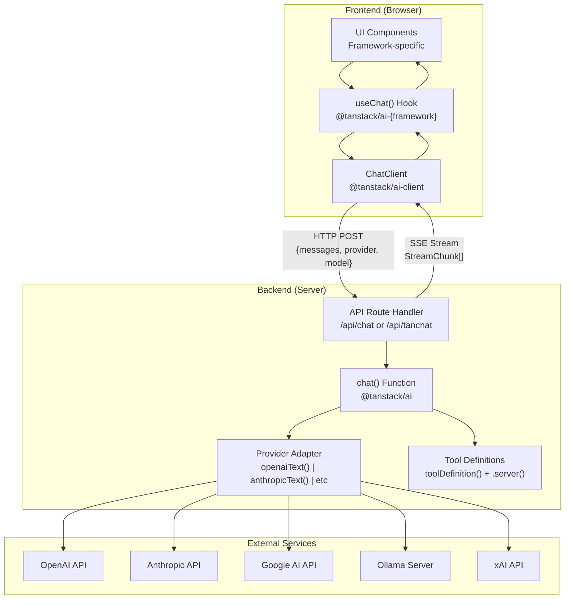
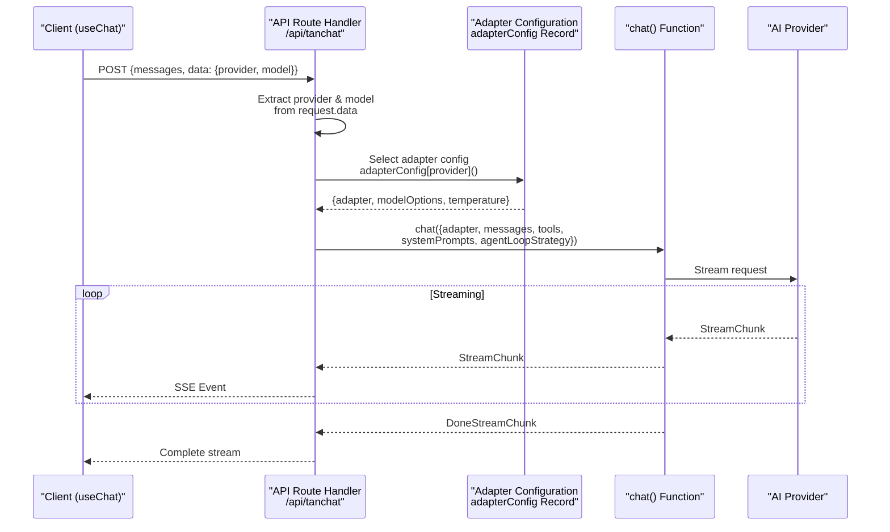
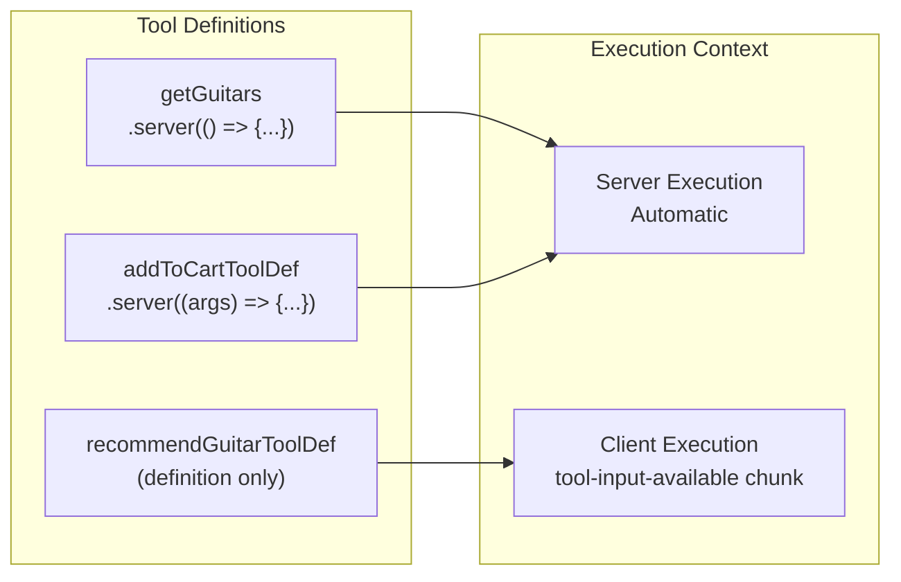
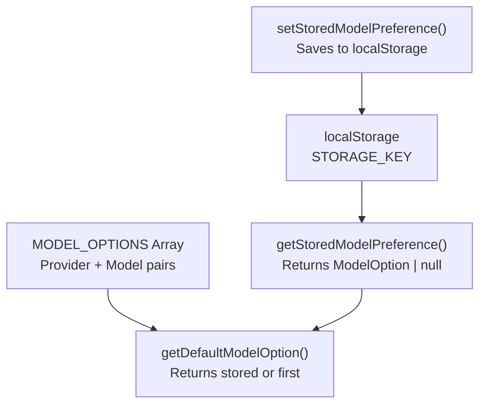
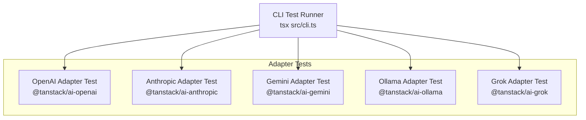
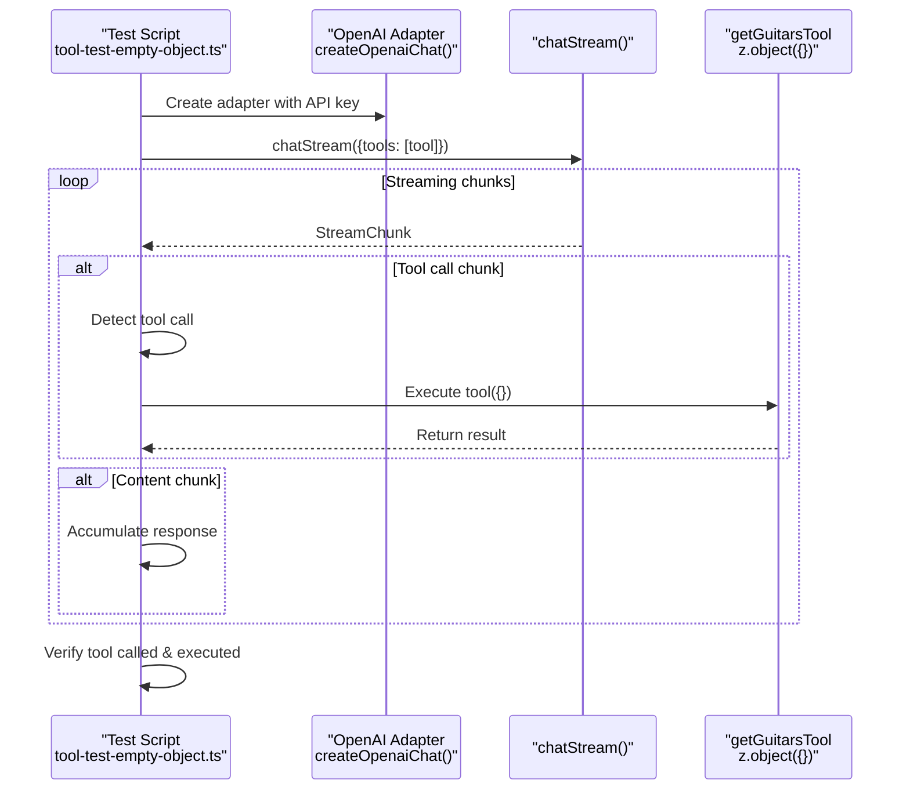
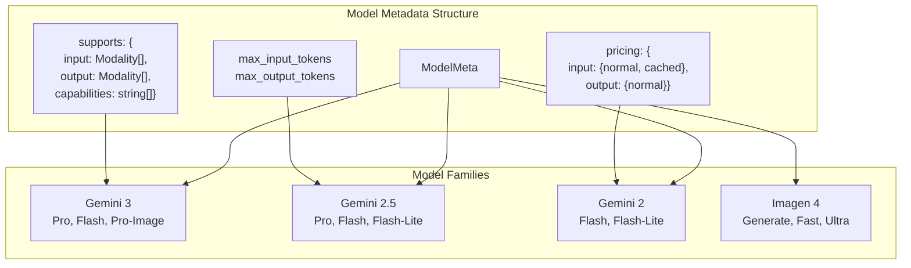
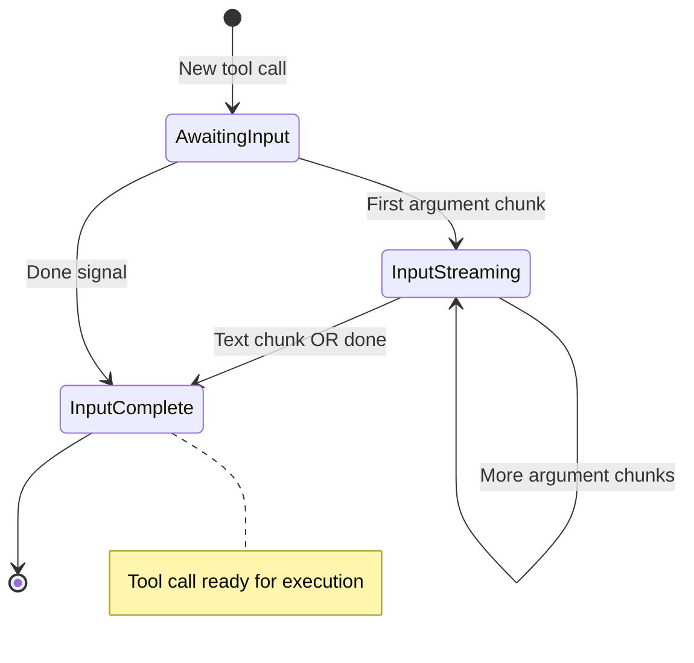

# Examples and Usage Patterns

<details>
<summary>Relevant source files</summary>

The following files were used as context for generating this wiki page:

- [examples/ts-react-chat/src/lib/model-selection.ts](examples/ts-react-chat/src/lib/model-selection.ts)
- [examples/ts-react-chat/src/routes/api.tanchat.ts](examples/ts-react-chat/src/routes/api.tanchat.ts)
- [examples/ts-svelte-chat/CHANGELOG.md](examples/ts-svelte-chat/CHANGELOG.md)
- [examples/ts-svelte-chat/package.json](examples/ts-svelte-chat/package.json)
- [examples/ts-vue-chat/CHANGELOG.md](examples/ts-vue-chat/CHANGELOG.md)
- [examples/ts-vue-chat/package.json](examples/ts-vue-chat/package.json)
- [packages/typescript/ai-gemini/CHANGELOG.md](packages/typescript/ai-gemini/CHANGELOG.md)
- [packages/typescript/ai-gemini/src/adapters/text.ts](packages/typescript/ai-gemini/src/adapters/text.ts)
- [packages/typescript/ai-gemini/src/model-meta.ts](packages/typescript/ai-gemini/src/model-meta.ts)
- [packages/typescript/ai-gemini/src/text/text-provider-options.ts](packages/typescript/ai-gemini/src/text/text-provider-options.ts)
- [packages/typescript/ai-gemini/tests/gemini-adapter.test.ts](packages/typescript/ai-gemini/tests/gemini-adapter.test.ts)
- [packages/typescript/ai-openai/CHANGELOG.md](packages/typescript/ai-openai/CHANGELOG.md)
- [packages/typescript/ai-openai/live-tests/tool-test-empty-object.ts](packages/typescript/ai-openai/live-tests/tool-test-empty-object.ts)
- [packages/typescript/ai/src/activities/chat/stream/processor.ts](packages/typescript/ai/src/activities/chat/stream/processor.ts)
- [packages/typescript/smoke-tests/adapters/CHANGELOG.md](packages/typescript/smoke-tests/adapters/CHANGELOG.md)
- [packages/typescript/smoke-tests/adapters/package.json](packages/typescript/smoke-tests/adapters/package.json)
- [packages/typescript/smoke-tests/e2e/CHANGELOG.md](packages/typescript/smoke-tests/e2e/CHANGELOG.md)
- [packages/typescript/smoke-tests/e2e/package.json](packages/typescript/smoke-tests/e2e/package.json)

</details>

This page provides an overview of the example applications included in the TanStack AI repository and documents common implementation patterns. These examples demonstrate real-world usage across different frameworks and providers, serving as both reference implementations and integration tests.

For framework-specific integration details, see [Framework Integrations](#6). For API route patterns specifically, see [API Route Implementation Patterns](#10.2). For provider-specific configuration, see [Provider Configuration Examples](#10.3).

## Example Applications Overview

The repository includes seven example applications demonstrating different use cases and frameworks:

| Example           | Framework               | Key Features                                                  | Dependencies                                   |
| ----------------- | ----------------------- | ------------------------------------------------------------- | ---------------------------------------------- |
| `ts-react-chat`   | React + TanStack Router | Multi-provider support, model selection, tool calls, devtools | `@tanstack/ai-react`, `@tanstack/react-router` |
| `ts-solid-chat`   | SolidJS                 | Solid primitives, reactive state                              | `@tanstack/ai-solid`, `@tanstack/ai-solid-ui`  |
| `ts-vue-chat`     | Vue 3                   | Vue composables, reactivity                                   | `@tanstack/ai-vue`, `@tanstack/ai-vue-ui`      |
| `ts-svelte-chat`  | Svelte 5                | Runes-based, SvelteKit                                        | `@tanstack/ai-svelte`, `@sveltejs/kit`         |
| `ts-group-chat`   | React                   | Multi-agent conversations                                     | `@tanstack/ai-react`                           |
| `vanilla-chat`    | None                    | Framework-agnostic client                                     | `@tanstack/ai-client` only                     |
| `smoke-tests/e2e` | React (testing)         | Playwright E2E tests                                          | `@playwright/test`                             |

**Sources:** [examples/ts-vue-chat/package.json:1-41](), [examples/ts-svelte-chat/package.json:1-42](), [packages/typescript/smoke-tests/e2e/package.json:1-40]()

## Common Example Architecture

All full-stack chat examples follow a similar architecture pattern:



**Sources:** [examples/ts-react-chat/src/routes/api.tanchat.ts:1-171]()

## API Route Implementation Pattern

The canonical API route pattern is implemented in [examples/ts-react-chat/src/routes/api.tanchat.ts:54-170](). This pattern demonstrates:

### Request Handling



**Sources:** [examples/ts-react-chat/src/routes/api.tanchat.ts:54-171]()

### Provider Configuration Pattern

The API route uses a typed configuration record to map provider names to adapter configurations:

| Provider Key  | Adapter Factory        | Model Options                                            | Notable Features      |
| ------------- | ---------------------- | -------------------------------------------------------- | --------------------- |
| `'openai'`    | `openaiText(model)`    | `temperature: 2`, `modelOptions: {}`                     | GPT-4o, GPT-5 models  |
| `'anthropic'` | `anthropicText(model)` | None                                                     | Claude Sonnet 4.5     |
| `'gemini'`    | `geminiText(model)`    | `thinkingConfig: {includeThoughts, thinkingBudget}`      | Thinking mode enabled |
| `'ollama'`    | `ollamaText(model)`    | `think: 'low'`, `options: {top_k: 1}`, `temperature: 12` | Local models          |
| `'grok'`      | `grokText(model)`      | `modelOptions: {}`                                       | Grok-3, Grok-3-mini   |

This pattern appears at [examples/ts-react-chat/src/routes/api.tanchat.ts:76-117]():

```typescript
const adapterConfig: Record<Provider, () => { adapter: AnyTextAdapter }> = {
  anthropic: () =>
    createChatOptions({
      adapter: anthropicText('claude-sonnet-4-5'),
    }),
  gemini: () =>
    createChatOptions({
      adapter: geminiText('gemini-2.5-flash'),
      modelOptions: {
        thinkingConfig: {
          includeThoughts: true,
          thinkingBudget: 100,
        },
      },
    }),
  // ... other providers
}
```

**Sources:** [examples/ts-react-chat/src/routes/api.tanchat.ts:76-117]()

### Tool Registration Pattern

Tools are registered with a mix of server-executed and client-executed implementations:



The tools array is passed to `chat()` at [examples/ts-react-chat/src/routes/api.tanchat.ts:128-135]():

```typescript
tools: [
  getGuitars, // Server tool
  recommendGuitarToolDef, // Client tool (no .server())
  addToCartToolServer, // Server tool with args
  addToWishListToolDef, // Client tool
  getPersonalGuitarPreferenceToolDef, // Client tool
]
```

**Sources:** [examples/ts-react-chat/src/routes/api.tanchat.ts:128-135](), [examples/ts-react-chat/src/routes/api.tanchat.ts:46-52]()

### System Prompt Pattern

The API route demonstrates a detailed system prompt that guides tool usage:

```typescript
const SYSTEM_PROMPT = `You are a helpful assistant for a guitar store.

CRITICAL INSTRUCTIONS - YOU MUST FOLLOW THIS EXACT WORKFLOW:

When a user asks for a guitar recommendation:
1. FIRST: Use the getGuitars tool (no parameters needed)
2. SECOND: Use the recommendGuitar tool with the ID
3. NEVER write a recommendation directly - ALWAYS use the tool
...`
```

This pattern ensures the LLM follows specific workflows when using tools. The full prompt is at [examples/ts-react-chat/src/routes/api.tanchat.ts:24-45]().

**Sources:** [examples/ts-react-chat/src/routes/api.tanchat.ts:24-45]()

### Streaming Response Pattern

The API route returns a Server-Sent Events stream using `toServerSentEventsResponse()`:

```typescript
const stream = chat({
  ...options,
  tools: [...],
  systemPrompts: [SYSTEM_PROMPT],
  agentLoopStrategy: maxIterations(20),
  messages,
  abortController,
  conversationId,
})
return toServerSentEventsResponse(stream, { abortController })
```

**Sources:** [examples/ts-react-chat/src/routes/api.tanchat.ts:125-141]()

### Error Handling Pattern

The implementation includes comprehensive error handling for abort scenarios:

```typescript
try {
  const stream = chat({...})
  return toServerSentEventsResponse(stream, { abortController })
} catch (error: any) {
  // Log detailed error information
  console.error('[API Route] Error in chat request:', {
    message: error?.message,
    name: error?.name,
    status: error?.status,
    // ...
  })

  // Check for abort errors
  if (error.name === 'AbortError' || abortController.signal.aborted) {
    return new Response(null, { status: 499 }) // Client Closed Request
  }

  return new Response(JSON.stringify({ error: error.message }), {
    status: 500,
    headers: { 'Content-Type': 'application/json' },
  })
}
```

**Sources:** [examples/ts-react-chat/src/routes/api.tanchat.ts:142-166]()

## Model Selection Pattern

Examples implement dynamic model selection with persistence:



The model selection implementation at [examples/ts-react-chat/src/lib/model-selection.ts:1-126]() provides:

1. **Centralized model definitions** with provider, model ID, and display label
2. **Persistent user preferences** using `localStorage`
3. **Type-safe provider/model pairs**

Example model options table:

| Provider    | Model ID                     | Display Label                 |
| ----------- | ---------------------------- | ----------------------------- |
| `openai`    | `gpt-4o`                     | OpenAI - GPT-4o               |
| `openai`    | `gpt-4o-mini`                | OpenAI - GPT-4o Mini          |
| `openai`    | `gpt-5`                      | OpenAI - GPT-5                |
| `anthropic` | `claude-sonnet-4-5-20250929` | Anthropic - Claude Sonnet 4.5 |
| `gemini`    | `gemini-2.5-flash`           | Gemini 2.5 - Flash            |
| `ollama`    | `mistral:7b`                 | Ollama - Mistral 7B           |
| `grok`      | `grok-3`                     | Grok - Grok 3                 |

**Sources:** [examples/ts-react-chat/src/lib/model-selection.ts:9-87]()

## Testing Patterns

### Adapter Smoke Tests

The smoke tests at [packages/typescript/smoke-tests/adapters/package.json:1-31]() demonstrate systematic adapter testing:



Dependencies include all official adapters for comprehensive testing coverage.

**Sources:** [packages/typescript/smoke-tests/adapters/package.json:13-20]()

### Unit Testing Pattern

The Gemini adapter tests demonstrate comprehensive unit testing patterns:

```typescript
describe('GeminiAdapter through AI', () => {
  it('maps provider options for chat streaming', async () => {
    // Mock provider response
    mocks.generateContentStreamSpy.mockResolvedValue(createStream(chunks))

    // Execute chat with options
    for await (const _ of chat({
      adapter,
      messages: [...],
      modelOptions: { topK: 9 },
      temperature: 0.4,
      tools: [weatherTool],
    })) { /* consume */ }

    // Verify API call
    expect(mocks.generateContentStreamSpy).toHaveBeenCalledTimes(1)
    const [payload] = mocks.generateContentStreamSpy.mock.calls[0]
    expect(payload.config).toMatchObject({
      temperature: 0.4,
      topP: 0.8,
      topK: 9,
    })
  })
})
```

This pattern appears at [packages/typescript/ai-gemini/tests/gemini-adapter.test.ts:76-132]().

**Sources:** [packages/typescript/ai-gemini/tests/gemini-adapter.test.ts:71-346]()

### Tool Testing Pattern

Live testing with tools demonstrates end-to-end tool execution:



This pattern demonstrates testing tools with empty object schemas, which are common for parameterless operations.

**Sources:** [packages/typescript/ai-openai/live-tests/tool-test-empty-object.ts:28-127]()

### E2E Testing Pattern

Playwright-based E2E tests verify complete workflows:

```typescript
// E2E test dependencies
{
  "@playwright/test": "^1.57.0",
  "@tanstack/ai-react": "workspace:*",
  "@tanstack/react-router": "^1.141.1",
  // ... other dependencies
}
```

The E2E test suite at [packages/typescript/smoke-tests/e2e/package.json:1-40]() demonstrates:

- Full application testing with real user interactions
- Integration with TanStack Router for route testing
- Browser automation via Playwright

**Sources:** [packages/typescript/smoke-tests/e2e/package.json:1-40]()

## Provider-Specific Patterns

### Gemini Model Metadata Pattern

The Gemini adapter demonstrates comprehensive model metadata tracking:



Each model has detailed metadata at [packages/typescript/ai-gemini/src/model-meta.ts:50-680](), including:

- Supported input/output modalities (text, image, audio, video, document)
- Capabilities (thinking, grounding, code execution, etc.)
- Token limits (input/output)
- Pricing per million tokens
- Knowledge cutoff dates

**Sources:** [packages/typescript/ai-gemini/src/model-meta.ts:50-820]()

### Provider Options Pattern

Type-safe provider options are defined per adapter:

```typescript
export interface GeminiCommonConfigOptions {
  stopSequences?: Array<string>
  responseModalities?: Array<'TEXT' | 'IMAGE' | 'AUDIO'>
  candidateCount?: number
  topK?: number
  seed?: number
  presencePenalty?: number
  frequencyPenalty?: number
  responseLogprobs?: boolean
  logprobs?: number
  // ... more options
}

export interface GeminiThinkingOptions {
  thinkingConfig?: {
    includeThoughts: boolean
    thinkingBudget?: number
  }
}
```

Provider options are composed from multiple interfaces at [packages/typescript/ai-gemini/src/text/text-provider-options.ts:1-255]().

**Sources:** [packages/typescript/ai-gemini/src/text/text-provider-options.ts:25-255]()

## Stream Processing Pattern

The `StreamProcessor` class at [packages/typescript/ai/src/activities/chat/stream/processor.ts:1-1090]() demonstrates advanced stream processing:

### State Machine Pattern



Tool call states:

- `awaiting-input`: Tool call started, no arguments yet
- `input-streaming`: Arguments being streamed
- `input-complete`: All arguments received, ready for execution

**Sources:** [packages/typescript/ai/src/activities/chat/stream/processor.ts:168-1073]()

### Event-Driven Architecture

The processor emits granular events for UI updates:

| Event                   | Parameters                                  | Purpose                        |
| ----------------------- | ------------------------------------------- | ------------------------------ |
| `onMessagesChange`      | `messages: UIMessage[]`                     | Full message array updated     |
| `onStreamStart`         | None                                        | Stream begins                  |
| `onStreamEnd`           | `message: UIMessage`                        | Stream completes               |
| `onToolCall`            | `{toolCallId, toolName, input}`             | Client tool execution required |
| `onApprovalRequest`     | `{toolCallId, toolName, input, approvalId}` | User approval required         |
| `onTextUpdate`          | `messageId, content`                        | Text content updated           |
| `onToolCallStateChange` | `messageId, toolCallId, state, args`        | Tool call state changed        |
| `onThinkingUpdate`      | `messageId, content`                        | Thinking content updated       |

**Sources:** [packages/typescript/ai/src/activities/chat/stream/processor.ts:45-79]()
