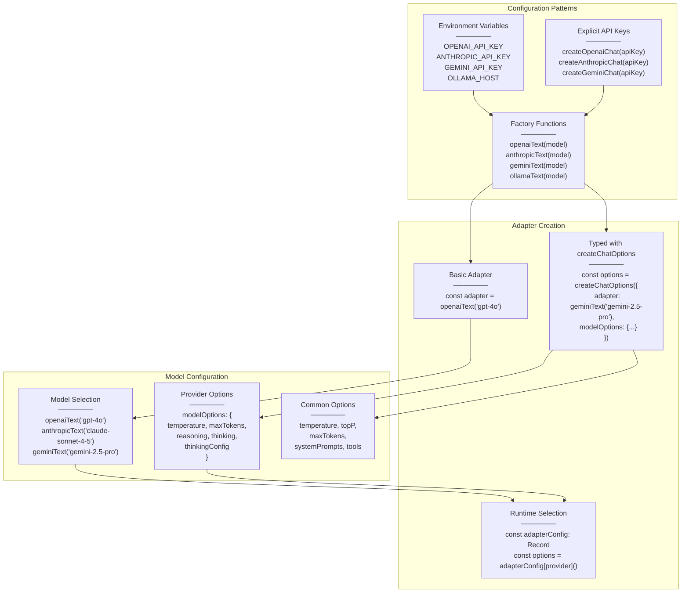
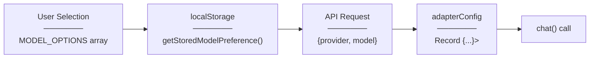
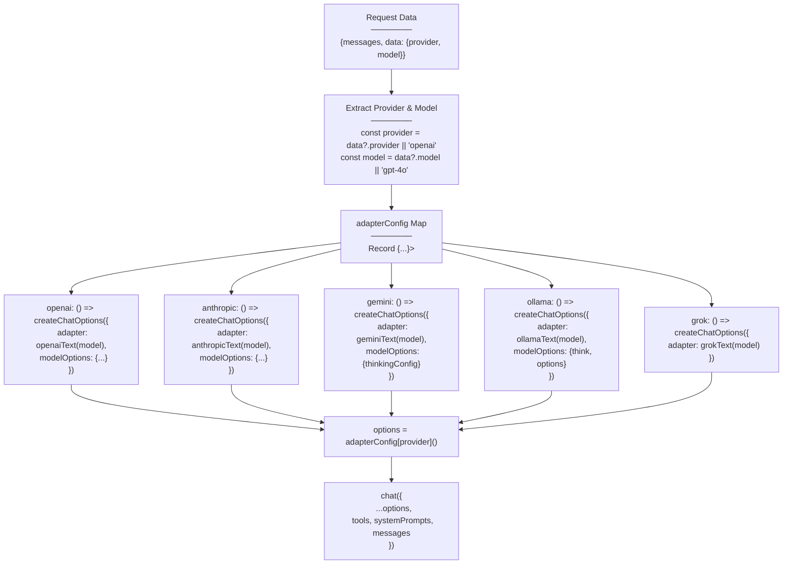
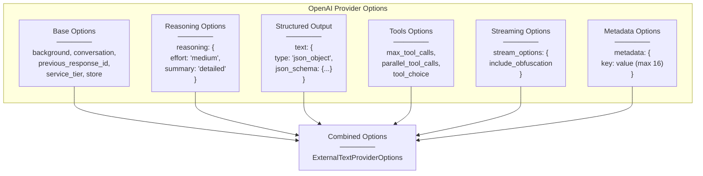
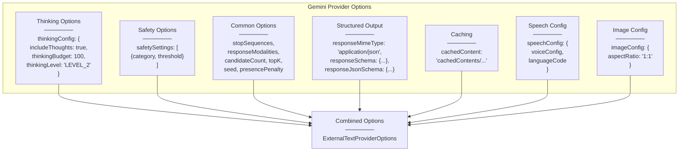

# Provider Configuration Examples

<details>
<summary>Relevant source files</summary>

The following files were used as context for generating this wiki page:

- [docs/adapters/anthropic.md](docs/adapters/anthropic.md)
- [docs/adapters/gemini.md](docs/adapters/gemini.md)
- [docs/adapters/ollama.md](docs/adapters/ollama.md)
- [docs/adapters/openai.md](docs/adapters/openai.md)
- [docs/community-adapters/decart.md](docs/community-adapters/decart.md)
- [docs/community-adapters/guide.md](docs/community-adapters/guide.md)
- [docs/config.json](docs/config.json)
- [docs/getting-started/quick-start.md](docs/getting-started/quick-start.md)
- [docs/guides/structured-outputs.md](docs/guides/structured-outputs.md)
- [examples/ts-react-chat/src/lib/model-selection.ts](examples/ts-react-chat/src/lib/model-selection.ts)
- [examples/ts-react-chat/src/routes/api.tanchat.ts](examples/ts-react-chat/src/routes/api.tanchat.ts)
- [packages/typescript/ai-gemini/src/adapters/text.ts](packages/typescript/ai-gemini/src/adapters/text.ts)
- [packages/typescript/ai-gemini/src/model-meta.ts](packages/typescript/ai-gemini/src/model-meta.ts)
- [packages/typescript/ai-gemini/src/text/text-provider-options.ts](packages/typescript/ai-gemini/src/text/text-provider-options.ts)
- [packages/typescript/ai-gemini/tests/gemini-adapter.test.ts](packages/typescript/ai-gemini/tests/gemini-adapter.test.ts)
- [packages/typescript/ai-openai/live-tests/tool-test-empty-object.ts](packages/typescript/ai-openai/live-tests/tool-test-empty-object.ts)
- [packages/typescript/ai/src/activities/chat/stream/processor.ts](packages/typescript/ai/src/activities/chat/stream/processor.ts)

</details>

This page demonstrates practical patterns for configuring and using different AI providers in TanStack AI applications. Examples cover OpenAI, Anthropic, Gemini, Ollama, and Grok with various configuration scenarios including API key management, model selection, provider-specific options, and runtime provider switching.

For implementing complete API routes that use these configurations, see [API Route Implementation Patterns](#10.2). For understanding the adapter architecture itself, see [AI Provider Adapters](#3.3).

## Provider Configuration Architecture



**Sources:** [examples/ts-react-chat/src/routes/api.tanchat.ts:76-117](), [docs/getting-started/quick-start.md:19-76]()

## Basic Provider Setup

### OpenAI

Using environment variables (recommended):

```typescript
import { chat } from '@tanstack/ai'
import { openaiText } from '@tanstack/ai-openai'

// Reads OPENAI_API_KEY from environment
const stream = chat({
  adapter: openaiText('gpt-4o'),
  messages: [{ role: 'user', content: 'Hello!' }],
})
```

Using explicit API key:

```typescript
import { createOpenaiChat } from '@tanstack/ai-openai'

const adapter = createOpenaiChat(process.env.OPENAI_API_KEY!, {
  organization: 'org-...', // Optional
  baseURL: 'https://api.openai.com/v1', // Optional
})

const stream = chat({
  adapter: adapter('gpt-4o'),
  messages: [{ role: 'user', content: 'Hello!' }],
})
```

**Sources:** [docs/adapters/openai.md:15-41](), [examples/ts-react-chat/src/routes/api.tanchat.ts:8]()

### Anthropic

Using environment variables:

```typescript
import { anthropicText } from '@tanstack/ai-anthropic'

const stream = chat({
  adapter: anthropicText('claude-sonnet-4-5'),
  messages: [{ role: 'user', content: 'Hello!' }],
})
```

Using explicit API key:

```typescript
import { createAnthropicChat } from '@tanstack/ai-anthropic'

const adapter = createAnthropicChat(process.env.ANTHROPIC_API_KEY!, {
  baseURL: 'https://api.anthropic.com', // Optional
})

const stream = chat({
  adapter: adapter('claude-sonnet-4-5'),
  messages: [{ role: 'user', content: 'Hello!' }],
})
```

**Sources:** [docs/adapters/anthropic.md:15-41](), [examples/ts-react-chat/src/routes/api.tanchat.ts:10]()

### Gemini

Using environment variables:

```typescript
import { geminiText } from '@tanstack/ai-gemini'

const stream = chat({
  adapter: geminiText('gemini-2.5-pro'),
  messages: [{ role: 'user', content: 'Hello!' }],
})
```

Using explicit API key:

```typescript
import { createGeminiChat } from '@tanstack/ai-gemini'

const adapter = createGeminiChat(
  'gemini-2.5-pro',
  process.env.GEMINI_API_KEY!,
  {
    baseURL: 'https://generativelanguage.googleapis.com/v1beta', // Optional
  }
)

const stream = chat({
  adapter,
  messages: [{ role: 'user', content: 'Hello!' }],
})
```

**Sources:** [docs/adapters/gemini.md:15-41](), [examples/ts-react-chat/src/routes/api.tanchat.ts:11]()

### Ollama

Ollama uses a host URL instead of API keys:

```typescript
import { ollamaText } from '@tanstack/ai-ollama'

// Default localhost
const stream = chat({
  adapter: ollamaText('llama3'),
  messages: [{ role: 'user', content: 'Hello!' }],
})
```

Custom host:

```typescript
import { createOllamaChat } from '@tanstack/ai-ollama'

const adapter = createOllamaChat('http://your-server:11434')

const stream = chat({
  adapter: adapter('llama3'),
  messages: [{ role: 'user', content: 'Hello!' }],
})
```

**Sources:** [docs/adapters/ollama.md:15-51](), [examples/ts-react-chat/src/routes/api.tanchat.ts:9]()

### Grok

```typescript
import { grokText } from '@tanstack/ai-grok'

const stream = chat({
  adapter: grokText('grok-3'),
  messages: [{ role: 'user', content: 'Hello!' }],
})
```

**Sources:** [examples/ts-react-chat/src/routes/api.tanchat.ts:12]()

## Model Selection Patterns

### Static Model Selection

```typescript
const stream = chat({
  adapter: openaiText('gpt-4o'),
  messages,
})
```

### Model Selection from Configuration



**Sources:** [examples/ts-react-chat/src/lib/model-selection.ts:1-126](), [examples/ts-react-chat/src/routes/api.tanchat.ts:68-117]()

Available models are defined in `MODEL_OPTIONS`:

```typescript
export const MODEL_OPTIONS: Array<ModelOption> = [
  // OpenAI
  { provider: 'openai', model: 'gpt-4o', label: 'OpenAI - GPT-4o' },
  { provider: 'openai', model: 'gpt-4o-mini', label: 'OpenAI - GPT-4o Mini' },
  { provider: 'openai', model: 'gpt-5', label: 'OpenAI - GPT-5' },

  // Anthropic
  {
    provider: 'anthropic',
    model: 'claude-sonnet-4-5',
    label: 'Anthropic - Claude Sonnet 4.5',
  },
  {
    provider: 'anthropic',
    model: 'claude-opus-4-5',
    label: 'Anthropic - Claude Opus 4.5',
  },

  // Gemini
  {
    provider: 'gemini',
    model: 'gemini-2.5-flash',
    label: 'Gemini 2.5 - Flash',
  },
  {
    provider: 'gemini',
    model: 'gemini-2.0-flash',
    label: 'Gemini 2.0 - Flash',
  },

  // Ollama
  { provider: 'ollama', model: 'llama3', label: 'Ollama - Llama 3' },
  { provider: 'ollama', model: 'mistral', label: 'Ollama - Mistral' },

  // Grok
  { provider: 'grok', model: 'grok-3', label: 'Grok - Grok 3' },
]
```

**Sources:** [examples/ts-react-chat/src/lib/model-selection.ts:9-87]()

### Model Metadata

Providers expose model metadata including capabilities, token limits, and pricing:

```typescript
// Gemini model metadata example
const GEMINI_2_5_PRO = {
  name: 'gemini-2.5-pro',
  max_input_tokens: 1_048_576,
  max_output_tokens: 65_536,
  knowledge_cutoff: '2025-01-01',
  supports: {
    input: ['text', 'image', 'audio', 'video', 'document'],
    output: ['text'],
    capabilities: [
      'batch_api',
      'caching',
      'code_execution',
      'file_search',
      'function_calling',
      'grounding_with_gmaps',
      'search_grounding',
      'structured_output',
      'thinking',
      'url_context',
    ],
  },
  pricing: {
    input: { normal: 2.5 },
    output: { normal: 15 },
  },
}
```

**Sources:** [packages/typescript/ai-gemini/src/model-meta.ts:160-196]()

## Runtime Provider Switching

### Type-Safe Provider Configuration Map



**Sources:** [examples/ts-react-chat/src/routes/api.tanchat.ts:76-141]()

Implementation pattern from the React chat example:

```typescript
type Provider = 'openai' | 'anthropic' | 'gemini' | 'ollama' | 'grok'

export async function POST({ request }) {
  const { messages, data } = await request.json()

  const provider: Provider = data?.provider || 'openai'
  const model: string = data?.model || 'gpt-4o'

  // Type-safe adapter configuration map
  const adapterConfig: Record<Provider, () => { adapter: AnyTextAdapter }> = {
    anthropic: () => createChatOptions({
      adapter: anthropicText(model as 'claude-sonnet-4-5')
    }),

    gemini: () => createChatOptions({
      adapter: geminiText(model as 'gemini-2.5-flash'),
      modelOptions: {
        thinkingConfig: {
          includeThoughts: true,
          thinkingBudget: 100
        }
      }
    }),

    ollama: () => createChatOptions({
      adapter: ollamaText(model as 'llama3'),
      modelOptions: {
        think: 'low',
        options: { top_k: 1 }
      }
    }),

    openai: () => createChatOptions({
      adapter: openaiText(model as 'gpt-4o'),
      temperature: 2,
      modelOptions: {}
    }),

    grok: () => createChatOptions({
      adapter: grokText(model as 'grok-3'),
      modelOptions: {}
    })
  }

  // Get typed options for selected provider
  const options = adapterConfig[provider]()

  const stream = chat({
    ...options,
    tools: [...],
    systemPrompts: [...],
    messages
  })

  return toServerSentEventsResponse(stream)
}
```

**Sources:** [examples/ts-react-chat/src/routes/api.tanchat.ts:22-141]()

## Provider-Specific Options

### OpenAI Provider Options



**Sources:** [packages/typescript/ai-openai/src/text/text-provider-options.ts:17-243]()

Key OpenAI options:

```typescript
modelOptions: {
  // Reasoning (GPT-5, O3)
  reasoning: {
    effort: 'medium', // 'none' | 'minimal' | 'low' | 'medium' | 'high'
    summary: 'detailed' // 'auto' | 'detailed'
  },

  // Structured output
  text: {
    type: 'json_object',
    json_schema: {...}
  },

  // Tools
  max_tool_calls: 10,
  parallel_tool_calls: true,
  tool_choice: 'auto',

  // Streaming
  stream_options: {
    include_obfuscation: false
  },

  // Metadata (max 16 KV pairs)
  metadata: {
    user_id: 'user123',
    session_id: 'session456'
  },

  // Other options
  background: false,
  service_tier: 'auto',
  store: true,
  verbosity: 'medium',
  truncation: 'disabled'
}
```

**Sources:** [packages/typescript/ai-openai/src/text/text-provider-options.ts:17-243](), [docs/adapters/openai.md:101-133]()

### Gemini Provider Options



**Sources:** [packages/typescript/ai-gemini/src/text/text-provider-options.ts:1-255]()

Key Gemini options:

```typescript
modelOptions: {
  // Thinking (Gemini 2.5+, Gemini 3)
  thinkingConfig: {
    includeThoughts: true,
    thinkingBudget: 100, // Max thinking tokens
    thinkingLevel: 'LEVEL_2' // Advanced models only
  },

  // Safety settings
  safetySettings: [
    {
      category: 'HARM_CATEGORY_HATE_SPEECH',
      threshold: 'BLOCK_LOW_AND_ABOVE'
    }
  ],

  // Structured output
  responseMimeType: 'application/json',
  responseSchema: {...}, // Gemini Schema format
  responseJsonSchema: {...}, // JSON Schema format

  // Caching
  cachedContent: 'cachedContents/weather-context',

  // Common options
  stopSequences: ['<done>', '###'],
  responseModalities: ['TEXT', 'IMAGE'],
  candidateCount: 2,
  topK: 6,
  seed: 7,
  presencePenalty: 0.2,
  frequencyPenalty: 0.4,
  responseLogprobs: true,
  logprobs: 3,

  // Speech generation
  speechConfig: {
    voiceConfig: {
      prebuiltVoiceConfig: {
        voiceName: 'Zephyr'
      }
    },
    languageCode: 'en-US'
  },

  // Image generation
  imageConfig: {
    aspectRatio: '16:9'
  }
}
```

**Sources:** [packages/typescript/ai-gemini/tests/gemini-adapter.test.ts:172-252](), [packages/typescript/ai-gemini/src/text/text-provider-options.ts:9-255]()

### Anthropic Provider Options

Key Anthropic options:

```typescript
modelOptions: {
  // Extended thinking
  thinking: {
    type: 'enabled',
    budget_tokens: 2048 // Max thinking tokens
  },

  // Note: max_tokens must be > budget_tokens
  max_tokens: 4096,

  // Other options
  temperature: 0.7,
  top_p: 0.9,
  top_k: 40,
  stop_sequences: ['END']
}
```

For prompt caching, use metadata on content parts:

```typescript
messages: [
  {
    role: 'user',
    content: [
      {
        type: 'text',
        content: 'Context to cache',
        metadata: {
          cache_control: {
            type: 'ephemeral',
          },
        },
      },
    ],
  },
]
```

**Sources:** [docs/adapters/anthropic.md:101-158]()

### Ollama Provider Options

Key Ollama options:

```typescript
modelOptions: {
  // Thinking
  think: 'low', // Provider-specific thinking control

  // Sampling
  temperature: 0.7,
  top_p: 0.9,
  top_k: 40,
  min_p: 0.05,

  // Generation
  num_predict: 1000, // Max tokens
  repeat_penalty: 1.1,
  repeat_last_n: 64,

  // Performance
  num_ctx: 4096, // Context window
  num_batch: 512,
  num_gpu: -1, // -1 = auto
  num_thread: 0, // 0 = auto

  // Options nested object
  options: {
    top_k: 1,
    temperature: 12
  }
}
```

**Sources:** [examples/ts-react-chat/src/routes/api.tanchat.ts:105-110](), [docs/adapters/ollama.md:119-171]()

## Common Options

All providers support these common options:

```typescript
const stream = chat({
  adapter: openaiText('gpt-4o'),
  messages,

  // Common across all providers
  temperature: 0.7,
  topP: 0.9,
  maxTokens: 2048,

  systemPrompts: ['You are a helpful assistant'],

  tools: [weatherTool, searchTool],

  agentLoopStrategy: maxIterations(20),

  conversationId: 'conv-123',

  abortController: new AbortController(),
})
```

**Sources:** [examples/ts-react-chat/src/routes/api.tanchat.ts:125-140]()

## Advanced Configuration Patterns

### Type-Safe Model Options with createChatOptions

The `createChatOptions` helper provides full type inference for provider-specific options:

```typescript
import { createChatOptions } from '@tanstack/ai'
import { geminiText } from '@tanstack/ai-gemini'

// Type inference knows which options are valid for gemini-2.5-pro
const options = createChatOptions({
  adapter: geminiText('gemini-2.5-pro'),
  modelOptions: {
    // ✅ TypeScript knows thinkingConfig is valid
    thinkingConfig: {
      includeThoughts: true,
      thinkingBudget: 100,
    },
    // ❌ TypeScript would error on invalid options
  },
})

const stream = chat({
  ...options,
  messages,
  tools,
})
```

**Sources:** [examples/ts-react-chat/src/routes/api.tanchat.ts:83-99]()

### Per-Model Provider Options

Different models support different options. The type system enforces this:

```typescript
// Gemini 3 Pro supports thinkingLevel (advanced)
const gemini3Options = createChatOptions({
  adapter: geminiText('gemini-3-pro-preview'),
  modelOptions: {
    thinkingConfig: {
      includeThoughts: true,
      thinkingLevel: 'LEVEL_2', // ✅ Supported
    },
  },
})

// Gemini 2.5 Pro only supports thinkingBudget
const gemini25Options = createChatOptions({
  adapter: geminiText('gemini-2.5-pro'),
  modelOptions: {
    thinkingConfig: {
      includeThoughts: true,
      thinkingBudget: 100, // ✅ Supported
      // thinkingLevel: 'LEVEL_2' // ❌ Would error
    },
  },
})
```

**Sources:** [packages/typescript/ai-gemini/src/model-meta.ts:912-969]()

### Environment Variable Configuration

Standard environment variables by provider:

| Provider  | Environment Variable                 | Default/Format           |
| --------- | ------------------------------------ | ------------------------ |
| OpenAI    | `OPENAI_API_KEY`                     | `sk-...`                 |
| Anthropic | `ANTHROPIC_API_KEY`                  | `sk-ant-...`             |
| Gemini    | `GEMINI_API_KEY` or `GOOGLE_API_KEY` | Google API key           |
| Ollama    | `OLLAMA_HOST`                        | `http://localhost:11434` |
| Grok      | `GROK_API_KEY`                       | Grok API key             |

**Sources:** [docs/getting-started/quick-start.md:209-221](), [docs/adapters/ollama.md:234-238]()

### Custom Base URLs

All providers support custom base URLs for proxy/gateway scenarios:

```typescript
// OpenAI with custom endpoint
const openaiAdapter = createOpenaiChat(apiKey, {
  baseURL: 'https://your-proxy.com/v1',
})

// Anthropic with custom endpoint
const anthropicAdapter = createAnthropicChat(apiKey, {
  baseURL: 'https://your-proxy.com',
})

// Gemini with custom endpoint
const geminiAdapter = createGeminiChat('gemini-2.5-pro', apiKey, {
  baseURL: 'https://your-proxy.com/v1beta',
})

// Ollama with custom host
const ollamaAdapter = createOllamaChat('http://your-server:11434')
```

**Sources:** [docs/adapters/openai.md:44-54](), [docs/adapters/anthropic.md:44-53](), [docs/adapters/gemini.md:44-53](), [docs/adapters/ollama.md:42-51]()

## Testing Provider Configurations

When testing provider configurations, consider:

1. **Empty schemas**: Tools with `z.object({})` should work correctly
2. **Provider-specific features**: Test reasoning, thinking, structured output
3. **Model availability**: Verify models exist and are accessible
4. **Token limits**: Respect max_input_tokens and max_output_tokens
5. **Error handling**: Handle API errors gracefully

Example test structure:

```typescript
// Test tool with empty object schema
const getGuitarsTool = {
  name: 'getGuitars',
  description: 'Get all products from the database',
  inputSchema: z.object({}), // Empty schema
  execute: async () => {
    return [
      { id: '1', name: 'Guitar 1' },
      { id: '2', name: 'Guitar 2' },
    ]
  },
}

// Stream and verify tool call
for await (const chunk of stream) {
  if (chunk.type === 'tool_call') {
    console.log('Tool call:', chunk.toolCall.function.name)
    console.log('Arguments:', chunk.toolCall.function.arguments)
  }
}
```

**Sources:** [packages/typescript/ai-openai/live-tests/tool-test-empty-object.ts:28-127]()
