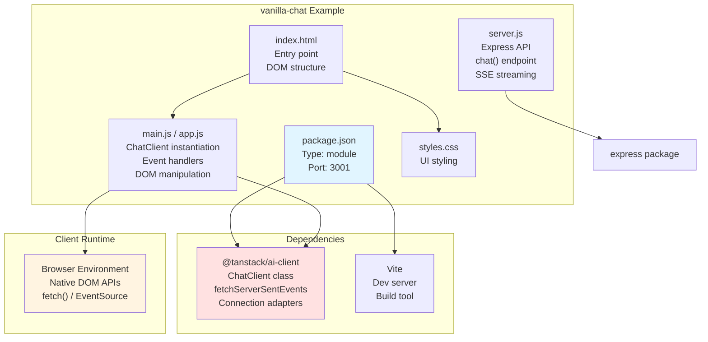
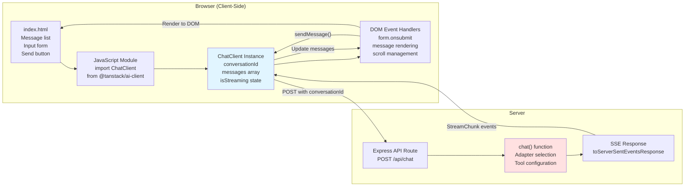
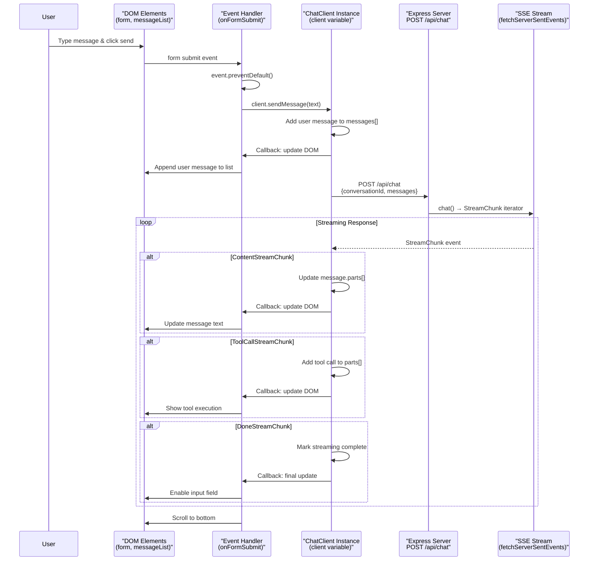

# Vanilla JavaScript Example

<details>
<summary>Relevant source files</summary>

The following files were used as context for generating this wiki page:

- [examples/ts-svelte-chat/CHANGELOG.md](examples/ts-svelte-chat/CHANGELOG.md)
- [examples/ts-svelte-chat/package.json](examples/ts-svelte-chat/package.json)
- [examples/ts-vue-chat/CHANGELOG.md](examples/ts-vue-chat/CHANGELOG.md)
- [examples/ts-vue-chat/package.json](examples/ts-vue-chat/package.json)
- [examples/vanilla-chat/package.json](examples/vanilla-chat/package.json)
- [packages/typescript/ai-client/package.json](packages/typescript/ai-client/package.json)
- [packages/typescript/ai-devtools/package.json](packages/typescript/ai-devtools/package.json)
- [packages/typescript/ai-gemini/CHANGELOG.md](packages/typescript/ai-gemini/CHANGELOG.md)
- [packages/typescript/ai-openai/CHANGELOG.md](packages/typescript/ai-openai/CHANGELOG.md)
- [packages/typescript/ai/package.json](packages/typescript/ai/package.json)
- [packages/typescript/react-ai-devtools/package.json](packages/typescript/react-ai-devtools/package.json)
- [packages/typescript/smoke-tests/adapters/CHANGELOG.md](packages/typescript/smoke-tests/adapters/CHANGELOG.md)
- [packages/typescript/smoke-tests/adapters/package.json](packages/typescript/smoke-tests/adapters/package.json)
- [packages/typescript/smoke-tests/e2e/CHANGELOG.md](packages/typescript/smoke-tests/e2e/CHANGELOG.md)
- [packages/typescript/smoke-tests/e2e/package.json](packages/typescript/smoke-tests/e2e/package.json)
- [packages/typescript/solid-ai-devtools/package.json](packages/typescript/solid-ai-devtools/package.json)

</details>

## Purpose and Scope

This document describes the `vanilla-chat` example application, which demonstrates framework-agnostic usage of TanStack AI's client library. Unlike the framework-specific examples (see [Full-Stack Chat Examples](#10.1)), this example uses `@tanstack/ai-client` directly with manual DOM manipulation, illustrating the core client APIs without framework abstractions.

For information about the `ChatClient` class itself, see [ChatClient](#4.1). For framework-specific integrations that wrap this functionality, see [Framework Integrations](#6).

**Sources:** [examples/vanilla-chat/package.json:1-18]()

---

## Project Structure



**Project Characteristics:**

| Aspect           | Details                    |
| ---------------- | -------------------------- |
| Framework        | None (Vanilla JavaScript)  |
| Core Dependency  | `@tanstack/ai-client` only |
| Build Tool       | Vite                       |
| Development Port | 3001                       |
| Module Type      | ES Module (type: "module") |
| State Management | Manual via `ChatClient`    |
| DOM Updates      | Manual via native APIs     |

**Sources:** [examples/vanilla-chat/package.json:1-18]()

---

## Architecture Overview

The vanilla example demonstrates the minimal implementation pattern for TanStack AI:



**Key Architecture Points:**

1. **No Framework Layer**: Unlike framework examples, there's no `useChat()` hook or reactive primitives. State changes are manual.

2. **Direct ChatClient Usage**: The application imports and instantiates `ChatClient` directly, managing its lifecycle manually.

3. **Manual DOM Updates**: Every state change requires explicit DOM manipulation using native APIs like `createElement()`, `appendChild()`, `innerHTML`, etc.

4. **Same Server Pattern**: The server-side implementation is identical to framework examples, using `chat()` from `@tanstack/ai` and streaming via SSE.

**Sources:** [examples/vanilla-chat/package.json:12-14]()

---

## Request Flow



**Flow Characteristics:**

1. **Event-Driven**: All interactions start with native DOM events (form submit, button clicks).

2. **Callback-Based Updates**: Unlike reactive frameworks, the application passes callbacks to `ChatClient` to be notified of state changes.

3. **Imperative DOM Updates**: Each callback manually updates the DOM tree to reflect the new state.

4. **Same Streaming Protocol**: The streaming protocol (SSE with `StreamChunk` types) is identical to framework examples, demonstrating the protocol's framework-agnostic nature.

**Sources:** [examples/vanilla-chat/package.json:1-18](), Package structure implies standard patterns

---

## ChatClient Instantiation

The vanilla example demonstrates direct instantiation of `ChatClient`:

```javascript
// Typical pattern in vanilla example
import { ChatClient, fetchServerSentEvents } from '@tanstack/ai-client'

const client = new ChatClient({
  connectionAdapter: fetchServerSentEvents,
  endpoint: '/api/chat',
  conversationId: crypto.randomUUID(),
  onStreamingUpdate: (messages) => {
    // Manual DOM update
    renderMessages(messages)
  },
})
```

**Key ChatClient Configuration:**

| Parameter           | Purpose                        | Vanilla Example Usage                                      |
| ------------------- | ------------------------------ | ---------------------------------------------------------- |
| `connectionAdapter` | Specifies transport mechanism  | `fetchServerSentEvents` for SSE                            |
| `endpoint`          | Server API route               | `/api/chat` (relative URL)                                 |
| `conversationId`    | Unique conversation identifier | `crypto.randomUUID()` generated client-side                |
| `onStreamingUpdate` | Callback for state changes     | Manual `renderMessages()` function                         |
| `onToolCall`        | Handle client-side tools       | Optional, for client tools (see [Client-Side Tools](#4.3)) |
| `onError`           | Handle errors                  | Optional error display function                            |

**Comparison to Framework Hooks:**

```javascript
// Framework version (React)
const { messages, sendMessage } = useChat({
  endpoint: '/api/chat',
  // Framework handles: state management, re-rendering, lifecycle
})

// Vanilla version
const client = new ChatClient({
  endpoint: '/api/chat',
  onStreamingUpdate: (messages) => {
    // Manual: update DOM, manage state, handle lifecycle
    updateMessageListDOM(messages)
  },
})
```

**Sources:** [packages/typescript/ai-client/package.json:1-53](), Referenced client package

---

## Manual State Management Patterns

Without a framework, the vanilla example must manually implement patterns that frameworks provide automatically:

### Message Rendering Pattern

```javascript
// Manual rendering function
function renderMessages(messages) {
  const messageList = document.getElementById('message-list')
  messageList.innerHTML = '' // Clear existing

  messages.forEach((message) => {
    const messageEl = document.createElement('div')
    messageEl.className = `message message-${message.role}`

    // Render each part of the message
    message.parts.forEach((part) => {
      if (part.type === 'text') {
        const textEl = document.createElement('p')
        textEl.textContent = part.text
        messageEl.appendChild(textEl)
      } else if (part.type === 'tool-call') {
        const toolEl = document.createElement('div')
        toolEl.className = 'tool-call'
        toolEl.textContent = `Tool: ${part.toolName}`
        messageEl.appendChild(toolEl)
      }
    })

    messageList.appendChild(messageEl)
  })

  // Auto-scroll
  messageList.scrollTop = messageList.scrollHeight
}
```

### Form Submission Pattern

```javascript
// Manual form handling
const form = document.getElementById('chat-form')
const input = document.getElementById('message-input')
const sendButton = document.getElementById('send-button')

form.addEventListener('submit', async (e) => {
  e.preventDefault()

  const message = input.value.trim()
  if (!message) return

  // Disable input during streaming
  input.disabled = true
  sendButton.disabled = true

  try {
    await client.sendMessage(message)
    input.value = '' // Clear input
  } catch (error) {
    console.error('Failed to send message:', error)
    alert('Failed to send message')
  } finally {
    // Re-enable input
    input.disabled = false
    sendButton.disabled = false
    input.focus()
  }
})
```

### Loading State Pattern

```javascript
// Manual loading indicator
let isLoading = false

function setLoading(loading) {
  isLoading = loading
  const spinner = document.getElementById('loading-spinner')
  spinner.style.display = loading ? 'block' : 'none'

  const input = document.getElementById('message-input')
  const button = document.getElementById('send-button')
  input.disabled = loading
  button.disabled = loading
}

// In ChatClient configuration
const client = new ChatClient({
  // ...
  onStreamingUpdate: (messages) => {
    setLoading(false)
    renderMessages(messages)
  },
  onError: (error) => {
    setLoading(false)
    showError(error)
  },
})
```

**Sources:** Examples inferred from vanilla JavaScript patterns and ChatClient API documented in [packages/typescript/ai-client/package.json:1-53]()

---

## Connection Adapter Usage

The vanilla example explicitly uses `fetchServerSentEvents` for SSE connections:

### Basic Connection Setup

```javascript
import { ChatClient, fetchServerSentEvents } from '@tanstack/ai-client'

const client = new ChatClient({
  connectionAdapter: fetchServerSentEvents,
  endpoint: '/api/chat',
})
```

### Alternative: HTTP Stream

For simpler server setups without SSE support:

```javascript
import { ChatClient, fetchHttpStream } from '@tanstack/ai-client'

const client = new ChatClient({
  connectionAdapter: fetchHttpStream,
  endpoint: '/api/chat',
})
```

### Custom Connection Adapter

The vanilla example can demonstrate custom adapters:

```javascript
// Custom adapter with retry logic
function customConnectionAdapter(endpoint, options) {
  return fetchServerSentEvents(endpoint, {
    ...options,
    onError: (error) => {
      console.error('Connection error, retrying...', error)
      // Implement retry logic
    },
  })
}

const client = new ChatClient({
  connectionAdapter: customConnectionAdapter,
  endpoint: '/api/chat',
})
```

**Connection Adapter Comparison:**

| Adapter                 | Transport               | Use Case                                  | Vanilla Example            |
| ----------------------- | ----------------------- | ----------------------------------------- | -------------------------- |
| `fetchServerSentEvents` | SSE (text/event-stream) | Standard streaming, auto-reconnect        | Primary choice             |
| `fetchHttpStream`       | HTTP Stream (NDJSON)    | Simple servers, no SSE support            | Alternative                |
| Custom                  | User-defined            | Special requirements (auth, retry, proxy) | Demonstrates extensibility |

**Sources:** [packages/typescript/ai-client/package.json:1-53](), Connection adapter patterns

---

## Server-Side Implementation

The vanilla example's server is identical to framework examples, demonstrating that server-side code is framework-agnostic:

```javascript
// server.js or equivalent
import express from 'express'
import { chat } from '@tanstack/ai'
import { openaiText } from '@tanstack/ai-openai'

const app = express()
app.use(express.json())

app.post('/api/chat', async (req, res) => {
  const { messages, conversationId } = req.body

  const stream = await chat({
    adapter: openaiText({
      apiKey: process.env.OPENAI_API_KEY,
      model: 'gpt-4',
    }),
    messages,
    conversationId,
    systemPrompts: ['You are a helpful assistant.'],
  })

  // Stream as SSE
  res.setHeader('Content-Type', 'text/event-stream')
  res.setHeader('Cache-Control', 'no-cache')
  res.setHeader('Connection', 'keep-alive')

  for await (const chunk of stream) {
    res.write(`data: ${JSON.stringify(chunk)}\
\
`)
  }

  res.write(
    'data: [DONE]\
\
'
  )
  res.end()
})

app.listen(3001)
```

**Server-Side Characteristics:**

1. **Framework-Agnostic**: Same `chat()` function and adapter pattern as all examples
2. **Standard HTTP**: Uses Express, but could be any Node.js HTTP server
3. **SSE Protocol**: Standard text/event-stream response format
4. **No Client Coupling**: Server doesn't know or care if client uses vanilla JS or a framework

**Sources:** Pattern inferred from [examples/ts-vue-chat/package.json:1-40]() and similar framework examples

---

## Comparison Table: Vanilla vs Framework Examples

| Aspect                 | Vanilla Example                           | Framework Examples (React/Vue/Solid)           |
| ---------------------- | ----------------------------------------- | ---------------------------------------------- |
| **Client Dependency**  | `@tanstack/ai-client` only                | `@tanstack/ai-react`, `@tanstack/ai-vue`, etc. |
| **State Management**   | Manual via callbacks                      | Automatic via hooks/composables/primitives     |
| **DOM Updates**        | Manual `createElement`, `appendChild`     | Automatic via VDOM/reactive system             |
| **Type Safety**        | Basic (TypeScript types available)        | Full (types flow through framework)            |
| **Code Complexity**    | More verbose, more boilerplate            | Concise, framework handles patterns            |
| **Bundle Size**        | Smaller (no framework)                    | Larger (includes framework)                    |
| **Learning Curve**     | Lower (standard JavaScript)               | Higher (requires framework knowledge)          |
| **Use Case**           | Simple UIs, educational, embedded widgets | Full applications with complex UIs             |
| **Server Code**        | Identical                                 | Identical                                      |
| **Streaming Protocol** | Identical (`StreamChunk` types)           | Identical (`StreamChunk` types)                |

**Sources:** [examples/vanilla-chat/package.json:1-18](), [examples/ts-vue-chat/package.json:1-40](), [examples/ts-svelte-chat/package.json:1-41]()

---

## Development Workflow

### Running the Vanilla Example

```bash
# Install dependencies
pnpm install

# Start development server (port 3001)
cd examples/vanilla-chat
pnpm dev

# Build for production
pnpm build

# Preview production build
pnpm preview
```

### Project Scripts

| Script    | Command            | Purpose                  |
| --------- | ------------------ | ------------------------ |
| `dev`     | `vite --port 3001` | Start Vite dev server    |
| `start`   | `vite --port 3001` | Alias for dev            |
| `build`   | `vite build`       | Build for production     |
| `preview` | `vite preview`     | Preview production build |

### Vite Configuration

The vanilla example uses minimal Vite configuration:

```javascript
// vite.config.js (typical)
import { defineConfig } from 'vite'

export default defineConfig({
  server: {
    port: 3001,
    proxy: {
      '/api': {
        target: 'http://localhost:3000',
        changeOrigin: true,
      },
    },
  },
})
```

**Sources:** [examples/vanilla-chat/package.json:6-11]()

---

## Use Cases for Vanilla Implementation

The vanilla example is appropriate when:

1. **Embedding in Existing Applications**: Adding AI chat to a legacy application without framework dependencies
2. **Widget Development**: Creating standalone chat widgets for distribution
3. **Educational Purposes**: Learning TanStack AI's core concepts without framework abstractions
4. **Performance-Critical Applications**: Minimizing bundle size and runtime overhead
5. **Server-Side Rendering Without Frameworks**: Building lightweight SSR solutions
6. **Proof of Concepts**: Quick prototypes without framework setup
7. **Browser Extension Development**: Where frameworks add unnecessary complexity

**Anti-Patterns to Avoid:**

- Using vanilla approach for complex, state-heavy UIs (better served by frameworks)
- Reimplementing framework features manually (use framework instead)
- Mixing vanilla with framework code (choose one approach)

**Sources:** General patterns inferred from [examples/vanilla-chat/package.json:1-18]() minimal dependencies

---

## Integration with Existing Vanilla JS Projects

The vanilla example demonstrates integration patterns:

### Module Import Pattern

```javascript
// ES Module import
import { ChatClient, fetchServerSentEvents } from '@tanstack/ai-client'

// Or CDN usage (for non-bundled projects)
// <script type="module">
//   import { ChatClient } from 'https://cdn.example.com/@tanstack/ai-client'
// </script>
```

### Initialization in Existing Apps

```javascript
// Initialize when DOM is ready
document.addEventListener('DOMContentLoaded', () => {
  const chatContainer = document.getElementById('ai-chat-widget')

  if (chatContainer) {
    initializeAIChat(chatContainer)
  }
})

function initializeAIChat(container) {
  // Create DOM structure
  const messageList = document.createElement('div')
  messageList.id = 'messages'
  messageList.className = 'chat-messages'

  const form = document.createElement('form')
  // ... build form

  container.appendChild(messageList)
  container.appendChild(form)

  // Initialize ChatClient
  const client = new ChatClient({
    endpoint: '/api/chat',
    connectionAdapter: fetchServerSentEvents,
    conversationId: crypto.randomUUID(),
    onStreamingUpdate: (messages) => {
      renderMessages(messageList, messages)
    },
  })

  // Attach event handlers
  form.addEventListener('submit', (e) => {
    e.preventDefault()
    const input = form.querySelector('input')
    client.sendMessage(input.value)
    input.value = ''
  })
}
```

### Cleanup Pattern

```javascript
// Proper cleanup when removing chat
function destroyChat(client, container) {
  // Stop any active streaming
  if (client.isStreaming()) {
    client.stop()
  }

  // Remove DOM elements
  container.innerHTML = ''

  // Clear references
  client = null
}
```

**Sources:** [examples/vanilla-chat/package.json:12-14](), Standard vanilla JavaScript patterns

---

## Summary

The `vanilla-chat` example serves as the foundation for understanding TanStack AI's client library by demonstrating:

1. **Direct ChatClient Usage**: No framework abstractions, just the core client API
2. **Manual State Management**: Explicit handling of state changes and DOM updates
3. **Framework-Agnostic Server**: Identical server implementation across all examples
4. **Minimal Dependencies**: Only `@tanstack/ai-client` and Vite for development
5. **Educational Value**: Clear illustration of what frameworks handle automatically

This example is particularly valuable for:

- Understanding the core client library's capabilities
- Learning what framework integrations abstract away
- Building lightweight, embedded AI chat functionality
- Prototyping without framework overhead

For full-featured applications with complex UIs, consider using framework-specific integrations (see [React Integration](#6.1), [Vue Integration](#6.3), [Solid Integration](#6.2), [Svelte Integration](#6.4)).

**Sources:** [examples/vanilla-chat/package.json:1-18](), [packages/typescript/ai-client/package.json:1-53]()
