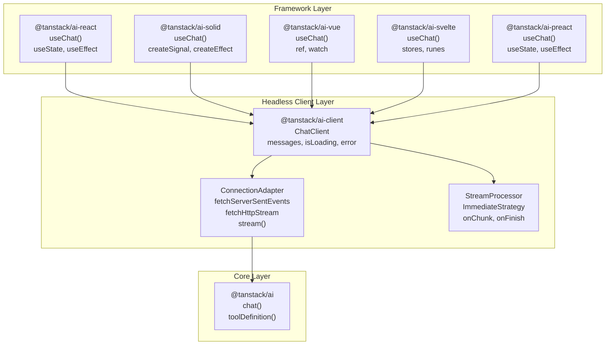
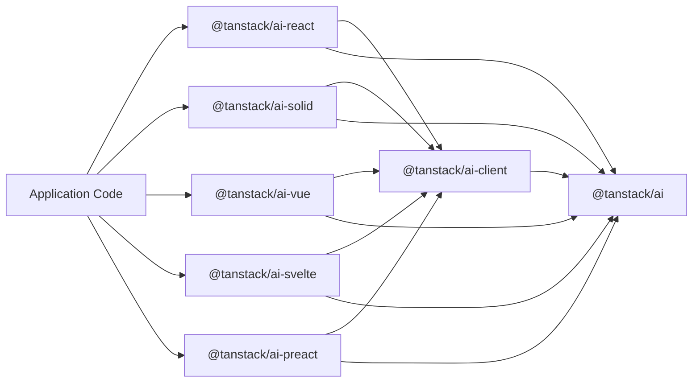
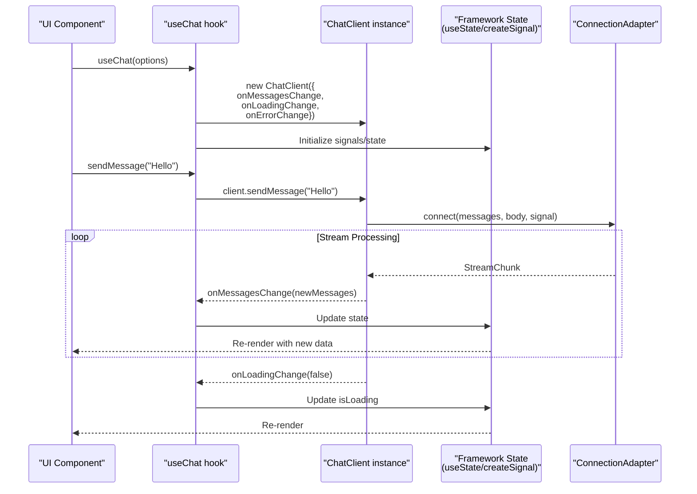
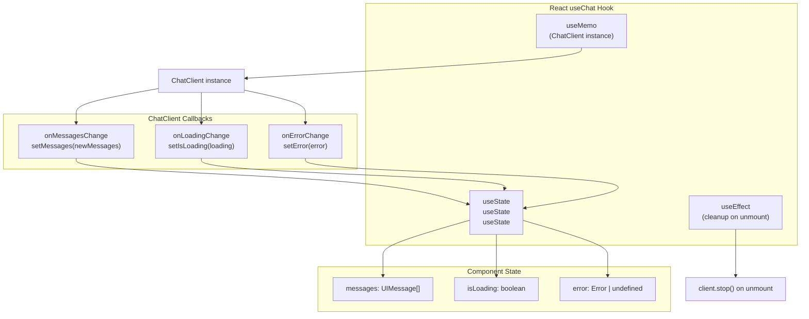
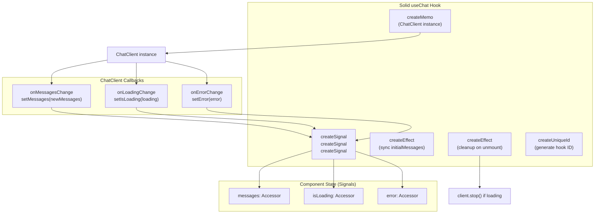
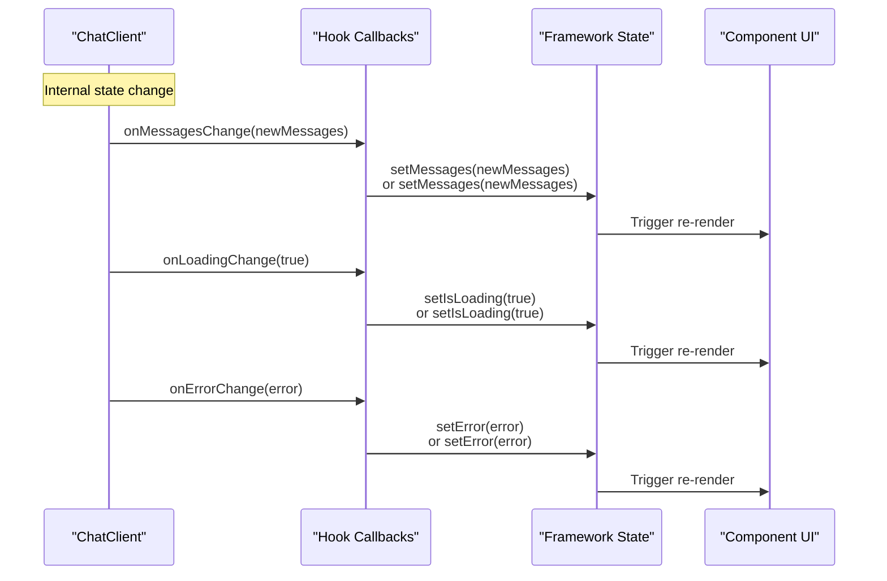

# Framework Integrations

<details>
<summary>Relevant source files</summary>

The following files were used as context for generating this wiki page:

- [README.md](README.md)
- [examples/ts-svelte-chat/CHANGELOG.md](examples/ts-svelte-chat/CHANGELOG.md)
- [examples/ts-svelte-chat/package.json](examples/ts-svelte-chat/package.json)
- [examples/ts-vue-chat/CHANGELOG.md](examples/ts-vue-chat/CHANGELOG.md)
- [examples/ts-vue-chat/package.json](examples/ts-vue-chat/package.json)
- [packages/typescript/ai-anthropic/package.json](packages/typescript/ai-anthropic/package.json)
- [packages/typescript/ai-client/README.md](packages/typescript/ai-client/README.md)
- [packages/typescript/ai-devtools/README.md](packages/typescript/ai-devtools/README.md)
- [packages/typescript/ai-gemini/CHANGELOG.md](packages/typescript/ai-gemini/CHANGELOG.md)
- [packages/typescript/ai-gemini/README.md](packages/typescript/ai-gemini/README.md)
- [packages/typescript/ai-gemini/package.json](packages/typescript/ai-gemini/package.json)
- [packages/typescript/ai-ollama/README.md](packages/typescript/ai-ollama/README.md)
- [packages/typescript/ai-ollama/package.json](packages/typescript/ai-ollama/package.json)
- [packages/typescript/ai-openai/CHANGELOG.md](packages/typescript/ai-openai/CHANGELOG.md)
- [packages/typescript/ai-openai/README.md](packages/typescript/ai-openai/README.md)
- [packages/typescript/ai-openai/package.json](packages/typescript/ai-openai/package.json)
- [packages/typescript/ai-react-ui/README.md](packages/typescript/ai-react-ui/README.md)
- [packages/typescript/ai-react-ui/package.json](packages/typescript/ai-react-ui/package.json)
- [packages/typescript/ai-react/README.md](packages/typescript/ai-react/README.md)
- [packages/typescript/ai-react/package.json](packages/typescript/ai-react/package.json)
- [packages/typescript/ai-solid-ui/package.json](packages/typescript/ai-solid-ui/package.json)
- [packages/typescript/ai-solid/package.json](packages/typescript/ai-solid/package.json)
- [packages/typescript/ai-svelte/package.json](packages/typescript/ai-svelte/package.json)
- [packages/typescript/ai-vue-ui/package.json](packages/typescript/ai-vue-ui/package.json)
- [packages/typescript/ai-vue/package.json](packages/typescript/ai-vue/package.json)
- [packages/typescript/ai/README.md](packages/typescript/ai/README.md)
- [packages/typescript/react-ai-devtools/README.md](packages/typescript/react-ai-devtools/README.md)
- [packages/typescript/smoke-tests/adapters/CHANGELOG.md](packages/typescript/smoke-tests/adapters/CHANGELOG.md)
- [packages/typescript/smoke-tests/adapters/package.json](packages/typescript/smoke-tests/adapters/package.json)
- [packages/typescript/smoke-tests/e2e/CHANGELOG.md](packages/typescript/smoke-tests/e2e/CHANGELOG.md)
- [packages/typescript/smoke-tests/e2e/package.json](packages/typescript/smoke-tests/e2e/package.json)
- [packages/typescript/solid-ai-devtools/README.md](packages/typescript/solid-ai-devtools/README.md)

</details>

Framework integrations provide framework-specific wrappers around the headless `@tanstack/ai-client` library, enabling idiomatic chat interfaces across multiple UI frameworks. These packages adapt the framework-agnostic `ChatClient` to each framework's reactivity model while maintaining consistent APIs and behavior.

TanStack AI provides official integrations for five major frameworks:

- [React Integration](#6.1) - `@tanstack/ai-react` package
- [Solid Integration](#6.2) - `@tanstack/ai-solid` package
- [Vue Integration](#6.3) - `@tanstack/ai-vue` package
- [Svelte Integration](#6.4) - `@tanstack/ai-svelte` package
- [Preact Integration](#6.5) - `@tanstack/ai-preact` package

For information about the underlying client library, see [ChatClient](#4.1).

## Package Architecture

Framework integration packages sit between the UI layer and the headless client, translating `ChatClient` state updates into framework-specific reactive primitives.

**Diagram: Framework Integration Architecture**



**Sources:**

- [packages/typescript/ai-react/package.json:1-60]()
- [packages/typescript/ai-solid/package.json:1-59]()
- [packages/typescript/ai-vue/package.json:1-59]()
- [packages/typescript/ai-svelte/package.json:1-64]()
- [docs/api/ai-react.md:1-318]()
- [docs/api/ai-solid.md:1-333]()

### Dependency Structure

All framework packages share the same dependency structure:

- `@tanstack/ai` (peer dependency) - Core AI primitives, type definitions
- `@tanstack/ai-client` (direct dependency) - Headless `ChatClient` implementation

**Diagram: Package Dependencies**



Each package also declares framework-specific peer dependencies:

| Package               | Framework Peer Dependency |
| --------------------- | ------------------------- |
| `@tanstack/ai-react`  | `react >=18.0.0`          |
| `@tanstack/ai-solid`  | `solid-js >=1.9.10`       |
| `@tanstack/ai-vue`    | `vue >=3.5.0`             |
| `@tanstack/ai-svelte` | `svelte ^5.0.0`           |
| `@tanstack/ai-preact` | `preact >=10.0.0`         |

**Sources:**

- [packages/typescript/ai-react/package.json:46-49]()
- [packages/typescript/ai-solid/package.json:44-46]()
- [packages/typescript/ai-vue/package.json:44-46]()
- [packages/typescript/ai-svelte/package.json:48-50]()

## The useChat Hook Pattern

All framework integrations expose a `useChat` hook (or primitive/composable) as their primary API. Despite different underlying reactivity models, they share the same interface and behavior.

| Framework | API Name               | Returns                                         |
| --------- | ---------------------- | ----------------------------------------------- |
| React     | `useChat` (hook)       | Direct values (`messages`, `isLoading`)         |
| Solid     | `useChat` (primitive)  | Accessors (`messages()`, `isLoading()`)         |
| Vue       | `useChat` (composable) | Refs (`messages.value`, `isLoading.value`)      |
| Svelte    | `useChat` (function)   | Stores (reactive via `$messages`, `$isLoading`) |
| Preact    | `useChat` (hook)       | Direct values (same as React)                   |

**Sources:**

- [docs/api/ai-react.md:14-93]()
- [docs/api/ai-solid.md:14-96]()
- [packages/typescript/ai-vue/package.json:1-59]()
- [packages/typescript/ai-svelte/package.json:1-64]()

### Lifecycle and State Management



**Sources:**

- [packages/typescript/ai-solid/src/use-chat.ts:11-133]()
- [docs/api/ai-react.md:14-93]()

### Common Options Interface

Both integrations accept the same options (extending `ChatClientOptions` from `@tanstack/ai-client`):

| Option            | Type                           | Description                             |
| ----------------- | ------------------------------ | --------------------------------------- |
| `connection`      | `ConnectionAdapter`            | Required. Connection to server endpoint |
| `tools`           | `ReadonlyArray<AnyClientTool>` | Client tool implementations             |
| `initialMessages` | `UIMessage[]`                  | Starting conversation history           |
| `id`              | `string`                       | Unique chat instance identifier         |
| `body`            | `Record<string, any>`          | Additional request payload              |
| `onResponse`      | `(response: any) => void`      | Called when response received           |
| `onChunk`         | `(chunk: StreamChunk) => void` | Called for each stream chunk            |
| `onFinish`        | `(message: UIMessage) => void` | Called when response completes          |
| `onError`         | `(error: Error) => void`       | Called on errors                        |
| `streamProcessor` | `StreamProcessorConfig`        | Chunk buffering strategy                |

**Sources:**

- [packages/typescript/ai-solid/src/types.ts:27-31]()
- [docs/api/ai-react.md:51-66]()

### Common Return Interface

All hooks return similar methods and state, with framework-specific wrappers around reactive values:

| Member                    | React/Preact                         | Solid                          | Vue                       | Svelte                         | Description                 |
| ------------------------- | ------------------------------------ | ------------------------------ | ------------------------- | ------------------------------ | --------------------------- |
| `messages`                | `UIMessage[]`                        | `Accessor<UIMessage[]>`        | `Ref<UIMessage[]>`        | `Writable<UIMessage[]>`        | Current conversation        |
| `sendMessage`             | `(content: string) => Promise<void>` | Same                           | Same                      | Same                           | Send user message           |
| `append`                  | `(message) => Promise<void>`         | Same                           | Same                      | Same                           | Append message manually     |
| `reload`                  | `() => Promise<void>`                | Same                           | Same                      | Same                           | Regenerate last response    |
| `stop`                    | `() => void`                         | Same                           | Same                      | Same                           | Cancel active generation    |
| `isLoading`               | `boolean`                            | `Accessor<boolean>`            | `Ref<boolean>`            | `Writable<boolean>`            | Generation in progress      |
| `error`                   | `Error \| undefined`                 | `Accessor<Error \| undefined>` | `Ref<Error \| undefined>` | `Writable<Error \| undefined>` | Current error state         |
| `clear`                   | `() => void`                         | Same                           | Same                      | Same                           | Clear all messages          |
| `setMessages`             | `(messages) => void`                 | Same                           | Same                      | Same                           | Manually set messages       |
| `addToolResult`           | `(result) => Promise<void>`          | Same                           | Same                      | Same                           | Add tool execution result   |
| `addToolApprovalResponse` | `(response) => Promise<void>`        | Same                           | Same                      | Same                           | Approve/deny tool execution |

**Access Patterns:**

- **React/Preact**: Direct property access (`messages`, `isLoading`)
- **Solid**: Accessor function calls (`messages()`, `isLoading()`)
- **Vue**: Ref value access (`messages.value`, `isLoading.value`)
- **Svelte**: Store subscription (`$messages`, `$isLoading`) or `.get()` method

**Sources:**

- [docs/api/ai-react.md:71-93]()
- [docs/api/ai-solid.md:71-96]()
- [packages/typescript/ai-vue/package.json:1-59]()
- [packages/typescript/ai-svelte/package.json:1-64]()

## Framework-Specific Reactivity

Each framework integration adapts `ChatClient` callbacks to its native reactivity model.

### React Implementation

React integration uses `useState` and `useEffect` to manage state and side effects:

**Diagram: React State Management**



**React Pattern:**

- State is directly mutable via setter functions (`setState`)
- `useEffect` handles cleanup when component unmounts
- `useMemo` caches `ChatClient` instance based on `id`
- Direct property access: `messages`, `isLoading`, `error`

**Sources:**

- [docs/api/ai-react.md:14-48]()
- [packages/typescript/ai-react/package.json:42-49]()

### Solid Implementation

Solid integration uses `createSignal` and `createEffect` for fine-grained reactivity:

**Diagram: Solid Signal-Based Reactivity**



**Solid Pattern:**

- Signals provide fine-grained reactivity tracking
- `createEffect` runs synchronously during component lifecycle
- `createMemo` caches derived values and dependencies
- Accessor function access: `messages()`, `isLoading()`, `error()`

**Sources:**

- [packages/typescript/ai-solid/src/use-chat.ts:1-133]()
- [packages/typescript/ai-solid/src/types.ts:1-103]()
- [packages/typescript/ai-solid/package.json:41-46]()

### Vue Implementation

Vue integration uses the Composition API with `ref` and `watch`:

**Vue Pattern:**

- `ref()` creates reactive references to state
- `watch()` tracks dependencies and runs side effects
- `onUnmounted()` handles cleanup
- Property access via `.value`: `messages.value`, `isLoading.value`

**Sources:**

- [packages/typescript/ai-vue/package.json:1-59]()
- [packages/typescript/ai-vue/package.json:44-46]()

### Svelte Implementation

Svelte integration uses stores compatible with Svelte 5 runes:

**Svelte Pattern:**

- `writable()` creates reactive stores
- Stores expose `.subscribe()`, `.set()`, and `.update()` methods
- Automatic subscription via `$` prefix in templates (`$messages`)
- Svelte 5 runes (`$state`, `$derived`) provide additional reactivity

**Export Configuration:**
The package uses special Svelte export fields:

```json
{
  "svelte": "./dist/index.js",
  "exports": {
    ".": {
      "types": "./dist/index.d.ts",
      "svelte": "./dist/index.js"
    }
  }
}
```

**Sources:**

- [packages/typescript/ai-svelte/package.json:1-64]()
- [packages/typescript/ai-svelte/package.json:13-21]()
- [packages/typescript/ai-svelte/package.json:48-50]()

### Preact Implementation

Preact integration mirrors React's API but with a smaller bundle size:

**Preact Pattern:**

- Same API as React (`useState`, `useEffect`, `useMemo`)
- Lightweight alternative for bundle-size-sensitive applications
- Compatible with React ecosystem but 3KB vs React's 45KB
- Direct property access like React: `messages`, `isLoading`, `error`

**Sources:**

- [packages/typescript/ai-react/package.json:1-60]()

## State Synchronization Pattern

All frameworks follow the same callback-based synchronization pattern to bridge framework state with `ChatClient`:

**Diagram: Callback-Based State Synchronization**



This pattern ensures:

- Framework state stays synchronized with `ChatClient` internal state
- Framework-specific re-renders trigger on state changes
- Same callback interface works across all frameworks
- Business logic remains in `ChatClient`, frameworks only handle reactivity

**Sources:**

- [packages/typescript/ai-solid/src/use-chat.ts:23-48]()
- [docs/api/ai-client.md:35-49]()
- [packages/typescript/ai-react/package.json:43-44]()
- [packages/typescript/ai-vue/package.json:41-42]()
- [packages/typescript/ai-svelte/package.json:45-46]()

## Re-exported Utilities

All framework packages re-export key utilities from `@tanstack/ai-client` for convenience:

### Connection Adapters

```typescript
// All framework packages re-export:
import {
  fetchServerSentEvents,
  fetchHttpStream,
  stream,
  type ConnectionAdapter,
} from '@tanstack/ai-react' // or any framework package
```

**Sources:**

- [docs/api/ai-react.md:98-107]()
- [docs/api/ai-solid.md:99-109]()
- [packages/typescript/ai-vue/package.json:41-42]()
- [packages/typescript/ai-svelte/package.json:45-46]()

### Helper Functions

```typescript
// All framework packages re-export:
import {
  clientTools,
  createChatClientOptions,
  type InferChatMessages,
} from '@tanstack/ai-react' // or any framework package
```

These helpers enable full type safety with client tools:

- `clientTools(...tools)` - Creates typed tool arrays without `as const`
- `createChatClientOptions(options)` - Creates typed chat options
- `InferChatMessages<T>` - Extracts message type from options

**Sources:**

- [docs/api/ai-react.md:270-290]()
- [docs/api/ai-solid.md:284-304]()
- [docs/api/ai-client.md:179-218]()

### Type Re-exports

All framework packages re-export core types from `@tanstack/ai` and `@tanstack/ai-client`:

From `@tanstack/ai-client`:

- `UIMessage<TTools>`
- `MessagePart<TTools>`
- `TextPart`, `ThinkingPart`, `ToolCallPart<TTools>`, `ToolResultPart`
- `ChatClientOptions<TTools>`
- `ConnectionAdapter`
- `ChatRequestBody`

From `@tanstack/ai`:

- `toolDefinition()`
- `ToolDefinitionInstance`
- `ClientTool`, `ServerTool`
- `ModelMessage`

**Sources:**

- [packages/typescript/ai-solid/src/types.ts:1-103]()
- [docs/api/ai-react.md:293-312]()
- [docs/api/ai-solid.md:307-327]()
- [packages/typescript/ai-vue/package.json:41-46]()
- [packages/typescript/ai-svelte/package.json:45-50]()

## Integration Testing Patterns

Framework integrations include comprehensive test suites that verify:

1. **Initialization** - Default state, initial messages, ID handling
2. **State Synchronization** - Callbacks update framework state correctly
3. **Core Operations** - `sendMessage`, `append`, `reload`, `stop`, `clear`
4. **Error Handling** - Network errors, stream errors, error clearing
5. **Callbacks** - `onChunk`, `onFinish`, `onError`, `onResponse`
6. **Tool Operations** - `addToolResult`, `addToolApprovalResponse`
7. **Concurrent Operations** - Multiple calls, stop during send, reload during stream
8. **Multiple Instances** - Independent state per hook instance

### Test Utilities

Each integration provides test helpers:

```typescript
// Solid
import { renderUseChat } from "./test-utils";

const { result } = renderUseChat({
  connection: createMockConnectionAdapter({ chunks: [...] })
});

// Access current state
result.current.messages
result.current.isLoading
```

The `renderUseChat` helper adapts SolidJS's testing library to a React-like API, enabling shared test patterns.

**Sources:**

- [packages/typescript/ai-solid/tests/use-chat.test.ts:1-1171]()
- [packages/typescript/ai-solid/tests/test-utils.ts:1-56]()

## Design Principles

Framework integrations follow these principles:

### 1. Minimal Wrapper

Framework packages add only reactivity and lifecycle management. All business logic lives in `ChatClient`.

### 2. Consistent Interface

The `useChat` API is identical across frameworks, with only reactivity model differences:

- React/Preact: Direct access
- Solid: Accessor functions
- Vue: `.value` access
- Svelte: Store subscription with `$` prefix

### 3. Framework Idioms

Each integration uses idiomatic patterns:

- **React**: `useState`, `useEffect`, `useMemo`
- **Solid**: `createSignal`, `createEffect`, `createMemo`
- **Vue**: `ref`, `watch`, `onUnmounted`
- **Svelte**: `writable` stores, Svelte 5 runes
- **Preact**: Same as React but smaller bundle

### 4. Type Safety

Full TypeScript support with generics for tool typing:

```typescript
const tools = clientTools(tool1, tool2)
const options = createChatClientOptions({ connection, tools })
type Messages = InferChatMessages<typeof options>
```

### 5. Testability

Test utilities enable framework-specific testing while maintaining shared test patterns.

**Sources:**

- [packages/typescript/ai-solid/src/use-chat.ts:23-48]()
- [docs/guides/client-tools.md:116-170]()
- [packages/typescript/ai-react/package.json:1-60]()
- [packages/typescript/ai-vue/package.json:1-59]()
- [packages/typescript/ai-svelte/package.json:1-64]()

## Creating New Framework Integrations

To create an integration for a new framework:

1. **Depend on `@tanstack/ai-client`** - Use `ChatClient` as the core
2. **Wrap with Framework State** - Translate callbacks to framework reactivity
3. **Implement `useChat` Hook** - Follow the common interface pattern
4. **Re-export Utilities** - Make connection adapters and helpers available
5. **Write Tests** - Cover all standard scenarios
6. **Document Differences** - Highlight framework-specific patterns

The framework packages serve as reference implementations for React and Solid patterns.

**Sources:**

- [packages/typescript/ai-solid/package.json:1-61]()
- [packages/typescript/ai-solid/src/use-chat.ts:1-133]()
