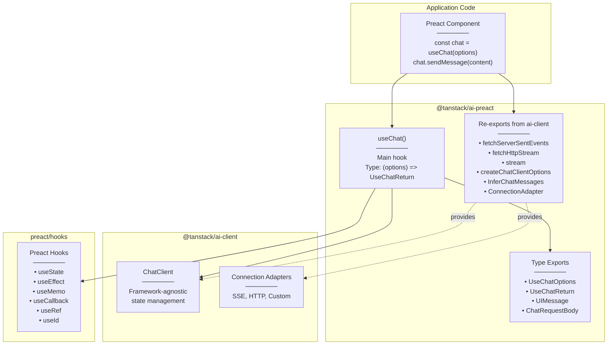
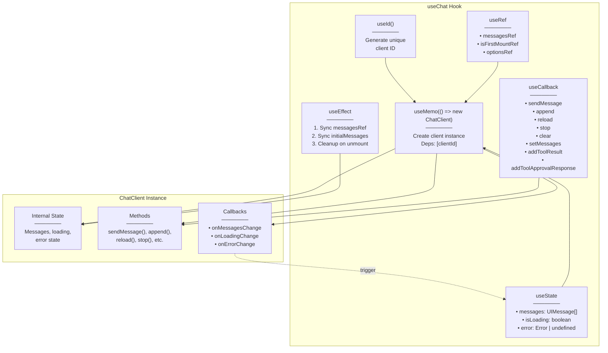
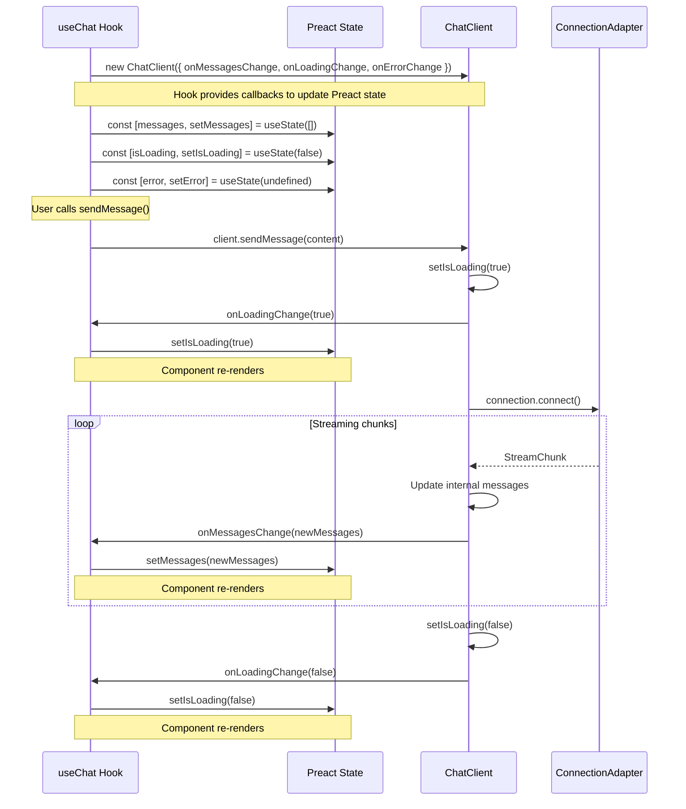
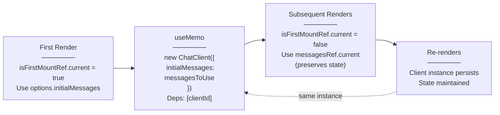
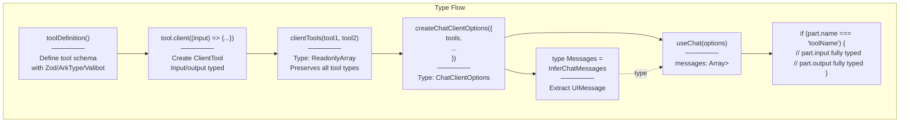
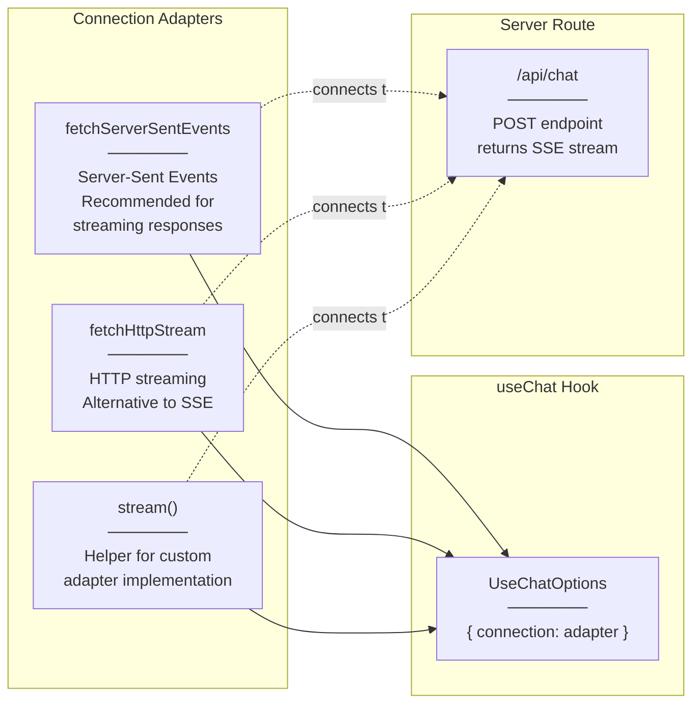
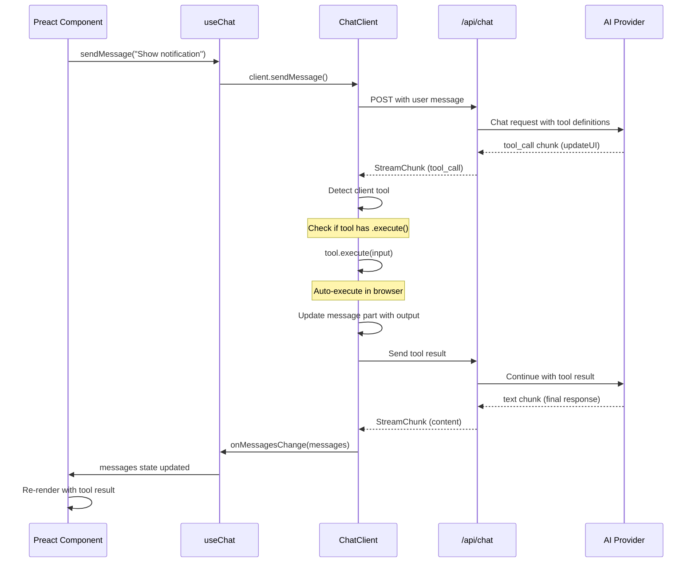
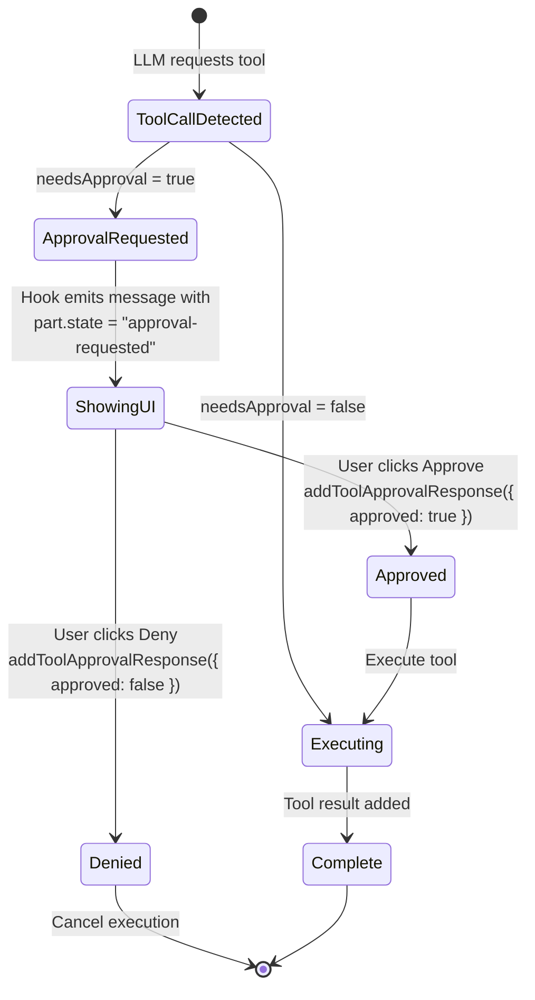
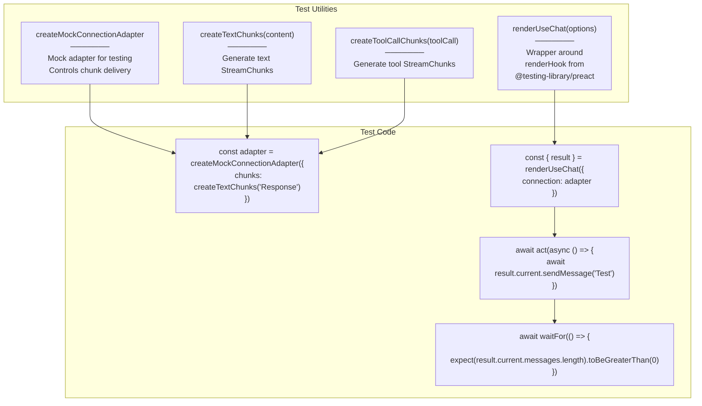

# Preact Integration (@tanstack/ai-preact)

<details>
<summary>Relevant source files</summary>

The following files were used as context for generating this wiki page:

- [examples/vanilla-chat/package.json](examples/vanilla-chat/package.json)
- [packages/typescript/ai-anthropic/package.json](packages/typescript/ai-anthropic/package.json)
- [packages/typescript/ai-client/package.json](packages/typescript/ai-client/package.json)
- [packages/typescript/ai-devtools/package.json](packages/typescript/ai-devtools/package.json)
- [packages/typescript/ai-gemini/package.json](packages/typescript/ai-gemini/package.json)
- [packages/typescript/ai-ollama/package.json](packages/typescript/ai-ollama/package.json)
- [packages/typescript/ai-openai/package.json](packages/typescript/ai-openai/package.json)
- [packages/typescript/ai-react-ui/package.json](packages/typescript/ai-react-ui/package.json)
- [packages/typescript/ai-react/package.json](packages/typescript/ai-react/package.json)
- [packages/typescript/ai-solid-ui/package.json](packages/typescript/ai-solid-ui/package.json)
- [packages/typescript/ai-solid/package.json](packages/typescript/ai-solid/package.json)
- [packages/typescript/ai-svelte/package.json](packages/typescript/ai-svelte/package.json)
- [packages/typescript/ai-vue-ui/package.json](packages/typescript/ai-vue-ui/package.json)
- [packages/typescript/ai-vue/package.json](packages/typescript/ai-vue/package.json)
- [packages/typescript/ai/package.json](packages/typescript/ai/package.json)
- [packages/typescript/react-ai-devtools/package.json](packages/typescript/react-ai-devtools/package.json)
- [packages/typescript/solid-ai-devtools/package.json](packages/typescript/solid-ai-devtools/package.json)

</details>

The `@tanstack/ai-preact` package provides Preact-specific bindings for TanStack AI's headless chat client. It wraps the framework-agnostic `ChatClient` from `@tanstack/ai-client` in a `useChat` hook that integrates with Preact's state management and lifecycle system.

**Scope**: This document covers the Preact framework integration layer only. For the underlying headless client, see [ChatClient](#4.1). For React integration, see [React Integration](#6.1). For Solid integration, see [Solid Integration](#6.2). For the core AI functionality, see [Core Library](#3).

**Key Characteristics**:

- Lightweight alternative to React integration with similar API surface
- Peer dependency on `preact >= 10.11.0`
- Uses Preact hooks (`useState`, `useEffect`, `useMemo`, etc.) from `preact/hooks`
- No separate UI component library (unlike React, Solid, and Vue)
- Supports Preact devtools via `@tanstack/preact-ai-devtools`

## Package Architecture



**Sources**: [packages/typescript/ai-preact/src/index.ts:1-18](), [packages/typescript/ai-preact/package.json:1-57]()

## useChat Hook Implementation

The `useChat` hook is the primary API surface for Preact integration. It creates and manages a `ChatClient` instance, synchronizing its state with Preact's reactive system.

### Internal Architecture



**Sources**: [packages/typescript/ai-preact/src/use-chat.ts:1-163]()

### Hook Signature

The hook accepts `UseChatOptions<TTools>` and returns `UseChatReturn<TTools>`:

```typescript
// From packages/typescript/ai-preact/src/use-chat.ts:14-16
export function useChat<TTools extends ReadonlyArray<AnyClientTool> = any>(
  options: UseChatOptions<TTools>
): UseChatReturn<TTools>
```

**UseChatOptions** extends `ChatClientOptions` but omits state callbacks managed by Preact:

- Includes: `connection`, `tools`, `initialMessages`, `id`, `body`, `onResponse`, `onChunk`, `onFinish`, `onError`, `streamProcessor`
- Omits: `onMessagesChange`, `onLoadingChange`, `onErrorChange` (managed by Preact state)

**UseChatReturn** provides:

- `messages: Array<UIMessage<TTools>>` - Current conversation
- `sendMessage: (content: string) => Promise<void>` - Send user message
- `append: (message: ModelMessage | UIMessage) => Promise<void>` - Append message
- `reload: () => Promise<void>` - Regenerate last assistant message
- `stop: () => void` - Abort current generation
- `clear: () => void` - Clear all messages
- `setMessages: (messages: Array<UIMessage<TTools>>) => void` - Manually set messages
- `addToolResult: (result) => Promise<void>` - Add client tool result
- `addToolApprovalResponse: (response) => Promise<void>` - Respond to approval request
- `isLoading: boolean` - Generation in progress
- `error: Error | undefined` - Current error state

**Sources**: [packages/typescript/ai-preact/src/types.ts:1-99]()

## State Synchronization

The hook bridges `ChatClient` state with Preact's reactive system through callback functions:



**Implementation Details**:

The hook creates a `ChatClient` with three state synchronization callbacks:

[packages/typescript/ai-preact/src/use-chat.ts:58-66]()

```typescript
onMessagesChange: (newMessages: Array<UIMessage<TTools>>) => {
  setMessages(newMessages)
},
onLoadingChange: (newIsLoading: boolean) => {
  setIsLoading(newIsLoading)
},
onErrorChange: (newError: Error | undefined) => {
  setError(newError)
},
```

These callbacks ensure that when `ChatClient` updates its internal state, Preact components automatically re-render with the new data.

**Sources**: [packages/typescript/ai-preact/src/use-chat.ts:39-68]()

## Lifecycle Management

The hook manages three critical lifecycle concerns: client instance stability, initial message synchronization, and cleanup on unmount.

### Client Instance Stability

The `ChatClient` is created in `useMemo` with only `clientId` as a dependency, ensuring it persists across re-renders:



[packages/typescript/ai-preact/src/use-chat.ts:39-68]() shows the implementation:

- On first mount: Uses `options.initialMessages` for the client
- On subsequent re-renders: Uses `messagesRef.current` to preserve existing state
- The `isFirstMountRef` flag prevents resetting messages on re-renders

**Sources**: [packages/typescript/ai-preact/src/use-chat.ts:26-68]()

### Initial Messages Synchronization

A dedicated effect ensures initial messages are synchronized:

[packages/typescript/ai-preact/src/use-chat.ts:73-81]()

```typescript
useEffect(() => {
  if (
    options.initialMessages &&
    options.initialMessages.length &&
    !messages.length
  ) {
    client.setMessagesManually(options.initialMessages)
  }
}, [])
```

This effect runs only on mount (empty dependency array) and sets initial messages if provided.

**Sources**: [packages/typescript/ai-preact/src/use-chat.ts:70-81]()

### Cleanup on Unmount

The hook stops any in-flight requests when the component unmounts:

[packages/typescript/ai-preact/src/use-chat.ts:87-91]()

```typescript
useEffect(() => {
  return () => {
    client.stop()
  }
}, [client])
```

**Critical Note**: The cleanup effect depends only on `[client]`, NOT on `[isLoading]`. Including `isLoading` would cause the cleanup to run when loading state changes, which would abort continuation requests (e.g., when an agent loop continues after executing a server tool).

**Sources**: [packages/typescript/ai-preact/src/use-chat.ts:83-91]()

## Type Safety and Tool Integration

The hook provides end-to-end type safety through TypeScript generics:



**Example from documentation**: [docs/api/ai-preact.md:220-268]() shows the complete type safety flow:

1. Define tool with schema: `updateUIDef = toolDefinition({ inputSchema: z.object({...}) })`
2. Create client implementation: `const updateUI = updateUIDef.client((input) => { /* input is typed */ })`
3. Create tools array: `const tools = clientTools(updateUI, saveToStorage)`
4. Create typed options: `const chatOptions = createChatClientOptions({ tools, ... })`
5. Extract message type: `type Messages = InferChatMessages<typeof chatOptions>`
6. Use in hook: `const { messages } = useChat(chatOptions)`
7. Type-safe discrimination in UI: `if (part.name === 'updateUI') { /* part.input typed */ }`

**Sources**: [docs/api/ai-preact.md:220-268](), [packages/typescript/ai-preact/src/types.ts:1-99]()

## Connection Adapters

The hook requires a `ConnectionAdapter` to communicate with server-side AI routes. The package re-exports adapters from `@tanstack/ai-client`:



**Usage Example** from [docs/api/ai-preact.md:112-164]():

```typescript
import { useChat, fetchServerSentEvents } from '@tanstack/ai-preact'

export function Chat() {
  const { messages, sendMessage, isLoading } = useChat({
    connection: fetchServerSentEvents('/api/chat'),
  })
  // ... render UI
}
```

**Sources**: [packages/typescript/ai-preact/src/index.ts:10-17](), [docs/api/ai-preact.md:96-107]()

## Client Tool Execution

Client tools execute automatically in the browser when the LLM calls them. The hook handles this through the `ChatClient`:



**Implementation**: Client tools are passed in options and automatically executed by `ChatClient`. The hook doesn't need special handling beyond passing tools to the client constructor [packages/typescript/ai-preact/src/use-chat.ts:56]().

**Example** from [docs/api/ai-preact.md:232-266]():

```typescript
const updateUI = updateUIDef.client((input) => {
  setNotification({ message: input.message, type: input.type })
  return { success: true }
})

const tools = clientTools(updateUI)

const { messages } = useChat({
  connection: fetchServerSentEvents('/api/chat'),
  tools, // Auto-execution enabled
})
```

**Sources**: [packages/typescript/ai-preact/src/use-chat.ts:47-68](), [docs/api/ai-preact.md:220-268]()

## Tool Approval Flow

Tools can require user approval before execution by setting `needsApproval: true` in the tool definition. The hook provides `addToolApprovalResponse()` to handle approval:



**Usage Example** from [docs/api/ai-preact.md:168-218]():

```typescript
const { messages, addToolApprovalResponse } = useChat({
  connection: fetchServerSentEvents('/api/chat'),
})

return (
  <div>
    {messages.map((message) =>
      message.parts.map((part) => {
        if (
          part.type === 'tool-call' &&
          part.state === 'approval-requested' &&
          part.approval
        ) {
          return (
            <div key={part.id}>
              <p>Approve: {part.name}</p>
              <button onClick={() =>
                addToolApprovalResponse({
                  id: part.approval!.id,
                  approved: true,
                })
              }>Approve</button>
              <button onClick={() =>
                addToolApprovalResponse({
                  id: part.approval!.id,
                  approved: false,
                })
              }>Deny</button>
            </div>
          )
        }
      })
    )}
  </div>
)
```

**Key Points**:

- The `approval.id` (not `toolCallId`) is used in the response
- The part's `state` field indicates approval status: `"approval-requested"`, `"approval-responded"`
- The UI must check `part.approval` exists before accessing `approval.id`

**Sources**: [packages/typescript/ai-preact/src/use-chat.ts:142-147](), [packages/typescript/ai-preact/src/types.ts:61-67](), [docs/api/ai-preact.md:168-218]()

## Testing Utilities

The package provides test utilities for unit testing Preact components that use the hook:



**Example Test** from [packages/typescript/ai-preact/tests/use-chat.test.ts:196-216]():

```typescript
it('should send a message and append it', async () => {
  const chunks = createTextChunks('Hello, world!')
  const adapter = createMockConnectionAdapter({ chunks })
  const { result } = renderUseChat({ connection: adapter })

  await act(async () => {
    await result.current.sendMessage('Hello')
  })

  await waitFor(() => {
    expect(result.current.messages.length).toBeGreaterThan(0)
  })

  const userMessage = result.current.messages.find((m) => m.role === 'user')
  expect(userMessage).toBeDefined()
  if (userMessage) {
    expect(userMessage.parts[0]).toEqual({
      type: 'text',
      content: 'Hello',
    })
  }
})
```

**Sources**: [packages/typescript/ai-preact/tests/test-utils.ts:1-30](), [packages/typescript/ai-preact/tests/use-chat.test.ts:1-1500]()

## Comparison with React Integration

The Preact integration is structurally similar to `@tanstack/ai-react` but uses Preact-specific hooks:

| Feature             | @tanstack/ai-preact                                                  | @tanstack/ai-react                             |
| ------------------- | -------------------------------------------------------------------- | ---------------------------------------------- |
| **Package Version** | 0.1.0 (initial release)                                              | 0.2.1                                          |
| **Peer Dependency** | `preact >= 10.11.0`                                                  | `react >= 18.0.0`                              |
| **Hook Import**     | `import { useChat } from '@tanstack/ai-preact'`                      | `import { useChat } from '@tanstack/ai-react'` |
| **Hooks Source**    | `preact/hooks`                                                       | `react`                                        |
| **Hook Functions**  | `useState`, `useEffect`, `useMemo`, `useCallback`, `useRef`, `useId` | Same, but from React                           |
| **Bundle Size**     | Smaller (Preact is ~3KB)                                             | Larger (React is ~40KB)                        |
| **API Surface**     | Identical return type                                                | Identical return type                          |
| **UI Components**   | No separate -ui package                                              | `@tanstack/ai-react-ui` available              |
| **Devtools**        | `@tanstack/preact-ai-devtools`                                       | `@tanstack/react-ai-devtools`                  |
| **Testing Library** | `@testing-library/preact`                                            | `@testing-library/react`                       |

**Key Implementation Difference**:

The only substantive difference is the import source for hooks:

[packages/typescript/ai-preact/src/use-chat.ts:1-8]()

```typescript
import {
  useCallback,
  useEffect,
  useId,
  useMemo,
  useRef,
  useState,
} from 'preact/hooks'
```

vs [packages/typescript/ai-react/package.json:1-60]() showing React imports.

**When to Choose Preact**:

- Building lightweight applications where bundle size matters
- Using Preact already in the project
- Need React-like API but smaller footprint
- Don't need the React-specific UI component library

**Sources**: [packages/typescript/ai-preact/package.json:1-57](), [packages/typescript/ai-react/package.json:1-60](), [packages/typescript/ai-preact/src/use-chat.ts:1-163]()

## Package Metadata

| Property              | Value                                                                       |
| --------------------- | --------------------------------------------------------------------------- |
| **Package Name**      | `@tanstack/ai-preact`                                                       |
| **Version**           | 0.1.0                                                                       |
| **License**           | MIT                                                                         |
| **Type**              | ESM (`"type": "module"`)                                                    |
| **Main Export**       | `./dist/esm/index.js`                                                       |
| **Types**             | `./dist/esm/index.d.ts`                                                     |
| **Dependencies**      | `@tanstack/ai-client` (workspace)                                           |
| **Peer Dependencies** | `@tanstack/ai` (workspace), `preact >= 10.11.0`                             |
| **Dev Dependencies**  | `@testing-library/preact`, `@vitest/coverage-v8`, `jsdom`, `preact`, `vite` |

**Build Process**:

- Build command: `vite build`
- Output: `dist/esm/` directory
- Test command: `vitest run`
- Type checking: `tsc`
- Linting: `eslint ./src`

**Sources**: [packages/typescript/ai-preact/package.json:1-57]()
