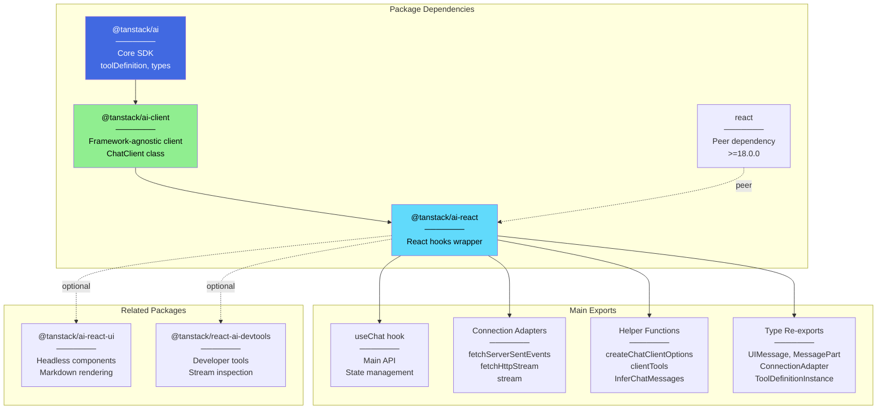
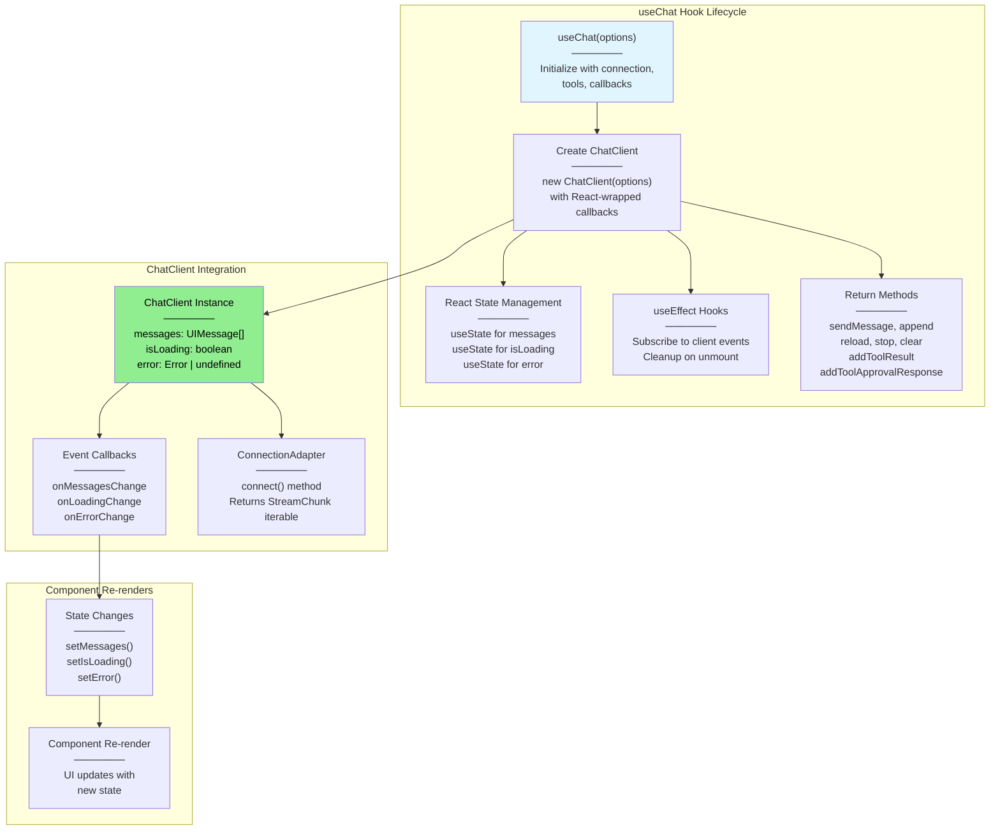
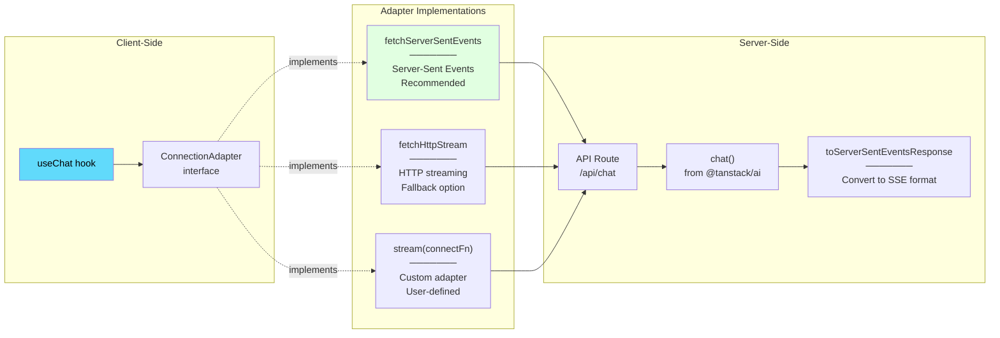
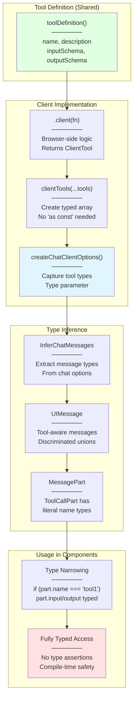
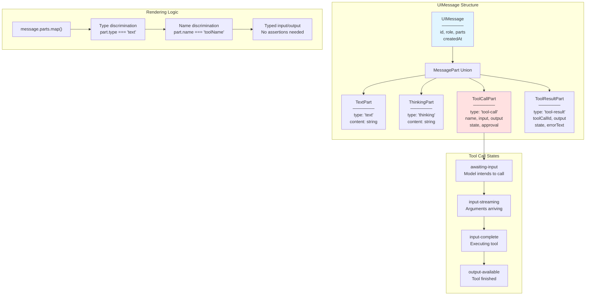
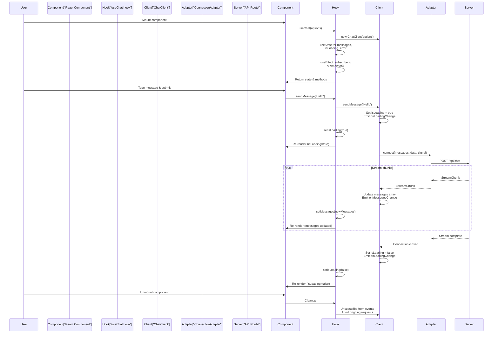

# React Integration (@tanstack/ai-react)

<details>
<summary>Relevant source files</summary>

The following files were used as context for generating this wiki page:

- [docs/adapters/anthropic.md](docs/adapters/anthropic.md)
- [docs/adapters/gemini.md](docs/adapters/gemini.md)
- [docs/adapters/ollama.md](docs/adapters/ollama.md)
- [docs/adapters/openai.md](docs/adapters/openai.md)
- [docs/getting-started/quick-start.md](docs/getting-started/quick-start.md)
- [examples/ts-svelte-chat/CHANGELOG.md](examples/ts-svelte-chat/CHANGELOG.md)
- [examples/ts-svelte-chat/package.json](examples/ts-svelte-chat/package.json)
- [examples/ts-vue-chat/CHANGELOG.md](examples/ts-vue-chat/CHANGELOG.md)
- [examples/ts-vue-chat/package.json](examples/ts-vue-chat/package.json)
- [packages/typescript/ai-anthropic/package.json](packages/typescript/ai-anthropic/package.json)
- [packages/typescript/ai-gemini/CHANGELOG.md](packages/typescript/ai-gemini/CHANGELOG.md)
- [packages/typescript/ai-gemini/package.json](packages/typescript/ai-gemini/package.json)
- [packages/typescript/ai-ollama/package.json](packages/typescript/ai-ollama/package.json)
- [packages/typescript/ai-openai/CHANGELOG.md](packages/typescript/ai-openai/CHANGELOG.md)
- [packages/typescript/ai-openai/package.json](packages/typescript/ai-openai/package.json)
- [packages/typescript/ai-react-ui/package.json](packages/typescript/ai-react-ui/package.json)
- [packages/typescript/ai-react/package.json](packages/typescript/ai-react/package.json)
- [packages/typescript/ai-solid-ui/package.json](packages/typescript/ai-solid-ui/package.json)
- [packages/typescript/ai-solid/package.json](packages/typescript/ai-solid/package.json)
- [packages/typescript/ai-svelte/package.json](packages/typescript/ai-svelte/package.json)
- [packages/typescript/ai-vue-ui/package.json](packages/typescript/ai-vue-ui/package.json)
- [packages/typescript/ai-vue/package.json](packages/typescript/ai-vue/package.json)
- [packages/typescript/smoke-tests/adapters/CHANGELOG.md](packages/typescript/smoke-tests/adapters/CHANGELOG.md)
- [packages/typescript/smoke-tests/adapters/package.json](packages/typescript/smoke-tests/adapters/package.json)
- [packages/typescript/smoke-tests/e2e/CHANGELOG.md](packages/typescript/smoke-tests/e2e/CHANGELOG.md)
- [packages/typescript/smoke-tests/e2e/package.json](packages/typescript/smoke-tests/e2e/package.json)

</details>

The `@tanstack/ai-react` package provides React hooks for building AI chat interfaces. It wraps the framework-agnostic `@tanstack/ai-client` with React-specific state management, offering the `useChat` hook that manages messages, loading states, and streaming responses with automatic re-rendering on updates.

For other framework integrations, see [Solid Integration](#6.2), [Vue Integration](#6.3), [Svelte Integration](#6.4), and [Preact Integration](#6.5). For UI components with markdown rendering, see [React UI Components](#7.1). For the underlying headless client, see [ChatClient](#4.1).

## Package Architecture



**Package Metadata**

| Property          | Value                                                                       |
| ----------------- | --------------------------------------------------------------------------- |
| Name              | `@tanstack/ai-react`                                                        |
| Version           | 0.2.1                                                                       |
| Dependencies      | `@tanstack/ai-client` (workspace:\*)                                        |
| Peer Dependencies | `@tanstack/ai` (workspace:^), `@types/react` (>=18.0.0), `react` (>=18.0.0) |
| Build System      | Vite                                                                        |
| Module Format     | ESM                                                                         |

Sources: [packages/typescript/ai-react/package.json:1-60]()

## useChat Hook Architecture



The `useChat` hook wraps the `ChatClient` class from `@tanstack/ai-client` and provides React-specific state management. It uses `useState` to manage messages, loading state, and errors, with `useEffect` hooks to subscribe to client events and trigger re-renders when state changes.

Sources: [docs/api/ai-react.md:16-94]()

## Core API: useChat Hook

### Basic Usage

The `useChat` hook accepts a `ChatClientOptions` object (from `@tanstack/ai-client`) and returns state and methods for managing chat interactions:

```typescript
import { useChat, fetchServerSentEvents } from '@tanstack/ai-react'

function ChatComponent() {
  const { messages, sendMessage, isLoading, error } = useChat({
    connection: fetchServerSentEvents('/api/chat'),
  })

  // messages: UIMessage[] - current conversation
  // sendMessage: (content: string) => Promise<void>
  // isLoading: boolean - streaming in progress
  // error: Error | undefined - current error state
}
```

### Hook Options

| Option            | Type                           | Description                                                                |
| ----------------- | ------------------------------ | -------------------------------------------------------------------------- |
| `connection`      | `ConnectionAdapter`            | Required. Connection adapter for streaming (e.g., `fetchServerSentEvents`) |
| `tools`           | `ClientTool[]`                 | Optional. Array of client tool implementations created with `.client()`    |
| `initialMessages` | `UIMessage[]`                  | Optional. Initial messages to populate the conversation                    |
| `id`              | `string`                       | Optional. Unique identifier for this chat instance                         |
| `body`            | `Record<string, any>`          | Optional. Additional parameters to send with requests                      |
| `onResponse`      | `(response: Response) => void` | Optional. Callback when response is received                               |
| `onChunk`         | `(chunk: StreamChunk) => void` | Optional. Callback for each stream chunk                                   |
| `onFinish`        | `(message: UIMessage) => void` | Optional. Callback when streaming completes                                |
| `onError`         | `(error: Error) => void`       | Optional. Callback when error occurs                                       |
| `streamProcessor` | `StreamProcessorOptions`       | Optional. Stream processing configuration                                  |

### Return Value

| Property                  | Type                                                    | Description                           |
| ------------------------- | ------------------------------------------------------- | ------------------------------------- |
| `messages`                | `UIMessage[]`                                           | Current conversation messages         |
| `sendMessage`             | `(content: string) => Promise<void>`                    | Send a user message                   |
| `append`                  | `(message: ModelMessage \| UIMessage) => Promise<void>` | Append a message to conversation      |
| `reload`                  | `() => Promise<void>`                                   | Reload the last assistant message     |
| `stop`                    | `() => void`                                            | Stop current streaming response       |
| `clear`                   | `() => void`                                            | Clear all messages                    |
| `isLoading`               | `boolean`                                               | Whether streaming is in progress      |
| `error`                   | `Error \| undefined`                                    | Current error state                   |
| `setMessages`             | `(messages: UIMessage[]) => void`                       | Manually set messages array           |
| `addToolResult`           | `(result: ToolResult) => Promise<void>`                 | Add result from client tool execution |
| `addToolApprovalResponse` | `(response: ApprovalResponse) => Promise<void>`         | Respond to tool approval request      |

Sources: [docs/api/ai-react.md:16-94]()

## Connection Adapters



### fetchServerSentEvents

The recommended adapter for most use cases. Provides reliable streaming with automatic reconnection:

```typescript
import { useChat, fetchServerSentEvents } from '@tanstack/ai-react'

// Basic usage
const { messages } = useChat({
  connection: fetchServerSentEvents('/api/chat'),
})

// With options
const { messages } = useChat({
  connection: fetchServerSentEvents('/api/chat', {
    headers: {
      Authorization: 'Bearer token',
    },
  }),
})

// Dynamic values (evaluated on each request)
const { messages } = useChat({
  connection: fetchServerSentEvents(
    () => `/api/chat?user=${currentUserId}`,
    () => ({
      headers: { Authorization: `Bearer ${getToken()}` },
    })
  ),
})
```

### fetchHttpStream

For environments that don't support SSE:

```typescript
import { useChat, fetchHttpStream } from '@tanstack/ai-react'

const { messages } = useChat({
  connection: fetchHttpStream('/api/chat'),
})
```

### Custom Adapters

For specialized protocols or requirements:

```typescript
import { stream, type ConnectionAdapter } from '@tanstack/ai-react'
import type { StreamChunk, ModelMessage } from '@tanstack/ai'

const customAdapter: ConnectionAdapter = stream(
  async (
    messages: ModelMessage[],
    data?: Record<string, any>,
    signal?: AbortSignal
  ) => {
    const response = await fetch('/api/chat', {
      method: 'POST',
      headers: { 'Content-Type': 'application/json' },
      body: JSON.stringify({ messages, ...data }),
      signal,
    })

    if (!response.ok) {
      throw new Error(`HTTP error! status: ${response.status}`)
    }

    // Return async iterable of StreamChunk
    return processStream(response)
  }
)

const { messages } = useChat({
  connection: customAdapter,
})
```

Sources: [docs/guides/connection-adapters.md:10-61](), [docs/api/ai-react.md:98-107]()

## Type Safety with Client Tools



### End-to-End Type Safety Example

```typescript
// 1. Define tool (shared between server and client)
import { toolDefinition } from '@tanstack/ai'
import { z } from 'zod'

const updateUIDef = toolDefinition({
  name: 'update_ui',
  description: 'Update the UI with information',
  inputSchema: z.object({
    message: z.string(),
    type: z.enum(['success', 'error', 'info'])
  }),
  outputSchema: z.object({
    success: z.boolean()
  })
})

// 2. Create client implementation
import { useState } from 'react'
import { useChat, fetchServerSentEvents } from '@tanstack/ai-react'
import { clientTools, createChatClientOptions, type InferChatMessages } from '@tanstack/ai-client'

function ChatComponent() {
  const [notification, setNotification] = useState(null)

  // Client implementation with fully typed input
  const updateUI = updateUIDef.client((input) => {
    // ✅ input is { message: string, type: 'success' | 'error' | 'info' }
    setNotification({ message: input.message, type: input.type })
    return { success: true }
  })

  // 3. Create typed tools array (no 'as const' needed!)
  const tools = clientTools(updateUI)

  // 4. Create chat options with type capture
  const chatOptions = createChatClientOptions({
    connection: fetchServerSentEvents('/api/chat'),
    tools
  })

  // 5. Infer message types
  type ChatMessages = InferChatMessages<typeof chatOptions>

  const { messages, sendMessage } = useChat(chatOptions)

  // 6. Type-safe rendering
  return (
    <div>
      {messages.map((message: ChatMessages[number]) => (
        <div key={message.id}>
          {message.parts.map((part) => {
            if (part.type === 'tool-call' && part.name === 'update_ui') {
              // ✅ TypeScript knows part.name is literally 'update_ui'
              // ✅ part.input is { message: string, type: 'success' | 'error' | 'info' }
              // ✅ part.output is { success: boolean } | undefined
              return (
                <div>
                  Tool: {part.name}
                  Message: {part.input.message}
                  Type: {part.input.type}
                  {part.output && <span>Success: {part.output.success}</span>}
                </div>
              )
            }
          })}
        </div>
      ))}
    </div>
  )
}
```

### Type Safety Benefits

| Feature        | Without Type Safety      | With Type Safety                                                                        |
| -------------- | ------------------------ | --------------------------------------------------------------------------------------- |
| Tool names     | `string`                 | Literal union (`'update_ui' \| 'save_data'`)                                            |
| Tool input     | `any`                    | Inferred from inputSchema (`{ message: string, type: 'success' \| 'error' \| 'info' }`) |
| Tool output    | `any`                    | Inferred from outputSchema (`{ success: boolean }`)                                     |
| Type narrowing | Requires type assertions | Automatic with `part.name === 'tool1'`                                                  |
| Refactoring    | Runtime errors           | Compile-time errors                                                                     |

Sources: [docs/api/ai-react.md:219-269](), [docs/guides/client-tools.md:88-230]()

## Integration Patterns

### Basic Chat Interface

```typescript
import { useState } from 'react'
import { useChat, fetchServerSentEvents } from '@tanstack/ai-react'

export function Chat() {
  const [input, setInput] = useState('')

  const { messages, sendMessage, isLoading } = useChat({
    connection: fetchServerSentEvents('/api/chat')
  })

  const handleSubmit = (e: React.FormEvent) => {
    e.preventDefault()
    if (input.trim() && !isLoading) {
      sendMessage(input)
      setInput('')
    }
  }

  return (
    <div>
      <div>
        {messages.map((message) => (
          <div key={message.id}>
            <strong>{message.role}:</strong>
            {message.parts.map((part, idx) => {
              if (part.type === 'text') {
                return <span key={idx}>{part.content}</span>
              }
              if (part.type === 'thinking') {
                return (
                  <div key={idx} className="text-sm text-gray-500 italic">
                    💭 Thinking: {part.content}
                  </div>
                )
              }
              return null
            })}
          </div>
        ))}
      </div>
      <form onSubmit={handleSubmit}>
        <input
          value={input}
          onChange={(e) => setInput(e.target.value)}
          disabled={isLoading}
        />
        <button type="submit" disabled={isLoading}>
          Send
        </button>
      </form>
    </div>
  )
}
```

### Tool Approval Flow

```typescript
import { useChat, fetchServerSentEvents } from '@tanstack/ai-react'

export function ChatWithApproval() {
  const { messages, sendMessage, addToolApprovalResponse } = useChat({
    connection: fetchServerSentEvents('/api/chat')
  })

  return (
    <div>
      {messages.map((message) =>
        message.parts.map((part) => {
          if (
            part.type === 'tool-call' &&
            part.state === 'approval-requested' &&
            part.approval
          ) {
            return (
              <div key={part.id}>
                <p>Approve tool: {part.name}</p>
                <p>Input: {JSON.stringify(part.input)}</p>
                <button
                  onClick={() =>
                    addToolApprovalResponse({
                      id: part.approval!.id,
                      approved: true
                    })
                  }
                >
                  Approve
                </button>
                <button
                  onClick={() =>
                    addToolApprovalResponse({
                      id: part.approval!.id,
                      approved: false
                    })
                  }
                >
                  Deny
                </button>
              </div>
            )
          }
          return null
        })
      )}
    </div>
  )
}
```

### Multiple Providers with Dynamic Selection

```typescript
import { useState } from 'react'
import { useChat, fetchServerSentEvents } from '@tanstack/ai-react'

type Provider = 'openai' | 'anthropic' | 'gemini'

export function ChatWithProviderSelection() {
  const [provider, setProvider] = useState<Provider>('openai')
  const [model, setModel] = useState('gpt-4o')

  const { messages, sendMessage, isLoading } = useChat({
    connection: fetchServerSentEvents('/api/chat'),
    body: {
      provider,
      model
    }
  })

  return (
    <div>
      <select value={provider} onChange={(e) => setProvider(e.target.value as Provider)}>
        <option value="openai">OpenAI</option>
        <option value="anthropic">Anthropic</option>
        <option value="gemini">Gemini</option>
      </select>

      <select value={model} onChange={(e) => setModel(e.target.value)}>
        {provider === 'openai' && (
          <>
            <option value="gpt-4o">GPT-4o</option>
            <option value="gpt-5">GPT-5</option>
          </>
        )}
        {provider === 'anthropic' && (
          <option value="claude-sonnet-4-5">Claude Sonnet 4.5</option>
        )}
        {provider === 'gemini' && (
          <option value="gemini-2.5-flash">Gemini 2.5 Flash</option>
        )}
      </select>

      {/* Chat UI */}
    </div>
  )
}
```

Sources: [docs/api/ai-react.md:109-218](), [examples/ts-react-chat/src/routes/api.tanchat.ts:54-170]()

## Message Structure and Rendering



### Message Part Types

Each `UIMessage` contains an array of `MessagePart` objects that can be discriminated by their `type` field:

| Part Type        | Fields                                                                            | Usage                                                  |
| ---------------- | --------------------------------------------------------------------------------- | ------------------------------------------------------ |
| `TextPart`       | `type: 'text'`, `content: string`                                                 | Regular text content from assistant                    |
| `ThinkingPart`   | `type: 'thinking'`, `content: string`                                             | Model's reasoning process (UI-only, not sent to model) |
| `ToolCallPart`   | `type: 'tool-call'`, `id`, `name`, `input`, `output`, `state`, `approval`         | Tool execution request and result                      |
| `ToolResultPart` | `type: 'tool-result'`, `id`, `toolCallId`, `tool`, `output`, `state`, `errorText` | Tool execution result for LLM conversation             |

### Rendering Example with All Part Types

```typescript
function MessageComponent({ message }: { message: UIMessage }) {
  return (
    <div className="message">
      <div className="message-header">
        <strong>{message.role}</strong>
        <span>{message.createdAt?.toLocaleTimeString()}</span>
      </div>

      {message.parts.map((part, idx) => {
        // Text content
        if (part.type === 'text') {
          return <p key={idx}>{part.content}</p>
        }

        // Thinking/reasoning
        if (part.type === 'thinking') {
          return (
            <details key={idx} className="thinking">
              <summary>💭 Thinking...</summary>
              <pre>{part.content}</pre>
            </details>
          )
        }

        // Tool execution
        if (part.type === 'tool-call') {
          return (
            <div key={idx} className="tool-call">
              <div className="tool-name">🔧 {part.name}</div>

              {/* Show tool state */}
              {part.state === 'awaiting-input' && <span>⏳ Preparing...</span>}
              {part.state === 'input-streaming' && <span>📥 Receiving arguments...</span>}
              {part.state === 'input-complete' && <span>▶️ Executing...</span>}

              {/* Show input if available */}
              {part.input && (
                <div className="tool-input">
                  Input: <pre>{JSON.stringify(part.input, null, 2)}</pre>
                </div>
              )}

              {/* Show output if available */}
              {part.output && (
                <div className="tool-output">
                  Output: <pre>{JSON.stringify(part.output, null, 2)}</pre>
                </div>
              )}

              {/* Show approval UI if needed */}
              {part.state === 'approval-requested' && part.approval && (
                <div className="approval-request">
                  <p>This tool requires approval</p>
                  <button onClick={() => handleApproval(part.approval!.id, true)}>
                    Approve
                  </button>
                  <button onClick={() => handleApproval(part.approval!.id, false)}>
                    Deny
                  </button>
                </div>
              )}
            </div>
          )
        }

        return null
      })}
    </div>
  )
}
```

Sources: [docs/api/ai-client.md:240-330](), [docs/guides/client-tools.md:232-263]()

## Lifecycle and State Management



### State Update Flow

The `useChat` hook manages state through three primary React state variables:

1. **Messages State**: `const [messages, setMessages] = useState<UIMessage[]>([])` - Updated when `onMessagesChange` callback fires from `ChatClient`
2. **Loading State**: `const [isLoading, setIsLoading] = useState(false)` - Updated when `onLoadingChange` callback fires
3. **Error State**: `const [error, setError] = useState<Error | undefined>()` - Updated when `onErrorChange` callback fires

### Effect Hooks

The hook uses `useEffect` for:

- Subscribing to `ChatClient` events on mount
- Unsubscribing and aborting requests on unmount
- Responding to changes in connection or tool configurations

### Method Delegation

All methods returned by `useChat` delegate to the underlying `ChatClient` instance:

| Hook Method                         | ChatClient Method                   | Description                    |
| ----------------------------------- | ----------------------------------- | ------------------------------ |
| `sendMessage(content)`              | `sendMessage(content)`              | Send user message              |
| `append(message)`                   | `append(message)`                   | Append message to conversation |
| `reload()`                          | `reload()`                          | Reload last assistant message  |
| `stop()`                            | `stop()`                            | Stop streaming                 |
| `clear()`                           | `clear()`                           | Clear all messages             |
| `setMessages(messages)`             | `setMessagesManually(messages)`     | Manually set messages          |
| `addToolResult(result)`             | `addToolResult(result)`             | Add tool execution result      |
| `addToolApprovalResponse(response)` | `addToolApprovalResponse(response)` | Respond to approval request    |

Sources: [docs/api/ai-react.md:16-94](), [docs/api/ai-client.md:15-128]()

## Peer Dependencies and Compatibility

### React Version Support

The package supports React 18.0.0 and above, including React 19:

| React Version | Support Status     | Notes                       |
| ------------- | ------------------ | --------------------------- |
| React 17.x    | ❌ Not supported   | Missing required hooks APIs |
| React 18.x    | ✅ Fully supported | Recommended stable version  |
| React 19.x    | ✅ Fully supported | Latest features supported   |

### TypeScript Requirements

TypeScript types require `@types/react` version 18.0.0 or higher. The package is written in TypeScript and provides full type definitions.

### Build Output

The package is built with Vite and outputs ESM format:

- Module entry: `./dist/esm/index.js`
- Types entry: `./dist/esm/index.d.ts`

Sources: [packages/typescript/ai-react/package.json:46-60]()

## Relationship to Other Packages

### @tanstack/ai-client

The `useChat` hook is a thin React wrapper around the `ChatClient` class from `@tanstack/ai-client`. The client provides the core functionality:

- Message state management
- Connection adapter handling
- Stream processing
- Tool execution logic

React bindings add:

- React state (`useState`)
- React effects (`useEffect`)
- Component lifecycle integration
- Automatic re-rendering

### @tanstack/ai-react-ui

Optional companion package providing headless UI components:

- Markdown rendering with `react-markdown`
- Syntax highlighting with `rehype-highlight`
- GitHub-flavored markdown with `remark-gfm`
- Sanitization with `rehype-sanitize`

These components work with the messages from `useChat` to provide rich text rendering. See [React UI Components](#7.1) for details.

### @tanstack/react-ai-devtools

Optional developer tools package for debugging:

- Stream chunk inspection
- Message history visualization
- Tool call tracking
- Performance monitoring

The devtools integrate with `useChat` to provide real-time debugging capabilities. See [Framework-Specific Devtools](#8.2) for details.

Sources: [packages/typescript/ai-react-ui/package.json:1-63](), [docs/getting-started/overview.md:77-90]()
