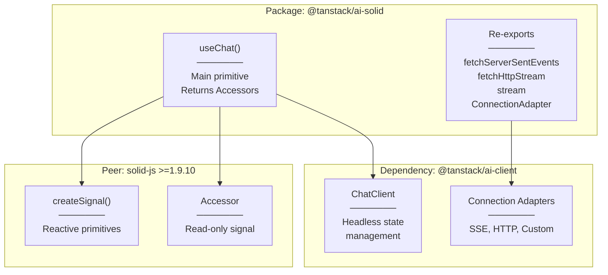
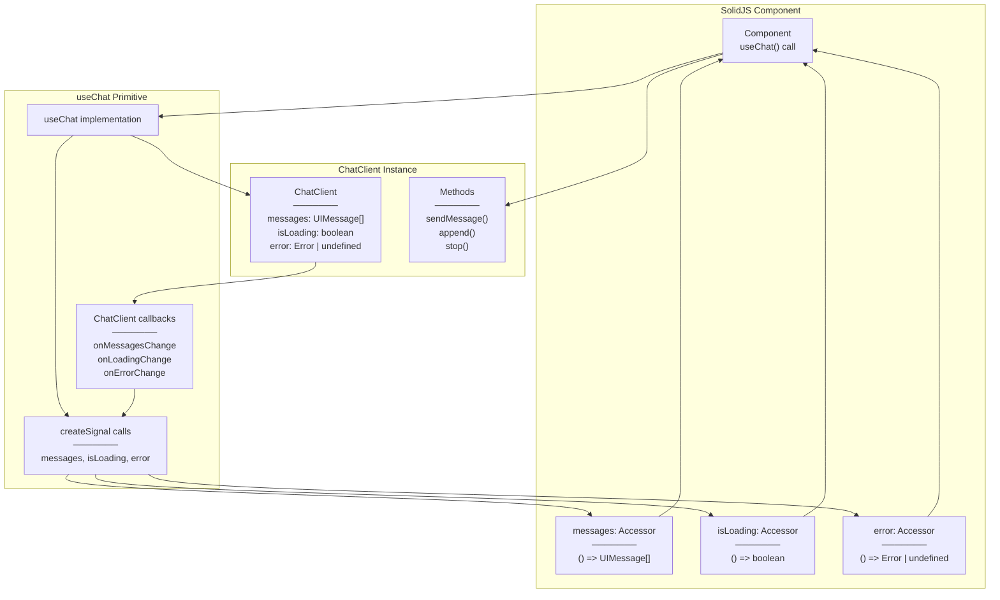
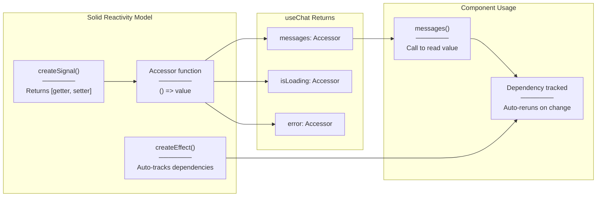
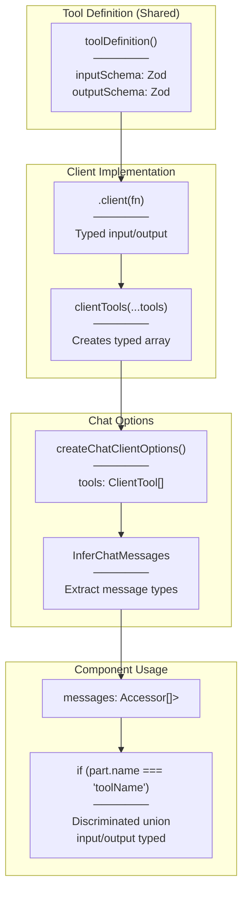
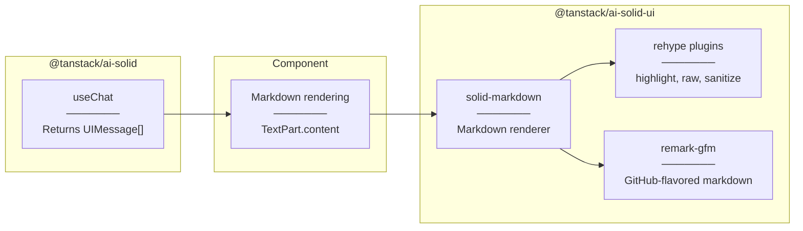

# Solid Integration (@tanstack/ai-solid)

<details>
<summary>Relevant source files</summary>

The following files were used as context for generating this wiki page:

- [.github/workflows/autofix.yml](.github/workflows/autofix.yml)
- [.github/workflows/release.yml](.github/workflows/release.yml)
- [examples/ts-svelte-chat/CHANGELOG.md](examples/ts-svelte-chat/CHANGELOG.md)
- [examples/ts-svelte-chat/package.json](examples/ts-svelte-chat/package.json)
- [examples/ts-vue-chat/CHANGELOG.md](examples/ts-vue-chat/CHANGELOG.md)
- [examples/ts-vue-chat/package.json](examples/ts-vue-chat/package.json)
- [nx.json](nx.json)
- [package.json](package.json)
- [packages/typescript/ai-anthropic/package.json](packages/typescript/ai-anthropic/package.json)
- [packages/typescript/ai-gemini/CHANGELOG.md](packages/typescript/ai-gemini/CHANGELOG.md)
- [packages/typescript/ai-gemini/package.json](packages/typescript/ai-gemini/package.json)
- [packages/typescript/ai-ollama/package.json](packages/typescript/ai-ollama/package.json)
- [packages/typescript/ai-openai/CHANGELOG.md](packages/typescript/ai-openai/CHANGELOG.md)
- [packages/typescript/ai-openai/package.json](packages/typescript/ai-openai/package.json)
- [packages/typescript/ai-react-ui/package.json](packages/typescript/ai-react-ui/package.json)
- [packages/typescript/ai-react/package.json](packages/typescript/ai-react/package.json)
- [packages/typescript/ai-solid-ui/package.json](packages/typescript/ai-solid-ui/package.json)
- [packages/typescript/ai-solid/package.json](packages/typescript/ai-solid/package.json)
- [packages/typescript/ai-solid/tsdown.config.ts](packages/typescript/ai-solid/tsdown.config.ts)
- [packages/typescript/ai-svelte/package.json](packages/typescript/ai-svelte/package.json)
- [packages/typescript/ai-vue-ui/package.json](packages/typescript/ai-vue-ui/package.json)
- [packages/typescript/ai-vue/package.json](packages/typescript/ai-vue/package.json)
- [packages/typescript/smoke-tests/adapters/CHANGELOG.md](packages/typescript/smoke-tests/adapters/CHANGELOG.md)
- [packages/typescript/smoke-tests/adapters/package.json](packages/typescript/smoke-tests/adapters/package.json)
- [packages/typescript/smoke-tests/e2e/CHANGELOG.md](packages/typescript/smoke-tests/e2e/CHANGELOG.md)
- [packages/typescript/smoke-tests/e2e/package.json](packages/typescript/smoke-tests/e2e/package.json)
- [pnpm-lock.yaml](pnpm-lock.yaml)
- [scripts/generate-docs.ts](scripts/generate-docs.ts)

</details>

The `@tanstack/ai-solid` package provides SolidJS primitives for TanStack AI, wrapping the headless `ChatClient` from `@tanstack/ai-client` with reactive Solid signals. This integration enables developers to build AI chat interfaces using Solid's fine-grained reactivity system.

For React bindings, see [React Integration](#6.1). For Vue bindings, see [Vue Integration](#6.3). For framework-agnostic usage, see [ChatClient](#4.1).

## Package Overview

The `@tanstack/ai-solid` package is a thin reactive wrapper around the framework-agnostic `ChatClient` class. It exposes a single `useChat` primitive that returns Solid `Accessor` functions instead of plain values, enabling automatic reactivity through Solid's signal system.

**Package Structure:**



**Sources:** [packages/typescript/ai-solid/package.json:1-59](), [docs/api/ai-solid.md:1-333]()

## Installation and Peer Dependencies

The package requires `solid-js` version 1.9.10 or higher and the workspace peer `@tanstack/ai`:

```bash
npm install @tanstack/ai-solid
```

**Peer Dependencies:**

- `@tanstack/ai` (workspace:^)
- `solid-js` (>=1.9.10)

**Direct Dependency:**

- `@tanstack/ai-client` (workspace:\*)

**Sources:** [packages/typescript/ai-solid/package.json:41-47]()

## useChat Primitive

The `useChat` primitive is the main entry point for managing chat state in Solid applications. It creates a `ChatClient` instance internally and wraps its state in Solid reactive primitives.

### Signature and Return Type

```typescript
function useChat<TTools extends readonly ClientTool<any, any, any>[]>(
  options: ChatClientOptions<TTools>
): UseChatReturn<TTools>

interface UseChatReturn<TTools> {
  messages: Accessor<UIMessage<TTools>[]>
  sendMessage: (content: string) => Promise<void>
  append: (message: ModelMessage | UIMessage<TTools>) => Promise<void>
  addToolResult: (result: ToolResultInput) => Promise<void>
  addToolApprovalResponse: (response: ApprovalResponse) => Promise<void>
  reload: () => Promise<void>
  stop: () => void
  isLoading: Accessor<boolean>
  error: Accessor<Error | undefined>
  setMessages: (messages: UIMessage<TTools>[]) => void
  clear: () => void
}
```

**Key Difference from React:** The `messages`, `isLoading`, and `error` properties are `Accessor` functions, requiring call syntax (`messages()`) to retrieve values, not plain values (`messages`).

**Sources:** [docs/api/ai-solid.md:15-96]()

### Reactive State Flow



**Sources:** [docs/api/ai-solid.md:15-96]()

## Configuration Options

The `useChat` primitive accepts `ChatClientOptions` from `@tanstack/ai-client`:

| Option            | Type                           | Required | Description                                                     |
| ----------------- | ------------------------------ | -------- | --------------------------------------------------------------- |
| `connection`      | `ConnectionAdapter`            | Yes      | Adapter for server communication (SSE, HTTP, custom)            |
| `tools`           | `ClientTool[]`                 | No       | Array of client tool implementations (created with `.client()`) |
| `initialMessages` | `UIMessage[]`                  | No       | Initial conversation messages                                   |
| `id`              | `string`                       | No       | Unique identifier for chat instance                             |
| `body`            | `Record<string, any>`          | No       | Additional data sent with requests                              |
| `onResponse`      | `(response: Response) => void` | No       | Callback when server response received                          |
| `onChunk`         | `(chunk: StreamChunk) => void` | No       | Callback for each stream chunk                                  |
| `onFinish`        | `(message: UIMessage) => void` | No       | Callback when stream completes                                  |
| `onError`         | `(error: Error) => void`       | No       | Callback when error occurs                                      |
| `streamProcessor` | `StreamProcessorConfig`        | No       | Custom stream processing configuration                          |

**Note:** The `onToolCall` callback is not needed—client tools execute automatically when the server emits `tool-input-available` chunks.

**Sources:** [docs/api/ai-solid.md:52-67](), [docs/api/ai-client.md:15-50]()

## Connection Adapters

The package re-exports connection adapters from `@tanstack/ai-client` for convenience:

```typescript
import {
  fetchServerSentEvents,
  fetchHttpStream,
  stream,
  type ConnectionAdapter,
} from '@tanstack/ai-solid'
```

### fetchServerSentEvents

The recommended adapter for most use cases, providing Server-Sent Events streaming:

```typescript
const { messages } = useChat({
  connection: fetchServerSentEvents('/api/chat', {
    headers: {
      Authorization: 'Bearer token',
    },
  }),
})

// Dynamic values with functions
const { messages } = useChat({
  connection: fetchServerSentEvents(
    () => `/api/chat?user=${currentUserId}`,
    () => ({
      headers: { Authorization: `Bearer ${getToken()}` },
    })
  ),
})
```

### fetchHttpStream

For environments without SSE support:

```typescript
const { messages } = useChat({
  connection: fetchHttpStream('/api/chat'),
})
```

### stream (Custom Adapter)

For custom protocols (WebSocket, gRPC, etc.):

```typescript
import { stream } from '@tanstack/ai-solid'

const customAdapter = stream(async (messages, data, signal) => {
  const ws = new WebSocket('ws://localhost:8080/chat')
  // Return AsyncIterable<StreamChunk>
})
```

**Sources:** [docs/api/ai-solid.md:98-109](), [docs/guides/connection-adapters.md:1-230]()

## Reactive Patterns with Accessors

Solid's fine-grained reactivity requires calling `Accessor` functions to retrieve values and trigger reactive updates:



**Example: Reading Accessor Values**

```typescript
import { useChat, fetchServerSentEvents } from "@tanstack/ai-solid"
import { For, Show } from "solid-js"

export function Chat() {
  const { messages, isLoading, error } = useChat({
    connection: fetchServerSentEvents("/api/chat"),
  })

  return (
    <div>
      {/* Call Accessor functions to read values */}
      <Show when={error()}>
        <div class="error">{error()!.message}</div>
      </Show>

      <Show when={isLoading()}>
        <div>Loading...</div>
      </Show>

      <For each={messages()}>
        {(message) => <MessageItem message={message} />}
      </For>
    </div>
  )
}
```

**Sources:** [docs/api/ai-solid.md:111-171]()

## Type Safety with InferChatMessages

The package provides full end-to-end type safety using `clientTools()`, `createChatClientOptions()`, and `InferChatMessages<T>` from `@tanstack/ai-client`:



**Type Safety Example:**

```typescript
import { useChat, fetchServerSentEvents } from "@tanstack/ai-solid"
import {
  clientTools,
  createChatClientOptions,
  type InferChatMessages
} from "@tanstack/ai-client"
import { updateUIDef, saveToStorageDef } from "./tool-definitions"
import { createSignal, For } from "solid-js"

export function ChatWithClientTools() {
  const [notification, setNotification] = createSignal(null)

  // Step 1: Create client implementations (fully typed)
  const updateUI = updateUIDef.client((input) => {
    // ✅ input.message is string
    // ✅ input.type is "success" | "error" | "info"
    setNotification({ message: input.message, type: input.type })
    return { success: true }
  })

  const saveToStorage = saveToStorageDef.client((input) => {
    // ✅ input.key is string
    // ✅ input.value is string
    localStorage.setItem(input.key, input.value)
    return { saved: true }
  })

  // Step 2: Create typed tools array (no 'as const' needed)
  const tools = clientTools(updateUI, saveToStorage)

  const chatOptions = createChatClientOptions({
    connection: fetchServerSentEvents("/api/chat"),
    tools,
  })

  // Step 3: Infer message types
  type ChatMessages = InferChatMessages<typeof chatOptions>

  const { messages, sendMessage } = useChat(chatOptions)

  // Step 4: Render with full type safety
  return (
    <div>
      <For each={messages()}>
        {(message: ChatMessages[number]) => (
          <For each={message.parts}>
            {(part) => {
              if (part.type === "tool-call" && part.name === "update_ui") {
                // ✅ TypeScript knows part.name is "update_ui"
                // ✅ part.input is { message: string, type: "success" | "error" | "info" }
                // ✅ part.output is { success: boolean } | undefined
                return <div>Tool: {part.name}, Success: {part.output?.success}</div>
              }
            }}
          </For>
        )}
      </For>
    </div>
  )
}
```

**Sources:** [docs/api/ai-solid.md:230-283](), [docs/api/ai-client.md:179-236]()

## Usage Examples

### Basic Chat Interface

```typescript
import { createSignal, For } from "solid-js"
import { useChat, fetchServerSentEvents } from "@tanstack/ai-solid"

export function Chat() {
  const [input, setInput] = createSignal("")

  const { messages, sendMessage, isLoading } = useChat({
    connection: fetchServerSentEvents("/api/chat"),
  })

  const handleSubmit = (e: Event) => {
    e.preventDefault()
    const value = input().trim()
    if (value && !isLoading()) {
      sendMessage(value)
      setInput("")
    }
  }

  return (
    <div>
      <div class="messages">
        <For each={messages()}>
          {(message) => (
            <div class={`message ${message.role}`}>
              <strong>{message.role}:</strong>
              <For each={message.parts}>
                {(part) => {
                  if (part.type === "thinking") {
                    return (
                      <div class="thinking">
                        💭 Thinking: {part.content}
                      </div>
                    )
                  }
                  if (part.type === "text") {
                    return <span>{part.content}</span>
                  }
                  return null
                }}
              </For>
            </div>
          )}
        </For>
      </div>

      <form onSubmit={handleSubmit}>
        <input
          value={input()}
          onInput={(e) => setInput(e.currentTarget.value)}
          disabled={isLoading()}
          placeholder="Type a message..."
        />
        <button type="submit" disabled={isLoading()}>
          Send
        </button>
      </form>
    </div>
  )
}
```

**Sources:** [docs/api/ai-solid.md:111-171]()

### Tool Approval Flow

```typescript
import { For, Show } from "solid-js"
import { useChat, fetchServerSentEvents } from "@tanstack/ai-solid"

export function ChatWithApproval() {
  const { messages, sendMessage, addToolApprovalResponse } = useChat({
    connection: fetchServerSentEvents("/api/chat"),
  })

  return (
    <div>
      <For each={messages()}>
        {(message) => (
          <For each={message.parts}>
            {(part) => (
              <Show
                when={
                  part.type === "tool-call" &&
                  part.state === "approval-requested" &&
                  part.approval
                }
              >
                <div class="approval-request">
                  <p>Tool "{part.name}" requires approval</p>
                  <p>Input: {JSON.stringify(part.input)}</p>
                  <button
                    onClick={() =>
                      addToolApprovalResponse({
                        id: part.approval!.id,
                        approved: true,
                      })
                    }
                  >
                    Approve
                  </button>
                  <button
                    onClick={() =>
                      addToolApprovalResponse({
                        id: part.approval!.id,
                        approved: false,
                      })
                    }
                  >
                    Deny
                  </button>
                </div>
              </Show>
            )}
          </For>
        )}
      </For>
    </div>
  )
}
```

**Sources:** [docs/api/ai-solid.md:173-228]()

### Client Tools with Automatic Execution

```typescript
import { useChat, fetchServerSentEvents } from "@tanstack/ai-solid"
import { clientTools } from "@tanstack/ai-client"
import { updateUIDef, saveToStorageDef } from "./tool-definitions"
import { createSignal, For } from "solid-js"

export function ChatWithClientTools() {
  const [notification, setNotification] = createSignal<{
    message: string
    type: "success" | "error" | "info"
  } | null>(null)

  // Client implementations execute automatically
  const updateUI = updateUIDef.client((input) => {
    setNotification({ message: input.message, type: input.type })
    return { success: true }
  })

  const saveToStorage = saveToStorageDef.client((input) => {
    localStorage.setItem(input.key, input.value)
    return { saved: true }
  })

  const tools = clientTools(updateUI, saveToStorage)

  const { messages, sendMessage } = useChat({
    connection: fetchServerSentEvents("/api/chat"),
    tools, // Automatic execution on tool-input-available chunks
  })

  return (
    <div>
      {notification() && (
        <div class={`notification ${notification()!.type}`}>
          {notification()!.message}
        </div>
      )}

      <For each={messages()}>
        {(message) => (
          <For each={message.parts}>
            {(part) => {
              if (part.type === "tool-call") {
                return (
                  <div class="tool-call">
                    <span>🔧 {part.name}</span>
                    {part.state === "input-complete" && <span> ⏳ Executing...</span>}
                    {part.output && <span> ✅ Complete</span>}
                  </div>
                )
              }
              if (part.type === "text") {
                return <p>{part.content}</p>
              }
            }}
          </For>
        )}
      </For>
    </div>
  )
}
```

**Sources:** [docs/api/ai-solid.md:230-283](), [docs/guides/client-tools.md:88-198]()

## Re-exported Types

The package re-exports types from `@tanstack/ai-client` and `@tanstack/ai`:

### From @tanstack/ai-client

- `UIMessage<TTools>` - Message type with tool type parameter
- `MessagePart<TTools>` - Message part with tool type parameter
- `TextPart` - Text content part
- `ThinkingPart` - Model reasoning content part
- `ToolCallPart<TTools>` - Tool call part (discriminated union)
- `ToolResultPart` - Tool result part
- `ChatClientOptions<TTools>` - Chat client configuration
- `ConnectionAdapter` - Connection adapter interface
- `InferChatMessages<T>` - Extract message type from options
- `ChatRequestBody` - Request body type

### From @tanstack/ai

- `toolDefinition()` - Create isomorphic tool definition
- `ToolDefinitionInstance` - Tool definition type
- `ClientTool` - Client tool type
- `ServerTool` - Server tool type

**Sources:** [docs/api/ai-solid.md:306-327]()

## Integration with @tanstack/ai-solid-ui

The companion package `@tanstack/ai-solid-ui` provides headless UI components for rendering chat messages with markdown support:



**UI Package Dependencies:**

- `solid-markdown` (^2.1.0) - Markdown rendering for Solid
- `rehype-highlight` (^7.0.2) - Syntax highlighting
- `rehype-raw` (^7.0.0) - Raw HTML support
- `rehype-sanitize` (^6.0.0) - HTML sanitization
- `remark-gfm` (^4.0.1) - GitHub-flavored markdown

**Sources:** [packages/typescript/ai-solid-ui/package.json:1-62]()

## Build Configuration

The package uses `tsdown` for building, configured in [packages/typescript/ai-solid/package.json:31]():

```json
{
  "scripts": {
    "build": "tsdown",
    "test:lib": "vitest run",
    "test:types": "tsc"
  }
}
```

**Build Output:**

- Module: `./dist/index.js`
- Types: `./dist/index.d.ts`

**Sources:** [packages/typescript/ai-solid/package.json:13-32]()

## Testing

The package includes unit tests using Vitest and `@solidjs/testing-library`:

**Dev Dependencies:**

- `@solidjs/testing-library` (^0.8.10)
- `vitest` (^4.0.14)
- `jsdom` (^27.2.0)

**Test Commands:**

- `pnpm test:lib` - Run unit tests
- `pnpm test:lib:dev` - Watch mode
- `pnpm test:types` - TypeScript type checking

**Sources:** [packages/typescript/ai-solid/package.json:48-58]()

## Comparison with React Integration

| Aspect           | @tanstack/ai-solid      | @tanstack/ai-react |
| ---------------- | ----------------------- | ------------------ |
| State primitives | `Accessor<T>` functions | Plain values       |
| Reading state    | `messages()`            | `messages`         |
| Control flow     | `<For>`, `<Show>`       | `map()`, `&&`      |
| State creation   | `createSignal()`        | `useState()`       |
| Minimum version  | solid-js >=1.9.10       | react >=18.0.0     |
| Build tool       | `tsdown`                | `vite build`       |

**Sources:** [docs/api/ai-solid.md:1-333](), [docs/api/ai-react.md:1-318]()

## Next Steps

- [ChatClient](#4.1) - Learn about the underlying headless client
- [Connection Adapters](#4.2) - Explore different connection protocols
- [Client Tools](#4.3) - Understand client-side tool execution
- [Type Safety Helpers](#4.4) - Deep dive into type inference patterns
