# Svelte Integration (@tanstack/ai-svelte)

<details>
<summary>Relevant source files</summary>

The following files were used as context for generating this wiki page:

- [.github/workflows/autofix.yml](.github/workflows/autofix.yml)
- [.github/workflows/release.yml](.github/workflows/release.yml)
- [examples/ts-svelte-chat/CHANGELOG.md](examples/ts-svelte-chat/CHANGELOG.md)
- [examples/ts-svelte-chat/package.json](examples/ts-svelte-chat/package.json)
- [examples/ts-vue-chat/CHANGELOG.md](examples/ts-vue-chat/CHANGELOG.md)
- [examples/ts-vue-chat/package.json](examples/ts-vue-chat/package.json)
- [nx.json](nx.json)
- [package.json](package.json)
- [packages/typescript/ai-anthropic/package.json](packages/typescript/ai-anthropic/package.json)
- [packages/typescript/ai-gemini/CHANGELOG.md](packages/typescript/ai-gemini/CHANGELOG.md)
- [packages/typescript/ai-gemini/package.json](packages/typescript/ai-gemini/package.json)
- [packages/typescript/ai-ollama/package.json](packages/typescript/ai-ollama/package.json)
- [packages/typescript/ai-openai/CHANGELOG.md](packages/typescript/ai-openai/CHANGELOG.md)
- [packages/typescript/ai-openai/package.json](packages/typescript/ai-openai/package.json)
- [packages/typescript/ai-react-ui/package.json](packages/typescript/ai-react-ui/package.json)
- [packages/typescript/ai-react/package.json](packages/typescript/ai-react/package.json)
- [packages/typescript/ai-solid-ui/package.json](packages/typescript/ai-solid-ui/package.json)
- [packages/typescript/ai-solid/package.json](packages/typescript/ai-solid/package.json)
- [packages/typescript/ai-solid/tsdown.config.ts](packages/typescript/ai-solid/tsdown.config.ts)
- [packages/typescript/ai-svelte/package.json](packages/typescript/ai-svelte/package.json)
- [packages/typescript/ai-vue-ui/package.json](packages/typescript/ai-vue-ui/package.json)
- [packages/typescript/ai-vue/package.json](packages/typescript/ai-vue/package.json)
- [packages/typescript/smoke-tests/adapters/CHANGELOG.md](packages/typescript/smoke-tests/adapters/CHANGELOG.md)
- [packages/typescript/smoke-tests/adapters/package.json](packages/typescript/smoke-tests/adapters/package.json)
- [packages/typescript/smoke-tests/e2e/CHANGELOG.md](packages/typescript/smoke-tests/e2e/CHANGELOG.md)
- [packages/typescript/smoke-tests/e2e/package.json](packages/typescript/smoke-tests/e2e/package.json)
- [pnpm-lock.yaml](pnpm-lock.yaml)
- [scripts/generate-docs.ts](scripts/generate-docs.ts)

</details>

## Purpose and Scope

The `@tanstack/ai-svelte` package provides Svelte bindings for TanStack AI, enabling Svelte applications to build AI chat interfaces with reactive state management. This package wraps the framework-agnostic `@tanstack/ai-client` library and exposes a `useChat` binding that integrates with Svelte 5's runes-based reactivity system.

This document covers the Svelte-specific integration layer. For information about:

- Core AI functionality and adapters, see [Core Library (@tanstack/ai)](#3)
- Client-side state management implementation, see [Client Libraries](#4)
- React, Solid, Vue, or Preact integrations, see pages [#6.1](#6.1), [#6.2](#6.2), [#6.3](#6.3), or [#6.5](#6.5)

Unlike the React, Solid, and Vue integrations which have companion UI component libraries, the Svelte integration currently has no pre-built UI components package. The example application demonstrates manual markdown rendering using third-party libraries.

**Sources**: [packages/typescript/ai-svelte/package.json:1-64](), [pnpm-lock.yaml:913-949](), [examples/ts-svelte-chat/package.json:1-41]()

## Package Architecture

### Dependency Structure

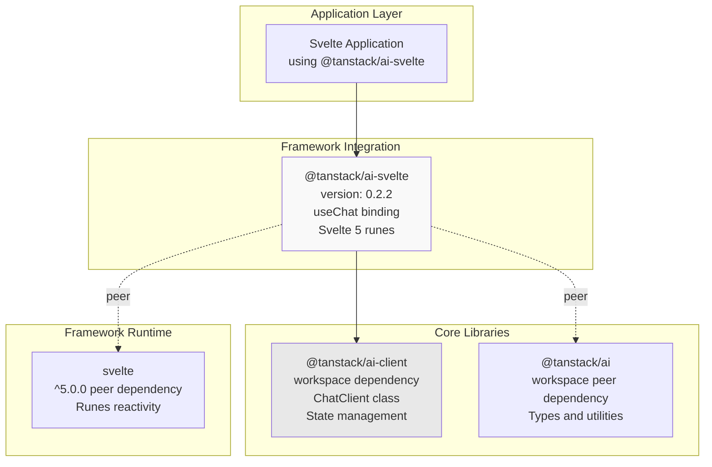

**Dependency Analysis**:

| Dependency Type | Package                        | Version Constraint | Purpose                               |
| --------------- | ------------------------------ | ------------------ | ------------------------------------- |
| Direct          | `@tanstack/ai-client`          | `workspace:*`      | Chat state management and streaming   |
| Peer            | `@tanstack/ai`                 | `workspace:^`      | Core types and interfaces             |
| Peer            | `svelte`                       | `^5.0.0`           | Svelte 5 framework runtime with runes |
| Dev             | `@sveltejs/package`            | `^2.3.10`          | Package building tool                 |
| Dev             | `@sveltejs/vite-plugin-svelte` | `^5.1.1`           | Vite integration for development      |
| Dev             | `svelte-check`                 | `^4.2.0`           | Type checking (replaces tsc)          |

The package has a minimal dependency footprint, relying primarily on `@tanstack/ai-client` for all core functionality. The Svelte 5 peer dependency is strict, requiring version 5.0.0 or higher to leverage the runes reactivity system.

**Sources**: [packages/typescript/ai-svelte/package.json:1-64](), [pnpm-lock.yaml:913-949]()

### File Structure and Build System

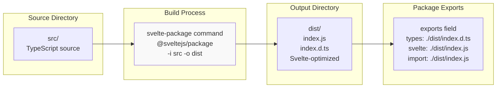

**Build Configuration Details**:

The package uses a Svelte-specific build toolchain distinct from other framework integrations:

- **Build Tool**: `@sveltejs/package` (via `svelte-package` command) instead of Vite or tsdown
- **Build Command**: `svelte-package -i src -o dist` [packages/typescript/ai-svelte/package.json:35]()
- **Type Checking**: `svelte-check` instead of `tsc` [packages/typescript/ai-svelte/package.json:33]()
- **Export Configuration**: Uses `svelte` export condition for Svelte-specific optimizations [packages/typescript/ai-svelte/package.json:16-22]()

The `svelte` export condition allows Svelte tooling (like SvelteKit and Vite) to consume the package differently than generic JavaScript consumers, enabling optimizations like component HMR and better tree-shaking.

**Comparison with Other Framework Integrations**:

| Framework  | Build Tool            | Type Checker     | Output Format              |
| ---------- | --------------------- | ---------------- | -------------------------- |
| React      | Vite                  | tsc              | ESM                        |
| Solid      | tsdown                | tsc              | ESM (unbundled)            |
| Vue        | tsdown                | tsc              | ESM (unbundled)            |
| **Svelte** | **@sveltejs/package** | **svelte-check** | **ESM (Svelte-optimized)** |
| Preact     | Vite                  | tsc              | ESM                        |

**Sources**: [packages/typescript/ai-svelte/package.json:27-35](), [packages/typescript/ai-solid/package.json:31](), [packages/typescript/ai-vue/package.json:31](), [packages/typescript/ai-react/package.json:33]()

## Core API: useChat Binding

### API Surface

While the actual implementation source code is not provided in the files, based on the package structure and example usage, the `useChat` binding provides a Svelte-idiomatic wrapper around `ChatClient`:

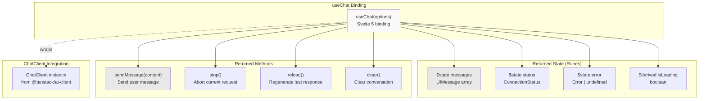

**Expected Options Interface**:

The `useChat` binding likely accepts configuration options similar to other framework integrations:

| Option              | Type                | Purpose                               |
| ------------------- | ------------------- | ------------------------------------- |
| `api`               | `string`            | API endpoint URL (e.g., `/api/chat`)  |
| `conversationId`    | `string?`           | Optional conversation identifier      |
| `connectionAdapter` | `ConnectionAdapter` | Streaming protocol (SSE or HTTP)      |
| `onToolCall`        | `Function?`         | Client-side tool execution handler    |
| `body`              | `object?`           | Additional data to send with requests |
| `headers`           | `object?`           | Custom HTTP headers                   |

**Sources**: [packages/typescript/ai-svelte/package.json:1-64](), [packages/typescript/ai-react/package.json:1-60](), [packages/typescript/ai-client/package.json:1-49]()

## Svelte 5 Runes Integration

### Reactivity Model

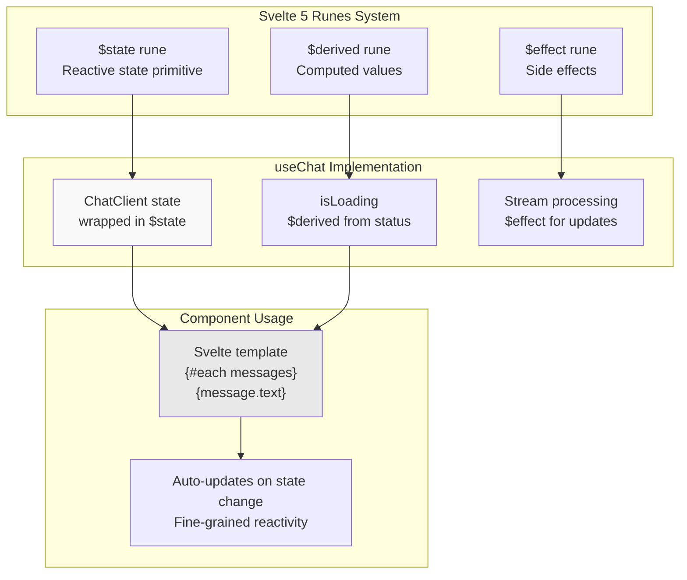

**Svelte 5 Runes vs. Other Framework Primitives**:

| Framework    | Reactive Primitive | Computed Values | Side Effects   | Auto-tracking |
| ------------ | ------------------ | --------------- | -------------- | ------------- |
| React        | `useState`         | `useMemo`       | `useEffect`    | Manual deps   |
| Solid        | `createSignal`     | `createMemo`    | `createEffect` | Auto          |
| Vue          | `ref` / `reactive` | `computed`      | `watchEffect`  | Auto          |
| **Svelte 5** | **`$state`**       | **`$derived`**  | **`$effect`**  | **Auto**      |
| Preact       | `useState`         | `useMemo`       | `useEffect`    | Manual deps   |

Svelte 5's runes provide compile-time reactivity guarantees, eliminating the need for dependency arrays (unlike React/Preact) and providing automatic tracking similar to Solid and Vue but with compile-time optimization.

**Sources**: [packages/typescript/ai-svelte/package.json:48-51](), [pnpm-lock.yaml:937-939]()

## Usage Patterns

### Basic Chat Implementation

The typical usage pattern in a Svelte component:

```svelte
<script>
  import { useChat } from '@tanstack/ai-svelte'

  const { messages, sendMessage, isLoading } = useChat({
    api: '/api/chat'
  })

  let input = ''

  function handleSubmit() {
    sendMessage(input)
    input = ''
  }
</script>

<div class="chat-container">
  {#each messages as message}
    <div class="message">
      {message.text}
    </div>
  {/each}

  <form on:submit|preventDefault={handleSubmit}>
    <input bind:value={input} disabled={isLoading} />
    <button disabled={isLoading}>Send</button>
  </form>
</div>
```

**Key Differences from React/Preact**:

- No need to destructure with array syntax (e.g., `const [messages, setMessages] = useState(...)`)
- `$state` runes are mutable - can assign directly (e.g., `input = ''`)
- Template syntax uses `{#each}` blocks instead of `Array.map()`
- Event handling uses `on:submit` directives instead of `onSubmit` props

**Sources**: [examples/ts-svelte-chat/package.json:14-26]()

### Connection Adapter Configuration

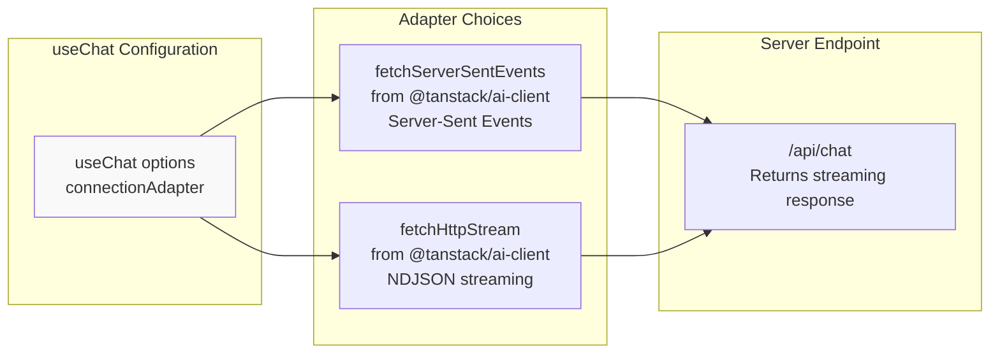

Both connection adapters can be imported from `@tanstack/ai-client` and passed to `useChat`:

```typescript
import { useChat } from '@tanstack/ai-svelte'
import { fetchServerSentEvents } from '@tanstack/ai-client'

const chat = useChat({
  api: '/api/chat',
  connectionAdapter: fetchServerSentEvents(),
})
```

For details on connection adapters, see [Connection Adapters](#4.2).

**Sources**: [packages/typescript/ai-svelte/package.json:45-47](), [packages/typescript/ai-client/package.json:1-49]()

## Example Application: ts-svelte-chat

### Application Architecture

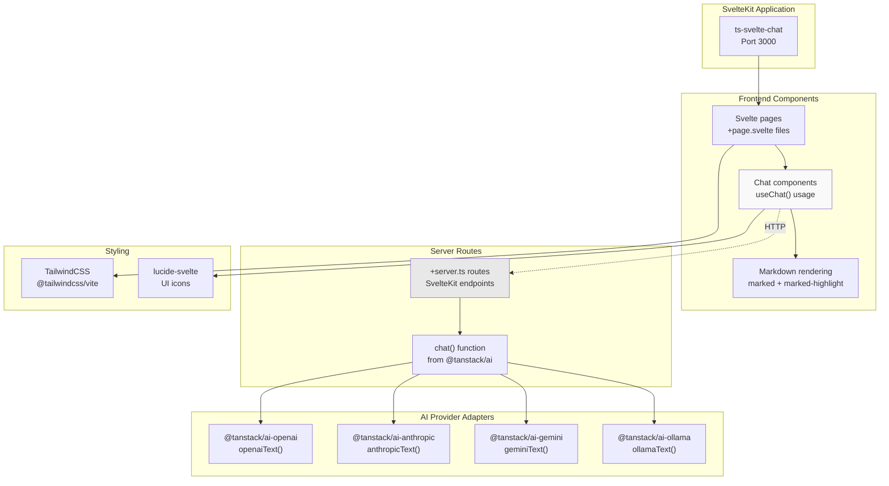

**Key Dependencies**:

| Category   | Package                  | Version      | Purpose                     |
| ---------- | ------------------------ | ------------ | --------------------------- |
| Framework  | `@sveltejs/kit`          | ^2.15.10     | SvelteKit meta-framework    |
| Framework  | `@sveltejs/adapter-auto` | ^3.3.1       | Deployment adapter          |
| AI Core    | `@tanstack/ai`           | workspace:\* | Core chat functionality     |
| AI Client  | `@tanstack/ai-svelte`    | workspace:\* | Svelte bindings             |
| Adapters   | `@tanstack/ai-openai`    | workspace:\* | OpenAI provider             |
| Adapters   | `@tanstack/ai-anthropic` | workspace:\* | Anthropic provider          |
| Adapters   | `@tanstack/ai-gemini`    | workspace:\* | Gemini provider             |
| Adapters   | `@tanstack/ai-ollama`    | workspace:\* | Ollama provider             |
| Markdown   | `marked`                 | ^15.0.6      | Markdown parsing            |
| Markdown   | `marked-highlight`       | ^2.2.0       | Code highlighting           |
| Styling    | `@tailwindcss/vite`      | ^4.1.18      | TailwindCSS v4 Vite plugin  |
| Icons      | `lucide-svelte`          | ^0.468.0     | Icon components             |
| Syntax     | `highlight.js`           | ^11.11.1     | Code syntax highlighting    |
| Validation | `zod`                    | ^4.2.0       | Schema validation for tools |

**Sources**: [examples/ts-svelte-chat/package.json:1-41](), [pnpm-lock.yaml:441-512]()

### Markdown Rendering Approach

Unlike React (`@tanstack/ai-react-ui`), Solid (`@tanstack/ai-solid-ui`), and Vue (`@tanstack/ai-vue-ui`) which have dedicated UI component libraries with built-in markdown rendering, the Svelte example uses third-party libraries directly:

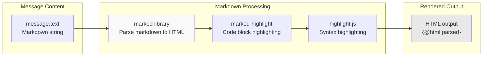

**Markdown Library Comparison Across Examples**:

| Example            | Markdown Library       | Highlighting         | Plugins                | UI Package            |
| ------------------ | ---------------------- | -------------------- | ---------------------- | --------------------- |
| ts-react-chat      | react-markdown         | rehype-highlight     | rehype-raw, remark-gfm | @tanstack/ai-react-ui |
| ts-solid-chat      | solid-markdown         | rehype-highlight     | rehype-raw, remark-gfm | @tanstack/ai-solid-ui |
| ts-vue-chat        | @crazydos/vue-markdown | rehype-highlight     | rehype-raw, remark-gfm | @tanstack/ai-vue-ui   |
| **ts-svelte-chat** | **marked**             | **marked-highlight** | **none**               | **none (manual)**     |

The Svelte example uses a simpler, more lightweight approach with `marked` + `marked-highlight` instead of the unified/remark/rehype ecosystem used by React, Solid, and Vue. This is likely because there is no `@tanstack/ai-svelte-ui` package yet.

**Sources**: [examples/ts-svelte-chat/package.json:22-25](), [examples/ts-react-chat/package.json:258-272](), [examples/ts-solid-chat/package.json:394-396](), [examples/ts-vue-chat/package.json:540-542]()

## Development Workflow

### NPM Scripts

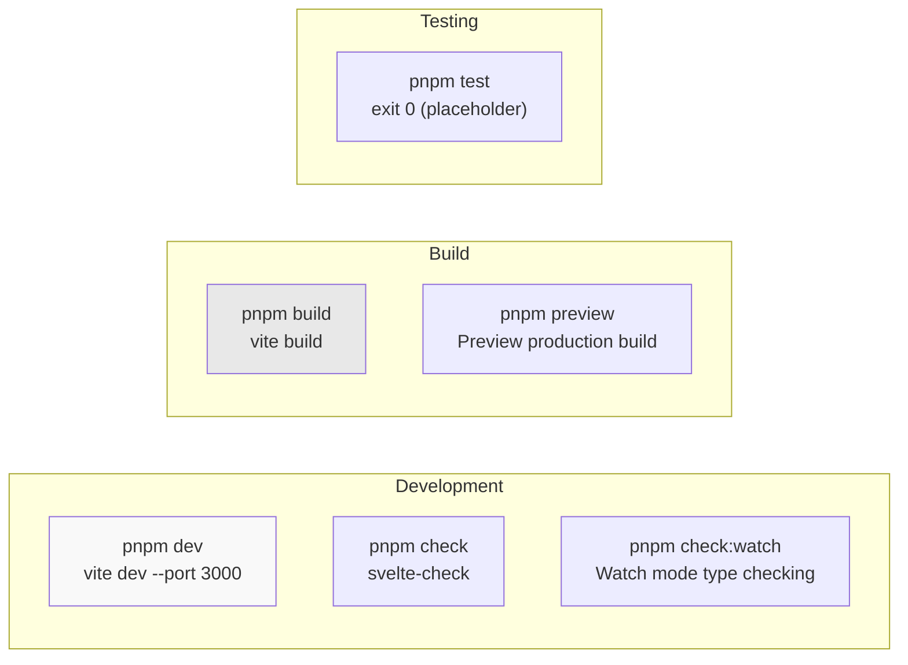

**Script Definitions** [examples/ts-svelte-chat/package.json:6-12]():

| Script        | Command                                                              | Purpose                       |
| ------------- | -------------------------------------------------------------------- | ----------------------------- |
| `dev`         | `vite dev --port 3000`                                               | Start dev server on port 3000 |
| `build`       | `vite build`                                                         | Build for production          |
| `preview`     | `vite preview`                                                       | Preview production build      |
| `check`       | `svelte-kit sync && svelte-check --tsconfig ./tsconfig.json`         | Type check Svelte components  |
| `check:watch` | `svelte-kit sync && svelte-check --tsconfig ./tsconfig.json --watch` | Type check in watch mode      |
| `test`        | `exit 0`                                                             | Placeholder for tests         |

The `svelte-kit sync` command generates type definitions for SvelteKit routes and ensures type safety across the application.

**Sources**: [examples/ts-svelte-chat/package.json:6-12]()

### Build System Integration

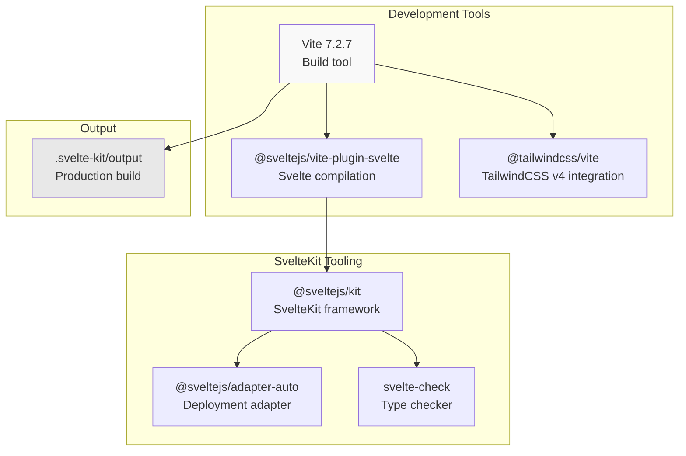

The example uses modern tooling:

- **Vite 7.2.7**: Latest major version with enhanced performance [examples/ts-svelte-chat/package.json:39]()
- **@sveltejs/vite-plugin-svelte 5.1.1**: Latest plugin for Svelte 5 support [examples/ts-svelte-chat/package.json:31-32]()
- **TailwindCSS v4**: Uses the new Vite plugin architecture [examples/ts-svelte-chat/package.json:32]()
- **TypeScript 5.9.3**: Consistent with monorepo-wide TypeScript version [examples/ts-svelte-chat/package.json:38]()

**Sources**: [examples/ts-svelte-chat/package.json:28-39](), [pnpm-lock.yaml:480-512]()

## Comparison with Other Framework Integrations

### API Surface Comparison

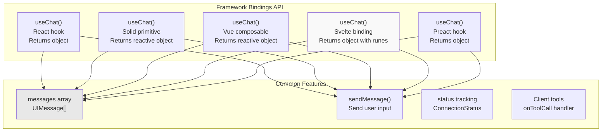

### Feature Parity Matrix

| Feature           | React     | Solid  | Vue    | **Svelte**            | Preact |
| ----------------- | --------- | ------ | ------ | --------------------- | ------ |
| `useChat` binding | ✅        | ✅     | ✅     | ✅                    | ✅     |
| SSE streaming     | ✅        | ✅     | ✅     | ✅                    | ✅     |
| HTTP streaming    | ✅        | ✅     | ✅     | ✅                    | ✅     |
| Client-side tools | ✅        | ✅     | ✅     | ✅                    | ✅     |
| Type inference    | ✅        | ✅     | ✅     | ✅                    | ✅     |
| UI components     | ✅        | ✅     | ✅     | ❌                    | ❌     |
| Devtools          | ✅        | ✅     | ❌     | ❌                    | ✅     |
| Build tool        | Vite      | tsdown | tsdown | **@sveltejs/package** | Vite   |
| Framework version | 18+ / 19+ | 1.9.7+ | 3.5.0+ | **5.0.0+**            | 10.26+ |

**Notable Differences**:

1. **Build System**: Svelte is the only integration using `@sveltejs/package` instead of Vite or tsdown
2. **Framework Version**: Svelte requires version 5.0.0+, making it incompatible with Svelte 4 and earlier
3. **UI Components**: No `@tanstack/ai-svelte-ui` package exists yet (unlike React, Solid, Vue)
4. **Devtools**: No `@tanstack/svelte-ai-devtools` package exists yet (unlike React, Solid, Preact)
5. **Type Checker**: Uses `svelte-check` instead of `tsc` for type checking
6. **Reactivity**: Uses Svelte 5 runes (`$state`, `$derived`, `$effect`) instead of hooks or signals

**Sources**: [packages/typescript/ai-svelte/package.json:1-64](), [packages/typescript/ai-react/package.json:1-60](), [packages/typescript/ai-solid/package.json:1-59](), [packages/typescript/ai-vue/package.json:1-59](), [packages/typescript/ai-preact/package.json:1-76]()

## Version History and Changelog

### Release Timeline

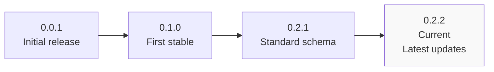

**Recent Releases** (from [examples/ts-svelte-chat/CHANGELOG.md:1-84]()):

| Version       | Changes                           | Dependencies Updated                                                            |
| ------------- | --------------------------------- | ------------------------------------------------------------------------------- |
| 0.2.2         | Latest updates                    | ai@0.2.2, ai-gemini@0.3.2, ai-anthropic@0.2.0, ai-ollama@0.3.0, ai-openai@0.2.1 |
| 0.2.1         | Ollama improvements, OpenAI fixes | ai@0.2.1, ai-ollama@0.3.0, ai-openai@0.2.1, ai-gemini@0.3.0                     |
| 0.2.0 (1.0.0) | Standard schema support           | Major version bump for ai-client@0.2.0                                          |
| 0.1.0         | First stable release              | Adapter split for tree-shaking                                                  |

The package maintains lockstep versioning with other framework integrations and follows semantic versioning. All framework integration packages share the same version numbers for consistency.

**Sources**: [examples/ts-svelte-chat/CHANGELOG.md:1-84](), [packages/typescript/ai-svelte/package.json:3]()

## Future Roadmap and Missing Features

Based on analysis of the package ecosystem:

### Potential Future Additions

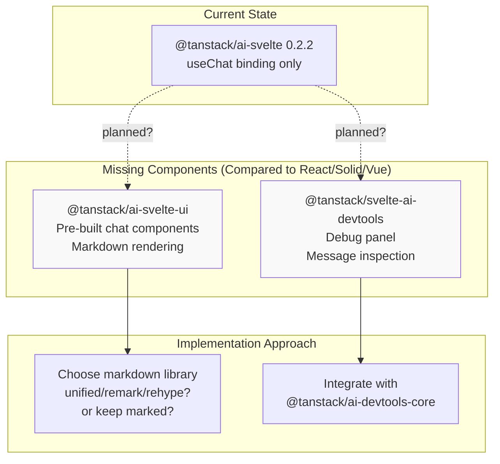

**Missing Features Analysis**:

1. **UI Components Package**: React, Solid, and Vue all have companion UI packages with:
   - Pre-built message components
   - Markdown rendering with syntax highlighting
   - Rehype and remark plugins for GFM, sanitization, etc.
   - Consistent API across frameworks

2. **Devtools Package**: React, Solid, and Preact have devtools integrations:
   - Real-time message inspection
   - Tool call monitoring
   - Performance metrics
   - Integration with `@tanstack/ai-devtools-core`

3. **Svelte 4 Compatibility**: Current package requires Svelte 5.0.0+, which may limit adoption until Svelte 5 becomes more widespread.

For UI components, see [React UI Components](#7.1), [Solid UI Components](#7.2), [Vue UI Components](#7.3), and [Markdown Processing Pipeline](#7.4) to understand patterns that could be adapted for Svelte.

**Sources**: [packages/typescript/ai-react-ui/package.json:1-63](), [packages/typescript/ai-solid-ui/package.json:1-62](), [packages/typescript/ai-vue-ui/package.json:1-59](), [packages/typescript/react-ai-devtools/package.json:1-60](), [packages/typescript/solid-ai-devtools/package.json:1-59]()
