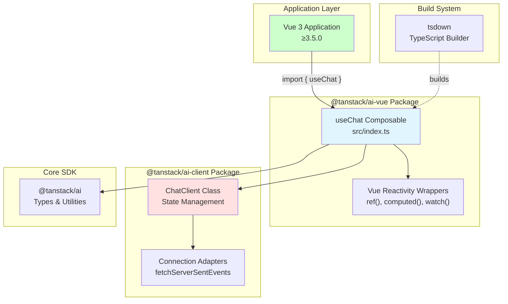
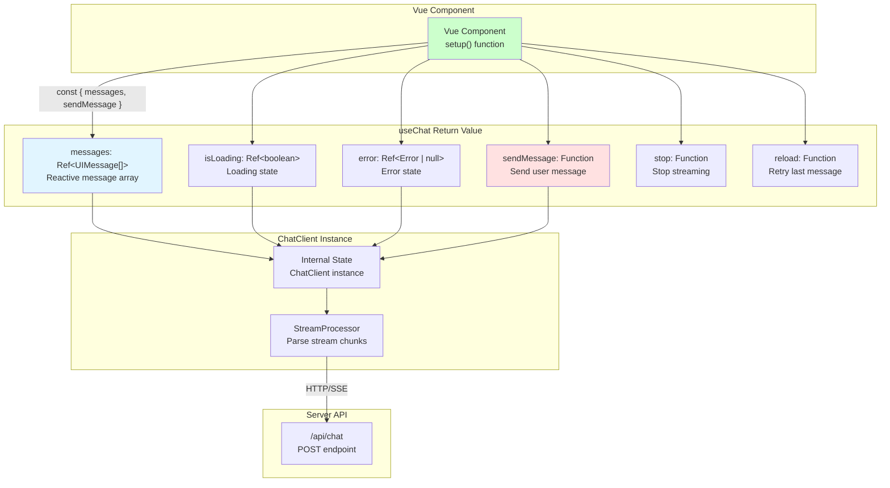
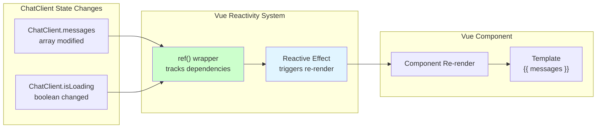
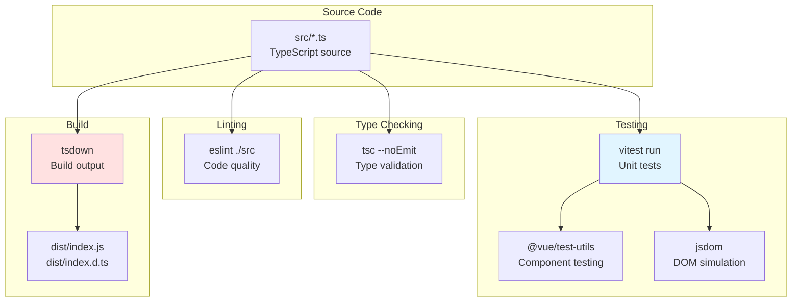
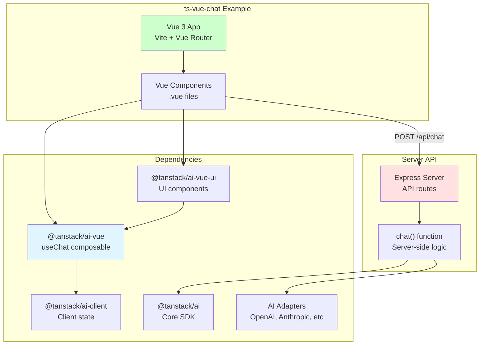
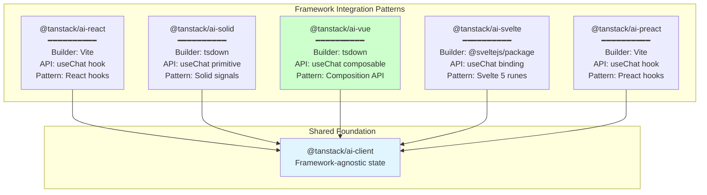

# Vue Integration (@tanstack/ai-vue)

<details>
<summary>Relevant source files</summary>

The following files were used as context for generating this wiki page:

- [examples/ts-svelte-chat/CHANGELOG.md](examples/ts-svelte-chat/CHANGELOG.md)
- [examples/ts-svelte-chat/package.json](examples/ts-svelte-chat/package.json)
- [examples/ts-vue-chat/CHANGELOG.md](examples/ts-vue-chat/CHANGELOG.md)
- [examples/ts-vue-chat/package.json](examples/ts-vue-chat/package.json)
- [packages/typescript/ai-anthropic/package.json](packages/typescript/ai-anthropic/package.json)
- [packages/typescript/ai-gemini/CHANGELOG.md](packages/typescript/ai-gemini/CHANGELOG.md)
- [packages/typescript/ai-gemini/package.json](packages/typescript/ai-gemini/package.json)
- [packages/typescript/ai-ollama/package.json](packages/typescript/ai-ollama/package.json)
- [packages/typescript/ai-openai/CHANGELOG.md](packages/typescript/ai-openai/CHANGELOG.md)
- [packages/typescript/ai-openai/package.json](packages/typescript/ai-openai/package.json)
- [packages/typescript/ai-react-ui/package.json](packages/typescript/ai-react-ui/package.json)
- [packages/typescript/ai-react/package.json](packages/typescript/ai-react/package.json)
- [packages/typescript/ai-solid-ui/package.json](packages/typescript/ai-solid-ui/package.json)
- [packages/typescript/ai-solid/package.json](packages/typescript/ai-solid/package.json)
- [packages/typescript/ai-svelte/package.json](packages/typescript/ai-svelte/package.json)
- [packages/typescript/ai-vue-ui/package.json](packages/typescript/ai-vue-ui/package.json)
- [packages/typescript/ai-vue/package.json](packages/typescript/ai-vue/package.json)
- [packages/typescript/smoke-tests/adapters/CHANGELOG.md](packages/typescript/smoke-tests/adapters/CHANGELOG.md)
- [packages/typescript/smoke-tests/adapters/package.json](packages/typescript/smoke-tests/adapters/package.json)
- [packages/typescript/smoke-tests/e2e/CHANGELOG.md](packages/typescript/smoke-tests/e2e/CHANGELOG.md)
- [packages/typescript/smoke-tests/e2e/package.json](packages/typescript/smoke-tests/e2e/package.json)

</details>

This document covers the `@tanstack/ai-vue` package, which provides Vue 3 composables for integrating TanStack AI into Vue applications. It wraps the framework-agnostic `@tanstack/ai-client` with Vue's Composition API and reactivity system.

For UI components built on top of this integration, see [Vue UI Components (@tanstack/ai-vue-ui)](#7.3). For the underlying client state management, see [ChatClient](#4.1). For other framework integrations, see [React Integration](#6.1), [Solid Integration](#6.2), [Svelte Integration](#6.4), and [Preact Integration](#6.5).

## Package Overview

The `@tanstack/ai-vue` package provides Vue 3 composables that enable reactive AI chat functionality in Vue applications. It bridges the gap between the headless `@tanstack/ai-client` library and Vue's reactivity system.

| Property            | Value                |
| ------------------- | -------------------- |
| Package Name        | `@tanstack/ai-vue`   |
| Current Version     | 0.2.2                |
| Build Tool          | tsdown               |
| Module Format       | ESM                  |
| Minimum Vue Version | >= 3.5.0             |
| Primary Export      | `useChat` composable |

The package has minimal dependencies, depending only on `@tanstack/ai-client` for core state management logic, while requiring `@tanstack/ai` and `vue` as peer dependencies.

**Sources:** [packages/typescript/ai-vue/package.json:1-59]()

## Architecture and Dependencies



The Vue integration follows a layered architecture:

1. **Composable Layer**: `useChat` composable provides the Vue-specific API
2. **Reactivity Layer**: Wraps `ChatClient` state in Vue's reactive primitives (`ref`, `computed`)
3. **Client Layer**: `ChatClient` from `@tanstack/ai-client` handles framework-agnostic logic
4. **Core Layer**: `@tanstack/ai` provides types and utilities

**Sources:** [packages/typescript/ai-vue/package.json:41-47]()

## Build System Configuration

Unlike most TanStack AI packages that use Vite, `@tanstack/ai-vue` uses `tsdown` for building, matching the pattern used by `@tanstack/ai-solid`. This build tool provides better tree-shaking and smaller bundle sizes for framework integrations.

| Build Characteristic | Value                  |
| -------------------- | ---------------------- |
| Builder              | tsdown                 |
| Output Format        | ESM                    |
| Entry Point          | `./src/index.ts`       |
| Distribution         | `./dist/index.js`      |
| Type Definitions     | `./dist/index.d.ts`    |
| Source Included      | Yes (`src/` directory) |

The build configuration produces unbundled output, allowing consuming applications to optimize bundle sizes through tree-shaking.

**Sources:** [packages/typescript/ai-vue/package.json:31](), [packages/typescript/ai-solid/package.json:31]()

## Core API: useChat Composable



The `useChat` composable is the primary API for Vue integration. It returns reactive refs and functions that mirror the `ChatClient` interface but with Vue's reactivity system.

### Return Value Structure

| Property      | Type                                 | Description                             |
| ------------- | ------------------------------------ | --------------------------------------- |
| `messages`    | `Ref<UIMessage[]>`                   | Reactive array of conversation messages |
| `isLoading`   | `Ref<boolean>`                       | True when streaming response            |
| `error`       | `Ref<Error \| null>`                 | Error state, null when no error         |
| `sendMessage` | `(content: string) => Promise<void>` | Send user message to API                |
| `stop`        | `() => void`                         | Stop ongoing streaming response         |
| `reload`      | `() => Promise<void>`                | Retry last failed message               |
| `append`      | `(message: UIMessage) => void`       | Append message to conversation          |
| `setMessages` | `(messages: UIMessage[]) => void`    | Replace entire message array            |

**Sources:** [packages/typescript/ai-client/package.json:1-59](), [packages/typescript/ai-react/package.json:1-60]() (for comparison)

## Vue 3 Reactivity Integration

The Vue integration leverages Vue 3's Composition API and reactivity system to provide a seamless developer experience. All state is wrapped in Vue reactive primitives, ensuring automatic component updates when state changes.



### Reactivity Pattern

The Vue integration wraps `ChatClient` state in Vue's reactive primitives:

1. **Ref Wrappers**: All state properties are wrapped in `ref()` for reactivity
2. **Computed Properties**: Derived state uses `computed()` for efficient updates
3. **Watch Effects**: Internal watchers synchronize with `ChatClient` state changes
4. **Automatic Cleanup**: Uses `onUnmounted` lifecycle hook for proper cleanup

This pattern ensures that Vue components automatically re-render when the chat state changes, without requiring manual state management.

**Sources:** [packages/typescript/ai-vue/package.json:46]()

## Peer Dependencies and Compatibility

The package declares specific peer dependencies to ensure compatibility:

| Dependency     | Version Constraint | Purpose                     |
| -------------- | ------------------ | --------------------------- |
| `@tanstack/ai` | `workspace:^`      | Core AI types and utilities |
| `vue`          | `>=3.5.0`          | Vue 3 Composition API       |

The minimum Vue version of 3.5.0 ensures access to all necessary Composition API features. The `workspace:^` protocol for `@tanstack/ai` indicates monorepo management via pnpm workspaces, which resolves to the appropriate semver range during publishing.

**Sources:** [packages/typescript/ai-vue/package.json:44-46]()

## Development Dependencies and Testing



Development infrastructure includes:

| Tool              | Version        | Purpose                         |
| ----------------- | -------------- | ------------------------------- |
| `@vue/test-utils` | ^2.4.6         | Vue component testing utilities |
| `vitest`          | ^4.0.14        | Test runner with coverage       |
| `jsdom`           | ^27.2.0        | DOM environment for tests       |
| `tsdown`          | ^0.17.0-beta.6 | Build tool                      |
| `typescript`      | 5.9.3          | Type checking                   |

### Test Scripts

| Script         | Command                  | Purpose                      |
| -------------- | ------------------------ | ---------------------------- |
| `test:types`   | `tsc`                    | Run TypeScript type checking |
| `test:eslint`  | `eslint ./src`           | Run linting checks           |
| `test:lib`     | `vitest run`             | Run unit tests once          |
| `test:lib:dev` | `pnpm test:lib --watch`  | Run tests in watch mode      |
| `build`        | `tsdown`                 | Build distributable files    |
| `clean`        | `premove ./build ./dist` | Clean build artifacts        |

**Sources:** [packages/typescript/ai-vue/package.json:25-31](), [packages/typescript/ai-vue/package.json:48-58]()

## Integration with Example Application

The `ts-vue-chat` example demonstrates real-world usage of the Vue integration:



The example application includes:

| Component         | Purpose                           |
| ----------------- | --------------------------------- |
| Vite              | Development server and build tool |
| Vue Router        | Client-side routing               |
| Tailwind CSS      | Styling framework                 |
| Express           | Server-side API routes            |
| Multiple Adapters | OpenAI, Anthropic, Gemini, Ollama |
| Zod               | Schema validation                 |

**Sources:** [examples/ts-vue-chat/package.json:1-40]()

## Comparison with Other Framework Integrations



Comparison of framework integrations:

| Framework | Package                | Build Tool        | API Name      | Reactivity Pattern  | Version   |
| --------- | ---------------------- | ----------------- | ------------- | ------------------- | --------- |
| React     | `@tanstack/ai-react`   | Vite              | `useChat`     | React hooks         | 0.2.2     |
| Solid     | `@tanstack/ai-solid`   | tsdown            | `useChat`     | Solid primitives    | 0.2.2     |
| **Vue**   | **`@tanstack/ai-vue`** | **tsdown**        | **`useChat`** | **Composition API** | **0.2.2** |
| Svelte    | `@tanstack/ai-svelte`  | @sveltejs/package | `useChat`     | Svelte 5 runes      | 0.2.2     |
| Preact    | `@tanstack/ai-preact`  | Vite              | `useChat`     | Preact hooks        | 0.2.2     |

Key similarities with Solid integration:

- Both use `tsdown` for optimized builds
- Both export from `src/index.ts` directly
- Both follow similar file structure patterns
- Both prioritize bundle size optimization

**Sources:** [packages/typescript/ai-vue/package.json:1-59](), [packages/typescript/ai-solid/package.json:1-59](), [packages/typescript/ai-react/package.json:1-60](), [packages/typescript/ai-svelte/package.json:1-64]()

## Type Safety and TypeScript Support

The package is written in TypeScript and provides full type definitions:

| Type Feature  | Description                                    |
| ------------- | ---------------------------------------------- |
| Entry Types   | `./dist/index.d.ts`                            |
| Source Types  | `./src/index.ts` (TypeScript)                  |
| Type Checking | `tsc` script for validation                    |
| Inference     | Full type inference from `@tanstack/ai-client` |
| Generics      | Support for custom message types via generics  |

The Vue integration maintains type safety throughout the entire chain:

1. Server API types from `@tanstack/ai`
2. Client state types from `@tanstack/ai-client`
3. Vue ref/computed types from `vue`
4. Application-specific message types

**Sources:** [packages/typescript/ai-vue/package.json:14-19](), [packages/typescript/ai-vue/package.json:30]()

## Package Distribution and Exports

The package exports configuration ensures proper module resolution:

```json
"exports": {
  ".": {
    "types": "./dist/index.d.ts",
    "import": "./dist/index.js"
  }
}
```

| Export Path | Purpose                     |
| ----------- | --------------------------- |
| `types`     | TypeScript type definitions |
| `import`    | ESM JavaScript module       |

The `files` field specifies what gets published to npm:

- `dist/` - Built distributable files
- `src/` - Source TypeScript files

Including source files allows for better debugging and source map resolution in consuming applications.

**Sources:** [packages/typescript/ai-vue/package.json:15-19](), [packages/typescript/ai-vue/package.json:21-24]()

## Version History and Changelog

The package has undergone steady development alongside other TanStack AI packages:

| Version | Key Changes                                     |
| ------- | ----------------------------------------------- |
| 0.2.2   | Current version, synchronized with client 0.2.2 |
| 0.2.1   | Bug fixes and improvements                      |
| 0.2.0   | Standard schema support                         |
| 0.1.0   | Initial stable release                          |
| 0.0.x   | Pre-release versions                            |

The version history shows synchronization with:

- `@tanstack/ai-client` updates
- `@tanstack/ai` core changes
- Other framework integration releases

**Sources:** [packages/typescript/ai-vue/package.json:3](), [examples/ts-vue-chat/CHANGELOG.md:1-89]()
