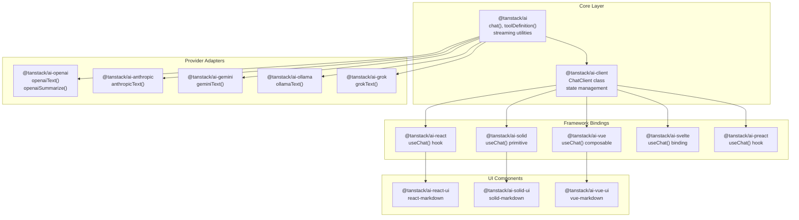
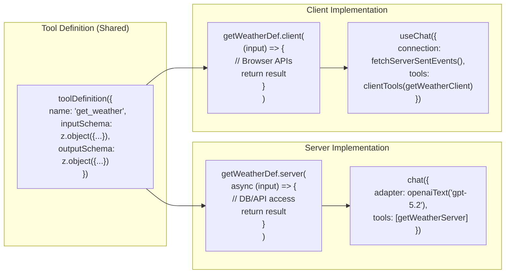
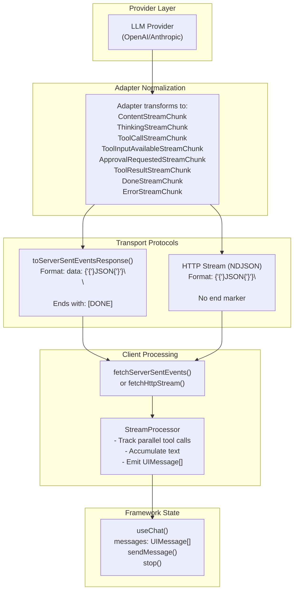
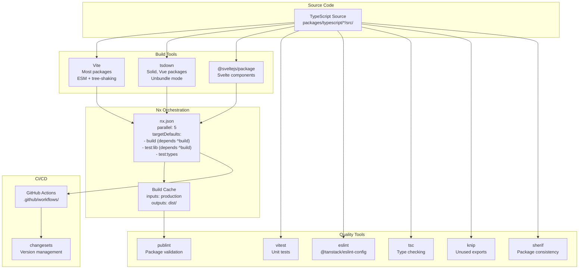

# Overview

<details>
<summary>Relevant source files</summary>

The following files were used as context for generating this wiki page:

- [.github/workflows/autofix.yml](.github/workflows/autofix.yml)
- [.github/workflows/release.yml](.github/workflows/release.yml)
- [README.md](README.md)
- [docs/api/ai.md](docs/api/ai.md)
- [docs/getting-started/overview.md](docs/getting-started/overview.md)
- [docs/guides/client-tools.md](docs/guides/client-tools.md)
- [docs/guides/server-tools.md](docs/guides/server-tools.md)
- [docs/guides/streaming.md](docs/guides/streaming.md)
- [docs/guides/tool-approval.md](docs/guides/tool-approval.md)
- [docs/guides/tool-architecture.md](docs/guides/tool-architecture.md)
- [docs/guides/tools.md](docs/guides/tools.md)
- [docs/protocol/chunk-definitions.md](docs/protocol/chunk-definitions.md)
- [docs/protocol/http-stream-protocol.md](docs/protocol/http-stream-protocol.md)
- [docs/protocol/sse-protocol.md](docs/protocol/sse-protocol.md)
- [nx.json](nx.json)
- [package.json](package.json)
- [packages/typescript/ai-client/README.md](packages/typescript/ai-client/README.md)
- [packages/typescript/ai-devtools/README.md](packages/typescript/ai-devtools/README.md)
- [packages/typescript/ai-gemini/README.md](packages/typescript/ai-gemini/README.md)
- [packages/typescript/ai-ollama/README.md](packages/typescript/ai-ollama/README.md)
- [packages/typescript/ai-openai/README.md](packages/typescript/ai-openai/README.md)
- [packages/typescript/ai-react-ui/README.md](packages/typescript/ai-react-ui/README.md)
- [packages/typescript/ai-react/README.md](packages/typescript/ai-react/README.md)
- [packages/typescript/ai-solid/tsdown.config.ts](packages/typescript/ai-solid/tsdown.config.ts)
- [packages/typescript/ai/README.md](packages/typescript/ai/README.md)
- [packages/typescript/react-ai-devtools/README.md](packages/typescript/react-ai-devtools/README.md)
- [packages/typescript/solid-ai-devtools/README.md](packages/typescript/solid-ai-devtools/README.md)
- [pnpm-lock.yaml](pnpm-lock.yaml)
- [scripts/generate-docs.ts](scripts/generate-docs.ts)

</details>

TanStack AI is a type-safe, framework-agnostic SDK for building production-ready AI applications with streaming responses, tool execution, and multimodal content support. The system provides a layered architecture consisting of a core library ([`@tanstack/ai`]()), provider adapters ([`@tanstack/ai-openai`](), [`@tanstack/ai-anthropic`](), etc.), client state management ([`@tanstack/ai-client`]()), and framework-specific integrations for React, Solid, Vue, Svelte, and Preact.

This document provides a high-level overview of TanStack AI's architecture, package organization, and core capabilities. For detailed architecture information, see [Architecture](#2). For specific package documentation, see the relevant sections: [Core Library](#3), [Client Libraries](#4), [Framework Integrations](#6), and [Streaming Protocols](#5).

**Sources:** [docs/getting-started/overview.md:1-105](), [README.md:36-48]()

## Repository Structure

The TanStack AI codebase is organized as a pnpm monorepo with Nx task orchestration. The repository contains 40+ packages divided into logical groups: core libraries, AI provider adapters, framework integrations, UI component libraries, developer tools, testing infrastructure, and example applications.



**Package Organization:**

| Layer     | Packages                                                                                                           | Purpose                                      |
| --------- | ------------------------------------------------------------------------------------------------------------------ | -------------------------------------------- |
| Core      | `@tanstack/ai`, `@tanstack/ai-client`                                                                              | Framework-agnostic SDK and state management  |
| Adapters  | `@tanstack/ai-openai`, `@tanstack/ai-anthropic`, `@tanstack/ai-gemini`, `@tanstack/ai-ollama`, `@tanstack/ai-grok` | Provider-specific implementations            |
| Framework | `@tanstack/ai-react`, `@tanstack/ai-solid`, `@tanstack/ai-vue`, `@tanstack/ai-svelte`, `@tanstack/ai-preact`       | Reactive bindings for each framework         |
| UI        | `@tanstack/ai-react-ui`, `@tanstack/ai-solid-ui`, `@tanstack/ai-vue-ui`                                            | Pre-built components with markdown rendering |
| Devtools  | `@tanstack/ai-devtools`, `@tanstack/react-ai-devtools`, `@tanstack/solid-ai-devtools`                              | Debugging and inspection tools               |

**Sources:** [pnpm-lock.yaml:1-950](), [package.json:1-73](), [README.md:40-48]()

## Core Architecture

The system follows a layered architecture where each layer has distinct responsibilities. The core SDK (`@tanstack/ai`) provides provider-agnostic abstractions, adapters implement provider-specific logic, and framework integrations provide reactive state management.

```mermaid
sequenceDiagram
    participant App as "Application Code"
    participant Hook as "useChat()<br/>(React/Solid/Vue)"
    participant Client as "ChatClient<br/>@tanstack/ai-client"
    participant Server as "API Route Handler<br/>chat()"
    participant Adapter as "openaiText()<br/>anthropicText()"
    participant Provider as "LLM API<br/>(OpenAI/Anthropic)"

    App->>Hook: "sendMessage('Hello')"
    Hook->>Client: "update messages state"
    Client->>Server: "POST /api/chat<br/>{messages, tools}"
    Server->>Server: "Build tool definitions"
    Server->>Adapter: "chat({adapter, messages, tools})"
    Adapter->>Provider: "Provider-specific request"

    loop "Streaming Response"
        Provider-->>Adapter: "Raw stream chunks"
        Adapter->>Adapter: "Normalize to StreamChunk"
        Adapter-->>Server: "ContentStreamChunk<br/>ToolCallStreamChunk<br/>DoneStreamChunk"
        Server-->>Client: "SSE: data: {chunk}\
\
"
        Client->>Client: "Process chunk<br/>update UIMessage[]"
        Client-->>Hook: "Trigger re-render"
        Hook-->>App: "Display updated messages"
    end
```

**Key Components:**

- **`chat()` function** ([packages/typescript/ai/src/index.ts]()): Entry point for creating AI conversations, accepts adapter, messages, tools, and returns async iterable of `StreamChunk` objects
- **`ChatClient` class** ([packages/typescript/ai-client/src/index.ts]()): Manages conversation state, processes streaming chunks, handles tool execution
- **`useChat()` hook** (framework-specific): Wraps `ChatClient` with framework-reactive state management
- **`toServerSentEventsResponse()` utility** ([packages/typescript/ai/src/index.ts]()): Converts stream to HTTP Response with proper SSE headers

**Sources:** [docs/getting-started/overview.md:1-105](), [docs/guides/streaming.md:8-65](), [docs/protocol/sse-protocol.md:1-355]()

## Isomorphic Tool System

TanStack AI's tool architecture enables AI models to execute functions on both server and client. Tools are defined once with `toolDefinition()` and can have separate `.server()` and `.client()` implementations.



**Execution Flow:**

1. **Tool Call**: LLM decides to call a tool based on the conversation
2. **Server Tool**: If tool has `.server()` implementation, executes automatically on server
3. **Client Tool**: If tool only has definition (no `.server()`), server sends `tool-input-available` chunk to client
4. **Client Execution**: Client's `useChat()` automatically executes matching client tool implementation
5. **Result Return**: Tool result is added to conversation and LLM continues

**Type Safety:**

The system provides end-to-end type inference from tool definitions to usage:

- Input/output schemas define TypeScript types via Zod
- `InferChatMessages<typeof chatOptions>` type provides fully-typed message arrays
- Tool names, inputs, and outputs are narrowed in conditional blocks

**Sources:** [docs/getting-started/overview.md:28-53](), [docs/guides/tools.md:1-335](), [docs/guides/client-tools.md:1-330](), [docs/guides/server-tools.md:1-314]()

## Streaming Protocol

TanStack AI uses a chunk-based streaming protocol to deliver real-time responses. All streaming data flows through a discriminated union type called `StreamChunk` with eight possible variants.



**Chunk Types:**

| Type                            | Purpose               | Key Fields                                              |
| ------------------------------- | --------------------- | ------------------------------------------------------- |
| `ContentStreamChunk`            | Text generation       | `delta`, `content`, `role`                              |
| `ThinkingStreamChunk`           | Model reasoning       | `delta`, `content`                                      |
| `ToolCallStreamChunk`           | Tool invocation       | `toolCall.function.name`, `toolCall.function.arguments` |
| `ToolInputAvailableStreamChunk` | Client tool ready     | `toolName`, `input`                                     |
| `ApprovalRequestedStreamChunk`  | User approval needed  | `toolName`, `input`, `approval.id`                      |
| `ToolResultStreamChunk`         | Tool execution result | `toolCallId`, `content`                                 |
| `DoneStreamChunk`               | Stream completion     | `finishReason`, `usage`                                 |
| `ErrorStreamChunk`              | Stream error          | `error.message`, `error.code`                           |

**Sources:** [docs/protocol/chunk-definitions.md:1-446](), [docs/protocol/sse-protocol.md:1-355](), [docs/guides/streaming.md:1-175]()

## Build System and Development Workflow

The repository uses pnpm workspaces with Nx for task orchestration, enabling efficient parallel builds and distributed caching across 40+ packages.



**Build Configuration:**

- **pnpm workspace** ([package.json:8-14]()): Package manager with `workspace:*` protocol for internal dependencies
- **Nx parallel execution** ([nx.json:6]()): Up to 5 concurrent tasks with dependency-aware scheduling
- **Named inputs** ([nx.json:10-26]()): `sharedGlobals`, `default`, `production` for intelligent cache invalidation
- **Target defaults** ([nx.json:27-73]()): Build dependencies, cache settings, input/output patterns

**Development Scripts:**

| Command                  | Purpose                                                 |
| ------------------------ | ------------------------------------------------------- |
| `pnpm test:ci`           | Run all tests (sherif, knip, eslint, lib, types, build) |
| `pnpm build`             | Build affected packages                                 |
| `pnpm watch`             | Build all packages in watch mode                        |
| `pnpm generate-docs`     | Generate TypeDoc API documentation                      |
| `pnpm changeset:version` | Version packages via changesets                         |

**Sources:** [nx.json:1-75](), [package.json:1-73](), [pnpm-lock.yaml:1-80](), [scripts/generate-docs.ts:1-37]()

## Key Capabilities

### Provider-Agnostic Adapters

The adapter pattern enables switching between AI providers without changing application code. All adapters implement a common interface with methods like `chatStream()`, `structuredOutput()`, `summarize()`.

**Available Adapters:**

- **OpenAI** ([packages/typescript/ai-openai]()): GPT-4, GPT-5, O3 models with reasoning tokens, DALL-E image generation
- **Anthropic** ([packages/typescript/ai-anthropic]()): Claude 3.5, 4 with extended thinking, prompt caching, computer use
- **Gemini** ([packages/typescript/ai-gemini]()): Gemini 2.5, 3 with Imagen, grounding, thinking mode
- **Ollama** ([packages/typescript/ai-ollama]()): Local models (Llama, Mistral) for offline/private deployments
- **Grok** ([packages/typescript/ai-grok]()): xAI Grok 4.1, 4, 3 models with image generation

**Sources:** [README.md:40-41](), [docs/getting-started/overview.md:92-99]()

### Multimodal Content Support

TanStack AI supports text, images, audio, video, and documents as input content. The `ContentPart` type system provides type-safe multimodal handling with provider-specific capability checking.

**Content Types:**

- **Text**: `{ type: 'text', content: string }`
- **Image**: `{ type: 'image', source: { url: string } | { data: string, mimeType: string } }`
- **Audio**: `{ type: 'audio', source: { url: string } | { data: string, mimeType: string } }`
- **Video**: `{ type: 'video', source: { url: string } | { data: string, mimeType: string } }`
- **Document**: `{ type: 'document', source: { url: string } | { data: string, mimeType: string } }`

**Sources:** [README.md:42](), [docs/getting-started/overview.md:67]()

### Framework Support

TanStack AI provides first-class integrations for five major JavaScript frameworks, each following framework-specific patterns while sharing the same underlying client logic.

| Framework | Package               | Reactive Primitive        | Build Tool        |
| --------- | --------------------- | ------------------------- | ----------------- |
| React     | `@tanstack/ai-react`  | Hooks (`useChat()`)       | Vite              |
| Solid     | `@tanstack/ai-solid`  | Primitives (`useChat()`)  | tsdown            |
| Vue       | `@tanstack/ai-vue`    | Composables (`useChat()`) | tsdown            |
| Svelte    | `@tanstack/ai-svelte` | Runes (`useChat()`)       | @sveltejs/package |
| Preact    | `@tanstack/ai-preact` | Hooks (`useChat()`)       | Vite              |

**Sources:** [pnpm-lock.yaml:752-949](), [packages/typescript/ai-solid/tsdown.config.ts:1-16]()

### Developer Tools

Framework-specific devtools packages provide real-time inspection of AI interactions, conversation state, and tool execution.

**Available Devtools:**

- **Core** ([packages/typescript/ai-devtools]()): Framework-agnostic devtools logic with `AiDevtoolsCore` component
- **React** ([packages/typescript/react-ai-devtools]()): React-specific devtools panel
- **Solid** ([packages/typescript/solid-ai-devtools]()): Solid-specific devtools panel
- **Preact** ([packages/typescript/preact-ai-devtools]()): Preact-specific devtools panel

**Sources:** [pnpm-lock.yaml:651-681]()

## Example Applications

The repository includes seven example applications demonstrating real-world usage patterns across different frameworks and configurations:

| Example          | Framework               | Features                                           |
| ---------------- | ----------------------- | -------------------------------------------------- |
| `ts-react-chat`  | React + TanStack Router | Full chat with tools, multiple providers, devtools |
| `ts-solid-chat`  | Solid + TanStack Router | Solid primitives, markdown rendering               |
| `ts-vue-chat`    | Vue 3 + Vue Router      | Vue composables, Express server                    |
| `ts-svelte-chat` | Svelte 5 + SvelteKit    | Runes-based state, marked rendering                |
| `ts-group-chat`  | React + TanStack Router | Multi-agent conversations                          |
| `vanilla-chat`   | Vanilla JS              | Framework-agnostic client usage                    |

**Sources:** [pnpm-lock.yaml:93-599]()

## Testing Infrastructure

The testing strategy includes multiple layers of validation:

1. **Unit Tests** ([vitest]()): Per-package unit tests with coverage reports
2. **Adapter Smoke Tests** ([packages/typescript/smoke-tests/adapters]()): CLI-based tests validating each adapter against real APIs
3. **E2E Tests** ([packages/typescript/smoke-tests/e2e]()): Playwright-based tests for complete user workflows
4. **Type Tests**: TypeScript compilation validates type safety across packages
5. **Integration Tests**: Example applications serve as living integration tests

**Quality Tools:**

- **knip** ([knip]()): Detects unused exports and dead code
- **sherif** ([sherif]()): Validates package.json consistency across workspace
- **publint** ([publint]()): Ensures correct package export configurations
- **eslint** ([@tanstack/eslint-config]()): TanStack-specific linting rules

**Sources:** [package.json:16-46](), [nx.json:27-73]()

## Release Process

The repository uses changesets for semantic versioning and automated releases:

1. **PR Workflow** ([.github/workflows/autofix.yml]()): Runs formatting and automated fixes
2. **CI Validation** ([.github/workflows/release.yml]()): Runs full test suite on merge
3. **Changeset Version**: Updates package versions and generates changelogs
4. **Publish**: Publishes updated packages to npm
5. **Documentation**: Generates TypeDoc API docs and creates PR with updates

**Sources:** [.github/workflows/release.yml:1-65](), [.github/workflows/autofix.yml:1-30](), [package.json:37-39]()
