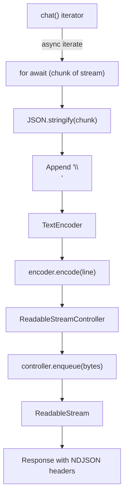
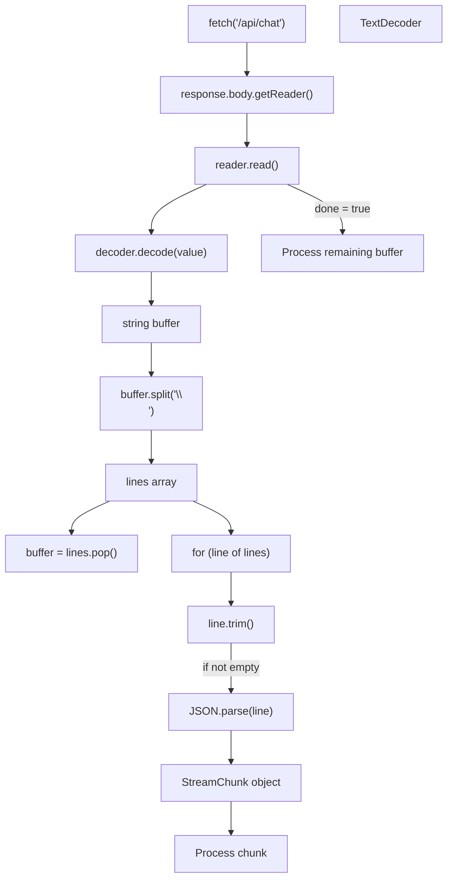
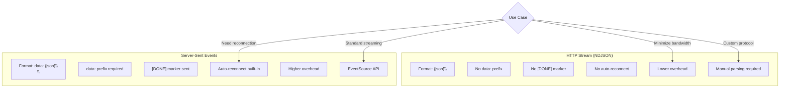
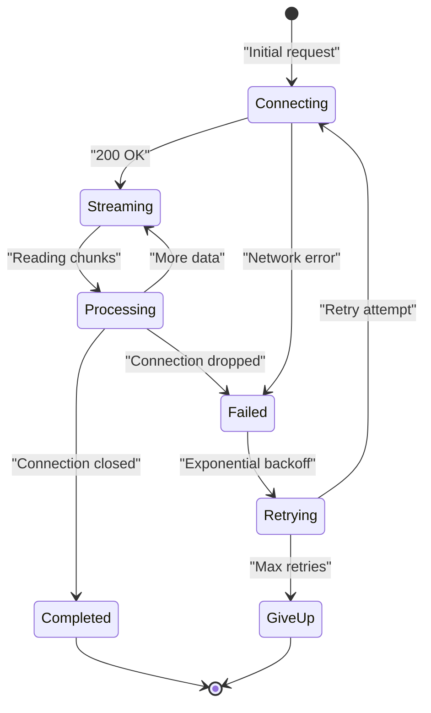

# HTTP Stream Protocol

<details>
<summary>Relevant source files</summary>

The following files were used as context for generating this wiki page:

- [docs/api/ai.md](docs/api/ai.md)
- [docs/getting-started/overview.md](docs/getting-started/overview.md)
- [docs/guides/client-tools.md](docs/guides/client-tools.md)
- [docs/guides/server-tools.md](docs/guides/server-tools.md)
- [docs/guides/streaming.md](docs/guides/streaming.md)
- [docs/guides/tool-approval.md](docs/guides/tool-approval.md)
- [docs/guides/tool-architecture.md](docs/guides/tool-architecture.md)
- [docs/guides/tools.md](docs/guides/tools.md)
- [docs/protocol/chunk-definitions.md](docs/protocol/chunk-definitions.md)
- [docs/protocol/http-stream-protocol.md](docs/protocol/http-stream-protocol.md)
- [docs/protocol/sse-protocol.md](docs/protocol/sse-protocol.md)
- [packages/typescript/ai-anthropic/src/text/text-provider-options.ts](packages/typescript/ai-anthropic/src/text/text-provider-options.ts)
- [packages/typescript/ai-openai/src/text/text-provider-options.ts](packages/typescript/ai-openai/src/text/text-provider-options.ts)
- [packages/typescript/ai/src/types.ts](packages/typescript/ai/src/types.ts)

</details>

## Purpose and Scope

The HTTP Stream Protocol transmits `StreamChunk` objects over HTTP as newline-delimited JSON (NDJSON). This protocol provides a simpler, lower-overhead alternative to Server-Sent Events when automatic reconnection is not required or when minimizing bandwidth usage is a priority.

For the recommended streaming protocol with automatic reconnection support, see [Server-Sent Events (SSE) Protocol](#5.3). For definitions of the chunk types transmitted over this protocol, see [StreamChunk Types](#5.1).

## Protocol Specification

### HTTP Request Format

The client initiates a streaming chat session with a standard POST request:

```
POST /api/chat HTTP/1.1
Content-Type: application/json

{
  "messages": [
    { "role": "user", "content": "Hello" }
  ],
  "data": { ... }
}
```

**Sources:** [docs/protocol/http-stream-protocol.md:21-43]()

### HTTP Response Format

The server responds with chunked transfer encoding and NDJSON content type:

```
HTTP/1.1 200 OK
Content-Type: application/x-ndjson
Transfer-Encoding: chunked
```

Alternative content type (both are acceptable):

```
Content-Type: application/json
Transfer-Encoding: chunked
```

The response body consists of newline-delimited JSON chunks without any prefixes or separators.

**Sources:** [docs/protocol/http-stream-protocol.md:45-62]()

## Stream Format

### NDJSON Structure

Each `StreamChunk` is serialized as a single line of JSON followed by a newline character (`\
`):

```
{JSON_ENCODED_CHUNK}\

```

**Key Characteristics:**

| Feature | HTTP Stream    | SSE |
| ------- | -------------- | --- |
| Format  | `{json}\       |
| `       | `data: {json}\ |

\
`|
| Prefix | None |`data: `|
| Separator |`\
`|`\
\
`|
| Completion marker | None (close connection) |`data: [DONE]\
\
` |

**Sources:** [docs/protocol/http-stream-protocol.md:65-80]()

### Format Diagram

```mermaid
sequenceDiagram
    participant Client
    participant Server
    participant Encoder["TextEncoder"]
    participant Stream["ReadableStream"]

    Client->>Server: "POST /api/chat"
    Server->>Encoder: "Serialize StreamChunk to JSON"
    Encoder->>Encoder: "JSON.stringify(chunk)"
    Encoder->>Encoder: "Append '\\
'"
    Encoder->>Stream: "Enqueue line"
    Stream-->>Client: "Send chunk"

    Note over Client: "Parse line as JSON"
    Note over Client: "Process StreamChunk"

    Server->>Encoder: "Next StreamChunk"
    Encoder->>Stream: "Enqueue next line"
    Stream-->>Client: "Send chunk"

    Server->>Stream: "Close stream"
    Stream-->>Client: "Connection closed"
```

**Sources:** [docs/protocol/http-stream-protocol.md:65-103]()

## Stream Lifecycle

### Complete Flow

```mermaid
sequenceDiagram
    participant Client
    participant Server["Server Route Handler"]
    participant chat["chat()"]
    participant Adapter["AI Adapter"]
    participant LLM["LLM Service"]

    Client->>Server: "POST with messages"
    Server->>chat: "chat({ adapter, messages })"
    chat->>Adapter: "chatStream(options)"
    Adapter->>LLM: "Stream request"

    loop "For each chunk"
        LLM-->>Adapter: "Provider chunk"
        Adapter-->>chat: "StreamChunk (normalized)"
        chat-->>Server: "Yield chunk"
        Server->>Server: "JSON.stringify(chunk) + '\\
'"
        Server-->>Client: "Send line"
        Client->>Client: "Split by newline"
        Client->>Client: "JSON.parse(line)"
        Client->>Client: "Process chunk"
    end

    LLM-->>Adapter: "Stream complete"
    Adapter-->>chat: "DoneStreamChunk"
    chat-->>Server: "Final chunk"
    Server->>Server: "Serialize + '\\
'"
    Server-->>Client: "Send final line"
    Server-->>Client: "Close connection"
```

**Sources:** [docs/protocol/http-stream-protocol.md:106-143]()

### Example Stream Sequence

A typical stream consists of multiple JSON lines, each representing a different `StreamChunk` type:

```
{"type":"content","id":"msg_1","model":"gpt-5.2","timestamp":1701234567890,"delta":"The","content":"The","role":"assistant"}
{"type":"content","id":"msg_1","model":"gpt-5.2","timestamp":1701234567891,"delta":" weather","content":"The weather","role":"assistant"}
{"type":"content","id":"msg_1","model":"gpt-5.2","timestamp":1701234567892,"delta":" is","content":"The weather is","role":"assistant"}
{"type":"tool_call","id":"msg_1","model":"gpt-5.2","timestamp":1701234567893,"toolCall":{"id":"call_xyz","type":"function","function":{"name":"get_weather","arguments":"{\"location\":\"SF\"}"}},"index":0}
{"type":"tool_result","id":"msg_1","model":"gpt-5.2","timestamp":1701234567894,"toolCallId":"call_xyz","content":"{\"temperature\":72}"}
{"type":"done","id":"msg_1","model":"gpt-5.2","timestamp":1701234567895,"finishReason":"stop","usage":{"promptTokens":10,"completionTokens":15,"totalTokens":25}}
```

Each line is a complete JSON object representing a `ContentStreamChunk`, `ToolCallStreamChunk`, `ToolResultStreamChunk`, or `DoneStreamChunk` as defined in [packages/typescript/ai/src/types.ts:652-748]().

**Sources:** [docs/protocol/http-stream-protocol.md:84-103](), [packages/typescript/ai/src/types.ts:652-748]()

## Server-Side Implementation

### Manual Implementation Pattern

The server must manually construct the NDJSON stream since TanStack AI does not provide a built-in `toHttpStream()` utility:



**Implementation Code Pattern:**

The server creates a `ReadableStream` that iterates over the `chat()` async iterable, serializes each `StreamChunk` to JSON, appends a newline, and enqueues the encoded bytes:

```typescript
// Pseudo-code pattern from docs/protocol/http-stream-protocol.md
const encoder = new TextEncoder()

const readableStream = new ReadableStream({
  async start(controller) {
    try {
      for await (const chunk of stream) {
        const line =
          JSON.stringify(chunk) +
          '\
'
        controller.enqueue(encoder.encode(line))
      }
      controller.close()
    } catch (error) {
      const errorChunk = { type: 'error', error: { message: error.message } }
      controller.enqueue(
        encoder.encode(
          JSON.stringify(errorChunk) +
            '\
'
        )
      )
      controller.close()
    }
  },
})

return new Response(readableStream, {
  headers: {
    'Content-Type': 'application/x-ndjson',
    'Cache-Control': 'no-cache',
  },
})
```

**Sources:** [docs/protocol/http-stream-protocol.md:169-217]()

### Framework-Specific Examples

**Next.js / Web Standards:**

```typescript
// Implements the pattern from docs/protocol/http-stream-protocol.md:172-217
export async function POST(request: Request) {
  const { messages } = await request.json()
  const encoder = new TextEncoder()

  const stream = chat({
    adapter: openaiText('gpt-5.2'),
    messages,
  })

  const readableStream = new ReadableStream({
    async start(controller) {
      for await (const chunk of stream) {
        const line =
          JSON.stringify(chunk) +
          '\
'
        controller.enqueue(encoder.encode(line))
      }
      controller.close()
    },
  })

  return new Response(readableStream, {
    headers: {
      'Content-Type': 'application/x-ndjson',
      'Cache-Control': 'no-cache',
    },
  })
}
```

**Express.js:**

```typescript
// Implements the pattern from docs/protocol/http-stream-protocol.md:220-256
app.post('/api/chat', async (req, res) => {
  res.setHeader('Content-Type', 'application/x-ndjson')
  res.setHeader('Cache-Control', 'no-cache')
  res.setHeader('Transfer-Encoding', 'chunked')

  const stream = chat({
    adapter: openaiText('gpt-5.2'),
    messages: req.body.messages,
  })

  for await (const chunk of stream) {
    res.write(
      JSON.stringify(chunk) +
        '\
'
    )
  }
  res.end()
})
```

**Sources:** [docs/protocol/http-stream-protocol.md:169-256]()

## Client-Side Implementation

### Using fetchHttpStream()

TanStack AI provides `fetchHttpStream()` as a connection adapter that handles NDJSON parsing:

```typescript
import { useChat, fetchHttpStream } from '@tanstack/ai-react'

const { messages, sendMessage } = useChat({
  connection: fetchHttpStream('/api/chat'),
})
```

The `fetchHttpStream()` adapter:

1. Makes a POST request with messages
2. Reads the response body as a stream
3. Splits by newline characters
4. Parses each line as JSON
5. Yields `StreamChunk` objects

**Sources:** [docs/protocol/http-stream-protocol.md:260-276](), [docs/guides/streaming.md:106-113]()

### Manual Client Implementation

For custom streaming logic, implement the buffering and parsing manually:



**Implementation Pattern:**

The client must handle partial lines by maintaining a buffer. Each read operation may contain incomplete JSON objects that span multiple TCP packets:

```typescript
// Pattern from docs/protocol/http-stream-protocol.md:278-323
const reader = response.body!.getReader()
const decoder = new TextDecoder()
let buffer = ''

while (true) {
  const { done, value } = await reader.read()
  if (done) break

  buffer += decoder.decode(value, { stream: true })
  const lines =
    buffer.split(
      '\
'
    )

  // Keep incomplete line in buffer
  buffer = lines.pop() || ''

  for (const line of lines) {
    if (line.trim()) {
      const chunk = JSON.parse(line)
      // Process StreamChunk
    }
  }
}

// Process any remaining data
if (buffer.trim()) {
  const chunk = JSON.parse(buffer)
}
```

**Sources:** [docs/protocol/http-stream-protocol.md:277-323]()

## Protocol Comparison

### HTTP Stream vs SSE



**Comparison Table:**

| Feature | HTTP Stream (NDJSON) | SSE |
| ------- | -------------------- | --- |
| Format  | `{json}\             |
| `       | `data: {json}\       |

\
` |
| Overhead | Lower (no prefixes) | Higher (`data:` prefix) |
| Auto-reconnect | ❌ No (client must implement) | ✅ Yes (browser built-in) |
| Browser API | ❌ No (manual fetch) | ✅ Yes (EventSource) |
| Completion marker | ❌ No (connection close) | ✅ Yes (`[DONE]`) |
| Debugging | Easy (plain JSON lines) | Easy (plain text) |
| Use case | Custom protocols, bandwidth optimization | Standard streaming, reliability |

**Recommendation:** Use SSE ([#5.3](#5.3)) for most applications. Use HTTP streaming when:

- Bandwidth overhead is critical
- Custom protocol requirements exist
- Auto-reconnection is not needed
- Building non-browser clients

**Sources:** [docs/protocol/http-stream-protocol.md:327-340]()

## Error Handling

### Server-Side Errors

When errors occur during streaming, the server sends an `ErrorStreamChunk` and closes the connection:

```
{"type":"error","id":"msg_1","model":"gpt-5.2","timestamp":1701234567895,"error":{"message":"Rate limit exceeded","code":"rate_limit_exceeded"}}
```

The `ErrorStreamChunk` interface is defined in [packages/typescript/ai/src/types.ts:705-711]():

```typescript
interface ErrorStreamChunk extends BaseStreamChunk {
  type: 'error'
  error: {
    message: string
    code?: string
  }
}
```

**Sources:** [docs/protocol/http-stream-protocol.md:145-156](), [packages/typescript/ai/src/types.ts:705-711]()

### Connection Errors

Unlike SSE, HTTP streaming does not provide automatic reconnection. The client must:

1. Detect connection drops
2. Implement retry logic
3. Use exponential backoff
4. Handle partial responses



**Sources:** [docs/protocol/http-stream-protocol.md:158-164]()

## Debugging and Validation

### Inspecting Traffic

**Browser DevTools:**

1. Open Network tab
2. Find POST request to `/api/chat`
3. View Response tab to see stream as it arrives

**cURL:**

```bash
curl -N -X POST http://localhost:3000/api/chat \
  -H "Content-Type: application/json" \
  -d '{"messages":[{"role":"user","content":"Hello"}]}'
```

The `-N` flag disables buffering for real-time output.

**Expected Output:**

```
{"type":"content","id":"msg_1","model":"gpt-5.2","timestamp":1701234567890,"delta":"Hello","content":"Hello"}
{"type":"content","id":"msg_1","model":"gpt-5.2","timestamp":1701234567891,"delta":" there","content":"Hello there"}
{"type":"done","id":"msg_1","model":"gpt-5.2","timestamp":1701234567892,"finishReason":"stop"}
```

**Sources:** [docs/protocol/http-stream-protocol.md:343-366]()

### Validating NDJSON

Each line must be valid JSON. Validate with:

```bash
curl -N http://localhost:3000/api/chat | while read line; do
  echo "$line" | jq . > /dev/null || echo "Invalid JSON: $line"
done
```

This pipes each line through `jq` to validate JSON structure.

**Sources:** [docs/protocol/http-stream-protocol.md:368-378]()

## Best Practices

### Format Guidelines

1. **Consistent Line Endings** - Always use `\
`, never mix `\r\
` and `\
`
2. **Proper Content-Type** - Use `application/x-ndjson` or `application/json` with `Transfer-Encoding: chunked`
3. **Buffer Partial Lines** - Client must handle incomplete JSON objects that span reads
4. **Validate JSON** - Catch and handle `JSON.parse()` errors gracefully
5. **Flush Regularly** - Don't buffer chunks server-side before sending
6. **Implement Retries** - Client should handle connection drops with exponential backoff

**Sources:** [docs/protocol/http-stream-protocol.md:399-407]()

### JSON Lines Specification

HTTP streaming in TanStack AI follows the [JSON Lines specification](http://jsonlines.org/):

- One JSON value per line
- Each line terminated with `\
`
- UTF-8 encoding
- Compatible with `.jsonl` or `.ndjson` file extensions

This makes streams compatible with standard NDJSON tools and libraries.

**Sources:** [docs/protocol/http-stream-protocol.md:410-420]()

## Related Protocols

- For the recommended streaming protocol with auto-reconnection, see [Server-Sent Events (SSE) Protocol](#5.3)
- For details on the chunk types transmitted, see [StreamChunk Types](#5.1)
- For client-side streaming patterns, see [docs/guides/streaming.md]()

**Sources:** [docs/protocol/http-stream-protocol.md:423-430]()
