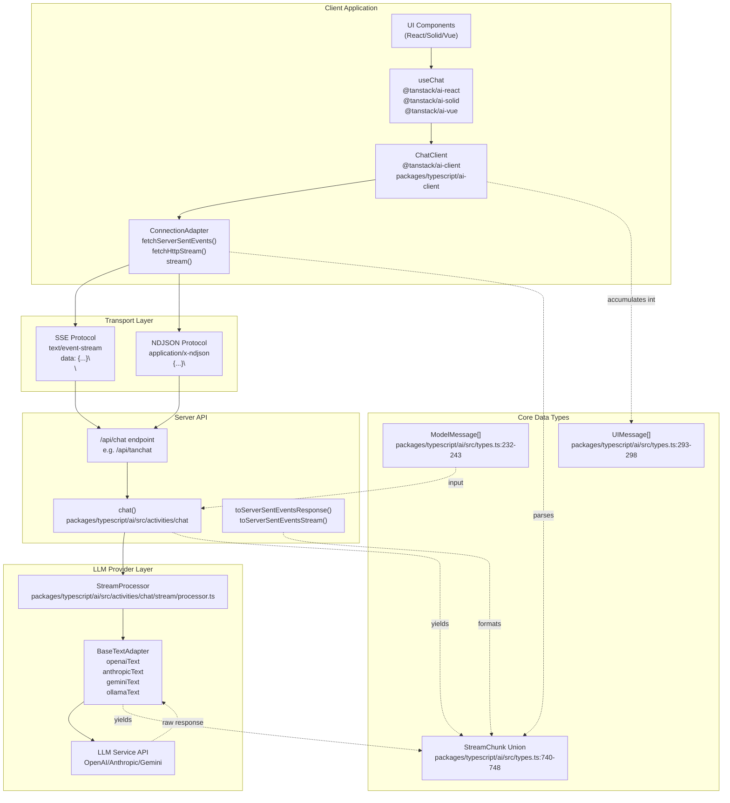
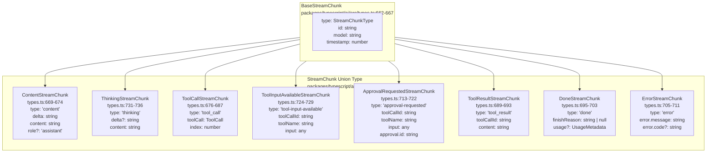

# Streaming Protocols

<details>
<summary>Relevant source files</summary>

The following files were used as context for generating this wiki page:

- [docs/api/ai.md](docs/api/ai.md)
- [docs/getting-started/overview.md](docs/getting-started/overview.md)
- [docs/guides/client-tools.md](docs/guides/client-tools.md)
- [docs/guides/server-tools.md](docs/guides/server-tools.md)
- [docs/guides/streaming.md](docs/guides/streaming.md)
- [docs/guides/tool-approval.md](docs/guides/tool-approval.md)
- [docs/guides/tool-architecture.md](docs/guides/tool-architecture.md)
- [docs/guides/tools.md](docs/guides/tools.md)
- [docs/protocol/chunk-definitions.md](docs/protocol/chunk-definitions.md)
- [docs/protocol/http-stream-protocol.md](docs/protocol/http-stream-protocol.md)
- [docs/protocol/sse-protocol.md](docs/protocol/sse-protocol.md)
- [packages/typescript/ai-anthropic/src/text/text-provider-options.ts](packages/typescript/ai-anthropic/src/text/text-provider-options.ts)
- [packages/typescript/ai-openai/src/text/text-provider-options.ts](packages/typescript/ai-openai/src/text/text-provider-options.ts)
- [packages/typescript/ai/src/types.ts](packages/typescript/ai/src/types.ts)

</details>

This document provides an overview of TanStack AI's streaming architecture and the available protocols for transmitting AI responses from server to client. Streaming enables real-time display of content, tool calls, and thinking processes as they are generated by the LLM, rather than waiting for the complete response.

For detailed protocol specifications, see [Server-Sent Events Protocol](#5.1) and [HTTP Stream Protocol](#5.2). For information about the data structures transmitted, see [StreamChunk Types](#5.3). For client-side implementation details, see [Connection Adapters](#4.2).

## Purpose of Streaming

Streaming in TanStack AI serves several critical purposes:

**Real-Time User Experience**: Users see content appear incrementally as the model generates it, providing immediate feedback and reducing perceived latency.

**Progressive Tool Execution**: Tool calls and results stream in real-time, allowing the client to update UI as tools execute rather than waiting for all operations to complete.

**Thinking Transparency**: Models that support reasoning (like Claude with extended thinking or OpenAI's o1 models) can stream their thought process separately from their final answer, giving users insight into the model's decision-making.

**Long Response Handling**: For responses that take significant time to generate (complex reasoning, multiple tool calls, lengthy content), streaming prevents timeout issues and keeps users engaged.

**Efficient Resource Usage**: Streaming establishes a single long-lived HTTP connection rather than polling or making repeated requests, reducing server load and network overhead.

Sources: [docs/guides/streaming.md:1-175](), [docs/protocol/sse-protocol.md:1-355]()

## Streaming Architecture



**Streaming Architecture: End-to-End Data Flow**

The streaming architecture in TanStack AI follows a clear pipeline from the server's `chat()` function to the client's UI components:

1. **Server Processing**: The `chat()` function [packages/typescript/ai/src/activities/chat]() receives `ModelMessage[]` input [packages/typescript/ai/src/types.ts:232-243]() and returns an async iterable of `StreamChunk` objects [packages/typescript/ai/src/types.ts:740-748]().

2. **Stream Processing**: The `StreamProcessor` class [packages/typescript/ai/src/activities/chat/stream/processor.ts:168-600]() manages message accumulation, tool call state tracking, and event emission.

3. **Provider Transformation**: Provider adapters like `OpenAITextAdapter` [packages/typescript/ai-openai/src/adapters/text.ts](), `GeminiTextAdapter` [packages/typescript/ai-gemini/src/adapters/text.ts]() transform raw LLM responses into standardized `StreamChunk` types.

4. **Transport Formatting**: Stream formatters `toServerSentEventsResponse()` and `toServerSentEventsStream()` convert the async iterable into SSE format (text/event-stream) or manual NDJSON formatting.

5. **Network Transport**: Chunks are transmitted over HTTP using either Server-Sent Events or newline-delimited JSON protocols.

6. **Client Parsing**: Connection adapters `fetchServerSentEvents()` and `fetchHttpStream()` [packages/typescript/ai-client/src/connection-adapters]() parse the incoming stream and yield `StreamChunk` objects.

7. **State Management**: The `ChatClient` class [packages/typescript/ai-client]() accumulates chunks and the framework-specific `useChat` hooks convert them into `UIMessage[]` structures [packages/typescript/ai/src/types.ts:293-298]() with typed `parts[]` arrays for rendering.

Sources: [packages/typescript/ai/src/types.ts:232-298](), [packages/typescript/ai/src/activities/chat/stream/processor.ts:1-600](), [packages/typescript/ai-openai/src/adapters/text.ts](), [packages/typescript/ai-gemini/src/adapters/text.ts](), [examples/ts-react-chat/src/routes/api.tanchat.ts:1-171]()

## Protocol Options

TanStack AI supports two streaming protocols, each optimized for different use cases:

### Protocol Comparison

| Feature    | Server-Sent Events (SSE) | HTTP Stream (NDJSON) |
| ---------- | ------------------------ | -------------------- |
| **Format** | `data: {json}\           |

\
`|`{json}\
`|
| **Content-Type** |`text/event-stream`|`application/x-ndjson`or`application/json`|
| **Browser API** | ✅ EventSource | ❌ Manual parsing required |
| **Auto-reconnect** | ✅ Built-in | ❌ Must implement manually |
| **Completion marker** | ✅`data: [DONE]\
\
` | ❌ Connection close |
| **Overhead** | Higher (prefixes) | Lower (raw JSON) |
| **Debugging** | Easy (visible in DevTools) | Easy (plain JSON lines) |
| **Proxy support** | ✅ Excellent | ✅ Good |
| **Use case** | **Recommended for most applications** | Custom protocols, lower overhead |

Sources: [docs/protocol/sse-protocol.md:318-336](), [docs/protocol/http-stream-protocol.md:327-340]()

### Server-Sent Events (SSE)

SSE is the **recommended protocol** for TanStack AI applications. It provides a standardized, browser-native streaming format with automatic reconnection.

**Format Example:**

```
data: {"type":"content","id":"msg_1","model":"gpt-4o","timestamp":1701234567890,"delta":"Hello","content":"Hello"}\
\

data: {"type":"content","id":"msg_1","model":"gpt-4o","timestamp":1701234567891,"delta":" world","content":"Hello world"}\
\

data: {"type":"done","id":"msg_1","model":"gpt-4o","timestamp":1701234567892,"finishReason":"stop"}\
\

data: [DONE]\
\

```

**Server Implementation:**
Uses `toServerSentEventsResponse()` or `toServerSentEventsStream()` to format the stream.

**Client Implementation:**
Uses `fetchServerSentEvents()` connection adapter.

Sources: [docs/protocol/sse-protocol.md:55-91](), [docs/adapters/openai.md:56-72](), [docs/adapters/anthropic.md:56-72]()

### HTTP Stream (NDJSON)

HTTP streaming uses newline-delimited JSON, providing a simpler format with lower overhead. Suitable for environments where SSE is not well-supported or when custom protocols are needed.

**Format Example:**

```json
{"type":"content","id":"msg_1","model":"gpt-4o","timestamp":1701234567890,"delta":"Hello","content":"Hello"}
{"type":"content","id":"msg_1","model":"gpt-4o","timestamp":1701234567891,"delta":" world","content":"Hello world"}
{"type":"done","id":"msg_1","model":"gpt-4o","timestamp":1701234567892,"finishReason":"stop"}
```

**Server Implementation:**
Custom formatting with ReadableStream (no built-in helper provided by TanStack AI).

**Client Implementation:**
Uses `fetchHttpStream()` connection adapter.

Sources: [docs/protocol/http-stream-protocol.md:65-103](), [docs/guides/connection-adapters.md:64-73]()

## StreamChunk Types



**StreamChunk Type Hierarchy**

All streaming data in TanStack AI is transmitted as `StreamChunk` objects [packages/typescript/ai/src/types.ts:740-748](), which form a discriminated union type. Each chunk type extends `BaseStreamChunk` [packages/typescript/ai/src/types.ts:662-667]() and serves a specific purpose in the streaming lifecycle:

- **ContentStreamChunk** [types.ts:669-674](): Incremental text content generation with `delta` for new tokens and `content` for accumulated text.

- **ThinkingStreamChunk** [types.ts:731-736](): Model reasoning process (when supported by providers like Claude with extended thinking or OpenAI's o-series models). Contains `delta` for incremental thinking tokens and `content` for accumulated reasoning.

- **ToolCallStreamChunk** [types.ts:676-687](): Model decision to invoke a tool, containing a `ToolCall` object [types.ts:87-94]() with `id`, `type: 'function'`, and function name/arguments. The `index` field tracks multiple parallel tool calls.

- **ToolInputAvailableStreamChunk** [types.ts:724-729](): Emitted when a client tool's input is complete and ready for client-side execution. Contains `toolCallId`, `toolName`, and parsed `input`.

- **ApprovalRequestedStreamChunk** [types.ts:713-722](): Tool requires user approval before execution. Contains `approval.id` for tracking the approval flow and `needsApproval: true`.

- **ToolResultStreamChunk** [types.ts:689-693](): Result from completed tool execution, containing `toolCallId` and `content` (stringified result).

- **DoneStreamChunk** [types.ts:695-703](): Stream completion with `finishReason` ('stop' | 'length' | 'content_filter' | 'tool_calls' | null) and optional token `usage` statistics (promptTokens, completionTokens, totalTokens).

- **ErrorStreamChunk** [types.ts:705-711](): Error during generation with `error.message` and optional `error.code`.

All chunks share the base structure with `type`, `id`, `model`, and `timestamp` fields. The `type` field (of type `StreamChunkType` [types.ts:652-660]()) acts as the discriminant for TypeScript type narrowing.

Sources: [packages/typescript/ai/src/types.ts:652-748](), [packages/typescript/ai-gemini/tests/gemini-adapter.test.ts:254-319]()

## Server-Side Implementation

### Core Streaming Function

The `chat()` function is the primary entry point for creating streaming responses. It returns an async iterable of `StreamChunk` objects.

**Function Signature:**
The `chat()` function accepts a `TextOptions` object [packages/typescript/ai/src/types.ts:565-650]() containing:

| Parameter           | Type                           | Description                                              |
| ------------------- | ------------------------------ | -------------------------------------------------------- |
| `adapter`           | `BaseTextAdapter`              | Provider adapter instance (e.g., `openaiText('gpt-4o')`) |
| `messages`          | `ModelMessage[]`               | Conversation history [types.ts:232-243]()                |
| `tools`             | `Tool[]` (optional)            | Array of tool definitions [types.ts:328-438]()           |
| `systemPrompts`     | `string[]` (optional)          | System prompts prepended to messages                     |
| `agentLoopStrategy` | `AgentLoopStrategy` (optional) | Controls tool execution iterations [types.ts:560]()      |
| `temperature`       | `number` (optional)            | Sampling temperature (0.0-2.0)                           |
| `topP`              | `number` (optional)            | Nucleus sampling parameter                               |
| `maxTokens`         | `number` (optional)            | Maximum output tokens                                    |
| `modelOptions`      | Provider-specific (optional)   | Model-specific configuration                             |
| `abortController`   | `AbortController` (optional)   | Request cancellation [types.ts:649]()                    |
| `outputSchema`      | `SchemaInput` (optional)       | Schema for structured output [types.ts:630]()            |
| `conversationId`    | `string` (optional)            | ID for devtools correlation [types.ts:635]()             |

The function yields chunks as they are produced by the LLM provider, enabling progressive rendering on the client. The streaming is handled internally by the `StreamProcessor` class [packages/typescript/ai/src/activities/chat/stream/processor.ts:168-600]().

Sources: [packages/typescript/ai/src/types.ts:565-650](), [examples/ts-react-chat/src/routes/api.tanchat.ts:54-170]()

### Stream Formatting Utilities

TanStack AI provides utilities to convert the async iterable into HTTP responses:

#### `toServerSentEventsResponse()`

Converts a stream to a complete HTTP Response with SSE headers and formatting.

**Usage Example:**

```typescript
import { chat, toServerSentEventsResponse } from '@tanstack/ai'
import { openaiText } from '@tanstack/ai-openai'

// Example from examples/ts-react-chat/src/routes/api.tanchat.ts
export async function POST(request: Request) {
  const { messages } = await request.json()
  const abortController = new AbortController()

  const stream = chat({
    adapter: openaiText('gpt-4o'),
    messages,
    abortController,
  })

  return toServerSentEventsResponse(stream, { abortController })
}
```

**Implementation Details:**

The function [packages/typescript/ai/src/activities/chat/stream/to-sse.ts]() performs the following:

1. Creates a `ReadableStream<Uint8Array>` from the `AsyncIterable<StreamChunk>`
2. Wraps each chunk in SSE format: `data: {JSON}\
\
`
3. Sends termination marker: `data: [DONE]\
\
` when stream completes
4. Sets required HTTP headers:
   - `Content-Type: text/event-stream`
   - `Cache-Control: no-cache`
   - `Connection: keep-alive`
5. Handles `AbortController` to abort the stream when the client disconnects

**Options:**
The second parameter accepts `ResponseInit & { abortController?: AbortController }`, allowing you to:

- Pass custom headers
- Provide an `AbortController` for cleanup when the response stream is cancelled
- Set custom status codes

Sources: [examples/ts-react-chat/src/routes/api.tanchat.ts:125-141](), [docs/api/ai.md:161-183]()

#### `toServerSentEventsStream()`

Converts a stream to a ReadableStream without wrapping in a Response object, useful when you need more control over response headers or want to compose streams.

**Signature:**

```typescript
function toServerSentEventsStream(
  stream: AsyncIterable<StreamChunk>,
  abortController?: AbortController
): ReadableStream<Uint8Array>
```

Sources: [docs/api/ai.md:134-160]()

### HTTP Stream Implementation

For HTTP streaming (NDJSON), TanStack AI does not provide a built-in formatter. You must implement the formatting manually:

```typescript
export async function POST(request: Request) {
  const { messages } = await request.json()
  const encoder = new TextEncoder()

  const stream = chat({
    adapter: openaiText('gpt-4o'),
    messages,
  })

  const readableStream = new ReadableStream({
    async start(controller) {
      try {
        for await (const chunk of stream) {
          const line =
            JSON.stringify(chunk) +
            '\
'
          controller.enqueue(encoder.encode(line))
        }
        controller.close()
      } catch (error: any) {
        const errorChunk = {
          type: 'error',
          error: { message: error.message },
        }
        controller.enqueue(
          encoder.encode(
            JSON.stringify(errorChunk) +
              '\
'
          )
        )
        controller.close()
      }
    },
  })

  return new Response(readableStream, {
    headers: {
      'Content-Type': 'application/x-ndjson',
      'Cache-Control': 'no-cache',
    },
  })
}
```

Sources: [docs/protocol/http-stream-protocol.md:169-218]()

## Client-Side Implementation

### Connection Adapters

Connection adapters handle the transport layer, parsing incoming streams and yielding `StreamChunk` objects. They implement the `ConnectionAdapter` interface:

```typescript
interface ConnectionAdapter {
  connect(
    messages: UIMessage[] | ModelMessage[],
    data?: Record<string, any>,
    abortSignal?: AbortSignal
  ): AsyncIterable<StreamChunk>
}
```

Sources: [docs/guides/connection-adapters.md:149-161]()

### `fetchServerSentEvents()`

Parses Server-Sent Events streams:

```typescript
import { useChat, fetchServerSentEvents } from '@tanstack/ai-react'

const { messages, sendMessage } = useChat({
  connection: fetchServerSentEvents('/api/chat'),
})
```

**Options:**

- Dynamic URLs: Pass a function that returns the URL
- Custom headers: Pass headers object or function
- Custom fetch client: Provide a custom fetch implementation for proxies or retries

**What it does:**

1. Makes POST request with messages
2. Reads response body as stream
3. Parses SSE format (strips `data: ` prefix)
4. Deserializes JSON chunks
5. Yields `StreamChunk` objects
6. Stops on `[DONE]` marker

Sources: [docs/guides/connection-adapters.md:12-62](), [docs/protocol/sse-protocol.md:196-213]()

### `fetchHttpStream()`

Parses HTTP streaming (NDJSON) responses:

```typescript
import { useChat, fetchHttpStream } from '@tanstack/ai-react'

const { messages, sendMessage } = useChat({
  connection: fetchHttpStream('/api/chat'),
})
```

**What it does:**

1. Makes POST request with messages
2. Reads response body as stream
3. Splits by newlines
4. Parses each line as JSON
5. Yields `StreamChunk` objects

Sources: [docs/guides/connection-adapters.md:64-73](), [docs/protocol/http-stream-protocol.md:260-276]()

### Custom Connection Adapters

For specialized protocols (e.g., WebSocket, gRPC), create custom adapters using the `stream()` helper:

```typescript
import { stream, type ConnectionAdapter } from '@tanstack/ai-react'
import type { StreamChunk, ModelMessage } from '@tanstack/ai'

const customAdapter: ConnectionAdapter = stream(
  async (
    messages: ModelMessage[],
    data?: Record<string, any>,
    signal?: AbortSignal
  ) => {
    const response = await fetch('/api/chat', {
      method: 'POST',
      headers: { 'Content-Type': 'application/json' },
      body: JSON.stringify({ messages, ...data }),
      signal,
    })

    if (!response.ok) {
      throw new Error(`HTTP error! status: ${response.status}`)
    }

    return processStream(response) // Return AsyncIterable<StreamChunk>
  }
)
```

Sources: [docs/guides/connection-adapters.md:75-107]()

## Streaming Lifecycle

```mermaid
sequenceDiagram
    participant UIComponent["UI Component<br/>(React/Solid/Vue)"]
    participant useChatHook["useChat hook<br/>@tanstack/ai-react"]
    participant ChatClient["ChatClient<br/>@tanstack/ai-client"]
    participant ConnectionAdapter["fetchServerSentEvents()<br/>ai-client/src/connection-adapters"]
    participant APIRoute["/api/tanchat<br/>TanStack Router route"]
    participant ChatFunction["chat()<br/>ai/src/activities/chat"]
    participant StreamProcessor["StreamProcessor<br/>ai/src/activities/chat/stream/processor.ts"]
    participant TextAdapter["openaiText()<br/>OpenAITextAdapter<br/>ai-openai/src/adapters/text.ts"]
    participant OpenAIAPI["OpenAI API<br/>chat.completions.create"]

    UIComponent->>useChatHook: sendMessage("Hello")
    useChatHook->>ChatClient: sendMessage()
    ChatClient->>ChatClient: Set isLoading = true
    ChatClient->>ConnectionAdapter: connect(messages, data, signal)
    ConnectionAdapter->>APIRoute: POST /api/tanchat<br/>{messages, data}

    APIRoute->>ChatFunction: chat({adapter, messages, tools})
    ChatFunction->>StreamProcessor: new StreamProcessor(options)
    ChatFunction->>TextAdapter: chatStream(options)
    TextAdapter->>TextAdapter: mapCommonOptionsToProvider()
    TextAdapter->>OpenAIAPI: POST /v1/chat/completions<br/>stream: true

    loop "Stream Response Chunks"
        OpenAIAPI-->>TextAdapter: Provider-specific chunk
        TextAdapter->>TextAdapter: processStreamChunks()
        TextAdapter-->>StreamProcessor: yield StreamChunk

        alt "Content Chunk"
            StreamProcessor->>StreamProcessor: updateTextPart()<br/>accumulate content
            StreamProcessor->>StreamProcessor: emit onTextUpdate event
        else "Tool Call Chunk"
            StreamProcessor->>StreamProcessor: updateToolCallPart()<br/>track state
            StreamProcessor->>StreamProcessor: emit onToolCallStateChange

            alt "Server Tool (has execute)"
                StreamProcessor->>StreamProcessor: Auto-execute tool
                StreamProcessor->>TextAdapter: Add tool_result to messages
                TextAdapter->>OpenAIAPI: Continue with result
            else "Client Tool (no execute)"
                StreamProcessor->>StreamProcessor: emit ToolInputAvailableStreamChunk
            end
        else "Thinking Chunk"
            StreamProcessor->>StreamProcessor: updateThinkingPart()<br/>accumulate reasoning
        end

        StreamProcessor-->>ChatFunction: yield StreamChunk
        ChatFunction-->>APIRoute: yield StreamChunk
        APIRoute->>APIRoute: toServerSentEventsResponse()
        APIRoute-->>ConnectionAdapter: SSE: data: {...}\
\

        ConnectionAdapter->>ConnectionAdapter: Parse SSE format
        ConnectionAdapter-->>ChatClient: yield StreamChunk
        ChatClient->>ChatClient: Accumulate into UIMessage[]
        ChatClient->>useChatHook: Trigger state update
        useChatHook->>UIComponent: Re-render with new messages
    end

    OpenAIAPI-->>TextAdapter: Stream complete
    TextAdapter-->>StreamProcessor: DoneStreamChunk
    StreamProcessor->>StreamProcessor: emit onStreamEnd event
    StreamProcessor-->>ChatFunction: DoneStreamChunk
    ChatFunction-->>APIRoute: DoneStreamChunk
    APIRoute-->>ConnectionAdapter: SSE: data: [DONE]\
\

    ConnectionAdapter-->>ChatClient: Stream complete
    ChatClient->>ChatClient: Set isLoading = false
    ChatClient->>useChatHook: Final state update
```

**Complete Streaming Request Lifecycle**

This diagram shows the actual code path through TanStack AI's streaming architecture:

1. **Initiation**: UI component calls `sendMessage()` on `useChat` hook [packages/typescript/ai-react/src/useChat.ts]()

2. **Client Processing**: `ChatClient.sendMessage()` [packages/typescript/ai-client]() sets `isLoading = true` and invokes the connection adapter

3. **Network Request**: `fetchServerSentEvents()` makes HTTP POST to API route (e.g., `/api/tanchat` [examples/ts-react-chat/src/routes/api.tanchat.ts]())

4. **Server Entry**: API route handler calls `chat()` function [packages/typescript/ai/src/activities/chat]()

5. **Stream Processing Setup**: `chat()` creates a `StreamProcessor` instance [packages/typescript/ai/src/activities/chat/stream/processor.ts:168]() to manage message state

6. **Provider Invocation**: `chat()` calls adapter's `chatStream()` method (e.g., `OpenAITextAdapter.chatStream()` [packages/typescript/ai-openai/src/adapters/text.ts:105-130]())

7. **Provider Transformation**: Adapter maps common options to provider format via `mapCommonOptionsToProvider()` [ai-openai/src/adapters/text.ts:490-574]()

8. **LLM Request**: Adapter makes streaming API call to LLM service (e.g., OpenAI's `/v1/chat/completions`)

9. **Chunk Processing Loop**: For each raw chunk from the LLM:
   - Adapter's `processStreamChunks()` [ai-openai/src/adapters/text.ts:246-458]() transforms to `StreamChunk` format
   - `StreamProcessor` accumulates content via `updateTextPart()` [processor.ts:548-570](), tracks tool calls via `updateToolCallPart()` [processor.ts:572-643](), or handles thinking via `updateThinkingPart()` [processor.ts:645-667]()
   - For server tools, processor auto-executes and continues the loop
   - For client tools, processor emits `ToolInputAvailableStreamChunk`
   - Processor emits granular events (`onTextUpdate`, `onToolCallStateChange`, etc.)

10. **Response Formatting**: `toServerSentEventsResponse()` wraps chunks in SSE format: `data: {...}\
\
`

11. **Network Transport**: Chunks transmitted as Server-Sent Events

12. **Client Parsing**: `fetchServerSentEvents()` parses SSE format and yields `StreamChunk` objects

13. **State Accumulation**: `ChatClient` accumulates chunks into `UIMessage[]` structures with typed `parts[]` arrays

14. **UI Update**: Framework hook triggers component re-render with updated messages

15. **Completion**: `DoneStreamChunk` followed by `data: [DONE]\
\
` marker signals stream end, `isLoading` set to `false`

Sources: [packages/typescript/ai/src/activities/chat/stream/processor.ts:168-600](), [packages/typescript/ai-openai/src/adapters/text.ts:105-574](), [examples/ts-react-chat/src/routes/api.tanchat.ts:54-170](), [packages/typescript/ai-client]()

## When to Use Each Protocol

### Use Server-Sent Events (SSE) When:

✅ Building standard web applications with browser clients  
✅ Need automatic reconnection on network failures  
✅ Want to leverage browser's EventSource API  
✅ Working with HTTP proxies or load balancers  
✅ Debugging is important (visible in DevTools)  
✅ **Recommended default choice**

### Use HTTP Stream (NDJSON) When:

✅ Building custom protocols on top of streaming  
✅ Minimizing bandwidth overhead is critical  
✅ Working in environments with poor SSE support  
✅ Need more control over stream format  
✅ Implementing non-browser clients (CLI, mobile native)

### Use Custom Adapters When:

✅ Implementing WebSocket-based streaming  
✅ Using alternative transport protocols (gRPC, WebRTC)  
✅ Building specialized authentication flows  
✅ Need request/response interception  
✅ Implementing retry logic or circuit breakers

Sources: [docs/protocol/sse-protocol.md:318-346](), [docs/protocol/http-stream-protocol.md:381-407](), [docs/guides/connection-adapters.md:219-226]()

## Error Handling

### Server-Side Errors

When errors occur during generation, send an `ErrorStreamChunk`:

```typescript
{
  "type": "error",
  "id": "msg_1",
  "model": "gpt-4o",
  "timestamp": 1701234567893,
  "error": {
    "message": "Rate limit exceeded",
    "code": "rate_limit_exceeded"
  }
}
```

Common error codes include `rate_limit_exceeded`, `invalid_request`, `authentication_error`, `timeout`, and `server_error`.

Sources: [docs/protocol/sse-protocol.md:142-160](), [docs/protocol/chunk-definitions.md:307-346]()

### Connection Errors

**SSE**: Browser automatically reconnects on connection drops. Server can send `retry:` field to control reconnection delay.

**HTTP Stream**: No automatic reconnection. Client must implement retry logic with exponential backoff.

**Custom Adapters**: Implement error handling in the adapter's connection logic, using the `AbortSignal` to detect cancellation.

Sources: [docs/protocol/sse-protocol.md:153-160](), [docs/protocol/http-stream-protocol.md:146-164](), [docs/guides/connection-adapters.md:163-189]()

## Integration with Other Systems

### Provider Adapters

Provider adapters (`openaiText`, `anthropicText`, `geminiText`, `ollamaText`) are responsible for:

1. Transforming generic `TextOptions` into provider-specific formats
2. Making API calls to LLM services
3. Parsing raw provider responses
4. Converting provider chunks into standardized `StreamChunk` types

Each adapter implements the `BaseTextAdapter` interface and provides methods like `chatStream()` and `processChunks()`.

Sources: [Diagram 5 from high-level architecture](), [docs/adapters/openai.md:1-334](), [docs/adapters/anthropic.md:1-231]()

### Client State Management

The `ChatClient` class (in `@tanstack/ai-client`) consumes `StreamChunk` objects from connection adapters and manages:

- Message accumulation and state
- Tool execution coordination
- Loading states and error handling
- Type-safe message structures

Framework hooks (`useChat` for React/Solid/Vue) wrap `ChatClient` and provide reactive state management appropriate for each framework.

Sources: [Diagram 6 from high-level architecture](), [docs/guides/streaming.md:49-65]()

### Tool Execution

Tool-related chunks (`ToolCallStreamChunk`, `ToolInputAvailableStreamChunk`, `ToolResultStreamChunk`, `ApprovalRequestedStreamChunk`) enable real-time tool execution visibility:

1. **ToolCallStreamChunk**: Model decides to call a tool
2. **ToolInputAvailableStreamChunk**: Signals client tools to execute
3. **ApprovalRequestedStreamChunk**: Pauses for user approval
4. **ToolResultStreamChunk**: Contains execution result

This streaming approach allows UIs to display tool execution progress, show approval dialogs, and render results as they become available.

Sources: [docs/guides/tool-architecture.md:1-386](), [docs/protocol/chunk-definitions.md:103-259]()

## Best Practices

**Server-Side:**

- Always set proper headers (`Content-Type`, `Cache-Control`, `Connection`)
- Send `[DONE]` marker for SSE to signal completion
- Handle errors gracefully with `ErrorStreamChunk` before closing
- Set reasonable timeouts to prevent hanging connections
- Monitor connection count to detect leaks

**Client-Side:**

- Cancel ongoing streams on component unmount
- Handle loading states and errors appropriately
- Batch UI updates if rendering performance is an issue
- Implement retry logic with exponential backoff for connection failures
- Display partial content progressively as it streams

**Protocol Selection:**

- Prefer SSE for standard web applications (best browser support)
- Use HTTP Stream only when SSE is not suitable
- Implement custom adapters for specialized transport needs

**Debugging:**

- Use browser DevTools Network tab to inspect streaming responses
- Use `curl -N` to test streaming endpoints from command line
- Validate JSON format for each chunk
- Monitor for incomplete chunks or parsing errors

Sources: [docs/protocol/sse-protocol.md:338-346](), [docs/protocol/http-stream-protocol.md:399-407](), [docs/guides/streaming.md:163-170](), [docs/guides/connection-adapters.md:219-226]()
