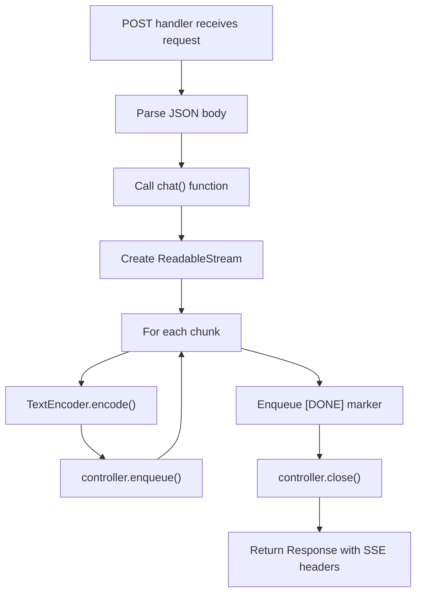
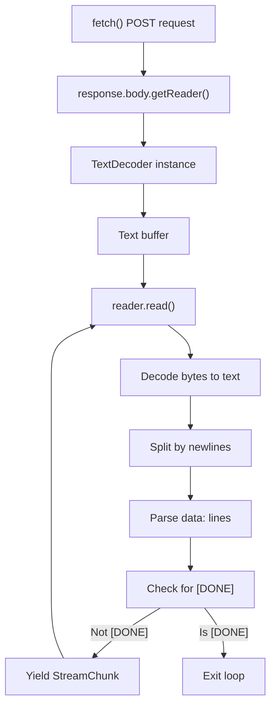

# Server-Sent Events (SSE) Protocol

<details>
<summary>Relevant source files</summary>

The following files were used as context for generating this wiki page:

- [docs/adapters/anthropic.md](docs/adapters/anthropic.md)
- [docs/adapters/gemini.md](docs/adapters/gemini.md)
- [docs/adapters/ollama.md](docs/adapters/ollama.md)
- [docs/adapters/openai.md](docs/adapters/openai.md)
- [docs/api/ai.md](docs/api/ai.md)
- [docs/getting-started/overview.md](docs/getting-started/overview.md)
- [docs/getting-started/quick-start.md](docs/getting-started/quick-start.md)
- [docs/guides/client-tools.md](docs/guides/client-tools.md)
- [docs/guides/server-tools.md](docs/guides/server-tools.md)
- [docs/guides/streaming.md](docs/guides/streaming.md)
- [docs/guides/tool-approval.md](docs/guides/tool-approval.md)
- [docs/guides/tool-architecture.md](docs/guides/tool-architecture.md)
- [docs/guides/tools.md](docs/guides/tools.md)
- [docs/protocol/chunk-definitions.md](docs/protocol/chunk-definitions.md)
- [docs/protocol/http-stream-protocol.md](docs/protocol/http-stream-protocol.md)
- [docs/protocol/sse-protocol.md](docs/protocol/sse-protocol.md)

</details>

This document describes how TanStack AI transmits `StreamChunk` objects from server to client using the Server-Sent Events (SSE) protocol. SSE is the recommended protocol for most TanStack AI applications due to its automatic reconnection capabilities and native browser support.

For information about the chunk types transmitted over SSE, see [StreamChunk Types](#5.1). For information about how chunks are processed on the client, see [Stream Processing](#5.2). For an alternative protocol using newline-delimited JSON, see [HTTP Stream Protocol](#5.4).

## Protocol Overview

Server-Sent Events is a standard HTTP-based protocol for server-to-client streaming defined in the HTML5 specification. TanStack AI uses SSE to transmit `StreamChunk` objects as JSON-encoded events.

**Key characteristics:**

- One-way communication (server to client)
- Text-based format with `data:` prefix
- Native browser `EventSource` API
- Automatic reconnection on connection drop
- Single long-lived HTTP connection per stream

Sources: [docs/protocol/sse-protocol.md:1-14]()

## HTTP Request Format

Clients initiate SSE streams by sending a POST request to the server endpoint.

**Method:** `POST`

**Headers:**

```
Content-Type: application/json
```

**Request Body:**

```json
{
  "messages": [
    {
      "role": "user",
      "content": "message content"
    }
  ],
  "conversationId": "optional-id",
  "data": {}
}
```

The `messages` field contains the conversation history as `ModelMessage[]` objects. The `data` field contains optional application-specific data passed to the connection adapter.

Sources: [docs/protocol/sse-protocol.md:17-41](), [docs/getting-started/quick-start.md:47-98]()

## HTTP Response Format

The server responds with an SSE stream.

**Status Code:** `200 OK`

**Response Headers:**

```
Content-Type: text/event-stream
Cache-Control: no-cache
Connection: keep-alive
```

The `text/event-stream` MIME type signals to the browser that this is an SSE stream. The `Cache-Control` and `Connection` headers prevent caching and ensure the connection stays open.

Sources: [docs/protocol/sse-protocol.md:43-54]()

## SSE Event Format

Each `StreamChunk` is transmitted as a single SSE event with the following structure:

```
data: {JSON_ENCODED_CHUNK}\
\

```

**Format rules:**

1. Each event starts with the prefix `data: `
2. Followed by the JSON-encoded `StreamChunk` object
3. Terminated with double newline `\
\
`
4. No event names or IDs are used

### Example Events

**ContentStreamChunk:**

```
data: {"type":"content","id":"chatcmpl-abc123","model":"gpt-5.2","timestamp":1701234567890,"delta":"Hello","content":"Hello","role":"assistant"}\
\

```

**ToolCallStreamChunk:**

```
data: {"type":"tool_call","id":"chatcmpl-abc123","model":"gpt-5.2","timestamp":1701234567891,"toolCall":{"id":"call_xyz","type":"function","function":{"name":"get_weather","arguments":"{\"location\":\"SF\"}"}},"index":0}\
\

```

**DoneStreamChunk:**

```
data: {"type":"done","id":"chatcmpl-abc123","model":"gpt-5.2","timestamp":1701234567892,"finishReason":"stop","usage":{"promptTokens":10,"completionTokens":5,"totalTokens":15}}\
\

```

Sources: [docs/protocol/sse-protocol.md:56-91](), [docs/protocol/chunk-definitions.md:40-306]()

## Stream Lifecycle

```mermaid
sequenceDiagram
    participant Client
    participant Server
    participant chat
    participant toServerSentEventsResponse
    participant Adapter as "AI Adapter"

    Client->>Server: "POST /api/chat"<br/>"Content-Type: application/json"
    Server->>chat: "chat(adapter, messages, tools)"
    chat->>Adapter: "chatStream()"
    Adapter-->>chat: "AsyncIterable<StreamChunk>"
    chat-->>Server: "AsyncIterable<StreamChunk>"
    Server->>toServerSentEventsResponse: "toServerSentEventsResponse(stream)"
    toServerSentEventsResponse->>Server: "Response"
    Server-->>Client: "200 OK"<br/>"Content-Type: text/event-stream"

    loop "For each chunk"
        Adapter-->>toServerSentEventsResponse: "StreamChunk"
        toServerSentEventsResponse->>toServerSentEventsResponse: "Wrap as SSE event"
        toServerSentEventsResponse-->>Client: "data: {chunk}\
\
"
    end

    toServerSentEventsResponse-->>Client: "data: [DONE]\
\
"
    toServerSentEventsResponse->>toServerSentEventsResponse: "Close connection"
```

### Step-by-Step Flow

1. **Connection Establishment:** Client sends POST request to server endpoint
2. **Response Headers:** Server responds with `200 OK` and SSE headers
3. **Chunk Streaming:** Server sends multiple `data:` events as chunks are generated
4. **Completion Marker:** Server sends `data: [DONE]\
\
` to signal stream end
5. **Connection Close:** Server closes the HTTP connection

Sources: [docs/protocol/sse-protocol.md:94-139](), [docs/getting-started/quick-start.md:26-76]()

## Stream Completion Marker

TanStack AI sends a special completion marker at the end of each stream:

```
data: [DONE]\
\

```

This marker is not a `StreamChunk` but a string literal that signals the client to stop processing and close the connection. The marker appears after the final `DoneStreamChunk` has been sent.

Sources: [docs/protocol/sse-protocol.md:132-138]()

## Error Handling

### Server-Side Errors

When an error occurs during stream generation, the server sends an `ErrorStreamChunk`:

```
data: {"type":"error","id":"msg_1","model":"gpt-5.2","timestamp":1701234567895,"error":{"message":"Rate limit exceeded","code":"rate_limit_exceeded"}}\
\

```

After sending the error chunk, the server closes the connection.

**Common error codes:**

- `rate_limit_exceeded` - API rate limit reached
- `invalid_request` - Malformed request
- `authentication_error` - API key invalid
- `timeout` - Request timed out
- `server_error` - Internal server error

### Connection Errors

The browser's `EventSource` API provides automatic reconnection when the connection drops. The client can:

- Configure retry delays using the `retry:` SSE field
- Handle reconnection events via `EventSource.onopen`
- Handle connection errors via `EventSource.onerror`

Sources: [docs/protocol/sse-protocol.md:141-160](), [docs/protocol/chunk-definitions.md:308-346]()

## Server-Side Implementation

### toServerSentEventsResponse Function

The `toServerSentEventsResponse()` utility converts a `chat()` stream into an HTTP `Response` object with proper SSE headers.

**Function signature:**

```typescript
function toServerSentEventsResponse(
  stream: AsyncIterable<StreamChunk>,
  init?: ResponseInit & { abortController?: AbortController }
): Response
```

**Behavior:**

1. Creates a `ReadableStream` from the async iterable
2. Wraps each chunk as `data: {JSON}\
\
`
3. Sends `data: [DONE]\
\
` after the final chunk
4. Sets SSE headers (`Content-Type: text/event-stream`, `Cache-Control: no-cache`, `Connection: keep-alive`)
5. Handles errors and cleanup
6. Optionally aborts the stream when the `abortController` signals

**Example usage:**

```typescript
// api/chat/route.ts
import { chat, toServerSentEventsResponse } from '@tanstack/ai'
import { openaiText } from '@tanstack/ai-openai'

export async function POST(request: Request) {
  const { messages } = await request.json()

  const stream = chat({
    adapter: openaiText('gpt-5.2'),
    messages,
  })

  return toServerSentEventsResponse(stream)
}
```

Sources: [docs/protocol/sse-protocol.md:165-191](), [docs/getting-started/quick-start.md:26-76](), [docs/api/ai.md:161-183]()

### toServerSentEventsStream Function

The `toServerSentEventsStream()` utility converts a stream into a `ReadableStream<Uint8Array>` in SSE format without creating a `Response` object.

**Function signature:**

```typescript
function toServerSentEventsStream(
  stream: AsyncIterable<StreamChunk>,
  abortController?: AbortController
): ReadableStream<Uint8Array>
```

**Use cases:**

- Custom response handling
- Middleware integration
- Non-standard HTTP frameworks

Sources: [docs/api/ai.md:134-159]()

### Manual Server Implementation



**Manual implementation example:**

```typescript
export async function POST(request: Request) {
  const { messages } = await request.json()
  const encoder = new TextEncoder()

  const readableStream = new ReadableStream({
    async start(controller) {
      try {
        for await (const chunk of chat({
          adapter: openaiText('gpt-5.2'),
          messages,
        })) {
          const sseData = `data: ${JSON.stringify(chunk)}\
\
`
          controller.enqueue(encoder.encode(sseData))
        }
        controller.enqueue(
          encoder.encode(
            'data: [DONE]\
\
'
          )
        )
        controller.close()
      } catch (error) {
        const errorChunk = {
          type: 'error',
          error: { message: error.message },
        }
        controller.enqueue(
          encoder.encode(`data: ${JSON.stringify(errorChunk)}\
\
`)
        )
        controller.close()
      }
    },
  })

  return new Response(readableStream, {
    headers: {
      'Content-Type': 'text/event-stream',
      'Cache-Control': 'no-cache',
      Connection: 'keep-alive',
    },
  })
}
```

This manual implementation demonstrates the internal logic of `toServerSentEventsResponse()`.

Sources: [docs/protocol/sse-protocol.md:214-250]()

## Client-Side Implementation

### fetchServerSentEvents Connection Adapter

The `fetchServerSentEvents()` function creates a connection adapter for the `useChat` hook that handles SSE streams.

**Function signature:**

```typescript
function fetchServerSentEvents(url: string): ConnectionAdapter
```

**Behavior:**

1. Makes POST request with messages and data
2. Reads response body as stream
3. Parses SSE format (strips `data:` prefix)
4. Deserializes JSON chunks
5. Yields `StreamChunk` objects
6. Stops on `[DONE]` marker

**Example usage:**

```typescript
import { useChat, fetchServerSentEvents } from '@tanstack/ai-react';

function ChatComponent() {
  const { messages, sendMessage } = useChat({
    connection: fetchServerSentEvents('/api/chat'),
  });

  return (
    <div>
      {messages.map(message => (
        <div key={message.id}>{/* render message */}</div>
      ))}
    </div>
  );
}
```

Sources: [docs/protocol/sse-protocol.md:193-212](), [docs/guides/streaming.md:94-103](), [docs/getting-started/quick-start.md:126-207]()

### Manual Client Implementation



**Manual implementation example:**

```typescript
const response = await fetch('/api/chat', {
  method: 'POST',
  headers: { 'Content-Type': 'application/json' },
  body: JSON.stringify({ messages }),
})

const reader = response.body!.getReader()
const decoder = new TextDecoder()
let buffer = ''

while (true) {
  const { done, value } = await reader.read()
  if (done) break

  buffer += decoder.decode(value, { stream: true })
  const lines =
    buffer.split(
      '\
'
    )
  buffer = lines.pop() || ''

  for (const line of lines) {
    if (line.startsWith('data: ')) {
      const data = line.slice(6)
      if (data === '[DONE]') continue

      const chunk = JSON.parse(data)
      // Handle chunk...
    }
  }
}
```

This demonstrates the parsing logic implemented by `fetchServerSentEvents()`.

Sources: [docs/protocol/sse-protocol.md:253-283]()

## Debugging SSE Streams

### Browser DevTools

1. Open browser DevTools (F12)
2. Navigate to Network tab
3. Filter by `text/event-stream` content type
4. Select the SSE request
5. View the "EventStream" or "Messages" sub-tab
6. Events appear in real-time as they arrive

### cURL Testing

Test SSE endpoints from the command line:

```bash
curl -N -X POST http://localhost:3000/api/chat \
  -H "Content-Type: application/json" \
  -d '{"messages":[{"role":"user","content":"Hello"}]}'
```

The `-N` flag disables buffering to display events in real-time.

**Example output:**

```
data: {"type":"content","id":"msg_1","model":"gpt-5.2","timestamp":1701234567890,"delta":"Hello","content":"Hello"}

data: {"type":"content","id":"msg_1","model":"gpt-5.2","timestamp":1701234567891,"delta":" there","content":"Hello there"}

data: {"type":"done","id":"msg_1","model":"gpt-5.2","timestamp":1701234567892,"finishReason":"stop"}

data: [DONE]
```

Sources: [docs/protocol/sse-protocol.md:288-315]()

## Protocol Advantages

| Feature                | Description                                                                   |
| ---------------------- | ----------------------------------------------------------------------------- |
| Automatic Reconnection | Browser `EventSource` API handles connection drops without manual retry logic |
| Event-Driven           | Native browser API with `onmessage`, `onerror`, and `onopen` callbacks        |
| Simple Format          | Text-based with minimal overhead, easy to debug                               |
| Wide Browser Support   | Supported in all modern browsers (Chrome, Firefox, Safari, Edge)              |
| HTTP/1.1 Compatible    | Works through HTTP proxies and load balancers                                 |
| Efficient              | Single long-lived connection, no polling required                             |

Sources: [docs/protocol/sse-protocol.md:318-326]()

## Protocol Limitations

| Limitation                      | Impact                                                                                    |
| ------------------------------- | ----------------------------------------------------------------------------------------- |
| One-Way Communication           | Server to client only (acceptable for streaming responses)                                |
| HTTP/1.1 Connection Limits      | Browsers limit concurrent connections per domain (6-8), affects multiple concurrent chats |
| Text-Only                       | No binary data support (not an issue for JSON chunks)                                     |
| No Request Headers on Reconnect | Browser does not send custom headers on automatic reconnects                              |

**Workarounds:**

- For concurrent connections: use HTTP/2 or domain sharding
- For binary data: use base64 encoding (though not needed for TanStack AI)
- For custom headers on reconnect: implement manual reconnection logic

Sources: [docs/protocol/sse-protocol.md:328-336]()

## Implementation Best Practices

### Server-Side

1. **Set proper headers:** Always include `Content-Type: text/event-stream`, `Cache-Control: no-cache`, and `Connection: keep-alive`
2. **Send [DONE] marker:** Helps clients detect stream completion
3. **Handle errors gracefully:** Send `ErrorStreamChunk` before closing connection
4. **Set timeouts:** Prevent hanging connections with server-side timeouts
5. **Monitor connections:** Track open SSE connections to detect leaks

### Client-Side

1. **Use fetchServerSentEvents:** Prefer the built-in adapter over manual implementation
2. **Handle reconnection:** Listen to `EventSource.onerror` for connection issues
3. **Clean up on unmount:** Close connections when components unmount
4. **Parse [DONE] marker:** Stop processing when completion marker is received

### Performance

1. **Enable compression:** Use gzip/brotli compression at reverse proxy level (not at application level due to streaming)
2. **Buffer strategically:** Balance between latency and throughput
3. **Monitor memory:** SSE connections hold server memory; implement limits

Sources: [docs/protocol/sse-protocol.md:338-346]()

## Comparison with HTTP Stream

| Feature | SSE            | HTTP Stream (NDJSON) |
| ------- | -------------- | -------------------- |
| Format  | `data: {json}\ |

\
`|`{json}\
`|
| Auto-reconnect | Yes | No |
| Browser API | Yes (EventSource) | No |
| Completion marker |`[DONE]` | None (connection close) |
| Overhead | Higher (`data:` prefix) | Lower (no prefix) |
| Use case | Standard streaming | Custom protocols, lower overhead |

TanStack AI recommends SSE (`fetchServerSentEvents`) for most applications due to automatic reconnection and native browser support. Use HTTP streaming (`fetchHttpStream`) only when lower overhead is critical or when implementing custom protocols.

Sources: [docs/protocol/http-stream-protocol.md:327-339]()
