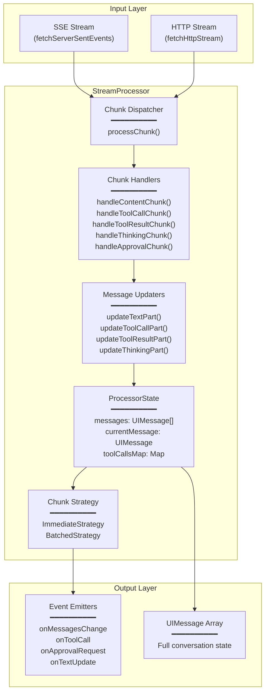
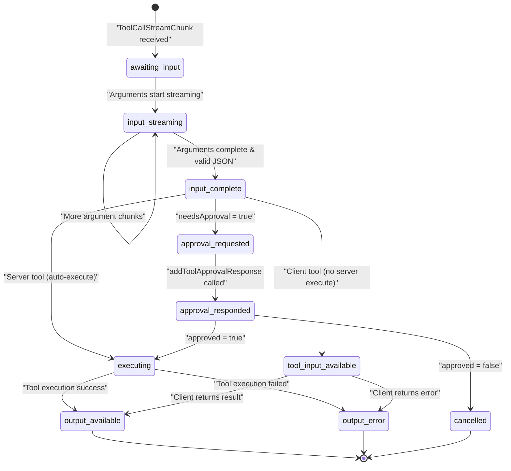
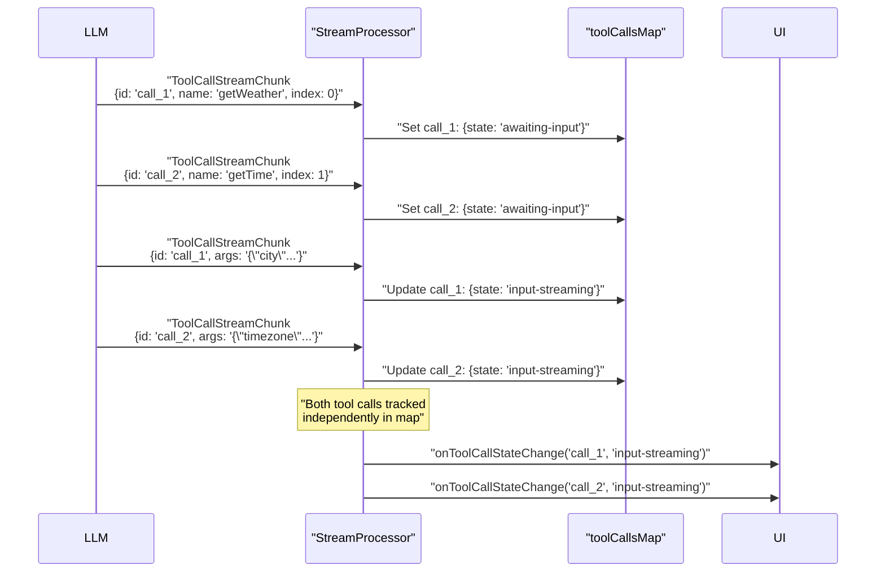
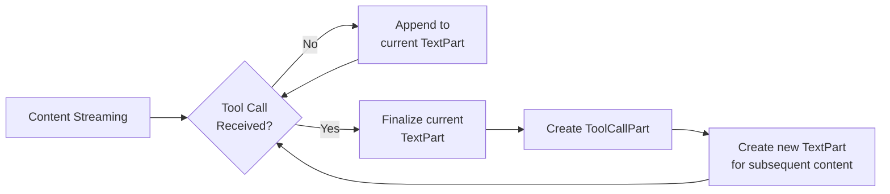
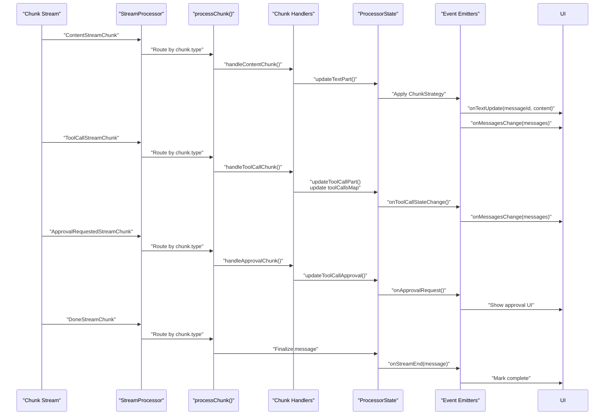
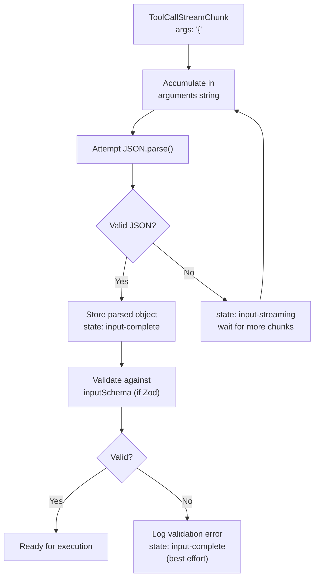

# Stream Processing

<details>
<summary>Relevant source files</summary>

The following files were used as context for generating this wiki page:

- [docs/api/ai.md](docs/api/ai.md)
- [docs/getting-started/overview.md](docs/getting-started/overview.md)
- [docs/guides/client-tools.md](docs/guides/client-tools.md)
- [docs/guides/server-tools.md](docs/guides/server-tools.md)
- [docs/guides/streaming.md](docs/guides/streaming.md)
- [docs/guides/tool-approval.md](docs/guides/tool-approval.md)
- [docs/guides/tool-architecture.md](docs/guides/tool-architecture.md)
- [docs/guides/tools.md](docs/guides/tools.md)
- [docs/protocol/chunk-definitions.md](docs/protocol/chunk-definitions.md)
- [docs/protocol/http-stream-protocol.md](docs/protocol/http-stream-protocol.md)
- [docs/protocol/sse-protocol.md](docs/protocol/sse-protocol.md)
- [examples/ts-react-chat/src/lib/model-selection.ts](examples/ts-react-chat/src/lib/model-selection.ts)
- [examples/ts-react-chat/src/routes/api.tanchat.ts](examples/ts-react-chat/src/routes/api.tanchat.ts)
- [packages/typescript/ai-anthropic/src/text/text-provider-options.ts](packages/typescript/ai-anthropic/src/text/text-provider-options.ts)
- [packages/typescript/ai-gemini/src/adapters/text.ts](packages/typescript/ai-gemini/src/adapters/text.ts)
- [packages/typescript/ai-gemini/src/model-meta.ts](packages/typescript/ai-gemini/src/model-meta.ts)
- [packages/typescript/ai-gemini/src/text/text-provider-options.ts](packages/typescript/ai-gemini/src/text/text-provider-options.ts)
- [packages/typescript/ai-gemini/tests/gemini-adapter.test.ts](packages/typescript/ai-gemini/tests/gemini-adapter.test.ts)
- [packages/typescript/ai-openai/live-tests/tool-test-empty-object.ts](packages/typescript/ai-openai/live-tests/tool-test-empty-object.ts)
- [packages/typescript/ai-openai/src/text/text-provider-options.ts](packages/typescript/ai-openai/src/text/text-provider-options.ts)
- [packages/typescript/ai/src/activities/chat/stream/processor.ts](packages/typescript/ai/src/activities/chat/stream/processor.ts)
- [packages/typescript/ai/src/types.ts](packages/typescript/ai/src/types.ts)

</details>

## Purpose and Scope

The StreamProcessor is the core state machine that transforms raw `StreamChunk` objects from AI providers into structured `UIMessage[]` arrays suitable for UI rendering. It maintains conversation state, tracks parallel tool call lifecycles, segments text content intelligently, and emits granular events for real-time UI updates.

This document covers the internal processing logic. For the chunk types processed by the StreamProcessor, see [StreamChunk Types](#5.1). For the transport protocols that deliver chunks, see [Server-Sent Events (SSE) Protocol](#5.3) and [HTTP Stream Protocol](#5.4).

**Sources:** [packages/typescript/ai/src/activities/chat/stream/processor.ts:1-15]()

---

## StreamProcessor Architecture

### Overview



**Title:** StreamProcessor Architecture Overview

The StreamProcessor receives chunks from connection adapters, dispatches them to specialized handlers, updates the internal state, applies chunking strategies, and emits events for UI consumption.

**Sources:** [packages/typescript/ai/src/activities/chat/stream/processor.ts:135-230](), [packages/typescript/ai/src/activities/chat/stream/types.ts:1-50]()

---

## Core State Management

### ProcessorState Structure

The StreamProcessor maintains a `ProcessorState` object that serves as the single source of truth:

```typescript
interface ProcessorState {
  // Full conversation history
  messages: Array<UIMessage>

  // Current assistant message being built
  currentMessage: UIMessage | null

  // Track all tool calls across messages
  toolCallsMap: Map<string, InternalToolCallState>

  // Accumulated content for current message
  accumulatedContent: string

  // Whether stream has started
  hasStarted: boolean

  // Error state
  error: Error | null
}
```

**Sources:** [packages/typescript/ai/src/activities/chat/stream/types.ts:55-95]()

### InternalToolCallState

Each tool call is tracked with detailed state information:

```typescript
interface InternalToolCallState {
  id: string
  name: string
  index: number
  arguments: string // JSON string (may be incomplete)
  state: ToolCallState
  parsedArgs?: any
  output?: any
  approval?: {
    id: string
    needsApproval: boolean
    approved?: boolean
  }
}
```

**Tool Call State Transitions:**

- `awaiting-input` → Tool call received, waiting for arguments
- `input-streaming` → Partial arguments being accumulated
- `input-complete` → All arguments received and parsed
- `approval-requested` → Tool requires user approval (if `needsApproval: true`)
- `approval-responded` → User has approved/denied execution

**Sources:** [packages/typescript/ai/src/types.ts:3-19](), [packages/typescript/ai/src/activities/chat/stream/types.ts:97-135]()

---

## Tool Call State Machine



**Title:** Tool Call State Machine

This state machine governs the lifecycle of each tool call from initial detection through execution completion. The processor tracks each tool call independently, enabling parallel tool execution with proper state isolation.

**Sources:** [packages/typescript/ai/src/types.ts:3-19](), [packages/typescript/ai/src/activities/chat/stream/processor.ts:400-550]()

---

## Parallel Tool Call Tracking

The StreamProcessor maintains a `Map<string, InternalToolCallState>` to track multiple tool calls simultaneously:

| Capability                 | Implementation                                 |
| -------------------------- | ---------------------------------------------- |
| **Parallel Execution**     | Each tool call has unique `id` and `index`     |
| **State Isolation**        | States tracked independently in `toolCallsMap` |
| **Argument Streaming**     | Partial JSON accumulated per tool call         |
| **Order Preservation**     | `index` field maintains call order for UI      |
| **Cross-Message Tracking** | Map persists across multiple messages          |

### Parallel Tool Call Example



**Title:** Parallel Tool Call Processing Flow

**Sources:** [packages/typescript/ai/src/activities/chat/stream/processor.ts:350-450]()

---

## Text Segmentation Strategy

When tool calls interrupt content generation, the StreamProcessor segments text into separate `TextPart` objects to maintain proper message structure:

### Segmentation Rules



**Title:** Text Segmentation Logic

### Message Parts Structure

A single `UIMessage` can contain multiple parts in sequence:

```typescript
// Example: "The weather is [TOOL CALL] sunny today"
{
  id: "msg_1",
  role: "assistant",
  parts: [
    { type: "text", content: "The weather is " },      // Part 1: before tool
    { type: "tool-call", id: "call_1", name: "getWeather", ... },  // Part 2: tool call
    { type: "text", content: " sunny today" }          // Part 3: after tool
  ]
}
```

This structure enables UIs to render content and tool calls in the correct chronological order.

**Sources:** [packages/typescript/ai/src/activities/chat/stream/message-updaters.ts:1-100](), [packages/typescript/ai/src/types.ts:246-298]()

---

## Chunk Processing Flow



**Title:** End-to-End Chunk Processing Sequence

**Sources:** [packages/typescript/ai/src/activities/chat/stream/processor.ts:300-600]()

---

## Event System

The StreamProcessor emits events through two interfaces:

### Modern Event API (Recommended)

```typescript
interface StreamProcessorEvents {
  // State events
  onMessagesChange?: (messages: Array<UIMessage>) => void

  // Lifecycle events
  onStreamStart?: () => void
  onStreamEnd?: (message: UIMessage) => void
  onError?: (error: Error) => void

  // Interaction events
  onToolCall?: (args: {
    toolCallId: string
    toolName: string
    input: any
  }) => void

  onApprovalRequest?: (args: {
    toolCallId: string
    toolName: string
    input: any
    approvalId: string
  }) => void

  // Granular events for optimization
  onTextUpdate?: (messageId: string, content: string) => void
  onToolCallStateChange?: (
    messageId: string,
    toolCallId: string,
    state: ToolCallState,
    args: string
  ) => void
  onThinkingUpdate?: (messageId: string, content: string) => void
}
```

**Sources:** [packages/typescript/ai/src/activities/chat/stream/processor.ts:46-79]()

### Event Emission Strategy

| Event                   | When Emitted                 | Use Case                                |
| ----------------------- | ---------------------------- | --------------------------------------- |
| `onMessagesChange`      | After any state mutation     | Full re-render, complete state sync     |
| `onTextUpdate`          | Per content chunk            | Character-by-character streaming effect |
| `onToolCallStateChange` | Tool call state transition   | Update individual tool UI element       |
| `onThinkingUpdate`      | Per thinking chunk           | Display model reasoning process         |
| `onApprovalRequest`     | Tool requires approval       | Show approval dialog                    |
| `onToolCall`            | Client tool ready to execute | Trigger client-side tool execution      |

**Sources:** [packages/typescript/ai/src/activities/chat/stream/processor.ts:46-131]()

---

## Chunk Strategy System

The StreamProcessor uses pluggable strategies to control event emission granularity:

### ImmediateStrategy (Default)

Emits events immediately for every chunk, providing real-time character-by-character updates:

```typescript
class ImmediateStrategy implements ChunkStrategy {
  shouldEmit(): boolean {
    return true // Emit on every chunk
  }

  onChunk(content: string): void {
    // Emit immediately
  }
}
```

**Use Case:** Real-time streaming UIs where users see text appear character-by-character.

### BatchedStrategy (Optimization)

Batches multiple chunks before emitting, reducing event frequency:

```typescript
class BatchedStrategy implements ChunkStrategy {
  private buffer: string = ''
  private batchSize: number

  shouldEmit(): boolean {
    return this.buffer.length >= this.batchSize
  }

  onChunk(content: string): void {
    this.buffer += content
    if (this.shouldEmit()) {
      // Emit batched content
      this.buffer = ''
    }
  }
}
```

**Use Case:** Performance optimization for high-throughput streams or low-power devices.

**Sources:** [packages/typescript/ai/src/activities/chat/stream/strategies.ts:1-100](), [packages/typescript/ai/src/activities/chat/stream/types.ts:30-45]()

---

## Usage Example

### Basic Setup

```typescript
import { StreamProcessor } from '@tanstack/ai/stream'
import { fetchServerSentEvents } from '@tanstack/ai-client'

// Create processor with event handlers
const processor = new StreamProcessor({
  // State update callback
  onMessagesChange: (messages) => {
    console.log('Messages updated:', messages)
    // Update UI state
  },

  // Real-time text updates
  onTextUpdate: (messageId, content) => {
    // Stream character-by-character
  },

  // Tool execution
  onToolCall: async ({ toolCallId, toolName, input }) => {
    // Execute client tool
    const result = await executeClientTool(toolName, input)
    processor.addToolResult(toolCallId, result)
  },

  // Approval flow
  onApprovalRequest: ({ approvalId, toolName, input }) => {
    // Show approval UI
    showApprovalDialog(approvalId, toolName, input)
  },

  // Error handling
  onError: (error) => {
    console.error('Stream error:', error)
  },
})

// Process incoming chunks
const connection = fetchServerSentEvents('/api/chat')
const chunks = await connection(messages, {})

for await (const chunk of chunks) {
  await processor.processChunk(chunk)
}
```

**Sources:** [packages/typescript/ai/src/activities/chat/stream/processor.ts:230-280]()

### Framework Integration Example (React)

The `useChat` hook uses StreamProcessor internally:

```typescript
// Inside @tanstack/ai-react
function useChat(options) {
  const [messages, setMessages] = useState<UIMessage[]>([])

  const processor = useMemo(
    () =>
      new StreamProcessor({
        onMessagesChange: setMessages,
        onToolCall: options.clientTools?.execute,
        onApprovalRequest: (args) => {
          // Store pending approval
        },
      }),
    []
  )

  const sendMessage = async (content: string) => {
    const chunks = await options.connection(messages, {})
    for await (const chunk of chunks) {
      await processor.processChunk(chunk)
    }
  }

  return { messages, sendMessage }
}
```

**Sources:** [packages/typescript/ai-client/src/index.ts:1-50]()

---

## JSON Parsing and Validation

The StreamProcessor handles incomplete JSON arguments during streaming:

### Incremental JSON Parsing



**Title:** Incremental JSON Parsing Flow

The processor uses `defaultJSONParser` to attempt parsing on each chunk. If parsing fails, it continues accumulating until valid JSON is formed.

**Sources:** [packages/typescript/ai/src/activities/chat/stream/json-parser.ts:1-50](), [packages/typescript/ai/src/activities/chat/stream/processor.ts:400-450]()

---

## Message Conversion

The StreamProcessor maintains `UIMessage[]` for the UI but can convert back to `ModelMessage[]` for subsequent API calls:

### uiMessageToModelMessages()

```typescript
// Convert UI format to model format
const modelMessages = uiMessageToModelMessages(uiMessages)

// UIMessage with parts → ModelMessage with content
// - TextPart → content string
// - ToolCallPart → toolCalls array
// - ToolResultPart → role: 'tool' message
// - ThinkingPart → excluded (UI-only)
```

**Conversion Rules:**

| UIMessage Part Type | ModelMessage Representation          |
| ------------------- | ------------------------------------ |
| `TextPart`          | Concatenated into `content` string   |
| `ToolCallPart`      | Added to `toolCalls` array           |
| `ToolResultPart`    | Separate message with `role: 'tool'` |
| `ThinkingPart`      | **Excluded** (not sent to model)     |

**Sources:** [packages/typescript/ai/src/activities/chat/messages.ts:1-100]()

---

## Recording and Replay

The StreamProcessor supports recording chunks for testing and debugging:

```typescript
interface ChunkRecording {
  chunks: Array<StreamChunk>
  timestamp: number
  metadata?: Record<string, any>
}

// Record mode
const recording: ChunkRecording = {
  chunks: [],
  timestamp: Date.now(),
}

processor.on('chunk', (chunk) => {
  recording.chunks.push(chunk)
})

// Replay mode
async function* replayChunks(recording: ChunkRecording) {
  for (const chunk of recording.chunks) {
    yield chunk
    await delay(10) // Simulate streaming delay
  }
}
```

**Use Cases:**

- Unit testing complex tool call flows
- Debugging approval workflows
- Performance profiling
- Regression testing

**Sources:** [packages/typescript/ai/src/activities/chat/stream/types.ts:140-160]()

---

## Summary

The StreamProcessor is the central state machine for TanStack AI's streaming architecture:

**Core Responsibilities:**

1. **State Management** - Single source of truth for `UIMessage[]`
2. **Tool Call Tracking** - Parallel execution with independent state machines
3. **Text Segmentation** - Intelligent content splitting around tool calls
4. **Event Emission** - Granular callbacks for real-time UI updates
5. **JSON Parsing** - Incremental parsing of streaming tool arguments
6. **Strategy System** - Pluggable chunk emission strategies

**Key Design Principles:**

- **Immutable Updates** - State transitions create new message objects
- **Event-Driven** - UI reacts to state changes via callbacks
- **Type-Safe** - Full TypeScript inference from tool schemas
- **Testable** - Recording/replay support for deterministic testing

For information about the chunk types processed, see [StreamChunk Types](#5.1). For server-side streaming setup, see [Server-Sent Events Protocol](#5.3) and [HTTP Stream Protocol](#5.4).

**Sources:** [packages/typescript/ai/src/activities/chat/stream/processor.ts:1-1000](), [packages/typescript/ai/src/types.ts:1-300]()
