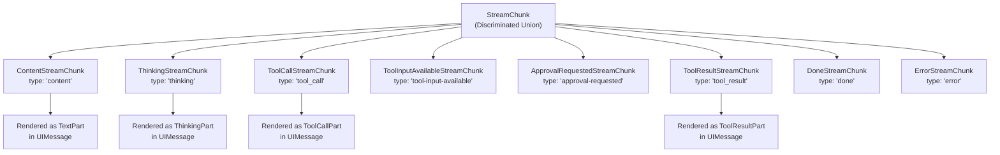
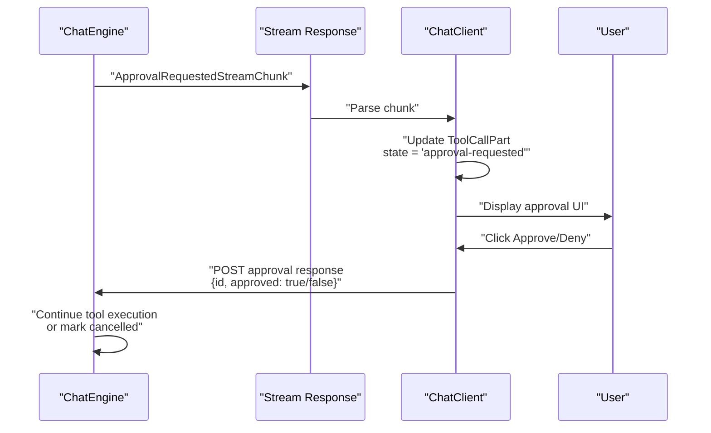
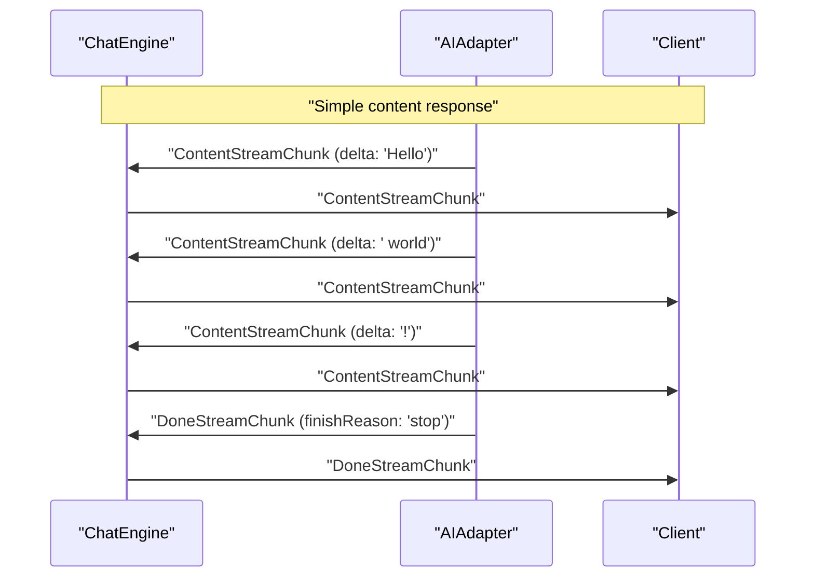
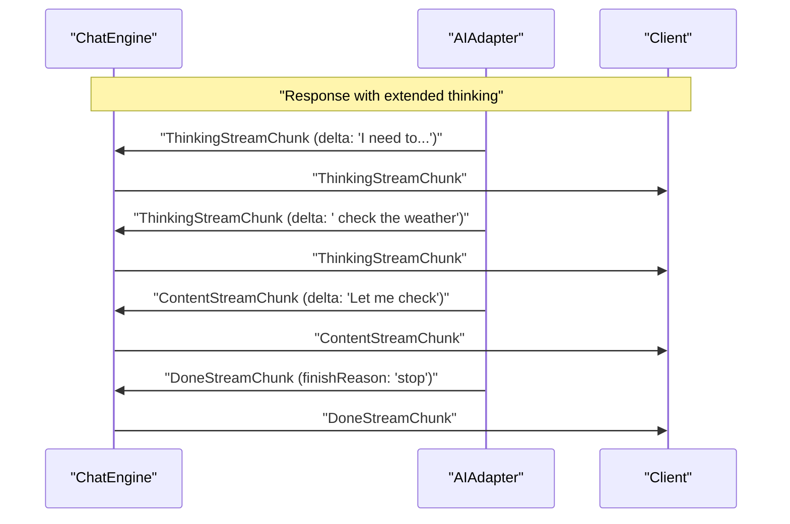
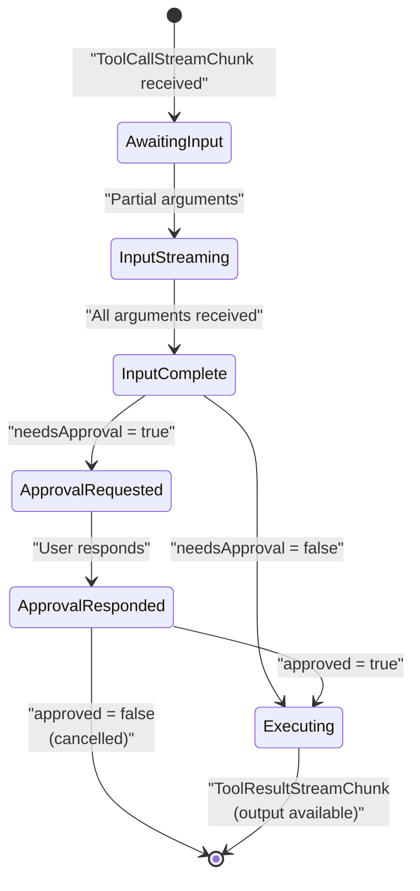

# StreamChunk Types

<details>
<summary>Relevant source files</summary>

The following files were used as context for generating this wiki page:

- [docs/api/ai.md](docs/api/ai.md)
- [docs/getting-started/overview.md](docs/getting-started/overview.md)
- [docs/guides/client-tools.md](docs/guides/client-tools.md)
- [docs/guides/server-tools.md](docs/guides/server-tools.md)
- [docs/guides/streaming.md](docs/guides/streaming.md)
- [docs/guides/tool-approval.md](docs/guides/tool-approval.md)
- [docs/guides/tool-architecture.md](docs/guides/tool-architecture.md)
- [docs/guides/tools.md](docs/guides/tools.md)
- [docs/protocol/chunk-definitions.md](docs/protocol/chunk-definitions.md)
- [docs/protocol/http-stream-protocol.md](docs/protocol/http-stream-protocol.md)
- [docs/protocol/sse-protocol.md](docs/protocol/sse-protocol.md)
- [packages/typescript/ai-anthropic/src/text/text-provider-options.ts](packages/typescript/ai-anthropic/src/text/text-provider-options.ts)
- [packages/typescript/ai-openai/src/text/text-provider-options.ts](packages/typescript/ai-openai/src/text/text-provider-options.ts)
- [packages/typescript/ai/src/types.ts](packages/typescript/ai/src/types.ts)

</details>

This document provides a comprehensive reference for all `StreamChunk` types in TanStack AI. These types define the structure of data transmitted during streaming chat operations, enabling real-time updates for content generation, tool execution, thinking processes, and completion signals.

For information about how chunks are transmitted over the wire, see [Server-Sent Events (SSE) Protocol](#5.1) and [HTTP Stream Protocol](#5.2). For information about how chunks are processed on the client, see [Stream Processing and Chunk Strategies](#4.3).

## Overview

All streaming responses from the `chat()` function consist of a sequence of `StreamChunk` objects. Each chunk represents a discrete event during the conversation lifecycle, such as:

- Incremental text content generation
- Tool calls with streaming arguments
- Tool execution results
- Model reasoning/thinking processes
- Stream completion and error signals

Sources: [docs/protocol/chunk-definitions.md:1-10](), [packages/typescript/ai/src/core/chat.ts:1-20]()

---

## Base Structure

All chunk types share a common base structure defined by `BaseStreamChunk`:

```typescript
interface BaseStreamChunk {
  type: StreamChunkType
  id: string // Unique identifier for the message/response
  model: string // Model identifier (e.g., "gpt-4o", "claude-3-5-sonnet")
  timestamp: number // Unix timestamp in milliseconds
}
```

**Field Descriptions:**

| Field       | Type              | Description                                                    |
| ----------- | ----------------- | -------------------------------------------------------------- |
| `type`      | `StreamChunkType` | Discriminant field for the union type                          |
| `id`        | `string`          | Response identifier, consistent across chunks in same response |
| `model`     | `string`          | AI model that generated this chunk                             |
| `timestamp` | `number`          | When the chunk was created (milliseconds since epoch)          |

Sources: [docs/protocol/chunk-definitions.md:11-23](), [packages/typescript/ai/src/types.ts:159-169]()

---

## Chunk Type Discriminant

The `type` field is a string literal that enables TypeScript's discriminated union type narrowing:

```typescript
type StreamChunkType =
  | 'content' // Text content being generated
  | 'thinking' // Model's reasoning process (when supported)
  | 'tool_call' // Model calling a tool/function
  | 'tool-input-available' // Tool inputs ready for client execution
  | 'approval-requested' // Tool requires user approval
  | 'tool_result' // Result from tool execution
  | 'done' // Stream completion
  | 'error' // Error occurred
```



**Diagram: StreamChunk Type Hierarchy and UI Representation**

Sources: [docs/protocol/chunk-definitions.md:24-36](), [packages/typescript/ai-client/src/types.ts:32-121]()

---

## Chunk Type Reference

### ContentStreamChunk

Emitted when the AI model generates text content. Content is streamed incrementally as tokens are produced.

```typescript
interface ContentStreamChunk extends BaseStreamChunk {
  type: 'content'
  delta: string // The incremental content token (new text since last chunk)
  content: string // Full accumulated content so far
  role?: 'assistant'
}
```

**Example:**

```json
{
  "type": "content",
  "id": "chatcmpl-abc123",
  "model": "gpt-4o",
  "timestamp": 1701234567890,
  "delta": "Hello",
  "content": "Hello",
  "role": "assistant"
}
```

**Usage Notes:**

- Multiple `ContentStreamChunk` objects are sent for a single response
- `delta` contains only the new text since the last chunk
- `content` contains the complete accumulated text up to this point
- Display `delta` for smooth streaming effects
- Use `content` for the current complete message text

**Processing Location:** [packages/typescript/ai/src/core/chat.ts:241-250]()

Sources: [docs/protocol/chunk-definitions.md:40-70](), [packages/typescript/ai/src/core/chat.ts:217-239]()

---

### ThinkingStreamChunk

Emitted when the model exposes its internal reasoning process. Supported by models with extended thinking capabilities (e.g., Claude with thinking enabled, o1 models).

```typescript
interface ThinkingStreamChunk extends BaseStreamChunk {
  type: 'thinking'
  delta?: string // The incremental thinking token
  content: string // Full accumulated thinking content so far
}
```

**Example:**

```json
{
  "type": "thinking",
  "id": "chatcmpl-abc123",
  "model": "claude-3-5-sonnet",
  "timestamp": 1701234567890,
  "delta": "First, I need to",
  "content": "First, I need to"
}
```

**Usage Notes:**

- Rendered separately from final response text in UI
- Thinking content is excluded from messages sent back to the model
- Typically displayed in collapsible sections or separate UI areas
- Not all models support thinking chunks
- Thinking parts auto-collapse in UI when a text response follows

**Processing Location:** [packages/typescript/ai/src/core/chat.ts:344-354]()

**UI Rendering:** [packages/typescript/ai-react-ui/src/chat-message.tsx:168-183]()

Sources: [docs/protocol/chunk-definitions.md:72-101](), [docs/guides/streaming.md:77-91](), [docs/adapters/anthropic.md:133-154]()

---

### ToolCallStreamChunk

Emitted when the model decides to invoke a tool or function.

```typescript
interface ToolCallStreamChunk extends BaseStreamChunk {
  type: 'tool_call'
  toolCall: {
    id: string
    type: 'function'
    function: {
      name: string
      arguments: string // JSON string (may be partial/incremental)
    }
  }
  index: number // Index of this tool call (for parallel calls)
}
```

**Example:**

```json
{
  "type": "tool_call",
  "id": "chatcmpl-abc123",
  "model": "gpt-4o",
  "timestamp": 1701234567890,
  "toolCall": {
    "id": "call_abc123",
    "type": "function",
    "function": {
      "name": "get_weather",
      "arguments": "{\"location\":\"San Francisco\"}"
    }
  },
  "index": 0
}
```

**Field Details:**

| Field                         | Type     | Description                                                 |
| ----------------------------- | -------- | ----------------------------------------------------------- |
| `toolCall.id`                 | `string` | Unique identifier for this specific tool call               |
| `toolCall.function.name`      | `string` | Name of the tool to execute                                 |
| `toolCall.function.arguments` | `string` | JSON-encoded arguments (may be incomplete during streaming) |
| `index`                       | `number` | Position in array of parallel tool calls                    |

**Usage Notes:**

- Multiple chunks may be sent for a single tool call (streaming arguments)
- `arguments` field may be incomplete JSON until all chunks received
- `index` enables multiple parallel tool calls in one response
- Arguments are accumulated across chunks by the `ToolCallManager`

**Processing Location:** [packages/typescript/ai/src/core/chat.ts:252-265]()

Sources: [docs/protocol/chunk-definitions.md:103-146](), [packages/typescript/ai/src/tools/tool-calls.ts]()

---

### ToolInputAvailableStreamChunk

Emitted when tool arguments are complete and ready for client-side execution. Only sent for tools without a server-side `execute` implementation.

```typescript
interface ToolInputAvailableStreamChunk extends BaseStreamChunk {
  type: 'tool-input-available'
  toolCallId: string // ID of the tool call
  toolName: string // Name of the tool to execute
  input: any // Parsed tool arguments (JSON object)
}
```

**Example:**

```json
{
  "type": "tool-input-available",
  "id": "chatcmpl-abc123",
  "model": "gpt-4o",
  "timestamp": 1701234567890,
  "toolCallId": "call_abc123",
  "toolName": "get_weather",
  "input": {
    "location": "San Francisco",
    "unit": "fahrenheit"
  }
}
```

**Usage Notes:**

- Signals client should execute the tool with provided inputs
- Only sent for tools defined without `.server()` implementation
- `input` is pre-parsed and validated against tool's `inputSchema`
- Client calls registered tool handler with these parameters
- After execution, client sends result back to server via POST

**Emission Location:** [packages/typescript/ai/src/core/chat.ts:578-606]()

Sources: [docs/protocol/chunk-definitions.md:148-183](), [packages/typescript/ai/src/core/chat.ts:356-418]()

---

### ApprovalRequestedStreamChunk

Emitted when a tool requires user approval before execution. Occurs for tools with `needsApproval: true`.

```typescript
interface ApprovalRequestedStreamChunk extends BaseStreamChunk {
  type: 'approval-requested'
  toolCallId: string // ID of the tool call
  toolName: string // Name of the tool requiring approval
  input: any // Tool arguments for user review
  approval: {
    id: string // Unique approval request ID
    needsApproval: true // Always true
  }
}
```

**Example:**

```json
{
  "type": "approval-requested",
  "id": "chatcmpl-abc123",
  "model": "gpt-4o",
  "timestamp": 1701234567890,
  "toolCallId": "call_abc123",
  "toolName": "send_email",
  "input": {
    "to": "user@example.com",
    "subject": "Hello",
    "body": "Test email"
  },
  "approval": {
    "id": "approval_xyz789",
    "needsApproval": true
  }
}
```

**Approval Flow:**



**Diagram: Approval Request Flow**

**Usage Notes:**

- Stream pauses until approval is provided
- Display approval UI with tool details for user review
- User responds via `addToolApprovalResponse()` method
- Tool execution continues after approval or is cancelled on denial

**Emission Location:** [packages/typescript/ai/src/core/chat.ts:543-576]()

Sources: [docs/protocol/chunk-definitions.md:185-228](), [docs/guides/tool-architecture.md:201-279]()

---

### ToolResultStreamChunk

Emitted when a tool execution completes, either on server or client side.

```typescript
interface ToolResultStreamChunk extends BaseStreamChunk {
  type: 'tool_result'
  toolCallId: string // ID of the tool call that was executed
  content: string // Result of the tool execution (JSON stringified)
}
```

**Example:**

```json
{
  "type": "tool_result",
  "id": "chatcmpl-abc123",
  "model": "gpt-4o",
  "timestamp": 1701234567891,
  "toolCallId": "call_abc123",
  "content": "{\"temperature\":72,\"conditions\":\"sunny\"}"
}
```

**Usage Notes:**

- Sent after tool execution completes successfully
- `content` is the JSON-stringified result from tool's `execute` function
- Model receives this result to continue the conversation
- May trigger additional model responses incorporating the tool result
- Automatically added to conversation as a `tool` role message

**Processing Location:** [packages/typescript/ai/src/core/chat.ts:267-277]()

**Emission Location:** [packages/typescript/ai/src/core/chat.ts:608-649]()

Sources: [docs/protocol/chunk-definitions.md:230-258](), [packages/typescript/ai/src/core/chat.ts:608-649]()

---

### DoneStreamChunk

Emitted when the stream completes successfully. Marks the end of a response iteration.

```typescript
interface DoneStreamChunk extends BaseStreamChunk {
  type: 'done'
  finishReason: 'stop' | 'length' | 'content_filter' | 'tool_calls' | null
  usage?: {
    promptTokens: number
    completionTokens: number
    totalTokens: number
  }
}
```

**Example:**

```json
{
  "type": "done",
  "id": "chatcmpl-abc123",
  "model": "gpt-4o",
  "timestamp": 1701234567892,
  "finishReason": "stop",
  "usage": {
    "promptTokens": 150,
    "completionTokens": 75,
    "totalTokens": 225
  }
}
```

**Finish Reasons:**

| Reason           | Description                        |
| ---------------- | ---------------------------------- |
| `stop`           | Natural completion of the response |
| `length`         | Reached maximum token limit        |
| `content_filter` | Stopped by content filtering       |
| `tool_calls`     | Stopped to execute tool calls      |
| `null`           | Unknown or not provided by model   |

**Usage Notes:**

- Marks end of successful stream
- Clean up streaming state on receipt
- Display token usage if available
- If `finishReason` is `tool_calls`, agent loop may continue with another iteration
- Stream may send multiple `done` chunks during tool execution loops

**Processing Location:** [packages/typescript/ai/src/core/chat.ts:279-329]()

Sources: [docs/protocol/chunk-definitions.md:260-304](), [packages/typescript/ai/src/core/chat.ts:279-329]()

---

### ErrorStreamChunk

Emitted when an error occurs during streaming. Terminates the stream.

```typescript
interface ErrorStreamChunk extends BaseStreamChunk {
  type: 'error'
  error: {
    message: string // Human-readable error message
    code?: string // Optional error code
  }
}
```

**Example:**

```json
{
  "type": "error",
  "id": "chatcmpl-abc123",
  "model": "gpt-4o",
  "timestamp": 1701234567893,
  "error": {
    "message": "Rate limit exceeded",
    "code": "rate_limit_exceeded"
  }
}
```

**Common Error Codes:**

| Code                   | Description           |
| ---------------------- | --------------------- |
| `rate_limit_exceeded`  | API rate limit hit    |
| `invalid_request`      | Malformed request     |
| `authentication_error` | API key issues        |
| `timeout`              | Request timed out     |
| `server_error`         | Internal server error |

**Usage Notes:**

- Stream ends immediately after error chunk
- Display error message to user
- Implement retry logic client-side with exponential backoff
- Error triggers early termination flag in `ChatEngine`

**Processing Location:** [packages/typescript/ai/src/core/chat.ts:331-342]()

Sources: [docs/protocol/chunk-definitions.md:306-346](), [packages/typescript/ai/src/core/chat.ts:331-342]()

---

## TypeScript Union Type

All chunk types are combined into a discriminated union:

```typescript
type StreamChunk =
  | ContentStreamChunk
  | ThinkingStreamChunk
  | ToolCallStreamChunk
  | ToolInputAvailableStreamChunk
  | ApprovalRequestedStreamChunk
  | ToolResultStreamChunk
  | DoneStreamChunk
  | ErrorStreamChunk
```

This enables type-safe handling with TypeScript's type narrowing:

```typescript
function handleChunk(chunk: StreamChunk) {
  switch (chunk.type) {
    case 'content':
      console.log(chunk.delta) // TypeScript knows: ContentStreamChunk
      break
    case 'thinking':
      console.log(chunk.content) // TypeScript knows: ThinkingStreamChunk
      break
    case 'tool_call':
      console.log(chunk.toolCall.function.name) // TypeScript knows structure
      break
    case 'tool-input-available':
      executeClientTool(chunk.toolName, chunk.input)
      break
    case 'approval-requested':
      showApprovalUI(chunk)
      break
    case 'tool_result':
      displayToolResult(chunk)
      break
    case 'done':
      cleanupStreaming(chunk.finishReason)
      break
    case 'error':
      handleError(chunk.error)
      break
  }
}
```

Sources: [docs/protocol/chunk-definitions.md:404-437](), [packages/typescript/ai/src/types.ts]()

---

## Chunk Processing Pipeline

The following diagram illustrates how chunks flow from the AI adapter through the system to the UI:

```mermaid
graph LR
    Adapter["AIAdapter<br/>chatStream()"]
    Engine["ChatEngine<br/>handleStreamChunk()"]
    Protocol["toStreamResponse()/<br/>toServerSentEventsStream()"]
    Transport["SSE or HTTP Stream"]
    Connection["ConnectionAdapter<br/>fetchServerSentEvents()"]
    Client["ChatClient<br/>processChunk()"]
    Processor["StreamProcessor<br/>ChunkStrategy"]
    State["UIMessage<br/>parts: MessagePart[]"]
    UI["React/Solid UI<br/>useChat hook"]

    Adapter -->|"StreamChunk"| Engine
    Engine -->|"Event emission<br/>aiEventClient.emit()"| Engine
    Engine -->|"StreamChunk"| Protocol
    Protocol -->|"data: {...}\
\
"| Transport
    Transport -->|"HTTP/SSE"| Connection
    Connection -->|"Parse<br/>StreamChunk"| Client
    Client -->|"Process"| Processor
    Processor -->|"Update"| State
    State -->|"Reactive<br/>updates"| UI
```



**Diagram: StreamChunk Processing Pipeline**

**Processing Steps:**

1. **Adapter Layer** - AI provider streams raw responses, adapter normalizes to `StreamChunk` format
2. **ChatEngine** - Receives chunks, emits events to devtools, handles tool execution logic
3. **Protocol Conversion** - Converts async iterable to SSE/HTTP format
4. **Transport** - Sends over network as Server-Sent Events or newline-delimited JSON
5. **Connection Adapter** - Parses wire format back to `StreamChunk` objects
6. **ChatClient** - Routes chunks to appropriate handlers
7. **StreamProcessor** - Applies buffering strategy (immediate, batch, punctuation, word boundary)
8. **State Update** - Converts chunks to `MessagePart` objects in `UIMessage`
9. **Framework Layer** - Triggers reactive UI updates

Sources: [packages/typescript/ai/src/core/chat.ts:187-214](), [packages/typescript/ai-client/src/chat-client.ts](), [docs/guides/streaming.md:9-26]()

---

## Chunk Ordering and Relationships

### Typical Content Generation Flow



**Diagram: Simple Content Streaming Sequence**

### Response with Thinking



**Diagram: Thinking + Content Sequence**

### Tool Execution Flow

```
1. ToolCallStreamChunk (name: "get_weather", arguments: "{\"location\":\"SF\"}")
2. DoneStreamChunk (finishReason: "tool_calls")
3. [Tool executes on server]
4. ToolResultStreamChunk (content: "{\"temperature\":72}")
5. [Agent loop continues]
6. ContentStreamChunk (delta: "The weather in SF...")
7. DoneStreamChunk (finishReason: "stop")
```

### Client Tool with Approval

```
1. ToolCallStreamChunk (name: "send_email")
2. DoneStreamChunk (finishReason: "tool_calls")
3. ApprovalRequestedStreamChunk (toolName: "send_email")
4. [User reviews and approves]
5. ToolInputAvailableStreamChunk (toolName: "send_email", input: {...})
6. [Client executes tool]
7. [Client POSTs result back to server]
8. ToolResultStreamChunk (content: "{\"sent\":true}")
9. ContentStreamChunk (delta: "Email sent successfully")
10. DoneStreamChunk (finishReason: "stop")
```

### Parallel Tool Calls

When the model calls multiple tools simultaneously:

```
1. ToolCallStreamChunk (index: 0, name: "get_weather")
2. ToolCallStreamChunk (index: 1, name: "get_time")
3. DoneStreamChunk (finishReason: "tool_calls")
4. [Both tools execute in parallel]
5. ToolResultStreamChunk (toolCallId: "call_1")
6. ToolResultStreamChunk (toolCallId: "call_2")
7. ContentStreamChunk (delta: "Based on the data...")
8. DoneStreamChunk (finishReason: "stop")
```

Sources: [docs/protocol/chunk-definitions.md:348-401](), [docs/guides/tool-architecture.md:21-110]()

---

## Wire Format Examples

### SSE Format

Over Server-Sent Events, chunks are prefixed with `data:` and terminated with double newlines:

```
data: {"type":"content","id":"msg_1","model":"gpt-4o","timestamp":1701234567890,"delta":"Hello","content":"Hello"}\
\

data: {"type":"content","id":"msg_1","model":"gpt-4o","timestamp":1701234567891,"delta":" world","content":"Hello world"}\
\

data: {"type":"done","id":"msg_1","model":"gpt-4o","timestamp":1701234567892,"finishReason":"stop"}\
\

data: [DONE]\
\

```

### HTTP Stream Format

Over HTTP streaming (NDJSON), each chunk is a single line:

```json
{"type":"content","id":"msg_1","model":"gpt-4o","timestamp":1701234567890,"delta":"Hello","content":"Hello"}
{"type":"content","id":"msg_1","model":"gpt-4o","timestamp":1701234567891,"delta":" world","content":"Hello world"}
{"type":"done","id":"msg_1","model":"gpt-4o","timestamp":1701234567892,"finishReason":"stop"}
```

Sources: [docs/protocol/sse-protocol.md:57-91](), [docs/protocol/http-stream-protocol.md:66-103]()

---

## Chunk to MessagePart Conversion

The `ChatClient` converts stream chunks into `MessagePart` objects for UI rendering:

| StreamChunk Type        | MessagePart Type | Notes                                          |
| ----------------------- | ---------------- | ---------------------------------------------- |
| `ContentStreamChunk`    | `TextPart`       | Accumulated in `part.content`                  |
| `ThinkingStreamChunk`   | `ThinkingPart`   | Stored separately, not sent back to model      |
| `ToolCallStreamChunk`   | `ToolCallPart`   | Includes state, input, approval, output fields |
| `ToolResultStreamChunk` | `ToolResultPart` | Links to tool call via `toolCallId`            |
| `DoneStreamChunk`       | N/A              | Triggers state updates, not stored as part     |
| `ErrorStreamChunk`      | N/A              | Sets error state, terminates stream            |

**State Transitions for ToolCallPart:**



**Diagram: ToolCallPart State Lifecycle**

Sources: [packages/typescript/ai-client/src/types.ts:12-121](), [packages/typescript/ai-react-ui/src/chat-message.tsx:1-267]()

---

## See Also

- [Server-Sent Events (SSE) Protocol](#5.1) - How chunks are transmitted via SSE
- [HTTP Stream Protocol](#5.2) - How chunks are transmitted via HTTP streaming
- [Stream Processing and Chunk Strategies](#4.3) - How chunks are buffered and processed client-side
- [Tool System](#3.2) - How tool-related chunks enable tool execution
- [ChatEngine](#3.1) - How the server generates and processes chunks
