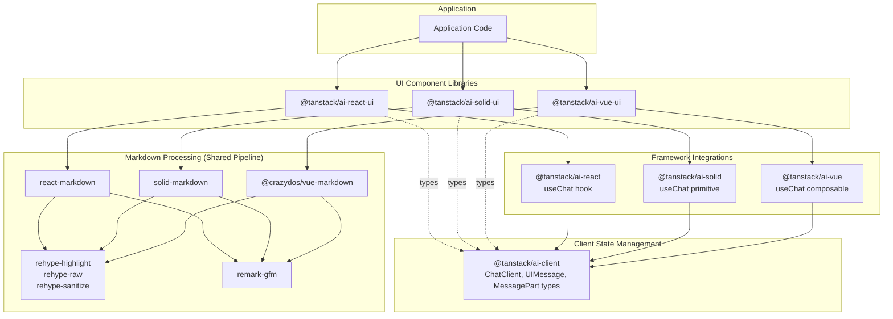
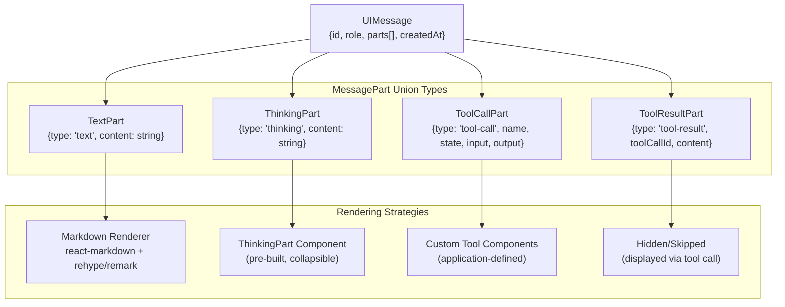
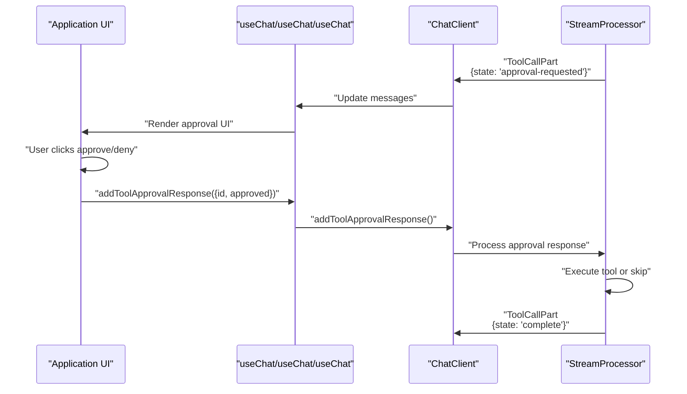
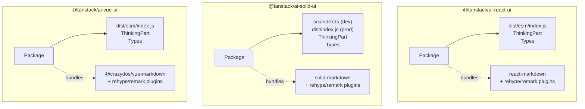
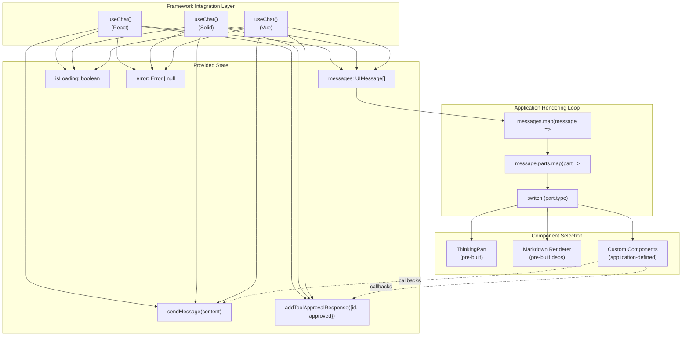

# UI Component Libraries

<details>
<summary>Relevant source files</summary>

The following files were used as context for generating this wiki page:

- [README.md](README.md)
- [packages/typescript/ai-anthropic/package.json](packages/typescript/ai-anthropic/package.json)
- [packages/typescript/ai-client/README.md](packages/typescript/ai-client/README.md)
- [packages/typescript/ai-devtools/README.md](packages/typescript/ai-devtools/README.md)
- [packages/typescript/ai-gemini/README.md](packages/typescript/ai-gemini/README.md)
- [packages/typescript/ai-gemini/package.json](packages/typescript/ai-gemini/package.json)
- [packages/typescript/ai-ollama/README.md](packages/typescript/ai-ollama/README.md)
- [packages/typescript/ai-ollama/package.json](packages/typescript/ai-ollama/package.json)
- [packages/typescript/ai-openai/README.md](packages/typescript/ai-openai/README.md)
- [packages/typescript/ai-openai/package.json](packages/typescript/ai-openai/package.json)
- [packages/typescript/ai-react-ui/README.md](packages/typescript/ai-react-ui/README.md)
- [packages/typescript/ai-react-ui/package.json](packages/typescript/ai-react-ui/package.json)
- [packages/typescript/ai-react/README.md](packages/typescript/ai-react/README.md)
- [packages/typescript/ai-react/package.json](packages/typescript/ai-react/package.json)
- [packages/typescript/ai-solid-ui/package.json](packages/typescript/ai-solid-ui/package.json)
- [packages/typescript/ai-solid/package.json](packages/typescript/ai-solid/package.json)
- [packages/typescript/ai-svelte/package.json](packages/typescript/ai-svelte/package.json)
- [packages/typescript/ai-vue-ui/package.json](packages/typescript/ai-vue-ui/package.json)
- [packages/typescript/ai-vue/package.json](packages/typescript/ai-vue/package.json)
- [packages/typescript/ai/README.md](packages/typescript/ai/README.md)
- [packages/typescript/react-ai-devtools/README.md](packages/typescript/react-ai-devtools/README.md)
- [packages/typescript/solid-ai-devtools/README.md](packages/typescript/solid-ai-devtools/README.md)

</details>

This document provides an overview of the headless UI component packages that render chat interfaces. TanStack AI provides three framework-specific UI libraries: `@tanstack/ai-react-ui`, `@tanstack/ai-solid-ui`, and `@tanstack/ai-vue-ui`. These packages provide pre-built components for rendering message parts, processing markdown with syntax highlighting, and handling specialized content like thinking indicators. All three packages share a common markdown processing pipeline based on rehype and remark plugins.

For framework-specific component details, see [React UI Components](#7.1), [Solid UI Components](#7.2), and [Vue UI Components](#7.3). For the shared markdown processing architecture, see [Markdown Processing Pipeline](#7.4). For framework integration hooks and state management, see [Framework Integrations](#6).

## Overview

TanStack AI provides three UI component packages that sit atop the framework integration layer:

| Package                 | Framework | Markdown Renderer        | Rehype/Remark Plugins                                             |
| ----------------------- | --------- | ------------------------ | ----------------------------------------------------------------- |
| `@tanstack/ai-react-ui` | React     | `react-markdown`         | `rehype-highlight`, `rehype-raw`, `rehype-sanitize`, `remark-gfm` |
| `@tanstack/ai-solid-ui` | SolidJS   | `solid-markdown`         | `rehype-highlight`, `rehype-raw`, `rehype-sanitize`, `remark-gfm` |
| `@tanstack/ai-vue-ui`   | Vue 3     | `@crazydos/vue-markdown` | `rehype-highlight`, `rehype-raw`, `rehype-sanitize`, `remark-gfm` |

All three packages follow the "headless" component pattern, providing minimal default styling and focusing on rendering logic rather than visual design. Applications style components using their own CSS frameworks (Tailwind, CSS Modules, styled-components, etc.).

**Sources:** [packages/typescript/ai-react-ui/package.json:1-58](), [packages/typescript/ai-solid-ui/package.json:1-61](), [packages/typescript/ai-vue-ui/package.json:1-58]()

## Architecture and Dependencies

**UI Component Package Architecture**



**Sources:** [packages/typescript/ai-react-ui/package.json:37-49](), [packages/typescript/ai-solid-ui/package.json:39-52](), [packages/typescript/ai-vue-ui/package.json:37-48]()

Each UI component package depends on:

- **Framework integration package** (`@tanstack/ai-react`, `@tanstack/ai-solid`, or `@tanstack/ai-vue`) - provides the `useChat` hook/primitive/composable for accessing chat state
- **Client package** (`@tanstack/ai-client`) - provides type definitions for `UIMessage` and `MessagePart` types
- **Framework-specific markdown renderer** (`react-markdown`, `solid-markdown`, or `@crazydos/vue-markdown`) - renders formatted text content
- **Shared rehype/remark plugins** - all three packages use the same markdown processing pipeline for syntax highlighting, sanitization, and GitHub Flavored Markdown support

## Headless Component Philosophy

The UI component libraries follow a "headless" design philosophy, which means:

1. **Minimal styling** - Components provide no default visual styles, only structure and behavior
2. **Styling flexibility** - Applications provide styling through `className` props and CSS frameworks
3. **Focused responsibility** - Components handle rendering logic (markdown processing, collapsible UI, content transformation) but not visual design
4. **Framework patterns** - Each library follows its framework's conventions (React children, Solid JSX, Vue slots)

This approach allows applications to maintain complete control over visual design while benefiting from pre-built rendering logic for complex content types.

**Sources:** [packages/typescript/ai-react-ui/package.json:4-4](), [packages/typescript/ai-solid-ui/package.json:4-4](), [packages/typescript/ai-vue-ui/package.json:4-4]()

## When to Use Pre-Built vs Custom Components

**Use Pre-Built UI Components When:**

- Rendering markdown content with syntax highlighting
- Displaying thinking/reasoning content from models like Claude or OpenAI o1
- Need standard collapsible UI for extended thinking
- Want consistent markdown processing across your application

**Build Custom Components When:**

- Rendering tool calls with specialized visualizations (charts, maps, cards)
- Implementing approval UI for tools with `needsApproval: true`
- Displaying tool results with domain-specific formatting
- Creating application-specific message container layouts

**Sources:** [testing/panel/src/routes/index.tsx:121-228](), [examples/ts-react-chat/src/routes/index.tsx:118-220]()

## MessagePart Types and Rendering Strategy

The UI components render `UIMessage` objects containing arrays of `MessagePart` objects. Each part type requires different rendering:

**MessagePart Type Routing**



**Sources:** [packages/typescript/ai-client/src/chat-client.ts:8-12](), [testing/panel/src/routes/index.tsx:121-228]()

Applications iterate through `message.parts` and route to the appropriate renderer based on discriminated union type. See framework-specific examples in [React UI Components](#7.1), [Solid UI Components](#7.2), and [Vue UI Components](#7.3).

## Shared Components and Rendering Capabilities

### ThinkingPart Component

All three UI packages export a `ThinkingPart` component for rendering extended thinking/reasoning content from models like Claude (with extended thinking) and OpenAI o1/o3 series.

**Component Interface (TypeScript):**

```typescript
interface ThinkingPartProps {
  content: string // The thinking/reasoning text
  isComplete: boolean // Whether thinking is finished
  className?: string // Optional CSS classes for styling
}
```

**Features:**

- Collapsible UI to hide verbose reasoning by default
- Visual indicator differentiating in-progress vs. complete thinking
- Framework-appropriate reactivity (React state, Solid signals, Vue refs)

**Determining isComplete:**
The `isComplete` prop is typically computed by checking if a `TextPart` follows the thinking part in the message:

```typescript
const isComplete = message.parts.slice(index + 1).some((p) => p.type === 'text')
```

See [React UI Components](#7.1), [Solid UI Components](#7.2), and [Vue UI Components](#7.3) for framework-specific usage examples.

**Sources:** [testing/panel/src/routes/index.tsx:11-11](), [testing/panel/src/routes/index.tsx:123-136](), [examples/ts-react-chat/src/routes/index.tsx:119-132]()

### Markdown Rendering Pipeline

All three UI packages provide the same markdown processing pipeline through their dependencies. Applications use the framework-specific markdown renderer with the included rehype/remark plugins:

**Pipeline Components:**

- **remark-gfm** - GitHub Flavored Markdown (tables, task lists, strikethrough)
- **rehype-highlight** - Syntax highlighting for code blocks
- **rehype-raw** - Parse raw HTML in markdown
- **rehype-sanitize** - Sanitize HTML to prevent XSS attacks

The markdown renderers (`react-markdown`, `solid-markdown`, `@crazydos/vue-markdown`) apply these plugins in a unified processing pipeline. See [Markdown Processing Pipeline](#7.4) for detailed architecture.

**Sources:** [packages/typescript/ai-react-ui/package.json:38-42](), [packages/typescript/ai-solid-ui/package.json:42-46](), [packages/typescript/ai-vue-ui/package.json:40-43]()

## Custom Component Integration Patterns

The UI component libraries are designed to work alongside custom application components. Common patterns include:

### Tool Call Approval Flow

When a tool has `needsApproval: true`, the tool call enters the `'approval-requested'` state. Applications render custom approval UI and use the `addToolApprovalResponse` method from the framework integration hook:

**Tool Approval Sequence**



**Sources:** [testing/panel/src/routes/index.tsx:160-207](), [examples/ts-react-chat/src/routes/index.tsx:156-203]()

Framework-specific approval UI implementations are shown in [React UI Components](#7.1), [Solid UI Components](#7.2), and [Vue UI Components](#7.3).

### Tool Output Custom Rendering

Applications create specialized renderers for tool outputs based on the tool name. This enables rich visualizations (cards, charts, maps) beyond simple text:

```typescript
// Example pattern: route tool outputs to custom components
if (part.type === 'tool-call' && part.output) {
  switch (part.name) {
    case 'recommendGuitar':
      return <GuitarRecommendationCard data={part.output} />
    case 'getWeather':
      return <WeatherDisplay data={part.output} />
    case 'searchProducts':
      return <ProductGrid products={part.output.items} />
    default:
      return <pre>{JSON.stringify(part.output, null, 2)}</pre>
  }
}
```

This pattern allows different tools to have completely different UI representations while sharing the same underlying `MessagePart` structure.

**Sources:** [testing/panel/src/routes/index.tsx:211-225](), [examples/ts-react-chat/src/routes/index.tsx:207-217]()

## Package Structure and Exports

All three UI component packages export:

1. **ThinkingPart** component - For rendering thinking/reasoning content
2. **TypeScript types** - Component prop interfaces and type definitions
3. **Transitive dependencies** - Markdown renderers and rehype/remark plugins

**Package Export Patterns**



**Sources:** [packages/typescript/ai-react-ui/package.json:13-18](), [packages/typescript/ai-solid-ui/package.json:13-19](), [packages/typescript/ai-vue-ui/package.json:13-18]()

### Module Resolution

| Package                 | Build Tool | Entry Point                                  | Module Type                            |
| ----------------------- | ---------- | -------------------------------------------- | -------------------------------------- |
| `@tanstack/ai-react-ui` | Vite       | `dist/esm/index.js`                          | ES modules only                        |
| `@tanstack/ai-solid-ui` | Vite       | `src/index.ts` (dev), `dist/index.js` (prod) | ES modules with Solid export condition |
| `@tanstack/ai-vue-ui`   | Vite       | `dist/esm/index.js`                          | ES modules only                        |

All packages use `"type": "module"` and provide ES module exports only. The Solid package additionally provides a `solid` export condition for optimal tree-shaking in Solid applications.

**Sources:** [packages/typescript/ai-react-ui/package.json:7-18](), [packages/typescript/ai-solid-ui/package.json:7-19](), [packages/typescript/ai-vue-ui/package.json:7-18]()

## Integration with Framework Hooks

The UI component libraries consume state from framework integration hooks. The integration pattern is consistent across all three frameworks:

**Framework Hook Integration Flow**



**Sources:** [testing/panel/src/routes/index.tsx:405-413](), [examples/ts-react-chat/src/routes/index.tsx:243-248]()

The framework hooks provide `messages` (array of `UIMessage` with typed `parts`), `addToolApprovalResponse` for approval callbacks, and other methods. Applications iterate through messages and parts, routing to appropriate components based on `part.type`.

## Styling and Customization

The UI packages follow the headless pattern and provide no default styles. Applications control visual design through:

| Approach     | Method                     | Example                               |
| ------------ | -------------------------- | ------------------------------------- |
| CSS Classes  | Pass `className` prop      | `className="p-4 bg-gray-800 rounded"` |
| CSS Modules  | Import and apply           | `className={styles.thinkingPart}`     |
| CSS-in-JS    | styled-components, emotion | `styled(ThinkingPart)`                |
| Tailwind CSS | Utility classes            | `className="p-4 border rounded-lg"`   |

**Example Customization:**

```typescript
<ThinkingPart
  content={part.content}
  isComplete={isComplete}
  className="p-4 bg-gray-800/50 border border-gray-700/50 rounded-lg"
/>
```

The TanStack AI examples use Tailwind CSS extensively, but the UI packages themselves have no styling dependencies or opinions. Applications have complete control over visual design.

**Sources:** [testing/panel/src/routes/index.tsx:129-134](), [examples/ts-react-chat/src/routes/index.tsx:125-130]()

## Common Application Patterns

While the UI component libraries provide rendering utilities, applications implement common patterns for message containers and interactions:

### Message Container

Applications typically implement containers with:

- **Role differentiation** - Visual distinction between user and assistant messages
- **Auto-scroll** - Scroll to latest message as conversation grows
- **Loading states** - Show indicators during streaming
- **Message grouping** - Group consecutive messages from same role

These patterns are implemented in application code, not the UI component libraries. See [React UI Components](#7.1), [Solid UI Components](#7.2), and [Vue UI Components](#7.3) for framework-specific examples.

**Sources:** [testing/panel/src/routes/index.tsx:71-98](), [examples/ts-react-chat/src/routes/index.tsx:68-95]()

### Input Handling

Applications implement input forms with:

- Text areas or input fields for user messages
- Submit handlers that call `sendMessage()` from framework hooks
- Loading state management to disable input during streaming
- Error display for failed requests

These patterns are shown in the framework-specific example applications documented in [Examples and Usage Patterns](#10).

**Sources:** [testing/panel/src/routes/index.tsx:405-413](), [examples/ts-react-chat/src/routes/index.tsx:243-248]()

## Relationship to Other Packages

For detailed information about specific packages and subsystems:

- React-specific components and patterns: [React UI Components](#7.1)
- Solid-specific components and patterns: [Solid UI Components](#7.2)
- Markdown processing pipeline details: [Markdown Processing Pipeline](#7.3)
- Framework integration hooks: [React Integration](#6.1), [Solid Integration](#6.2)
- Message state management: [ChatClient](#4.1)
- Message part type definitions: [Data Flow and Message Types](#2.2)
