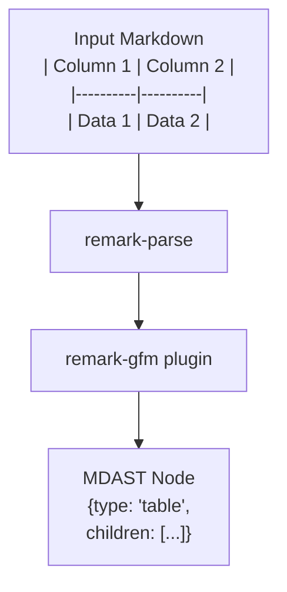
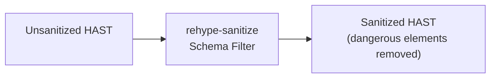
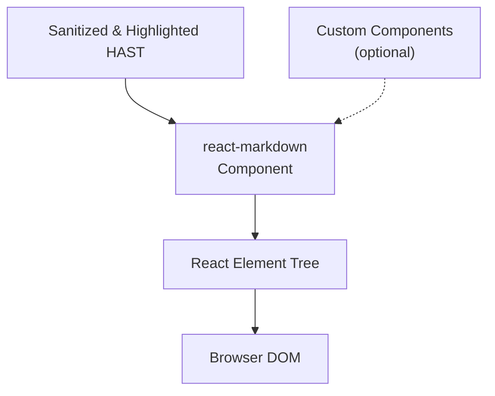
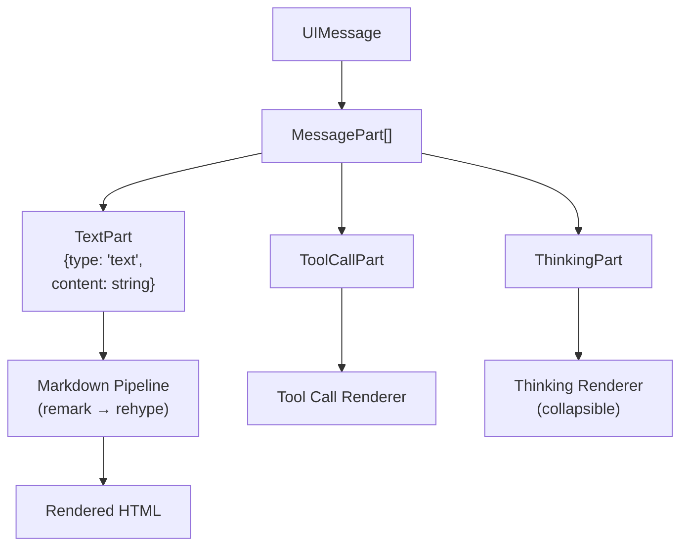
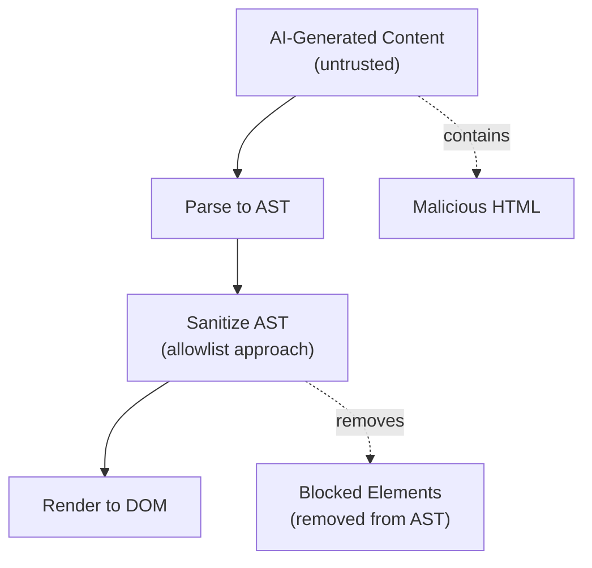

# Markdown Processing Pipeline

<details>
<summary>Relevant source files</summary>

The following files were used as context for generating this wiki page:

- [.github/workflows/autofix.yml](.github/workflows/autofix.yml)
- [.github/workflows/release.yml](.github/workflows/release.yml)
- [nx.json](nx.json)
- [package.json](package.json)
- [packages/typescript/ai-anthropic/package.json](packages/typescript/ai-anthropic/package.json)
- [packages/typescript/ai-gemini/package.json](packages/typescript/ai-gemini/package.json)
- [packages/typescript/ai-ollama/package.json](packages/typescript/ai-ollama/package.json)
- [packages/typescript/ai-openai/package.json](packages/typescript/ai-openai/package.json)
- [packages/typescript/ai-react-ui/package.json](packages/typescript/ai-react-ui/package.json)
- [packages/typescript/ai-react/package.json](packages/typescript/ai-react/package.json)
- [packages/typescript/ai-solid-ui/package.json](packages/typescript/ai-solid-ui/package.json)
- [packages/typescript/ai-solid/package.json](packages/typescript/ai-solid/package.json)
- [packages/typescript/ai-solid/tsdown.config.ts](packages/typescript/ai-solid/tsdown.config.ts)
- [packages/typescript/ai-svelte/package.json](packages/typescript/ai-svelte/package.json)
- [packages/typescript/ai-vue-ui/package.json](packages/typescript/ai-vue-ui/package.json)
- [packages/typescript/ai-vue/package.json](packages/typescript/ai-vue/package.json)
- [pnpm-lock.yaml](pnpm-lock.yaml)
- [scripts/generate-docs.ts](scripts/generate-docs.ts)

</details>

This document describes the markdown rendering pipeline used in the UI component packages (`@tanstack/ai-react-ui` and `@tanstack/ai-solid-ui`) to transform markdown text from AI responses into formatted HTML with syntax highlighting, GitHub Flavored Markdown support, and security sanitization.

For information about the UI components that use this pipeline, see [React UI Components](#7.1) and [Solid UI Components](#7.2). For the overall message rendering architecture, see [Data Flow and Message Types](#2.2).

## Overview

The markdown processing pipeline transforms raw markdown text from `TextPart` elements within `UIMessage` objects into formatted, syntax-highlighted, and sanitized HTML. Both React and Solid UI packages implement similar pipelines using the unified/remark/rehype ecosystem, with framework-specific rendering layers.

```mermaid
graph LR
    A["Raw Markdown Text<br/>(from TextPart)"]
    B["remark-parse"]
    C["remark-gfm plugin"]
    D["MDAST<br/>(Markdown AST)"]
    E["remark-rehype"]
    F["HAST<br/>(HTML AST)"]
    G["rehype-raw"]
    H["rehype-sanitize"]
    I["rehype-highlight"]
    J["Framework Renderer<br/>(react-markdown<br/>or solid-markdown)"]
    K["Rendered HTML"]

    A --> B
    B --> C
    C --> D
    D --> E
    E --> F
    F --> G
    G --> H
    H --> I
    I --> J
    J --> K
```



**Sources:** [packages/typescript/ai-react-ui/package.json:38-42](), [packages/typescript/ai-solid-ui/package.json:42-46]()

## Core Dependencies

Both UI packages share the same set of markdown processing dependencies, ensuring consistent behavior across frameworks:

| Dependency         | Version | Purpose                                                            |
| ------------------ | ------- | ------------------------------------------------------------------ |
| `remark-gfm`       | ^4.0.1  | GitHub Flavored Markdown (tables, strikethrough, task lists, etc.) |
| `rehype-highlight` | ^7.0.2  | Syntax highlighting for code blocks using `lowlight`               |
| `rehype-raw`       | ^7.0.0  | Parse raw HTML within markdown content                             |
| `rehype-sanitize`  | ^6.0.0  | Sanitize HTML to prevent XSS attacks                               |
| `react-markdown`   | ^10.1.0 | React rendering engine (React UI only)                             |
| `solid-markdown`   | ^2.1.0  | Solid rendering engine (Solid UI only)                             |

**Sources:** [packages/typescript/ai-react-ui/package.json:38-42](), [packages/typescript/ai-solid-ui/package.json:42-46]()

## Pipeline Stages

### Stage 1: Markdown Parsing with remark-gfm

The first stage parses raw markdown text into a Markdown Abstract Syntax Tree (MDAST) using the unified/remark ecosystem. The `remark-gfm` plugin extends the parser to support GitHub Flavored Markdown extensions.

**Supported GFM Features:**

- **Tables**: Column alignment, header rows
- **Strikethrough**: `~~deleted text~~`
- **Task lists**: `- [x] completed` and `- [ ] incomplete`
- **Autolinks**: Automatic URL and email detection
- **Footnotes**: `[^1]` reference style



**Sources:** [packages/typescript/ai-react-ui/package.json:42](), [packages/typescript/ai-solid-ui/package.json:45]()

### Stage 2: MDAST to HAST Conversion

The `remark-rehype` transformation converts the Markdown AST into an HTML AST (HAST), preparing for HTML-specific processing.

**Sources:** Implied by the use of rehype plugins in [packages/typescript/ai-react-ui/package.json:39-41]()

### Stage 3: Raw HTML Processing (rehype-raw)

The `rehype-raw` plugin allows raw HTML embedded within markdown to be parsed and included in the HAST. This enables AI models to generate rich HTML when markdown syntax is insufficient.

**Behavior:**

- Parses HTML tags like `<div>`, `<span>`, `<table>`, etc.
- Maintains HTML attributes
- Preserves HTML structure within the markdown flow
- Works in conjunction with sanitization (next stage)

**Sources:** [packages/typescript/ai-react-ui/package.json:40](), [packages/typescript/ai-solid-ui/package.json:43]()

### Stage 4: HTML Sanitization (rehype-sanitize)

The `rehype-sanitize` plugin filters the HAST to remove potentially dangerous HTML that could lead to XSS attacks. This is critical for security since AI-generated content is untrusted.

**Default Sanitization Rules:**

- **Allowed tags**: Safe HTML elements (p, div, span, a, strong, em, ul, ol, li, code, pre, table, etc.)
- **Allowed attributes**: href (on links), src (on images), class, id (limited contexts)
- **Blocked**: `<script>`, `<iframe>`, event handlers (onclick, onerror), javascript: URLs
- **Blocked**: data: URLs (except safe image types), form elements, meta tags

**Security Model:**



**Sources:** [packages/typescript/ai-react-ui/package.json:41](), [packages/typescript/ai-solid-ui/package.json:44]()

### Stage 5: Syntax Highlighting (rehype-highlight)

The `rehype-highlight` plugin processes code blocks (`<pre><code>`) to add syntax highlighting classes. It uses the `lowlight` library (a virtual version of `highlight.js`) to detect language and tokenize code.

**Process:**

1. Detect language from code fence: ` ```typescript `
2. Tokenize code into syntax elements (keywords, strings, comments, etc.)
3. Wrap tokens in `<span class="hljs-keyword">` style elements
4. Add language-specific class to `<code>` element

**Example Transformation:**

```
Input:  <pre><code class="language-typescript">const x = 5;</code></pre>
Output: <pre><code class="language-typescript hljs">
          <span class="hljs-keyword">const</span> x = <span class="hljs-number">5</span>;
        </code></pre>
```

**Styling:** The component consumer must provide CSS for `.hljs-*` classes. Common approaches include:

- Import a highlight.js theme CSS file
- Custom CSS targeting `.hljs-keyword`, `.hljs-string`, `.hljs-number`, etc.

**Sources:** [packages/typescript/ai-react-ui/package.json:39](), [packages/typescript/ai-solid-ui/package.json:42]()

## Framework-Specific Rendering

### React Rendering with react-markdown

The React UI package uses `react-markdown` v10.1.0 to render the processed HAST as React components.

**Key Features:**

- **Component customization**: Replace default HTML elements with custom React components
- **Streaming-friendly**: Can render partial markdown as it arrives
- **Type-safe**: TypeScript definitions for all props
- **Performance**: Minimal re-renders through memoization



**Sources:** [packages/typescript/ai-react-ui/package.json:38]()

### Solid Rendering with solid-markdown

The Solid UI package uses `solid-markdown` v2.1.0 to render the processed HAST as SolidJS components.

**Key Features:**

- **Fine-grained reactivity**: Updates only changed markdown sections
- **No virtual DOM**: Direct DOM manipulation through Solid's reactive primitives
- **Smaller bundle**: Less runtime overhead than React alternatives
- **Streaming-compatible**: Integrates with Solid's streaming SSR

**Differences from React:**

- Uses Solid's reactive system (signals, memos) instead of React hooks
- No reconciliation/diffing—directly updates DOM nodes
- Plugin configuration may differ slightly from React version

**Sources:** [packages/typescript/ai-solid-ui/package.json:46]()

## Integration with Message Rendering

The markdown pipeline integrates into the broader message rendering system:



**Message Part Handling:**

- **TextPart**: Full markdown pipeline applied
- **ToolCallPart**: Displayed as formatted JSON or custom UI, no markdown processing
- **ThinkingPart**: Markdown pipeline applied to thinking content, wrapped in collapsible UI

**Sources:** [packages/typescript/ai-react-ui/package.json](), [packages/typescript/ai-solid-ui/package.json]()

## Performance Considerations

**Lazy Loading:**

- Syntax highlighting for code blocks is synchronous—consider lazy loading language grammars
- `lowlight/lib/core` can be extended with only needed languages

**Memoization:**

- Cache processed markdown to avoid re-processing on re-renders
- React: Use `useMemo` around markdown rendering
- Solid: Automatic through fine-grained reactivity

**Streaming:**

- Markdown can be progressively rendered as chunks arrive
- Incomplete code blocks or HTML tags may render incorrectly until complete
- Consider buffering until sentence/paragraph boundaries

**Sources:** Architectural implications from [packages/typescript/ai-react-ui/package.json](), [packages/typescript/ai-solid-ui/package.json]()

## Security Architecture

The sanitization layer provides defense-in-depth against malicious AI-generated content:

| Threat                   | Mitigation                          |
| ------------------------ | ----------------------------------- |
| XSS via `<script>` tags  | Blocked by `rehype-sanitize` schema |
| XSS via event handlers   | All `on*` attributes stripped       |
| XSS via javascript: URLs | Protocol validation in sanitizer    |
| XSS via data: URLs       | Blocked except safe image types     |
| HTML injection           | Schema-based allowlist of tags      |
| Style-based attacks      | Limited `style` attribute support   |
| iframe injection         | `<iframe>` blocked entirely         |

**Sanitization Strategy:**



**Best Practices:**

- Never disable sanitization for AI-generated content
- If custom HTML components needed, use allowlist in sanitizer schema
- Consider Content Security Policy (CSP) headers as additional defense
- Audit custom component implementations for injection vulnerabilities

**Sources:** [packages/typescript/ai-react-ui/package.json:41](), [packages/typescript/ai-solid-ui/package.json:44]()

## Extensibility

**Custom Components:**
Both React and Solid markdown renderers support replacing default HTML elements with custom components:

- Override `<code>` for custom code block UI
- Replace `<a>` for link previews or analytics
- Custom `<table>` for sortable/filterable tables

**Additional Plugins:**
The remark/rehype ecosystem provides hundreds of plugins:

- `remark-math` + `rehype-katex` for LaTeX math
- `remark-emoji` for emoji shortcodes
- `rehype-autolink-headings` for anchor links
- `remark-toc` for table of contents

**Plugin Configuration:**
Additional plugins must be configured in the markdown renderer component implementation. The packages declare only the core set needed for general chat use cases.

**Sources:** [packages/typescript/ai-react-ui/package.json:38-42](), [packages/typescript/ai-solid-ui/package.json:42-46]()
