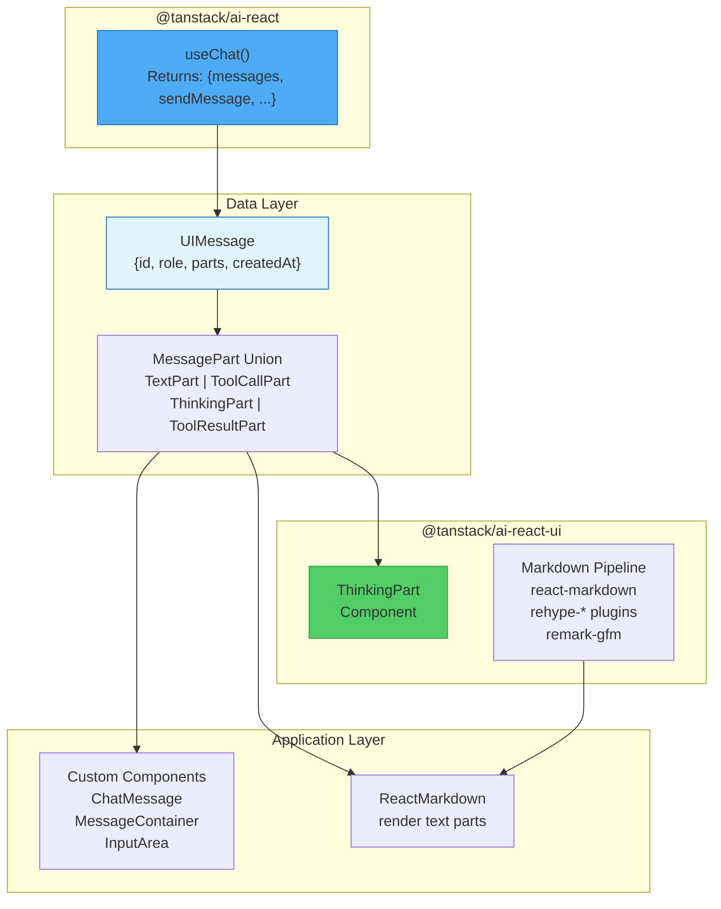
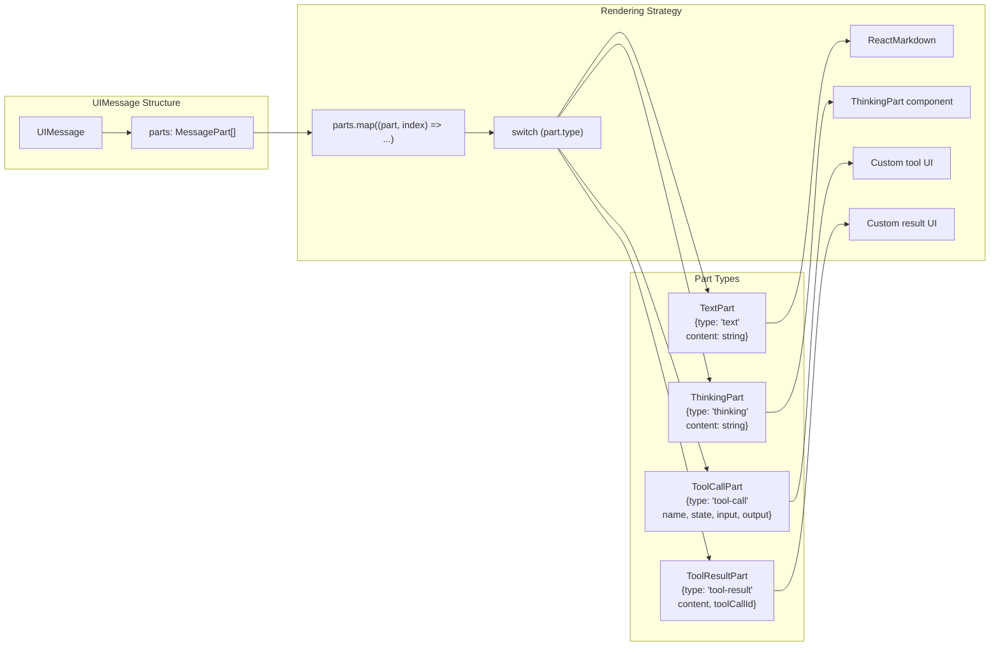
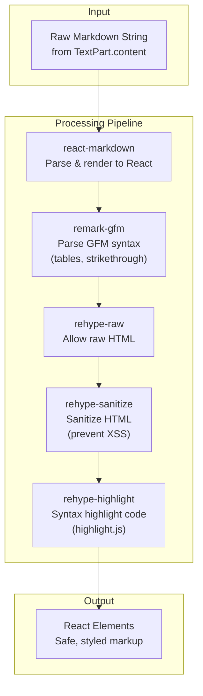
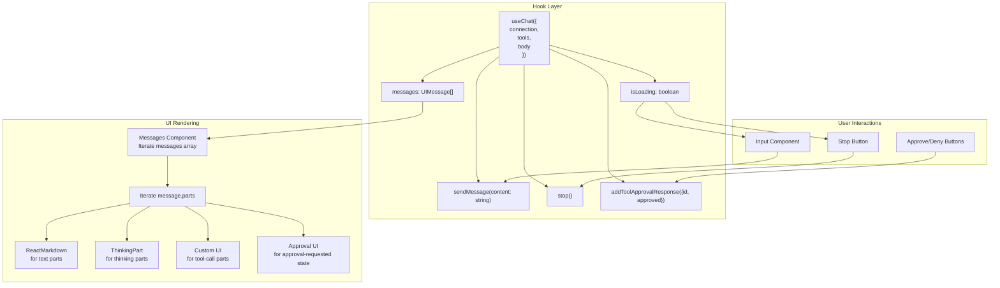

# React UI Components (@tanstack/ai-react-ui)

<details>
<summary>Relevant source files</summary>

The following files were used as context for generating this wiki page:

- [examples/ts-svelte-chat/CHANGELOG.md](examples/ts-svelte-chat/CHANGELOG.md)
- [examples/ts-svelte-chat/package.json](examples/ts-svelte-chat/package.json)
- [examples/ts-vue-chat/CHANGELOG.md](examples/ts-vue-chat/CHANGELOG.md)
- [examples/ts-vue-chat/package.json](examples/ts-vue-chat/package.json)
- [packages/typescript/ai-anthropic/package.json](packages/typescript/ai-anthropic/package.json)
- [packages/typescript/ai-gemini/CHANGELOG.md](packages/typescript/ai-gemini/CHANGELOG.md)
- [packages/typescript/ai-gemini/package.json](packages/typescript/ai-gemini/package.json)
- [packages/typescript/ai-ollama/package.json](packages/typescript/ai-ollama/package.json)
- [packages/typescript/ai-openai/CHANGELOG.md](packages/typescript/ai-openai/CHANGELOG.md)
- [packages/typescript/ai-openai/package.json](packages/typescript/ai-openai/package.json)
- [packages/typescript/ai-react-ui/package.json](packages/typescript/ai-react-ui/package.json)
- [packages/typescript/ai-react/package.json](packages/typescript/ai-react/package.json)
- [packages/typescript/ai-solid-ui/package.json](packages/typescript/ai-solid-ui/package.json)
- [packages/typescript/ai-solid/package.json](packages/typescript/ai-solid/package.json)
- [packages/typescript/ai-svelte/package.json](packages/typescript/ai-svelte/package.json)
- [packages/typescript/ai-vue-ui/package.json](packages/typescript/ai-vue-ui/package.json)
- [packages/typescript/ai-vue/package.json](packages/typescript/ai-vue/package.json)
- [packages/typescript/smoke-tests/adapters/CHANGELOG.md](packages/typescript/smoke-tests/adapters/CHANGELOG.md)
- [packages/typescript/smoke-tests/adapters/package.json](packages/typescript/smoke-tests/adapters/package.json)
- [packages/typescript/smoke-tests/e2e/CHANGELOG.md](packages/typescript/smoke-tests/e2e/CHANGELOG.md)
- [packages/typescript/smoke-tests/e2e/package.json](packages/typescript/smoke-tests/e2e/package.json)

</details>

## Purpose and Scope

The `@tanstack/ai-react-ui` package provides pre-built React components for rendering AI chat interfaces. It is designed as a lightweight UI layer on top of `@tanstack/ai-react`, offering components for displaying specific message parts like thinking/reasoning content, along with a markdown processing pipeline for rendering text content.

This package focuses on **headless UI components**—unstyled, functional components that handle rendering logic while allowing full customization of appearance. Most chat UI elements (message containers, avatars, input fields) are expected to be implemented by the application, while this package provides components for specialized AI-specific content like extended thinking and markdown rendering.

For the underlying React integration and state management, see [React Integration (@tanstack/ai-react)](#6.1). For the SolidJS equivalent, see [Solid UI Components (@tanstack/ai-solid-ui)](#7.2). For details on the markdown processing pipeline shared across UI packages, see [Markdown Processing Pipeline](#7.3).

## Package Overview

The package is structured as a thin UI layer that bridges the gap between framework-agnostic message data (`UIMessage` with typed parts) and rendered React components.



**Sources:** [packages/typescript/ai-react-ui/package.json:1-58]()

### Package Dependencies

The package has a minimal dependency footprint, relying primarily on markdown processing libraries:

| Dependency         | Purpose                                                        |
| ------------------ | -------------------------------------------------------------- |
| `react-markdown`   | Core markdown-to-React rendering                               |
| `rehype-highlight` | Syntax highlighting for code blocks                            |
| `rehype-raw`       | Support for raw HTML in markdown                               |
| `rehype-sanitize`  | Sanitize HTML to prevent XSS                                   |
| `remark-gfm`       | GitHub Flavored Markdown support (tables, strikethrough, etc.) |

**Peer Dependencies:**

- `@tanstack/ai-client` - Message type definitions (`UIMessage`, `MessagePart`)
- `@tanstack/ai-react` - React integration layer (`useChat` hook)
- `react` ^18.0.0 || ^19.0.0
- `react-dom` ^18.0.0 || ^19.0.0

**Sources:** [packages/typescript/ai-react-ui/package.json:37-50]()

## Message Part Rendering Architecture

The core concept is that each `UIMessage` contains an array of `MessagePart` objects, each with a discriminated `type` field. The UI layer iterates through these parts and renders each according to its type.



**Typical Rendering Pattern:**

```typescript
{message.parts.map((part, index) => {
  if (part.type === 'thinking') {
    return <ThinkingPart content={part.content} isComplete={...} />
  }

  if (part.type === 'text' && part.content) {
    return <ReactMarkdown>{part.content}</ReactMarkdown>
  }

  if (part.type === 'tool-call') {
    // Custom rendering based on tool name, state, etc.
    return <CustomToolUI part={part} />
  }

  return null
})}
```

**Sources:** [testing/panel/src/routes/index.tsx:118-229](), [examples/ts-react-chat/src/routes/index.tsx:118-220]()

## ThinkingPart Component

The `ThinkingPart` component is the primary pre-built component exported by `@tanstack/ai-react-ui`. It renders extended thinking/reasoning content from AI models that support this feature (e.g., Claude with extended thinking, OpenAI o-series models).

### Component Props

```typescript
interface ThinkingPartProps {
  content: string // The thinking/reasoning text
  isComplete?: boolean // Whether thinking is finished
  className?: string // CSS classes for styling
}
```

### Usage Pattern

The component is typically rendered when iterating through message parts:

```typescript
if (part.type === 'thinking') {
  // Determine if thinking is complete by checking if there's a text part after
  const isComplete = message.parts
    .slice(index + 1)
    .some((p) => p.type === 'text')

  return (
    <ThinkingPart
      content={part.content}
      isComplete={isComplete}
      className="p-4 bg-gray-800/50 border border-gray-700/50 rounded-lg"
    />
  )
}
```

### Behavior Characteristics

The component provides:

- **Collapsible UI**: Thinking content can be toggled to avoid cluttering the chat interface
- **Progressive Loading**: Updates incrementally as thinking chunks arrive during streaming
- **Completion State**: Visual indicator when thinking transitions to final response
- **Markdown Support**: Thinking content is typically rendered as markdown, supporting formatted reasoning

**Sources:** [testing/panel/src/routes/index.tsx:11](), [testing/panel/src/routes/index.tsx:123-136](), [examples/ts-react-chat/src/routes/index.tsx:11](), [examples/ts-react-chat/src/routes/index.tsx:119-132]()

## Markdown Processing Pipeline

While not explicitly exported as separate utilities, the package's dependencies establish a standard markdown processing pipeline used throughout the ecosystem.



### Typical Configuration

Applications using the UI package typically configure `ReactMarkdown` with these plugins:

```typescript
import ReactMarkdown from 'react-markdown'
import rehypeRaw from 'rehype-raw'
import rehypeSanitize from 'rehype-sanitize'
import rehypeHighlight from 'rehype-highlight'
import remarkGfm from 'remark-gfm'

<ReactMarkdown
  rehypePlugins={[
    rehypeRaw,        // Allow HTML tags in markdown
    rehypeSanitize,   // Sanitize to prevent XSS
    rehypeHighlight   // Syntax highlighting for code blocks
  ]}
  remarkPlugins={[
    remarkGfm         // Support tables, task lists, etc.
  ]}
>
  {part.content}
</ReactMarkdown>
```

### Security Considerations

The pipeline includes `rehype-sanitize` to prevent XSS attacks from untrusted markdown content. This is critical since AI-generated content may include HTML tags or JavaScript that should not execute in the browser.

**Sources:** [testing/panel/src/routes/index.tsx:4-8](), [testing/panel/src/routes/index.tsx:145-152](), [packages/typescript/ai-react-ui/package.json:38-42]()

## Integration with useChat Hook

The UI components integrate seamlessly with the `useChat` hook from `@tanstack/ai-react`, which provides the message data and interaction methods.



### Complete Integration Example

```typescript
const { messages, sendMessage, isLoading, addToolApprovalResponse, stop } = useChat({
  connection: fetchServerSentEvents('/api/chat'),
  tools: clientTools(...),
  body: { provider: 'openai', model: 'gpt-4o' }
})

return (
  <div className="chat-container">
    {/* Message List */}
    <div className="messages">
      {messages.map((message) => (
        <div key={message.id}>
          {/* Role indicator */}
          <div>{message.role === 'assistant' ? 'AI' : 'User'}</div>

          {/* Render parts */}
          <div>
            {message.parts.map((part, index) => {
              // Thinking content
              if (part.type === 'thinking') {
                const isComplete = message.parts
                  .slice(index + 1)
                  .some((p) => p.type === 'text')
                return <ThinkingPart content={part.content} isComplete={isComplete} />
              }

              // Text content
              if (part.type === 'text') {
                return <ReactMarkdown>{part.content}</ReactMarkdown>
              }

              // Tool approval
              if (part.type === 'tool-call' && part.state === 'approval-requested') {
                return (
                  <div>
                    <p>Approval Required: {part.name}</p>
                    <button onClick={() => addToolApprovalResponse({
                      id: part.approval.id,
                      approved: true
                    })}>Approve</button>
                    <button onClick={() => addToolApprovalResponse({
                      id: part.approval.id,
                      approved: false
                    })}>Deny</button>
                  </div>
                )
              }

              return null
            })}
          </div>
        </div>
      ))}
    </div>

    {/* Input */}
    <div>
      {isLoading && <button onClick={stop}>Stop</button>}
      <textarea value={input} onChange={(e) => setInput(e.target.value)} />
      <button onClick={() => sendMessage(input)} disabled={isLoading}>Send</button>
    </div>
  </div>
)
```

**Sources:** [testing/panel/src/routes/index.tsx:405-413](), [testing/panel/src/routes/index.tsx:71-236](), [examples/ts-react-chat/src/routes/index.tsx:243-248](), [examples/ts-react-chat/src/routes/index.tsx:68-228]()

## Customization Patterns

The package is designed for **maximum flexibility** rather than providing comprehensive pre-built components. Most applications implement custom rendering for:

### Tool Call Rendering

Tool calls require application-specific UI based on the tool name and state:

```typescript
if (part.type === 'tool-call' && part.name === 'recommendGuitar' && part.output) {
  // Custom component for guitar recommendations
  return <GuitarRecommendation id={part.output.id} />
}

if (part.type === 'tool-call' && part.state === 'executing') {
  // Loading indicator during tool execution
  return <div>Executing {part.name}...</div>
}
```

### Message Layout

Applications typically create custom `ChatMessage` or `Message` components that wrap the part rendering logic with layout, styling, and metadata display:

```typescript
function ChatMessage({ message, addToolApprovalResponse }) {
  return (
    <div className={message.role === 'assistant' ? 'ai-message' : 'user-message'}>
      {/* Avatar */}
      <div className="avatar">{message.role === 'assistant' ? 'AI' : 'U'}</div>

      {/* Message content */}
      <div className="content">
        {message.parts.map((part, index) => {
          // Render each part type...
        })}
      </div>

      {/* Metadata */}
      <div className="timestamp">{message.createdAt.toLocaleString()}</div>
    </div>
  )
}
```

### Styling Approach

The package provides **unstyled components** that accept `className` props for styling. Applications can use:

- CSS modules
- Tailwind CSS (as shown in examples)
- Styled-components
- Any other styling solution

**Sources:** [testing/panel/src/routes/index.tsx:99-234](), [examples/ts-react-chat/src/routes/index.tsx:96-226]()

## Type Safety

The package leverages TypeScript discriminated unions for type-safe part rendering:

```typescript
import type { UIMessage, MessagePart, ToolCallPart } from '@tanstack/ai-client'

message.parts.forEach((part: MessagePart) => {
  if (part.type === 'tool-call') {
    // TypeScript narrows to ToolCallPart
    console.log(part.name) // ✓ Type-safe access
    console.log(part.state) // ✓ Type-safe access
    console.log(part.arguments) // ✓ Type-safe access
    console.log(part.output) // ✓ Type-safe access
  }

  if (part.type === 'text') {
    // TypeScript narrows to TextPart
    console.log(part.content) // ✓ Type-safe access
  }
})
```

The `@tanstack/ai-client` package defines these types, ensuring consistency across the React and Solid UI packages.

**Sources:** [packages/typescript/ai-react-ui/package.json:44-50]()

## Package Exports

The package exports:

- `ThinkingPart` component
- Type re-exports from `@tanstack/ai-client` (for convenience)
- Markdown processing dependencies (implicitly via package.json)

The minimal export surface reflects the package's philosophy: provide specialized components for AI-specific UI patterns, but let applications build custom UI for standard chat interface elements.

**Sources:** [packages/typescript/ai-react-ui/package.json:13-17]()

## Comparison with Solid UI

The Solid UI package (`@tanstack/ai-solid-ui`) follows the same architecture but uses SolidJS primitives:

- Uses `solid-markdown` instead of `react-markdown`
- Same rehype/remark plugin pipeline
- Same message part rendering pattern
- Same headless component philosophy

| Feature            | React UI                          | Solid UI                          |
| ------------------ | --------------------------------- | --------------------------------- |
| Markdown Library   | `react-markdown`                  | `solid-markdown`                  |
| Thinking Component | `ThinkingPart`                    | `ThinkingPart`                    |
| Reactivity Model   | React state/effects               | SolidJS signals                   |
| Type Definitions   | Shared from `@tanstack/ai-client` | Shared from `@tanstack/ai-client` |

**Sources:** [packages/typescript/ai-solid-ui/package.json:1-61](), [packages/typescript/ai-react-ui/package.json:1-58]()
