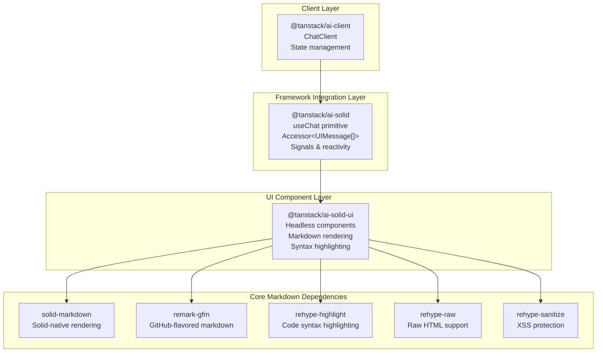
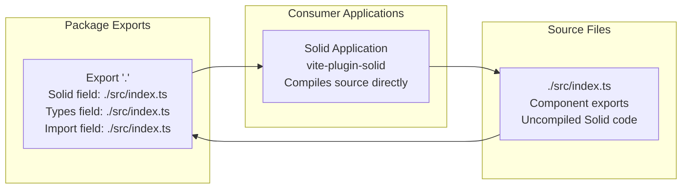
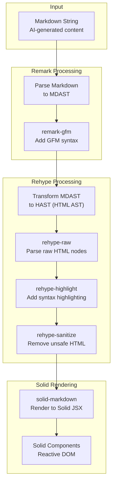
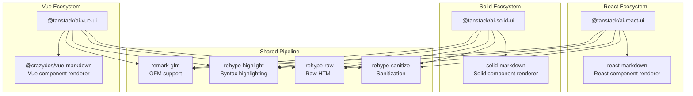
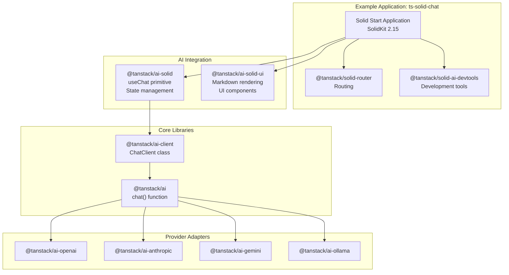
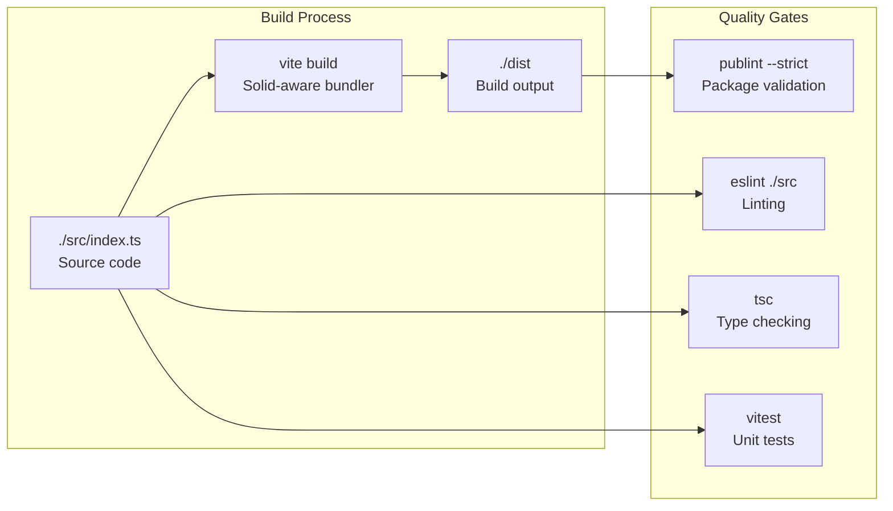

# Solid UI Components (@tanstack/ai-solid-ui)

Relevant source files

The following files were used as context for generating this wiki page:

- [examples/ts-svelte-chat/CHANGELOG.md](examples/ts-svelte-chat/CHANGELOG.md)
- [examples/ts-svelte-chat/package.json](examples/ts-svelte-chat/package.json)
- [examples/ts-vue-chat/CHANGELOG.md](examples/ts-vue-chat/CHANGELOG.md)
- [examples/ts-vue-chat/package.json](examples/ts-vue-chat/package.json)
- [packages/typescript/ai-anthropic/package.json](packages/typescript/ai-anthropic/package.json)
- [packages/typescript/ai-gemini/CHANGELOG.md](packages/typescript/ai-gemini/CHANGELOG.md)
- [packages/typescript/ai-gemini/package.json](packages/typescript/ai-gemini/package.json)
- [packages/typescript/ai-ollama/package.json](packages/typescript/ai-ollama/package.json)
- [packages/typescript/ai-openai/CHANGELOG.md](packages/typescript/ai-openai/CHANGELOG.md)
- [packages/typescript/ai-openai/package.json](packages/typescript/ai-openai/package.json)
- [packages/typescript/ai-react-ui/package.json](packages/typescript/ai-react-ui/package.json)
- [packages/typescript/ai-react/package.json](packages/typescript/ai-react/package.json)
- [packages/typescript/ai-solid-ui/package.json](packages/typescript/ai-solid-ui/package.json)
- [packages/typescript/ai-solid/package.json](packages/typescript/ai-solid/package.json)
- [packages/typescript/ai-svelte/package.json](packages/typescript/ai-svelte/package.json)
- [packages/typescript/ai-vue-ui/package.json](packages/typescript/ai-vue-ui/package.json)
- [packages/typescript/ai-vue/package.json](packages/typescript/ai-vue/package.json)
- [packages/typescript/smoke-tests/adapters/CHANGELOG.md](packages/typescript/smoke-tests/adapters/CHANGELOG.md)
- [packages/typescript/smoke-tests/adapters/package.json](packages/typescript/smoke-tests/adapters/package.json)
- [packages/typescript/smoke-tests/e2e/CHANGELOG.md](packages/typescript/smoke-tests/e2e/CHANGELOG.md)
- [packages/typescript/smoke-tests/e2e/package.json](packages/typescript/smoke-tests/e2e/package.json)

The `@tanstack/ai-solid-ui` package provides headless UI components for rendering AI chat interfaces in Solid applications. It focuses on markdown rendering with syntax highlighting, GitHub-flavored markdown support, and security sanitization, using Solid-native rendering primitives.

For the framework integration layer that manages chat state and client-side logic, see [Solid Integration (@tanstack/ai-solid)](#6.2). For the shared markdown processing pipeline used across all UI component packages, see [Markdown Processing Pipeline](#7.4).

---

## Package Architecture

The package sits in the UI Component Layer of the TanStack AI architecture, providing presentation components that work with the state management primitives from `@tanstack/ai-solid`.

**Sources:** [packages/typescript/ai-solid-ui/package.json:1-62](), [pnpm-lock.yaml:879-911]()

---

## Dependencies and Peer Requirements

### Production Dependencies

The package includes the complete markdown processing pipeline:

| Dependency         | Version | Purpose                                                                 |
| ------------------ | ------- | ----------------------------------------------------------------------- |
| `solid-markdown`   | ^2.1.0  | Solid-native markdown renderer                                          |
| `remark-gfm`       | ^4.0.1  | GitHub-flavored markdown extensions (tables, task lists, strikethrough) |
| `rehype-highlight` | ^7.0.2  | Syntax highlighting for code blocks                                     |
| `rehype-raw`       | ^7.0.0  | Parse and render raw HTML in markdown                                   |
| `rehype-sanitize`  | ^6.0.0  | Sanitize HTML to prevent XSS attacks                                    |

### Peer Dependencies

| Peer Dependency       | Version Constraint | Purpose                                                     |
| --------------------- | ------------------ | ----------------------------------------------------------- |
| `@tanstack/ai-client` | workspace:^        | Core client types and utilities                             |
| `@tanstack/ai-solid`  | workspace:^        | Solid framework integration                                 |
| `solid-js`            | >=1.9.7            | Solid framework runtime (requires 1.9.7+ for compatibility) |

**Sources:** [packages/typescript/ai-solid-ui/package.json:43-53]()

---

## Module Export Strategy

Unlike the React UI package which builds to a `dist` directory, the Solid UI package uses source-based exports to leverage Solid's compilation model:

The `"solid"` field in `exports` [packages/typescript/ai-solid-ui/package.json:14-18]() enables Solid's build tools to import source files directly, allowing optimal compilation and reactivity tracking.

**Sources:** [packages/typescript/ai-solid-ui/package.json:13-19]()

---

## Markdown Processing Pipeline

The package implements a unified markdown processing pipeline using remark and rehype plugins:

### Processing Stages

1. **Markdown Parsing**: Input markdown is parsed into a Markdown Abstract Syntax Tree (MDAST)
2. **GFM Extensions** (`remark-gfm`): Adds support for tables, task lists, strikethrough, autolinks
3. **HTML Transformation**: MDAST is transformed to HTML AST (HAST)
4. **Raw HTML** (`rehype-raw`): Parses raw HTML nodes within markdown
5. **Syntax Highlighting** (`rehype-highlight`): Applies highlight.js to code blocks
6. **Sanitization** (`rehype-sanitize`): Removes dangerous HTML elements/attributes
7. **Solid Rendering** (`solid-markdown`): Converts sanitized HAST to Solid JSX components

**Sources:** [packages/typescript/ai-solid-ui/package.json:43-48]()

---

## Framework Comparison

The three UI component packages follow the same architectural pattern but use framework-specific markdown renderers:

### Key Differences

| Package                 | Markdown Renderer        | Build Output    | Framework Version |
| ----------------------- | ------------------------ | --------------- | ----------------- |
| `@tanstack/ai-react-ui` | `react-markdown`         | Pre-built dist/ | React ^18 or ^19  |
| `@tanstack/ai-solid-ui` | `solid-markdown`         | Source-based    | Solid >=1.9.7     |
| `@tanstack/ai-vue-ui`   | `@crazydos/vue-markdown` | Pre-built dist/ | Vue >=3.5.0       |

**Sources:** [packages/typescript/ai-react-ui/package.json:40-52](), [packages/typescript/ai-solid-ui/package.json:43-53](), [packages/typescript/ai-vue-ui/package.json:41-51]()

---

## Integration with Solid Ecosystem

The package is used in production within the `ts-solid-chat` example application:

The example demonstrates full-stack AI chat with:

- All 5 provider adapters (OpenAI, Anthropic, Gemini, Ollama, Grok)
- Markdown rendering with `solid-markdown`
- Syntax highlighting using `highlight.js`
- Devtools integration for debugging

**Sources:** [pnpm-lock.yaml:323-439](), [packages/typescript/ai-solid-ui/package.json:50-53]()

---

## Build and Development Configuration

### Build System

The package uses Vite for building, with a specialized configuration for Solid:

### NPM Scripts

| Script        | Command                    | Purpose                     |
| ------------- | -------------------------- | --------------------------- |
| `build`       | `vite build`               | Build production bundle     |
| `clean`       | `premove ./build ./dist`   | Remove build artifacts      |
| `test:build`  | `publint --strict`         | Validate package structure  |
| `test:eslint` | `eslint ./src`             | Lint source code            |
| `test:lib`    | `vitest --passWithNoTests` | Run unit tests              |
| `test:types`  | `tsc`                      | Type check without emitting |

**Sources:** [packages/typescript/ai-solid-ui/package.json:24-31]()

---

## Version and Metadata

- **Current Version**: 0.2.1
- **Repository**: https://github.com/TanStack/ai
- **Directory**: packages/typescript/ai
- **Package Manager**: pnpm with workspace protocol
- **Keywords**: tanstack, ai, solid, solidjs, chat, ui, headless, components

The package follows semantic versioning and is published as part of the TanStack AI monorepo using Changesets for version management.

**Sources:** [packages/typescript/ai-solid-ui/package.json:1-42]()

---

## Headless Component Philosophy

The package follows the "headless components" pattern, meaning it provides functionality without prescriptive styling:

1. **No CSS Dependencies**: Components have no built-in styles
2. **Bring Your Own Styles**: Consumers style components using their preferred approach (CSS modules, styled-components, Tailwind, etc.)
3. **Accessibility Focus**: Components handle behavior, ARIA attributes, and semantic HTML
4. **Framework-Native**: Uses Solid's reactive primitives (signals, accessors) for optimal performance

This approach enables:

- Full design flexibility for consumers
- Minimal bundle size (no unused CSS)
- Framework-specific optimizations (Solid's fine-grained reactivity)
- Easy theme integration

**Sources:** [packages/typescript/ai-solid-ui/package.json:4]()

---

## Nx Build Integration

The package is integrated into the monorepo's Nx build orchestration:

| Target        | Dependency | Inputs                 | Outputs    | Cache |
| ------------- | ---------- | ---------------------- | ---------- | ----- |
| `build`       | `^build`   | production files       | ./dist     | Yes   |
| `test:lib`    | `^build`   | source + test files    | ./coverage | Yes   |
| `test:eslint` | `^build`   | source + eslint config | -          | Yes   |
| `test:types`  | `^build`   | source files           | -          | Yes   |
| `test:build`  | `build`    | production files       | -          | Yes   |

The `^build` dependency ensures parent packages (`@tanstack/ai-solid`, `@tanstack/ai-client`) build before this package.

**Sources:** [nx.json:27-73]()
