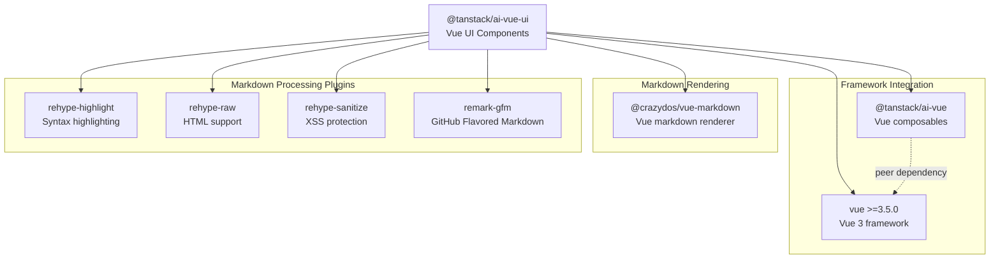
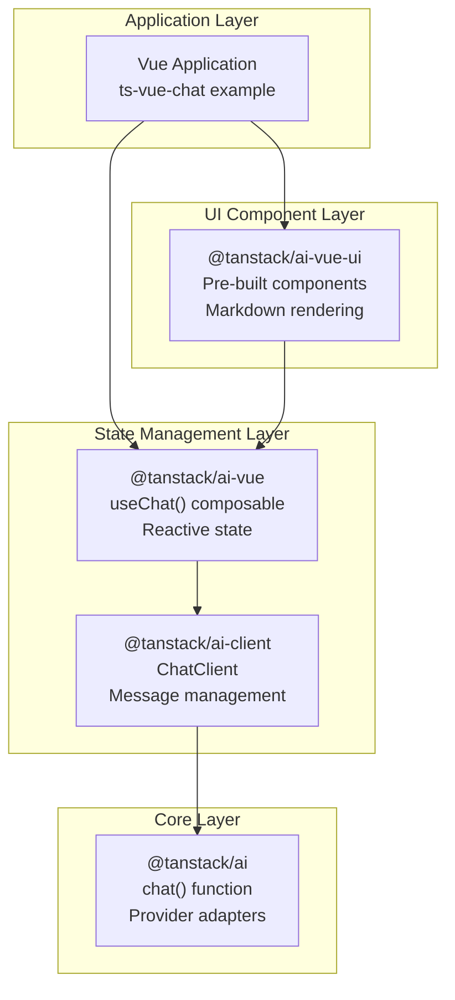
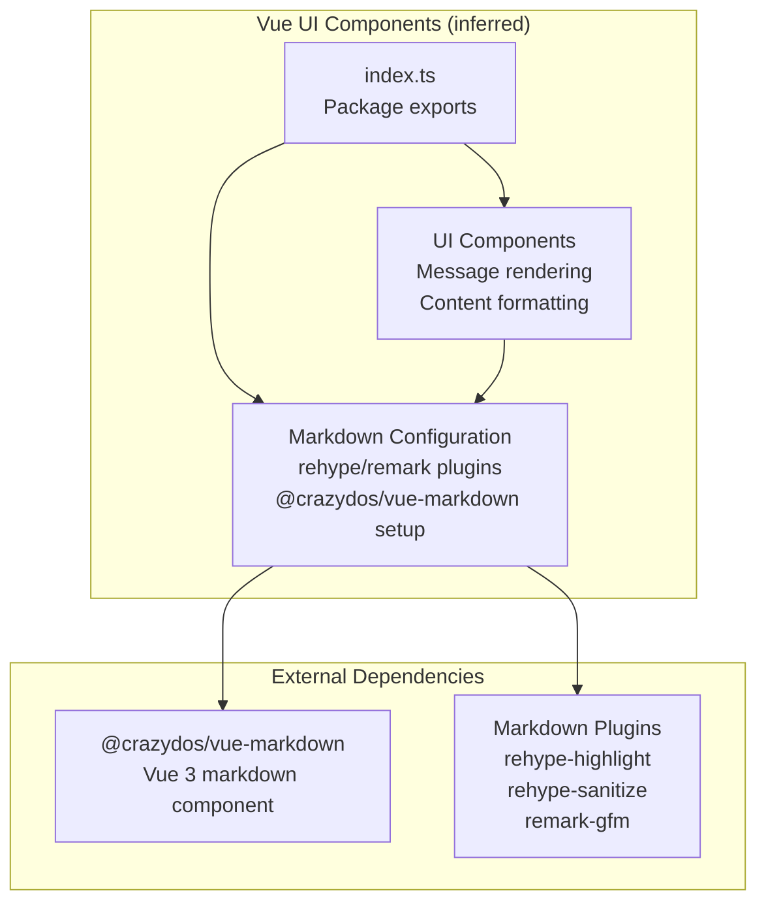
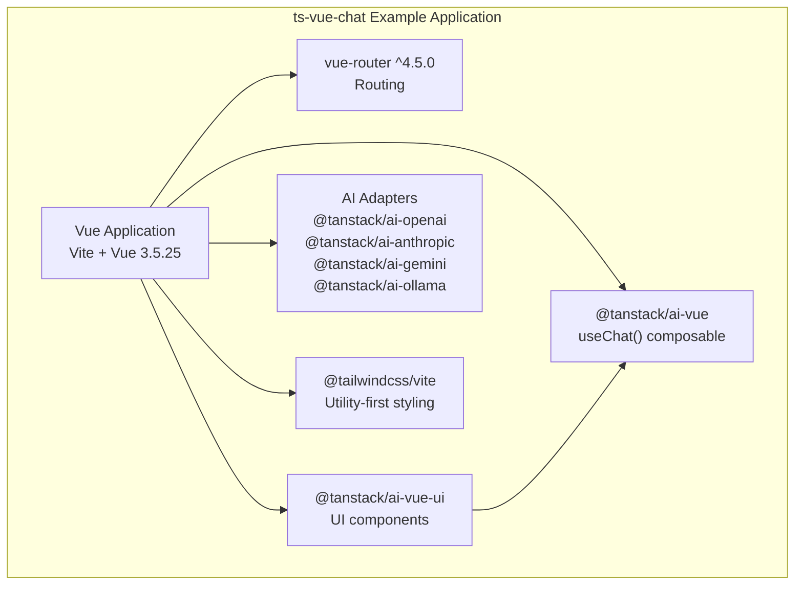

# Vue UI Components (@tanstack/ai-vue-ui)

<details>
<summary>Relevant source files</summary>

The following files were used as context for generating this wiki page:

- [examples/ts-svelte-chat/CHANGELOG.md](examples/ts-svelte-chat/CHANGELOG.md)
- [examples/ts-svelte-chat/package.json](examples/ts-svelte-chat/package.json)
- [examples/ts-vue-chat/CHANGELOG.md](examples/ts-vue-chat/CHANGELOG.md)
- [examples/ts-vue-chat/package.json](examples/ts-vue-chat/package.json)
- [packages/typescript/ai-anthropic/package.json](packages/typescript/ai-anthropic/package.json)
- [packages/typescript/ai-gemini/CHANGELOG.md](packages/typescript/ai-gemini/CHANGELOG.md)
- [packages/typescript/ai-gemini/package.json](packages/typescript/ai-gemini/package.json)
- [packages/typescript/ai-ollama/package.json](packages/typescript/ai-ollama/package.json)
- [packages/typescript/ai-openai/CHANGELOG.md](packages/typescript/ai-openai/CHANGELOG.md)
- [packages/typescript/ai-openai/package.json](packages/typescript/ai-openai/package.json)
- [packages/typescript/ai-react-ui/package.json](packages/typescript/ai-react-ui/package.json)
- [packages/typescript/ai-react/package.json](packages/typescript/ai-react/package.json)
- [packages/typescript/ai-solid-ui/package.json](packages/typescript/ai-solid-ui/package.json)
- [packages/typescript/ai-solid/package.json](packages/typescript/ai-solid/package.json)
- [packages/typescript/ai-svelte/package.json](packages/typescript/ai-svelte/package.json)
- [packages/typescript/ai-vue-ui/package.json](packages/typescript/ai-vue-ui/package.json)
- [packages/typescript/ai-vue/package.json](packages/typescript/ai-vue/package.json)
- [packages/typescript/smoke-tests/adapters/CHANGELOG.md](packages/typescript/smoke-tests/adapters/CHANGELOG.md)
- [packages/typescript/smoke-tests/adapters/package.json](packages/typescript/smoke-tests/adapters/package.json)
- [packages/typescript/smoke-tests/e2e/CHANGELOG.md](packages/typescript/smoke-tests/e2e/CHANGELOG.md)
- [packages/typescript/smoke-tests/e2e/package.json](packages/typescript/smoke-tests/e2e/package.json)

</details>

## Purpose and Scope

The `@tanstack/ai-vue-ui` package provides pre-built, headless Vue 3 components for rendering AI chat interfaces. It handles markdown processing, syntax highlighting, and message formatting for conversations managed by the `@tanstack/ai-vue` composables.

This page documents the Vue-specific UI components. For the underlying Vue composables and state management, see [Vue Integration (@tanstack/ai-vue)](#6.3). For information about the shared markdown processing infrastructure used across all UI libraries, see [Markdown Processing Pipeline](#7.4). For similar packages in other frameworks, see [React UI Components](#7.1) and [Solid UI Components](#7.2).

**Sources:** [packages/typescript/ai-vue-ui/package.json:1-59]()

## Package Overview

The `@tanstack/ai-vue-ui` package is a headless UI component library that operates at the top of the TanStack AI stack. It provides rendering components that consume reactive state from `@tanstack/ai-vue` and format AI conversation content with markdown support.

### Package Metadata

| Property         | Value                   |
| ---------------- | ----------------------- |
| Package Name     | `@tanstack/ai-vue-ui`   |
| Current Version  | 0.1.3                   |
| Module Type      | ESM                     |
| Entry Point      | `./dist/esm/index.js`   |
| Type Definitions | `./dist/esm/index.d.ts` |
| Build Tool       | Vite                    |
| Type Checker     | vue-tsc                 |

### Key Dependencies



**Sources:** [packages/typescript/ai-vue-ui/package.json:1-59]()

## Architecture and Integration

### Position in the Vue Ecosystem

The Vue UI components package sits at the presentation layer, consuming reactive state from `@tanstack/ai-vue` and rendering formatted conversation content. Unlike lower-level packages, it focuses solely on visual presentation with opinionated markdown rendering.



**Sources:** [packages/typescript/ai-vue-ui/package.json:41-48](), [examples/ts-vue-chat/package.json:12-24]()

### Component Architecture

While the source code is not directly visible in the provided files, the package structure and dependencies indicate the following component organization:



**Sources:** [packages/typescript/ai-vue-ui/package.json:5-6](), [packages/typescript/ai-vue-ui/package.json:13-17]()

## Markdown Rendering with Vue

### Vue Markdown Library Integration

Unlike React UI (`react-markdown`) and Solid UI (`solid-markdown`), the Vue UI package uses `@crazydos/vue-markdown` version 1.1.4 as its markdown rendering engine. This is a Vue 3-specific markdown component that integrates with Vue's reactivity system.

| Framework | Markdown Library           | Version    |
| --------- | -------------------------- | ---------- |
| React     | react-markdown             | ^10.1.0    |
| Solid     | solid-markdown             | ^2.1.0     |
| **Vue**   | **@crazydos/vue-markdown** | **^1.1.4** |

All three UI libraries share the same markdown processing plugins:

- `rehype-highlight` ^7.0.2 - Syntax highlighting for code blocks
- `rehype-raw` ^7.0.0 - Support for raw HTML in markdown
- `rehype-sanitize` ^6.0.0 - XSS protection and HTML sanitization
- `remark-gfm` ^4.0.1 - GitHub Flavored Markdown extensions (tables, task lists, strikethrough)

**Sources:** [packages/typescript/ai-vue-ui/package.json:41-48](), [packages/typescript/ai-react-ui/package.json:40-45](), [packages/typescript/ai-solid-ui/package.json:43-48]()

### Markdown Processing Pipeline

The markdown processing pipeline for Vue follows the unified/remark/rehype architecture:

```mermaid
graph LR
    INPUT["Raw Markdown Text<br/>from AI response"]

    subgraph "Remark (Markdown Processing)"
        PARSE["Parse Markdown AST"]
        GFM["remark-gfm<br/>GitHub extensions"]
    end

    subgraph "Rehype (HTML Processing)"
        TO_HTML["Convert to HTML AST"]
        RAW["rehype-raw<br/>Parse raw HTML"]
        HIGHLIGHT["rehype-highlight<br/>Syntax highlighting"]
        SANITIZE["rehype-sanitize<br/>XSS protection"]
    end

    subgraph "Vue Rendering"
        VUE_MD["@crazydos/vue-markdown<br/>Vue component"]
        OUTPUT["Rendered Vue elements"]
    end

    INPUT --> PARSE
    PARSE --> GFM
    GFM --> TO_HTML
    TO_HTML --> RAW
    RAW --> HIGHLIGHT
    HIGHLIGHT --> SANITIZE
    SANITIZE --> VUE_MD
    VUE_MD --> OUTPUT
```



**Sources:** [packages/typescript/ai-vue-ui/package.json:41-48]()

## Build Configuration

### Vite Build System

The Vue UI package uses Vite as its build tool, consistent with modern Vue 3 development practices. This differs from `@tanstack/ai-solid-ui` which uses tsdown, but aligns with `@tanstack/ai-react-ui` which also uses Vite.

| Package               | Build Tool | Configuration          |
| --------------------- | ---------- | ---------------------- |
| @tanstack/ai-vue-ui   | Vite       | `vite build`           |
| @tanstack/ai-react-ui | Vite       | `vite build`           |
| @tanstack/ai-solid-ui | Vite       | `vite build`           |
| @tanstack/ai-vue      | tsdown     | `tsdown` (composables) |

The build produces ESM output in the `dist/esm/` directory with corresponding TypeScript declaration files.

**Sources:** [packages/typescript/ai-vue-ui/package.json:24-30](), [packages/typescript/ai-solid-ui/package.json:24-31](), [packages/typescript/ai-vue/package.json:31]()

### TypeScript Configuration

Type checking is performed using `vue-tsc`, the Vue-specific TypeScript compiler that understands `.vue` single-file components:

```
test:types: vue-tsc --noEmit
```

This ensures full type safety for Vue components with proper template type checking.

**Sources:** [packages/typescript/ai-vue-ui/package.json:30]()

### Package Exports

The package follows the modern Node.js exports pattern:

```json
"exports": {
  ".": {
    "types": "./dist/esm/index.d.ts",
    "import": "./dist/esm/index.js"
  }
}
```

This provides:

- TypeScript type definitions at `./dist/esm/index.d.ts`
- ESM JavaScript module at `./dist/esm/index.js`
- No CommonJS support (ESM-only)

**Sources:** [packages/typescript/ai-vue-ui/package.json:13-17]()

## Usage and Integration

### Peer Dependencies

The package declares Vue 3.5.0 or higher as a peer dependency, ensuring compatibility with the latest Vue 3 features including improved TypeScript support and composition API enhancements.

```json
"peerDependencies": {
  "vue": ">=3.5.0"
}
```

**Sources:** [packages/typescript/ai-vue-ui/package.json:49-51]()

### Integration Example

The `ts-vue-chat` example application demonstrates real-world usage of the Vue UI components:



The example shows a complete chat application using:

- Vue Router for navigation
- TanStack AI Vue UI components for message rendering
- Multiple AI provider adapters (OpenAI, Anthropic, Gemini, Ollama)
- Tailwind CSS for styling

**Sources:** [examples/ts-vue-chat/package.json:1-40]()

### Development Dependencies

The Vue UI package includes comprehensive testing and validation tools:

| Tool                | Purpose                     | Version |
| ------------------- | --------------------------- | ------- |
| @vitejs/plugin-vue  | Vue 3 support in Vite       | ^6.0.2  |
| @vitest/coverage-v8 | Code coverage reporting     | 4.0.14  |
| vite                | Build tool and dev server   | ^7.2.7  |
| vue                 | Vue 3 framework             | ^3.5.25 |
| vue-tsc             | TypeScript compiler for Vue | ^2.2.10 |

**Sources:** [packages/typescript/ai-vue-ui/package.json:52-58]()

## Testing and Quality Assurance

The package includes standard TanStack AI quality checks:

| Script        | Purpose                                         |
| ------------- | ----------------------------------------------- |
| `test:build`  | Validate package exports with publint           |
| `test:eslint` | Lint source code                                |
| `test:lib`    | Run unit tests (currently passes with no tests) |
| `test:types`  | TypeScript type checking with vue-tsc           |

**Sources:** [packages/typescript/ai-vue-ui/package.json:23-30]()

## Comparison with Other UI Libraries

### Cross-Framework Consistency

All three UI libraries share:

- Same version numbers for markdown processing plugins
- Same rehype/remark plugin set
- Same build output structure (ESM only)
- Same testing infrastructure

### Framework-Specific Differences

| Aspect               | React UI       | Solid UI       | Vue UI                 |
| -------------------- | -------------- | -------------- | ---------------------- |
| **Markdown Library** | react-markdown | solid-markdown | @crazydos/vue-markdown |
| **Build Tool**       | Vite           | Vite           | Vite                   |
| **Type Checking**    | tsc            | tsc            | vue-tsc                |
| **Source Entry**     | ./dist/esm/    | ./src/index.ts | ./src/index.ts         |
| **Peer Deps**        | React 18/19    | Solid >=1.9.7  | Vue >=3.5.0            |

The Vue UI package follows a similar architecture to Solid UI by exposing source files directly (`./src/index.ts`) in addition to built output, enabling better IDE integration and type inference during development.

**Sources:** [packages/typescript/ai-vue-ui/package.json:5-6](), [packages/typescript/ai-solid-ui/package.json:5-6](), [packages/typescript/ai-react-ui/package.json:5-6]()
