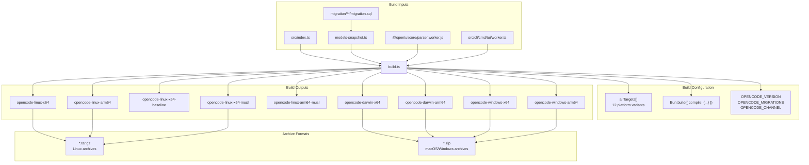
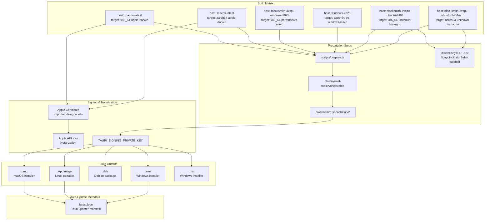
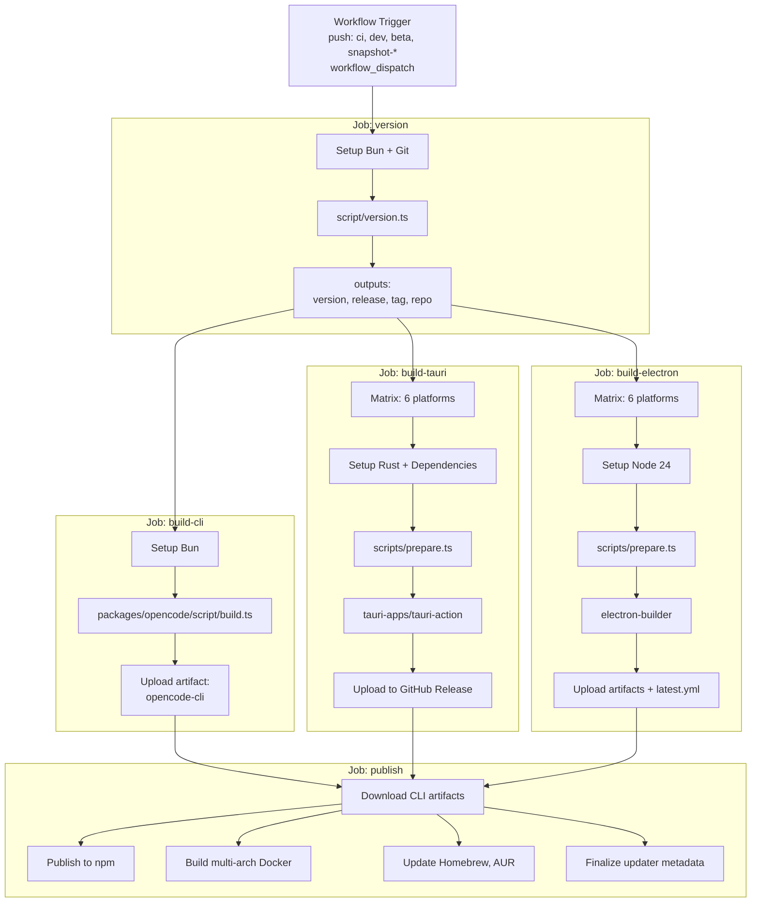
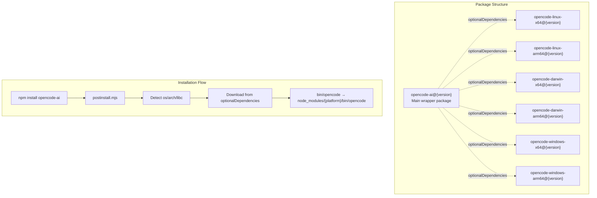
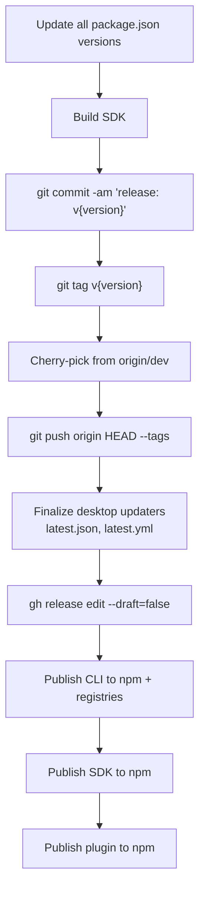

# Build & Release

<details>
<summary>Relevant source files</summary>

The following files were used as context for generating this wiki page:

- [.github/actions/setup-bun/action.yml](.github/actions/setup-bun/action.yml)
- [.github/actions/setup-git-committer/action.yml](.github/actions/setup-git-committer/action.yml)
- [.github/workflows/deploy.yml](.github/workflows/deploy.yml)
- [.github/workflows/generate.yml](.github/workflows/generate.yml)
- [.github/workflows/publish-vscode.yml](.github/workflows/publish-vscode.yml)
- [.github/workflows/publish.yml](.github/workflows/publish.yml)
- [.github/workflows/sign-cli.yml](.github/workflows/sign-cli.yml)
- [.github/workflows/test.yml](.github/workflows/test.yml)
- [.github/workflows/typecheck.yml](.github/workflows/typecheck.yml)
- [package.json](package.json)
- [packages/opencode/script/build.ts](packages/opencode/script/build.ts)
- [packages/opencode/script/publish.ts](packages/opencode/script/publish.ts)
- [packages/opencode/src/bun/registry.ts](packages/opencode/src/bun/registry.ts)
- [packages/opencode/test/mcp/oauth-browser.test.ts](packages/opencode/test/mcp/oauth-browser.test.ts)
- [packages/script/package.json](packages/script/package.json)
- [packages/script/src/index.ts](packages/script/src/index.ts)
- [script/format.ts](script/format.ts)
- [script/generate.ts](script/generate.ts)
- [script/publish.ts](script/publish.ts)
- [sdks/vscode/script/publish](sdks/vscode/script/publish)

</details>

This document describes OpenCode's multi-platform build system, CI/CD pipeline, and distribution strategy. The build process produces standalone CLI binaries for 12+ platform variants, desktop applications for 6 platforms (via both Tauri and Electron), and distributes them through 8+ package managers. For information about Nix-specific builds, see [Nix Builds](#8.2). For the complete release pipeline workflow, see [Release Pipeline](#8.1).

## Overview

OpenCode uses a comprehensive build and release system that targets maximum platform coverage. The system is built around three primary artifacts:

| Artifact Type    | Build Tool       | Platform Count | Distribution                    |
| ---------------- | ---------------- | -------------- | ------------------------------- |
| CLI Binaries     | Bun Compile      | 12 variants    | npm, Homebrew, AUR, Nix, Docker |
| Tauri Desktop    | Tauri CLI + Rust | 6 platforms    | GitHub Releases, auto-update    |
| Electron Desktop | Electron Builder | 6 platforms    | GitHub Releases, auto-update    |

The build system is coordinated through GitHub Actions workflows that run on merge to `ci`, `dev`, `beta`, or `snapshot-*` branches, or via manual workflow dispatch.

**Sources:** [.github/workflows/publish.yml:1-448](), [package.json:1-115]()

## Build System Architecture

### CLI Binary Compilation

The CLI build process uses Bun's `compile` feature to create self-contained executables that bundle the entire OpenCode server and dependencies. The build is orchestrated by [packages/opencode/script/build.ts]().



The build targets are defined in the `allTargets` array:

| Platform | Architecture | ABI   | AVX2 | Binary Name                        |
| -------- | ------------ | ----- | ---- | ---------------------------------- |
| Linux    | x64          | glibc | ✓    | `opencode-linux-x64`               |
| Linux    | x64          | glibc | ✗    | `opencode-linux-x64-baseline`      |
| Linux    | arm64        | glibc | -    | `opencode-linux-arm64`             |
| Linux    | x64          | musl  | ✓    | `opencode-linux-x64-musl`          |
| Linux    | x64          | musl  | ✗    | `opencode-linux-x64-baseline-musl` |
| Linux    | arm64        | musl  | -    | `opencode-linux-arm64-musl`        |
| macOS    | x64          | -     | ✓    | `opencode-darwin-x64`              |
| macOS    | x64          | -     | ✗    | `opencode-darwin-x64-baseline`     |
| macOS    | arm64        | -     | -    | `opencode-darwin-arm64`            |
| Windows  | x64          | -     | ✓    | `opencode-windows-x64`             |
| Windows  | x64          | -     | ✗    | `opencode-windows-x64-baseline`    |
| Windows  | arm64        | -     | -    | `opencode-windows-arm64`           |

Each binary is compiled with platform-specific configuration [packages/opencode/script/build.ts:154-228]():

- **Compile target**: `bun-{os}-{arch}[-baseline][-{abi}]` passed to Bun's compile API
- **Outfile**: `dist/{name}/bin/opencode[.exe]`
- **Exec arguments**: `--user-agent=opencode/{version}`, `--use-system-ca`
- **Define constants**: `OPENCODE_VERSION`, `OPENCODE_MIGRATIONS`, `OPENCODE_CHANNEL`, `OPENCODE_LIBC`
- **Bundled workers**: Parser worker and TUI worker embedded using `$bunfs/root/` virtual path

The build process also generates a models snapshot before compilation [packages/opencode/script/build.ts:18-27]():

```typescript
// Fetches models.dev API data and generates static snapshot
const modelsData = await fetch(`${modelsUrl}/api.json`).then((x) => x.text())
await Bun.write(
  'src/provider/models-snapshot.ts',
  `export const snapshot = ${modelsData} as const\
`
)
```

**Sources:** [packages/opencode/script/build.ts:1-230](), [.github/workflows/publish.yml:70-104]()

### Desktop Application Builds

#### Tauri Build Process

Tauri desktop builds use the `tauri-apps/tauri-action` GitHub Action with Rust cross-compilation for native performance. The build matrix covers 6 platform combinations [.github/workflows/publish.yml:105-248]():



The Tauri build uses a custom action invocation [.github/workflows/publish.yml:222-247]():

```yaml
uses: tauri-apps/tauri-action@390cbe447412ced1303d35abe75287949e43437a
with:
  projectPath: packages/desktop
  args: --target ${{ matrix.settings.target }}
    --config ${{ (github.ref_name == 'beta' && './src-tauri/tauri.beta.conf.json')
    || './src-tauri/tauri.prod.conf.json' }}
  updaterJsonPreferNsis: true
  releaseId: ${{ needs.version.outputs.release }}
  tagName: ${{ needs.version.outputs.tag }}
  releaseDraft: true
```

For Linux builds, a custom tauri-cli version is installed from a specific branch to support truly portable AppImages [.github/workflows/publish.yml:197-213]().

**Sources:** [.github/workflows/publish.yml:105-248](), [packages/desktop/scripts/prepare.ts]()

#### Electron Build Process

Electron builds use `electron-builder` with similar cross-platform coverage [.github/workflows/publish.yml:249-371]():

| Platform | Architecture | Build Flag      |
| -------- | ------------ | --------------- |
| macOS    | x64          | `--mac --x64`   |
| macOS    | arm64        | `--mac --arm64` |
| Windows  | x64          | `--win`         |
| Windows  | arm64        | `--win --arm64` |
| Linux    | x64          | `--linux`       |
| Linux    | arm64        | `--linux`       |

The Electron build process [.github/workflows/publish.yml:323-365]():

1. **Prepare**: Run `scripts/prepare.ts` to download platform CLI binary
2. **Build**: Run `bun run build` to compile frontend with Vite
3. **Package**: Run `electron-builder` with platform flags
4. **Publish**: Upload to GitHub Releases (if release mode)
5. **Auto-update metadata**: Generate `latest*.yml` files

Auto-update metadata files are collected separately for final publishing [.github/workflows/publish.yml:366-370]():

```yaml
- uses: actions/upload-artifact@v4
  if: needs.version.outputs.release
  with:
    name: latest-yml-${{ matrix.settings.target }}
    path: packages/desktop-electron/dist/latest*.yml
```

**Sources:** [.github/workflows/publish.yml:249-371](), [packages/desktop-electron/scripts/prepare.ts]()

## CI/CD Pipeline

### Workflow Structure

The `publish` workflow orchestrates the entire build and release process [.github/workflows/publish.yml:1-448]():



**Sources:** [.github/workflows/publish.yml:33-448]()

### Version Job

The `version` job determines the version number and creates release metadata [.github/workflows/publish.yml:34-68]():

```typescript
// Executed by script/version.ts
const version = await (async () => {
  // Explicit version override
  if (env.OPENCODE_VERSION) return env.OPENCODE_VERSION

  // Preview version for non-latest channels
  if (IS_PREVIEW) return `0.0.0-${CHANNEL}-${timestamp()}`

  // Fetch latest from npm and bump
  const latest = await fetch('https://registry.npmjs.org/opencode-ai/latest')
  const [major, minor, patch] = latest.version.split('.')
  if (bump === 'major') return `${major + 1}.0.0`
  if (bump === 'minor') return `${major}.${minor + 1}.0`
  return `${major}.${minor}.${patch + 1}`
})()
```

The job outputs four critical values:

- `version`: The semantic version string (e.g., `1.2.3`)
- `release`: GitHub release ID if creating a release
- `tag`: Git tag name (e.g., `v1.2.3`)
- `repo`: Target repository (normal or beta)

**Sources:** [.github/workflows/publish.yml:34-68](), [script/version.ts](), [packages/script/src/index.ts:20-76]()

### Build Job Dependencies

Build jobs run in parallel after version is determined, with `publish` depending on all three build jobs completing [.github/workflows/publish.yml:372-378]():

```yaml
publish:
  needs:
    - version
    - build-cli
    - build-tauri
    - build-electron
```

This ensures all artifacts are available before distribution begins.

**Sources:** [.github/workflows/publish.yml:372-448]()

## Distribution Channels

### npm Registry Publishing

The CLI is published to npm as a wrapper package `opencode-ai` with platform-specific optional dependencies [packages/opencode/script/publish.ts:1-182]():



The wrapper package is constructed [packages/opencode/script/publish.ts:23-40]():

```typescript
await Bun.file(`./dist/${pkg.name}/package.json`).write(
  JSON.stringify({
    name: pkg.name + '-ai',
    bin: { [pkg.name]: `./bin/${pkg.name}` },
    scripts: {
      postinstall: 'bun ./postinstall.mjs || node ./postinstall.mjs',
    },
    version: version,
    optionalDependencies: binaries, // All platform packages
  })
)
```

Each platform package is published with OS and CPU constraints [packages/opencode/script/build.ts:203-214]():

```json
{
  "name": "opencode-linux-x64",
  "version": "1.2.3",
  "os": ["linux"],
  "cpu": ["x64"]
}
```

Publishing happens with channel tags [packages/opencode/script/publish.ts:42-50]():

```bash
npm publish *.tgz --access public --tag ${Script.channel}
# Script.channel is "latest", "beta", "dev", "ci", or snapshot branch name
```

**Sources:** [packages/opencode/script/publish.ts:1-50](), [packages/opencode/script/build.ts:203-216]()

### Docker Multi-Architecture Images

Docker images are built for `linux/amd64` and `linux/arm64` using `buildx` [packages/opencode/script/publish.ts:52-56]():

```bash
docker buildx build \
  --platform linux/amd64,linux/arm64 \
  -t ghcr.io/anomalyco/opencode:${version} \
  -t ghcr.io/anomalyco/opencode:${channel} \
  --push .
```

This creates two tags per release:

- Version-specific: `ghcr.io/anomalyco/opencode:1.2.3`
- Channel-specific: `ghcr.io/anomalyco/opencode:latest`

**Sources:** [packages/opencode/script/publish.ts:52-56](), [.github/workflows/publish.yml:384-395]()

### Native Package Managers

#### Homebrew

The Homebrew formula is generated and committed to `anomalyco/homebrew-tap` [packages/opencode/script/publish.ts:116-181]():

```ruby
class Opencode < Formula
  desc "The AI coding agent built for the terminal."
  homepage "https://github.com/anomalyco/opencode"
  version "1.2.3"
  depends_on "ripgrep"

  on_macos do
    if Hardware::CPU.intel?
      url "https://github.com/anomalyco/opencode/releases/download/v1.2.3/opencode-darwin-x64.zip"
      sha256 "abc123..."
    end
    if Hardware::CPU.arm?
      url "https://github.com/anomalyco/opencode/releases/download/v1.2.3/opencode-darwin-arm64.zip"
      sha256 "def456..."
    end
  end

  on_linux do
    # Similar structure for Linux x64/arm64
  end
end
```

The formula is automatically committed and pushed to the tap repository [packages/opencode/script/publish.ts:169-180]().

**Sources:** [packages/opencode/script/publish.ts:116-181]()

#### Arch User Repository (AUR)

The AUR package `opencode-bin` uses a PKGBUILD that downloads binaries from GitHub releases [packages/opencode/script/publish.ts:68-114]():

```bash
pkgname='opencode-bin'
pkgver=1.2.3
_subver=
pkgrel=1
pkgdesc='The AI coding agent built for the terminal.'
arch=('aarch64' 'x86_64')
depends=('ripgrep')

source_aarch64=("${pkgname}_${pkgver}_aarch64.tar.gz::https://github.com/anomalyco/opencode/releases/download/v${pkgver}${_subver}/opencode-linux-arm64.tar.gz")
sha256sums_aarch64=('...')

source_x86_64=("${pkgname}_${pkgver}_x86_64.tar.gz::https://github.com/anomalyco/opencode/releases/download/v${pkgver}${_subver}/opencode-linux-x64.tar.gz")
sha256sums_x86_64=('...')

package() {
  install -Dm755 ./opencode "${pkgdir}/usr/bin/opencode"
}
```

The PKGBUILD is committed directly to `aur.archlinux.org/opencode-bin.git` using SSH authentication [packages/opencode/script/publish.ts:98-113]().

**Sources:** [packages/opencode/script/publish.ts:59-114](), [.github/workflows/publish.yml:420-437]()

## Auto-Update System

Desktop applications support automatic updates through platform-specific metadata files:

### Tauri Updater

Tauri uses `latest.json` manifest files [packages/desktop/scripts/finalize-latest-json.ts]():

```json
{
  "version": "1.2.3",
  "notes": "Release notes...",
  "pub_date": "2024-01-01T00:00:00Z",
  "platforms": {
    "darwin-x86_64": {
      "signature": "...",
      "url": "https://github.com/anomalyco/opencode/releases/download/v1.2.3/opencode-desktop-darwin-x64.app.tar.gz"
    },
    "darwin-aarch64": {
      /* ... */
    },
    "linux-x86_64": {
      /* ... */
    },
    "windows-x86_64": {
      /* ... */
    }
  }
}
```

The Tauri action automatically generates this file and uploads it to the release [.github/workflows/publish.yml:230-231]().

**Sources:** [.github/workflows/publish.yml:222-247](), [packages/desktop/scripts/finalize-latest-json.ts]()

### Electron Updater

Electron uses `latest.yml`, `latest-mac.yml`, and `latest-linux.yml` files:

```yaml
version: 1.2.3
files:
  - url: opencode-desktop-windows-x64-1.2.3.exe
    sha512: abc123...
    size: 123456789
path: opencode-desktop-windows-x64-1.2.3.exe
sha512: abc123...
releaseDate: '2024-01-01T00:00:00.000Z'
```

These files are collected from build artifacts and finalized by [packages/desktop-electron/scripts/finalize-latest-yml.ts](), then uploaded to GitHub releases [script/publish.ts:70-71]().

**Sources:** [.github/workflows/publish.yml:366-370](), [packages/desktop-electron/scripts/finalize-latest-yml.ts](), [script/publish.ts:70-71]()

## Version Management

### Script Utility

The `@opencode-ai/script` package provides version management logic used across all build scripts [packages/script/src/index.ts:1-78]():

```typescript
export const Script = {
  get channel(): string {
    // Returns: "latest", "beta", "dev", "ci", or snapshot branch
    if (OPENCODE_CHANNEL) return OPENCODE_CHANNEL
    if (OPENCODE_BUMP) return 'latest'
    return git_branch_name
  },

  get version(): string {
    // Returns semantic version or preview version
    if (OPENCODE_VERSION) return OPENCODE_VERSION
    if (IS_PREVIEW) return `0.0.0-${channel}-${timestamp}`
    return npm_bumped_version
  },

  get preview(): boolean {
    return channel !== 'latest'
  },

  get release(): boolean {
    return !!OPENCODE_RELEASE
  },
}
```

Environment variables control the build:

| Variable           | Purpose               | Example                   |
| ------------------ | --------------------- | ------------------------- |
| `OPENCODE_VERSION` | Override version      | `1.2.3`                   |
| `OPENCODE_BUMP`    | Bump type             | `major`, `minor`, `patch` |
| `OPENCODE_CHANNEL` | Distribution channel  | `latest`, `beta`          |
| `OPENCODE_RELEASE` | Create GitHub release | `true`                    |

**Sources:** [packages/script/src/index.ts:20-76]()

### Preview Versions

Preview versions for non-latest channels use timestamp-based identifiers [packages/script/src/index.ts:34-36]():

```typescript
if (IS_PREVIEW) {
  return `0.0.0-${CHANNEL}-${new Date().toISOString().slice(0, 16).replace(/[-:T]/g, '')}`
}
// Example: 0.0.0-beta-202401011200
```

This ensures preview builds are always treated as pre-releases and sorted correctly by semver.

**Sources:** [packages/script/src/index.ts:26-48]()

### Release Flow

The complete release flow for a production release [script/publish.ts:60-74]():



The root `script/publish.ts` coordinates publishing of multiple packages [script/publish.ts:76-84]():

```typescript
await import(`../packages/opencode/script/publish.ts`)
await import(`../packages/sdk/js/script/publish.ts`)
await import(`../packages/plugin/script/publish.ts`)
```

**Sources:** [script/publish.ts:1-87](), [.github/workflows/publish.yml:372-448]()

## Build Optimization

### Caching Strategy

The CI pipeline uses multiple caching layers:

| Cache Type        | Key                                   | Scope        | Purpose                   |
| ----------------- | ------------------------------------- | ------------ | ------------------------- |
| Bun dependencies  | `bun-${{ hashFiles('**/bun.lock') }}` | Global       | Node modules cache        |
| Rust dependencies | `rust-${{ matrix.settings.target }}`  | Per-platform | Cargo cache for Tauri     |
| APT packages      | `apt-${{ matrix.settings.target }}`   | Per-platform | Linux system dependencies |

**Sources:** [.github/actions/setup-bun/action.yml:26-37](), [.github/workflows/publish.yml:159-174](), [.github/workflows/publish.yml:299-314]()

### Parallel Execution

Build jobs run in parallel using matrix strategies:

- **CLI**: Single job, sequential builds for 12 platforms
- **Tauri**: 6 parallel jobs (one per platform)
- **Electron**: 6 parallel jobs (one per platform)

This reduces total build time from ~2 hours sequential to ~30 minutes parallel.

**Sources:** [.github/workflows/publish.yml:105-127](), [.github/workflows/publish.yml:254-277]()

### Baseline Binary Strategy

For x64 platforms, both baseline (no AVX2) and optimized binaries are built [packages/opencode/script/build.ts:63-124]():

```typescript
{
  os: "linux",
  arch: "x64",
  avx2: false  // Baseline build
},
{
  os: "linux",
  arch: "x64"  // Optimized build (default)
}
```

The baseline builds ensure compatibility with older CPUs while optimized builds provide better performance on modern hardware.

**Sources:** [packages/opencode/script/build.ts:63-145]()
