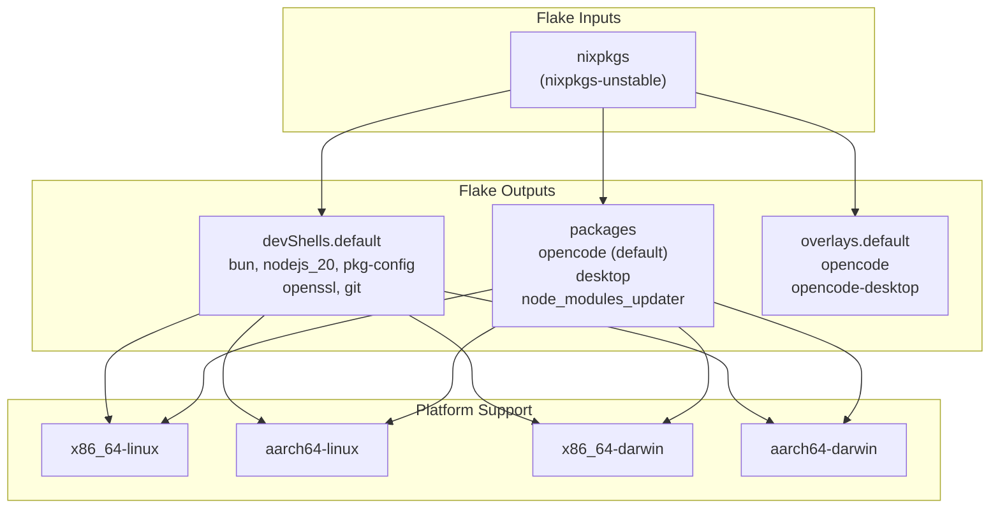
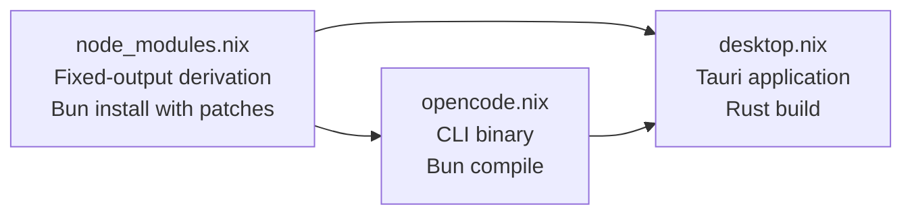
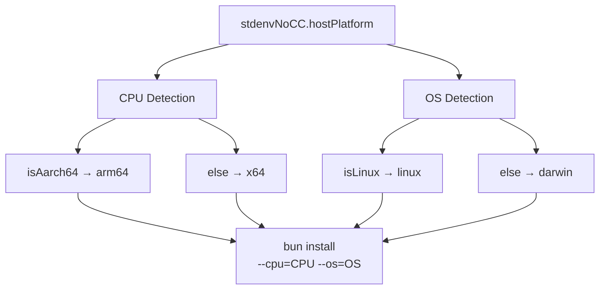
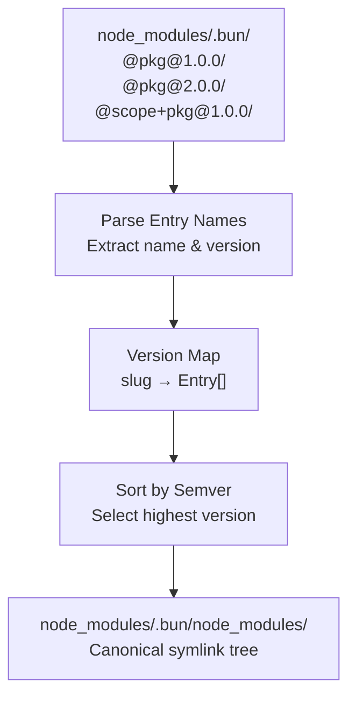
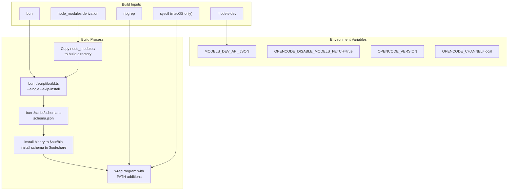
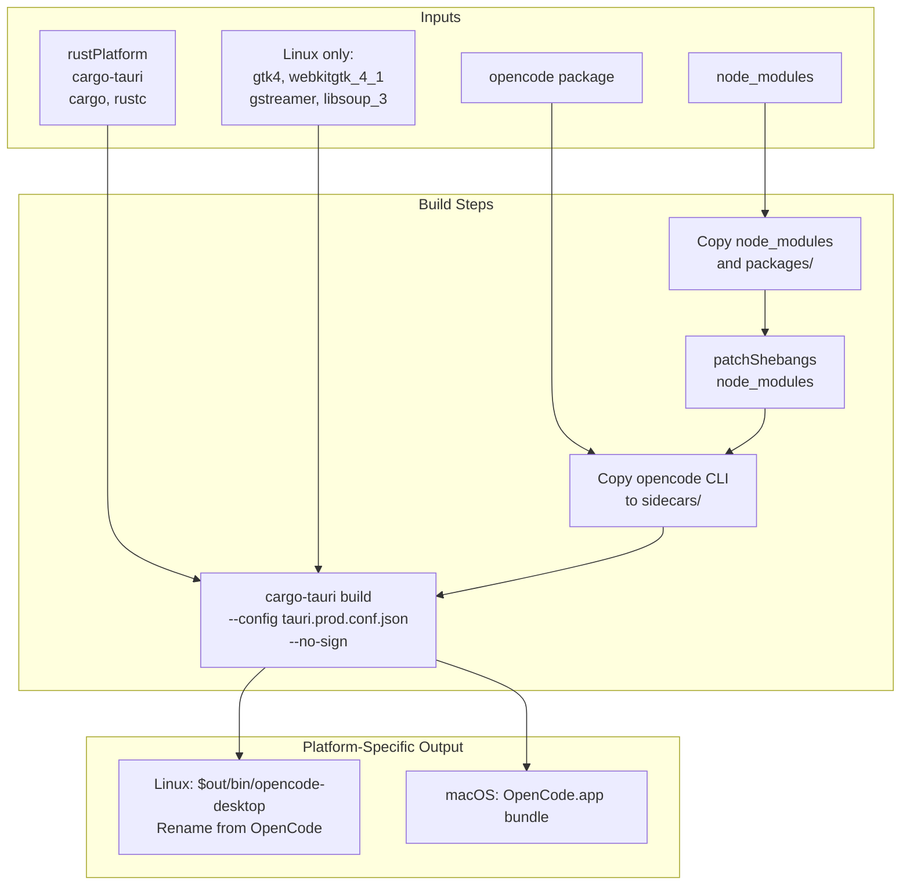
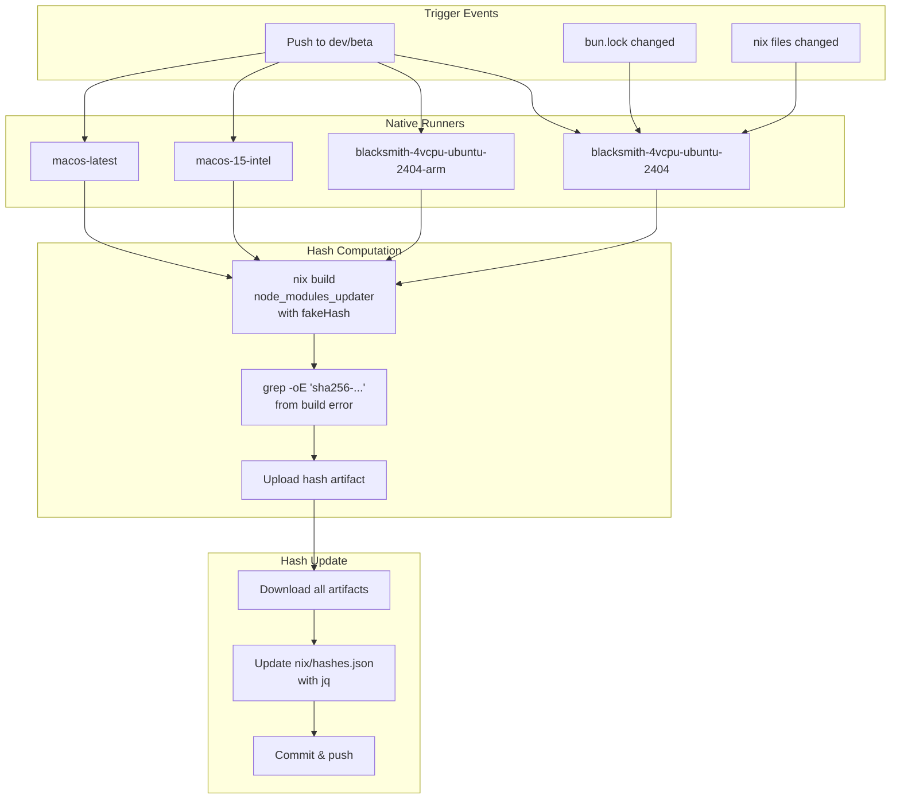

# Nix Builds

<details>
<summary>Relevant source files</summary>

The following files were used as context for generating this wiki page:

- [.gitignore](.gitignore)
- [flake.lock](flake.lock)
- [flake.nix](flake.nix)
- [nix/desktop.nix](nix/desktop.nix)
- [nix/hashes.json](nix/hashes.json)
- [nix/opencode.nix](nix/opencode.nix)
- [nix/scripts/canonicalize-node-modules.ts](nix/scripts/canonicalize-node-modules.ts)
- [nix/scripts/normalize-bun-binaries.ts](nix/scripts/normalize-bun-binaries.ts)

</details>

This document describes the Nix-based build infrastructure for OpenCode, which provides reproducible builds across multiple platforms and architectures. The Nix build system is separate from the primary release pipeline (see [Release Pipeline](#8.1)) and offers an alternative packaging method for NixOS users and reproducible development environments.

The Nix infrastructure builds both the CLI (`opencode`) and desktop application (`opencode-desktop`) packages for four platforms: `x86_64-linux`, `aarch64-linux`, `x86_64-darwin`, and `aarch64-darwin`.

## Flake Structure

The OpenCode Nix flake provides development shells, package outputs, and an overlay for integration with NixOS configurations.

### Flake Inputs and Outputs



**Sources:** [flake.nix:1-76]()

The flake defines outputs using `forEachSystem` to generate packages and shells for all four supported platforms. The `devShells.default` provides a development environment with Bun, Node.js 20, and native build dependencies.

### Package Dependencies



**Sources:** [flake.nix:33-50](), [flake.nix:53-74]()

The overlay and packages sections create three derivations with dependencies:

- `node_modules`: Fixed-output derivation containing all workspace dependencies
- `opencode`: CLI package built from `node_modules`
- `desktop`: Tauri desktop app requiring both `node_modules` and `opencode` (as sidecar binary)

## Node Modules Build Process

The node modules build is the foundation of the Nix packaging system, creating a reproducible cache of all workspace dependencies.

### Build Pipeline

| Phase                | Operation                                  | Purpose                                                                                                              |
| -------------------- | ------------------------------------------ | -------------------------------------------------------------------------------------------------------------------- |
| Source Filtering     | `lib.fileset.toSource`                     | Include only required files: `packages/`, `bun.lock`, `package.json`, `patches/`, `install/`, `.github/TEAM_MEMBERS` |
| Bun Install          | `bun install --cpu --os --frozen-lockfile` | Install dependencies for target platform                                                                             |
| Canonicalization     | `canonicalize-node-modules.ts`             | Normalize `.bun/` directory structure                                                                                |
| Binary Normalization | `normalize-bun-binaries.ts`                | Create consistent `.bin/` symlinks                                                                                   |
| Hashing              | `outputHash` from `hashes.json`            | Fixed-output derivation with platform-specific hash                                                                  |

**Sources:** [nix/node_modules.nix:1-84]()

### Bun Platform Flags

The build uses Bun's cross-compilation flags to ensure consistent binary formats:



**Sources:** [nix/node_modules.nix:17-19](), [nix/node_modules.nix:48-62]()

### Canonicalization Process

The `canonicalize-node-modules.ts` script normalizes Bun's `.bun/` directory structure to create deterministic builds.



**Sources:** [nix/scripts/canonicalize-node-modules.ts:1-102]()

The script:

1. Reads all directories in `node_modules/.bun/` [nix/scripts/canonicalize-node-modules.ts:20-39]()
2. Parses package names and versions from directory names [nix/scripts/canonicalize-node-modules.ts:90-101]()
3. Groups by package slug and sorts by semantic version [nix/scripts/canonicalize-node-modules.ts:41-54]()
4. Creates symlinks in `node_modules/.bun/node_modules/` pointing to the selected versions [nix/scripts/canonicalize-node-modules.ts:56-79]()

### Binary Normalization

The `normalize-bun-binaries.ts` script rebuilds `.bin/` directories to ensure consistent binary linking.

**Sources:** [nix/scripts/normalize-bun-binaries.ts:1-131]()

For each Bun entry directory:

1. Remove existing `.bin/` directory [nix/scripts/normalize-bun-binaries.ts:18-21]()
2. Scan all packages for `bin` fields in `package.json` [nix/scripts/normalize-bun-binaries.ts:23-45]()
3. Create normalized symlinks from `.bin/<name>` to the package's binary target [nix/scripts/normalize-bun-binaries.ts:85-104]()

## OpenCode CLI Build

The `opencode.nix` derivation builds the CLI binary using the prepared `node_modules`.

### Build Environment



**Sources:** [nix/opencode.nix:1-97]()

### Build Phases

| Phase        | Script                                          | Output                                                 |
| ------------ | ----------------------------------------------- | ------------------------------------------------------ |
| Configure    | Copy `node_modules` to build directory          | Writable workspace                                     |
| Build        | `bun ./script/build.ts --single --skip-install` | `dist/opencode-*/bin/opencode`                         |
| Build        | `bun ./script/schema.ts schema.json`            | JSON schema for validation                             |
| Install      | Install binary and schema                       | `$out/bin/opencode`, `$out/share/opencode/schema.json` |
| Wrap         | Add runtime dependencies to PATH                | Wrapped binary with `ripgrep` and `sysctl`             |
| Post-install | Generate shell completions                      | Bash and Zsh completion scripts                        |

**Sources:** [nix/opencode.nix:28-76]()

The build disables model fetching by setting `OPENCODE_DISABLE_MODELS_FETCH=true` and points to the nixpkgs `models-dev` package via `MODELS_DEV_API_JSON` [nix/opencode.nix:36-39]().

### Install Check

The derivation includes version checking to validate the built binary:

**Sources:** [nix/opencode.nix:78-84]()

```
doInstallCheck = true
versionCheckProgramArg = "--version"
```

This runs `opencode --version` during the build to ensure the binary executes correctly.

## Desktop Application Build

The `desktop.nix` derivation builds the Tauri desktop application using Rust and the OpenCode CLI as a sidecar.

### Desktop Build Architecture



**Sources:** [nix/desktop.nix:1-100]()

### Sidecar Integration

The desktop app embeds the OpenCode CLI as a sidecar binary:

**Sources:** [nix/desktop.nix:68-76]()

```
mkdir -p packages/desktop/src-tauri/sidecars
cp ${opencode}/bin/opencode packages/desktop/src-tauri/sidecars/opencode-cli-${stdenv.hostPlatform.rust.rustcTarget}
```

The sidecar filename includes the Rust target triple (e.g., `opencode-cli-x86_64-unknown-linux-gnu`) to match Tauri's expectations.

### Linux Binary Renaming

On Linux, the output binary is renamed to avoid case-sensitivity conflicts:

**Sources:** [nix/desktop.nix:85-91]()

```
mv $out/bin/OpenCode $out/bin/opencode-desktop
sed -i 's|^Exec=OpenCode$|Exec=opencode-desktop|' $out/share/applications/OpenCode.desktop
```

This ensures the desktop app binary name doesn't conflict with the CLI on case-insensitive filesystems.

## Hash Management System

The hash management system automates the updating of platform-specific hashes for the `node_modules` fixed-output derivation.

### Hash Computation Workflow



**Sources:** [.github/workflows/nix-hashes.yml:1-149]()

### Why Native Runners Are Required

The workflow comment explains the technical constraint:

**Sources:** [.github/workflows/nix-hashes.yml:21-22]()

> Native runners required: bun install cross-compilation flags (--os/--cpu) do not produce byte-identical node_modules as native installs.

Bun's cross-compilation produces slightly different output than native installs, so each platform must build its own `node_modules` to get the correct hash.

### Fake Hash Technique

The hash computation uses Nix's fake hash mechanism:

**Sources:** [flake.nix:69-72](), [.github/workflows/nix-hashes.yml:46-68]()

1. Override `node_modules` derivation with `lib.fakeHash`
2. Attempt to build - Nix fails with hash mismatch
3. Extract the expected hash from the error message: `grep -oE 'sha256-[A-Za-z0-9+/=]+'`
4. Upload the hash as an artifact

### Hash Storage Format

The `hashes.json` file stores hashes by platform:

**Sources:** [nix/hashes.json:1-9]()

```json
{
  "nodeModules": {
    "x86_64-linux": "sha256-c99eE1cKAQHvwJosaFo42U9Hk0Rtp/U5oTTlyiz2Zw4=",
    "aarch64-linux": "sha256-LbdssPrf8Bijyp4mRo8QaO/swxwUWSo1g0jLPm2rvUA=",
    "aarch64-darwin": "sha256-0L9y6Zk4l2vAxsM2bENahhtRZY1C3XhdxLgnnYlhkkY=",
    "x86_64-darwin": "sha256-0J5sFG/kHHRDcTpdpdPBMJEOHwCRnAUYmbxEHPPLDvU="
  }
}
```

The `node_modules.nix` derivation reads this file to get the hash for the current platform [nix/node_modules.nix:6-10]().

## Build Workflow Integration

The Nix build system integrates with the development workflow through multiple entry points.

### Development Shell Usage

Developers can enter a Nix development shell with all required dependencies:

```bash
nix develop
```

This provides `bun`, `nodejs_20`, `pkg-config`, `openssl`, and `git` without system installation.

**Sources:** [flake.nix:21-31]()

### Package Installation

Users can install OpenCode via Nix flakes:

```bash
# Install CLI
nix profile install github:anomalyco/opencode

# Install desktop app
nix profile install github:anomalyco/opencode#desktop

# Build locally
nix build
```

**Sources:** [flake.nix:53-74]()

### NixOS System Integration

The overlay enables system-wide installation on NixOS:

```nix
# flake.nix
{
  inputs.opencode.url = "github:anomalyco/opencode";

  outputs = { self, nixpkgs, opencode }: {
    nixosConfigurations.mySystem = nixpkgs.lib.nixosSystem {
      modules = [{
        nixpkgs.overlays = [ opencode.overlays.default ];
        environment.systemPackages = [ pkgs.opencode ];
      }];
    };
  };
}
```

**Sources:** [flake.nix:33-51]()

### Automated Hash Updates

The hash update workflow runs automatically on relevant changes:

| Trigger                | Files Monitored                |
| ---------------------- | ------------------------------ |
| Push to dev/beta       | All monitored files            |
| `bun.lock` changes     | Dependency lock changes        |
| `package.json` changes | Workspace or package manifests |
| `nix/**` changes       | Nix derivations and scripts    |
| `patches/**` changes   | Bun patches                    |

**Sources:** [.github/workflows/nix-hashes.yml:6-18]()

When triggered, the workflow:

1. Computes hashes on all four native runners in parallel [.github/workflows/nix-hashes.yml:23-75]()
2. Collects artifacts from each platform [.github/workflows/nix-hashes.yml:100-105]()
3. Updates `nix/hashes.json` using `jq` [.github/workflows/nix-hashes.yml:106-127]()
4. Commits the changes with message "chore: update nix node_modules hashes" [.github/workflows/nix-hashes.yml:128-149]()
