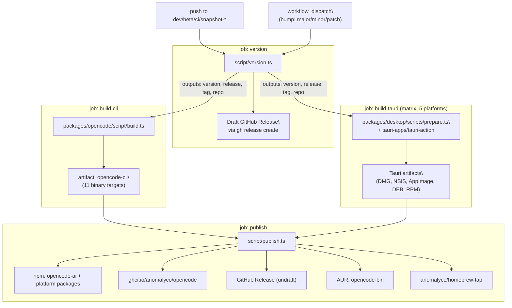
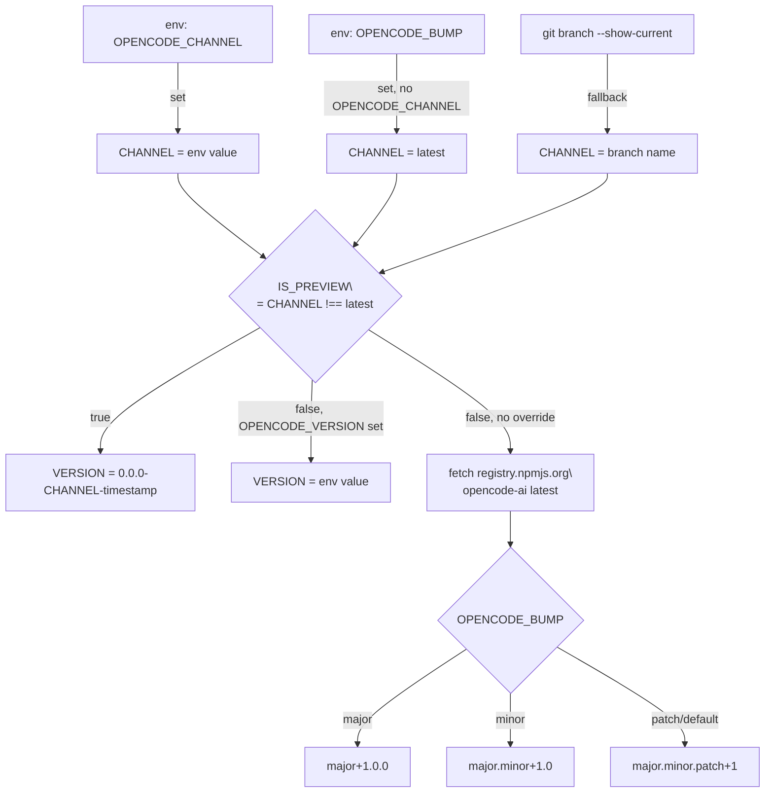
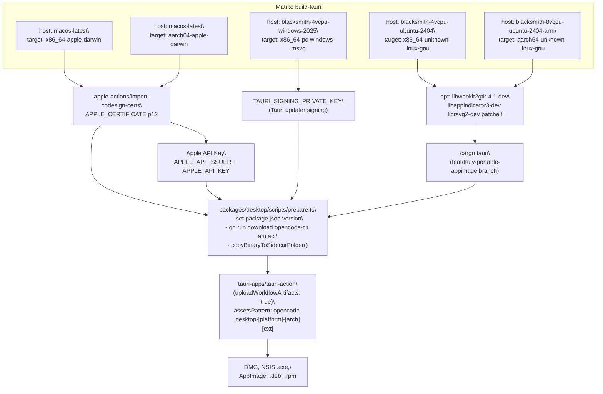
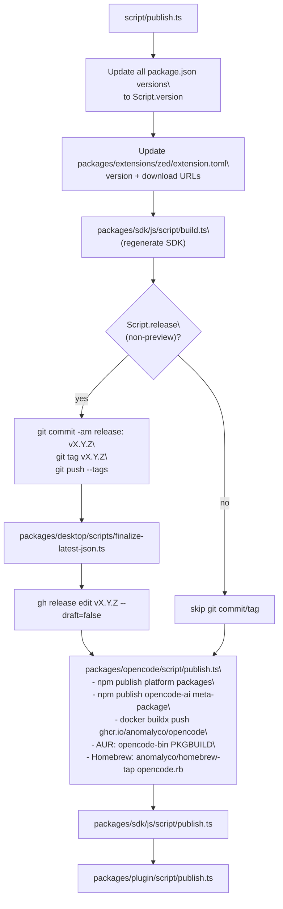

# Release Pipeline

Relevant source files

The following files were used as context for generating this wiki page:

- [.github/actions/setup-bun/action.yml](.github/actions/setup-bun/action.yml)
- [.github/actions/setup-git-committer/action.yml](.github/actions/setup-git-committer/action.yml)
- [.github/workflows/deploy.yml](.github/workflows/deploy.yml)
- [.github/workflows/generate.yml](.github/workflows/generate.yml)
- [.github/workflows/publish-vscode.yml](.github/workflows/publish-vscode.yml)
- [.github/workflows/publish.yml](.github/workflows/publish.yml)
- [.github/workflows/sign-cli.yml](.github/workflows/sign-cli.yml)
- [.github/workflows/test.yml](.github/workflows/test.yml)
- [.github/workflows/typecheck.yml](.github/workflows/typecheck.yml)
- [package.json](package.json)
- [packages/opencode/script/build.ts](packages/opencode/script/build.ts)
- [packages/opencode/script/publish.ts](packages/opencode/script/publish.ts)
- [packages/opencode/src/bun/registry.ts](packages/opencode/src/bun/registry.ts)
- [packages/opencode/test/mcp/oauth-browser.test.ts](packages/opencode/test/mcp/oauth-browser.test.ts)
- [packages/script/package.json](packages/script/package.json)
- [packages/script/src/index.ts](packages/script/src/index.ts)
- [script/format.ts](script/format.ts)
- [script/generate.ts](script/generate.ts)
- [script/publish.ts](script/publish.ts)
- [sdks/vscode/script/publish](sdks/vscode/script/publish)

This page documents the GitHub Actions `publish` workflow that builds, versions, and distributes every opencode artifact. It covers version determination, CLI compilation, Tauri desktop compilation, code signing, and publishing to npm, Docker Hub (GHCR), GitHub Releases, AUR, and Homebrew.

For information on Nix-based reproducible builds, see [8.2](#8.2). For the desktop app's Rust/Tauri structure, see [3.3](#3.3).

---

## Workflow Overview

The pipeline is defined in [.github/workflows/publish.yml](.github/workflows/publish.yml:1-311)(). It is structured as four sequential/parallel jobs:

**Pipeline Job Flow**

Sources: [.github/workflows/publish.yml:33-311]()

### Triggers

| Trigger                            | Channel               | Version Format                         |
| ---------------------------------- | --------------------- | -------------------------------------- |
| Push to `dev`                      | `dev` (preview)       | `0.0.0-dev-YYYYMMDDTHHMM`              |
| Push to `beta`                     | `beta` (preview)      | `0.0.0-beta-YYYYMMDDTHHMM`             |
| Push to `snapshot-*`               | branch name (preview) | `0.0.0-<branch>-YYYYMMDDTHHMM`         |
| Push to `ci`                       | `ci` (preview)        | `0.0.0-ci-YYYYMMDDTHHMM`               |
| `workflow_dispatch` with `bump`    | `latest`              | semver increment of latest npm version |
| `workflow_dispatch` with `version` | `latest`              | exact override string                  |

Sources: [.github/workflows/publish.yml:4-27](), [packages/script/src/index.ts:25-47]()

---

## Version & Channel Logic

The `@opencode-ai/script` package ([packages/script/src/index.ts]()) exports the `Script` object, which is the shared source of truth for `version`, `channel`, `preview`, and `release` flags used by all build and publish scripts.

**Script Module: Version Resolution**

Sources: [packages/script/src/index.ts:25-75]()

### `script/version.ts` Job

For non-preview releases, `script/version.ts` runs `changelog.ts` to generate release notes, then creates a **draft** GitHub release with those notes. The `databaseId` and `tagName` of the draft release are passed to downstream jobs as `release` and `tag` outputs.

For the `beta` channel, the draft is created in the separate `anomalyco/opencode-beta` repository.

Sources: [script/version.ts:1-35]()

---

## Changelog Generation

`script/changelog.ts` generates human-readable release notes automatically.

| Function                  | Purpose                                                                                                                     |
| ------------------------- | --------------------------------------------------------------------------------------------------------------------------- |
| `getLatestRelease()`      | Fetches the most recent published (non-draft) GitHub release tag                                                            |
| `getCommits()`            | Lists commits between two refs touching relevant packages; filters `ignore:`, `test:`, `chore:`, `ci:`, `release:` prefixes |
| `filterRevertedCommits()` | Removes commit/revert pairs from the list                                                                                   |
| `generateChangelog()`     | Sends each commit message to the opencode agent for summarization (batches of 10)                                           |
| `getContributors()`       | Identifies non-team contributors for attribution                                                                            |
| `buildNotes()`            | Orchestrates the above; returns `string[]` of markdown lines                                                                |

Commits are classified into sections by the package path they touch:

| Package path prefix                    | Section    |
| -------------------------------------- | ---------- |
| `packages/opencode/src/cli/cmd/`       | TUI        |
| `packages/opencode/`                   | Core       |
| `packages/desktop/src-tauri/`          | Desktop    |
| `packages/desktop/`, `packages/app/`   | Desktop    |
| `packages/sdk/`, `packages/plugin/`    | SDK        |
| `packages/extensions/`, `sdks/vscode/` | Extensions |

Sources: [script/changelog.ts:1-306]()

---

## CLI Build

The `build-cli` job runs `packages/opencode/script/build.ts` on a single Ubuntu runner. It compiles the `opencode` binary for all target platforms using `Bun.build` with `compile: true`, then uploads the results as the `opencode-cli` workflow artifact.

### Build Targets

| Target Name                        | OS      | Arch  | ABI   | AVX2 |
| ---------------------------------- | ------- | ----- | ----- | ---- |
| `opencode-linux-arm64`             | linux   | arm64 | glibc | ✓    |
| `opencode-linux-x64`               | linux   | x64   | glibc | ✓    |
| `opencode-linux-x64-baseline`      | linux   | x64   | glibc | ✗    |
| `opencode-linux-arm64-musl`        | linux   | arm64 | musl  | ✓    |
| `opencode-linux-x64-musl`          | linux   | x64   | musl  | ✓    |
| `opencode-linux-x64-baseline-musl` | linux   | x64   | musl  | ✗    |
| `opencode-darwin-arm64`            | macOS   | arm64 | —     | ✓    |
| `opencode-darwin-x64`              | macOS   | x64   | —     | ✓    |
| `opencode-darwin-x64-baseline`     | macOS   | x64   | —     | ✗    |
| `opencode-windows-x64`             | Windows | x64   | —     | ✓    |
| `opencode-windows-x64-baseline`    | Windows | x64   | —     | ✗    |

Sources: [packages/opencode/script/build.ts:63-120]()

### Build Process

Before compilation, `build.ts` performs two pre-build steps:

1. **Models snapshot**: Fetches `https://models.dev/api.json` and writes `src/provider/models-snapshot.ts` with the data inlined.
2. **Migration loading**: Reads all SQL migration files from `migration/` and serializes them into the binary via the `OPENCODE_MIGRATIONS` define.

Each binary is compiled with:

- `OPENCODE_VERSION`, `OPENCODE_CHANNEL`, `OPENCODE_LIBC`, `OPENCODE_MIGRATIONS` baked in as defines
- Entry points: `src/index.ts`, the `@opentui/core` parser worker, and the TUI worker
- `autoloadBunfig: false`, `autoloadDotenv: false` (no runtime config loading)
- `--user-agent=opencode/<version>` injected into exec args

For releases (`Script.release === true`), archives are created (`.tar.gz` for Linux, `.zip` for others) and uploaded to the draft GitHub release via `gh release upload`.

Sources: [packages/opencode/script/build.ts:1-224]()

---

## Tauri Desktop Build

The `build-tauri` job runs in parallel with `build-cli` across a matrix of five platform/target combinations.

**Tauri Build Matrix and Signing**

Sources: [.github/workflows/publish.yml:106-242](), [packages/desktop/scripts/prepare.ts:1-20](), [packages/desktop/scripts/utils.ts:1-53]()

### Sidecar Binary Mapping

`prepare.ts` downloads the `opencode-cli` artifact from the current run and places the correct binary into `src-tauri/sidecars/` before Tauri bundles it. The mapping between Rust targets and CLI binary names is defined in `SIDECAR_BINARIES` in `packages/desktop/scripts/utils.ts`:

| Rust Target                 | CLI Binary                      | Archive Format |
| --------------------------- | ------------------------------- | -------------- |
| `aarch64-apple-darwin`      | `opencode-darwin-arm64`         | `.zip`         |
| `x86_64-apple-darwin`       | `opencode-darwin-x64-baseline`  | `.zip`         |
| `x86_64-pc-windows-msvc`    | `opencode-windows-x64-baseline` | `.zip`         |
| `x86_64-unknown-linux-gnu`  | `opencode-linux-x64-baseline`   | `.tar.gz`      |
| `aarch64-unknown-linux-gnu` | `opencode-linux-arm64`          | `.tar.gz`      |

Sources: [packages/desktop/scripts/utils.ts:3-29]()

### Tauri Updater (`latest.json`)

After the Tauri builds are complete, `packages/desktop/scripts/finalize-latest-json.ts` is run during the `publish` job. It:

1. Fetches the draft release's existing `latest.json`
2. Fetches `.sig` files for each platform artifact
3. Assembles a complete `platforms` map with `url` and `signature` per target
4. Uploads the finalized `latest.json` back to the release via `gh release upload --clobber`

This file is consumed by Tauri's built-in updater plugin via the endpoint configured in `tauri.prod.conf.json` / `tauri.beta.conf.json`.

Sources: [packages/desktop/scripts/finalize-latest-json.ts:1-157](), [packages/desktop/src-tauri/tauri.beta.conf.json:29-30]()

---

## Publish Step

The `publish` job runs `script/publish.ts` after both build jobs succeed. It coordinates all publishing actions.

**Publish Script Execution Order**

Sources: [script/publish.ts:1-86]()

### npm Package Structure

The CLI is published as a set of optional platform packages under a meta-package named `opencode-ai`. Each platform binary is its own npm package. On install, the `postinstall.mjs` script selects the correct platform binary.

**npm Package Layout**

```mermaid
flowchart TD
    META["opencode-ai\
(meta-package)"] -->|"optionalDependencies"| LP1["opencode-linux-arm64"]
    META -->|"optionalDependencies"| LP2["opencode-linux-x64"]
    META -->|"optionalDependencies"| LP3["opencode-linux-x64-baseline"]
    META -->|"optionalDependencies"| LP4["opencode-linux-arm64-musl"]
    META -->|"optionalDependencies"| LP5["opencode-linux-x64-musl"]
    META -->|"optionalDependencies"| LP6["opencode-linux-x64-baseline-musl"]
    META -->|"optionalDependencies"| DP1["opencode-darwin-arm64"]
    META -->|"optionalDependencies"| DP2["opencode-darwin-x64"]
    META -->|"optionalDependencies"| DP3["opencode-darwin-x64-baseline"]
    META -->|"optionalDependencies"| WP1["opencode-windows-x64"]
    META -->|"optionalDependencies"| WP2["opencode-windows-x64-baseline"]

    META -->|"scripts.postinstall"| POST["postinstall.mjs\
bun ./postinstall.mjs || node ./postinstall.mjs"]
    META -->|"bin.opencode"| BIN["./bin/opencode"]
```

Sources: [packages/opencode/script/publish.ts:23-50]()

The npm tag used for all packages is `Script.channel` — e.g. `latest` for stable releases and `dev` / `beta` for preview builds.

### Docker

The Docker image is built and pushed in `packages/opencode/script/publish.ts` using `docker buildx build`:

- **Image**: `ghcr.io/anomalyco/opencode`
- **Platforms**: `linux/amd64,linux/arm64`
- **Tags**: `<version>` and `<channel>` (e.g., `latest`)
- **Base image**: Alpine (see [packages/opencode/Dockerfile]())
- **Binaries used**: `opencode-linux-x64-baseline-musl` (amd64), `opencode-linux-arm64-musl` (arm64)

Sources: [packages/opencode/script/publish.ts:52-56](), [packages/opencode/Dockerfile:1-18]()

### AUR (Arch Linux)

For non-preview releases only, `packages/opencode/script/publish.ts` generates a `PKGBUILD` for the `opencode-bin` AUR package. The script:

1. Computes `sha256sum` of the Linux x64 and arm64 `.tar.gz` archives
2. Writes a new `PKGBUILD` pointing to the GitHub Release download URLs
3. Runs `makepkg --printsrcinfo` to generate `.SRCINFO`
4. Commits and pushes to `aur.archlinux.org/opencode-bin.git` via SSH (`AUR_KEY` secret)

The loop retries up to 30 times to handle AUR push conflicts.

Sources: [packages/opencode/script/publish.ts:59-113]()

### Homebrew

For non-preview releases, a Ruby formula is generated and pushed to `anomalyco/homebrew-tap` (the `opencode.rb` file). The formula covers macOS (x64 + arm64) and Linux (x64 + arm64) using the GitHub Release ZIP/tar.gz assets, with SHA256 checksums computed from the downloaded archives.

Sources: [packages/opencode/script/publish.ts:116-180]()

---

## Install Script

The `install` shell script (served at `https://opencode.ai/install`) is an alternative to npm/Homebrew installation. It:

1. Detects OS (`darwin`, `linux`, `windows`) and architecture (`x64`, `arm64`)
2. On macOS: checks Rosetta 2 translation and redirects `x64` to `arm64` if running under Rosetta
3. On Linux: detects musl libc (Alpine or `ldd --version` containing "musl")
4. On x64: checks AVX2 support via `/proc/cpuinfo` (Linux), `hw.optional.avx2_0` (macOS), or `IsProcessorFeaturePresent(40)` (Windows) — selects a `-baseline` binary if AVX2 is absent
5. Downloads the matching archive from GitHub Releases to a temp directory
6. Extracts and installs the binary to `~/.opencode/bin/opencode`
7. Appends `export PATH=~/.opencode/bin:$PATH` to the detected shell config file

Sources: [install:1-460]()

---

## Secrets & Environment Variables Reference

| Secret / Variable                                                  | Used By               | Purpose                                                        |
| ------------------------------------------------------------------ | --------------------- | -------------------------------------------------------------- |
| `OPENCODE_APP_ID` / `OPENCODE_APP_SECRET`                          | All jobs              | GitHub App credentials for the `setup-git-committer` action    |
| `OPENCODE_API_KEY`                                                 | `version` job         | OpenCode API key for changelog AI summarization                |
| `APPLE_CERTIFICATE` / `APPLE_CERTIFICATE_PASSWORD`                 | `build-tauri` (macOS) | P12 code signing certificate                                   |
| `APPLE_API_ISSUER` / `APPLE_API_KEY` / `APPLE_API_KEY_PATH`        | `build-tauri` (macOS) | Apple notarization credentials                                 |
| `TAURI_SIGNING_PRIVATE_KEY` / `TAURI_SIGNING_PRIVATE_KEY_PASSWORD` | `build-tauri` (all)   | Tauri updater signature key                                    |
| `AUR_KEY`                                                          | `publish`             | SSH private key for AUR pushes                                 |
| `GITHUB_TOKEN` / `GH_TOKEN`                                        | `publish`             | GitHub API access for release management and Homebrew tap push |
| `NPM_CONFIG_PROVENANCE`                                            | `publish`             | Set to `false` to disable npm provenance                       |

Sources: [.github/workflows/publish.yml:248-311]()
