# Console Architecture

<details>
<summary>Relevant source files</summary>

The following files were used as context for generating this wiki page:

- [bun.lock](bun.lock)
- [packages/console/app/package.json](packages/console/app/package.json)
- [packages/console/core/package.json](packages/console/core/package.json)
- [packages/console/function/package.json](packages/console/function/package.json)
- [packages/console/mail/package.json](packages/console/mail/package.json)
- [packages/desktop/package.json](packages/desktop/package.json)
- [packages/function/package.json](packages/function/package.json)
- [packages/opencode/package.json](packages/opencode/package.json)
- [packages/plugin/package.json](packages/plugin/package.json)
- [packages/sdk/js/package.json](packages/sdk/js/package.json)
- [packages/web/package.json](packages/web/package.json)
- [sdks/vscode/package.json](sdks/vscode/package.json)

</details>

The OpenCode Console is a three-tier SaaS platform that provides managed access to OpenCode Zen and Go services. This page documents the overall architecture, component interactions, and deployment structure. For implementation details of the backend services, see [Console Backend](#7.2). For frontend implementation details, see [Console Frontend](#7.3).

## Architecture Overview

The Console platform consists of three primary tiers deployed on Cloudflare's infrastructure:

1. **console-app**: SolidStart frontend application serving the web interface
2. **console-function**: Cloudflare Workers handling API requests and AI proxy operations
3. **console-core**: Shared business logic layer with database operations and integrations

Two additional packages provide shared functionality:

- **console-resource**: TypeScript type definitions for Cloudflare bindings
- **console-mail**: Email template generation using JSX Email

**Three-Tier Console Architecture**

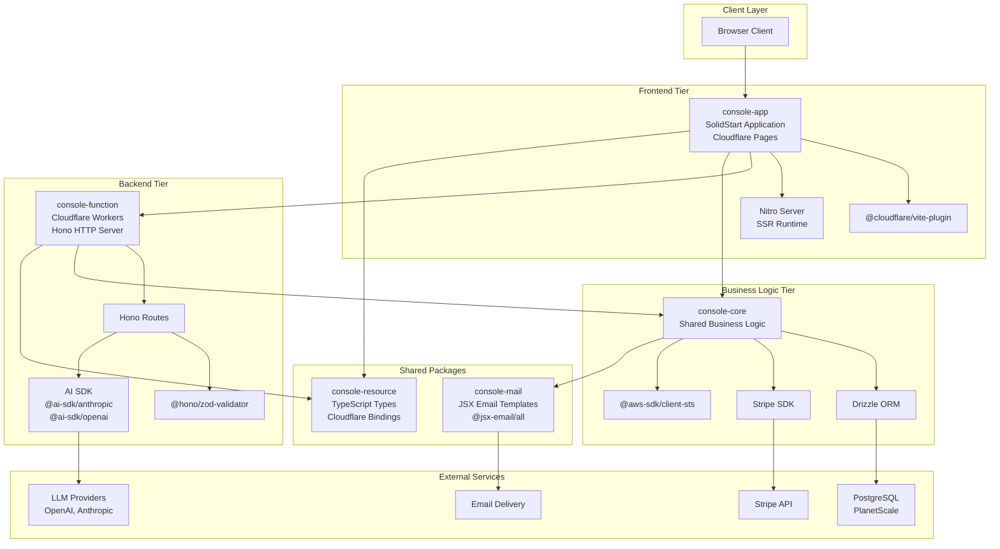

Sources: [packages/console/app/package.json:1-46](), [packages/console/function/package.json:1-31](), [packages/console/core/package.json:1-52](), [packages/console/mail/package.json:1-22]()

## Package Dependencies and Responsibilities

| Package            | Framework  | Deployment Target  | Primary Responsibility                        |
| ------------------ | ---------- | ------------------ | --------------------------------------------- |
| `console-app`      | SolidStart | Cloudflare Pages   | Web UI, SSR, client-side routing              |
| `console-function` | Hono       | Cloudflare Workers | API endpoints, AI model proxy                 |
| `console-core`     | N/A        | Shared Library     | Database access, business logic, integrations |
| `console-mail`     | JSX Email  | Shared Library     | Email template rendering                      |
| `console-resource` | TypeScript | Shared Library     | Type definitions for Cloudflare resources     |

**Key Dependencies by Tier**

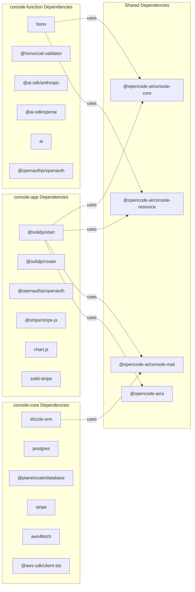

Sources: [packages/console/app/package.json:13-35](), [packages/console/function/package.json:19-29](), [packages/console/core/package.json:8-19]()

## Request Flow Architecture

The Console handles two primary request flows: user-facing web requests and AI model API requests.

**Web Request Flow**

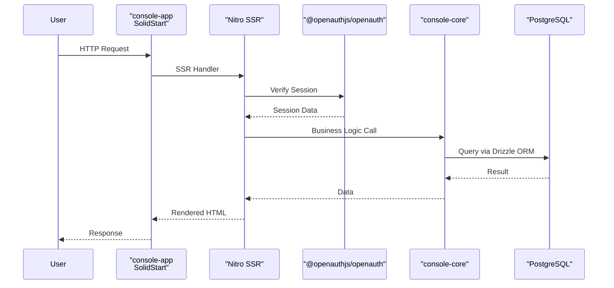

Sources: [packages/console/app/package.json:13-35]()

**AI API Request Flow**

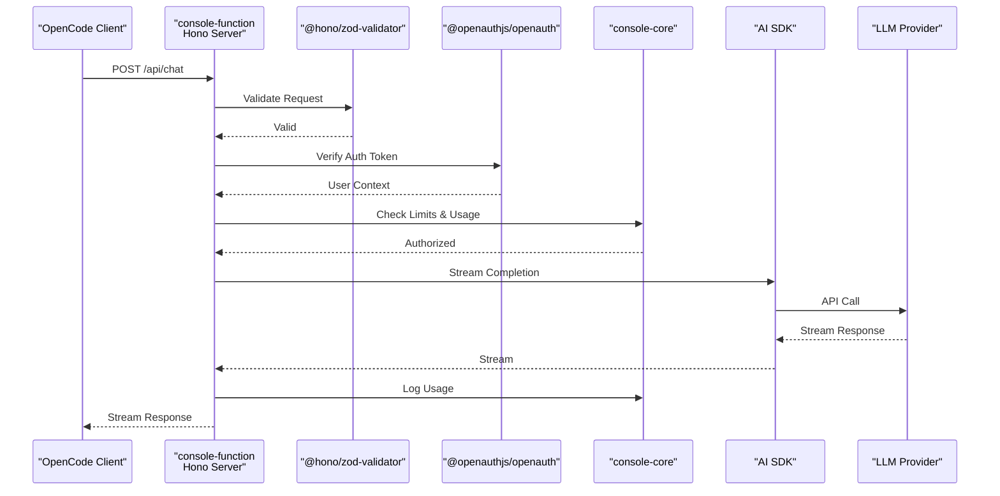

Sources: [packages/console/function/package.json:19-29]()

## Deployment Architecture

All Console components deploy to Cloudflare's edge network.

**Cloudflare Deployment Structure**

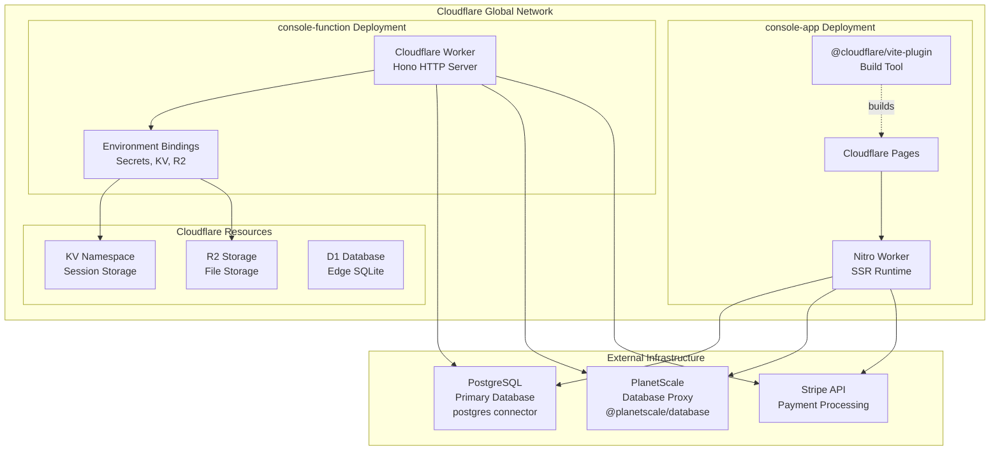

Sources: [packages/console/app/package.json:14](), [packages/console/function/package.json:11-12](), [packages/console/core/package.json:13-16]()

## Database Layer

The `console-core` package manages all database operations using Drizzle ORM with support for both direct PostgreSQL connections and PlanetScale's serverless driver.

**Database Connection Strategy**

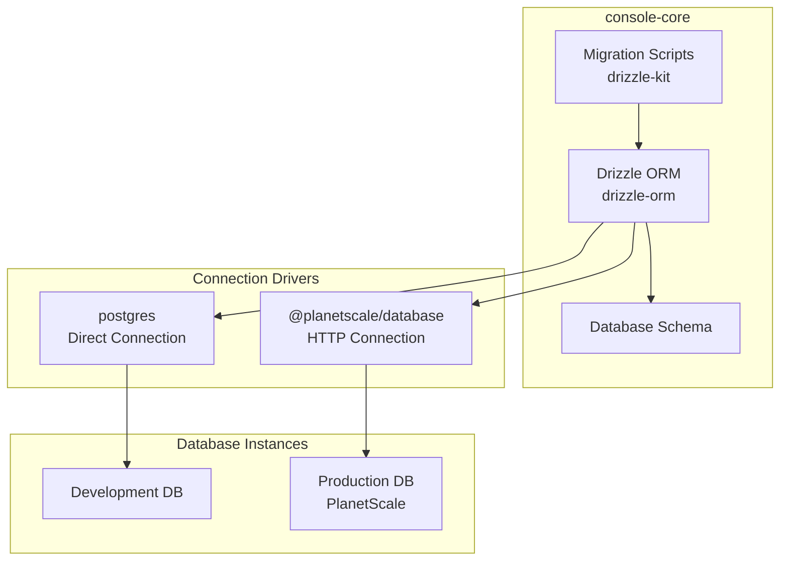

**Database Management Scripts**

The `console-core` package includes several scripts for database operations:

| Script       | Purpose                            | Command              |
| ------------ | ---------------------------------- | -------------------- |
| `db`         | Run drizzle-kit in SST shell       | `bun run db`         |
| `db-dev`     | Run drizzle-kit against dev stage  | `bun run db-dev`     |
| `db-prod`    | Run drizzle-kit against production | `bun run db-prod`    |
| `shell`      | Open SST shell for database access | `bun run shell`      |
| `shell-dev`  | Open dev stage shell               | `bun run shell-dev`  |
| `shell-prod` | Open production shell              | `bun run shell-prod` |

Sources: [packages/console/core/package.json:25-31](), [packages/console/core/package.json:13-16]()

## Authentication Flow

Both `console-app` and `console-function` use OpenAuth for authentication, providing a unified auth layer across frontend and backend.

**OpenAuth Integration Architecture**

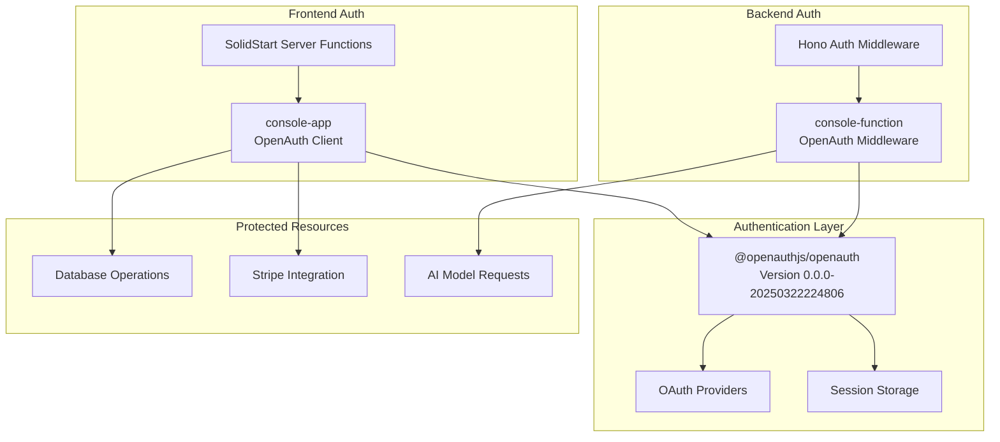

Sources: [packages/console/app/package.json:18](), [packages/console/function/package.json:26]()

## AI Model Proxy Layer

The `console-function` package implements an AI model proxy that routes requests to multiple LLM providers through the AI SDK.

**AI SDK Integration**

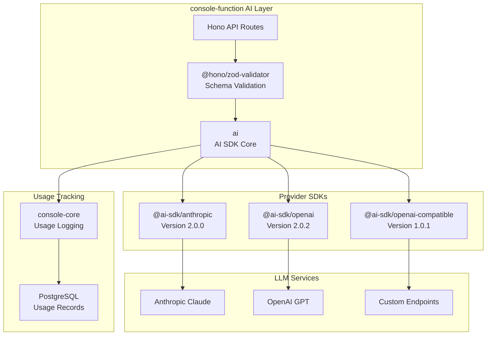

Sources: [packages/console/function/package.json:20-22](), [packages/console/function/package.json:27]()

## Payment Integration

The Console integrates Stripe for payment processing, with client-side and server-side components.

**Stripe Integration Architecture**

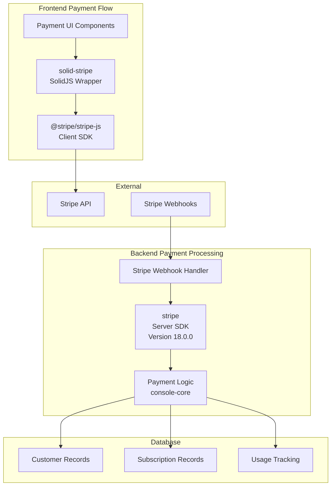

Sources: [packages/console/app/package.json:28-29](), [packages/console/app/package.json:33](), [packages/console/core/package.json:17]()

## Email System

The `console-mail` package provides JSX-based email templates used throughout the Console platform.

**Email Template Architecture**

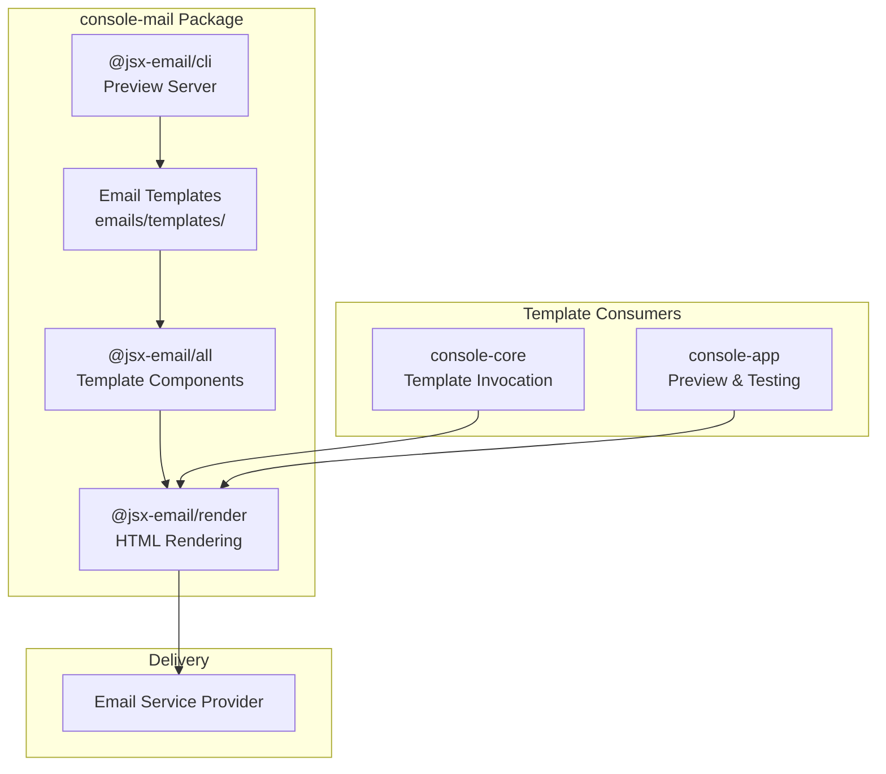

**Email Template Exports**

The package exports templates via a wildcard pattern defined in `package.json`:

```json
"exports": {
  "./*": "./emails/templates/*"
}
```

This allows consumers to import templates like:

- `@opencode-ai/console-mail/welcome`
- `@opencode-ai/console-mail/payment-receipt`
- `@opencode-ai/console-mail/usage-alert`

Sources: [packages/console/mail/package.json:4-10](), [packages/console/mail/package.json:12-14](), [packages/console/core/package.json:10-11](), [packages/console/app/package.json:16]()

## Shared Type Definitions

The `console-resource` package provides TypeScript type definitions for Cloudflare Workers bindings and other shared resources.

**Resource Type Structure**

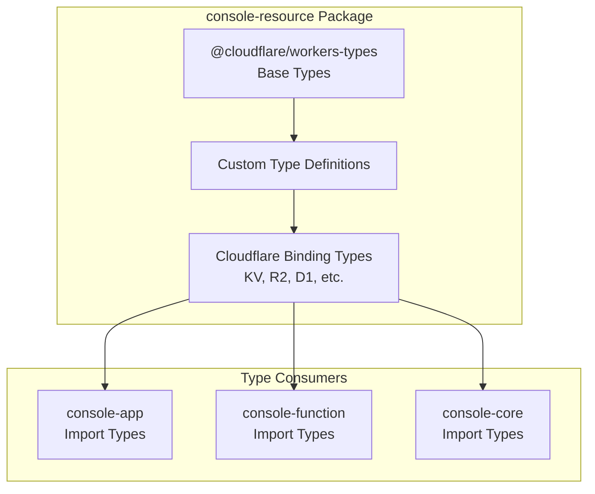

The package depends on `@cloudflare/workers-types` to provide accurate type definitions for Cloudflare's runtime environment, ensuring type safety across all Console components.

Sources: [packages/console/app/package.json:21](), [packages/console/function/package.json:25](), [packages/console/core/package.json:12]()

## Build and Development Workflow

Each Console package has distinct build and development processes tailored to its deployment target.

**Development Commands by Package**

| Package                | Dev Command                      | Build Command                 | Purpose                                         |
| ---------------------- | -------------------------------- | ----------------------------- | ----------------------------------------------- |
| `console-app`          | `vite dev --host 0.0.0.0`        | `vite build`                  | SolidStart dev server with HMR                  |
| `console-app` (remote) | `dev:remote` with SST shell      | N/A                           | Connect to dev environment with remote services |
| `console-function`     | N/A                              | Wrangler builds automatically | Cloudflare Workers deployment                   |
| `console-core`         | `sst shell`                      | `tsgo --noEmit`               | Type checking only, runtime library             |
| `console-mail`         | `email preview emails/templates` | N/A                           | JSX Email preview server                        |

**Build Tool Chain**

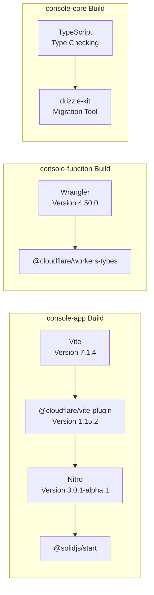

Sources: [packages/console/app/package.json:7-11](), [packages/console/app/package.json:34](), [packages/console/function/package.json:8-9](), [packages/console/core/package.json:40](), [packages/console/mail/package.json:17-18]()

## Inter-Package Communication

The Console packages communicate through well-defined interfaces, with `console-core` serving as the central business logic layer.

**Package Dependency Graph**

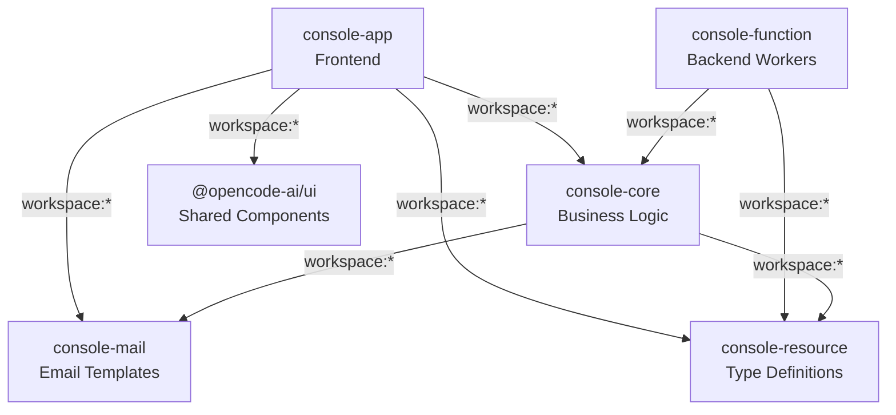

All workspace dependencies use the `workspace:*` protocol, ensuring that local versions are always used during development and proper versioning is maintained during publishing.

Sources: [packages/console/app/package.json:19-22](), [packages/console/function/package.json:24-25](), [packages/console/core/package.json:11-12]()
