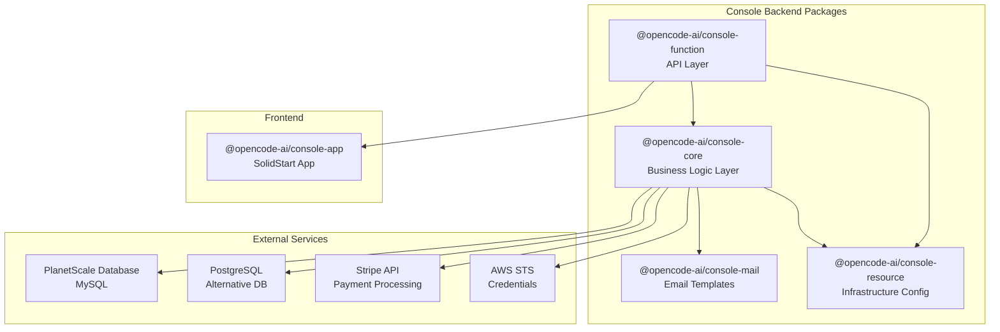
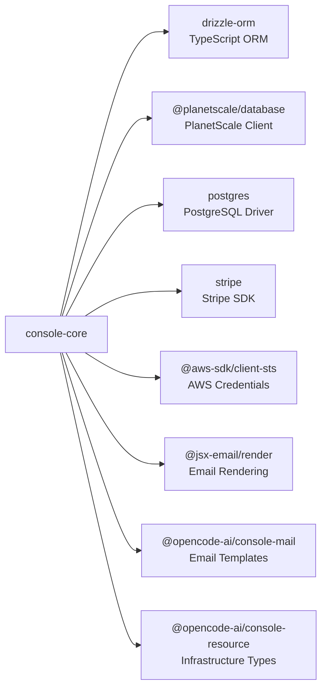
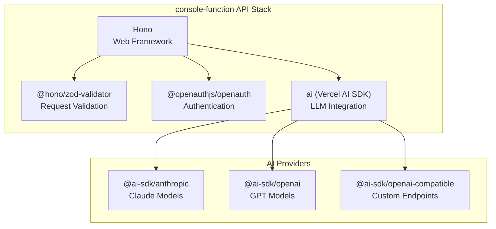
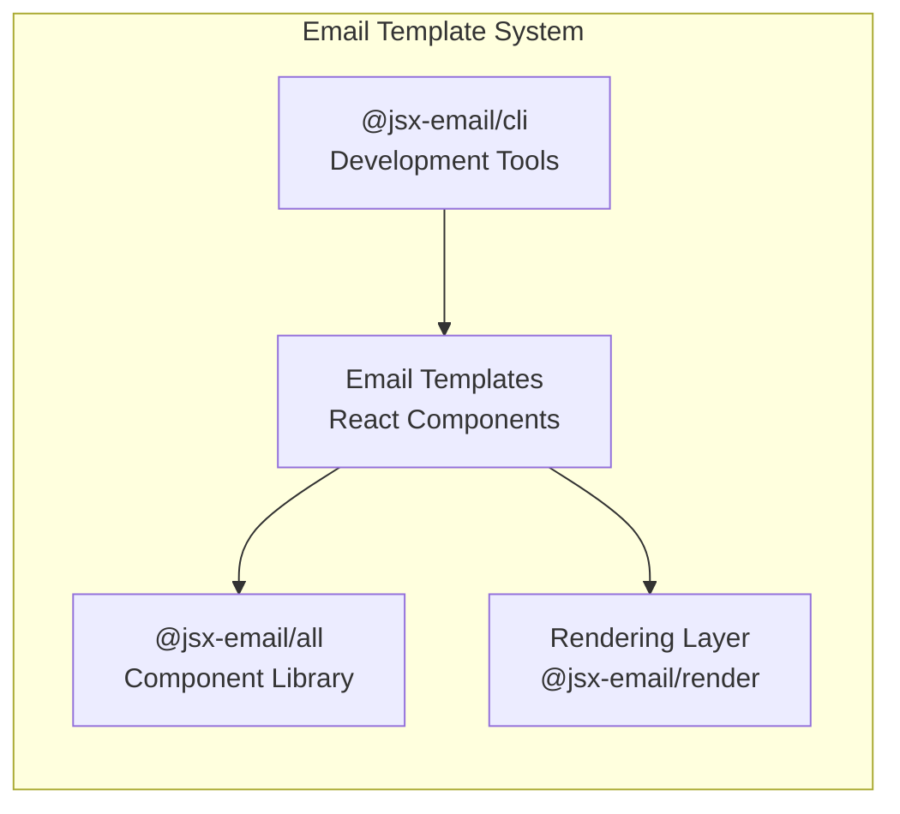
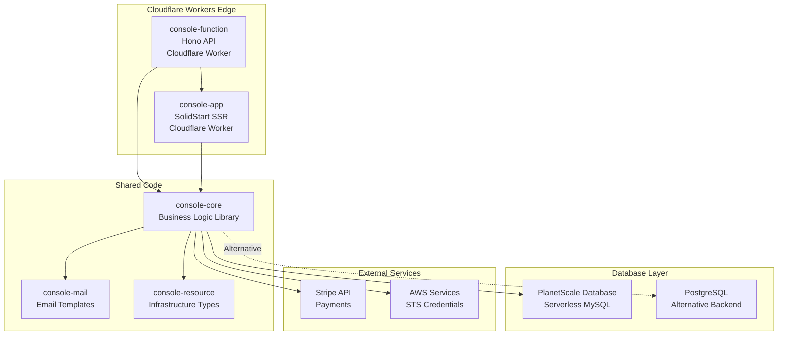
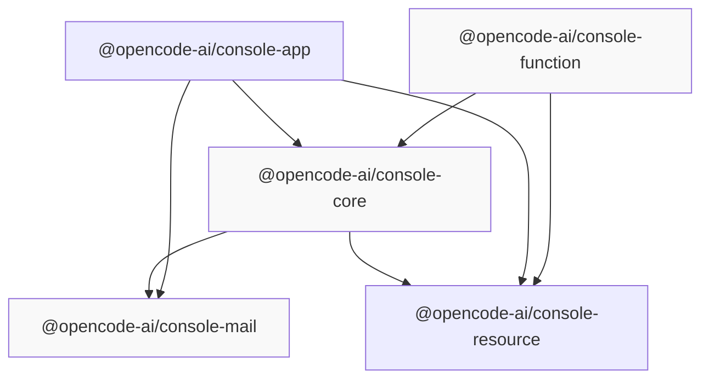

# Console Backend

<details>
<summary>Relevant source files</summary>

The following files were used as context for generating this wiki page:

- [bun.lock](bun.lock)
- [packages/console/app/package.json](packages/console/app/package.json)
- [packages/console/core/package.json](packages/console/core/package.json)
- [packages/console/function/package.json](packages/console/function/package.json)
- [packages/console/mail/package.json](packages/console/mail/package.json)
- [packages/desktop/package.json](packages/desktop/package.json)
- [packages/function/package.json](packages/function/package.json)
- [packages/opencode/package.json](packages/opencode/package.json)
- [packages/plugin/package.json](packages/plugin/package.json)
- [packages/sdk/js/package.json](packages/sdk/js/package.json)
- [packages/web/package.json](packages/web/package.json)
- [sdks/vscode/package.json](sdks/vscode/package.json)

</details>

## Purpose and Scope

The Console Backend comprises three packages that implement the server-side functionality for the OpenCode management console. These packages handle business logic, database operations, API endpoints, and email communications for managing user accounts, subscriptions, AI model access, and platform administration.

This page covers the backend implementation. For the frontend application, see [Console Frontend](#7.3). For overall architecture, see [Console Architecture](#7.1).

**Sources:** [packages/console/core/package.json:1-52](), [packages/console/function/package.json:1-31](), [packages/console/mail/package.json:1-22]()

---

## Package Overview

The console backend is divided into three specialized packages:

| Package                         | Purpose                                         | Key Technologies                             |
| ------------------------------- | ----------------------------------------------- | -------------------------------------------- |
| `@opencode-ai/console-core`     | Business logic, database layer, and data models | Drizzle ORM, PlanetScale, PostgreSQL, Stripe |
| `@opencode-ai/console-function` | HTTP API endpoints and AI chat functionality    | Hono, Vercel AI SDK, OpenAuth                |
| `@opencode-ai/console-mail`     | Email template rendering                        | JSX Email, React                             |



**Sources:** [bun.lock:111-137](), [bun.lock:138-161](), [bun.lock:162-173]()

---

## console-core Package

### Overview

The `@opencode-ai/console-core` package provides the data layer and business logic for the console system. It handles database schema definitions, ORM configuration, Stripe payment integration, and domain-specific operations for managing users, subscriptions, and AI model access.

**Sources:** [packages/console/core/package.json:1-52]()

### Dependencies and Technologies



The package supports two database backends:

- **PlanetScale**: MySQL-compatible serverless database (primary)
- **PostgreSQL**: Traditional PostgreSQL instances (alternative)

**Sources:** [packages/console/core/package.json:8-19]()

### Database Layer

The core package uses Drizzle ORM for type-safe database operations. The schema is managed through migration scripts and can be accessed using `drizzle-kit` CLI tools.

**Key CLI Scripts:**

| Script    | Purpose                                         |
| --------- | ----------------------------------------------- |
| `db`      | Run drizzle-kit commands in current environment |
| `db-dev`  | Run drizzle-kit in dev stage                    |
| `db-prod` | Run drizzle-kit in production stage             |
| `shell`   | Open SST shell for database access              |

**Sources:** [packages/console/core/package.json:25-40]()

### Model and Limits Management

The package includes scripts for managing AI model metadata and usage limits:

**Model Management Scripts:**

| Script                   | Purpose                          |
| ------------------------ | -------------------------------- |
| `update-models`          | Update local model definitions   |
| `promote-models-to-dev`  | Deploy models to dev environment |
| `promote-models-to-prod` | Deploy models to production      |
| `pull-models-from-dev`   | Sync models from dev             |
| `pull-models-from-prod`  | Sync models from production      |

**Limits Management Scripts:**

| Script                   | Purpose                        |
| ------------------------ | ------------------------------ |
| `update-limits`          | Update usage limit definitions |
| `promote-limits-to-dev`  | Deploy limits to dev           |
| `promote-limits-to-prod` | Deploy limits to production    |

These scripts manage the catalog of AI models available to users and the rate limits/quotas enforced per subscription tier.

**Sources:** [packages/console/core/package.json:32-39]()

### Stripe Integration

The package integrates the Stripe SDK for payment processing, subscription management, and billing operations. The `stripe` dependency (v18.0.0) provides webhook handling and API access for managing customer accounts.

**Sources:** [packages/console/core/package.json:17]()

### Module Exports

The package uses a flexible export pattern to expose internal modules:

```typescript
// Exports from package.json
"./*.js": "./src/*.ts",
"./*": "./src/*"
```

This allows consumers to import specific modules directly from the package, such as database utilities, business logic functions, or type definitions.

**Sources:** [packages/console/core/package.json:21-24]()

---

## console-function Package

### Overview

The `@opencode-ai/console-function` package implements the HTTP API layer for the console system. Built with the Hono web framework, it provides RESTful endpoints, real-time AI chat functionality, and authentication integration.

**Sources:** [packages/console/function/package.json:1-31]()

### API Framework Stack



**Sources:** [packages/console/function/package.json:19-29]()

### Core Dependencies

| Dependency                  | Version              | Purpose                                     |
| --------------------------- | -------------------- | ------------------------------------------- |
| `hono`                      | catalog              | Lightweight web framework for edge runtimes |
| `@hono/zod-validator`       | catalog              | Zod-based request validation middleware     |
| `@openauthjs/openauth`      | 0.0.0-20250322224806 | OAuth and authentication flows              |
| `ai`                        | catalog              | Vercel AI SDK for LLM streaming             |
| `@ai-sdk/anthropic`         | 2.0.0                | Claude model integration                    |
| `@ai-sdk/openai`            | 2.0.2                | OpenAI GPT model integration                |
| `@ai-sdk/openai-compatible` | 1.0.1                | Generic OpenAI-compatible endpoints         |

**Sources:** [packages/console/function/package.json:19-29]()

### AI Chat Functionality

The package implements AI-powered chat features for the console, likely used for:

- Customer support chatbots
- Interactive onboarding
- AI-assisted platform navigation
- Administrative assistance

The integration with Vercel AI SDK enables streaming responses and multi-provider model switching.

**Sources:** [packages/console/function/package.json:19-22]()

### Authentication Integration

The package uses OpenAuth for handling authentication flows. This provides:

- OAuth provider integration
- Token management
- Session handling
- Access control

**Sources:** [packages/console/function/package.json:26]()

### Request Validation

The `@hono/zod-validator` middleware provides type-safe request validation using Zod schemas. This ensures all API inputs are validated before reaching business logic.

**Sources:** [packages/console/function/package.json:23]()

### Deployment Target

The package includes `@cloudflare/workers-types` as a dev dependency, indicating it's designed to run on Cloudflare Workers edge runtime.

**Sources:** [packages/console/function/package.json:12]()

---

## console-mail Package

### Overview

The `@opencode-ai/console-mail` package provides email template definitions and rendering functionality. It uses JSX Email to create maintainable, component-based email templates with React.

**Sources:** [packages/console/mail/package.json:1-22]()

### Template System



**Sources:** [packages/console/mail/package.json:4-10]()

### Dependencies

| Dependency       | Version | Purpose                              |
| ---------------- | ------- | ------------------------------------ |
| `@jsx-email/all` | 2.2.3   | Complete JSX Email component library |
| `@jsx-email/cli` | 1.4.3   | CLI tools for template development   |
| `@types/react`   | 18.0.25 | React type definitions               |
| `react`          | 18.2.0  | React runtime for template rendering |

The package uses React for template authoring but the templates are rendered to HTML for email delivery.

**Sources:** [packages/console/mail/package.json:4-10]()

### Module Exports

Templates are exported using a wildcard pattern:

```json
"exports": {
  "./*": "./emails/templates/*"
}
```

This allows importing specific email templates by name from consuming packages.

**Sources:** [packages/console/mail/package.json:12-14]()

### Development Workflow

The package includes a `dev` script for previewing email templates:

```bash
bun dev  # Runs: email preview emails/templates
```

This launches a development server that renders templates in a browser for design iteration.

**Sources:** [packages/console/mail/package.json:18]()

### Template Organization

Email templates are stored in the `emails/templates/` directory. Common templates likely include:

- Account verification emails
- Password reset notifications
- Subscription confirmations
- Usage alerts
- Billing receipts
- Administrative notifications

**Sources:** [packages/console/mail/package.json:13]()

---

## Deployment Architecture

### Infrastructure Overview



**Sources:** [packages/console/function/package.json:12](), [packages/console/core/package.json:8-19]()

### SST Infrastructure

The console backend is deployed using SST (Serverless Stack) infrastructure-as-code. The `console-resource` package defines the infrastructure configuration.

**Key deployment commands:**

```bash
# Development environment
sst shell --stage=dev

# Production environment
sst shell --stage=production

# Database migrations (dev)
sst shell --stage=dev -- drizzle-kit

# Database migrations (prod)
sst shell --stage=production -- drizzle-kit
```

**Sources:** [packages/console/core/package.json:26-31]()

### Database Configuration

The console supports two database backends:

**PlanetScale (Primary):**

- Serverless MySQL-compatible database
- Automatic scaling and connection pooling
- Integrated via `@planetscale/database` client
- Supports Drizzle ORM operations

**PostgreSQL (Alternative):**

- Traditional PostgreSQL instances
- Uses `postgres` driver for connectivity
- Compatible with Drizzle ORM schema

The dual-database support provides flexibility for different deployment scenarios and migration paths.

**Sources:** [packages/console/core/package.json:13-16]()

### Edge Runtime Compatibility

Both `console-function` and `console-app` are designed for Cloudflare Workers:

- TypeScript configured with `@cloudflare/workers-types`
- Node.js 22+ compatibility (`@tsconfig/node22`)
- Edge-optimized dependencies (Hono, PlanetScale client)

**Sources:** [packages/console/function/package.json:12](), [packages/console/app/package.json:43-45]()

---

## Package Relationships

### Dependency Graph



**Key observations:**

- `console-core` is the central dependency, consumed by both API and frontend
- `console-mail` is consumed directly by `console-core` and `console-app`
- `console-resource` provides shared infrastructure types to all packages
- `console-function` provides the API that `console-app` calls

**Sources:** [packages/console/function/package.json:24-25](), [packages/console/app/package.json:19-21](), [packages/console/core/package.json:11-12]()

### Workspace Configuration

All console packages use workspace protocol (`workspace:*`) for internal dependencies, ensuring consistent versioning and local development:

```json
"@opencode-ai/console-core": "workspace:*",
"@opencode-ai/console-mail": "workspace:*",
"@opencode-ai/console-resource": "workspace:*"
```

This enables:

- Local package linking during development
- Automatic version updates during releases
- Faster builds by avoiding package registry

**Sources:** [packages/console/function/package.json:24-25](), [packages/console/core/package.json:11-12]()

---

## Type Safety and Validation

### TypeScript Configuration

All console backend packages use TypeScript with strict type checking:

```json
"scripts": {
  "typecheck": "tsgo --noEmit"
}
```

The `tsgo` command (TypeScript Native Preview) provides enhanced type checking with better performance.

**Sources:** [packages/console/core/package.json:40](), [packages/console/function/package.json:9]()

### Schema Validation

The backend extensively uses Zod for runtime validation:

**In console-core:**

- Database schema validation
- Business logic input validation
- Configuration validation

**In console-function:**

- API request validation via `@hono/zod-validator`
- Response schema enforcement

This dual-layer approach (TypeScript compile-time + Zod runtime) ensures type safety throughout the stack.

**Sources:** [packages/console/core/package.json:19](), [packages/console/function/package.json:23-29]()
