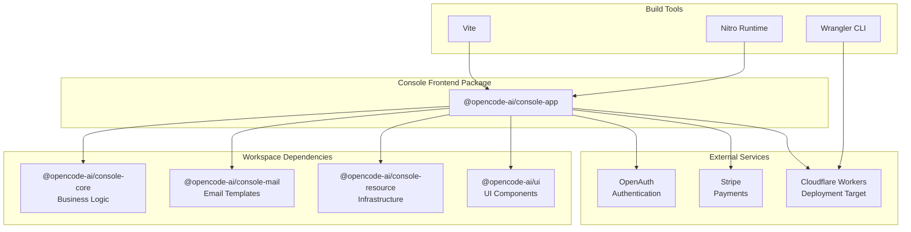
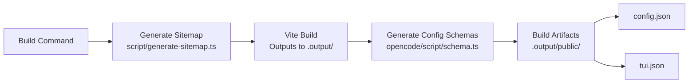
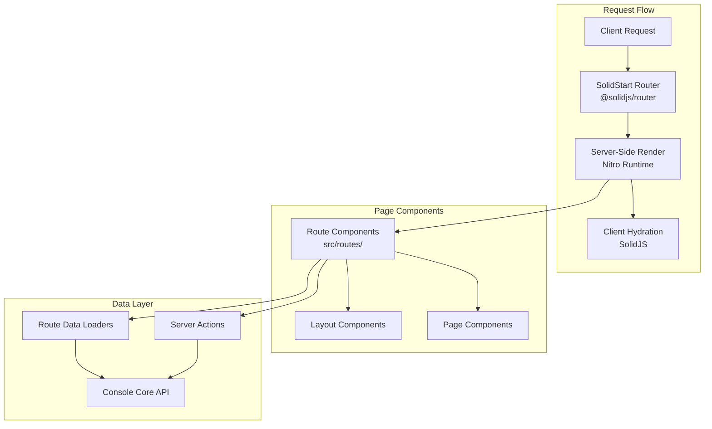
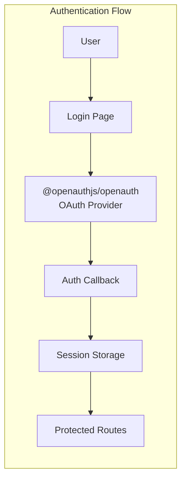
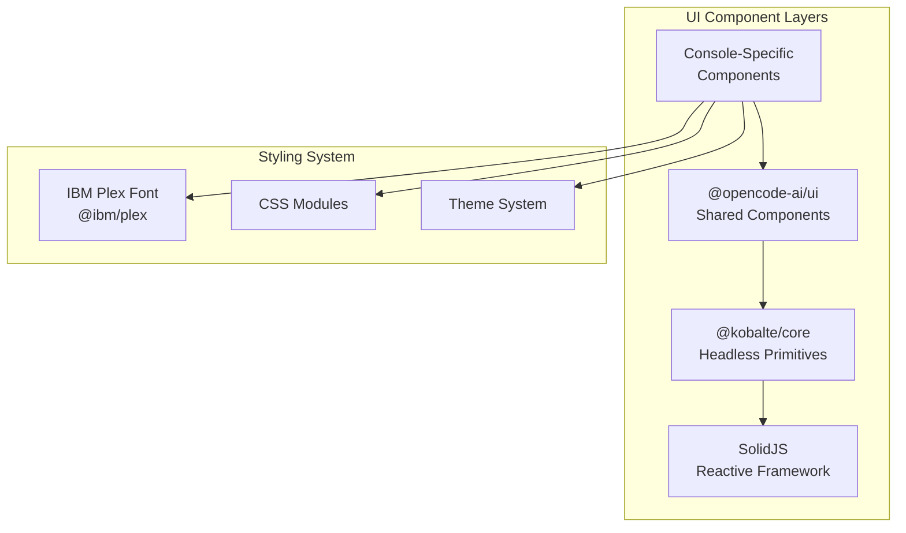
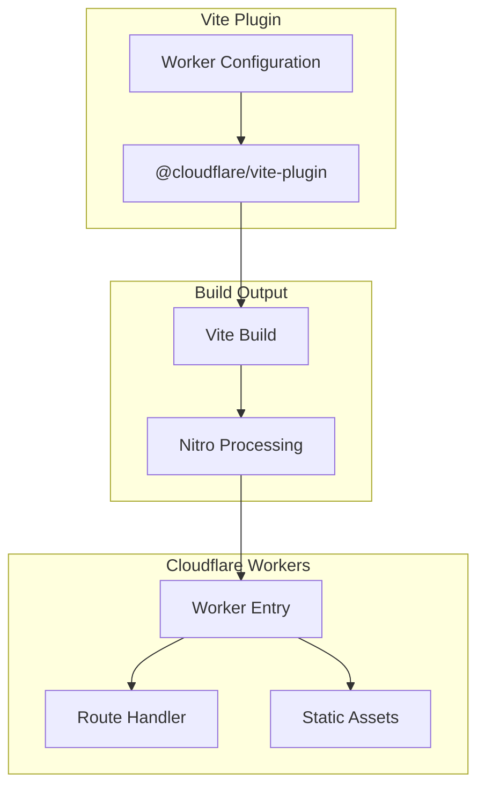
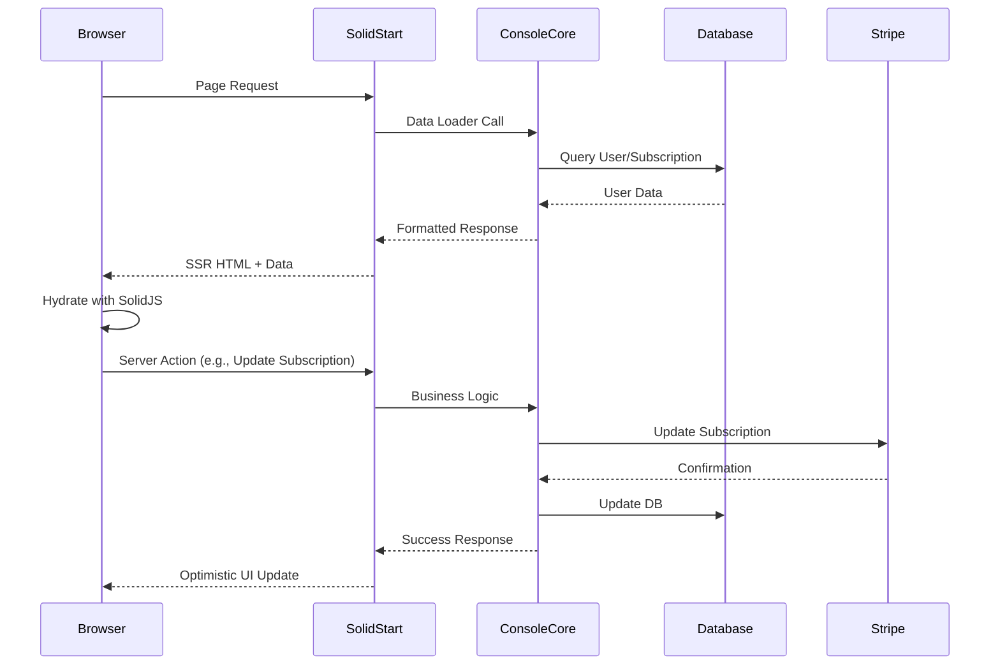
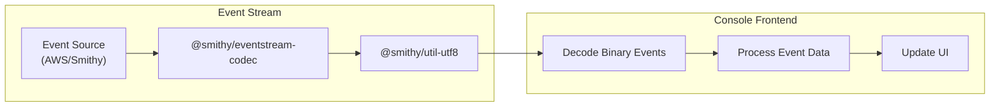

# Console Frontend

<details>
<summary>Relevant source files</summary>

The following files were used as context for generating this wiki page:

- [bun.lock](bun.lock)
- [packages/console/app/package.json](packages/console/app/package.json)
- [packages/console/core/package.json](packages/console/core/package.json)
- [packages/console/function/package.json](packages/console/function/package.json)
- [packages/console/mail/package.json](packages/console/mail/package.json)
- [packages/desktop/package.json](packages/desktop/package.json)
- [packages/function/package.json](packages/function/package.json)
- [packages/opencode/package.json](packages/opencode/package.json)
- [packages/plugin/package.json](packages/plugin/package.json)
- [packages/sdk/js/package.json](packages/sdk/js/package.json)
- [packages/web/package.json](packages/web/package.json)
- [sdks/vscode/package.json](sdks/vscode/package.json)

</details>

## Purpose and Scope

The Console Frontend (`@opencode-ai/console-app`) is a SolidStart-based administrative web application that provides the management interface for the OpenCode platform. This application handles user account management, subscription billing, usage analytics, and platform administration tasks. It is deployed as a Cloudflare Workers application using the Nitro runtime.

For information about the backend business logic and database operations, see [Console Backend](#7.2). For the overall console architecture, see [Console Architecture](#7.1).

---

## Technology Stack

The console frontend is built using the following core technologies:

| Technology          | Purpose                            | Version                 |
| ------------------- | ---------------------------------- | ----------------------- |
| **SolidStart**      | Meta-framework for SSR and routing | Latest (catalog)        |
| **SolidJS**         | Reactive UI framework              | 1.9.10                  |
| **Nitro**           | Server runtime for deployment      | 3.0.1-alpha.1           |
| **Vite**            | Build tool and dev server          | 7.1.4                   |
| **@opencode-ai/ui** | Shared UI component library        | workspace               |
| **@kobalte/core**   | Headless UI primitives             | 0.13.11                 |
| **Stripe**          | Payment processing                 | @stripe/stripe-js 8.6.1 |
| **Chart.js**        | Data visualization                 | 4.5.1                   |
| **OpenAuth**        | Authentication system              | 0.0.0-20250322224806    |

Sources: [packages/console/app/package.json:1-46]()

---

## Package Structure



**Package Dependencies**

The console-app depends on:

- **console-core**: Database models, business logic, and Stripe backend integration
- **console-mail**: JSX Email templates for transactional emails
- **console-resource**: SST infrastructure resource type definitions
- **ui**: Shared UI components including session rendering and styling

Sources: [packages/console/app/package.json:13-35]()

---

## Build and Deployment Pipeline

### Build Process



The build pipeline consists of three stages:

1. **Sitemap Generation**: Executes [packages/console/app/script/generate-sitemap.ts]() to create the site map
2. **Vite Build**: Compiles the SolidStart application to Cloudflare Workers-compatible output
3. **Schema Generation**: Runs [packages/opencode/script/schema.ts]() to generate `config.json` and `tui.json` configuration schemas in the public directory

Sources: [packages/console/app/package.json:10]()

### Development Scripts

| Script       | Command                         | Purpose                                        |
| ------------ | ------------------------------- | ---------------------------------------------- |
| `dev`        | `vite dev --host 0.0.0.0`       | Local development server accessible on network |
| `dev:remote` | `sst shell --stage=dev bun dev` | Development against remote dev environment     |
| `build`      | Multi-step build process        | Production build with schema generation        |
| `typecheck`  | `tsgo --noEmit`                 | Type checking without emitting files           |

The `dev:remote` script configures environment variables for remote services:

- `VITE_AUTH_URL=https://auth.dev.opencode.ai` - Remote authentication endpoint
- `VITE_STRIPE_PUBLISHABLE_KEY` - Stripe test mode publishable key

Sources: [packages/console/app/package.json:6-11]()

---

## Framework Architecture

### SolidStart Application Structure



SolidStart provides:

- **File-based routing** in the `src/routes/` directory
- **Server functions** for data fetching and mutations
- **SSR with hydration** for optimal performance
- **Nitro runtime** for Cloudflare Workers deployment

Sources: [packages/console/app/package.json:27]()

---

## Key Integrations

### Authentication with OpenAuth



The console uses `@openauthjs/openauth` for authentication, with configurable auth URLs:

- **Development**: Local OpenAuth server via SST
- **Remote Dev**: `https://auth.dev.opencode.ai`
- **Production**: Production auth endpoint

Sources: [packages/console/app/package.json:18](), [packages/console/app/package.json:9]()

### Stripe Integration

The application integrates Stripe for subscription management and billing:

**Client-Side Components**:

- `@stripe/stripe-js` - Stripe JavaScript SDK
- `solid-stripe` - SolidJS bindings for Stripe Elements

**Features**:

- Payment method collection
- Subscription management UI
- Usage-based billing display
- Invoice history

Sources: [packages/console/app/package.json:28](), [packages/console/app/package.json:32]()

### Data Visualization

Chart.js provides analytics visualizations:

- Usage metrics over time
- Billing graphs
- Performance dashboards
- Token consumption analytics

Sources: [packages/console/app/package.json:29]()

---

## UI Component System

### Component Architecture



**Component Dependencies**:

1. **@opencode-ai/ui**: Provides shared components like `SessionTurn`, `MessagePart`, code highlighting with Shiki
2. **@kobalte/core**: Headless accessible UI primitives (modals, dropdowns, tabs)
3. **@ibm/plex**: IBM Plex font family for consistent typography
4. **solid-list**: Virtualized list rendering for performance

Sources: [packages/console/app/package.json:22](), [packages/console/app/package.json:17](), [packages/console/app/package.json:15]()

---

## Server Runtime Configuration

### Nitro Deployment



The application uses Nitro 3.0.1-alpha.1 to compile SolidStart routes into a Cloudflare Workers-compatible format. The `@cloudflare/vite-plugin` integrates the build process with Cloudflare's tooling.

**Deployment Environment**:

- **Runtime**: Cloudflare Workers (V8 isolates)
- **Assets**: Cloudflare Pages for static files
- **Build tool**: Wrangler 4.50.0

Sources: [packages/console/app/package.json:30](), [packages/console/app/package.json:14](), [packages/console/app/package.json:41]()

---

## Data Flow Architecture

### Client-Server Communication



**Data Layer Integration**:

- **console-core**: Provides database access, Stripe API integration, email sending
- **Server actions**: Handle mutations with automatic revalidation
- **Loaders**: Fetch data server-side for initial page load

Sources: [packages/console/app/package.json:19]()

---

## Email Integration

The console-app uses `@jsx-email/render` to render email templates from `@opencode-ai/console-mail`:

**Email Workflow**:

1. User action triggers server function
2. Server function calls `@opencode-ai/console-core` business logic
3. Core logic uses `@jsx-email/render` to render templates from `@opencode-ai/console-mail`
4. Rendered HTML sent via configured email provider

Sources: [packages/console/app/package.json:16](), [packages/console/app/package.json:20]()

---

## Event Stream Processing

### Smithy Event Stream Codec



The console uses Smithy event stream codecs for processing binary event streams:

- `@smithy/eventstream-codec` - Decodes AWS-style event streams
- `@smithy/util-utf8` - UTF-8 encoding/decoding utilities

This likely supports real-time updates for usage metrics or AI interactions within the console.

Sources: [packages/console/app/package.json:23-24]()

---

## Development Workflow

### Local Development

**Standard Local Development**:

```bash
bun dev
```

Starts Vite dev server on `http://0.0.0.0:5173` for network access.

**Remote Environment Development**:

```bash
bun dev:remote
```

Uses SST to inject environment variables and connect to remote services:

- Remote authentication service
- Test Stripe account
- Development database

### Type Checking

```bash
bun typecheck
```

Runs TypeScript compilation without emitting files using `tsgo`.

Sources: [packages/console/app/package.json:7-9]()

---

## Build Artifacts

### Generated Files

The build process produces several key files:

| File          | Location          | Purpose                       |
| ------------- | ----------------- | ----------------------------- |
| `config.json` | `.output/public/` | OpenCode configuration schema |
| `tui.json`    | `.output/public/` | TUI configuration schema      |
| Sitemap       | `.output/public/` | Generated sitemap for SEO     |
| Worker bundle | `.output/server/` | Cloudflare Worker entry point |
| Static assets | `.output/public/` | CSS, images, client JS        |

**Schema Generation**:

The build script runs:

```
bun ../../opencode/script/schema.ts ./.output/public/config.json ./.output/public/tui.json
```

This generates JSON schemas for configuration validation, making them available as static assets.

Sources: [packages/console/app/package.json:10]()

---

## Resource Integration

The console-app depends on `@opencode-ai/console-resource` which provides:

- SST infrastructure type definitions
- Cloudflare Workers bindings
- Environment variable types
- KV namespace configurations

This ensures type-safe access to infrastructure resources at runtime.

Sources: [packages/console/app/package.json:21]()

---

## Engine Requirements

The console-app requires Node.js 22 or higher due to:

- Native SolidStart features
- Nitro runtime compatibility
- Modern TypeScript support

Sources: [packages/console/app/package.json:43-45]()
