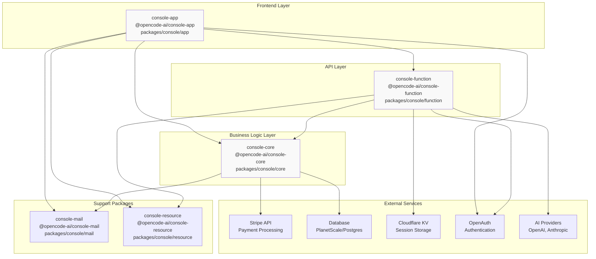
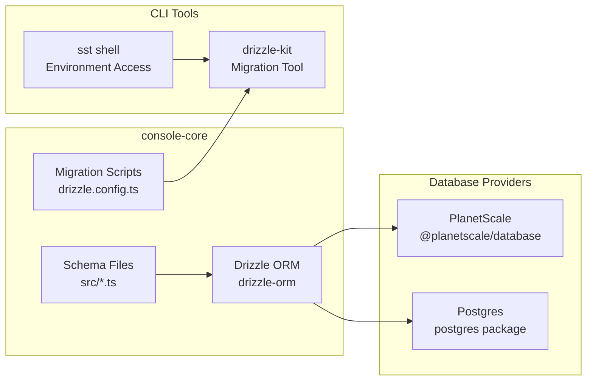
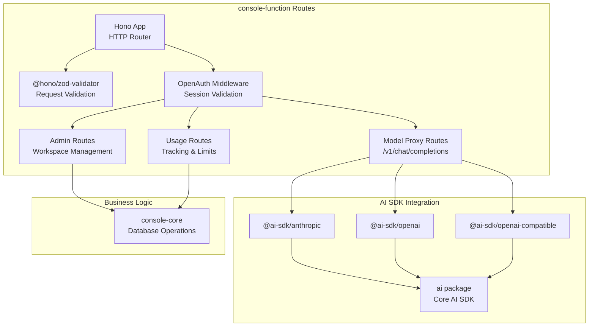
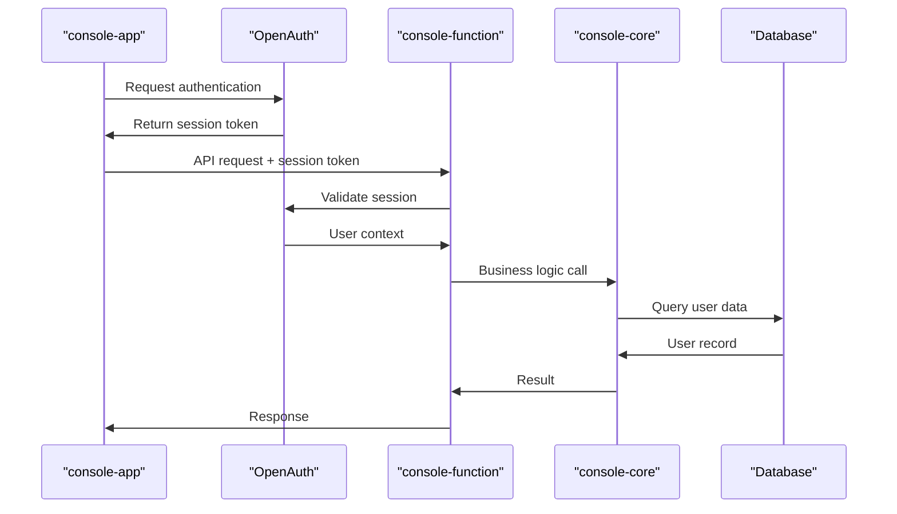
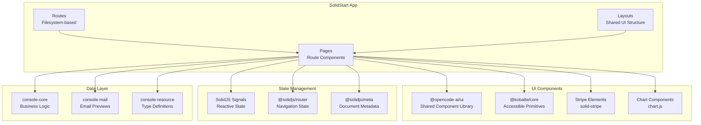
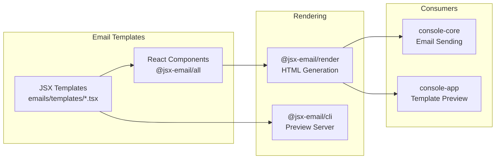
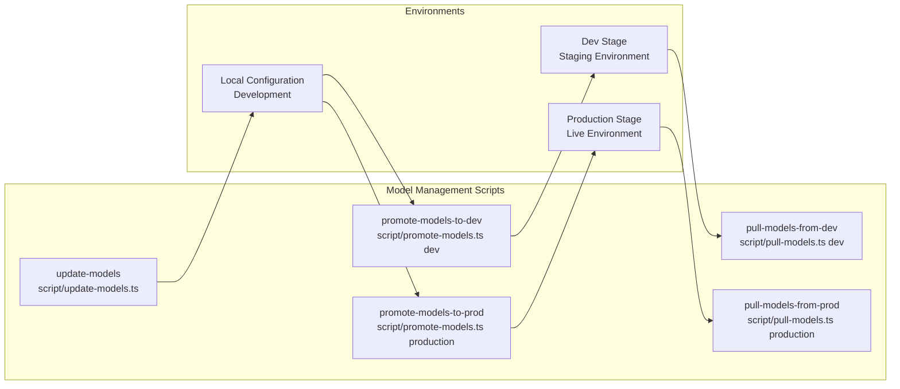
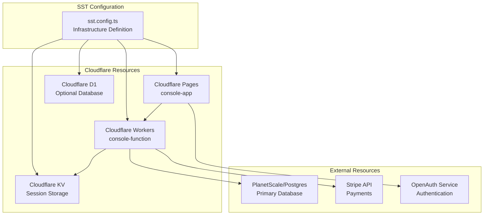
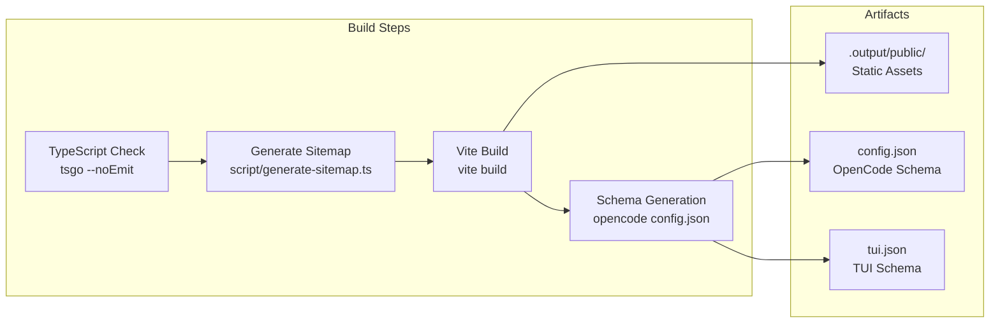

# Console Management System

<details>
<summary>Relevant source files</summary>

The following files were used as context for generating this wiki page:

- [bun.lock](bun.lock)
- [packages/console/app/package.json](packages/console/app/package.json)
- [packages/console/core/package.json](packages/console/core/package.json)
- [packages/console/function/package.json](packages/console/function/package.json)
- [packages/console/mail/package.json](packages/console/mail/package.json)
- [packages/desktop/package.json](packages/desktop/package.json)
- [packages/function/package.json](packages/function/package.json)
- [packages/opencode/package.json](packages/opencode/package.json)
- [packages/plugin/package.json](packages/plugin/package.json)
- [packages/sdk/js/package.json](packages/sdk/js/package.json)
- [packages/web/package.json](packages/web/package.json)
- [sdks/vscode/package.json](sdks/vscode/package.json)

</details>

The Console Management System is a SaaS platform that provides managed access to OpenCode's AI services, specifically OpenCode Zen (40+ curated models) and OpenCode Go (open source models). It consists of a three-tier architecture deployed on Cloudflare infrastructure: a SolidStart frontend application, Cloudflare Workers backend API, and shared core business logic with database integration. The system handles user authentication, workspace management, payment processing via Stripe, usage tracking, and serves as a proxy for AI model requests.

For information about the main OpenCode CLI and server application, see [Core Application](#2). For details about the frontend components, see [Console Frontend](#7.3). For backend implementation details, see [Console Backend](#7.2).

## System Architecture

The Console system is organized into five interconnected packages that form a complete SaaS platform:



**Sources:** [packages/console/app/package.json:1-46](), [packages/console/function/package.json:1-31](), [packages/console/core/package.json:1-52]()

## Package Structure

The Console system consists of five interdependent packages:

| Package            | Path                        | Purpose                           | Key Dependencies                               |
| ------------------ | --------------------------- | --------------------------------- | ---------------------------------------------- |
| `console-app`      | `packages/console/app`      | SolidStart frontend application   | SolidStart, OpenAuth, Stripe.js, UI components |
| `console-function` | `packages/console/function` | Cloudflare Workers API backend    | Hono, AI SDK, OpenAuth                         |
| `console-core`     | `packages/console/core`     | Business logic and database layer | Drizzle ORM, Stripe, AWS STS                   |
| `console-mail`     | `packages/console/mail`     | Email template system             | JSX Email, React                               |
| `console-resource` | `packages/console/resource` | Shared TypeScript types           | Cloudflare Workers types                       |

**Sources:** [packages/console/app/package.json:1-46](), [packages/console/function/package.json:1-31](), [packages/console/core/package.json:1-52](), [packages/console/mail/package.json:1-22]()

## Database and Data Layer

### Database Schema Management

The `console-core` package uses Drizzle ORM to manage database schemas and operations. It supports both PlanetScale and standard Postgres databases:



The database management scripts are defined in [packages/console/core/package.json:26-40]() and include:

- `db` - Run drizzle-kit commands
- `db-dev` - Run migrations against development stage
- `db-prod` - Run migrations against production stage
- `shell` - Access SST shell for direct database access
- `shell-dev` / `shell-prod` - Stage-specific shell access

**Sources:** [packages/console/core/package.json:8-19](), [packages/console/core/package.json:26-40]()

### Core Business Logic

The `console-core` package provides centralized business logic accessible to both frontend and backend:

| Export Pattern | Description                                    |
| -------------- | ---------------------------------------------- |
| `./*.js`       | TypeScript source files compiled to JavaScript |
| `./*`          | Direct TypeScript source file imports          |

This allows both `console-app` and `console-function` to import shared logic directly from the source files. The core package handles:

- User account and workspace management
- Usage tracking and quota enforcement
- Payment and subscription logic via Stripe
- Model availability and configuration
- Email rendering and delivery

**Sources:** [packages/console/core/package.json:21-24]()

## API Backend (console-function)

### Request Routing

The `console-function` package implements a Cloudflare Workers backend using Hono for HTTP routing:



**Dependencies:**

- `hono` - HTTP framework for Cloudflare Workers
- `@hono/zod-validator` - Request validation middleware
- `@openauthjs/openauth` - Authentication middleware
- `@ai-sdk/anthropic`, `@ai-sdk/openai`, `@ai-sdk/openai-compatible` - AI provider SDKs
- `ai` - Core AI SDK for streaming and tool calling

**Sources:** [packages/console/function/package.json:19-29]()

### Authentication Flow

The backend uses OpenAuth for session management:



**Sources:** [packages/console/function/package.json:26-26]()

## Frontend Application (console-app)

### Technology Stack

The `console-app` uses SolidStart with Vite for the frontend application:

| Technology             | Purpose                             |
| ---------------------- | ----------------------------------- |
| SolidStart             | Meta-framework for SolidJS with SSR |
| Vite                   | Build tool and dev server           |
| Cloudflare Vite Plugin | Cloudflare Workers integration      |
| OpenAuth               | Authentication client               |
| Stripe.js              | Payment form integration            |
| Chart.js               | Usage analytics visualization       |

**Build Process:**

The build script [packages/console/app/package.json:10-10]() performs three steps:

1. Generate sitemap via `./script/generate-sitemap.ts`
2. Build the Vite application
3. Generate OpenCode configuration schemas using the main opencode CLI

**Sources:** [packages/console/app/package.json:13-35](), [packages/console/app/package.json:10-10]()

### Component Architecture



**Sources:** [packages/console/app/package.json:13-35]()

### Development Configuration

Development modes support both local and remote API configurations:

| Script       | Environment | Purpose                                                 |
| ------------ | ----------- | ------------------------------------------------------- |
| `dev`        | Local       | Development server on `0.0.0.0`                         |
| `dev:remote` | Remote      | Connect to `auth.dev.opencode.ai` with test Stripe keys |

The remote development mode [packages/console/app/package.json:9-9]() uses SST shell to inject environment variables for the development stage.

**Sources:** [packages/console/app/package.json:6-11]()

## Email System (console-mail)

### Email Template Architecture

The `console-mail` package uses JSX Email for rendering HTML emails:



**Export Pattern:**

Templates are exported with the pattern `./*` mapping to `./emails/templates/*` [packages/console/mail/package.json:12-14](), allowing consumers to import specific templates:

```typescript
import WelcomeEmail from '@opencode-ai/console-mail/welcome-email'
```

**Development:**

The preview server [packages/console/mail/package.json:18-18]() provides a live development environment:

```bash
bun dev  # Starts preview server for emails/templates directory
```

**Sources:** [packages/console/mail/package.json:1-22]()

## Resource Types (console-resource)

The `console-resource` package provides shared TypeScript type definitions used across the Console system:

| Dependency                  | Purpose                              |
| --------------------------- | ------------------------------------ |
| `@cloudflare/workers-types` | Cloudflare Workers environment types |
| `cloudflare` (dev)          | Cloudflare API type generation       |

This package defines common interfaces for:

- Workspace and user models
- API request/response schemas
- Configuration structures
- Cloudflare-specific resource types

Both `console-app` and `console-function` import these types to ensure type safety across the frontend-backend boundary.

**Sources:** [packages/console/resource/package.json:1-12]() (implied from bun.lock)

## Model and Limit Management

### Model Configuration

The `console-core` package includes scripts for managing AI model availability:



**Workflow:**

1. Update local model configuration with `update-models`
2. Test locally and promote to dev with `promote-models-to-dev`
3. Validate in staging, then promote to production with `promote-models-to-prod`
4. Pull production config back for reference with `pull-models-from-prod`

**Sources:** [packages/console/core/package.json:32-36]()

### Rate Limit Configuration

Similar scripts manage usage limits and quotas:

```bash
update-limits              # Update local limit configuration
promote-limits-to-dev      # Deploy limits to dev stage
promote-limits-to-prod     # Deploy limits to production stage
```

These scripts [packages/console/core/package.json:37-39]() control:

- Request rate limits per user/workspace
- Token usage quotas
- Concurrent request limits
- Model-specific restrictions

**Sources:** [packages/console/core/package.json:37-39]()

## Payment Integration

### Stripe Configuration

The Console system integrates Stripe for payment processing:

**Backend (console-core):**

- `stripe` package - Server-side Stripe SDK for payment processing
- Handles webhook events, subscription management, usage-based billing

**Frontend (console-app):**

- `@stripe/stripe-js` - Stripe.js library for client-side payment forms
- `solid-stripe` - SolidJS wrapper for Stripe Elements

The frontend uses the Stripe publishable key configured via `VITE_STRIPE_PUBLISHABLE_KEY` [packages/console/app/package.json:9-9](), while the backend uses the secret key from SST environment configuration.

**Sources:** [packages/console/core/package.json:17-17](), [packages/console/app/package.json:28-28]()

## Deployment Architecture

### SST Infrastructure

The Console platform uses SST (Serverless Stack) for infrastructure management:



**Stage Management:**

SST supports multiple deployment stages:

- `dev` - Development stage for testing
- `production` - Production stage for live traffic

Shell commands provide environment access [packages/console/core/package.json:29-31]():

```bash
sst shell              # Default stage
sst shell --stage=dev  # Development stage
sst shell --stage=production  # Production stage
```

**Sources:** [packages/console/core/package.json:26-31](), [packages/console/app/package.json:9-9]()

### Build and Deployment Process



The build process [packages/console/app/package.json:10-10]() generates OpenCode configuration schemas and places them in the public output directory, making them available to frontend clients for configuration validation.

**Sources:** [packages/console/app/package.json:10-10]()

## Analytics and Monitoring

### Usage Tracking

The `console-app` includes Chart.js [packages/console/app/package.json:29-29]() for visualizing:

- Token usage over time
- Request volume per workspace
- Model usage distribution
- Cost analytics

### Event Streaming

The system uses Smithy event stream codec [packages/console/app/package.json:23-24]() for real-time event processing:

- `@smithy/eventstream-codec` - Binary event stream encoding
- `@smithy/util-utf8` - UTF-8 encoding utilities

This enables streaming responses from AI providers through the Cloudflare Workers backend to the frontend.

**Sources:** [packages/console/app/package.json:23-29]()
