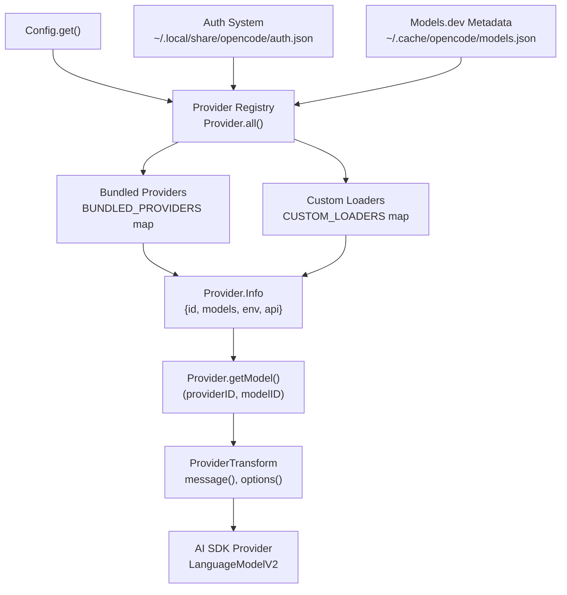
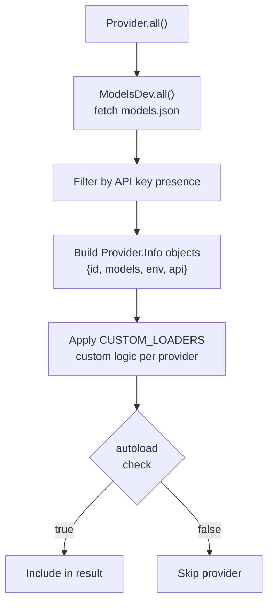
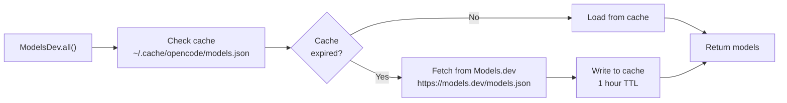
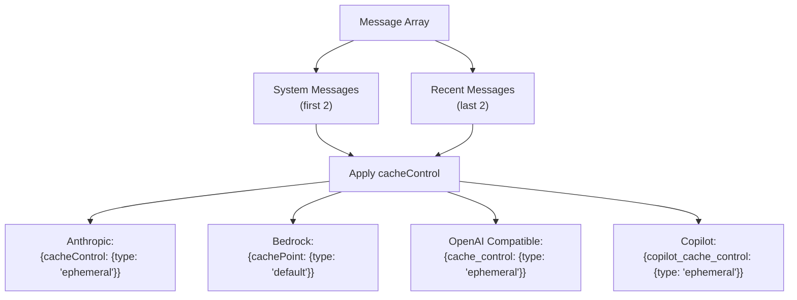
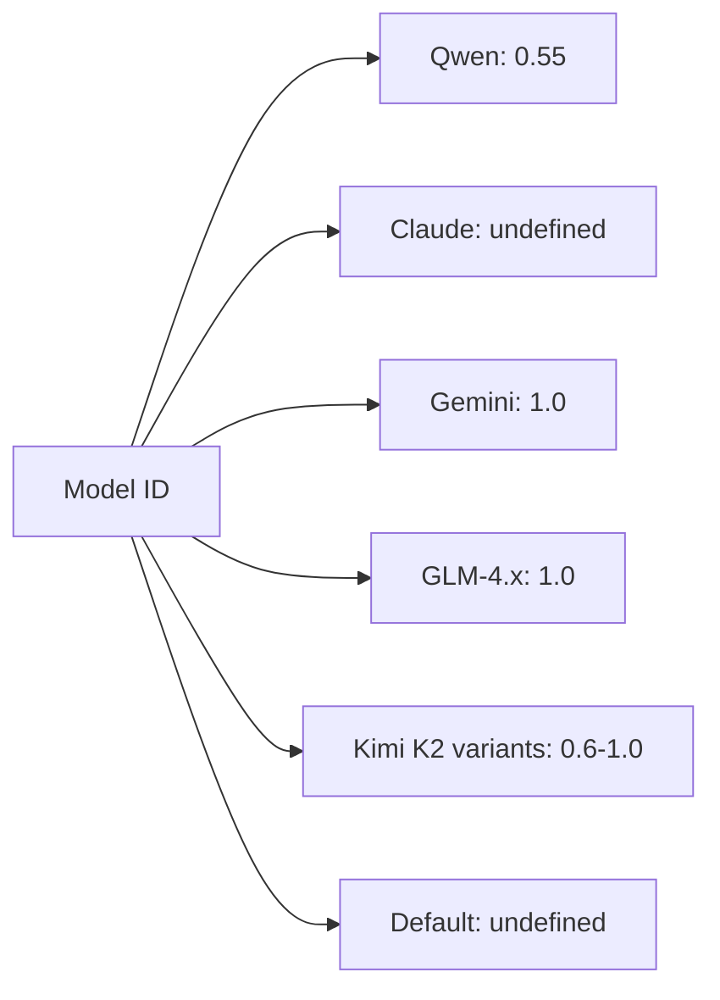
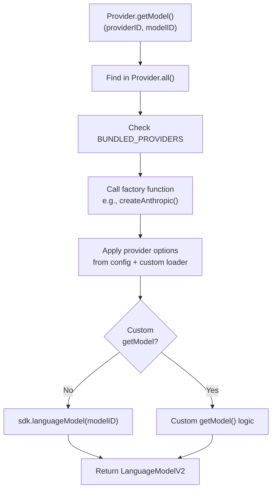
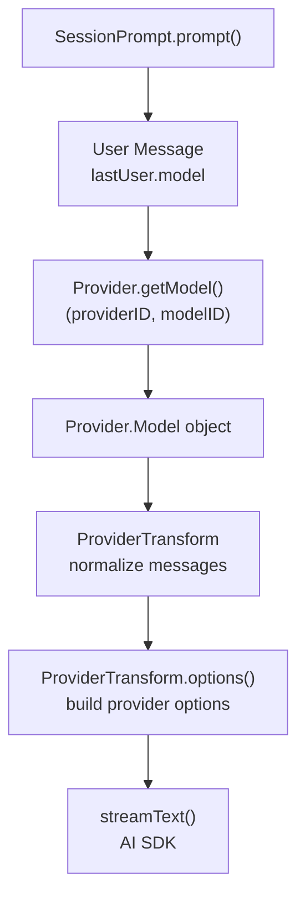
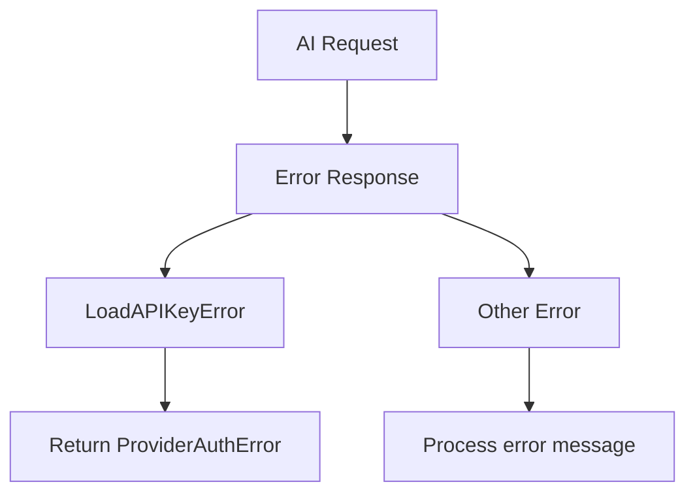

# AI Provider & Model Management

<details>
<summary>Relevant source files</summary>

The following files were used as context for generating this wiki page:

- [README.md](README.md)
- [packages/opencode/script/schema.ts](packages/opencode/script/schema.ts)
- [packages/opencode/src/auth/index.ts](packages/opencode/src/auth/index.ts)
- [packages/opencode/src/auth/service.ts](packages/opencode/src/auth/service.ts)
- [packages/opencode/src/cli/ui.ts](packages/opencode/src/cli/ui.ts)
- [packages/opencode/src/config/config.ts](packages/opencode/src/config/config.ts)
- [packages/opencode/src/env/index.ts](packages/opencode/src/env/index.ts)
- [packages/opencode/src/provider/error.ts](packages/opencode/src/provider/error.ts)
- [packages/opencode/src/provider/models.ts](packages/opencode/src/provider/models.ts)
- [packages/opencode/src/provider/provider.ts](packages/opencode/src/provider/provider.ts)
- [packages/opencode/src/provider/transform.ts](packages/opencode/src/provider/transform.ts)
- [packages/opencode/src/server/server.ts](packages/opencode/src/server/server.ts)
- [packages/opencode/src/session/compaction.ts](packages/opencode/src/session/compaction.ts)
- [packages/opencode/src/session/index.ts](packages/opencode/src/session/index.ts)
- [packages/opencode/src/session/llm.ts](packages/opencode/src/session/llm.ts)
- [packages/opencode/src/session/message-v2.ts](packages/opencode/src/session/message-v2.ts)
- [packages/opencode/src/session/message.ts](packages/opencode/src/session/message.ts)
- [packages/opencode/src/session/prompt.ts](packages/opencode/src/session/prompt.ts)
- [packages/opencode/src/session/revert.ts](packages/opencode/src/session/revert.ts)
- [packages/opencode/src/session/summary.ts](packages/opencode/src/session/summary.ts)
- [packages/opencode/src/tool/task.ts](packages/opencode/src/tool/task.ts)
- [packages/opencode/test/config/config.test.ts](packages/opencode/test/config/config.test.ts)
- [packages/opencode/test/provider/amazon-bedrock.test.ts](packages/opencode/test/provider/amazon-bedrock.test.ts)
- [packages/opencode/test/provider/gitlab-duo.test.ts](packages/opencode/test/provider/gitlab-duo.test.ts)
- [packages/opencode/test/provider/provider.test.ts](packages/opencode/test/provider/provider.test.ts)
- [packages/opencode/test/provider/transform.test.ts](packages/opencode/test/provider/transform.test.ts)
- [packages/opencode/test/session/llm.test.ts](packages/opencode/test/session/llm.test.ts)
- [packages/opencode/test/session/message-v2.test.ts](packages/opencode/test/session/message-v2.test.ts)
- [packages/opencode/test/session/revert-compact.test.ts](packages/opencode/test/session/revert-compact.test.ts)
- [packages/sdk/js/src/gen/sdk.gen.ts](packages/sdk/js/src/gen/sdk.gen.ts)
- [packages/sdk/js/src/gen/types.gen.ts](packages/sdk/js/src/gen/types.gen.ts)
- [packages/sdk/js/src/v2/gen/sdk.gen.ts](packages/sdk/js/src/v2/gen/sdk.gen.ts)
- [packages/sdk/js/src/v2/gen/types.gen.ts](packages/sdk/js/src/v2/gen/types.gen.ts)
- [packages/sdk/openapi.json](packages/sdk/openapi.json)
- [packages/web/src/components/Lander.astro](packages/web/src/components/Lander.astro)
- [packages/web/src/content/docs/go.mdx](packages/web/src/content/docs/go.mdx)
- [packages/web/src/content/docs/index.mdx](packages/web/src/content/docs/index.mdx)
- [packages/web/src/content/docs/providers.mdx](packages/web/src/content/docs/providers.mdx)
- [packages/web/src/content/docs/zen.mdx](packages/web/src/content/docs/zen.mdx)

</details>

This document explains how OpenCode integrates with AI providers, discovers and manages model metadata, and routes requests through the provider abstraction layer. It covers the provider initialization system, model capabilities detection, message transformation, and the optional OpenCode Zen/Go services.

For information about how sessions use models and agents, see [Session & Agent System](#2.3). For configuration of providers, see [Configuration System](#2.2).

---

## Provider Architecture Overview

OpenCode supports 75+ AI providers through a unified abstraction layer that normalizes differences between provider APIs while preserving provider-specific capabilities.

**Provider System Architecture**



Sources: [packages/opencode/src/provider/provider.ts:1-1000](), [packages/opencode/src/provider/models.ts:1-200]()

---

## Provider Registry and Initialization

The `Provider` namespace manages all provider integrations through a centralized registry system.

### Bundled Providers

OpenCode includes direct imports for common providers to avoid runtime installation overhead:

| Provider Package              | Factory Function           | Provider ID      |
| ----------------------------- | -------------------------- | ---------------- |
| `@ai-sdk/anthropic`           | `createAnthropic`          | `anthropic`      |
| `@ai-sdk/openai`              | `createOpenAI`             | `openai`         |
| `@ai-sdk/google`              | `createGoogleGenerativeAI` | `google`         |
| `@ai-sdk/amazon-bedrock`      | `createAmazonBedrock`      | `amazon-bedrock` |
| `@openrouter/ai-sdk-provider` | `createOpenRouter`         | `openrouter`     |
| `@ai-sdk/azure`               | `createAzure`              | `azure`          |
| `@ai-sdk/xai`                 | `createXai`                | `xai`            |

Sources: [packages/opencode/src/provider/provider.ts:88-111]()

### Provider Discovery Flow



Sources: [packages/opencode/src/provider/provider.ts:600-800]()

The `Provider.all()` function returns an array of enabled providers based on:

1. Available models from Models.dev
2. Presence of authentication credentials
3. Custom loader `autoload` decisions

---

## Models.dev Integration

OpenCode uses [Models.dev](https://models.dev) as the source of truth for model metadata, capabilities, and pricing.

### Model Metadata Schema

```typescript
// Model.Info structure from Models.dev
{
  id: string                    // e.g., "anthropic/claude-3-5-sonnet"
  name: string                  // Display name
  providerID: string           // Provider identifier
  api: {
    id: string                 // API model ID
    url: string                // Base URL
    npm: string                // AI SDK package
  }
  capabilities: {
    temperature: boolean
    reasoning: boolean
    attachment: boolean
    toolcall: boolean
    input: {
      text: boolean
      audio: boolean
      image: boolean
      video: boolean
      pdf: boolean
    }
    interleaved: boolean | { field: string }
  }
  cost: {
    input: number             // Per 1M tokens
    output: number
    cache: {
      read: number
      write: number
    }
  }
  limit: {
    context: number          // Total context window
    input?: number           // Max input tokens
    output: number           // Max output tokens
  }
}
```

Sources: [packages/opencode/src/provider/models.ts:18-100]()

### Model Cache Management

Models.dev data is cached locally to avoid repeated fetches:

**Cache Flow**



Sources: [packages/opencode/src/provider/models.ts:80-150]()

The cache is invalidated after 1 hour or when `OPENCODE_CACHE_MODELS` flag is set to force refresh.

---

## Provider Transform Layer

The `ProviderTransform` namespace normalizes messages and options across different provider implementations.

### Message Normalization

Different providers have different requirements for message formatting:

**Provider-Specific Transformations**

| Provider          | Transformation                         | Reason                                |
| ----------------- | -------------------------------------- | ------------------------------------- |
| Anthropic         | Filter empty messages and parts        | API rejects empty content             |
| Anthropic/Claude  | Sanitize tool call IDs                 | Only alphanumeric and `_-` allowed    |
| Mistral           | Normalize tool call IDs to 9 chars     | Requires exactly 9 alphanumeric chars |
| Mistral           | Insert assistant message after tool    | Cannot have user message after tool   |
| OpenAI-compatible | Extract reasoning to `providerOptions` | Supports `interleaved.field`          |

Sources: [packages/opencode/src/provider/transform.ts:47-172]()

### Caching Strategy

OpenCode applies prompt caching to reduce costs for supported providers:



Sources: [packages/opencode/src/provider/transform.ts:174-212]()

Cache control is applied to:

- First 2 system messages (stable prompts)
- Last 2 messages (recent context)

### Model-Specific Options

The transform layer applies provider-specific defaults:

**Temperature Defaults**



Sources: [packages/opencode/src/provider/transform.ts:292-317]()

---

## Model Selection and Routing

### Provider SDK Instantiation



Sources: [packages/opencode/src/provider/provider.ts:850-950]()

### Custom Model Loaders

Certain providers require special handling for model instantiation:

**OpenAI Responses API**

```typescript
// Custom loader for OpenAI
openai: async () => {
  return {
    autoload: false,
    async getModel(sdk, modelID, options) {
      return sdk.responses(modelID) // Use responses() not chat()
    },
  }
}
```

Sources: [packages/opencode/src/provider/provider.ts:154-162]()

**GitHub Copilot**

```typescript
// Decides between responses() and chat() based on model
"github-copilot": async () => {
  return {
    autoload: false,
    async getModel(sdk, modelID, options) {
      if (shouldUseCopilotResponsesApi(modelID)) {
        return sdk.responses(modelID)
      }
      return sdk.chat(modelID)
    }
  }
}
```

Sources: [packages/opencode/src/provider/provider.ts:163-172](), [packages/opencode/src/provider/provider.ts:52-62]()

**Amazon Bedrock Region Prefixing**

Bedrock requires special model ID transformation based on region:

```typescript
// Prefix models with region for cross-region inference
"amazon-bedrock": async () => {
  return {
    async getModel(sdk, modelID, options) {
      const region = options?.region ?? defaultRegion
      let regionPrefix = region.split("-")[0]

      // Special handling for us., eu., ap. prefixes
      if (regionPrefix === "us" && requiresPrefix(modelID)) {
        modelID = `us.${modelID}`
      }
      // ... more region logic

      return sdk.languageModel(modelID)
    }
  }
}
```

Sources: [packages/opencode/src/provider/provider.ts:212-358]()

---

## OpenCode Zen and Go Services

OpenCode provides two optional managed services for simplified model access.

### Service Comparison

| Feature        | OpenCode Zen                  | OpenCode Go                  |
| -------------- | ----------------------------- | ---------------------------- |
| Model Access   | Curated premium models        | Popular open models          |
| Pricing        | Per-request                   | Low-cost subscription        |
| Authentication | API key from console          | API key from console         |
| Base URL       | `https://opencode.ai/zen/v1/` | `https://opencode.ai/go/v1/` |

Sources: [packages/web/src/content/docs/zen.mdx:1-100]()

### Zen Model Endpoints

OpenCode Zen provides access to verified models through provider-specific endpoints:

| Model Family | Endpoint Path       | AI SDK Package              |
| ------------ | ------------------- | --------------------------- |
| GPT-5.x      | `/responses`        | `@ai-sdk/openai`            |
| Claude 4.x   | `/messages`         | `@ai-sdk/anthropic`         |
| Gemini 3.x   | `/models/gemini-*`  | `@ai-sdk/google`            |
| Others       | `/chat/completions` | `@ai-sdk/openai-compatible` |

Sources: [packages/web/src/content/docs/zen.mdx:62-95]()

### Zen Provider Implementation

```typescript
// Custom loader removes paid models when no API key present
async opencode(input) {
  const hasKey = await checkForApiKey()

  if (!hasKey) {
    // Remove paid models, keep only free tier
    for (const [key, value] of Object.entries(input.models)) {
      if (value.cost.input === 0) continue
      delete input.models[key]
    }
  }

  return {
    autoload: Object.keys(input.models).length > 0,
    options: hasKey ? {} : { apiKey: "public" }
  }
}
```

Sources: [packages/opencode/src/provider/provider.ts:132-153]()

---

## Provider Configuration

### Authentication Storage

Provider credentials are stored in `~/.local/share/opencode/auth.json`:

```typescript
// Auth.Info schema
{
  type: "api"          // or "oauth" or "wellknown"
  key: string          // API key
  access?: string      // OAuth access token
  refresh?: string     // OAuth refresh token
  token?: string       // Well-known token
}
```

Sources: [packages/opencode/src/auth.ts:20-50]() (referenced)

### Provider Config Schema

Providers can be configured in `opencode.json`:

```json
{
  "provider": {
    "<provider-id>": {
      "options": {
        "baseURL": "https://custom-endpoint.com",
        "apiKey": "${CUSTOM_API_KEY}",
        "headers": {
          "X-Custom-Header": "value"
        }
      },
      "default": "model-id"
    }
  }
}
```

Sources: [packages/opencode/src/config/config.ts:1000-1200]() (referenced)

### Base URL Templating

Provider base URLs support environment variable interpolation:

```typescript
function loadBaseURL(model, options) {
  const raw = options['baseURL'] ?? model.api.url

  // For Google Vertex, expand special variables
  const vars =
    model.providerID === 'google-vertex' ? googleVertexVars(options) : undefined

  return raw.replace(/\$\{([^}]+)\}/g, (match, key) => {
    const val = Env.get(key) ?? vars?.[key]
    return val ?? match
  })
}
```

Sources: [packages/opencode/src/provider/provider.ts:78-86]()

---

## Model Routing in Sessions

When a session prompt is created, the model is selected and instantiated through this flow:

**Session to Model Resolution**



Sources: [packages/opencode/src/session/prompt.ts:336-347](), [packages/opencode/src/session/llm.ts:1-200]()

### Model Variant Support

Reasoning models support variants that control inference effort:

**Variant Configuration**

| Provider   | Variants                                            | Parameter                   |
| ---------- | --------------------------------------------------- | --------------------------- |
| OpenAI     | `none`, `minimal`, `low`, `medium`, `high`, `xhigh` | `reasoningEffort`           |
| Anthropic  | `low`, `medium`, `high`, `max`                      | `thinking.type: "adaptive"` |
| Gemini     | `low`, `high`                                       | `thinkingLevel`             |
| OpenRouter | Same as underlying model                            | `reasoning.effort`          |

Sources: [packages/opencode/src/provider/transform.ts:329-500]()

Variants are applied via `ProviderTransform.variants()` which returns provider-specific option objects.

---

## Error Handling

### Provider Authentication Errors



Sources: [packages/opencode/src/provider/error.ts:1-100]() (referenced), [packages/opencode/src/session/message-v2.ts:33-49]()

The `MessageV2.AuthError` type captures provider authentication failures with the provider ID and error message for user-friendly display.

### API Error Normalization

All provider errors are normalized to `MessageV2.APIError`:

```typescript
{
  name: "APIError"
  data: {
    message: string
    statusCode?: number
    isRetryable: boolean
    responseHeaders?: Record<string, string>
    responseBody?: string
    metadata?: Record<string, string>
  }
}
```

Sources: [packages/opencode/src/session/message-v2.ts:40-50]()

---

## Summary

The AI Provider & Model Management system in OpenCode provides:

1. **Unified Provider Abstraction** - Single interface for 75+ providers via AI SDK
2. **Model Metadata Service** - Models.dev integration for capabilities and pricing
3. **Provider Transform Layer** - Message normalization and provider-specific optimizations
4. **Custom Loaders** - Per-provider logic for authentication and model instantiation
5. **Optional Managed Services** - OpenCode Zen and Go for simplified access
6. **Flexible Configuration** - Per-provider options, base URL overrides, authentication

The architecture separates concerns between provider discovery ([packages/opencode/src/provider/provider.ts]()), model metadata ([packages/opencode/src/provider/models.ts]()), and message transformation ([packages/opencode/src/provider/transform.ts]()), allowing each component to evolve independently while maintaining a consistent interface for session prompting.
