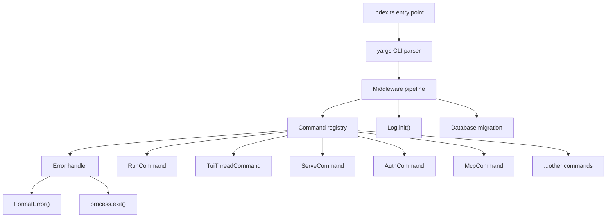
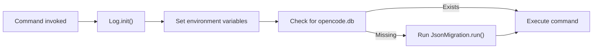
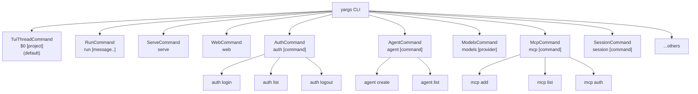
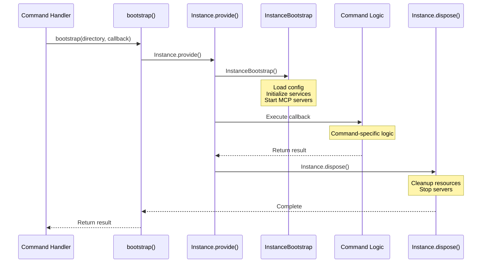
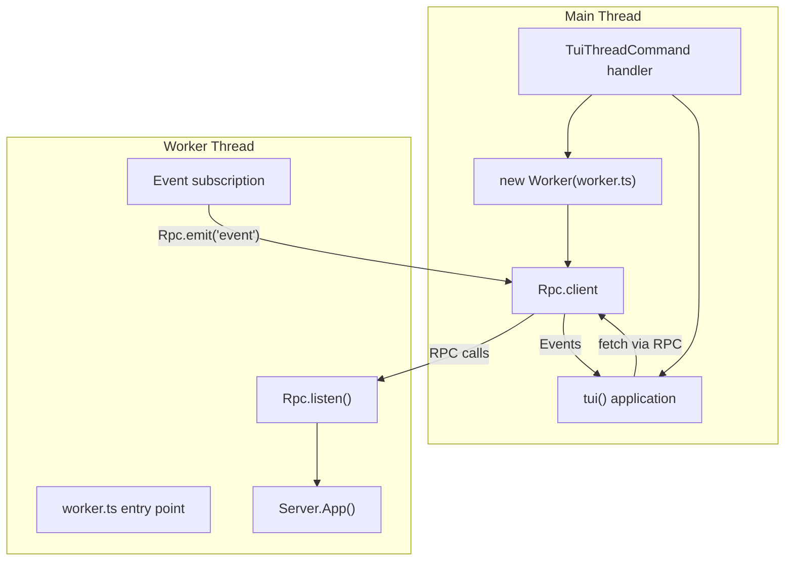
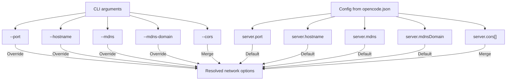
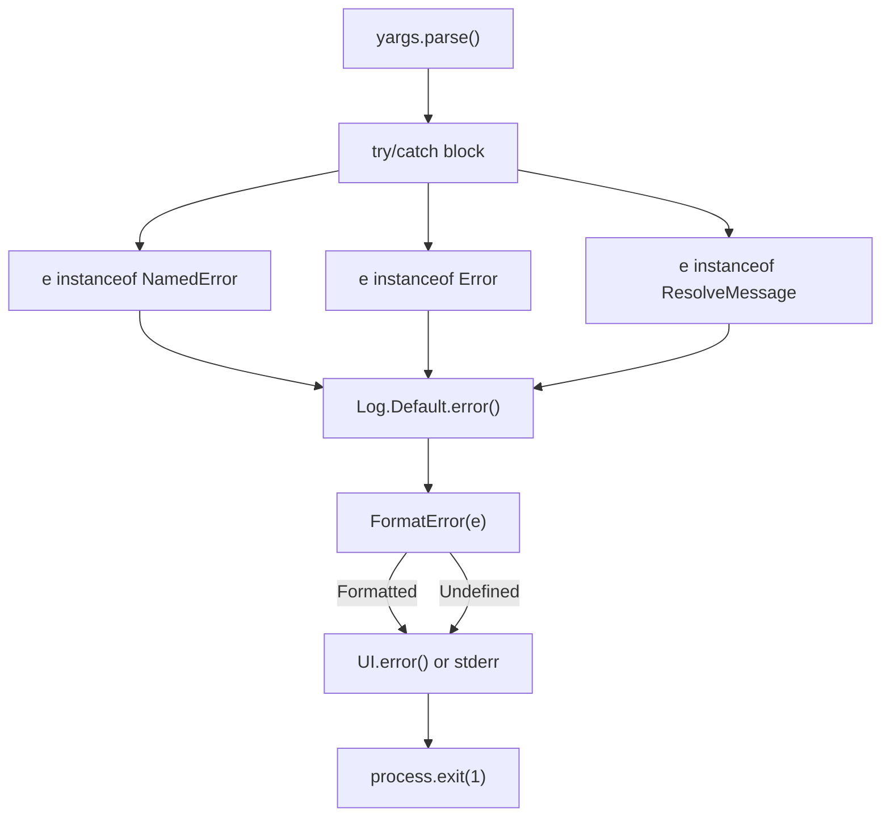
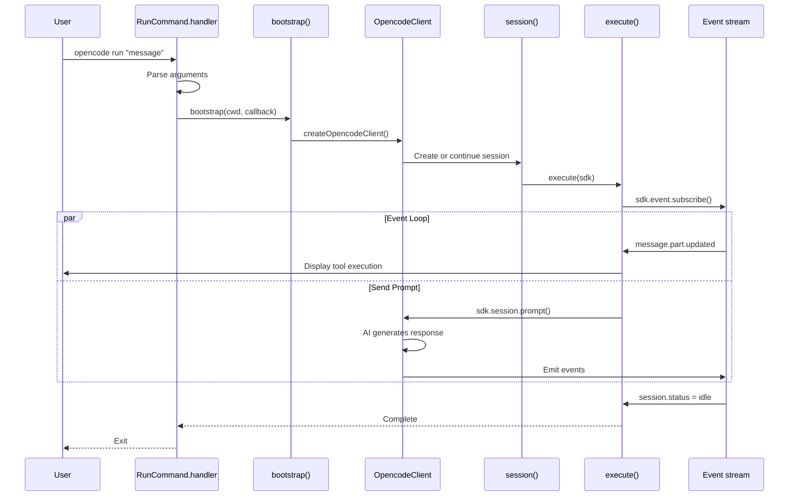
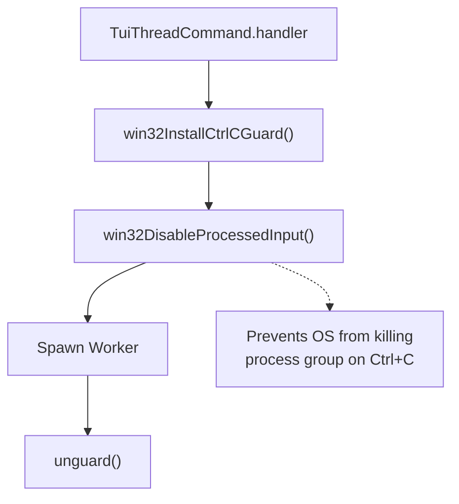

# CLI Entrypoint & Commands

<details>
<summary>Relevant source files</summary>

The following files were used as context for generating this wiki page:

- [packages/opencode/src/cli/bootstrap.ts](packages/opencode/src/cli/bootstrap.ts)
- [packages/opencode/src/cli/cmd/acp.ts](packages/opencode/src/cli/cmd/acp.ts)
- [packages/opencode/src/cli/cmd/run.ts](packages/opencode/src/cli/cmd/run.ts)
- [packages/opencode/src/cli/cmd/serve.ts](packages/opencode/src/cli/cmd/serve.ts)
- [packages/opencode/src/cli/cmd/tui/context/sync.tsx](packages/opencode/src/cli/cmd/tui/context/sync.tsx)
- [packages/opencode/src/cli/cmd/tui/thread.ts](packages/opencode/src/cli/cmd/tui/thread.ts)
- [packages/opencode/src/cli/cmd/tui/worker.ts](packages/opencode/src/cli/cmd/tui/worker.ts)
- [packages/opencode/src/cli/cmd/web.ts](packages/opencode/src/cli/cmd/web.ts)
- [packages/opencode/src/cli/network.ts](packages/opencode/src/cli/network.ts)
- [packages/opencode/src/index.ts](packages/opencode/src/index.ts)
- [packages/opencode/src/server/mdns.ts](packages/opencode/src/server/mdns.ts)
- [packages/sdk/js/src/index.ts](packages/sdk/js/src/index.ts)
- [packages/web/src/content/docs/cli.mdx](packages/web/src/content/docs/cli.mdx)
- [packages/web/src/content/docs/config.mdx](packages/web/src/content/docs/config.mdx)
- [packages/web/src/content/docs/ide.mdx](packages/web/src/content/docs/ide.mdx)
- [packages/web/src/content/docs/plugins.mdx](packages/web/src/content/docs/plugins.mdx)
- [packages/web/src/content/docs/sdk.mdx](packages/web/src/content/docs/sdk.mdx)
- [packages/web/src/content/docs/server.mdx](packages/web/src/content/docs/server.mdx)
- [packages/web/src/content/docs/tui.mdx](packages/web/src/content/docs/tui.mdx)

</details>

This document describes the CLI entrypoint, command routing system, bootstrap process, and command implementations. It covers how OpenCode starts, parses arguments, initializes the project instance, and dispatches to various command handlers.

For information about the TUI application itself (UI components, rendering), see [Terminal User Interface (TUI)](#3.1). For the HTTP server started by `serve` and `web` commands, see [HTTP Server & REST API](#2.6). For configuration loading and hierarchy, see [Configuration System](#2.2).

---

## Entrypoint Architecture

The CLI entrypoint is located at [packages/opencode/src/index.ts:1-217](). It uses `yargs` for command-line argument parsing and provides a structured command system with middleware, global options, and error handling.

### Main Components



**Sources:** [packages/opencode/src/index.ts:54-217]()

### CLI Parser Configuration

The yargs parser is configured at [packages/opencode/src/index.ts:54-61]() with:

| Configuration                  | Value                    | Purpose                         |
| ------------------------------ | ------------------------ | ------------------------------- |
| `scriptName`                   | `"opencode"`             | Command name in help output     |
| `wrap`                         | `100`                    | Terminal width for help text    |
| `parserConfiguration`          | `{ "populate--": true }` | Enables `--` argument separator |
| `help` / `--help` / `-h`       | Enabled                  | Show help message               |
| `version` / `--version` / `-v` | `Installation.VERSION`   | Show version number             |

**Sources:** [packages/opencode/src/index.ts:54-61]()

### Global Options

Two global options are available for all commands:

| Option         | Type    | Choices                  | Description           |
| -------------- | ------- | ------------------------ | --------------------- |
| `--print-logs` | boolean | -                        | Print logs to stderr  |
| `--log-level`  | string  | DEBUG, INFO, WARN, ERROR | Set logging verbosity |

**Sources:** [packages/opencode/src/index.ts:62-70]()

---

## Middleware Pipeline

The middleware function runs before any command and initializes the logging system and performs one-time database migration:



**Sources:** [packages/opencode/src/index.ts:71-127]()

### Middleware Steps

1. **Log Initialization** [packages/opencode/src/index.ts:72-80]()
   - Reads `--print-logs` flag
   - Determines log level from `--log-level` or defaults based on `Installation.isLocal()`
   - Calls `Log.init()` with configuration

2. **Environment Variables** [packages/opencode/src/index.ts:82-89]()
   - Sets `AGENT=1`, `OPENCODE=1`, `OPENCODE_PID`
   - Logs version and arguments

3. **Database Migration** [packages/opencode/src/index.ts:91-126]()
   - Checks for marker file at `Global.Path.data/opencode.db`
   - If missing, runs one-time migration from JSON to SQLite using `JsonMigration.run()`
   - Shows progress bar during migration

**Sources:** [packages/opencode/src/index.ts:71-127]()

---

## Command Registration

Commands are registered using the `.command()` method at [packages/opencode/src/index.ts:130-154](). The default command (invoked when no command is specified) is `TuiThreadCommand`.

### Registered Commands



**Sources:** [packages/opencode/src/index.ts:130-154]()

### Command Implementation Pattern

All commands follow the `cmd()` helper pattern defined at [packages/opencode/src/cli/cmd/cmd.ts](). Each command exports an object with:

| Property   | Type           | Description                           |
| ---------- | -------------- | ------------------------------------- |
| `command`  | string         | Command name and positional arguments |
| `describe` | string         | Help text description                 |
| `builder`  | function       | Yargs builder for options             |
| `handler`  | async function | Command implementation                |

**Sources:** [packages/opencode/src/cli/cmd/run.ts:221-664](), [packages/opencode/src/cli/cmd/serve.ts:9-24]()

---

## Bootstrap Process

Most commands that need to interact with the OpenCode core system use the `bootstrap()` function to initialize a project instance.



**Sources:** [packages/opencode/src/cli/bootstrap.ts:1-18]()

### Bootstrap Implementation

The `bootstrap()` function wraps command logic with instance lifecycle management:

```typescript
// Simplified from packages/opencode/src/cli/bootstrap.ts
export async function bootstrap<T>(directory: string, cb: () => Promise<T>) {
  return Instance.provide({
    directory,
    init: InstanceBootstrap,
    fn: async () => {
      try {
        const result = await cb()
        return result
      } finally {
        await Instance.dispose()
      }
    },
  })
}
```

**Sources:** [packages/opencode/src/cli/bootstrap.ts:4-17]()

### What InstanceBootstrap Does

The `InstanceBootstrap` function (referenced in [Configuration System](#2.2)) performs:

- Configuration loading from all layers
- Plugin initialization
- MCP server connection
- Skill discovery
- LSP server startup
- Database connection

**Sources:** [packages/opencode/src/cli/bootstrap.ts:1-18]()

---

## Command Categories

### Interactive Commands

**TuiThreadCommand** [packages/opencode/src/cli/cmd/tui/thread.ts:62-220]()

- Default command when no command specified
- Starts the TUI in a worker thread
- Supports `--continue`, `--session`, `--fork`, `--model`, `--agent` options
- Uses worker architecture for clean process separation

**AttachCommand** [packages/opencode/src/index.ts:133]()

- Attaches TUI to an already running OpenCode server
- Allows TUI to connect to `serve` or `web` backend

### Non-Interactive Execution

**RunCommand** [packages/opencode/src/cli/cmd/run.ts:221-664]()

- Executes a prompt without interactive TUI
- Supports `--format json` for programmatic output
- Can `--attach` to running server to avoid cold starts
- File attachment via `--file` flag
- Streaming tool execution display

### Server Commands

**ServeCommand** [packages/opencode/src/cli/cmd/serve.ts:9-24]()

- Starts headless HTTP server
- No browser opening
- Supports `--port`, `--hostname`, `--mdns`, `--cors`

**WebCommand** [packages/opencode/src/cli/cmd/web.ts:31-81]()

- Starts HTTP server and opens web browser
- Shows local and network access URLs
- Same network options as `serve`

**AcpCommand** [packages/opencode/src/cli/cmd/acp.ts:12-70]()

- Starts Agent Client Protocol server
- Communicates via stdin/stdout using nd-JSON
- Sets `OPENCODE_CLIENT=acp` environment variable

### Management Commands

| Command   | Subcommands                    | Purpose                  |
| --------- | ------------------------------ | ------------------------ |
| `auth`    | login, list, logout            | Provider authentication  |
| `agent`   | create, list                   | Custom agent management  |
| `mcp`     | add, list, auth, logout, debug | MCP server configuration |
| `models`  | -                              | List available models    |
| `session` | list                           | Session management       |
| `stats`   | -                              | Usage statistics         |

**Sources:** [packages/opencode/src/index.ts:130-150]()

### Utility Commands

| Command     | Purpose                               |
| ----------- | ------------------------------------- |
| `export`    | Export session as JSON                |
| `import`    | Import session from JSON or share URL |
| `github`    | GitHub integration management         |
| `pr`        | Pull request operations               |
| `debug`     | Debug information                     |
| `db`        | Database operations                   |
| `upgrade`   | Update to latest version              |
| `uninstall` | Remove OpenCode                       |

**Sources:** [packages/opencode/src/index.ts:136-150]()

---

## TUI Worker Architecture

The TUI runs in a separate worker thread to isolate the UI from the server and improve stability. This architecture is implemented in `TuiThreadCommand`.



**Sources:** [packages/opencode/src/cli/cmd/tui/thread.ts:24-53](), [packages/opencode/src/cli/cmd/tui/worker.ts:1-154]()

### Worker Creation

The TUI worker is spawned at [packages/opencode/src/cli/cmd/tui/thread.ts:126-133]():

```typescript
const worker = new Worker(file, {
  env: Object.fromEntries(
    Object.entries(process.env).filter(
      (entry): entry is [string, string] => entry[1] !== undefined
    )
  ),
})
```

### RPC Methods

The worker exposes these RPC methods at [packages/opencode/src/cli/cmd/tui/worker.ts:100-144]():

| Method         | Parameters                       | Purpose                               |
| -------------- | -------------------------------- | ------------------------------------- |
| `fetch`        | `{ url, method, headers, body }` | Proxy HTTP requests to `Server.App()` |
| `server`       | `{ port, hostname, mdns, cors }` | Start external HTTP server            |
| `checkUpgrade` | `{ directory }`                  | Check for available updates           |
| `reload`       | -                                | Reset config and dispose instances    |
| `shutdown`     | -                                | Clean shutdown of worker              |

**Sources:** [packages/opencode/src/cli/cmd/tui/worker.ts:100-144]()

### Transport Selection

The TUI can use two transport modes:

**Internal Transport** (default)

- `fetch`: RPC-proxied requests to worker
- `events`: RPC-forwarded event stream
- No network exposure
- Faster startup

**External Transport** (`--port`, `--hostname`, or `--mdns` flags)

- `url`: Actual HTTP URL
- `fetch`: Standard HTTP fetch
- `events`: Server-sent events
- Accessible from network

**Sources:** [packages/opencode/src/cli/cmd/tui/thread.ts:172-190]()

---

## Network Configuration

Server-based commands (`serve`, `web`, `acp`) support network configuration through the `withNetworkOptions()` helper.

### Network Options



**Sources:** [packages/opencode/src/cli/network.ts:1-61]()

### Option Resolution

The `resolveNetworkOptions()` function at [packages/opencode/src/cli/network.ts:39-60]() applies this precedence:

1. Explicit CLI flags take highest priority
2. Config file values (`server.port`, `server.hostname`, etc.)
3. Default values
4. Special case: if `--mdns` is enabled and hostname not set, defaults to `0.0.0.0`

### Network Configuration Table

| Option      | Config Key          | CLI Flag         | Default          | Description                   |
| ----------- | ------------------- | ---------------- | ---------------- | ----------------------------- |
| Port        | `server.port`       | `--port`         | `0` (random)     | TCP port to bind              |
| Hostname    | `server.hostname`   | `--hostname`     | `127.0.0.1`      | Network interface to bind     |
| mDNS        | `server.mdns`       | `--mdns`         | `false`          | Enable Bonjour/mDNS discovery |
| mDNS Domain | `server.mdnsDomain` | `--mdns-domain`  | `opencode.local` | Advertised mDNS hostname      |
| CORS        | `server.cors[]`     | `--cors` (array) | `[]`             | Additional CORS origins       |

**Sources:** [packages/opencode/src/cli/network.ts:4-31]()

---

## Environment Flags

The `Flag` namespace at [packages/opencode/src/flag/flag.ts:11-117]() provides type-safe access to environment variables that control OpenCode behavior.

### Flag Categories

```mermaid
graph TB
    Flags["Flag namespace"]

    Flags --> Config["Configuration"]
    Flags --> Feature["Feature toggles"]
    Flags --> Server["Server settings"]
    Flags --> Experimental["Experimental features"]

    Config --> OPENCODE_CONFIG
    Config --> OPENCODE_CONFIG_DIR
    Config --> OPENCODE_CONFIG_CONTENT
    Config --> OPENCODE_TUI_CONFIG

    Feature --> OPENCODE_AUTO_SHARE
    Feature --> OPENCODE_DISABLE_AUTOUPDATE
    Feature --> OPENCODE_DISABLE_PRUNE
    Feature --> OPENCODE_DISABLE_DEFAULT_PLUGINS

    Server --> OPENCODE_SERVER_PASSWORD
    Server --> OPENCODE_SERVER_USERNAME
    Server --> OPENCODE_CLIENT

    Experimental --> OPENCODE_EXPERIMENTAL
    Experimental --> OPENCODE_EXPERIMENTAL_LSP_TOOL
    Experimental --> OPENCODE_EXPERIMENTAL_PLAN_MODE
```



**Sources:** [packages/opencode/src/flag/flag.ts:11-72]()

### Dynamic Flags

Some flags use dynamic property getters to allow runtime modification:

| Flag                              | Getter Location                                | Reason for Dynamic Evaluation |
| --------------------------------- | ---------------------------------------------- | ----------------------------- |
| `OPENCODE_DISABLE_PROJECT_CONFIG` | [packages/opencode/src/flag/flag.ts:77-83]()   | External tools set at runtime |
| `OPENCODE_TUI_CONFIG`             | [packages/opencode/src/flag/flag.ts:88-94]()   | Tests override at runtime     |
| `OPENCODE_CONFIG_DIR`             | [packages/opencode/src/flag/flag.ts:99-105]()  | External tools set at runtime |
| `OPENCODE_CLIENT`                 | [packages/opencode/src/flag/flag.ts:110-116]() | Commands override at runtime  |

**Sources:** [packages/opencode/src/flag/flag.ts:74-117]()

### Helper Functions

```typescript
// From packages/opencode/src/flag/flag.ts
function truthy(key: string): boolean {
  const value = process.env[key]?.toLowerCase()
  return value === 'true' || value === '1'
}

function falsy(key: string): boolean {
  const value = process.env[key]?.toLowerCase()
  return value === 'false' || value === '0'
}
```

**Sources:** [packages/opencode/src/flag/flag.ts:1-9]()

---

## Error Handling

The CLI implements comprehensive error handling at [packages/opencode/src/index.ts:171-216]().

### Error Flow



**Sources:** [packages/opencode/src/index.ts:171-216]()

### Error Types Handled

1. **NamedError** [packages/opencode/src/index.ts:175-180]()
   - Extracts data using `e.toObject()`
   - Logs structured error information

2. **Standard Error** [packages/opencode/src/index.ts:182-189]()
   - Logs name, message, cause, stack

3. **ResolveMessage** [packages/opencode/src/index.ts:191-200]()
   - Module resolution errors
   - Logs code, specifier, referrer, position, importKind

4. **Unknown Errors**
   - Converted to string and logged

**Sources:** [packages/opencode/src/index.ts:171-216]()

### Yargs Failure Handler

The `.fail()` handler at [packages/opencode/src/index.ts:157-168]() provides custom error messages:

- Unknown arguments → Show help
- Insufficient arguments → Show help
- Invalid values → Show help
- Other errors → Throw for main handler

**Sources:** [packages/opencode/src/index.ts:157-168]()

---

## Command Execution Flow

### RunCommand Example

The `run` command demonstrates the typical flow for non-interactive execution:



**Sources:** [packages/opencode/src/cli/cmd/run.ts:301-663]()

### Key Steps in RunCommand

1. **Argument Processing** [packages/opencode/src/cli/cmd/run.ts:302-350]()
   - Parse message and `--` separator
   - Handle `--dir` for directory change
   - Process `--file` attachments
   - Read from stdin if piped

2. **Session Selection** [packages/opencode/src/cli/cmd/run.ts:376-389]()
   - Continue last session with `--continue`
   - Resume specific session with `--session`
   - Fork session if `--fork` specified
   - Create new session otherwise

3. **Permission Rules** [packages/opencode/src/cli/cmd/run.ts:352-368]()
   - Auto-deny `question` tool (no interactive prompts)
   - Auto-deny `plan_enter` and `plan_exit`

4. **Event Loop** [packages/opencode/src/cli/cmd/run.ts:439-553]()
   - Subscribe to event stream
   - Display tool executions with custom formatters
   - Output text parts
   - Handle errors
   - Stop on `session.status = idle`

5. **Tool Formatting** [packages/opencode/src/cli/cmd/run.ts:407-426]()
   - Custom display logic for each tool type
   - `bash`, `edit`, `write` show output
   - `read`, `glob`, `grep` show summaries
   - `task` shows subtask progress

**Sources:** [packages/opencode/src/cli/cmd/run.ts:221-664]()

---

## Process Lifecycle

### Signal Handling

The entrypoint registers process event handlers:

| Signal/Event         | Location                                 | Action                              |
| -------------------- | ---------------------------------------- | ----------------------------------- |
| `unhandledRejection` | [packages/opencode/src/index.ts:37-41]() | Log error                           |
| `uncaughtException`  | [packages/opencode/src/index.ts:43-47]() | Log error                           |
| `SIGHUP`             | [packages/opencode/src/index.ts:49-52]() | `process.exit()` to prevent orphans |

**Sources:** [packages/opencode/src/index.ts:37-52]()

### Explicit Exit

The CLI explicitly calls `process.exit()` at [packages/opencode/src/index.ts:211-215]() in the finally block to avoid hanging subprocesses, particularly docker-based MCP servers that may not handle signals properly.

**Sources:** [packages/opencode/src/index.ts:211-215]()

---

## Windows Platform Handling

TUI commands implement special Windows handling for Ctrl+C:



The `win32DisableProcessedInput()` function must run before any Worker spawn or async work to prevent the Windows console from killing the entire process group on Ctrl+C events.

**Sources:** [packages/opencode/src/cli/cmd/tui/thread.ts:99-106]()
