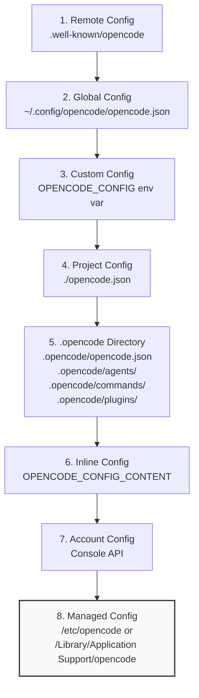
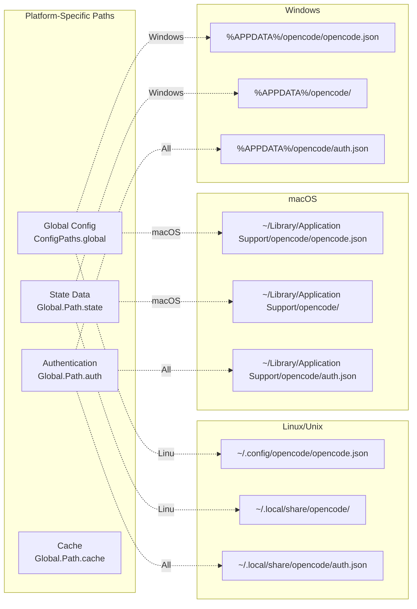
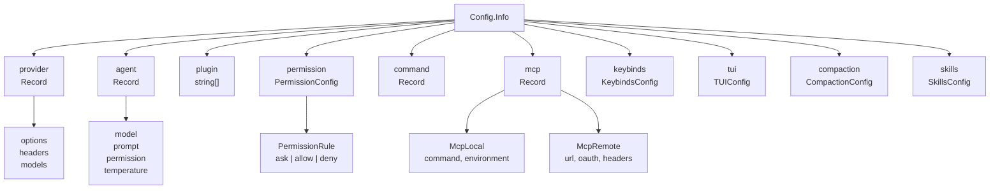
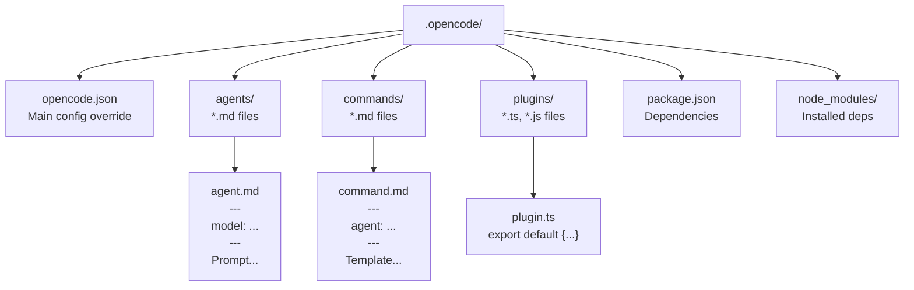
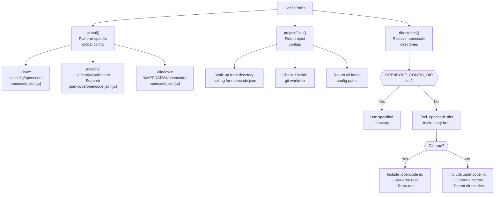
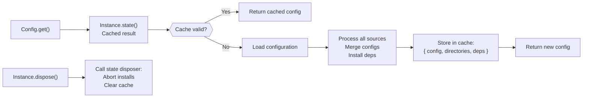

# Configuration System

<details>
<summary>Relevant source files</summary>

The following files were used as context for generating this wiki page:

- [README.md](README.md)
- [packages/opencode/script/schema.ts](packages/opencode/script/schema.ts)
- [packages/opencode/src/auth/index.ts](packages/opencode/src/auth/index.ts)
- [packages/opencode/src/auth/service.ts](packages/opencode/src/auth/service.ts)
- [packages/opencode/src/cli/ui.ts](packages/opencode/src/cli/ui.ts)
- [packages/opencode/src/config/config.ts](packages/opencode/src/config/config.ts)
- [packages/opencode/src/env/index.ts](packages/opencode/src/env/index.ts)
- [packages/opencode/src/provider/error.ts](packages/opencode/src/provider/error.ts)
- [packages/opencode/src/provider/models.ts](packages/opencode/src/provider/models.ts)
- [packages/opencode/src/provider/provider.ts](packages/opencode/src/provider/provider.ts)
- [packages/opencode/src/provider/transform.ts](packages/opencode/src/provider/transform.ts)
- [packages/opencode/src/server/server.ts](packages/opencode/src/server/server.ts)
- [packages/opencode/src/session/compaction.ts](packages/opencode/src/session/compaction.ts)
- [packages/opencode/src/session/index.ts](packages/opencode/src/session/index.ts)
- [packages/opencode/src/session/llm.ts](packages/opencode/src/session/llm.ts)
- [packages/opencode/src/session/message-v2.ts](packages/opencode/src/session/message-v2.ts)
- [packages/opencode/src/session/message.ts](packages/opencode/src/session/message.ts)
- [packages/opencode/src/session/prompt.ts](packages/opencode/src/session/prompt.ts)
- [packages/opencode/src/session/revert.ts](packages/opencode/src/session/revert.ts)
- [packages/opencode/src/session/summary.ts](packages/opencode/src/session/summary.ts)
- [packages/opencode/src/tool/task.ts](packages/opencode/src/tool/task.ts)
- [packages/opencode/test/config/config.test.ts](packages/opencode/test/config/config.test.ts)
- [packages/opencode/test/provider/amazon-bedrock.test.ts](packages/opencode/test/provider/amazon-bedrock.test.ts)
- [packages/opencode/test/provider/gitlab-duo.test.ts](packages/opencode/test/provider/gitlab-duo.test.ts)
- [packages/opencode/test/provider/provider.test.ts](packages/opencode/test/provider/provider.test.ts)
- [packages/opencode/test/provider/transform.test.ts](packages/opencode/test/provider/transform.test.ts)
- [packages/opencode/test/session/llm.test.ts](packages/opencode/test/session/llm.test.ts)
- [packages/opencode/test/session/message-v2.test.ts](packages/opencode/test/session/message-v2.test.ts)
- [packages/opencode/test/session/revert-compact.test.ts](packages/opencode/test/session/revert-compact.test.ts)
- [packages/sdk/js/src/gen/sdk.gen.ts](packages/sdk/js/src/gen/sdk.gen.ts)
- [packages/sdk/js/src/gen/types.gen.ts](packages/sdk/js/src/gen/types.gen.ts)
- [packages/sdk/js/src/v2/gen/sdk.gen.ts](packages/sdk/js/src/v2/gen/sdk.gen.ts)
- [packages/sdk/js/src/v2/gen/types.gen.ts](packages/sdk/js/src/v2/gen/types.gen.ts)
- [packages/sdk/openapi.json](packages/sdk/openapi.json)
- [packages/web/src/components/Lander.astro](packages/web/src/components/Lander.astro)
- [packages/web/src/content/docs/go.mdx](packages/web/src/content/docs/go.mdx)
- [packages/web/src/content/docs/index.mdx](packages/web/src/content/docs/index.mdx)
- [packages/web/src/content/docs/providers.mdx](packages/web/src/content/docs/providers.mdx)
- [packages/web/src/content/docs/zen.mdx](packages/web/src/content/docs/zen.mdx)

</details>

The Configuration System manages hierarchical loading and merging of OpenCode settings from multiple sources with well-defined precedence rules. It handles configuration for providers, agents, tools, permissions, plugins, and UI preferences across global, project, and runtime scopes.

For provider-specific authentication credentials, see the auth system. For runtime flag overrides, see [CLI Entrypoint & Commands](#2.1).

---

## Configuration Sources and Precedence

OpenCode loads configuration from multiple sources in a specific order, with later sources overriding earlier ones. The system uses deep merging with special handling for array fields like `plugin` and `instructions`.

**Configuration Loading Order (lowest to highest precedence):**



Sources: [packages/opencode/src/config/config.ts:81-214]()

### Precedence Rules

| Priority    | Source              | Description                                    | Can Disable                             |
| ----------- | ------------------- | ---------------------------------------------- | --------------------------------------- |
| 8 (Highest) | Managed Config      | Enterprise admin-controlled settings           | No                                      |
| 7           | Account Config      | Console organization settings                  | Yes (logout)                            |
| 6           | Inline Config       | `OPENCODE_CONFIG_CONTENT` environment variable | Yes (unset)                             |
| 5           | .opencode Directory | Project-local configs, agents, plugins         | Yes (remove directory)                  |
| 4           | Project Config      | `opencode.json` in project root                | Yes (`OPENCODE_DISABLE_PROJECT_CONFIG`) |
| 3           | Custom Config       | Path specified by `OPENCODE_CONFIG`            | Yes (unset)                             |
| 2           | Global Config       | User-level configuration                       | No                                      |
| 1 (Lowest)  | Remote Config       | Fetched from `.well-known/opencode` URL        | Yes (remove auth)                       |

Sources: [packages/opencode/src/config/config.ts:81-109](), [packages/opencode/src/config/config.ts:114-128]()

---

## Configuration File Locations



### Managed Configuration Paths

Managed configurations (enterprise-controlled, highest precedence) are located at:

| Platform | Path                                                  |
| -------- | ----------------------------------------------------- |
| Linux    | `/etc/opencode/opencode.json`                         |
| macOS    | `/Library/Application Support/opencode/opencode.json` |
| Windows  | `C:\ProgramData\opencode\opencode.json`               |

Override with: `OPENCODE_TEST_MANAGED_CONFIG_DIR` (testing only)

Sources: [packages/opencode/src/config/config.ts:48-64](), [packages/opencode/src/config/paths.ts]()

---

## Configuration Schema

The root configuration object is defined by `Config.Info` schema. Here are the primary sections:



Sources: [packages/opencode/src/config/config.ts:843-967]()

### Core Configuration Fields

| Field          | Type                               | Description                             |
| -------------- | ---------------------------------- | --------------------------------------- |
| `$schema`      | `string`                           | JSON Schema URL for validation          |
| `provider`     | `Record<string, ProviderConfig>`   | AI provider configurations              |
| `agent`        | `Record<string, AgentConfig>`      | Agent definitions (build, plan, custom) |
| `mode`         | `Record<string, AgentConfig>`      | Legacy: migrated to `agent`             |
| `plugin`       | `string[]`                         | Plugin specifiers (npm, file://, local) |
| `permission`   | `PermissionConfig`                 | Tool permission rules                   |
| `tools`        | `Record<string, boolean>`          | Legacy: migrated to `permission`        |
| `command`      | `Record<string, Command>`          | Slash command definitions               |
| `mcp`          | `Record<string, McpConfig>`        | MCP server configurations               |
| `instructions` | `string[]`                         | Additional system prompt instructions   |
| `username`     | `string`                           | User identifier for prompts             |
| `share`        | `"auto" \| "manual" \| "disabled"` | Session sharing behavior                |
| `keybinds`     | `KeybindsConfig`                   | TUI keyboard shortcuts                  |
| `tui`          | `TUIConfig`                        | Terminal UI settings                    |
| `compaction`   | `CompactionConfig`                 | Context management settings             |
| `skills`       | `SkillsConfig`                     | Skill paths and URLs                    |

Sources: [packages/opencode/src/config/config.ts:843-967]()

---

## Configuration Loading Implementation

The configuration loading process is implemented in `Config.state()` using the Instance state pattern:

```mermaid
graph TB
    Start["Config.state()"]

    Start --> LoadAuth["Load Auth.all()<br/>Check for wellknown tokens"]

    LoadAuth --> RemoteLoop["For each wellknown auth:<br/>Fetch .well-known/opencode"]
    RemoteLoop --> MergeRemote["mergeConfigConcatArrays()<br/>result + remoteConfig"]

    MergeRemote --> LoadGlobal["Load Config.global()<br/>~/.config/opencode/opencode.json"]
    LoadGlobal --> MergeGlobal["Merge global config"]

    MergeGlobal --> CheckCustom{{"Flag.OPENCODE_CONFIG<br/>exists?"}}
    CheckCustom -->|Yes| LoadCustom["loadFile(OPENCODE_CONFIG)"]
    CheckCustom -->|No| CheckProject
    LoadCustom --> MergeCustom["Merge custom config"]

    MergeCustom --> CheckProject{{"OPENCODE_DISABLE_PROJECT_CONFIG?"}}
    CheckProject -->|No| LoadProject["Load project configs<br/>ConfigPaths.projectFiles()"]
    CheckProject -->|Yes| LoadDirs
    LoadProject --> MergeProject["Merge project configs"]

    MergeProject --> LoadDirs["Load .opencode directories<br/>ConfigPaths.directories()"]
    LoadDirs --> ProcessDirs["For each directory:<br/>- loadCommand()<br/>- loadAgent()<br/>- loadMode()<br/>- loadPlugin()<br/>- installDependencies()"]

    ProcessDirs --> CheckInline{{"OPENCODE_CONFIG_CONTENT<br/>exists?"}}
    CheckInline -->|Yes| LoadInline["Config.load(env var)"]
    CheckInline -->|No| CheckAccount
    LoadInline --> MergeInline["Merge inline config"]

    MergeInline --> CheckAccount{{"Account.active()<br/>with org?"}}
    CheckAccount -->|Yes| LoadAccount["Account.config()<br/>Account.token()"]
    CheckAccount -->|No| CheckManaged
    LoadAccount --> MergeAccount["Merge account config<br/>Set OPENCODE_CONSOLE_TOKEN"]

    MergeAccount --> CheckManaged{{"Managed dir<br/>exists?"}}
    CheckManaged -->|Yes| LoadManaged["Load managed configs"]
    CheckManaged -->|No| Migrations
    LoadManaged --> MergeManaged["Merge managed config<br/>(highest precedence)"]

    MergeManaged --> Migrations["Apply migrations:<br/>- mode -> agent<br/>- tools -> permission<br/>- autoshare -> share<br/>- maxSteps -> steps"]

    Migrations --> Flags["Apply flag overrides:<br/>- OPENCODE_PERMISSION<br/>- OPENCODE_DISABLE_AUTOCOMPACT<br/>- OPENCODE_DISABLE_PRUNE"]

    Flags --> Dedupe["deduplicatePlugins()"]
    Dedupe --> Return["Return:<br/>{ config, directories, deps }"]

    style Start fill:#f9f9f9,stroke:#333,stroke-width:2px
    style Return fill:#f9f9f9,stroke:#333,stroke-width:2px
```



Sources: [packages/opencode/src/config/config.ts:78-266]()

### Merge Strategy

The `mergeConfigConcatArrays` function provides custom merging behavior:

- Most fields: Deep merge (later sources override earlier)
- `plugin` array: Concatenate and deduplicate
- `instructions` array: Concatenate and deduplicate

```typescript
// Arrays are concatenated, not replaced
mergeDeep(target, source)
if (target.plugin && source.plugin) {
  merged.plugin = Array.from(new Set([...target.plugin, ...source.plugin]))
}
```

Sources: [packages/opencode/src/config/config.ts:67-76]()

---

## Configuration Subsystems

### Provider Configuration

Provider configurations define connection settings, authentication, and model overrides:

```typescript
{
  "provider": {
    "anthropic": {
      "options": {
        "baseURL": "https://api.anthropic.com/v1",
        "headers": {
          "anthropic-beta": "claude-code-20250219"
        }
      }
    },
    "amazon-bedrock": {
      "options": {
        "region": "us-east-1",
        "profile": "default"
      }
    }
  }
}
```

Each provider config contains:

- `options`: Provider-specific options (baseURL, headers, region, etc.)
- `models`: Model overrides or additions

The provider system loads credentials from `auth.json` separately and merges them at runtime.

Sources: [packages/opencode/src/config/config.ts:967-1040](), [packages/opencode/src/provider/provider.ts:52-662]()

### Agent Configuration

Agents define behavior modes for the AI assistant:

```typescript
{
  "agent": {
    "build": {
      "model": "opencode/gpt-5.1-codex",
      "prompt": "You are a helpful coding assistant...",
      "temperature": 0.7,
      "permission": {
        "edit": "allow",
        "bash": "ask"
      },
      "mode": "primary"
    },
    "plan": {
      "model": "opencode/claude-sonnet-4-6",
      "prompt": "You analyze code and create plans...",
      "permission": {
        "edit": "deny",
        "bash": "ask",
        "read": "allow"
      },
      "mode": "primary"
    }
  }
}
```

Agent configuration schema (`Agent`):

| Field         | Type                               | Description                      |
| ------------- | ---------------------------------- | -------------------------------- |
| `model`       | `ModelID`                          | Default model for this agent     |
| `variant`     | `string`                           | Model variant (reasoning effort) |
| `prompt`      | `string`                           | System prompt override           |
| `temperature` | `number`                           | Sampling temperature             |
| `top_p`       | `number`                           | Nucleus sampling parameter       |
| `permission`  | `PermissionConfig`                 | Tool permission overrides        |
| `mode`        | `"primary" \| "subagent" \| "all"` | Agent visibility                 |
| `hidden`      | `boolean`                          | Hide from @ autocomplete         |
| `steps`       | `number`                           | Max agentic iterations           |
| `color`       | `string`                           | UI color (hex or theme name)     |
| `description` | `string`                           | When to use this agent           |

Sources: [packages/opencode/src/config/config.ts:712-799]()

### Permission Configuration

The permission system controls tool access with glob patterns:

```typescript
{
  "permission": {
    "edit": "allow",
    "bash": {
      "npm install *": "allow",
      "rm -rf *": "ask",
      "*": "deny"
    },
    "read": {
      "*.env": "deny",
      "*": "allow"
    }
  }
}
```

Permission structure:

- Simple action: `"toolname": "allow" | "ask" | "deny"`
- Pattern-based: `"toolname": { "pattern": "action" }`
- Wildcard: `"*": "action"` sets default for all tools

Patterns are evaluated in order (key insertion order preserved).

Sources: [packages/opencode/src/config/config.ts:626-692]()

### Plugin Configuration

Plugins extend OpenCode functionality through hooks and custom tools:

```typescript
{
  "plugin": [
    "oh-my-opencode@2.4.3",           // npm package
    "@scope/plugin@1.0.0",             // scoped npm package
    "file:///path/to/plugin.ts",       // local file URL
    "file:///path/to/plugin-dir"       // local directory
  ]
}
```

Plugins are deduplicated by canonical name (version removed). Later plugins override earlier ones with the same name.

Plugin loading order determines precedence:

1. Global opencode.json plugins
2. Global plugin/ directory
3. Project opencode.json plugins
4. Project .opencode/plugins/ directory (highest precedence)

Sources: [packages/opencode/src/config/config.ts:511-561]()

---

## Directory-Based Configuration

The `.opencode` directory provides convention-based configuration:



### Agent Files

Agent markdown files in `.opencode/agents/**/*.md`:

```markdown
---
model: opencode/claude-sonnet-4-6
temperature: 0.8
permission:
  edit: allow
---

You are a specialized agent for...
```

File path relative to `agents/` becomes agent name: `custom/myagent.md` → `custom/myagent`

Sources: [packages/opencode/src/config/config.ts:422-459]()

### Command Files

Command markdown files in `.opencode/commands/**/*.md`:

```markdown
---
agent: build
description: Create a new feature
---

Create a new feature that does {{description}}.
Use best practices and write tests.
```

File path relative to `commands/` becomes command name: `new/feature.md` → `/new/feature`

Sources: [packages/opencode/src/config/config.ts:384-420]()

### Plugin Files

Plugin TypeScript/JavaScript files in `.opencode/plugins/**/*.{ts,js}`:

```typescript
// .opencode/plugins/my-plugin.ts
export default {
  name: 'my-plugin',
  hooks: {
    'tool.execute.before': async (ctx, data) => {
      // Hook implementation
    },
  },
}
```

All plugin files are automatically converted to `file://` URLs and added to the plugin list.

Sources: [packages/opencode/src/config/config.ts:497-509]()

### Dependency Installation

The `.opencode` directory can have a `package.json` for additional dependencies:

```json
{
  "dependencies": {
    "@opencode-ai/plugin": "latest",
    "custom-library": "^1.0.0"
  }
}
```

The system automatically:

1. Checks if `node_modules/@opencode-ai/plugin` exists and is up-to-date
2. Creates/updates `package.json` with required dependencies
3. Runs `bun install` to install dependencies
4. Creates `.gitignore` if missing

Sources: [packages/opencode/src/config/config.ts:273-324](), [packages/opencode/src/config/config.ts:335-368]()

---

## Configuration Paths and Resolution

The `ConfigPaths` module handles platform-specific path resolution:



Sources: [packages/opencode/src/config/paths.ts]()

### Project File Discovery

The `projectFiles` function searches for configuration files:

1. Start at `directory` (current working directory)
2. Walk up the directory tree to `worktree` (git worktree root or project root)
3. At each level, check for `opencode.json` and `opencode.jsonc`
4. Return all found files (loaded in order: parent → child)

Sources: [packages/opencode/src/config/paths.ts]()

---

## Configuration API

### Reading Configuration

```typescript
// Get merged configuration
const config = await Config.get()

// Access specific sections
const providers = config.provider
const agents = config.agent
const permissions = config.permission

// Wait for dependency installation to complete
await Config.waitForDependencies()
```

Sources: [packages/opencode/src/config/config.ts:1063-1065](), [packages/opencode/src/config/config.ts:268-271]()

### Updating Configuration

```typescript
// Update global configuration
await Config.update(partialConfig)

// Update project configuration
await Config.updateProject(partialConfig)
```

The update functions:

1. Load current configuration file
2. Deep merge with new values
3. Write back to file
4. Trigger configuration reload
5. Publish `Config.Event.Updated` event

Sources: [packages/opencode/src/config/config.ts:1125-1223]()

### Configuration Events

The configuration system publishes events when config changes:

| Event            | Description               | Payload            |
| ---------------- | ------------------------- | ------------------ |
| `config.updated` | Configuration was updated | `{ info: Config }` |

Sources: [packages/opencode/src/config/config.ts:1041-1061]()

---

## Special Configuration Features

### Remote Configuration

Organizations can provide default configuration via `.well-known/opencode` endpoint:

1. User authenticates with `wellknown` type auth (OAuth)
2. System fetches `https://org.example.com/.well-known/opencode`
3. Response contains `config` object merged at lowest precedence

```json
{
  "config": {
    "provider": {
      "custom-provider": {
        "options": { "baseURL": "https://internal.api" }
      }
    }
  }
}
```

Sources: [packages/opencode/src/config/config.ts:90-111]()

### Account Configuration

Users logged into OpenCode Console receive organization-level configuration:

1. System checks `Account.active()` for active organization
2. Fetches `Account.config(accountID, orgID)` from console API
3. Sets `OPENCODE_CONSOLE_TOKEN` environment variable
4. Merges config at high precedence (priority 7)

Sources: [packages/opencode/src/config/config.ts:180-204]()

### Managed Configuration (Enterprise)

Enterprise deployments can enforce settings via managed configuration directories:

**Purpose**: System administrators control baseline configuration
**Precedence**: Highest (overrides all other sources)
**Write Operations**: Skipped (read-only, no plugin installation)

This allows IT departments to:

- Enforce security policies (disable tools, require permissions)
- Configure approved providers
- Set organizational defaults

Sources: [packages/opencode/src/config/config.ts:47-64](), [packages/opencode/src/config/config.ts:206-214]()

### Environment Variable Overrides

Specific flags override configuration at runtime:

| Environment Variable              | Override Target           | Effect                     |
| --------------------------------- | ------------------------- | -------------------------- |
| `OPENCODE_PERMISSION`             | `config.permission`       | Deep merge with JSON value |
| `OPENCODE_DISABLE_AUTOCOMPACT`    | `config.compaction.auto`  | Set to `false`             |
| `OPENCODE_DISABLE_PRUNE`          | `config.compaction.prune` | Set to `false`             |
| `OPENCODE_CONFIG`                 | Config file path          | Load from custom location  |
| `OPENCODE_CONFIG_CONTENT`         | Inline config             | Parse and merge JSON       |
| `OPENCODE_CONFIG_DIR`             | .opencode directory       | Override discovery         |
| `OPENCODE_DISABLE_PROJECT_CONFIG` | Project configs           | Skip loading               |

Sources: [packages/opencode/src/config/config.ts:226-257]()

---

## Configuration Validation and Migrations

### Schema Validation

All configuration sections use Zod schemas for validation:

```typescript
const parsed = Config.Info.safeParse(configData)
if (!parsed.success) {
  throw new InvalidError({
    path: configPath,
    issues: parsed.error.issues,
  })
}
```

Validation occurs during:

- File loading (`loadFile`, `load`)
- Agent/command/plugin loading
- Configuration updates

Sources: [packages/opencode/src/config/config.ts:1176-1188]()

### Automatic Migrations

The system automatically migrates legacy configuration:

| Legacy Field                             | New Field         | Migration                                  |
| ---------------------------------------- | ----------------- | ------------------------------------------ |
| `mode`                                   | `agent`           | Copy with `mode: "primary"`                |
| `tools`                                  | `permission`      | Map `true` → `"allow"`, `false` → `"deny"` |
| `autoshare`                              | `share`           | `true` → `"auto"`                          |
| `maxSteps`                               | `steps`           | Direct copy                                |
| `write`/`edit`/`patch`/`multiedit` tools | `edit` permission | All map to `edit`                          |

Sources: [packages/opencode/src/config/config.ts:217-242](), [packages/opencode/src/config/config.ts:748-794]()

---

## Configuration in Different Contexts

### Global Configuration Context

When no project is active (e.g., global server mode):

- Only global configuration is loaded
- No project-specific configs
- No .opencode directories
- No dependency installation

Sources: [packages/opencode/src/config/config.ts:114-115]()

### Project Configuration Context

When running in a project directory:

- All configuration sources are loaded and merged
- .opencode directories discovered and processed
- Dependencies installed as needed
- Project-specific agents, commands, plugins loaded

Sources: [packages/opencode/src/config/config.ts:124-166]()

### Server Configuration Context

When running as HTTP server:

- Configuration loaded per-instance based on `directory` parameter
- Multiple instances can have different configurations
- Configuration isolated per project

Sources: [packages/opencode/src/server/server.ts:194-220]()

---

## Configuration State Management

The configuration uses the `Instance.state()` pattern for lifecycle management:



**Lifecycle:**

1. First call to `Config.get()` loads and caches configuration
2. Subsequent calls return cached result
3. `Instance.dispose()` clears cache and aborts pending operations
4. Next `Config.get()` reloads fresh configuration

Sources: [packages/opencode/src/config/config.ts:78-266](), [packages/opencode/src/project/instance.ts]()
