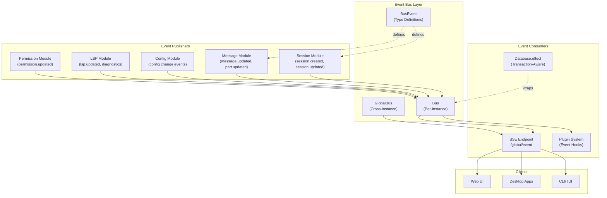
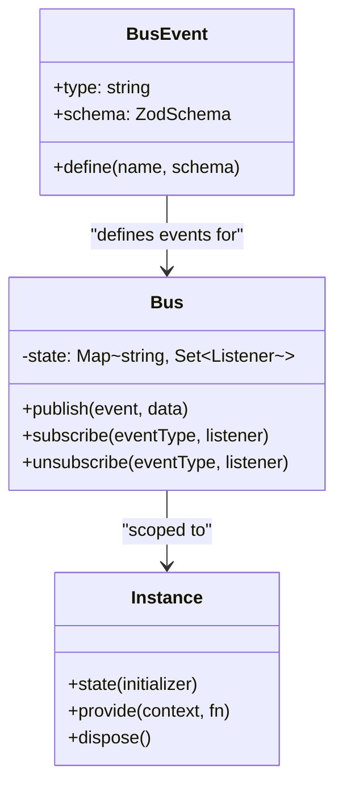
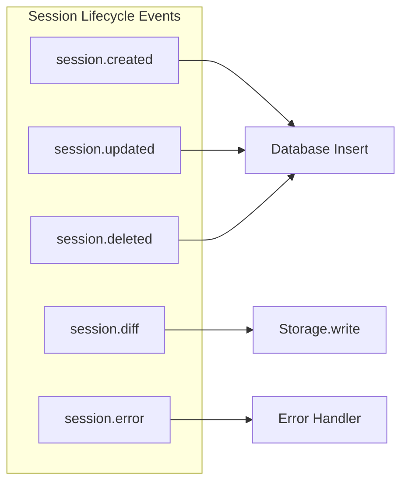
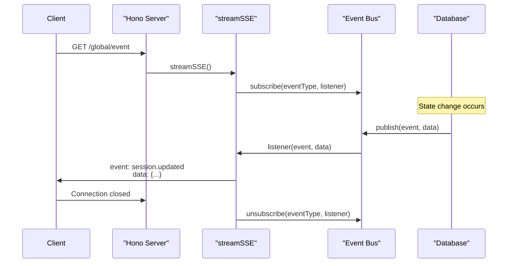
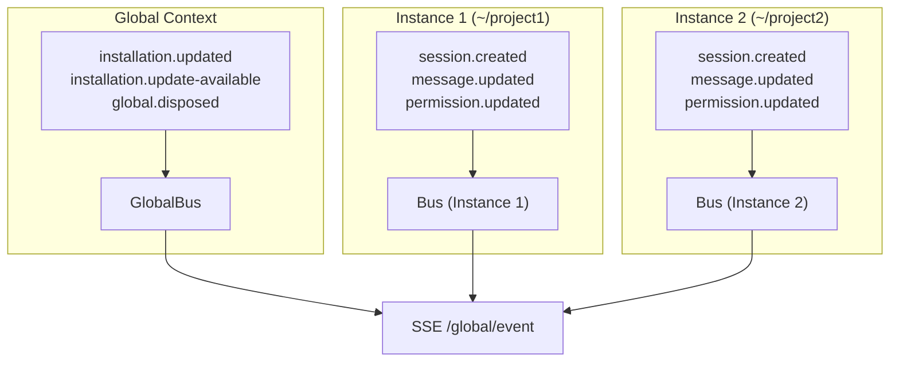

# Event Bus & Real-time Updates

<details>
<summary>Relevant source files</summary>

The following files were used as context for generating this wiki page:

- [packages/app/src/components/dialog-edit-project.tsx](packages/app/src/components/dialog-edit-project.tsx)
- [packages/app/src/components/dialog-select-file.tsx](packages/app/src/components/dialog-select-file.tsx)
- [packages/app/src/components/prompt-input.tsx](packages/app/src/components/prompt-input.tsx)
- [packages/app/src/components/session-context-usage.tsx](packages/app/src/components/session-context-usage.tsx)
- [packages/app/src/components/session/session-header.tsx](packages/app/src/components/session/session-header.tsx)
- [packages/app/src/components/titlebar.tsx](packages/app/src/components/titlebar.tsx)
- [packages/app/src/context/global-sync.tsx](packages/app/src/context/global-sync.tsx)
- [packages/app/src/context/global-sync/session-prefetch.test.ts](packages/app/src/context/global-sync/session-prefetch.test.ts)
- [packages/app/src/context/global-sync/session-prefetch.ts](packages/app/src/context/global-sync/session-prefetch.ts)
- [packages/app/src/context/layout.tsx](packages/app/src/context/layout.tsx)
- [packages/app/src/context/sync.tsx](packages/app/src/context/sync.tsx)
- [packages/app/src/pages/layout.tsx](packages/app/src/pages/layout.tsx)
- [packages/app/src/pages/layout/sidebar-items.tsx](packages/app/src/pages/layout/sidebar-items.tsx)
- [packages/app/src/pages/layout/sidebar-project.tsx](packages/app/src/pages/layout/sidebar-project.tsx)
- [packages/app/src/pages/layout/sidebar-workspace.tsx](packages/app/src/pages/layout/sidebar-workspace.tsx)
- [packages/app/src/pages/session.tsx](packages/app/src/pages/session.tsx)
- [packages/app/src/utils/agent.ts](packages/app/src/utils/agent.ts)
- [packages/opencode/src/config/config.ts](packages/opencode/src/config/config.ts)
- [packages/opencode/src/env/index.ts](packages/opencode/src/env/index.ts)
- [packages/opencode/src/provider/error.ts](packages/opencode/src/provider/error.ts)
- [packages/opencode/src/provider/models.ts](packages/opencode/src/provider/models.ts)
- [packages/opencode/src/provider/provider.ts](packages/opencode/src/provider/provider.ts)
- [packages/opencode/src/provider/transform.ts](packages/opencode/src/provider/transform.ts)
- [packages/opencode/src/server/server.ts](packages/opencode/src/server/server.ts)
- [packages/opencode/src/session/compaction.ts](packages/opencode/src/session/compaction.ts)
- [packages/opencode/src/session/index.ts](packages/opencode/src/session/index.ts)
- [packages/opencode/src/session/llm.ts](packages/opencode/src/session/llm.ts)
- [packages/opencode/src/session/message-v2.ts](packages/opencode/src/session/message-v2.ts)
- [packages/opencode/src/session/message.ts](packages/opencode/src/session/message.ts)
- [packages/opencode/src/session/prompt.ts](packages/opencode/src/session/prompt.ts)
- [packages/opencode/src/session/revert.ts](packages/opencode/src/session/revert.ts)
- [packages/opencode/src/session/summary.ts](packages/opencode/src/session/summary.ts)
- [packages/opencode/src/tool/task.ts](packages/opencode/src/tool/task.ts)
- [packages/opencode/test/config/config.test.ts](packages/opencode/test/config/config.test.ts)
- [packages/opencode/test/provider/provider.test.ts](packages/opencode/test/provider/provider.test.ts)
- [packages/opencode/test/provider/transform.test.ts](packages/opencode/test/provider/transform.test.ts)
- [packages/opencode/test/session/llm.test.ts](packages/opencode/test/session/llm.test.ts)
- [packages/opencode/test/session/message-v2.test.ts](packages/opencode/test/session/message-v2.test.ts)
- [packages/opencode/test/session/revert-compact.test.ts](packages/opencode/test/session/revert-compact.test.ts)
- [packages/sdk/js/src/gen/sdk.gen.ts](packages/sdk/js/src/gen/sdk.gen.ts)
- [packages/sdk/js/src/gen/types.gen.ts](packages/sdk/js/src/gen/types.gen.ts)
- [packages/sdk/js/src/v2/gen/sdk.gen.ts](packages/sdk/js/src/v2/gen/sdk.gen.ts)
- [packages/sdk/js/src/v2/gen/types.gen.ts](packages/sdk/js/src/v2/gen/types.gen.ts)
- [packages/sdk/openapi.json](packages/sdk/openapi.json)

</details>

## Purpose and Scope

This page documents OpenCode's event-driven architecture, including the pub/sub event bus system and real-time update delivery via Server-Sent Events (SSE). The event bus enables loose coupling between system components and provides clients with real-time notifications about state changes.

For information about the HTTP server and API endpoints, see [HTTP Server & REST API](#2.6). For session lifecycle and state management, see [Session & Agent System](#2.3).

## Architecture Overview

The event bus follows a publish/subscribe pattern where components publish typed events and clients subscribe to receive updates in real-time. Events are delivered through Server-Sent Events (SSE) streams over HTTP.

### Event Flow Diagram



**Sources:** [packages/opencode/src/bus/](), [packages/opencode/src/session/index.ts:181-214](), [packages/opencode/src/server/server.ts:1-46]()

## Event Bus Implementation

### Core Components

The event system consists of three primary components:

| Component   | File                                       | Purpose                                          |
| ----------- | ------------------------------------------ | ------------------------------------------------ |
| `Bus`       | [packages/opencode/src/bus/index.ts]()     | Per-instance event bus for project-scoped events |
| `GlobalBus` | [packages/opencode/src/bus/global.ts]()    | Global event bus for system-wide events          |
| `BusEvent`  | [packages/opencode/src/bus/bus-event.ts]() | Type-safe event definition helper                |

### Bus Class Structure



The `Bus` is scoped per project instance via [packages/opencode/src/project/instance.ts](), allowing isolated event streams for each directory being worked on. The `GlobalBus` handles events that span all instances.

**Sources:** [packages/opencode/src/bus/](), [packages/opencode/src/bus/global.ts](), [packages/opencode/src/project/instance.ts]()

## Event Type Definitions

Events are defined using the `BusEvent.define()` helper, which provides type safety and runtime validation through Zod schemas.

### Session Events



Session events are defined at [packages/opencode/src/session/index.ts:181-214]():

```typescript
export const Event = {
  Created: BusEvent.define('session.created', z.object({ info: Info })),
  Updated: BusEvent.define('session.updated', z.object({ info: Info })),
  Deleted: BusEvent.define('session.deleted', z.object({ info: Info })),
  Diff: BusEvent.define(
    'session.diff',
    z.object({
      sessionID: z.string(),
      diff: Snapshot.FileDiff.array(),
    })
  ),
  Error: BusEvent.define(
    'session.error',
    z.object({
      sessionID: z.string().optional(),
      error: MessageV2.Assistant.shape.error,
    })
  ),
}
```

**Sources:** [packages/opencode/src/session/index.ts:181-214]()

### Message Events

Message-related events track changes to conversation messages and their parts:

| Event Type             | Schema                                           | Purpose                          |
| ---------------------- | ------------------------------------------------ | -------------------------------- |
| `message.updated`      | `{ info: Message }`                              | Message created or modified      |
| `message.removed`      | `{ sessionID, messageID }`                       | Message deleted                  |
| `message.part.updated` | `{ part: Part }`                                 | Message part created or modified |
| `message.part.delta`   | `{ sessionID, messageID, partID, field, delta }` | Streaming delta update           |
| `message.part.removed` | `{ sessionID, messageID, partID }`               | Part deleted                     |

**Sources:** [packages/opencode/src/session/message-v2.ts:1-18](), [packages/sdk/js/src/v2/gen/types.gen.ts:246-550]()

### Permission Events

Permission events notify when user approval is requested:

```typescript
export const Event = {
  Updated: BusEvent.define('permission.updated', Permission),
}
```

The `Permission` schema includes request ID, session context, permission type, patterns, and metadata for the permission request.

**Sources:** [packages/opencode/src/permission/next.ts](), [packages/sdk/js/src/v2/gen/types.gen.ts:552-574]()

### System Events

System-wide events include:

- `installation.updated` - Version update completed
- `installation.update-available` - New version available
- `server.instance.disposed` - Instance cleanup
- `server.connected` - Client connection established
- `global.disposed` - Global shutdown
- `lsp.updated` - LSP server state changed
- `lsp.client.diagnostics` - Code diagnostics updated
- `file.edited` - File modification detected

**Sources:** [packages/sdk/js/src/v2/gen/types.gen.ts:7-93]()

## Publishing Events

Events are published using `Bus.publish()`, which notifies all registered listeners for that event type.

### Basic Publishing Pattern

```typescript
Bus.publish(Event.Updated, { info: result })
```

Events are published throughout the codebase when state changes occur:

| Location                                           | Events Published        |
| -------------------------------------------------- | ----------------------- |
| [packages/opencode/src/session/index.ts:314-321]() | Session creation events |
| [packages/opencode/src/session/index.ts:287]()     | Session update events   |
| [packages/opencode/src/session/index.ts:669-672]() | Session deletion events |
| [packages/opencode/src/session/index.ts:692-696]() | Message update events   |
| [packages/opencode/src/config/config.ts:28]()      | Config events           |

### Transaction-Aware Publishing

The `Database.effect()` wrapper ensures events are only published after database transactions commit successfully:

```typescript
Database.use((db) => {
  db.insert(SessionTable).values(toRow(result)).run()
  Database.effect(() => Bus.publish(Event.Created, { info: result }))
})
```

This pattern prevents events from being published if the transaction rolls back, maintaining consistency between the database state and event notifications.

**Sources:** [packages/opencode/src/session/index.ts:314-321](), [packages/opencode/src/storage/db.ts]()

## Real-time Event Streaming

### SSE Endpoint Architecture



The `/global/event` endpoint provides Server-Sent Events streaming defined in the OpenAPI specification at [packages/sdk/openapi.json:44-67]():

```json
{
  "operationId": "global.event",
  "summary": "Get global events",
  "description": "Subscribe to global events from the OpenCode system using server-sent events.",
  "responses": {
    "200": {
      "description": "Event stream",
      "content": {
        "text/event-stream": {
          "schema": { "$ref": "#/components/schemas/GlobalEvent" }
        }
      }
    }
  }
}
```

### Event Stream Implementation

The server uses Hono's `streamSSE` utility to establish persistent connections:

```typescript
app.get('/global/event', async (c) => {
  return streamSSE(c, async (stream) => {
    const listener = (event, data) => {
      stream.writeSSE({
        event: event.type,
        data: JSON.stringify(data),
      })
    }

    Bus.subscribe('*', listener)

    // Keep connection alive
    await stream.wait()

    Bus.unsubscribe('*', listener)
  })
})
```

**Sources:** [packages/opencode/src/server/server.ts:1-46](), [packages/sdk/openapi.json:44-67]()

## Global vs Instance Events

### Dual Bus Architecture



The system maintains two levels of event buses:

1. **GlobalBus** - System-wide events that don't belong to a specific project instance (e.g., installation updates, global disposal)
2. **Instance Bus** - Per-directory event buses scoped to individual projects (e.g., session events, message updates)

When a client connects to `/global/event`, it may receive events from both the global bus and the current instance's bus, depending on the query parameters (directory/workspace).

**Sources:** [packages/opencode/src/bus/global.ts](), [packages/opencode/src/bus/index.ts](), [packages/opencode/src/server/server.ts]()

## Client Subscription

### SDK Event Subscription

The JavaScript SDK provides typed event subscription:

```typescript
const client = createOpencodeClient({ baseUrl: 'http://localhost:4096' })

for await (const event of client.global.event()) {
  switch (event.type) {
    case 'session.updated':
      console.log('Session updated:', event.properties.info)
      break
    case 'message.part.delta':
      console.log('Streaming delta:', event.properties.delta)
      break
  }
}
```

### Event Type Union

All event types are unified in a discriminated union for type safety at [packages/sdk/js/src/v2/gen/types.gen.ts]():

```typescript
export type GlobalEvent =
  | EventInstallationUpdated
  | EventInstallationUpdateAvailable
  | EventProjectUpdated
  | EventSessionCreated
  | EventMessageUpdated
  | EventMessagePartDelta
  | EventPermissionUpdated
// ... and many more
```

**Sources:** [packages/sdk/js/src/v2/gen/types.gen.ts:685-766](), [packages/sdk/js/src/v2/gen/sdk.gen.ts]()

## Integration Points

### Plugin System Integration

Plugins can hook into the event system through the `event` hook:

```typescript
export default function myPlugin(input: PluginInput) {
  return {
    event: {
      'session.created': async (event, data) => {
        // React to session creation
      },
      'message.updated': async (event, data) => {
        // React to message updates
      },
    },
  }
}
```

**Sources:** [packages/plugin/src/index.ts:1-142](), [packages/opencode/src/plugin/index.ts:100-125]()

### Frontend Data Synchronization

The event bus enables reactive UI updates through stores that subscribe to events:

- `GlobalSync` - Subscribes to project and config events
- `ChildStore` - Subscribes to session and message events per directory
- `Sync` - Session-scoped view that reacts to message part deltas

**Sources:** Referenced in Diagram 3 from system overview

## Performance Considerations

### Event Filtering

Clients can filter events by:

- **Directory** - Only receive events for a specific project directory
- **Workspace** - Only receive events for a specific workspace context
- **Event Type** - Subscribe to specific event types only

This filtering reduces bandwidth and processing overhead for clients that only need a subset of events.

### Delta Streaming

For streaming message parts (like text generation), the system uses delta events (`message.part.delta`) to transmit incremental changes rather than full state updates:

```typescript
await Session.updatePartDelta({
  sessionID,
  messageID,
  partID,
  field: 'text',
  delta: 'new text chunk',
})
```

This optimization reduces payload size during AI response streaming.

**Sources:** [packages/opencode/src/session/index.ts:771-782](), [packages/sdk/js/src/v2/gen/types.gen.ts:532-541]()
