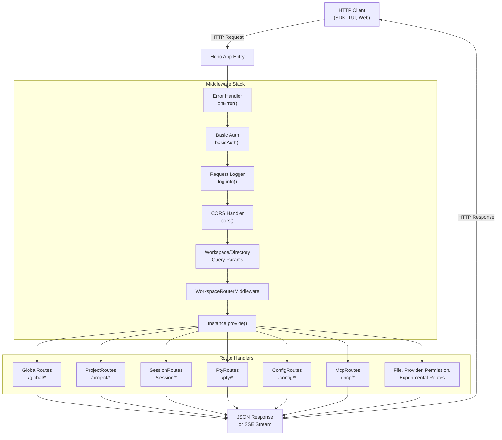
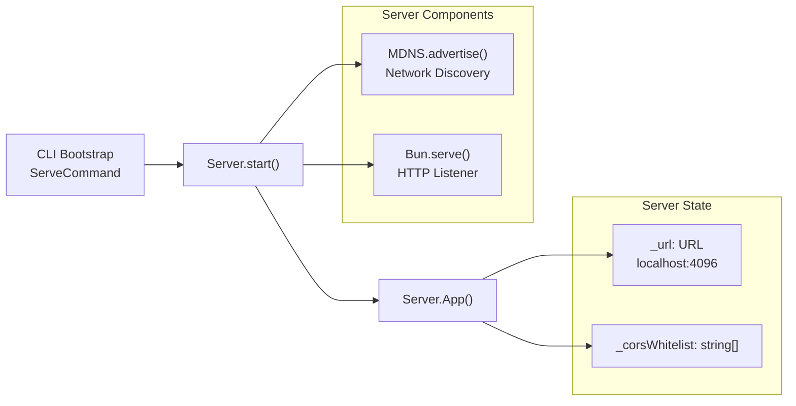
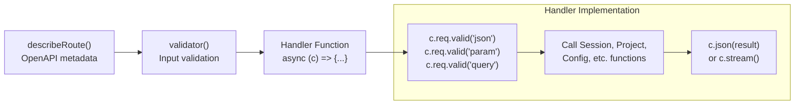
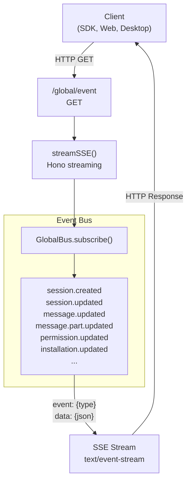
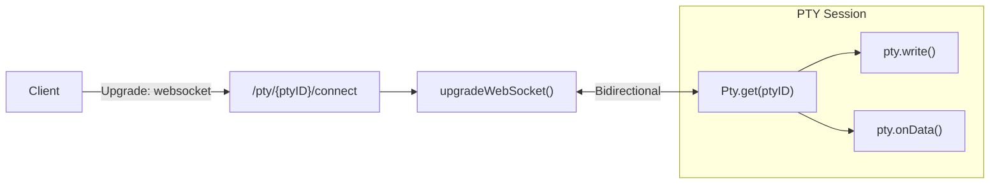
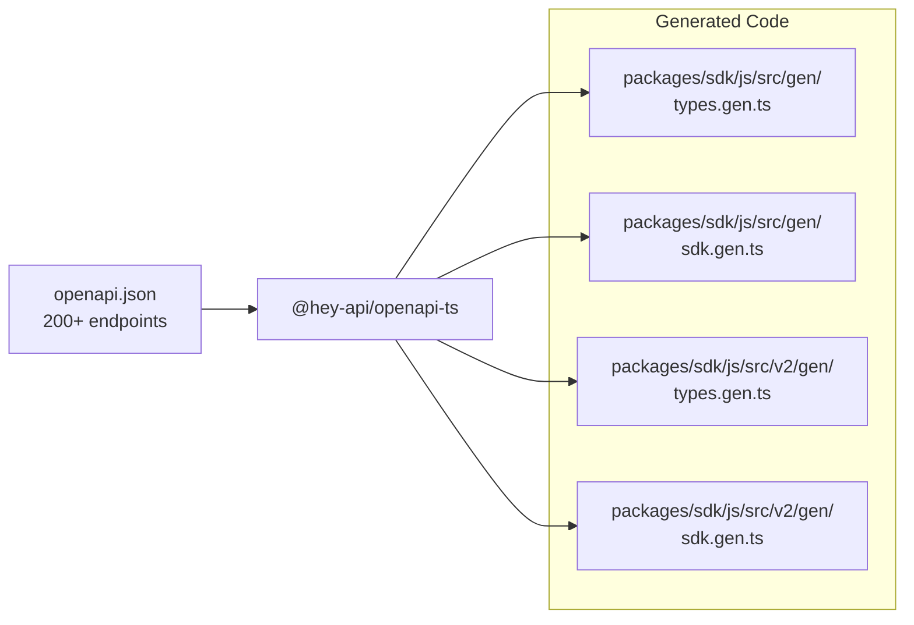

# HTTP Server & REST API

<details>
<summary>Relevant source files</summary>

The following files were used as context for generating this wiki page:

- [packages/opencode/src/cli/bootstrap.ts](packages/opencode/src/cli/bootstrap.ts)
- [packages/opencode/src/cli/cmd/acp.ts](packages/opencode/src/cli/cmd/acp.ts)
- [packages/opencode/src/cli/cmd/run.ts](packages/opencode/src/cli/cmd/run.ts)
- [packages/opencode/src/cli/cmd/serve.ts](packages/opencode/src/cli/cmd/serve.ts)
- [packages/opencode/src/cli/cmd/tui/context/sync.tsx](packages/opencode/src/cli/cmd/tui/context/sync.tsx)
- [packages/opencode/src/cli/cmd/tui/thread.ts](packages/opencode/src/cli/cmd/tui/thread.ts)
- [packages/opencode/src/cli/cmd/tui/worker.ts](packages/opencode/src/cli/cmd/tui/worker.ts)
- [packages/opencode/src/cli/cmd/web.ts](packages/opencode/src/cli/cmd/web.ts)
- [packages/opencode/src/cli/network.ts](packages/opencode/src/cli/network.ts)
- [packages/opencode/src/config/config.ts](packages/opencode/src/config/config.ts)
- [packages/opencode/src/env/index.ts](packages/opencode/src/env/index.ts)
- [packages/opencode/src/index.ts](packages/opencode/src/index.ts)
- [packages/opencode/src/provider/error.ts](packages/opencode/src/provider/error.ts)
- [packages/opencode/src/provider/models.ts](packages/opencode/src/provider/models.ts)
- [packages/opencode/src/provider/provider.ts](packages/opencode/src/provider/provider.ts)
- [packages/opencode/src/provider/transform.ts](packages/opencode/src/provider/transform.ts)
- [packages/opencode/src/server/mdns.ts](packages/opencode/src/server/mdns.ts)
- [packages/opencode/src/server/server.ts](packages/opencode/src/server/server.ts)
- [packages/opencode/src/session/compaction.ts](packages/opencode/src/session/compaction.ts)
- [packages/opencode/src/session/index.ts](packages/opencode/src/session/index.ts)
- [packages/opencode/src/session/llm.ts](packages/opencode/src/session/llm.ts)
- [packages/opencode/src/session/message-v2.ts](packages/opencode/src/session/message-v2.ts)
- [packages/opencode/src/session/message.ts](packages/opencode/src/session/message.ts)
- [packages/opencode/src/session/prompt.ts](packages/opencode/src/session/prompt.ts)
- [packages/opencode/src/session/revert.ts](packages/opencode/src/session/revert.ts)
- [packages/opencode/src/session/summary.ts](packages/opencode/src/session/summary.ts)
- [packages/opencode/src/tool/task.ts](packages/opencode/src/tool/task.ts)
- [packages/opencode/test/config/config.test.ts](packages/opencode/test/config/config.test.ts)
- [packages/opencode/test/provider/provider.test.ts](packages/opencode/test/provider/provider.test.ts)
- [packages/opencode/test/provider/transform.test.ts](packages/opencode/test/provider/transform.test.ts)
- [packages/opencode/test/session/llm.test.ts](packages/opencode/test/session/llm.test.ts)
- [packages/opencode/test/session/message-v2.test.ts](packages/opencode/test/session/message-v2.test.ts)
- [packages/opencode/test/session/revert-compact.test.ts](packages/opencode/test/session/revert-compact.test.ts)
- [packages/sdk/js/src/gen/sdk.gen.ts](packages/sdk/js/src/gen/sdk.gen.ts)
- [packages/sdk/js/src/gen/types.gen.ts](packages/sdk/js/src/gen/types.gen.ts)
- [packages/sdk/js/src/index.ts](packages/sdk/js/src/index.ts)
- [packages/sdk/js/src/v2/gen/sdk.gen.ts](packages/sdk/js/src/v2/gen/sdk.gen.ts)
- [packages/sdk/js/src/v2/gen/types.gen.ts](packages/sdk/js/src/v2/gen/types.gen.ts)
- [packages/sdk/openapi.json](packages/sdk/openapi.json)
- [packages/web/src/content/docs/cli.mdx](packages/web/src/content/docs/cli.mdx)
- [packages/web/src/content/docs/config.mdx](packages/web/src/content/docs/config.mdx)
- [packages/web/src/content/docs/ide.mdx](packages/web/src/content/docs/ide.mdx)
- [packages/web/src/content/docs/plugins.mdx](packages/web/src/content/docs/plugins.mdx)
- [packages/web/src/content/docs/sdk.mdx](packages/web/src/content/docs/sdk.mdx)
- [packages/web/src/content/docs/server.mdx](packages/web/src/content/docs/server.mdx)
- [packages/web/src/content/docs/tui.mdx](packages/web/src/content/docs/tui.mdx)

</details>

This page documents the HTTP server implementation and REST API architecture that powers OpenCode's networked functionality. The server provides a comprehensive REST API for managing sessions, projects, configurations, and real-time AI interactions.

For information about the event bus system that works alongside the HTTP API, see [Event Bus & Real-time Updates](#2.7). For details on the CLI and TUI interfaces that consume this API, see [Terminal User Interface (TUI)](#3.1). For the JavaScript SDK that wraps this API, see [JavaScript SDK](#5.1).

## Purpose and Scope

The HTTP server serves as the central networked interface to OpenCode's core functionality. It exposes over 200 REST endpoints for:

- Session management and AI conversation lifecycle
- Project and workspace operations
- Configuration management across the 7-layer hierarchy
- Real-time event streaming via Server-Sent Events (SSE)
- WebSocket connections for pseudo-terminal (PTY) sessions
- Provider and model discovery
- Permission management
- File operations and VCS integration

## Server Architecture

The server is built on the [Hono](https://hono.dev/) web framework and runs as an embedded component within the OpenCode CLI process. It binds to a configurable port (default: 4096) and can be started via `opencode serve` or runs automatically when using the TUI.

### Request Flow



Sources: [packages/opencode/src/server/server.ts:60-258]()

### Server Initialization

The server is initialized and managed through the `Server` namespace:



The server URL is stored and accessed via `Server.url()`, which returns the configured base URL. CORS is configured to allow requests from:

- `localhost` and `127.0.0.1` on any port
- `tauri://localhost` (desktop app)
- `*.opencode.ai` domains (web app)
- Custom origins in the CORS whitelist

Sources: [packages/opencode/src/server/server.ts:50-134]()

## Route Organization

Routes are organized into separate modules for maintainability. Each route module returns a `Hono` instance that is mounted on the main app:

| Route Prefix        | Module               | Purpose                                       |
| ------------------- | -------------------- | --------------------------------------------- |
| `/global`           | `GlobalRoutes`       | Health checks, global config, events, dispose |
| `/auth/:providerID` | Inline handlers      | Set/remove provider credentials               |
| `/project`          | `ProjectRoutes`      | Project listing, git init, project updates    |
| `/pty`              | `PtyRoutes`          | Pseudo-terminal session management            |
| `/config`           | `ConfigRoutes`       | Configuration get/update, provider list       |
| `/session`          | `SessionRoutes`      | Session CRUD, messages, prompting, streaming  |
| `/permission`       | `PermissionRoutes`   | Permission requests and responses             |
| `/question`         | `QuestionRoutes`     | Question tool interactions                    |
| `/provider`         | `ProviderRoutes`     | Provider and model discovery                  |
| `/mcp`              | `McpRoutes`          | MCP server management                         |
| `/file`             | `FileRoutes`         | File operations, patches, snapshots           |
| `/experimental`     | `ExperimentalRoutes` | Tool lists, workspace management              |
| `/tui`              | `TuiRoutes`          | TUI-specific endpoints                        |

Sources: [packages/opencode/src/server/server.ts:135-258]()

### Route Handler Pattern

All routes follow a consistent pattern using the `hono-openapi` library for type-safe API definitions:



Example from auth endpoint:

```typescript
.put("/auth/:providerID",
  describeRoute({
    summary: "Set auth credentials",
    operationId: "auth.set",
    responses: { ... }
  }),
  validator("param", z.object({ providerID: z.string() })),
  validator("json", Auth.Info),
  async (c) => {
    const providerID = c.req.valid("param").providerID
    const info = c.req.valid("json")
    await Auth.set(providerID, info)
    return c.json(true)
  }
)
```

Sources: [packages/opencode/src/server/server.ts:136-167]()

## Middleware Stack

The middleware pipeline processes every request in the following order:

### 1. Error Handler

Catches all errors and converts them to appropriate HTTP responses. Special handling for:

- `NamedError` instances → structured error objects with specific status codes
- `NotFoundError` → 404
- `Provider.ModelNotFoundError` → 400
- `HTTPException` → pass-through
- Unknown errors → 500 with stack trace

Sources: [packages/opencode/src/server/server.ts:65-82]()

### 2. OPTIONS Preflight

Allows CORS preflight requests to bypass authentication:

```typescript
.use((c, next) => {
  if (c.req.method === "OPTIONS") return next()
  // ... auth check
})
```

Sources: [packages/opencode/src/server/server.ts:83-91]()

### 3. Basic Authentication

Optional HTTP Basic Auth controlled by environment variables:

- `OPENCODE_SERVER_PASSWORD` - Required for auth
- `OPENCODE_SERVER_USERNAME` - Username (default: "opencode")

When enabled, all non-OPTIONS requests must include valid credentials.

Sources: [packages/opencode/src/server/server.ts:87-91]()

### 4. Request Logger

Logs all requests except `/log` endpoint to avoid infinite loops:

```typescript
.use(async (c, next) => {
  const skipLogging = c.req.path === "/log"
  if (!skipLogging) {
    log.info("request", { method: c.req.method, path: c.req.path })
  }
  const timer = log.time("request", { ... })
  await next()
  if (!skipLogging) timer.stop()
})
```

Sources: [packages/opencode/src/server/server.ts:92-108]()

### 5. CORS Configuration

Enables cross-origin requests from allowed origins:

```typescript
.use(cors({
  origin(input) {
    if (input.startsWith("http://localhost:")) return input
    if (input.startsWith("http://127.0.0.1:")) return input
    if (input === "tauri://localhost") return input
    if (/^https:\/\/([a-z0-9-]+\.)*opencode\.ai$/.test(input)) return input
    if (_corsWhitelist.includes(input)) return input
    return
  }
}))
```

Sources: [packages/opencode/src/server/server.ts:109-134]()

### 6. Workspace & Directory Context

Extracts workspace and directory from query params or headers:

```typescript
.use(async (c, next) => {
  const workspaceID = c.req.query("workspace") || c.req.header("x-opencode-workspace")
  const directory = c.req.query("directory") || c.req.header("x-opencode-directory") || process.cwd()

  return WorkspaceContext.provide({
    workspaceID,
    async fn() {
      return Instance.provide({
        directory,
        init: InstanceBootstrap,
        async fn() { return next() }
      })
    }
  })
})
```

This middleware ensures that all route handlers have access to the correct project instance and workspace context via `Instance.project`, `Instance.directory`, and `WorkspaceContext.workspaceID`.

Sources: [packages/opencode/src/server/server.ts:198-224]()

## Real-time Communication

### Server-Sent Events (SSE)

The server provides event streams for real-time updates. The primary endpoint is `/global/event`:



The event stream implementation uses Hono's `streamSSE` helper:

```typescript
.get("/global/event",
  describeRoute({ ... }),
  async (c) => {
    return streamSSE(c, async (stream) => {
      const unsub = GlobalBus.subscribe((event) => {
        stream.writeSSE({
          event: event.type,
          data: JSON.stringify(event.properties)
        })
      })
      stream.onAbort(() => unsub())
      while (true) {
        await stream.sleep(1000)
      }
    })
  }
)
```

Each event is sent with:

- `event` field: The event type (e.g., `session.updated`)
- `data` field: JSON-serialized event properties

Sources: [packages/sdk/openapi.json:44-67](), [packages/opencode/src/server/routes/global.ts]()

### WebSocket Connections

WebSocket connections are used for PTY (pseudo-terminal) sessions:



The WebSocket connection allows bidirectional communication:

- **Client → Server**: Terminal input (keystrokes, commands)
- **Server → Client**: Terminal output (ANSI escape sequences, program output)

Sources: [packages/sdk/openapi.json:817-875]()

## OpenAPI Specification

The complete API is documented in OpenAPI 3.1.1 format and available at:

- **Specification**: [packages/sdk/openapi.json]()
- **Interactive docs**: `GET /doc` endpoint (when server is running)

### Code Generation

The OpenAPI spec is used to generate type-safe SDK clients:



The spec is automatically generated from the Hono app using `hono-openapi`:

```typescript
.get("/doc", openAPIRouteHandler(app, {
  documentation: {
    info: {
      title: "opencode",
      version: "1.0.0",
      description: "opencode api"
    },
    openapi: "3.1.1"
  }
}))
```

Sources: [packages/opencode/src/server/server.ts:227-238](), [packages/sdk/openapi.json:1-7]()

## Key API Endpoints

### Session Management

| Endpoint                                   | Method   | Purpose                             |
| ------------------------------------------ | -------- | ----------------------------------- |
| `/session`                                 | `GET`    | List sessions                       |
| `/session`                                 | `POST`   | Create new session                  |
| `/session/{sessionID}`                     | `GET`    | Get session details                 |
| `/session/{sessionID}`                     | `PATCH`  | Update session (title, permissions) |
| `/session/{sessionID}`                     | `DELETE` | Delete session and children         |
| `/session/{sessionID}/message`             | `GET`    | List messages in session            |
| `/session/{sessionID}/message`             | `POST`   | Add user message                    |
| `/session/{sessionID}/message/{messageID}` | `DELETE` | Remove message                      |
| `/session/{sessionID}/prompt`              | `POST`   | Send prompt and start AI loop       |
| `/session/{sessionID}/event`               | `GET`    | SSE stream of session events        |
| `/session/{sessionID}/interrupt`           | `POST`   | Cancel running AI operation         |
| `/session/{sessionID}/compact`             | `POST`   | Trigger manual compaction           |

Sources: [packages/sdk/openapi.json:1329-1806]()

### Project Operations

| Endpoint               | Method  | Purpose                   |
| ---------------------- | ------- | ------------------------- |
| `/project`             | `GET`   | List all projects         |
| `/project/current`     | `GET`   | Get current project       |
| `/project/{projectID}` | `PATCH` | Update project metadata   |
| `/project/git/init`    | `POST`  | Initialize git repository |

Sources: [packages/sdk/openapi.json:258-489]()

### Configuration

| Endpoint            | Method  | Purpose                              |
| ------------------- | ------- | ------------------------------------ |
| `/config`           | `GET`   | Get merged configuration             |
| `/config`           | `PATCH` | Update configuration                 |
| `/config/providers` | `GET`   | List configured providers and models |

Sources: [packages/sdk/openapi.json:876-1033]()

### Provider & Model Discovery

| Endpoint                                 | Method | Purpose                    |
| ---------------------------------------- | ------ | -------------------------- |
| `/provider`                              | `GET`  | List all providers         |
| `/provider/{providerID}`                 | `GET`  | Get provider details       |
| `/provider/{providerID}/model`           | `GET`  | List models for provider   |
| `/provider/{providerID}/model/{modelID}` | `GET`  | Get specific model details |

Sources: [packages/sdk/openapi.json:2105-2346]()

## Network Configuration

The server can be configured via environment variables and CLI flags:

| Variable/Flag              | Purpose                     | Default     |
| -------------------------- | --------------------------- | ----------- |
| `--port`                   | HTTP server port            | `4096`      |
| `--host`                   | Bind address                | `localhost` |
| `OPENCODE_SERVER_PASSWORD` | Enable basic auth           | (disabled)  |
| `OPENCODE_SERVER_USERNAME` | Auth username               | `opencode`  |
| CLI `--network` flags      | Network interface selection | Auto-detect |

### mDNS Discovery

When the server starts, it advertises itself via mDNS (Multicast DNS) for local network discovery:

```typescript
await MDNS.advertise({
  name: 'opencode',
  port,
  type: 'http',
  protocol: 'tcp',
})
```

This allows clients to discover running OpenCode servers on the local network without knowing the exact IP/port.

Sources: [packages/opencode/src/server/mdns.ts]()

## Error Handling

The server implements comprehensive error handling with structured error responses:

### Error Response Format

All errors are returned as JSON with the `NamedError` format:

```typescript
{
  "name": "ErrorTypeName",
  "data": {
    // Error-specific fields
  }
}
```

### Common Error Types

| Error Class                   | HTTP Status | Description                             |
| ----------------------------- | ----------- | --------------------------------------- |
| `NotFoundError`               | 404         | Session, project, or resource not found |
| `Provider.ModelNotFoundError` | 400         | AI model not found or unavailable       |
| `Session.BusyError`           | 400         | Session already processing a request    |
| `Worktree.*` errors           | 400         | Git worktree operation failures         |
| `NamedError.Unknown`          | 500         | Unexpected errors with stack trace      |

### Error Handler Implementation

```typescript
.onError((err, c) => {
  log.error("failed", { error: err })

  if (err instanceof NamedError) {
    let status: ContentfulStatusCode
    if (err instanceof NotFoundError) status = 404
    else if (err instanceof Provider.ModelNotFoundError) status = 400
    else if (err.name.startsWith("Worktree")) status = 400
    else status = 500
    return c.json(err.toObject(), { status })
  }

  if (err instanceof HTTPException) return err.getResponse()

  const message = err instanceof Error && err.stack ? err.stack : err.toString()
  return c.json(new NamedError.Unknown({ message }).toObject(), {
    status: 500
  })
})
```

Sources: [packages/opencode/src/server/server.ts:65-82]()

## Security Considerations

### Authentication

The server supports optional HTTP Basic Authentication. When `OPENCODE_SERVER_PASSWORD` is set:

- All requests (except OPTIONS preflight) require valid credentials
- Username defaults to "opencode" (configurable via `OPENCODE_SERVER_USERNAME`)
- Authentication is checked before any other middleware

### CORS Policy

The CORS policy is strict by default:

- Only allows `localhost`, `127.0.0.1`, Tauri, and `*.opencode.ai` origins
- Custom origins can be added to the whitelist programmatically
- Preflight requests are allowed to determine CORS headers

### Directory Access Control

While not enforced at the HTTP layer, the server relies on:

- File system permissions for directory access
- The `Instance.provide()` context to scope operations to a specific directory
- Permission system (see [Tool System & Permissions](#2.5)) for tool execution

Sources: [packages/opencode/src/server/server.ts:83-134]()
