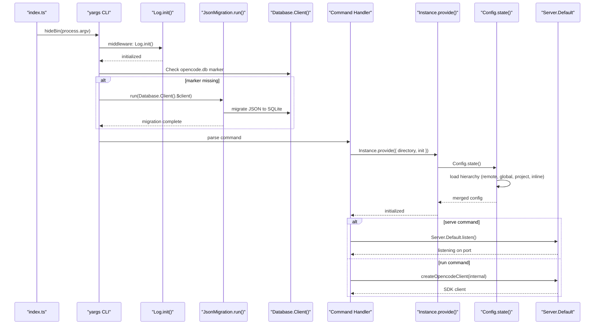
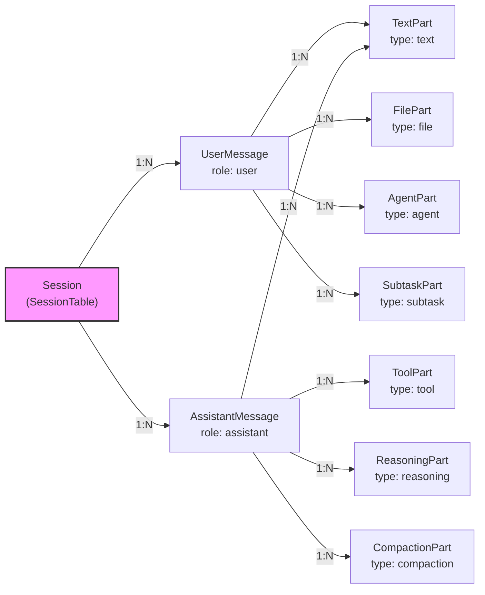
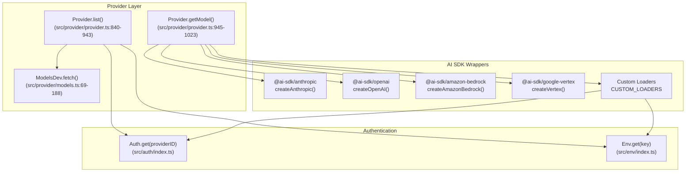
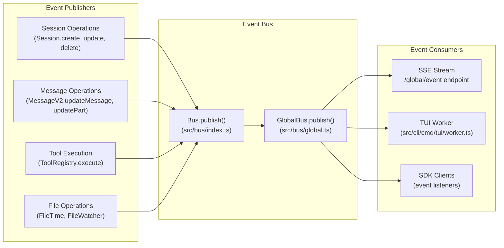
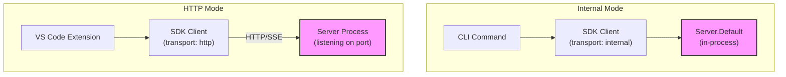

# Core Application

<details>
<summary>Relevant source files</summary>

The following files were used as context for generating this wiki page:

- [packages/opencode/src/cli/bootstrap.ts](packages/opencode/src/cli/bootstrap.ts)
- [packages/opencode/src/cli/cmd/acp.ts](packages/opencode/src/cli/cmd/acp.ts)
- [packages/opencode/src/cli/cmd/run.ts](packages/opencode/src/cli/cmd/run.ts)
- [packages/opencode/src/cli/cmd/serve.ts](packages/opencode/src/cli/cmd/serve.ts)
- [packages/opencode/src/cli/cmd/tui/context/sync.tsx](packages/opencode/src/cli/cmd/tui/context/sync.tsx)
- [packages/opencode/src/cli/cmd/tui/thread.ts](packages/opencode/src/cli/cmd/tui/thread.ts)
- [packages/opencode/src/cli/cmd/tui/worker.ts](packages/opencode/src/cli/cmd/tui/worker.ts)
- [packages/opencode/src/cli/cmd/web.ts](packages/opencode/src/cli/cmd/web.ts)
- [packages/opencode/src/cli/network.ts](packages/opencode/src/cli/network.ts)
- [packages/opencode/src/config/config.ts](packages/opencode/src/config/config.ts)
- [packages/opencode/src/env/index.ts](packages/opencode/src/env/index.ts)
- [packages/opencode/src/index.ts](packages/opencode/src/index.ts)
- [packages/opencode/src/provider/error.ts](packages/opencode/src/provider/error.ts)
- [packages/opencode/src/provider/models.ts](packages/opencode/src/provider/models.ts)
- [packages/opencode/src/provider/provider.ts](packages/opencode/src/provider/provider.ts)
- [packages/opencode/src/provider/transform.ts](packages/opencode/src/provider/transform.ts)
- [packages/opencode/src/server/mdns.ts](packages/opencode/src/server/mdns.ts)
- [packages/opencode/src/server/server.ts](packages/opencode/src/server/server.ts)
- [packages/opencode/src/session/compaction.ts](packages/opencode/src/session/compaction.ts)
- [packages/opencode/src/session/index.ts](packages/opencode/src/session/index.ts)
- [packages/opencode/src/session/llm.ts](packages/opencode/src/session/llm.ts)
- [packages/opencode/src/session/message-v2.ts](packages/opencode/src/session/message-v2.ts)
- [packages/opencode/src/session/message.ts](packages/opencode/src/session/message.ts)
- [packages/opencode/src/session/prompt.ts](packages/opencode/src/session/prompt.ts)
- [packages/opencode/src/session/revert.ts](packages/opencode/src/session/revert.ts)
- [packages/opencode/src/session/summary.ts](packages/opencode/src/session/summary.ts)
- [packages/opencode/src/tool/task.ts](packages/opencode/src/tool/task.ts)
- [packages/opencode/test/config/config.test.ts](packages/opencode/test/config/config.test.ts)
- [packages/opencode/test/provider/provider.test.ts](packages/opencode/test/provider/provider.test.ts)
- [packages/opencode/test/provider/transform.test.ts](packages/opencode/test/provider/transform.test.ts)
- [packages/opencode/test/session/llm.test.ts](packages/opencode/test/session/llm.test.ts)
- [packages/opencode/test/session/message-v2.test.ts](packages/opencode/test/session/message-v2.test.ts)
- [packages/opencode/test/session/revert-compact.test.ts](packages/opencode/test/session/revert-compact.test.ts)
- [packages/sdk/js/src/gen/sdk.gen.ts](packages/sdk/js/src/gen/sdk.gen.ts)
- [packages/sdk/js/src/gen/types.gen.ts](packages/sdk/js/src/gen/types.gen.ts)
- [packages/sdk/js/src/index.ts](packages/sdk/js/src/index.ts)
- [packages/sdk/js/src/v2/gen/sdk.gen.ts](packages/sdk/js/src/v2/gen/sdk.gen.ts)
- [packages/sdk/js/src/v2/gen/types.gen.ts](packages/sdk/js/src/v2/gen/types.gen.ts)
- [packages/sdk/openapi.json](packages/sdk/openapi.json)
- [packages/web/src/content/docs/cli.mdx](packages/web/src/content/docs/cli.mdx)
- [packages/web/src/content/docs/config.mdx](packages/web/src/content/docs/config.mdx)
- [packages/web/src/content/docs/ide.mdx](packages/web/src/content/docs/ide.mdx)
- [packages/web/src/content/docs/plugins.mdx](packages/web/src/content/docs/plugins.mdx)
- [packages/web/src/content/docs/sdk.mdx](packages/web/src/content/docs/sdk.mdx)
- [packages/web/src/content/docs/server.mdx](packages/web/src/content/docs/server.mdx)
- [packages/web/src/content/docs/tui.mdx](packages/web/src/content/docs/tui.mdx)

</details>

The Core Application is the main OpenCode server package ([packages/opencode]()) that provides the foundational AI agent capabilities. It implements a Hono-based HTTP server with an embedded CLI interface, managing AI conversations (sessions), tool execution, provider integrations, and real-time event streaming. The server can run in-process (local mode) or as a networked service (remote mode), exposing an OpenAPI-compliant REST API.

For specific subsystems, see: CLI commands ([2.1](#2.1)), configuration loading ([2.2](#2.2)), session lifecycle ([2.3](#2.3)), provider integration ([2.4](#2.4)), tool execution ([2.5](#2.5)), HTTP routes ([2.6](#2.6)), event streaming ([2.7](#2.7)), LSP integration ([2.8](#2.8)), plugin system ([2.9](#2.9)), MCP servers ([2.10](#2.10)), and skills ([2.11](#2.11)).

---

## Architecture Overview

The Core Application follows a layered architecture with clear separation between transport (HTTP/internal), business logic (sessions, agents, tools), and external integrations (LLMs, LSP, MCP).

**Core Application Architecture**

```mermaid
graph TB
    subgraph "Entry Points"
        CLI["CLI Entry<br/>(packages/opencode/src/index.ts)"]
        SDK["SDK Client<br/>(@opencode-ai/sdk)"]
    end

    subgraph "Server Layer"
        Hono["Hono Server<br/>(src/server/server.ts::Server.Default)"]
        Routes["Route Handlers<br/>(src/server/routes/*)"]
        OpenAPI["OpenAPI Spec<br/>(packages/sdk/openapi.json)"]
    end

    subgraph "Business Logic"
        Session["Session<br/>(src/session/index.ts::Session)"]
        MessageV2["MessageV2<br/>(src/session/message-v2.ts::MessageV2)"]
        SessionPrompt["SessionPrompt<br/>(src/session/prompt.ts::SessionPrompt)"]
        Agent["Agent<br/>(src/agent/agent.ts::Agent)"]
        Config["Config<br/>(src/config/config.ts::Config)"]
    end

    subgraph "Execution Layer"
        ToolRegistry["ToolRegistry<br/>(src/tool/registry.ts::ToolRegistry)"]
        PermissionNext["PermissionNext<br/>(src/permission/next.ts::PermissionNext)"]
        LLM["LLM<br/>(src/session/llm.ts::LLM)"]
    end

    subgraph "External Integrations"
        Provider["Provider<br/>(src/provider/provider.ts::Provider)"]
        LSP["LSP<br/>(src/lsp/index.ts::LSP)"]
        MCP["MCP<br/>(src/mcp/index.ts::MCP)"]
        Plugin["Plugin<br/>(src/plugin/index.ts::Plugin)"]
    end

    subgraph "Event System"
        Bus["Bus<br/>(src/bus/index.ts::Bus)"]
        GlobalBus["GlobalBus<br/>(src/bus/global.ts::GlobalBus)"]
    end

    subgraph "Storage"
        Database["Database<br/>(src/storage/db.ts::Database)"]
        Storage["Storage<br/>(src/storage/storage.ts::Storage)"]
    end

    CLI --> Hono
    SDK --> Hono
    Hono --> Routes
    Routes --> Session
    Routes --> Config
    Routes --> Agent

    Session --> MessageV2
    Session --> SessionPrompt
    SessionPrompt --> LLM
    SessionPrompt --> ToolRegistry
    SessionPrompt --> Agent

    LLM --> Provider
    ToolRegistry --> PermissionNext
    ToolRegistry --> LSP
    ToolRegistry --> MCP

    Session --> Database
    Session --> Storage
    Session --> Bus
    Bus --> GlobalBus

    Config --> Plugin
    Plugin -.hooks.-> ToolRegistry
    Plugin -.hooks.-> SessionPrompt

    style Hono fill:#f9f,stroke:#333,stroke-width:2px
    style Session fill:#bbf,stroke:#333,stroke-width:2px
    style Database fill:#bfb,stroke:#333,stroke-width:2px
```

Sources: [packages/opencode/src/index.ts:1-197](), [packages/opencode/src/server/server.ts:1-558](), [packages/opencode/src/session/index.ts:1-753](), [packages/opencode/src/config/config.ts:1-1010]()

---

## Application Lifecycle

The application initializes through a multi-stage bootstrap process that sets up logging, performs database migrations, loads configuration, and starts the server.

**Application Initialization Flow**



Sources: [packages/opencode/src/index.ts:50-123](), [packages/opencode/src/server/server.ts:58-219](), [packages/opencode/src/config/config.ts:78-266]()

The initialization sequence includes:

1. **Logging Setup**: [packages/opencode/src/index.ts:68-76]() configures the logging system with level based on environment
2. **Database Migration**: [packages/opencode/src/index.ts:87-121]() performs one-time migration from JSON storage to SQLite
3. **Configuration Loading**: [packages/opencode/src/config/config.ts:78-266]() loads and merges config from 6 sources in precedence order
4. **Instance Initialization**: [packages/opencode/src/project/instance.ts]() sets up project context with directory and workspace ID
5. **Server Start**: [packages/opencode/src/server/server.ts:56-558]() creates Hono app with middleware and routes

---

## Core Subsystems

### Session Management

The `Session` namespace ([packages/opencode/src/session/index.ts:36-753]()) manages conversation threads, messages, and parts. Each session tracks:

| Property      | Type                      | Description                   |
| ------------- | ------------------------- | ----------------------------- |
| `id`          | `SessionID`               | Descending ULID identifier    |
| `projectID`   | `ProjectID`               | Associated project            |
| `workspaceID` | `WorkspaceID?`            | Optional workspace (worktree) |
| `title`       | `string`                  | Session title                 |
| `permission`  | `PermissionNext.Ruleset?` | Permission overrides          |
| `summary`     | `SessionSummary?`         | File diff statistics          |
| `share`       | `{url: string}?`          | Share link if published       |
| `revert`      | `RevertInfo?`             | Revert point information      |

Sessions contain `Message` entities (user/assistant) which contain `Part` entities (text, tool, file, reasoning, etc). See [2.3](#2.3) for detailed session lifecycle.

Sources: [packages/opencode/src/session/index.ts:36-753](), [packages/opencode/src/session/session.sql.ts]()

### Message and Part Structure

The `MessageV2` namespace ([packages/opencode/src/session/message-v2.ts:20-758]()) defines the message data model:



Sources: [packages/opencode/src/session/message-v2.ts:20-758](), [packages/opencode/src/session/session.sql.ts:14-68]()

### Configuration System

The `Config` namespace ([packages/opencode/src/config/config.ts:42-1010]()) implements hierarchical configuration loading with 6 precedence levels (lowest to highest):

1. Remote `.well-known/opencode` (organization defaults)
2. Global config (`~/.config/opencode/opencode.json`)
3. Custom config (`OPENCODE_CONFIG` env var)
4. Project config (`<project>/opencode.json`)
5. `.opencode` directories (agents, commands, plugins)
6. Inline config (`OPENCODE_CONFIG_CONTENT` env var)

Configuration includes agent definitions, provider settings, tool permissions, plugin paths, and TUI keybindings. See [2.2](#2.2) for detailed configuration schema.

Sources: [packages/opencode/src/config/config.ts:42-1010](), [packages/opencode/src/config/paths.ts]()

### Agent System

The `Agent` namespace ([packages/opencode/src/agent/agent.ts]()) manages agent configurations (modes) which define:

- Model selection (providerID/modelID)
- System prompts and instructions
- Temperature/top_p overrides
- Permission rulesets
- Tool availability
- Maximum iteration steps

Agents can be primary (selected by user) or subagents (invoked via `@` mentions or task tool). The system supports three agent modes: `primary`, `subagent`, and `all`.

Sources: [packages/opencode/src/agent/agent.ts](), [packages/opencode/src/config/config.ts:712-799]()

### Provider Integration

The `Provider` namespace ([packages/opencode/src/provider/provider.ts:52-1260]()) provides unified access to 20+ LLM providers:



Each provider has a custom loader ([packages/opencode/src/provider/provider.ts:147-661]()) that handles authentication, regional endpoints, and model-specific options. See [2.4](#2.4) for provider configuration details.

Sources: [packages/opencode/src/provider/provider.ts:52-1260](), [packages/opencode/src/provider/models.ts:14-191]()

### Tool Execution

The `ToolRegistry` ([packages/opencode/src/tool/registry.ts]()) manages tool registration and execution. Core tools include:

| Tool ID | Purpose                                          | Source                |
| ------- | ------------------------------------------------ | --------------------- |
| `bash`  | Execute shell commands                           | [src/tool/bash.ts]()  |
| `edit`  | Edit file contents with 9 replacement strategies | [src/tool/edit.ts]()  |
| `read`  | Read file contents with LSP integration          | [src/tool/read.ts]()  |
| `write` | Write file contents                              | [src/tool/write.ts]() |
| `grep`  | Search file contents using ripgrep               | [src/tool/grep.ts]()  |
| `glob`  | Find files matching patterns                     | [src/tool/glob.ts]()  |
| `task`  | Spawn parallel subagent tasks                    | [src/tool/task.ts]()  |
| `lsp-*` | LSP operations (hover, definition, diagnostics)  | [src/lsp/]()          |
| `mcp-*` | MCP resource access                              | [src/mcp/]()          |

Tool execution is protected by the `PermissionNext` system ([packages/opencode/src/permission/next.ts]()) which enforces per-tool permissions with pattern matching. See [2.5](#2.5) for tool system details.

Sources: [packages/opencode/src/tool/registry.ts](), [packages/opencode/src/tool/tool.ts](), [packages/opencode/src/permission/next.ts]()

### HTTP Server

The `Server` namespace ([packages/opencode/src/server/server.ts:53-558]()) implements a Hono HTTP server with:

- OpenAPI route definitions ([packages/sdk/openapi.json]())
- CORS middleware for trusted origins ([packages/opencode/src/server/server.ts:105-130]())
- Basic auth (optional, via `OPENCODE_SERVER_PASSWORD`)
- Directory/workspace context middleware ([packages/opencode/src/server/server.ts:194-220]())
- Error handling with NamedError serialization ([packages/opencode/src/server/server.ts:61-78]())

Routes are organized by resource:

- `/global/*` - Global operations (health, config, events)
- `/project/*` - Project management
- `/session/*` - Session CRUD and prompting
- `/pty/*` - Pseudo-terminal management
- `/config/*` - Configuration access
- `/mcp/*` - MCP server management
- `/experimental/*` - Experimental APIs (workspaces, tools)

See [2.6](#2.6) for API documentation.

Sources: [packages/opencode/src/server/server.ts:53-558](), [packages/opencode/src/server/routes/]()

### Event Bus

The `Bus` ([packages/opencode/src/bus/index.ts]()) and `GlobalBus` ([packages/opencode/src/bus/global.ts]()) provide typed event streaming:



Events include: `session.created`, `session.updated`, `message.updated`, `message.part.updated`, `permission.asked`, `question.asked`, `file.edited`, `vcs.branch.updated`, and more. See [2.7](#2.7) for event system details.

Sources: [packages/opencode/src/bus/index.ts](), [packages/opencode/src/bus/global.ts](), [packages/opencode/src/server/routes/global.ts]()

### Plugin System

The `Plugin` namespace ([packages/opencode/src/plugin/index.ts]()) supports extensibility via npm packages or local files. Plugins can register hooks for:

- `tool.execute.before` / `tool.execute.after` - Intercept tool execution
- `event` - Subscribe to bus events
- `shell.env` - Modify shell environment variables
- `provider.options` - Modify provider request options

Plugins are loaded from three sources:

1. Global `~/.opencode/plugins/*.{js,ts}` directory
2. Global `opencode.json` `plugin` array
3. Project `.opencode/plugins/*.{js,ts}` directory
4. Project `opencode.json` `plugin` array

See [2.9](#2.9) for plugin development.

Sources: [packages/opencode/src/plugin/index.ts](), [packages/opencode/src/config/config.ts:497-509]()

---

## Session Prompt Flow

The core conversation loop ([packages/opencode/src/session/prompt.ts:161-188]()) orchestrates a multi-step process from user input to assistant response:

**User Prompt to Response Flow**

```mermaid
sequenceDiagram
    participant User as "User/CLI"
    participant SessionPrompt as "SessionPrompt.prompt()"
    participant Session as "Session"
    participant Loop as "SessionPrompt.loop()"
    participant LLM as "LLM.stream()"
    participant Provider as "Provider SDK"
    participant ToolRegistry as "ToolRegistry"
    participant Permission as "PermissionNext"
    participant Bus as "GlobalBus"

    User->>SessionPrompt: prompt({ sessionID, parts, agent, model })
    SessionPrompt->>Session: createUserMessage()
    Session->>Bus: publish(message.updated)
    SessionPrompt->>Loop: loop({ sessionID })

    loop Until finish != "tool-calls"
        Loop->>Session: messages({ sessionID })
        Loop->>LLM: stream({ messages, tools, model })
        LLM->>Provider: streamText({ messages, tools })
        Provider-->>LLM: stream chunks

        loop For each chunk
            LLM->>Session: updatePart({ type: text, text: delta })
            Session->>Bus: publish(message.part.updated)
        end

        alt Has tool calls
            Loop->>ToolRegistry: execute(tool, args, context)
            ToolRegistry->>Permission: check(permission, pattern, metadata)
            alt Permission denied
                Permission-->>ToolRegistry: throw PermissionDeniedError
            else Permission granted
                Permission-->>ToolRegistry: allowed
                ToolRegistry->>ToolRegistry: tool.execute(args, context)
                ToolRegistry-->>Loop: result
            end
            Loop->>Session: updatePart({ type: tool, state: completed })
            Session->>Bus: publish(message.part.updated)
        end

        alt Context overflow
            Loop->>Loop: process compaction
        end
    end

    Loop-->>SessionPrompt: final message
    SessionPrompt-->>User: response
```

Sources: [packages/opencode/src/session/prompt.ts:161-758](), [packages/opencode/src/session/llm.ts:27-313](), [packages/opencode/src/tool/registry.ts]()

Key stages:

1. **User Message Creation**: [packages/opencode/src/session/prompt.ts:165-166]() creates user message with parts (text, files, agent mentions)
2. **Loop Initialization**: [packages/opencode/src/session/prompt.ts:187]() starts the agentic loop with abort signal
3. **Message History Retrieval**: [packages/opencode/src/session/prompt.ts:301]() fetches non-compacted messages
4. **LLM Streaming**: [packages/opencode/src/session/llm.ts:106-280]() streams text/reasoning/tool-call chunks
5. **Tool Execution**: [packages/opencode/src/session/prompt.ts:544-758]() executes tools with permission checks
6. **Compaction**: [packages/opencode/src/session/compaction.ts:19-159]() summarizes old messages when context limit approached
7. **Iteration**: Loop continues until assistant returns non-tool-calls finish reason

---

## Key Data Structures

### Session Table Schema

```sql
CREATE TABLE session (
  id TEXT PRIMARY KEY,
  slug TEXT NOT NULL,
  project_id TEXT NOT NULL,
  workspace_id TEXT,
  directory TEXT NOT NULL,
  parent_id TEXT,
  title TEXT NOT NULL,
  version TEXT NOT NULL,
  permission TEXT,  -- JSON PermissionNext.Ruleset
  summary_additions INTEGER,
  summary_deletions INTEGER,
  summary_files INTEGER,
  summary_diffs TEXT,  -- JSON Snapshot.FileDiff[]
  share_url TEXT,
  revert TEXT,  -- JSON RevertInfo
  time_created INTEGER NOT NULL,
  time_updated INTEGER NOT NULL,
  time_compacting INTEGER,
  time_archived INTEGER
)
```

Sources: [packages/opencode/src/session/session.sql.ts:6-33]()

### Message and Part Tables

Messages are stored in `message` table with JSON `data` column containing the full message structure. Parts are stored separately in `part` table with JSON `data` column. This hybrid approach allows efficient querying while preserving full message/part information.

Sources: [packages/opencode/src/session/session.sql.ts:35-68]()

### Config Schema

The configuration schema ([packages/opencode/src/config/config.ts:42-1010]()) includes:

| Field        | Type                             | Description               |
| ------------ | -------------------------------- | ------------------------- |
| `agent`      | `Record<string, Agent>`          | Agent configurations      |
| `provider`   | `Record<string, ProviderConfig>` | Provider settings         |
| `permission` | `Permission`                     | Global permission rules   |
| `plugin`     | `string[]`                       | Plugin specifiers         |
| `mcp`        | `Record<string, Mcp>`            | MCP server configurations |
| `command`    | `Record<string, Command>`        | Slash command templates   |
| `keybinds`   | `Keybinds`                       | TUI keybindings           |
| `compaction` | `CompactionConfig`               | Compaction settings       |

See [2.2](#2.2) for full schema documentation.

Sources: [packages/opencode/src/config/config.ts:42-1010]()

---

## Database and Storage

The application uses two storage systems:

1. **SQLite Database** ([packages/opencode/src/storage/db.ts]()): Stores sessions, messages, parts, projects, and stash entries using Drizzle ORM with better-sqlite3 driver. Database path: `~/.local/state/opencode/opencode.db`

2. **File Storage** ([packages/opencode/src/storage/storage.ts]()): Stores large binary data (snapshots, diffs, patches) using JSON files. Storage path: `~/.local/state/opencode/storage/`

The system performs a one-time migration from legacy JSON storage to SQLite on first run ([packages/opencode/src/index.ts:87-121]()).

Sources: [packages/opencode/src/storage/db.ts](), [packages/opencode/src/storage/storage.ts](), [packages/opencode/src/storage/json-migration.ts]()

---

## Transport Modes

The SDK ([packages/sdk/js]()) supports two transport modes:

1. **Internal Transport**: Server runs in-process via `Server.Default`. The SDK client directly invokes server functions. Used by CLI commands and desktop apps.

2. **HTTP Transport**: Server runs as separate process listening on a port. The SDK client makes HTTP requests. Used by VS Code extension, browser clients, and remote connections.



Sources: [packages/sdk/js/src/v2/create.ts](), [packages/opencode/src/server/server.ts:56-58]()
