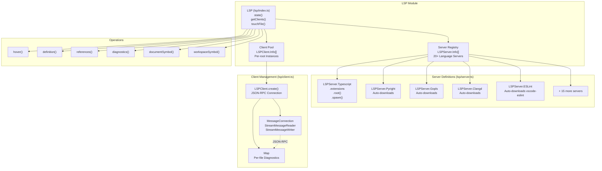
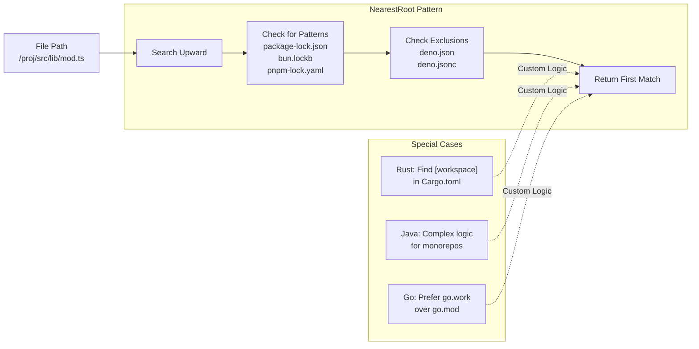
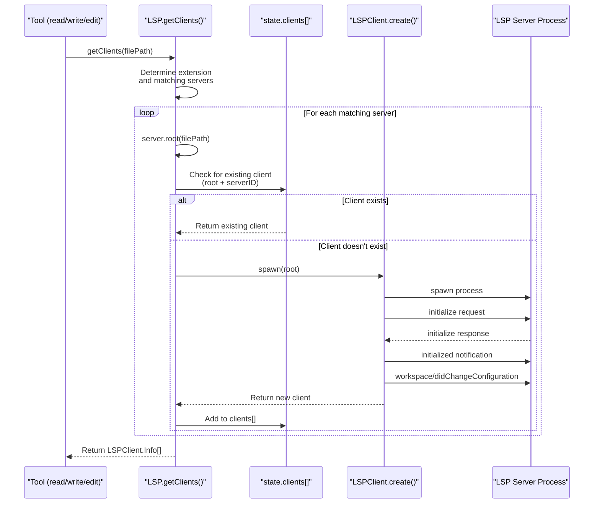
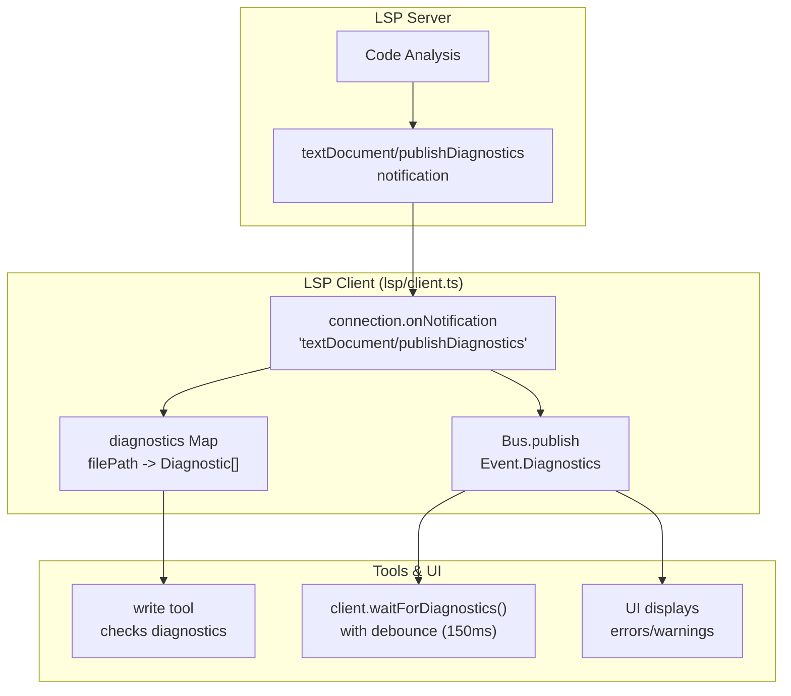
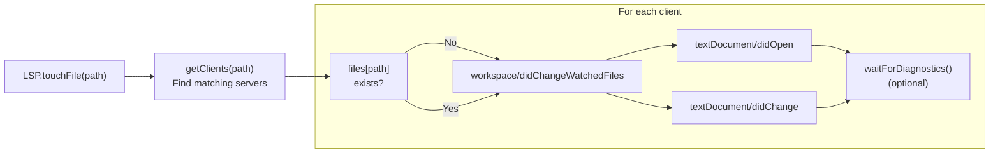
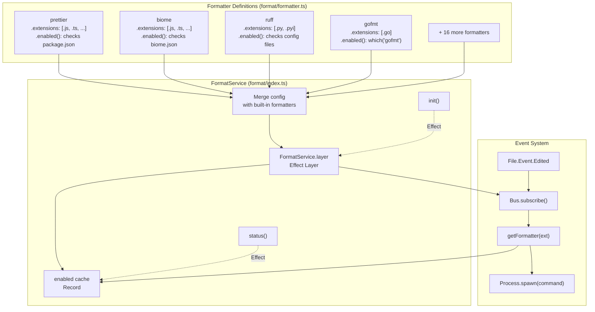
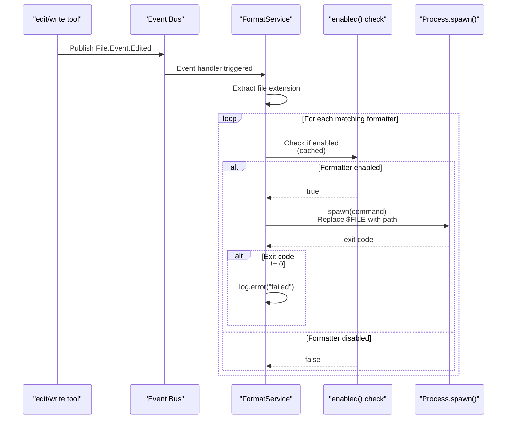
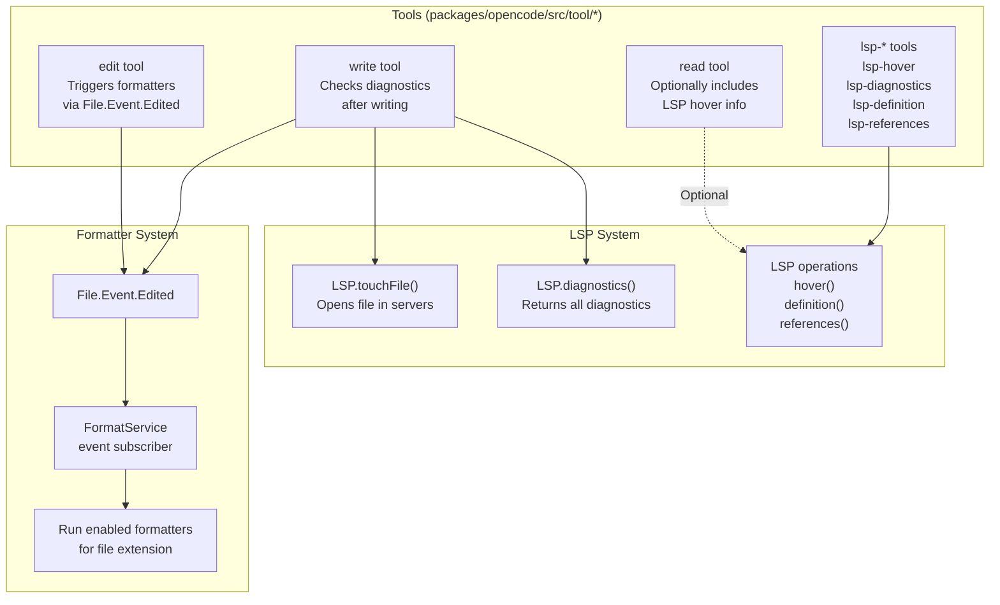

# LSP & Code Formatting

<details>
<summary>Relevant source files</summary>

The following files were used as context for generating this wiki page:

- [packages/opencode/parsers-config.ts](packages/opencode/parsers-config.ts)
- [packages/opencode/src/cli/cmd/generate.ts](packages/opencode/src/cli/cmd/generate.ts)
- [packages/opencode/src/format/formatter.ts](packages/opencode/src/format/formatter.ts)
- [packages/opencode/src/format/index.ts](packages/opencode/src/format/index.ts)
- [packages/opencode/src/lsp/client.ts](packages/opencode/src/lsp/client.ts)
- [packages/opencode/src/lsp/index.ts](packages/opencode/src/lsp/index.ts)
- [packages/opencode/src/lsp/language.ts](packages/opencode/src/lsp/language.ts)
- [packages/opencode/src/lsp/server.ts](packages/opencode/src/lsp/server.ts)
- [packages/opencode/src/storage/storage.ts](packages/opencode/src/storage/storage.ts)
- [packages/opencode/src/util/filesystem.ts](packages/opencode/src/util/filesystem.ts)
- [packages/opencode/src/util/log.ts](packages/opencode/src/util/log.ts)
- [packages/opencode/test/format/format.test.ts](packages/opencode/test/format/format.test.ts)
- [packages/opencode/test/util/filesystem.test.ts](packages/opencode/test/util/filesystem.test.ts)
- [packages/web/src/content/docs/formatters.mdx](packages/web/src/content/docs/formatters.mdx)
- [packages/web/src/content/docs/lsp.mdx](packages/web/src/content/docs/lsp.mdx)

</details>

This document covers OpenCode's Language Server Protocol (LSP) integration and automatic code formatting system. LSP provides code intelligence features (diagnostics, hover information, go-to-definition, etc.) that enhance the AI agent's understanding of code. The formatter system automatically applies language-specific formatting to files after edits, ensuring consistency with project style conventions.

For information about how LSP diagnostics are used by the `write` tool, see [2.5](#2.5). For details on the broader tool system architecture, see [2.5](#2.5).

---

## LSP Architecture

OpenCode manages multiple LSP servers per project, automatically spawning and configuring them based on file extensions and project structure. The system consists of three layers: server definitions, client connections, and operation handlers.

### System Components



**Sources:** [packages/opencode/src/lsp/index.ts](), [packages/opencode/src/lsp/server.ts](), [packages/opencode/src/lsp/client.ts]()

---

## LSP Server Definitions

Each LSP server is defined by an `LSPServer.Info` interface specifying its identifier, supported extensions, root detection logic, and spawn function. OpenCode includes 20+ built-in server definitions with automatic download capabilities.

### Server Information Structure

| Field        | Type           | Description                                                               |
| ------------ | -------------- | ------------------------------------------------------------------------- |
| `id`         | `string`       | Unique server identifier (e.g., "typescript", "pyright")                  |
| `extensions` | `string[]`     | File extensions handled by this server                                    |
| `root`       | `RootFunction` | Async function to detect project root from file path                      |
| `spawn`      | Function       | Async function returning `Handle` with process and initialization options |

**Sources:** [packages/opencode/src/lsp/server.ts:63-69]()

### Root Detection Strategies

LSP servers need to identify the project root to properly index files. OpenCode uses the `NearestRoot` helper that searches upward from a file for marker files:



**Sources:** [packages/opencode/src/lsp/server.ts:39-61](), [packages/opencode/src/lsp/server.ts:856-886](), [packages/opencode/src/lsp/server.ts:1139-1164]()

### Auto-Download Mechanism

When an LSP server binary is not found, OpenCode automatically downloads and installs it to `Global.Path.bin`. This mechanism is controlled by the `OPENCODE_DISABLE_LSP_DOWNLOAD` flag.

**Example: Pyright Installation**

The Pyright server checks for `pyright-langserver` in PATH, then for the npm package in `Global.Path.bin`. If neither exists and downloads are enabled, it runs `bun install pyright`:

**Sources:** [packages/opencode/src/lsp/server.ts:515-567]()

**Example: Clangd Installation**

Clangd fetches the latest release from GitHub, downloads the appropriate platform-specific archive, extracts it, and creates a symlink:

**Sources:** [packages/opencode/src/lsp/server.ts:902-1046]()

### Server Configuration Examples

| Server          | Extensions                                                   | Root Detection                                              | Download Source                                             |
| --------------- | ------------------------------------------------------------ | ----------------------------------------------------------- | ----------------------------------------------------------- |
| `typescript`    | `.ts`, `.tsx`, `.js`, `.jsx`, `.mjs`, `.cjs`, `.mts`, `.cts` | `NearestRoot` for lockfiles, excludes deno configs          | Uses `typescript-language-server` via `bun x`               |
| `deno`          | `.ts`, `.tsx`, `.js`, `.jsx`, `.mjs`                         | Searches for `deno.json` or `deno.jsonc`                    | Requires `deno` command in PATH                             |
| `pyright`       | `.py`, `.pyi`                                                | `NearestRoot` for `pyproject.toml`, `setup.py`, etc.        | npm package via `bun install`                               |
| `gopls`         | `.go`                                                        | Prefers `go.work`, falls back to `go.mod`                   | `go install golang.org/x/tools/gopls@latest`                |
| `rust-analyzer` | `.rs`                                                        | Searches for workspace `[workspace]` in `Cargo.toml`        | Requires `rust-analyzer` in PATH                            |
| `clangd`        | `.c`, `.cpp`, `.h`, `.hpp`, etc.                             | `NearestRoot` for `compile_commands.json`, `CMakeLists.txt` | GitHub releases (auto-extracts tar/zip)                     |
| `eslint`        | `.ts`, `.tsx`, `.js`, `.jsx`, `.vue`, etc.                   | `NearestRoot` for lockfiles                                 | Clones vscode-eslint, runs `npm install && npm run compile` |

**Sources:** [packages/opencode/src/lsp/server.ts:99-126](), [packages/opencode/src/lsp/server.ts:71-97](), [packages/opencode/src/lsp/server.ts:515-567](), [packages/opencode/src/lsp/server.ts:370-409](), [packages/opencode/src/lsp/server.ts:856-900](), [packages/opencode/src/lsp/server.ts:902-1046](), [packages/opencode/src/lsp/server.ts:177-233]()

---

## LSP Client Communication

OpenCode creates `LSPClient.Info` instances for each unique combination of server and project root. Clients communicate with servers using JSON-RPC over stdin/stdout pipes.

### Client Lifecycle



**Sources:** [packages/opencode/src/lsp/index.ts:178-263](), [packages/opencode/src/lsp/client.ts:42-250]()

### JSON-RPC Message Connection

The client uses `vscode-jsonrpc` to establish bidirectional communication:

- **Reader:** `StreamMessageReader` on `server.process.stdout`
- **Writer:** `StreamMessageWriter` on `server.process.stdin`
- **Protocol:** LSP specification (initialize, notifications, requests)

**Sources:** [packages/opencode/src/lsp/client.ts:46-49]()

### Diagnostics Flow



**Sources:** [packages/opencode/src/lsp/client.ts:52-62](), [packages/opencode/src/lsp/client.ts:209-237]()

### Initialization Options

Servers receive initialization options through the `initialization` field of `LSPServer.Handle`. These are sent in:

1. The `initializationOptions` field of the `initialize` request
2. The `settings` field of `workspace/didChangeConfiguration` notification

**Example: TypeScript Server**

**Sources:** [packages/opencode/src/lsp/server.ts:119-124](), [packages/opencode/src/lsp/client.ts:92-94](), [packages/opencode/src/lsp/client.ts:129-133]()

### File Touch Operation

The `LSP.touchFile()` function opens a file in the LSP server(s), triggering analysis and diagnostics:



**Sources:** [packages/opencode/src/lsp/index.ts:278-290](), [packages/opencode/src/lsp/client.ts:148-204]()

---

## LSP Operations

OpenCode provides a comprehensive set of LSP operations that tools can use to understand code:

| Operation                | LSP Method                          | Description                           | Returns                      |
| ------------------------ | ----------------------------------- | ------------------------------------- | ---------------------------- |
| `hover()`                | `textDocument/hover`                | Symbol information at cursor position | Hover content with type info |
| `definition()`           | `textDocument/definition`           | Navigate to symbol definition         | Location[]                   |
| `references()`           | `textDocument/references`           | Find all references to symbol         | Location[]                   |
| `implementation()`       | `textDocument/implementation`       | Find interface implementations        | Location[]                   |
| `documentSymbol()`       | `textDocument/documentSymbol`       | List symbols in file                  | DocumentSymbol[] or Symbol[] |
| `workspaceSymbol()`      | `workspace/symbol`                  | Search symbols across workspace       | Symbol[] (filtered by kind)  |
| `prepareCallHierarchy()` | `textDocument/prepareCallHierarchy` | Prepare call hierarchy items          | CallHierarchyItem[]          |
| `incomingCalls()`        | `callHierarchy/incomingCalls`       | Find incoming calls to function       | CallHierarchyIncomingCall[]  |
| `outgoingCalls()`        | `callHierarchy/outgoingCalls`       | Find outgoing calls from function     | CallHierarchyOutgoingCall[]  |
| `diagnostics()`          | N/A (cached)                        | Get all diagnostics from clients      | Record<path, Diagnostic[]>   |

**Sources:** [packages/opencode/src/lsp/index.ts:304-456]()

### Symbol Kind Filtering

The `workspaceSymbol()` operation filters results to important symbol kinds:

**Sources:** [packages/opencode/src/lsp/index.ts:349-358](), [packages/opencode/src/lsp/index.ts:360-370]()

---

## Code Formatting System

OpenCode automatically runs language-specific formatters after file edits. The formatter system is implemented as an Effect service that subscribes to `File.Event.Edited` events.

### Formatter Architecture



**Sources:** [packages/opencode/src/format/index.ts](), [packages/opencode/src/format/formatter.ts]()

### Formatter Information Structure

Each formatter implements the `Formatter.Info` interface:

| Field         | Type                                | Description                                      |
| ------------- | ----------------------------------- | ------------------------------------------------ |
| `name`        | `string`                            | Formatter identifier (e.g., "prettier", "biome") |
| `command`     | `string[]`                          | Command to execute, with `$FILE` placeholder     |
| `environment` | `Record<string, string>` (optional) | Environment variables for the process            |
| `extensions`  | `string[]`                          | File extensions this formatter handles           |
| `enabled`     | `() => Promise<boolean>`            | Function to check if formatter should run        |

**Sources:** [packages/opencode/src/format/formatter.ts:9-15]()

### Formatter Execution Flow



**Sources:** [packages/opencode/src/format/index.ts:103-138]()

### Built-in Formatters

| Formatter      | Extensions                                                   | Enabled Check                                                              |
| -------------- | ------------------------------------------------------------ | -------------------------------------------------------------------------- |
| `prettier`     | `.js`, `.ts`, `.html`, `.css`, `.md`, `.json`, `.yaml`, etc. | Checks for `prettier` in `package.json` dependencies                       |
| `biome`        | `.js`, `.ts`, `.html`, `.css`, `.md`, `.json`, `.yaml`, etc. | Checks for `biome.json` or `biome.jsonc` config                            |
| `ruff`         | `.py`, `.pyi`                                                | Checks for `ruff` command and config files (`pyproject.toml`, `ruff.toml`) |
| `gofmt`        | `.go`                                                        | Checks for `gofmt` in PATH                                                 |
| `mix`          | `.ex`, `.exs`, `.eex`, `.heex`, etc.                         | Checks for `mix` in PATH                                                   |
| `rustfmt`      | `.rs`                                                        | Checks for `rustfmt` in PATH                                               |
| `clang-format` | `.c`, `.cpp`, `.h`, `.hpp`, etc.                             | Checks for `.clang-format` config file                                     |
| `ktlint`       | `.kt`, `.kts`                                                | Checks for `ktlint` in PATH                                                |
| `shfmt`        | `.sh`, `.bash`                                               | Checks for `shfmt` in PATH                                                 |
| `nixfmt`       | `.nix`                                                       | Checks for `nixfmt` in PATH                                                |

**Sources:** [packages/opencode/src/format/formatter.ts:35-81](), [packages/opencode/src/format/formatter.ts:105-149](), [packages/opencode/src/format/formatter.ts:179-207](), [packages/opencode/src/format/formatter.ts:17-24](), [packages/opencode/src/format/formatter.ts:26-33](), [packages/opencode/src/format/formatter.ts:344-351](), [packages/opencode/src/format/formatter.ts:160-168](), [packages/opencode/src/format/formatter.ts:170-177](), [packages/opencode/src/format/formatter.ts:326-333](), [packages/opencode/src/format/formatter.ts:335-342]()

---

## Configuration

Both LSP servers and formatters can be configured through the `opencode.json` configuration file.

### LSP Configuration Schema

The `lsp` field in configuration can be:

- `false` to disable all LSP servers
- An object mapping server IDs to configuration

**Per-Server Configuration:**

| Property         | Type                     | Description                                  |
| ---------------- | ------------------------ | -------------------------------------------- |
| `disabled`       | `boolean`                | Disables this LSP server                     |
| `command`        | `string[]`               | Custom command to start the server           |
| `extensions`     | `string[]`               | File extensions this server should handle    |
| `env`            | `Record<string, string>` | Environment variables for the server process |
| `initialization` | `object`                 | Options sent in `initialize` request         |

**Example Configuration:**

```json
{
  "lsp": {
    "typescript": {
      "initialization": {
        "preferences": {
          "importModuleSpecifierPreference": "relative"
        }
      }
    },
    "rust": {
      "env": {
        "RUST_LOG": "debug"
      }
    },
    "eslint": {
      "disabled": true
    },
    "custom-lsp": {
      "command": ["custom-lsp-server", "--stdio"],
      "extensions": [".custom"]
    }
  }
}
```

**Sources:** [packages/opencode/src/lsp/index.ts:100-127]()

### Formatter Configuration Schema

The `formatter` field can be:

- `false` to disable all formatters
- An object mapping formatter names to configuration

**Per-Formatter Configuration:**

| Property      | Type                     | Description                                   |
| ------------- | ------------------------ | --------------------------------------------- |
| `disabled`    | `boolean`                | Disables this formatter                       |
| `command`     | `string[]`               | Command to execute (with `$FILE` placeholder) |
| `environment` | `Record<string, string>` | Environment variables for the process         |
| `extensions`  | `string[]`               | File extensions this formatter handles        |

**Example Configuration:**

```json
{
  "formatter": {
    "prettier": {
      "command": ["npx", "prettier", "--write", "$FILE"],
      "environment": {
        "NODE_ENV": "development"
      }
    },
    "biome": {
      "disabled": true
    },
    "custom-formatter": {
      "command": ["deno", "fmt", "$FILE"],
      "extensions": [".md"]
    }
  }
}
```

**Sources:** [packages/opencode/src/format/index.ts:57-77]()

### Experimental Flags

OpenCode uses feature flags to control experimental LSP servers:

| Flag                            | Default | Description                                        |
| ------------------------------- | ------- | -------------------------------------------------- |
| `OPENCODE_EXPERIMENTAL_LSP_TY`  | `false` | Enables `ty` Python LSP server, disables `pyright` |
| `OPENCODE_DISABLE_LSP_DOWNLOAD` | `false` | Prevents automatic download of LSP servers         |
| `OPENCODE_EXPERIMENTAL_OXFMT`   | `false` | Enables `oxfmt` JavaScript/TypeScript formatter    |

**Sources:** [packages/opencode/src/lsp/index.ts:64-77](), [packages/opencode/src/format/formatter.ts:90-103]()

---

## Integration with Tools

The LSP and formatter systems integrate with OpenCode's tool system to provide code intelligence and maintain code quality.

### Tool Integration Points



**Sources:** [packages/opencode/src/lsp/index.ts:278-302](), [packages/opencode/src/format/index.ts:103-138]()

### Language ID Mapping

LSP clients need to send the correct `languageId` when opening files. OpenCode maintains a mapping from file extensions to LSP language identifiers:

**Sources:** [packages/opencode/src/lsp/language.ts](), [packages/opencode/src/lsp/client.ts:151-152]()

---

## State Management

Both systems maintain state through the project lifecycle:

### LSP State

The LSP system uses `Instance.state()` to manage per-project state:

- **`servers`:** Map of enabled server definitions (filtered by config)
- **`clients`:** Array of active `LSPClient.Info` instances
- **`spawning`:** Map of in-flight server spawn operations (prevents duplicate spawns)
- **`broken`:** Set of server+root combinations that failed to initialize

**Sources:** [packages/opencode/src/lsp/index.ts:79-145]()

### Formatter State

The FormatService uses Effect layers for state management:

- **`formatters`:** Map of formatter definitions (built-in + config overrides)
- **`enabled`:** Cache of formatter enabled status (avoids repeated checks)
- **Subscription:** Event bus subscription to `File.Event.Edited`

**Sources:** [packages/opencode/src/format/index.ts:47-161]()

---

## Performance Considerations

### LSP Client Pooling

Clients are reused when the same server+root combination is requested, preventing unnecessary process spawns:

**Sources:** [packages/opencode/src/lsp/index.ts:232-236]()

### Formatter Enabled Caching

The `enabled()` check for each formatter is cached to avoid repeated expensive operations (file reads, command checks):

**Sources:** [packages/opencode/src/format/index.ts:82-89]()

### Diagnostics Debouncing

When waiting for diagnostics, the client debounces for 150ms to allow LSP servers to send follow-up diagnostics (e.g., semantic analysis after syntax):

**Sources:** [packages/opencode/src/lsp/client.ts:16](), [packages/opencode/src/lsp/client.ts:221-226]()

### Inflight Spawn Tracking

The LSP system tracks in-flight spawn operations to prevent multiple concurrent spawns of the same server:

**Sources:** [packages/opencode/src/lsp/index.ts:238-253]()
