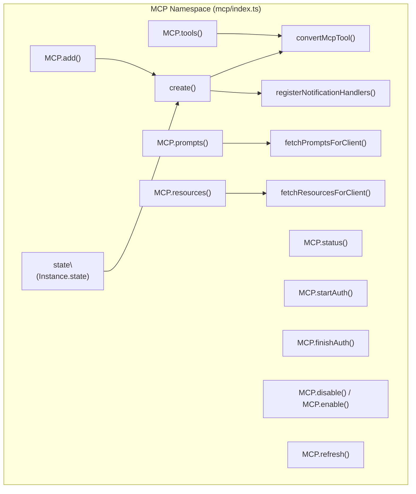
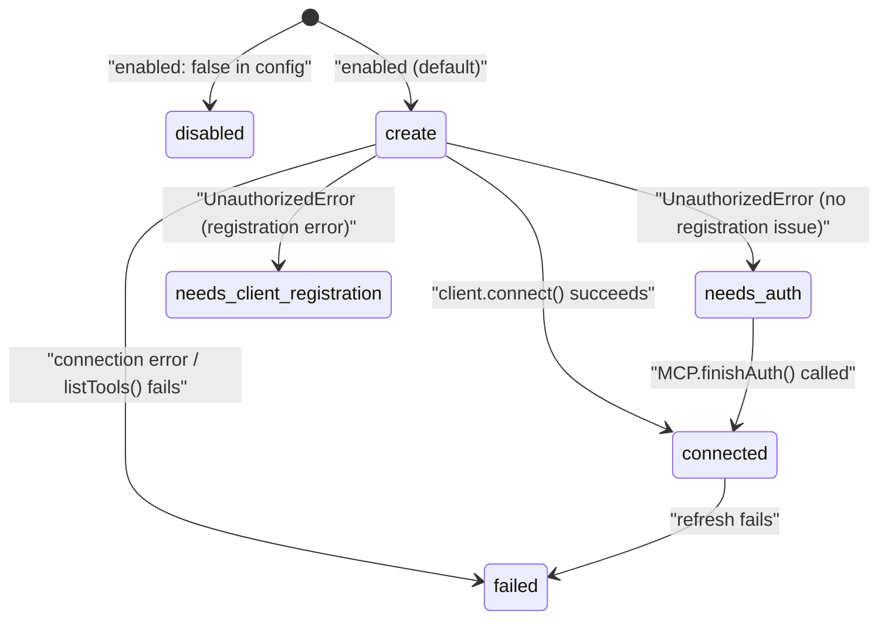
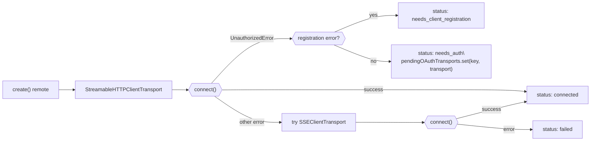
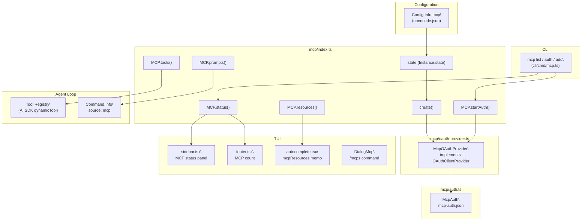

# MCP Integration

<details>
<summary>Relevant source files</summary>

The following files were used as context for generating this wiki page:

- [packages/opencode/src/agent/agent.ts](packages/opencode/src/agent/agent.ts)
- [packages/opencode/src/config/config.ts](packages/opencode/src/config/config.ts)
- [packages/opencode/src/env/index.ts](packages/opencode/src/env/index.ts)
- [packages/opencode/src/file/index.ts](packages/opencode/src/file/index.ts)
- [packages/opencode/src/file/ripgrep.ts](packages/opencode/src/file/ripgrep.ts)
- [packages/opencode/src/file/time.ts](packages/opencode/src/file/time.ts)
- [packages/opencode/src/provider/error.ts](packages/opencode/src/provider/error.ts)
- [packages/opencode/src/provider/models.ts](packages/opencode/src/provider/models.ts)
- [packages/opencode/src/provider/provider.ts](packages/opencode/src/provider/provider.ts)
- [packages/opencode/src/provider/transform.ts](packages/opencode/src/provider/transform.ts)
- [packages/opencode/src/server/server.ts](packages/opencode/src/server/server.ts)
- [packages/opencode/src/session/compaction.ts](packages/opencode/src/session/compaction.ts)
- [packages/opencode/src/session/index.ts](packages/opencode/src/session/index.ts)
- [packages/opencode/src/session/llm.ts](packages/opencode/src/session/llm.ts)
- [packages/opencode/src/session/message-v2.ts](packages/opencode/src/session/message-v2.ts)
- [packages/opencode/src/session/message.ts](packages/opencode/src/session/message.ts)
- [packages/opencode/src/session/prompt.ts](packages/opencode/src/session/prompt.ts)
- [packages/opencode/src/session/revert.ts](packages/opencode/src/session/revert.ts)
- [packages/opencode/src/session/summary.ts](packages/opencode/src/session/summary.ts)
- [packages/opencode/src/tool/bash.ts](packages/opencode/src/tool/bash.ts)
- [packages/opencode/src/tool/edit.ts](packages/opencode/src/tool/edit.ts)
- [packages/opencode/src/tool/glob.ts](packages/opencode/src/tool/glob.ts)
- [packages/opencode/src/tool/grep.ts](packages/opencode/src/tool/grep.ts)
- [packages/opencode/src/tool/ls.ts](packages/opencode/src/tool/ls.ts)
- [packages/opencode/src/tool/read.ts](packages/opencode/src/tool/read.ts)
- [packages/opencode/src/tool/registry.ts](packages/opencode/src/tool/registry.ts)
- [packages/opencode/src/tool/task.ts](packages/opencode/src/tool/task.ts)
- [packages/opencode/src/tool/todo.ts](packages/opencode/src/tool/todo.ts)
- [packages/opencode/src/tool/tool.ts](packages/opencode/src/tool/tool.ts)
- [packages/opencode/src/tool/webfetch.ts](packages/opencode/src/tool/webfetch.ts)
- [packages/opencode/src/tool/write.ts](packages/opencode/src/tool/write.ts)
- [packages/opencode/test/agent/agent.test.ts](packages/opencode/test/agent/agent.test.ts)
- [packages/opencode/test/config/config.test.ts](packages/opencode/test/config/config.test.ts)
- [packages/opencode/test/file/index.test.ts](packages/opencode/test/file/index.test.ts)
- [packages/opencode/test/file/time.test.ts](packages/opencode/test/file/time.test.ts)
- [packages/opencode/test/preload.ts](packages/opencode/test/preload.ts)
- [packages/opencode/test/provider/provider.test.ts](packages/opencode/test/provider/provider.test.ts)
- [packages/opencode/test/provider/transform.test.ts](packages/opencode/test/provider/transform.test.ts)
- [packages/opencode/test/session/llm.test.ts](packages/opencode/test/session/llm.test.ts)
- [packages/opencode/test/session/message-v2.test.ts](packages/opencode/test/session/message-v2.test.ts)
- [packages/opencode/test/session/revert-compact.test.ts](packages/opencode/test/session/revert-compact.test.ts)
- [packages/opencode/test/tool/bash.test.ts](packages/opencode/test/tool/bash.test.ts)
- [packages/opencode/test/tool/edit.test.ts](packages/opencode/test/tool/edit.test.ts)
- [packages/opencode/test/tool/external-directory.test.ts](packages/opencode/test/tool/external-directory.test.ts)
- [packages/opencode/test/tool/grep.test.ts](packages/opencode/test/tool/grep.test.ts)
- [packages/opencode/test/tool/question.test.ts](packages/opencode/test/tool/question.test.ts)
- [packages/opencode/test/tool/write.test.ts](packages/opencode/test/tool/write.test.ts)
- [packages/sdk/js/src/gen/sdk.gen.ts](packages/sdk/js/src/gen/sdk.gen.ts)
- [packages/sdk/js/src/gen/types.gen.ts](packages/sdk/js/src/gen/types.gen.ts)
- [packages/sdk/js/src/v2/gen/sdk.gen.ts](packages/sdk/js/src/v2/gen/sdk.gen.ts)
- [packages/sdk/js/src/v2/gen/types.gen.ts](packages/sdk/js/src/v2/gen/types.gen.ts)
- [packages/sdk/openapi.json](packages/sdk/openapi.json)

</details>

This page documents how OpenCode connects to Model Context Protocol (MCP) servers, how server configuration works, how OAuth-based authentication flows are handled, and how tools, prompts, and resources from MCP servers are surfaced to agents and users. For background on the overall tool system and how MCP tools are registered alongside built-in tools, see [2.5](). For plugin-defined tools, see [2.9]().

---

## Overview

The `MCP` namespace manages integration with external MCP servers, enabling OpenCode to access resources (databases, APIs) and invoke tools provided by those servers. Key responsibilities include:

- Connecting to multiple MCP servers (local subprocess or remote HTTP) at startup
- Maintaining per-server connection status and health
- Converting MCP tool definitions into AI SDK `Tool` objects for the agent
- Exposing MCP prompts as session commands (slash commands in TUI)
- Exposing MCP resources in prompt autocomplete for easy reference

MCP servers are initialized once per project instance and cleaned up when the instance is disposed.
</thinking>

Sources: [packages/opencode/src/config/config.ts:563-624](), [packages/opencode/src/session/prompt.ts:27]()

**Diagram: MCP Namespace – Major Components**



Sources: [packages/opencode/src/mcp/index.ts:1-560]()

---

## Configuration

MCP servers are declared under the `mcp` key in `opencode.json`. Each entry maps a string name to a server config object.

### Server Types

OpenCode supports two MCP server connection types, defined by Zod schemas in the configuration system:

**`Config.McpLocal`** ([packages/opencode/src/config/config.ts:563-582]()):
| Field | Type | Required | Description |
|---|---|---|---|
| `type` | `"local"` | Yes | Identifies local subprocess server |
| `command` | `string[]` | Yes | Command and arguments to spawn the MCP server |
| `environment` | `Record<string,string>` | No | Environment variables for the subprocess |
| `enabled` | `boolean` | No | Enable or disable server on startup |
| `timeout` | `number` | No | Request timeout in ms (default: 5000) |

**`Config.McpRemote`** ([packages/opencode/src/config/config.ts:599-621]()):
| Field | Type | Required | Description |
|---|---|---|---|
| `type` | `"remote"` | Yes | Identifies remote HTTP server |
| `url` | `string` | Yes | URL of the remote MCP server |
| `enabled` | `boolean` | No | Enable or disable server on startup |
| `headers` | `Record<string,string>` | No | HTTP headers for requests |
| `oauth` | `McpOAuth \| false` | No | OAuth configuration or `false` to disable auto-detection |
| `timeout` | `number` | No | Request timeout in ms (default: 5000) |

**`Config.McpOAuth`** ([packages/opencode/src/config/config.ts:584-597]()):
| Field | Type | Description |
|---|---|---|
| `clientId` | `string` | OAuth client ID (optional if using RFC 7591 dynamic registration) |
| `clientSecret` | `string` | OAuth client secret (if required by authorization server) |
| `scope` | `string` | OAuth scopes to request |

**Local server example:**

```json
{
  "mcp": {
    "filesystem": {
      "type": "local",
      "command": [
        "npx",
        "-y",
        "@modelcontextprotocol/server-filesystem",
        "/tmp"
      ]
    }
  }
}
```

**Remote server example with OAuth:**

```json
{
  "mcp": {
    "my-api": {
      "type": "remote",
      "url": "https://api.example.com/mcp",
      "oauth": { "clientId": "abc123" }
    }
  }
}
```

Setting `enabled: false` skips connection entirely and marks the server as `disabled` without attempting to connect.

Sources: [packages/opencode/src/config/config.ts:563-624]()

---

## Connection Architecture

All configured servers are connected in parallel at initialization through `Instance.state`. The state manages connected `Client` instances and tracks connection status per server name.

**Diagram: Connection State Machine per MCP Server**



Sources: Configuration behavior and OAuth flow management

---

## Transport Protocols

### Local Servers

Local servers use `StdioClientTransport` from `@modelcontextprotocol/sdk/client/stdio.js`. The server is launched as a child process using the `command` array from config. The working directory is set to `Instance.directory`. Environment variables from `mcp.environment` are merged with `process.env`.

Stderr from the child process is piped and logged at info level.

On cleanup, opencode kills the full descendant tree (using `pgrep -P` recursively) before closing the transport, to handle servers like `chrome-devtools-mcp` that spawn grandchild processes.

### Remote Servers

Remote servers try two transports in order:

1. `StreamableHTTPClientTransport` (from `@modelcontextprotocol/sdk/client/streamableHttp.js`)
2. `SSEClientTransport` (from `@modelcontextprotocol/sdk/client/sse.js`)

If `StreamableHTTP` fails, `SSE` is attempted. The first successful transport is used. Both respect the `headers` config field and the `McpOAuthProvider` instance (if OAuth is not disabled).

**Diagram: Remote Transport Fallback**



Sources: [packages/opencode/src/mcp/index.ts:341-443]()

---

## Tool List Change Notifications

After connecting, `registerNotificationHandlers` is called on each client. It installs a handler for `ToolListChangedNotificationSchema`: when the MCP server reports that its tool list has changed, `MCP.ToolsChanged` is published on the internal `Bus`. Consumers (such as the session agent) can react by re-fetching tools.

Sources: [packages/opencode/src/mcp/index.ts:112-117]()

---

## Tool Surfacing

`MCP.tools()` iterates all connected clients, calls `client.listTools()` on each, and converts each result using `convertMcpTool`. The returned `Record<string, Tool>` is merged with built-in tools and plugin tools when assembling the tool set for the agent's reasoning loop.

`convertMcpTool` wraps each MCP tool as an AI SDK `dynamicTool`:

- `inputSchema` is converted to a `JSONSchema7` object (`type: "object"`, `additionalProperties: false`)
- `execute` calls `client.callTool(...)` with `CallToolResultSchema` and optional timeout
- `resetTimeoutOnProgress: true` is set so long-running tools don't time out during progress updates

Tools from each MCP server inherit that server's configured `timeout` (defaulting to 30 seconds).

Sources: [packages/opencode/src/mcp/index.ts:120-148]()

---

## MCP Prompts as Commands

`MCP.prompts()` calls `fetchPromptsForClient` for every connected client. Each MCP prompt becomes an entry in the `Command.Info` registry (sourced as `"mcp"`), making it available as a slash command in the TUI and web UI.

The command key is composed as `<sanitizedClientName>:<sanitizedPromptName>` (non-alphanumeric characters replaced with `_`).

The `Command.Info` schema records `source: "mcp"` so UIs can label it accordingly. In the TUI autocomplete, MCP commands appear with a `:mcp` label.

Sources: [packages/opencode/src/mcp/index.ts:250-270](), [packages/opencode/src/command/index.ts:1-140](), [packages/opencode/src/cli/cmd/tui/component/prompt/autocomplete.tsx:356-383]()

---

## MCP Resources in Autocomplete

`MCP.resources()` calls `fetchResourcesForClient` for every connected client. Each resource is keyed as `<sanitizedClientName>:<sanitizedResourceName>`.

In the TUI prompt autocomplete, the `mcpResources` memo (computed from `sync.data.mcp_resource`) surfaces these when the user types `@`. Selecting a resource inserts a `file`-typed prompt part with `source.type: "resource"`, carrying the `clientName` and `uri`.

Sources: [packages/opencode/src/cli/cmd/tui/component/prompt/autocomplete.tsx:298-332](), [packages/opencode/src/mcp/index.ts:272-292]()

---

## OAuth Authentication Flow

OAuth applies only to remote MCP servers where `oauth` is not `false`.

**Diagram: OAuth Flow – Code Entities**

```mermaid
sequenceDiagram
  participant "create()" as create
  participant "McpOAuthProvider" as Provider
  participant "McpAuth" as Auth
  participant "McpOAuthCallback" as Callback
  participant "MCP Server" as Server
  participant "Browser" as Browser

  create->>Provider: "new McpOAuthProvider(key, url, config)"
  create->>Server: "client.connect(transport)"
  Server-->>create: "UnauthorizedError"
  create->>create: "pendingOAuthTransports.set(key, transport)"
  create->>create: "status = needs_auth"

  note over create: "MCP.startAuth(name) called later"
  create->>Provider: "transport.startAuthorization()"
  Provider->>Auth: "McpAuth.getForUrl(name, url)"
  Provider->>Browser: "open(authorizationUrl)"
  Callback->>Callback: "HTTP server on port 19876"
  Browser-->>Callback: "GET /mcp/oauth/callback?code=..."
  Callback-->>create: "code returned"
  create->>Provider: "transport.finishAuthorization(code)"
  Provider->>Auth: "McpAuth.save(name, tokens)"
  create->>Server: "client.connect(transport)"
  Server-->>create: "connected"
```

### `McpOAuthProvider`

`McpOAuthProvider` (in [packages/opencode/src/mcp/oauth-provider.ts]()) implements `OAuthClientProvider` from the MCP SDK. It:

- Provides `redirectUrl = "http://127.0.0.1:19876/mcp/oauth/callback"`
- Provides `clientMetadata` (app name, redirect URL, etc.)
- Reads/writes `OAuthTokens` and `OAuthClientInformation` via `McpAuth`
- Calls `callbacks.onRedirect(url)` with the authorization URL

### `McpAuth` – Token Storage

`McpAuth` (in [packages/opencode/src/mcp/auth.ts]()) persists OAuth state to `$XDG_DATA_HOME/opencode/mcp-auth.json`. Each entry (`McpAuth.Entry`) contains:

| Field          | Type                 | Purpose                                 |
| -------------- | -------------------- | --------------------------------------- |
| `tokens`       | `McpAuth.Tokens`     | Access/refresh tokens with expiry       |
| `clientInfo`   | `McpAuth.ClientInfo` | Dynamically registered client ID/secret |
| `codeVerifier` | `string`             | PKCE code verifier                      |
| `oauthState`   | `string`             | OAuth state parameter                   |
| `serverUrl`    | `string`             | Server URL (used to detect URL changes) |

`McpAuth.getForUrl` validates that stored credentials are for the same URL; if the URL has changed, it returns `undefined` so re-authentication is triggered.

### Needs Client Registration

If the server does not support dynamic client registration and no `clientId` is provided in config, the status is set to `needs_client_registration`. The user must add `clientId` (and optionally `clientSecret`) to `opencode.json` under the server's `oauth` object.

Sources: MCP OAuth implementation and authentication storage

---

## CLI Management Commands

The `mcp` CLI subcommand (`packages/opencode/src/cli/cmd/mcp.ts`) provides subcommands for managing MCP servers outside of the TUI.

| Subcommand          | Alias    | Description                                                       |
| ------------------- | -------- | ----------------------------------------------------------------- |
| `mcp list`          | `mcp ls` | Lists all configured servers and their connection status          |
| `mcp auth [name]`   | —        | Runs the OAuth flow for a named remote server                     |
| `mcp auth list`     | —        | Lists OAuth authentication status per server                      |
| `mcp logout [name]` | —        | Deletes stored OAuth tokens for a server                          |
| `mcp debug [name]`  | —        | Connects to an MCP server and lists available tools for debugging |
| `mcp add`           | —        | Interactively adds a new server entry to `opencode.json`          |

`mcp auth` flow:

1. Reads OAuth-capable servers from config
2. Prompts the user to select one (if `[name]` not provided)
3. Calls `MCP.startAuth(name)` → opens the browser to the authorization URL
4. Waits for the local callback server (port 19876) to receive the code
5. Calls `MCP.finishAuth(name, code)` to exchange the code for tokens

`mcp add` uses `jsonc-parser`'s `modify` and `applyEdits` to write directly to the config file without disturbing comments.

`MCP.AuthStatus` (used by `mcp auth list`) is a three-valued enum: `authenticated`, `expired`, `not_authenticated`.

Sources: MCP CLI command implementation

---

## Runtime Operations

Beyond initial connection, several runtime operations are available:

| Function                    | Description                                                    |
| --------------------------- | -------------------------------------------------------------- |
| `MCP.add(name, mcp)`        | Connect a new server or reconnect an existing one by name      |
| `MCP.disable(name)`         | Close and mark a server as disabled                            |
| `MCP.enable(name)`          | Re-enable a disabled server and reconnect                      |
| `MCP.refresh(name)`         | Close and reopen the connection for a server                   |
| `MCP.status()`              | Return `Record<string, MCP.Status>` for all configured servers |
| `MCP.hasStoredTokens(name)` | Check if OAuth tokens are persisted for a server               |

`MCP.add` closes any existing client for the same name before replacing it, to prevent connection leaks.

Sources: MCP runtime operation handlers

---

## TUI Display

**Sidebar status panel**:

The TUI sidebar displays an MCP section when at least one server is configured. Servers are sorted alphabetically, with each entry showing a status indicator and label:

| Status                      | Color             | Label           |
| --------------------------- | ----------------- | --------------- |
| `connected`                 | `theme.success`   | Connected       |
| `failed`                    | `theme.error`     | Error message   |
| `disabled`                  | `theme.textMuted` | Disabled        |
| `needs_auth`                | `theme.warning`   | Needs auth      |
| `needs_client_registration` | `theme.error`     | Needs client ID |

When multiple servers are present, the section is collapsible. The collapsed header displays counts: `(N active, M errors)`.

**Footer status**:

The TUI footer displays the count of connected MCP servers. If any server has `status: "failed"`, an error indicator is shown.

**MCP toggle dialog**:

The `/mcps` slash command opens a dialog (`DialogMcp`) that allows enabling/disabling individual servers from within the TUI.

Sources: TUI sidebar, footer, and dialog components

---

## Full Integration Map

**Diagram: MCP Integration Across Subsystems**



Sources: [packages/opencode/src/mcp/index.ts](), [packages/opencode/src/mcp/auth.ts](), [packages/opencode/src/mcp/oauth-provider.ts](), [packages/opencode/src/cli/cmd/mcp.ts](), [packages/opencode/src/cli/cmd/tui/routes/session/sidebar.tsx](), [packages/opencode/src/cli/cmd/tui/component/prompt/autocomplete.tsx](), [packages/opencode/src/command/index.ts]()
