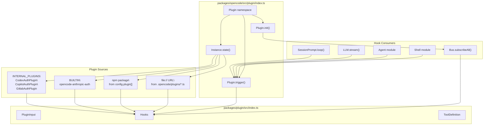
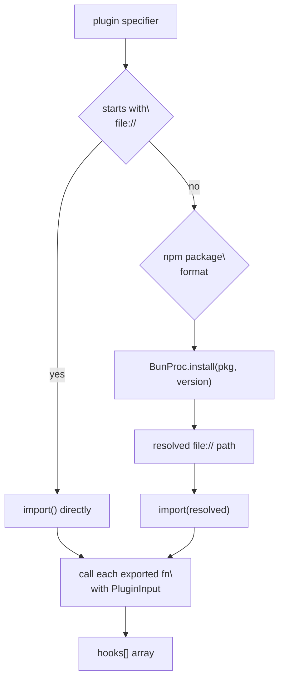
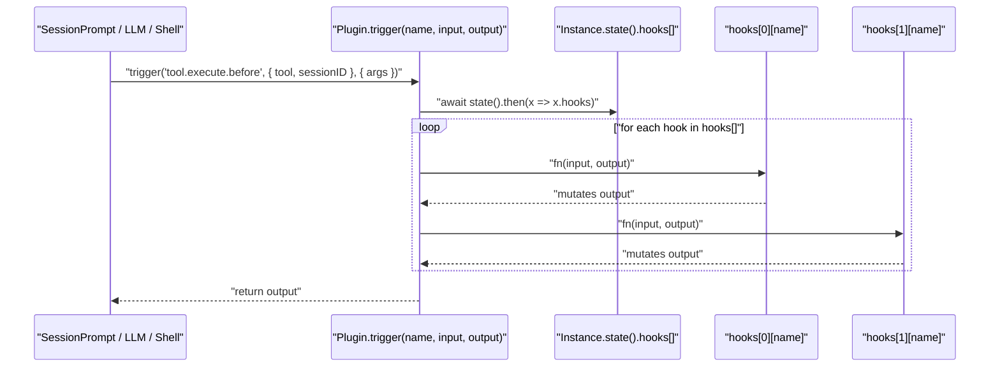

# Plugin System

<details>
<summary>Relevant source files</summary>

The following files were used as context for generating this wiki page:

- [packages/opencode/src/cli/bootstrap.ts](packages/opencode/src/cli/bootstrap.ts)
- [packages/opencode/src/cli/cmd/acp.ts](packages/opencode/src/cli/cmd/acp.ts)
- [packages/opencode/src/cli/cmd/run.ts](packages/opencode/src/cli/cmd/run.ts)
- [packages/opencode/src/cli/cmd/serve.ts](packages/opencode/src/cli/cmd/serve.ts)
- [packages/opencode/src/cli/cmd/tui/context/sync.tsx](packages/opencode/src/cli/cmd/tui/context/sync.tsx)
- [packages/opencode/src/cli/cmd/tui/thread.ts](packages/opencode/src/cli/cmd/tui/thread.ts)
- [packages/opencode/src/cli/cmd/tui/worker.ts](packages/opencode/src/cli/cmd/tui/worker.ts)
- [packages/opencode/src/cli/cmd/web.ts](packages/opencode/src/cli/cmd/web.ts)
- [packages/opencode/src/cli/network.ts](packages/opencode/src/cli/network.ts)
- [packages/opencode/src/index.ts](packages/opencode/src/index.ts)
- [packages/opencode/src/server/mdns.ts](packages/opencode/src/server/mdns.ts)
- [packages/sdk/js/src/index.ts](packages/sdk/js/src/index.ts)
- [packages/web/src/content/docs/cli.mdx](packages/web/src/content/docs/cli.mdx)
- [packages/web/src/content/docs/config.mdx](packages/web/src/content/docs/config.mdx)
- [packages/web/src/content/docs/ide.mdx](packages/web/src/content/docs/ide.mdx)
- [packages/web/src/content/docs/plugins.mdx](packages/web/src/content/docs/plugins.mdx)
- [packages/web/src/content/docs/sdk.mdx](packages/web/src/content/docs/sdk.mdx)
- [packages/web/src/content/docs/server.mdx](packages/web/src/content/docs/server.mdx)
- [packages/web/src/content/docs/tui.mdx](packages/web/src/content/docs/tui.mdx)

</details>

This page describes how the opencode plugin architecture works: how plugins are discovered, loaded, initialized, and how they interact with core systems via hooks. It covers both the internal machinery in `packages/opencode` and the public API surface exposed by `packages/plugin`.

For documentation on the Tool System that plugins can extend, see [2.4](). For MCP-based tool extension, see [2.8](). For configuration options relevant to plugins, see [2.1]().

---

## Overview

Plugins are JavaScript/TypeScript modules that export one or more functions conforming to the `Plugin` type from `@opencode-ai/plugin`. Each function receives a `PluginInput` context and returns a `Hooks` object. Hooks are callback functions that opencode calls at well-defined points during session execution — before/after tool calls, before LLM requests, during shell execution, and on bus events.

The plugin system has three tiers:

| Tier             | Source                                         | Examples                                                   |
| ---------------- | ---------------------------------------------- | ---------------------------------------------------------- |
| Internal plugins | Compiled into the binary                       | `CodexAuthPlugin`, `CopilotAuthPlugin`, `GitlabAuthPlugin` |
| Built-in plugins | npm packages, auto-installed                   | `opencode-anthropic-auth@0.0.13`                           |
| User plugins     | npm packages or local files declared in config | Any user-defined package or `.ts` file                     |

---

## Plugin Architecture Diagram

**Figure: Plugin loading and hook dispatch**



Sources: [packages/opencode/src/plugin/index.ts:1-143](), [packages/plugin/src/index.ts:1-40]()

---

## Plugin Loading Pipeline

Loading is initiated per-project instance via `Instance.state` in [packages/opencode/src/plugin/index.ts:24-104](). The loading sequence is:

1. **Internal plugins** — Imported directly at compile time. These are `CodexAuthPlugin`, `CopilotAuthPlugin`, and `GitlabAuthPlugin`. They bypass npm installation entirely.

2. **Built-in plugins** — Listed in the `BUILTIN` constant (`["opencode-anthropic-auth@0.0.13"]`). Installed via `BunProc.install()` if not already present. Can be disabled with the `OPENCODE_DISABLE_DEFAULT_PLUGINS` flag.

3. **User plugins** — Combined from:
   - The `plugin` array in `opencode.json` (npm specifiers or `file://` URLs).
   - Auto-scanned `{plugin,plugins}/*.{ts,js}` files inside config directories.

Each plugin module is `import()`-ed dynamically. Every exported function is called with `PluginInput`. The returned `Hooks` objects are accumulated into a `hooks[]` array stored in instance state.

**Figure: Plugin specifier resolution**



Sources: [packages/opencode/src/plugin/index.ts:56-103]()

---

## Plugin Discovery via Configuration

### `opencode.json` Declaration

The `plugin` field in `opencode.json` accepts an array of plugin specifiers:

```json
{
  "plugin": [
    "oh-my-opencode@1.0.0",
    "@scope/my-plugin@2.0.0",
    "file:///home/user/.opencode/plugins/my-plugin.ts"
  ]
}
```

This field is merged from all config sources (global, project, `.opencode/`) by `mergeConfigConcatArrays`, which concatenates rather than replaces plugin arrays across config layers. See [2.1]() for details on config layering.

### Auto-scanning Plugin Directories

The `loadPlugin` function in [packages/opencode/src/config/config.ts:450-462]() scans for `*.ts` and `*.js` files inside any `plugin/` or `plugins/` subdirectory of a config directory:

```
.opencode/
  plugins/
    my-plugin.ts     ← auto-discovered
    another-plugin.js
```

File paths are converted to `file://` URLs before being added to the plugin list.

### Specifier Formats

| Format                   | Example                     | Resolution                        |
| ------------------------ | --------------------------- | --------------------------------- |
| npm package with version | `oh-my-opencode@2.4.3`      | Installed via `BunProc.install()` |
| Scoped npm package       | `@scope/pkg@1.0.0`          | Installed via `BunProc.install()` |
| Local file URL           | `file:///path/to/plugin.ts` | Imported directly                 |

The canonical name used for deduplication is extracted by `getPluginName` in [packages/opencode/src/config/config.ts:474-483]():

- For `file://` URLs: the filename without extension.
- For npm specifiers: the package name without version.

### Deduplication

`deduplicatePlugins` in [packages/opencode/src/config/config.ts:496-514]() deduplicates plugins by canonical name. When the same plugin appears at multiple config layers, the highest-priority version wins. Priority order (highest first):

1. Local `plugins/` directory
2. Local `opencode.json`
3. Global `plugins/` directory
4. Global `opencode.json`

---

## The `@opencode-ai/plugin` Package

The public API for plugin authors lives in `packages/plugin/src/index.ts`.

### `PluginInput`

Every plugin function receives this context object:

| Field       | Type                                      | Description                                 |
| ----------- | ----------------------------------------- | ------------------------------------------- |
| `client`    | `ReturnType<typeof createOpencodeClient>` | Typed HTTP client for the opencode API      |
| `project`   | `Project`                                 | Project metadata (id, worktree, etc.)       |
| `directory` | `string`                                  | Current working directory                   |
| `worktree`  | `string`                                  | Git worktree root                           |
| `serverUrl` | `URL`                                     | URL of the local opencode HTTP server       |
| `$`         | `BunShell`                                | Bun shell instance for running subprocesses |

Sources: [packages/plugin/src/index.ts:26-33]()

### `Plugin` Type

A plugin is a function:

```ts
type Plugin = (input: PluginInput) => Hooks | Promise<Hooks>
```

A module may export multiple plugin functions (as named exports), all of which are called. Duplicate references to the same function object are deduplicated by the loader to prevent double-initialization.

Sources: [packages/opencode/src/plugin/index.ts:80-98]()

### `ToolDefinition`

Plugins can register custom tools by returning them in the `tool` hook key. The `ToolDefinition` type is exported from `packages/plugin/src/index.ts` via `./tool`:

```ts
const myTool: ToolDefinition = {
  name: "myTool",
  description: "...",
  parameters: z.object({ ... }),
  execute: async (params, ctx) => ({ output: "..." }),
}
```

Custom tools registered this way are surfaced to the agent's tool registry alongside built-in tools. See [2.4]() for how the tool registry works.

---

## Hook System

### Available Hooks

The `Hooks` object returned by a plugin may include any of the following keys:

| Hook                                   | Trigger Point                  | Input                               | Output (mutatable)                    |
| -------------------------------------- | ------------------------------ | ----------------------------------- | ------------------------------------- |
| `shell.env`                            | Before shell command execution | `{ sessionID }`                     | `{ env: Record<string, string> }`     |
| `session.system.prompt`                | Before LLM call                | `{ sessionID }`                     | `{ parts: string[] }`                 |
| `tool.execute.before`                  | Before any tool runs           | `{ tool, sessionID, callID }`       | `{ args }`                            |
| `tool.execute.after`                   | After any tool completes       | `{ tool, sessionID, callID, args }` | result object                         |
| `experimental.chat.messages.transform` | Before messages sent to LLM    | `{}`                                | `{ messages: MessageV2.WithParts[] }` |
| `event`                                | Every bus event                | `{ event }`                         | —                                     |
| `config`                               | Plugin initialization          | `Config`                            | —                                     |
| `auth`                                 | Provider authentication flows  | provider context                    | —                                     |
| `tool`                                 | Tool registry population       | —                                   | `Record<string, ToolDefinition>`      |

> **Note:** `auth`, `event`, and `tool` are handled outside the standard `Plugin.trigger()` dispatch path. The `event` hook is wired through `Bus.subscribeAll()` in `Plugin.init()`. The `tool` hook populates the tool registry.

Sources: [packages/opencode/src/plugin/index.ts:106-143](), [packages/opencode/src/session/prompt.ts:406-463](), [packages/opencode/src/session/prompt.ts:648]()

### `Plugin.trigger()`

```ts
export async function trigger<Name, Input, Output>(
  name: Name,
  input: Input,
  output: Output
): Promise<Output>
```

Located at [packages/opencode/src/plugin/index.ts:106-121](). It iterates `hooks[]` in load order, calling each hook's handler if present. Handlers receive `(input, output)` and may mutate `output` in place. The final mutated `output` is returned.

**Figure: Hook dispatch flow**



Sources: [packages/opencode/src/plugin/index.ts:106-121]()

### Where Hooks Are Triggered

| Code Location                                       | Hook Name                              |
| --------------------------------------------------- | -------------------------------------- |
| [packages/opencode/src/session/prompt.ts:406-413]() | `tool.execute.before`                  |
| [packages/opencode/src/session/prompt.ts:454-463]() | `tool.execute.after`                   |
| [packages/opencode/src/session/prompt.ts:648]()     | `experimental.chat.messages.transform` |
| [packages/opencode/src/plugin/index.ts:134-141]()   | `event` (via `Bus.subscribeAll`)       |
| [packages/opencode/src/plugin/index.ts:128-133]()   | `config` (on init)                     |

---

## Dependency Management

When a config directory contains plugins, opencode ensures the `@opencode-ai/plugin` package is installed there as a local node module. This is handled by `installDependencies` in [packages/opencode/src/config/config.ts:247-277]():

1. Writes or updates a `package.json` in the config directory with `@opencode-ai/plugin` pinned to the current opencode version.
2. Creates a `.gitignore` excluding `node_modules`, `package.json`, `bun.lock`.
3. Runs `bun install` in that directory.

The check `needsInstall` in [packages/opencode/src/config/config.ts:288-321]() skips installation if:

- The directory is not writable (e.g., managed/system config dirs).
- `node_modules` already exists and the installed version matches the target.

Installation is queued as a deferred promise (`deps`) and awaited by `Config.waitForDependencies()` before plugins are loaded.

Sources: [packages/opencode/src/config/config.ts:247-321](), [packages/opencode/src/plugin/index.ts:51]()

---

## Initialization Sequence

**Figure: Full plugin initialization per Instance**

```mermaid
sequenceDiagram
  participant Instance as "Instance.provide()"
  participant PluginState as "Plugin namespace (Instance.state)"
  participant Config as "Config.get()"
  participant BunProc as "BunProc.install()"
  participant Bus as "Bus.subscribeAll()"

  Instance->>PluginState: "state() evaluated (lazy)"
  PluginState->>Config: "Config.get()"
  Config-->>PluginState: "config.plugin[]"
  PluginState->>PluginState: "init INTERNAL_PLUGINS\
(CodexAuthPlugin, CopilotAuthPlugin, GitlabAuthPlugin)"
  PluginState->>PluginState: "Config.waitForDependencies()"
  loop "for each plugin specifier"
    alt "npm specifier"
      PluginState->>BunProc: "BunProc.install(pkg, version)"
      BunProc-->>PluginState: "file:// path"
    end
    PluginState->>PluginState: "import(plugin)"
    PluginState->>PluginState: "call each exported fn(PluginInput)"
    PluginState->>PluginState: "push returned Hooks to hooks[]"
  end
  Instance->>PluginState: "Plugin.init()"
  PluginState->>PluginState: "hook.config(config) for each hook"
  PluginState->>Bus: "Bus.subscribeAll() → hook.event()"
```

Sources: [packages/opencode/src/plugin/index.ts:24-143](), [packages/opencode/src/config/config.ts:155-166]()

---

## Built-in Auth Plugins

Three auth plugins are compiled directly into the binary rather than loaded from npm:

| Plugin Constant     | Provider                                |
| ------------------- | --------------------------------------- |
| `CodexAuthPlugin`   | OpenAI Codex / GitHub Copilot OAuth     |
| `CopilotAuthPlugin` | GitHub Copilot                          |
| `GitlabAuthPlugin`  | GitLab (`@gitlab/opencode-gitlab-auth`) |

These handle the `auth` hook to acquire and refresh tokens for their respective providers. They are listed in `INTERNAL_PLUGINS` at [packages/opencode/src/plugin/index.ts:22]() and cannot be disabled without rebuilding the binary.

The separately-installed `opencode-anthropic-auth` built-in is listed in `BUILTIN` and handles Anthropic authentication. It can be suppressed via the `OPENCODE_DISABLE_DEFAULT_PLUGINS` environment flag.

Sources: [packages/opencode/src/plugin/index.ts:19-22](), [packages/opencode/src/plugin/index.ts:52-53]()
