# Session & Agent System

<details>
<summary>Relevant source files</summary>

The following files were used as context for generating this wiki page:

- [packages/opencode/src/config/config.ts](packages/opencode/src/config/config.ts)
- [packages/opencode/src/env/index.ts](packages/opencode/src/env/index.ts)
- [packages/opencode/src/provider/error.ts](packages/opencode/src/provider/error.ts)
- [packages/opencode/src/provider/models.ts](packages/opencode/src/provider/models.ts)
- [packages/opencode/src/provider/provider.ts](packages/opencode/src/provider/provider.ts)
- [packages/opencode/src/provider/transform.ts](packages/opencode/src/provider/transform.ts)
- [packages/opencode/src/server/server.ts](packages/opencode/src/server/server.ts)
- [packages/opencode/src/session/compaction.ts](packages/opencode/src/session/compaction.ts)
- [packages/opencode/src/session/index.ts](packages/opencode/src/session/index.ts)
- [packages/opencode/src/session/llm.ts](packages/opencode/src/session/llm.ts)
- [packages/opencode/src/session/message-v2.ts](packages/opencode/src/session/message-v2.ts)
- [packages/opencode/src/session/message.ts](packages/opencode/src/session/message.ts)
- [packages/opencode/src/session/prompt.ts](packages/opencode/src/session/prompt.ts)
- [packages/opencode/src/session/revert.ts](packages/opencode/src/session/revert.ts)
- [packages/opencode/src/session/summary.ts](packages/opencode/src/session/summary.ts)
- [packages/opencode/src/tool/task.ts](packages/opencode/src/tool/task.ts)
- [packages/opencode/test/config/config.test.ts](packages/opencode/test/config/config.test.ts)
- [packages/opencode/test/provider/provider.test.ts](packages/opencode/test/provider/provider.test.ts)
- [packages/opencode/test/provider/transform.test.ts](packages/opencode/test/provider/transform.test.ts)
- [packages/opencode/test/session/llm.test.ts](packages/opencode/test/session/llm.test.ts)
- [packages/opencode/test/session/message-v2.test.ts](packages/opencode/test/session/message-v2.test.ts)
- [packages/opencode/test/session/revert-compact.test.ts](packages/opencode/test/session/revert-compact.test.ts)
- [packages/sdk/js/src/gen/sdk.gen.ts](packages/sdk/js/src/gen/sdk.gen.ts)
- [packages/sdk/js/src/gen/types.gen.ts](packages/sdk/js/src/gen/types.gen.ts)
- [packages/sdk/js/src/v2/gen/sdk.gen.ts](packages/sdk/js/src/v2/gen/sdk.gen.ts)
- [packages/sdk/js/src/v2/gen/types.gen.ts](packages/sdk/js/src/v2/gen/types.gen.ts)
- [packages/sdk/openapi.json](packages/sdk/openapi.json)

</details>

The Session & Agent System is the core conversational runtime of OpenCode. It manages conversation threads (sessions), message/part structures, agent configurations, and the agentic execution loop that orchestrates LLM interactions with tools. This system bridges user input to AI-generated responses through a stateful, event-driven architecture.

For information about tool execution and permissions during agent operations, see [Tool System & Permissions](#2.5). For provider and model configuration, see [AI Provider & Model Management](#2.4). For HTTP endpoints that expose session operations, see [HTTP Server & REST API](#2.6).

---

## Architecture Overview

The Session & Agent System consists of three primary layers: storage (SQLite database), business logic (session/message/agent managers), and execution runtime (prompt loop + LLM integration).

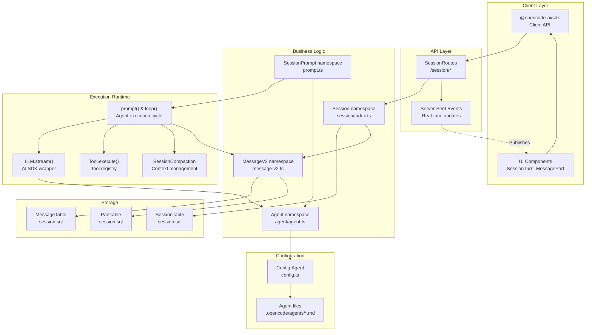

**Sources:**

- [packages/opencode/src/session/index.ts:1-700]()
- [packages/opencode/src/session/message-v2.ts:1-800]()
- [packages/opencode/src/session/prompt.ts:1-600]()
- [packages/opencode/src/server/routes/session.ts:1-300]()

---

## Session Lifecycle

### Session Structure

A session represents a conversation thread. Each session belongs to a project and workspace, contains ordered messages, and tracks metadata like title, permissions, and git summaries.

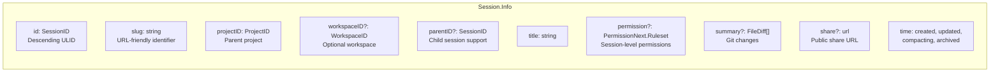

**Key Fields:**

| Field             | Type                                    | Description                                        |
| ----------------- | --------------------------------------- | -------------------------------------------------- |
| `id`              | `SessionID`                             | Descending ULID for reverse-chronological ordering |
| `slug`            | `string`                                | Human-readable URL identifier (e.g., for shares)   |
| `projectID`       | `ProjectID`                             | Links session to a project                         |
| `workspaceID`     | `WorkspaceID?`                          | Optional workspace isolation                       |
| `parentID`        | `SessionID?`                            | Parent session for child/subtask sessions          |
| `title`           | `string`                                | User-visible name (auto-generated or custom)       |
| `permission`      | `PermissionNext.Ruleset?`               | Session-specific permission overrides              |
| `summary`         | `{additions, deletions, files, diffs}?` | Git diff summary                                   |
| `share`           | `{url}?`                                | Public share information                           |
| `time.created`    | `number`                                | Unix timestamp (ms)                                |
| `time.updated`    | `number`                                | Last modification timestamp                        |
| `time.compacting` | `number?`                               | Timestamp of last compaction                       |
| `time.archived`   | `number?`                               | Archive timestamp (null = active)                  |

**Sources:**

- [packages/opencode/src/session/index.ts:122-164]()
- [packages/opencode/src/session/session.sql:1-50]()

### Session Operations

The `Session` namespace exposes CRUD operations and lifecycle management functions:

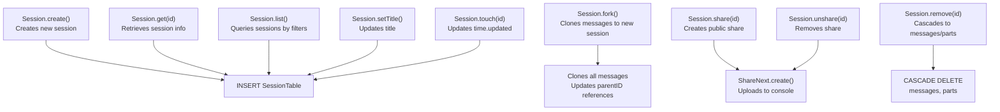

**Common Functions:**

| Function   | Input                                                 | Output           | Description                    |
| ---------- | ----------------------------------------------------- | ---------------- | ------------------------------ |
| `create()` | `{title?, parentID?, permission?, workspaceID?}`      | `Session.Info`   | Creates a new session          |
| `fork()`   | `{sessionID, messageID?}`                             | `Session.Info`   | Clones session up to messageID |
| `get()`    | `SessionID`                                           | `Session.Info`   | Retrieves by ID                |
| `list()`   | `{directory?, workspaceID?, roots?, search?, limit?}` | `Session.Info[]` | Queries sessions               |
| `share()`  | `SessionID`                                           | `{url}`          | Creates public share link      |
| `remove()` | `SessionID`                                           | `void`           | Deletes session + children     |

**Sources:**

- [packages/opencode/src/session/index.ts:219-684]()
- [packages/sdk/openapi.json:1380-1900]()

---

## Message & Part Structure

### Message Types

Messages are ordered units within a session, alternating between `user` and `assistant` roles. Each message has a monotonically increasing ID and contains zero or more parts.

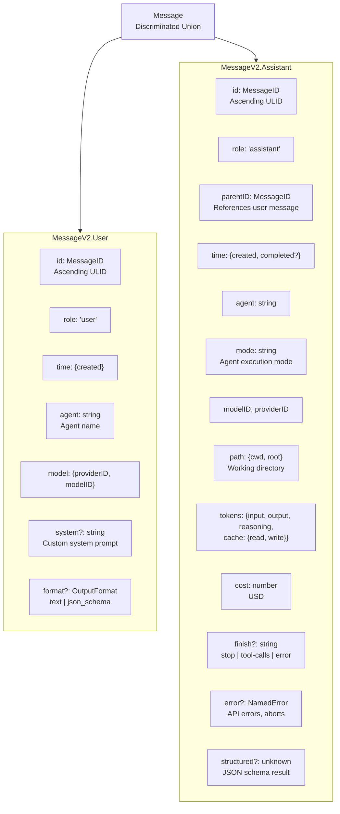

**User Message Fields:**

| Field    | Type                    | Description                       |
| -------- | ----------------------- | --------------------------------- |
| `id`     | `MessageID`             | Ascending ULID (ensures ordering) |
| `role`   | `"user"`                | Message role                      |
| `agent`  | `string`                | Agent name used for this prompt   |
| `model`  | `{providerID, modelID}` | Selected model                    |
| `format` | `OutputFormat?`         | Structured output schema          |
| `system` | `string?`               | Custom system prompt override     |

**Assistant Message Fields:**

| Field        | Type          | Description                                                 |
| ------------ | ------------- | ----------------------------------------------------------- |
| `parentID`   | `MessageID`   | Links to user message                                       |
| `mode`       | `string`      | Agent execution mode (e.g., "build", "compaction")          |
| `agent`      | `string`      | Agent name                                                  |
| `tokens`     | `object`      | Token usage breakdown                                       |
| `cost`       | `number`      | Cost in USD                                                 |
| `finish`     | `string?`     | Completion reason ("stop", "tool-calls", "length", "error") |
| `error`      | `NamedError?` | Error details if finish === "error"                         |
| `structured` | `unknown?`    | Parsed JSON schema output                                   |

**Sources:**

- [packages/opencode/src/session/message-v2.ts:20-360]()
- [packages/sdk/js/src/v2/gen/types.gen.ts:233-359]()

### Part Types

Parts are granular content units attached to messages. Each part has a unique ID and type-specific payload.

```mermaid
graph TB
    Part["Part<br/>Discriminated Union by type"]

    TextPart["TextPart<br/>type: 'text'<br/>text: string<br/>synthetic?: boolean"]
    ReasoningPart["ReasoningPart<br/>type: 'reasoning'<br/>text: string"]
    FilePart["FilePart<br/>type: 'file'<br/>url: string<br/>mime: string<br/>source?: FilePartSource"]
    ToolPart["ToolPart<br/>type: 'tool'<br/>callID: string<br/>tool: string<br/>state: ToolState"]
    AgentPart["AgentPart<br/>type: 'agent'<br/>name: string<br/>source?: {value, start, end}"]
    SubtaskPart["SubtaskPart<br/>type: 'subtask'<br/>prompt: string<br/>agent: string"]
    CompactionPart["CompactionPart<br/>type: 'compaction'<br/>auto: boolean"]
    StepParts["StepStartPart<br/>StepFinishPart<br/>Step boundaries"]
    SnapshotPart["SnapshotPart<br/>type: 'snapshot'<br/>snapshot: string"]
    PatchPart["PatchPart<br/>type: 'patch'<br/>hash: string<br/>files: string[]"]
    RetryPart["RetryPart<br/>type: 'retry'<br/>attempt: number<br/>error: APIError"]

    Part --> TextPart
    Part --> ReasoningPart
    Part --> FilePart
    Part --> ToolPart
    Part --> AgentPart
    Part --> SubtaskPart
    Part --> CompactionPart
    Part --> StepParts
    Part --> SnapshotPart
    Part --> PatchPart
    Part --> RetryPart
```

**Common Part Types:**

| Type         | Key Fields                                       | Purpose                                               |
| ------------ | ------------------------------------------------ | ----------------------------------------------------- |
| `text`       | `text: string`                                   | User input or assistant text output                   |
| `reasoning`  | `text: string, time: {start, end}`               | Extended thinking (e.g., o1, Claude thinking)         |
| `file`       | `url: string, mime: string, source?`             | File attachments (images, PDFs, code files)           |
| `tool`       | `callID: string, tool: string, state: ToolState` | Tool invocation (pending → running → completed/error) |
| `agent`      | `name: string, source?`                          | Reference to agent invocation (e.g., `@build`)        |
| `subtask`    | `prompt: string, agent: string`                  | Pending subtask for parallel execution                |
| `compaction` | `auto: boolean`                                  | Marker for compaction operation                       |
| `snapshot`   | `snapshot: string`                               | Git snapshot hash for revert                          |
| `patch`      | `hash: string, files: string[]`                  | Git patch metadata                                    |

**Tool State Transitions:**

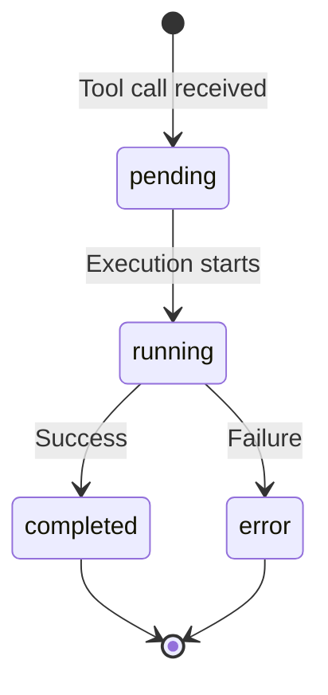

**ToolState Schema:**

| State       | Fields                                                           | Description          |
| ----------- | ---------------------------------------------------------------- | -------------------- |
| `pending`   | `input, raw`                                                     | Queued for execution |
| `running`   | `input, title?, metadata?, time.start`                           | Currently executing  |
| `completed` | `input, output, title, metadata, time.{start,end}, attachments?` | Successful execution |
| `error`     | `input, error, metadata?, time.{start,end}`                      | Failed execution     |

**Sources:**

- [packages/opencode/src/session/message-v2.ts:81-500]()
- [packages/sdk/js/src/v2/gen/types.gen.ts:378-600]()

### Message & Part Operations

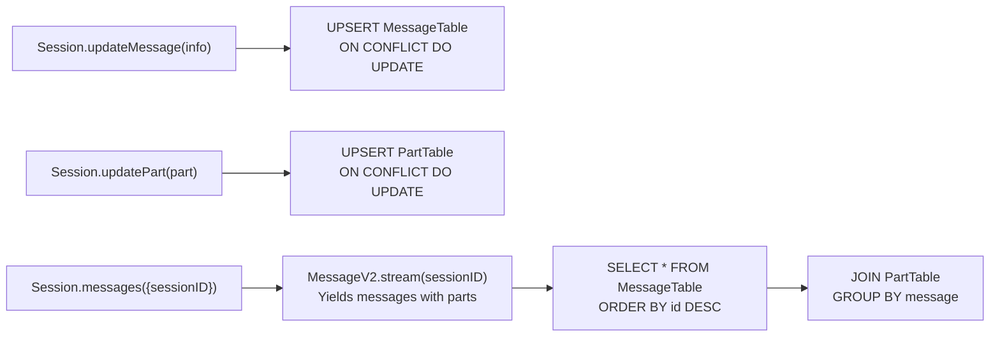

**Sources:**

- [packages/opencode/src/session/index.ts:686-750]()
- [packages/opencode/src/session/message-v2.ts:690-850]()

---

## Agent Configuration

Agents define AI behavior: which model to use, custom prompts, permissions, and execution mode. Agents are loaded from configuration files and merged with inline config.

### Agent Schema

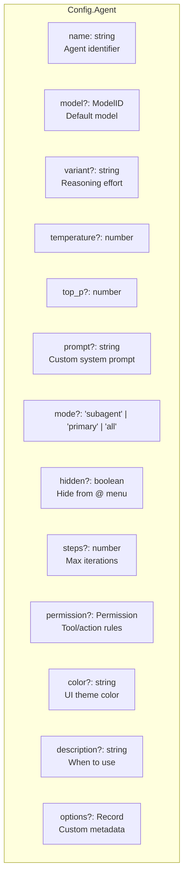

**Key Agent Properties:**

| Field         | Type                                | Description                             |
| ------------- | ----------------------------------- | --------------------------------------- |
| `model`       | `ModelID?`                          | Model to use (overrides user selection) |
| `variant`     | `string?`                           | Reasoning variant (e.g., "high", "max") |
| `temperature` | `number?`                           | Model temperature                       |
| `prompt`      | `string?`                           | System prompt template                  |
| `mode`        | `"subagent" \| "primary" \| "all"?` | Execution mode filter                   |
| `hidden`      | `boolean?`                          | Hide from autocomplete                  |
| `steps`       | `number?`                           | Max agentic iterations                  |
| `permission`  | `Permission?`                       | Permission rules (tool allow/deny/ask)  |
| `description` | `string?`                           | Agent purpose documentation             |

**Agent Modes:**

| Mode       | Description                       | Usage                                 |
| ---------- | --------------------------------- | ------------------------------------- |
| `primary`  | Top-level agents (user-facing)    | Default mode, shown in agent selector |
| `subagent` | Specialized agents (tool-invoked) | Invoked via `@agent` or `task` tool   |
| `all`      | Dual-mode agents                  | Available in both contexts            |

**Sources:**

- [packages/opencode/src/config/config.ts:712-799]()
- [packages/opencode/src/agent/agent.ts:1-300]()

### Agent Loading

Agents are loaded from multiple sources with precedence rules:

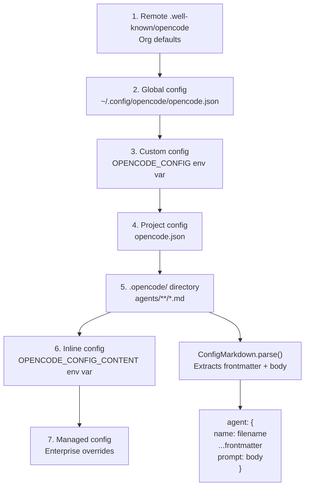

**Agent File Format** (`.opencode/agents/*.md`):

```markdown
---
model: anthropic/claude-sonnet-4-5
temperature: 0.7
mode: primary
permission:
  - { permission: edit, action: allow }
  - { permission: bash, action: ask }
---

You are a helpful coding assistant.
Always explain your reasoning.
```

**Sources:**

- [packages/opencode/src/config/config.ts:78-224]()
- [packages/opencode/src/config/config.ts:422-459]()
- [packages/opencode/src/config/markdown.ts:1-100]()

### Built-in Agents

OpenCode ships with default agents for common workflows:

| Agent        | Mode       | Purpose                            |
| ------------ | ---------- | ---------------------------------- |
| `build`      | `primary`  | Code generation and implementation |
| `plan`       | `primary`  | Task planning and decomposition    |
| `explore`    | `primary`  | Codebase exploration and analysis  |
| `fix`        | `primary`  | Bug fixing and error resolution    |
| `compaction` | `subagent` | Context summarization              |

**Sources:**

- [packages/opencode/src/agent/agent.ts:50-200]()
- [packages/opencode/prompt/agents/]()

---

## Agent Execution Loop

The agentic execution loop is the core runtime that orchestrates LLM interactions with tools. It follows a turn-based cycle: user input → assistant response → tool execution → repeat until completion.

### Prompt Entry Point

```mermaid
sequenceDiagram
    participant Client
    participant SessionPrompt
    participant Session
    participant loop

    Client->>SessionPrompt: prompt({sessionID, parts, model, agent})
    SessionPrompt->>Session: createUserMessage()
    Session-->>SessionPrompt: MessageV2.User
    SessionPrompt->>Session: touch(sessionID)
    SessionPrompt->>loop: loop({sessionID})
    loop-->>SessionPrompt: MessageV2.Assistant (final)
    SessionPrompt-->>Client: MessageV2.WithParts
```

**`SessionPrompt.prompt()` Function:**

| Parameter   | Type                     | Description                           |
| ----------- | ------------------------ | ------------------------------------- |
| `sessionID` | `SessionID`              | Target session                        |
| `parts`     | `PartInput[]`            | User input (text, files, agents)      |
| `model`     | `{providerID, modelID}?` | Model override                        |
| `agent`     | `string?`                | Agent override                        |
| `format`    | `OutputFormat?`          | Structured output schema              |
| `noReply`   | `boolean?`               | Skip agent loop (just create message) |

**Sources:**

- [packages/opencode/src/session/prompt.ts:161-188]()
- [packages/opencode/src/session/prompt.ts:94-160]()

### Agent Loop

The `loop()` function executes iteratively until the assistant produces a non-tool-calling finish reason.

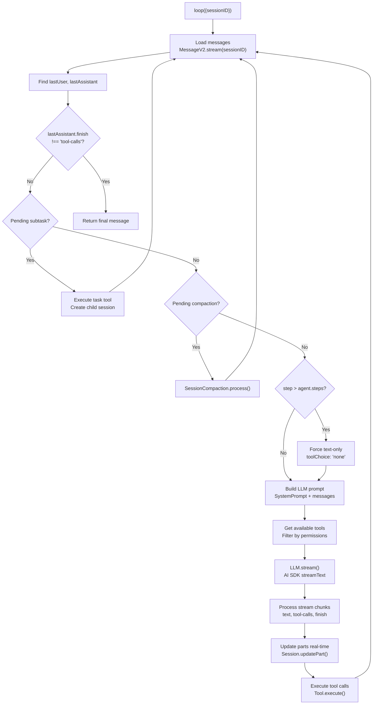

**Loop State Variables:**

| Variable           | Type                                | Purpose                        |
| ------------------ | ----------------------------------- | ------------------------------ |
| `step`             | `number`                            | Iteration counter              |
| `lastUser`         | `MessageV2.User`                    | Most recent user message       |
| `lastAssistant`    | `MessageV2.Assistant?`              | Most recent assistant message  |
| `lastFinished`     | `MessageV2.Assistant?`              | Most recent finished assistant |
| `tasks`            | `(CompactionPart \| SubtaskPart)[]` | Pending operations             |
| `structuredOutput` | `unknown?`                          | Structured output result       |

**Sources:**

- [packages/opencode/src/session/prompt.ts:273-690]()
- [packages/opencode/src/session/prompt.ts:544-850]()

### LLM Integration

The `LLM.stream()` function wraps the AI SDK's `streamText()` with OpenCode-specific transformations.

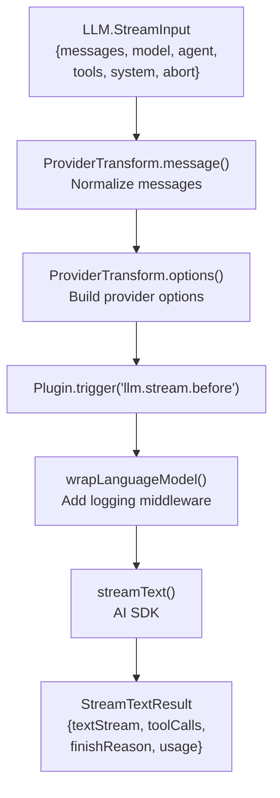

**Key Transformations:**

| Transform                         | Purpose                                                     |
| --------------------------------- | ----------------------------------------------------------- |
| `ProviderTransform.message()`     | Normalize message formats per provider                      |
| `ProviderTransform.options()`     | Apply provider-specific options (caching, reasoning effort) |
| `ProviderTransform.temperature()` | Set default temperature per model                           |
| `ProviderTransform.variants()`    | Map variant to provider options                             |

**Sources:**

- [packages/opencode/src/session/llm.ts:47-200]()
- [packages/opencode/src/provider/transform.ts:251-290]()

### Tool Execution During Loop

When the LLM generates tool calls, the loop executes them and appends results before continuing:

```mermaid
sequenceDiagram
    participant Loop
    participant LLM
    participant ToolRegistry
    participant Tool
    participant Session

    Loop->>LLM: stream({messages, tools})
    LLM-->>Loop: toolCalls: [{id, tool, args}]

    loop For each toolCall
        Loop->>Session: updatePart({type: 'tool', state: 'pending'})
        Loop->>ToolRegistry: get(toolName)
        ToolRegistry-->>Loop: Tool instance

        Loop->>Tool: execute(args, context)
        Tool-->>Loop: {output, attachments?}

        Loop->>Session: updatePart({state: 'completed', output})
    end

    Loop->>Loop: Continue to next iteration
```

**Tool Context:**

| Field        | Type                       | Description               |
| ------------ | -------------------------- | ------------------------- |
| `sessionID`  | `SessionID`                | Current session           |
| `messageID`  | `MessageID`                | Current assistant message |
| `callID`     | `string`                   | Tool call ID              |
| `agent`      | `string`                   | Active agent name         |
| `abort`      | `AbortSignal`              | Cancellation signal       |
| `messages`   | `MessageV2.WithParts[]`    | Full message history      |
| `metadata()` | `(input) => Promise<void>` | Update tool part metadata |
| `ask()`      | `(req) => Promise<void>`   | Request permission        |

**Sources:**

- [packages/opencode/src/session/prompt.ts:700-950]()
- [packages/opencode/src/tool/tool.ts:1-200]()

---

## Context Management & Compaction

As conversations grow, token limits are approached. The compaction system summarizes history to free context space.

### Overflow Detection

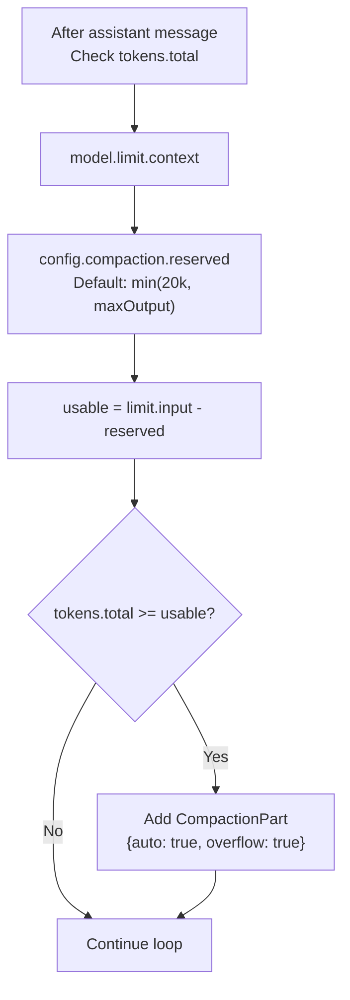

**Overflow Threshold Calculation:**

```
usable_tokens = model.limit.input - reserved
reserved = min(COMPACTION_BUFFER, max_output_tokens)
COMPACTION_BUFFER = 20_000
```

**Sources:**

- [packages/opencode/src/session/compaction.ts:33-49]()
- [packages/opencode/src/session/prompt.ts:855-890]()

### Compaction Process

When a `CompactionPart` is encountered, the loop invokes `SessionCompaction.process()`:

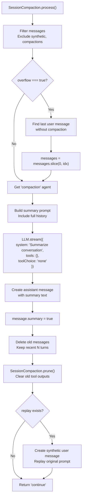

**Compaction Agent Behavior:**

- No tools available (`toolChoice: "none"`)
- System prompt instructs to summarize conversation
- Result is a single text message with `summary: true` flag
- Old messages are deleted from database

**Pruning:**

Pruning removes verbose tool outputs while keeping recent context:

```
PRUNE_MINIMUM = 20_000  // Min tokens to prune
PRUNE_PROTECT = 40_000  // Keep recent 40k tokens of tools
```

**Sources:**

- [packages/opencode/src/session/compaction.ts:102-200]()
- [packages/opencode/src/session/compaction.ts:52-100]()

---

## Permission System Integration

Agents respect permission rules defined at the session, agent, or config level. The loop checks permissions before tool execution.

### Permission Evaluation

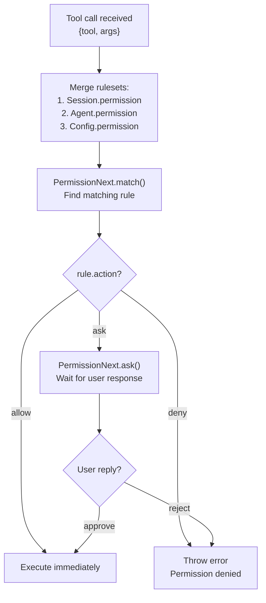

**Permission Rule Structure:**

```typescript
{
  permission: string,     // e.g., "edit", "bash", "read"
  action: "allow" | "deny" | "ask",
  pattern: string | string[],  // Glob patterns
}
```

**Permission Precedence:**

1. Session-level rules (highest)
2. Agent-level rules
3. Global config rules (lowest)

**Sources:**

- [packages/opencode/src/permission/next.ts:1-400]()
- [packages/opencode/src/session/prompt.ts:800-850]()

---

## Event-Driven Updates

All session, message, and part operations publish events to the global event bus, enabling real-time UI updates via Server-Sent Events (SSE).

### Event Types

| Event                  | Payload                         | Trigger                          |
| ---------------------- | ------------------------------- | -------------------------------- |
| `session.created`      | `{info: Session.Info}`          | New session created              |
| `session.updated`      | `{info: Session.Info}`          | Session metadata changed         |
| `session.deleted`      | `{info: Session.Info}`          | Session removed                  |
| `message.updated`      | `{info: Message}`               | Message created/updated          |
| `message.part.updated` | `{part: Part, delta?: string}`  | Part created/updated (streaming) |
| `session.diff`         | `{sessionID, diff: FileDiff[]}` | Git diff calculated              |

**Event Flow:**

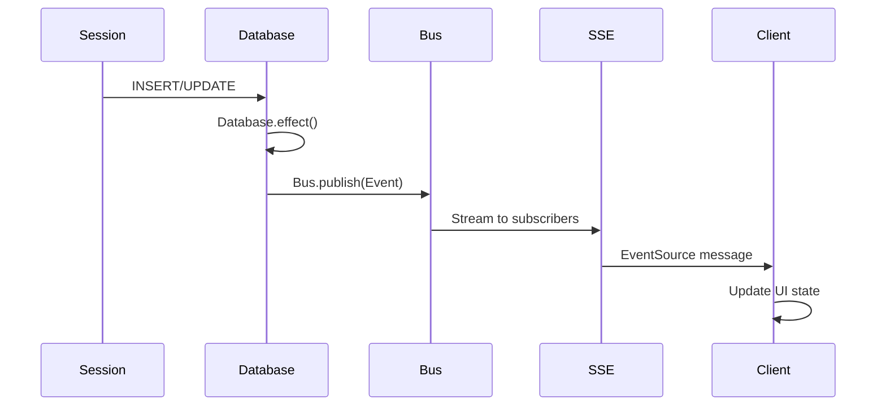

**Sources:**

- [packages/opencode/src/session/index.ts:184-217]()
- [packages/opencode/src/bus/index.ts:1-100]()
- [packages/opencode/src/server/routes/session.ts:1-50]()

---

## Database Schema

Sessions, messages, and parts are stored in SQLite with cascading deletes.

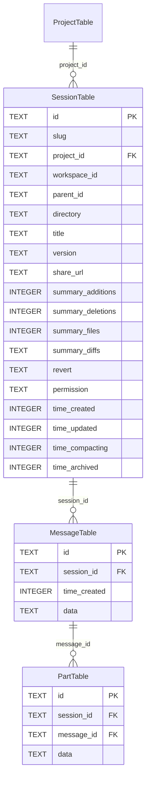

**Indexes:**

- `SessionTable`: `(project_id, time_updated DESC)`, `(directory)`, `(parent_id)`
- `MessageTable`: `(session_id, id DESC)`
- `PartTable`: `(session_id, message_id, id DESC)`

**Sources:**

- [packages/opencode/src/session/session.sql:1-100]()
- [packages/opencode/src/storage/db.ts:1-200]()

---

## Code Entity Reference

### Key Namespaces & Functions

| Entity                        | Location                                                | Purpose                    |
| ----------------------------- | ------------------------------------------------------- | -------------------------- |
| `Session`                     | [packages/opencode/src/session/index.ts:36]()           | Session CRUD operations    |
| `Session.create()`            | [packages/opencode/src/session/index.ts:219-237]()      | Create new session         |
| `Session.createNext()`        | [packages/opencode/src/session/index.ts:297-338]()      | Internal session creation  |
| `Session.fork()`              | [packages/opencode/src/session/index.ts:239-280]()      | Clone session              |
| `Session.messages()`          | [packages/opencode/src/session/index.ts:524-538]()      | Get messages with parts    |
| `MessageV2`                   | [packages/opencode/src/session/message-v2.ts:20]()      | Message & part operations  |
| `MessageV2.stream()`          | [packages/opencode/src/session/message-v2.ts:850-950]() | Stream messages from DB    |
| `SessionPrompt.prompt()`      | [packages/opencode/src/session/prompt.ts:161-188]()     | Entry point for user input |
| `SessionPrompt.loop()`        | [packages/opencode/src/session/prompt.ts:277-690]()     | Agentic execution loop     |
| `LLM.stream()`                | [packages/opencode/src/session/llm.ts:47-200]()         | LLM integration wrapper    |
| `SessionCompaction.process()` | [packages/opencode/src/session/compaction.ts:102-200]() | Context summarization      |
| `Agent.get()`                 | [packages/opencode/src/agent/agent.ts:50-100]()         | Retrieve agent config      |
| `Config.Agent`                | [packages/opencode/src/config/config.ts:712-799]()      | Agent schema               |

### Database Tables

| Table          | File                                                | Purpose                        |
| -------------- | --------------------------------------------------- | ------------------------------ |
| `SessionTable` | [packages/opencode/src/session/session.sql:1-30]()  | Session metadata               |
| `MessageTable` | [packages/opencode/src/session/session.sql:40-60]() | Messages (role, time, data)    |
| `PartTable`    | [packages/opencode/src/session/session.sql:70-90]() | Parts (type-specific payloads) |

### API Routes

| Route                  | File                                                       | Operations                  |
| ---------------------- | ---------------------------------------------------------- | --------------------------- |
| `/session`             | [packages/opencode/src/server/routes/session.ts:1-300]()   | List, create, fork sessions |
| `/session/:id`         | [packages/opencode/src/server/routes/session.ts:100-200]() | Get, update, delete session |
| `/session/:id/prompt`  | [packages/opencode/src/server/routes/session.ts:200-250]() | Send user message           |
| `/session/:id/message` | [packages/opencode/src/server/routes/session.ts:250-300]() | List messages               |

**Sources:**

- [packages/opencode/src/session/index.ts:1-700]()
- [packages/opencode/src/session/message-v2.ts:1-850]()
- [packages/opencode/src/session/prompt.ts:1-950]()
- [packages/opencode/src/session/llm.ts:1-200]()
- [packages/opencode/src/session/compaction.ts:1-200]()
- [packages/opencode/src/agent/agent.ts:1-300]()
- [packages/opencode/src/config/config.ts:712-799]()
