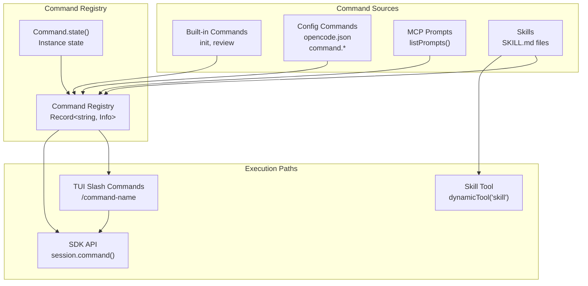
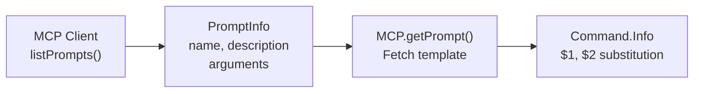
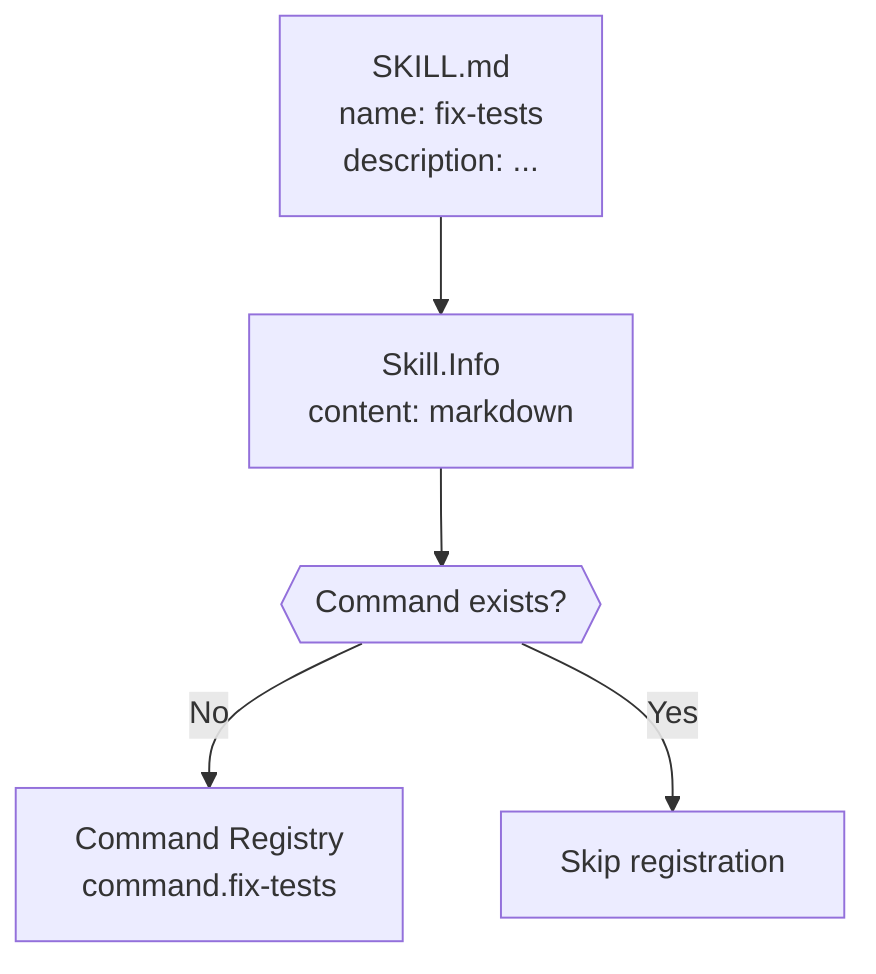
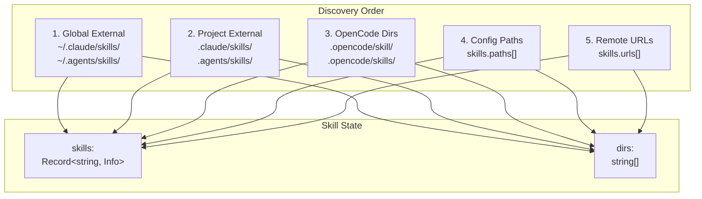
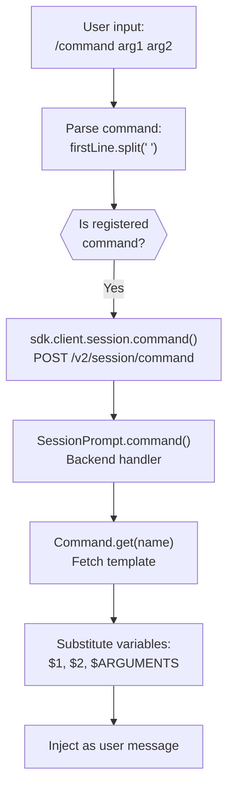

# Skills & Command System

<details>
<summary>Relevant source files</summary>

The following files were used as context for generating this wiki page:

- [packages/opencode/src/cli/bootstrap.ts](packages/opencode/src/cli/bootstrap.ts)
- [packages/opencode/src/cli/cmd/acp.ts](packages/opencode/src/cli/cmd/acp.ts)
- [packages/opencode/src/cli/cmd/run.ts](packages/opencode/src/cli/cmd/run.ts)
- [packages/opencode/src/cli/cmd/serve.ts](packages/opencode/src/cli/cmd/serve.ts)
- [packages/opencode/src/cli/cmd/tui/app.tsx](packages/opencode/src/cli/cmd/tui/app.tsx)
- [packages/opencode/src/cli/cmd/tui/attach.ts](packages/opencode/src/cli/cmd/tui/attach.ts)
- [packages/opencode/src/cli/cmd/tui/component/dialog-command.tsx](packages/opencode/src/cli/cmd/tui/component/dialog-command.tsx)
- [packages/opencode/src/cli/cmd/tui/component/prompt/autocomplete.tsx](packages/opencode/src/cli/cmd/tui/component/prompt/autocomplete.tsx)
- [packages/opencode/src/cli/cmd/tui/component/prompt/index.tsx](packages/opencode/src/cli/cmd/tui/component/prompt/index.tsx)
- [packages/opencode/src/cli/cmd/tui/context/args.tsx](packages/opencode/src/cli/cmd/tui/context/args.tsx)
- [packages/opencode/src/cli/cmd/tui/context/exit.tsx](packages/opencode/src/cli/cmd/tui/context/exit.tsx)
- [packages/opencode/src/cli/cmd/tui/context/local.tsx](packages/opencode/src/cli/cmd/tui/context/local.tsx)
- [packages/opencode/src/cli/cmd/tui/context/sdk.tsx](packages/opencode/src/cli/cmd/tui/context/sdk.tsx)
- [packages/opencode/src/cli/cmd/tui/context/sync.tsx](packages/opencode/src/cli/cmd/tui/context/sync.tsx)
- [packages/opencode/src/cli/cmd/tui/routes/session/header.tsx](packages/opencode/src/cli/cmd/tui/routes/session/header.tsx)
- [packages/opencode/src/cli/cmd/tui/routes/session/index.tsx](packages/opencode/src/cli/cmd/tui/routes/session/index.tsx)
- [packages/opencode/src/cli/cmd/tui/routes/session/sidebar.tsx](packages/opencode/src/cli/cmd/tui/routes/session/sidebar.tsx)
- [packages/opencode/src/cli/cmd/tui/thread.ts](packages/opencode/src/cli/cmd/tui/thread.ts)
- [packages/opencode/src/cli/cmd/tui/win32.ts](packages/opencode/src/cli/cmd/tui/win32.ts)
- [packages/opencode/src/cli/cmd/tui/worker.ts](packages/opencode/src/cli/cmd/tui/worker.ts)
- [packages/opencode/src/cli/cmd/web.ts](packages/opencode/src/cli/cmd/web.ts)
- [packages/opencode/src/cli/network.ts](packages/opencode/src/cli/network.ts)
- [packages/opencode/src/command/index.ts](packages/opencode/src/command/index.ts)
- [packages/opencode/src/command/template/review.txt](packages/opencode/src/command/template/review.txt)
- [packages/opencode/src/index.ts](packages/opencode/src/index.ts)
- [packages/opencode/src/server/mdns.ts](packages/opencode/src/server/mdns.ts)
- [packages/sdk/js/src/index.ts](packages/sdk/js/src/index.ts)
- [packages/sdk/js/src/v2/client.ts](packages/sdk/js/src/v2/client.ts)
- [packages/web/src/content/docs/cli.mdx](packages/web/src/content/docs/cli.mdx)
- [packages/web/src/content/docs/config.mdx](packages/web/src/content/docs/config.mdx)
- [packages/web/src/content/docs/ide.mdx](packages/web/src/content/docs/ide.mdx)
- [packages/web/src/content/docs/plugins.mdx](packages/web/src/content/docs/plugins.mdx)
- [packages/web/src/content/docs/sdk.mdx](packages/web/src/content/docs/sdk.mdx)
- [packages/web/src/content/docs/server.mdx](packages/web/src/content/docs/server.mdx)
- [packages/web/src/content/docs/tui.mdx](packages/web/src/content/docs/tui.mdx)

</details>

The Skills & Command System provides extensible prompt templates and specialized workflows for common development tasks. Commands are reusable prompt templates with variable substitution, while skills are self-contained instruction sets for domain-specific tasks. Both are invoked via `/command-name` syntax in the TUI and can be configured, shared, and extended.

For information about MCP server integration, see [MCP Integration](#2.10). For tool execution and permissions, see [Tool System & Permissions](#2.5).

## System Overview

The command and skill systems serve different but complementary purposes:

**Commands** are prompt templates with variable substitution (`$ARGUMENTS`, `$1`, `$2`, etc.) that provide reusable workflows. They can originate from built-in definitions, configuration files, MCP server prompts, or skills. Commands may specify agent/model preferences and support subtask execution.

**Skills** are domain-specific instruction sets stored as markdown files with YAML frontmatter. They provide detailed workflows, access to bundled resources (scripts, references), and can be loaded dynamically via the `skill` tool or invoked directly as commands. Skills follow conventions from Claude Code and other AI agents (`.claude/skills/`, `.agents/skills/`).



**Diagram: Command System Architecture**

Sources: [packages/opencode/src/command/index.ts:59-141](), [packages/opencode/src/skill/skill.ts:125-138](), [packages/opencode/src/mcp/index.ts:249-292]()

## Command System

### Command Structure

Commands are defined by the `Command.Info` type, which specifies metadata, execution parameters, and template content:

| Field         | Type                            | Description                                      |
| ------------- | ------------------------------- | ------------------------------------------------ |
| `name`        | `string`                        | Command identifier (used in `/command-name`)     |
| `description` | `string?`                       | Human-readable description shown in autocomplete |
| `agent`       | `string?`                       | Preferred agent for execution                    |
| `model`       | `string?`                       | Preferred model (format: `provider/model`)       |
| `source`      | `"command" \| "mcp" \| "skill"` | Origin of the command                            |
| `template`    | `Promise<string> \| string`     | Prompt template with variable substitution       |
| `subtask`     | `boolean?`                      | Whether command creates a subtask session        |
| `hints`       | `string[]`                      | Template variables extracted from template       |

The `template` field supports variable substitution:

- `$ARGUMENTS` - All text after command name
- `$1`, `$2`, `$n` - Positional arguments (space-separated)

Sources: [packages/opencode/src/command/index.ts:24-42]()

### Command Sources

#### Built-in Commands

Two commands are always available:

**`/init`** - Creates or updates `AGENTS.md` file with project context

```
Template: packages/opencode/src/command/template/initialize.txt
Purpose: Initialize project with agent instructions
```

**`/review`** - Reviews code changes (uncommitted, commit, branch, or PR)

```
Template: packages/opencode/src/command/template/review.txt
Arguments: [commit-hash | branch | pr-url | empty for uncommitted]
Subtask: true (creates child session)
```

Sources: [packages/opencode/src/command/index.ts:54-82]()

#### Configuration Commands

Commands can be defined in `opencode.json`:

```json
{
  "command": {
    "fix-types": {
      "description": "Fix TypeScript type errors",
      "agent": "build",
      "model": "anthropic/claude-3-5-sonnet-20241022",
      "template": "Fix all TypeScript errors in $ARGUMENTS",
      "subtask": false
    }
  }
}
```

Sources: [packages/opencode/src/command/index.ts:84-97]()

#### MCP Prompts as Commands

MCP servers can expose prompts via `listPrompts()`. These are automatically registered as commands with sanitized names (`clientName:promptName`):



**Diagram: MCP Prompt to Command Conversion**

MCP prompt arguments are mapped to positional variables (`$1`, `$2`, etc.) in the command template. The actual prompt content is fetched lazily when the command is executed.

Sources: [packages/opencode/src/command/index.ts:98-123](), [packages/opencode/src/mcp/index.ts:249-270]()

#### Skills as Commands

Skills discovered from `SKILL.md` files are automatically registered as commands. If a skill has the same name as an existing command, the command takes precedence:



**Diagram: Skill to Command Registration**

Sources: [packages/opencode/src/command/index.ts:125-138]()

### Command Registry

The command registry is managed via `Command.state()`, which uses `Instance.state()` for lifecycle management:

```typescript
// Initialize state
const state = Instance.state(async () => {
  const result: Record<string, Info> = {}
  // Add built-in commands
  // Add config commands
  // Add MCP prompts
  // Add skills as commands
  return result
})

// Access commands
const command = await Command.get('review')
const allCommands = await Command.list()
```

The registry is rebuilt when the instance is reloaded (e.g., on configuration change).

Sources: [packages/opencode/src/command/index.ts:59-141]()

### Template Variable Extraction

The `Command.hints()` function extracts variable placeholders from templates:

```typescript
function hints(template: string): string[] {
  const result: string[] = []
  const numbered = template.match(/\$\d+/g)
  if (numbered) {
    for (const match of [...new Set(numbered)].sort()) {
      result.push(match)
    }
  }
  if (template.includes('$ARGUMENTS')) {
    result.push('$ARGUMENTS')
  }
  return result
}
```

These hints are used in autocomplete to show users which variables the command expects.

Sources: [packages/opencode/src/command/index.ts:44-52]()

## Skill System

### Skill Structure

Skills are defined in `SKILL.md` files with YAML frontmatter:

```markdown
---
name: skill-name
description: Brief description for autocomplete
---

# Skill Content

Detailed instructions, workflows, and context.

## Resources

Scripts, references, templates in this directory.
```

The `Skill.Info` type represents a parsed skill:

| Field         | Type     | Description                            |
| ------------- | -------- | -------------------------------------- |
| `name`        | `string` | Skill identifier                       |
| `description` | `string` | Short description                      |
| `location`    | `string` | Absolute path to SKILL.md              |
| `content`     | `string` | Markdown content (without frontmatter) |

Sources: [packages/opencode/src/skill/skill.ts:18-25]()

### Skill Discovery

Skills are discovered from multiple locations in a specific precedence order:



**Diagram: Skill Discovery Locations**

#### External Skill Directories

Skills are discovered from `.claude/skills/` and `.agents/skills/` directories:

1. **Global** - Home directory (`~/.claude/skills/**/SKILL.md`)
2. **Project** - Search upward from working directory to worktree root

Global skills are loaded first, then project-level skills (allowing project overrides).

Pattern: `skills/**/SKILL.md` within external directories

Sources: [packages/opencode/src/skill/skill.ts:47-120]()

#### OpenCode Skill Directories

Skills in `.opencode/skill/` or `.opencode/skills/` directories from all configuration layers:

```
.opencode/skill/test-skill/SKILL.md
.opencode/skills/another-skill/SKILL.md
```

Pattern: `{skill,skills}/**/SKILL.md`

Sources: [packages/opencode/src/skill/skill.ts:122-133]()

#### Configuration Paths

Additional skill locations via `skills.paths` in configuration:

```json
{
  "skills": {
    "paths": ["~/my-custom-skills", "./project-skills"]
  }
}
```

Relative paths are resolved from the instance directory. Tilde (`~`) expands to home directory.

Sources: [packages/opencode/src/skill/skill.ts:135-152]()

#### Remote URL Discovery

Skills can be downloaded from remote URLs via `skills.urls`:

```json
{
  "skills": {
    "urls": ["https://example.com/skills/manifest.json"]
  }
}
```

The `Discovery.pull()` function downloads and caches skills, returning local directory paths for scanning.

Sources: [packages/opencode/src/skill/skill.ts:155-170]()

### Skill Loading Mechanisms

Skills can be invoked in two ways:

#### 1. Direct Command Invocation

When a skill is registered as a command, typing `/skill-name` expands the skill content as a prompt:

```
User: /fix-types src/components
System: Expands skill template with $ARGUMENTS = "src/components"
```

#### 2. Skill Tool (Dynamic Loading)

The `skill` tool allows the AI to discover and load skills on-demand:

```typescript
// Tool definition
const SkillTool = Tool.define('skill', async (ctx) => {
  const skills = await Skill.all()

  // Filter by agent permissions
  const accessibleSkills = agent
    ? skills.filter(
        (skill) =>
          PermissionNext.evaluate('skill', skill.name, agent.permission)
            .action !== 'deny'
      )
    : skills

  // Build description with available skills
  const description = [
    'Load a specialized skill...',
    '<available_skills>',
    ...accessibleSkills.map(
      (skill) =>
        `  <skill>
         <name>${skill.name}</name>
         <description>${skill.description}</description>
       </skill>`
    ),
    '</available_skills>',
  ].join(
    '\
'
  )

  return {
    description,
    parameters: z.object({
      name: z.string().describe('Skill name from available_skills'),
    }),
    async execute(params, ctx) {
      const skill = await Skill.get(params.name)

      // Prompt for permission
      await ctx.ask({
        permission: 'skill',
        patterns: [params.name],
        always: [params.name],
      })

      // Load skill content and bundled files
      const dir = path.dirname(skill.location)
      const files = await Ripgrep.files({ cwd: dir })

      return {
        title: `Loaded skill: ${skill.name}`,
        output: [
          `<skill_content name="${skill.name}">`,
          skill.content.trim(),
          `Base directory: ${pathToFileURL(dir).href}`,
          '<skill_files>',
          files
            .map((f) => `<file>${f}</file>`)
            .join(
              '\
'
            ),
          '</skill_files>',
          '</skill_content>',
        ].join(
          '\
'
        ),
      }
    },
  }
})
```

The tool output includes:

- Skill markdown content
- Base directory URL for relative paths
- List of bundled files (sampled, up to 10)

Sources: [packages/opencode/src/tool/skill.ts:10-123]()

### Duplicate Handling

When multiple skills share the same name, the last discovered skill wins. A warning is logged:

```
[skill] duplicate skill name: name=my-skill
  existing=/home/user/.claude/skills/my-skill/SKILL.md
  duplicate=/home/user/project/.opencode/skill/my-skill/SKILL.md
```

Project-level skills can intentionally override global skills.

Sources: [packages/opencode/src/skill/skill.ts:71-78]()

## TUI Integration

### Autocomplete

The TUI autocomplete system displays available commands when typing `/`:

```mermaid
graph TB
    SLASH["User types '/'<br/>at prompt start"]
    SHOW_AC["Autocomplete.show()<br/>visible='/'""]
    BUILD_OPTS["Build options:<br/>1. command.slashes()<br/>2. sync.data.command"]
    FILTER["fuzzysort.go()<br/>Filter by query"]
    DISPLAY["Display matches<br/>name + description"]

    SLASH --> SHOW_AC
    SHOW_AC --> BUILD_OPTS
    BUILD_OPTS --> FILTER
    FILTER --> DISPLAY
```

**Diagram: Command Autocomplete Flow**

Command sources for autocomplete:

1. **TUI Command Registry** - `command.slashes()` returns slash commands from `CommandProvider`
2. **Server Commands** - `sync.data.command` includes MCP prompts and skills

MCP commands are labeled with `:mcp` suffix, skills have `source: "skill"`.

Sources: [packages/opencode/src/cli/cmd/tui/component/prompt/autocomplete.tsx:356-383]()

### Command Execution

When a command is selected/submitted:



**Diagram: Command Execution Pipeline**

The prompt component parses multi-line input, preserving content after the first line:

```typescript
// Parse command from first line
const firstLineEnd =
  inputText.indexOf(
    '\
'
  )
const firstLine =
  firstLineEnd === -1 ? inputText : inputText.slice(0, firstLineEnd)
const [command, ...firstLineArgs] = firstLine.split(' ')
const restOfInput = firstLineEnd === -1 ? '' : inputText.slice(firstLineEnd + 1)
const args =
  firstLineArgs.join(' ') +
  (restOfInput
    ? '\
' + restOfInput
    : '')

sdk.client.session.command({
  sessionID,
  command: command.slice(1), // Remove leading '/'
  arguments: args,
  agent: local.agent.current().name,
  model: `${selectedModel.providerID}/${selectedModel.modelID}`,
  messageID,
  variant,
  parts: fileParts,
})
```

Sources: [packages/opencode/src/cli/cmd/tui/component/prompt/index.tsx:585-614]()

### Skill Invocation UI

The `/skills` command shows a dialog listing all available skills:

```typescript
command.register(() => [
  {
    title: "Skills",
    value: "prompt.skills",
    category: "Prompt",
    slash: {
      name: "skills"
    },
    onSelect: () => {
      dialog.replace(() => (
        <DialogSkill
          onSelect={(skill) => {
            input.setText(`/${skill} `)
            setStore("prompt", {
              input: `/${skill} `,
              parts: []
            })
            input.gotoBufferEnd()
          }}
        />
      ))
    }
  }
])
```

The dialog allows browsing and selecting skills, which are then inserted into the prompt as commands.

Sources: [packages/opencode/src/cli/cmd/tui/component/prompt/index.tsx:332-353]()

## Configuration Reference

### Command Configuration

```json
{
  "command": {
    "command-name": {
      "description": "Human-readable description",
      "agent": "build",
      "model": "anthropic/claude-3-5-sonnet-20241022",
      "template": "Prompt template with $ARGUMENTS and $1 $2",
      "subtask": true
    }
  }
}
```

| Field         | Type      | Required | Description                           |
| ------------- | --------- | -------- | ------------------------------------- |
| `description` | `string`  | No       | Shown in autocomplete                 |
| `agent`       | `string`  | No       | Default agent for this command        |
| `model`       | `string`  | No       | Default model (provider/model format) |
| `template`    | `string`  | Yes      | Prompt template with variables        |
| `subtask`     | `boolean` | No       | Create child session (default: false) |

Sources: [packages/opencode/src/command/index.ts:84-97]()

### Skill Configuration

```json
{
  "skills": {
    "paths": ["~/global-skills", "./local-skills", "/absolute/path/to/skills"],
    "urls": ["https://example.com/skills/manifest.json"]
  }
}
```

| Field   | Type       | Description                                       |
| ------- | ---------- | ------------------------------------------------- |
| `paths` | `string[]` | Additional directories to scan for SKILL.md files |
| `urls`  | `string[]` | Remote skill repositories (downloaded and cached) |

Path resolution:

- Paths starting with `~/` expand to home directory
- Relative paths resolve from instance directory
- Absolute paths used as-is

Sources: [packages/opencode/src/skill/skill.ts:135-170]()

### Disabling External Skills

External skill discovery (`.claude/`, `.agents/`) can be disabled via environment variable:

```bash
OPENCODE_DISABLE_EXTERNAL_SKILLS=1 opencode
```

This only affects external directories; `.opencode/skill/` and configured paths are still scanned.

Sources: [packages/opencode/src/skill/skill.ts:106-120]()

## Permission System Integration

Skills loaded via the `skill` tool trigger permission prompts:

```typescript
await ctx.ask({
  permission: 'skill',
  patterns: [params.name],
  always: [params.name],
  metadata: {},
})
```

Agents can have skill permissions configured:

```json
{
  "agent": {
    "custom-agent": {
      "permission": {
        "skill": {
          "patterns": ["allowed-skill"],
          "action": "allow"
        }
      }
    }
  }
}
```

Skills not matching permission patterns require user approval before loading.

Sources: [packages/opencode/src/tool/skill.ts:69-74](), [packages/opencode/src/skill/skill.ts:14-20]()

## State Management

Both systems use `Instance.state()` for lifecycle management:

```typescript
// Command state
const commandState = Instance.state(async () => {
  // Build registry
  return Record<string, Command.Info>
})

// Skill state
const skillState = Instance.state(async () => {
  return {
    skills: Record<string, Skill.Info>,
    dirs: string[]
  }
})
```

State is rebuilt when:

- Instance is reloaded
- Configuration changes
- MCP server connections change (commands only)

Access patterns:

```typescript
// Commands
const command = await Command.get('review')
const allCommands = await Command.list()

// Skills
const skill = await Skill.get('test-skill')
const allSkills = await Skill.all()
const skillDirs = await Skill.dirs()
```

Sources: [packages/opencode/src/command/index.ts:59-150](), [packages/opencode/src/skill/skill.ts:52-189]()
