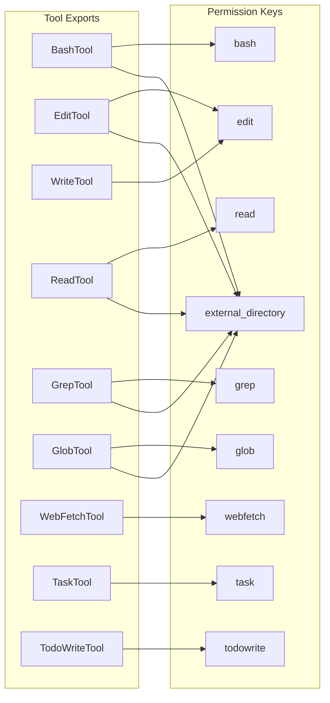
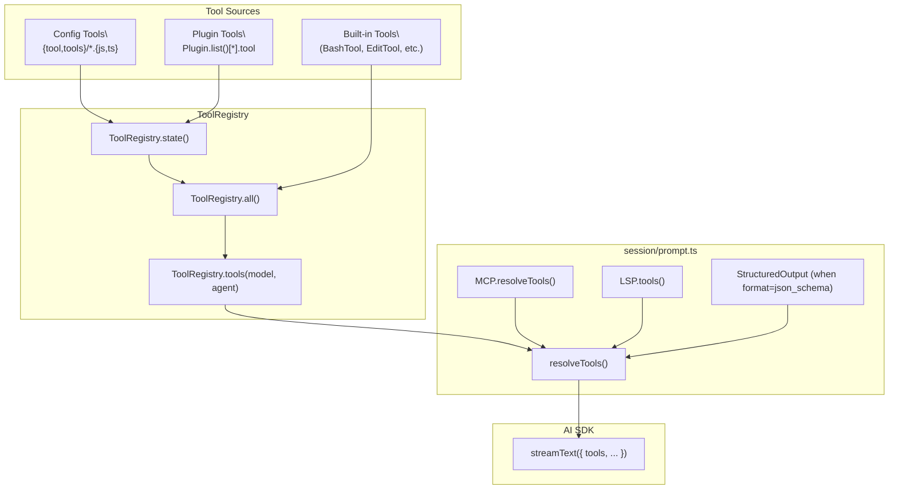
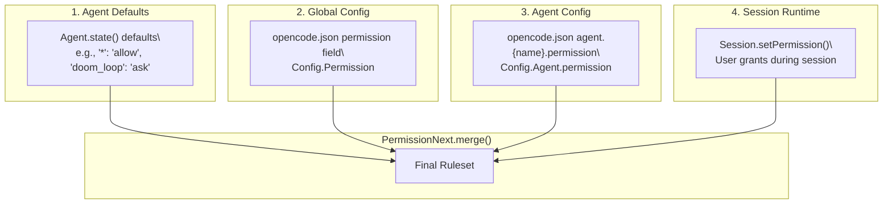
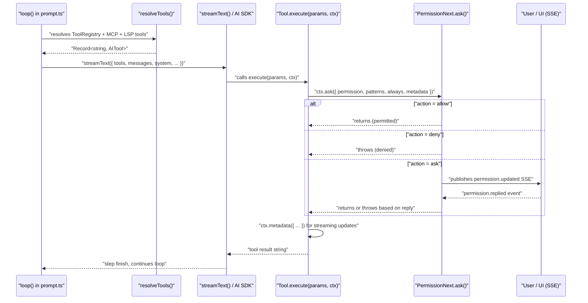

# Tool System

<details>
<summary>Relevant source files</summary>

The following files were used as context for generating this wiki page:

- [packages/opencode/src/agent/agent.ts](packages/opencode/src/agent/agent.ts)
- [packages/opencode/src/file/index.ts](packages/opencode/src/file/index.ts)
- [packages/opencode/src/file/ripgrep.ts](packages/opencode/src/file/ripgrep.ts)
- [packages/opencode/src/file/time.ts](packages/opencode/src/file/time.ts)
- [packages/opencode/src/tool/bash.ts](packages/opencode/src/tool/bash.ts)
- [packages/opencode/src/tool/edit.ts](packages/opencode/src/tool/edit.ts)
- [packages/opencode/src/tool/glob.ts](packages/opencode/src/tool/glob.ts)
- [packages/opencode/src/tool/grep.ts](packages/opencode/src/tool/grep.ts)
- [packages/opencode/src/tool/ls.ts](packages/opencode/src/tool/ls.ts)
- [packages/opencode/src/tool/read.ts](packages/opencode/src/tool/read.ts)
- [packages/opencode/src/tool/registry.ts](packages/opencode/src/tool/registry.ts)
- [packages/opencode/src/tool/todo.ts](packages/opencode/src/tool/todo.ts)
- [packages/opencode/src/tool/tool.ts](packages/opencode/src/tool/tool.ts)
- [packages/opencode/src/tool/webfetch.ts](packages/opencode/src/tool/webfetch.ts)
- [packages/opencode/src/tool/write.ts](packages/opencode/src/tool/write.ts)
- [packages/opencode/test/agent/agent.test.ts](packages/opencode/test/agent/agent.test.ts)
- [packages/opencode/test/file/index.test.ts](packages/opencode/test/file/index.test.ts)
- [packages/opencode/test/file/time.test.ts](packages/opencode/test/file/time.test.ts)
- [packages/opencode/test/preload.ts](packages/opencode/test/preload.ts)
- [packages/opencode/test/tool/bash.test.ts](packages/opencode/test/tool/bash.test.ts)
- [packages/opencode/test/tool/edit.test.ts](packages/opencode/test/tool/edit.test.ts)
- [packages/opencode/test/tool/external-directory.test.ts](packages/opencode/test/tool/external-directory.test.ts)
- [packages/opencode/test/tool/grep.test.ts](packages/opencode/test/tool/grep.test.ts)
- [packages/opencode/test/tool/question.test.ts](packages/opencode/test/tool/question.test.ts)
- [packages/opencode/test/tool/write.test.ts](packages/opencode/test/tool/write.test.ts)

</details>

This page documents how agent tools are defined, registered, and executed in the opencode core (`packages/opencode`). It covers the `Tool.define` API, all built-in tools, the `ToolRegistry`, and the permission system that gates tool execution at runtime.

For the agent loop that drives tool invocations, see [2.2](#2.2). For MCP-sourced tools from external servers, see [2.8](#2.8). For the LSP tools and formatters invoked after file writes, see [2.6](#2.6). For a reference of all permission types and their configuration syntax, see [9.2](#9.2).

---

## Tool Definition API

All tools are created with `Tool.define`, exported from [packages/opencode/src/tool/tool.ts:49-89]().

**Direct definition:**

```typescript
Tool.define("edit", {
  description: DESCRIPTION,
  parameters: z.object({ filePath: z.string(), ... }),
  async execute(params, ctx) { ... }
})
```

**Async factory (for tools requiring initialization):**

```typescript
Tool.define("bash", async () => {
  // e.g., load a WASM parser
  return {
    description: DESCRIPTION,
    parameters: z.object({ command: z.string(), ... }),
    async execute(params, ctx) { ... }
  }
})
```

The factory form is used by `BashTool`, which loads tree-sitter Bash and WASM grammars at startup [packages/opencode/src/tool/bash.ts:33-52](). The `Tool.define` wrapper automatically validates parameters using the provided Zod schema [packages/opencode/src/tool/tool.ts:60-69]() and applies output truncation unless the tool handles it explicitly [packages/opencode/src/tool/tool.ts:70-85]().

`Tool.define` returns a `Tool.Info<Parameters, Metadata>` object [packages/opencode/src/tool/tool.ts:28-44](). Type helpers `Tool.InferParameters<T>` and `Tool.InferMetadata<T>` [packages/opencode/src/tool/tool.ts:46-47]() extract strongly-typed shapes from tool definitions.

Sources: [packages/opencode/src/tool/tool.ts:49-89](), [packages/opencode/src/tool/bash.ts:33-52]()

### Tool.Context

Every `execute` function receives a `Tool.Context<M>` [packages/opencode/src/tool/tool.ts:17-27]() as its second argument:

| Member            | Type                                                                                    | Purpose                                        |
| ----------------- | --------------------------------------------------------------------------------------- | ---------------------------------------------- |
| `sessionID`       | `SessionID`                                                                             | Session this call belongs to                   |
| `messageID`       | `MessageID`                                                                             | Parent assistant message ID                    |
| `callID`          | `string \| undefined`                                                                   | Unique ID for this invocation                  |
| `agent`           | `string`                                                                                | Name of the active agent                       |
| `abort`           | `AbortSignal`                                                                           | Fires when the user cancels                    |
| `messages`        | `MessageV2.WithParts[]`                                                                 | Full conversation history                      |
| `extra`           | `Record<string, any> \| undefined`                                                      | Optional context data (e.g., `bypassCwdCheck`) |
| `metadata(input)` | `(input: { title?: string; metadata?: M }) => void`                                     | Push live streaming metadata updates           |
| `ask(req)`        | `(input: Omit<PermissionNext.Request, "id" \| "sessionID" \| "tool">) => Promise<void>` | Request a permission gate                      |

The `metadata` callback is used for incremental output during long operations. `BashTool` pushes stdout/stderr chunks to `metadata.output` while the subprocess runs [packages/opencode/src/tool/bash.ts:182-197](), showing live progress in the UI. The `extra` field allows callers to pass tool-specific options (e.g., `ReadTool` checks `ctx.extra?.bypassCwdCheck` [packages/opencode/src/tool/read.ts:41]()).

Sources: [packages/opencode/src/tool/tool.ts:17-27](), [packages/opencode/src/tool/bash.ts:182-197](), [packages/opencode/src/tool/read.ts:41]()

---

## File Integrity & Locking

The `FileTime` service [packages/opencode/src/file/time.ts]() prevents race conditions and stale edits by tracking file modification timestamps per session.

### FileTime.read

Records the current state of a file (mtime, ctime, size) for a session [packages/opencode/src/file/time.ts:66-69]():

```typescript
await FileTime.read(ctx.sessionID, filepath)
```

Called by:

- `ReadTool` after successfully reading a file [packages/opencode/src/tool/read.ts:217]()
- `EditTool` after writing (to update the timestamp) [packages/opencode/src/tool/edit.ts:122]()
- `WriteTool` after writing [packages/opencode/src/tool/write.ts:52]()

### FileTime.assert

Validates that a file has not been modified since the last `FileTime.read()` [packages/opencode/src/file/time.ts:75-88]():

```typescript
await FileTime.assert(ctx.sessionID, filepath)
```

Throws if:

- The file was never read in this session
- The file's mtime, ctime, or size changed since the last read

Called by:

- `EditTool` before applying edits to existing files [packages/opencode/src/tool/edit.ts:88]()
- `WriteTool` before overwriting existing files [packages/opencode/src/tool/write.ts:31]()

### FileTime.withLock

Acquires a per-file semaphore to serialize concurrent operations on the same file [packages/opencode/src/file/time.ts:90-94]():

```typescript
await FileTime.withLock(filepath, async () => {
  // critical section: read, validate, write
})
```

Used by `EditTool` to ensure atomic read-validate-write sequences [packages/opencode/src/tool/edit.ts:59-123]().

**Locking guarantees:**

- Operations on the same file are serialized (one at a time).
- Operations on different files can run concurrently.
- Each file gets a dedicated `Semaphore.makeUnsafe(1)` on first access [packages/opencode/src/file/time.ts:56-63]().

Sources: [packages/opencode/src/file/time.ts:46-115](), [packages/opencode/src/tool/edit.ts:59-123]()

---

## Built-in Tools

The `ToolRegistry.tools()` function [packages/opencode/src/tool/registry.ts:132-173]() returns all available tools for a given model and agent. Tools are conditionally included based on flags and model IDs.

| Tool       | Export           | Source File           | Permission Key(s)            |
| ---------- | ---------------- | --------------------- | ---------------------------- |
| Invalid    | `InvalidTool`    | `tool/invalid.ts`     | —                            |
| Question   | `QuestionTool`   | `tool/question.ts`    | `question`                   |
| Bash       | `BashTool`       | `tool/bash.ts`        | `bash`, `external_directory` |
| Read       | `ReadTool`       | `tool/read.ts`        | `read`, `external_directory` |
| Glob       | `GlobTool`       | `tool/glob.ts`        | `glob`, `external_directory` |
| Grep       | `GrepTool`       | `tool/grep.ts`        | `grep`, `external_directory` |
| Edit       | `EditTool`       | `tool/edit.ts`        | `edit`, `external_directory` |
| Write      | `WriteTool`      | `tool/write.ts`       | `edit`                       |
| Task       | `TaskTool`       | `tool/task.ts`        | `task`                       |
| WebFetch   | `WebFetchTool`   | `tool/webfetch.ts`    | `webfetch`                   |
| TodoWrite  | `TodoWriteTool`  | `tool/todo.ts`        | `todowrite`                  |
| WebSearch  | `WebSearchTool`  | `tool/websearch.ts`   | `websearch`                  |
| CodeSearch | `CodeSearchTool` | `tool/codesearch.ts`  | `codesearch`                 |
| Skill      | `SkillTool`      | `tool/skill.ts`       | `skill`                      |
| ApplyPatch | `ApplyPatchTool` | `tool/apply_patch.ts` | `edit`                       |
| Lsp        | `LspTool`        | `tool/lsp.ts`         | `lsp`                        |
| Batch      | `BatchTool`      | `tool/batch.ts`       | `batch`                      |
| PlanExit   | `PlanExitTool`   | `tool/plan.ts`        | `plan_exit`                  |

**Conditional tool inclusion:**

- `QuestionTool`: included when `Flag.OPENCODE_CLIENT` is `"app"`, `"cli"`, or `"desktop"`, or when `Flag.OPENCODE_ENABLE_QUESTION_TOOL` is set [packages/opencode/src/tool/registry.ts:102]().
- `WebSearchTool` / `CodeSearchTool`: included when `model.providerID === ProviderID.opencode` or `Flag.OPENCODE_ENABLE_EXA` is set [packages/opencode/src/tool/registry.ts:144-146]().
- `ApplyPatchTool`: used for `gpt-*` models (excluding `gpt-4` and `oss` variants) as a replacement for `EditTool` and `WriteTool` [packages/opencode/src/tool/registry.ts:149-152]().
- `LspTool`: included when `Flag.OPENCODE_EXPERIMENTAL_LSP_TOOL` is set [packages/opencode/src/tool/registry.ts:121]().
- `BatchTool`: included when `config.experimental?.batch_tool === true` [packages/opencode/src/tool/registry.ts:122]().
- `PlanExitTool`: included when `Flag.OPENCODE_EXPERIMENTAL_PLAN_MODE` and `Flag.OPENCODE_CLIENT === "cli"` [packages/opencode/src/tool/registry.ts:123]().

Sources: [packages/opencode/src/tool/registry.ts:99-125](), [packages/opencode/src/tool/registry.ts:132-173]()

**Tool Permission Mapping:**



Sources: [packages/opencode/src/tool/bash.ts:144-160](), [packages/opencode/src/tool/edit.ts:100-108](), [packages/opencode/src/tool/read.ts:45-50](), [packages/opencode/src/tool/grep.ts:22-36](), [packages/opencode/src/tool/glob.ts:22-30]()

### Bash

Before spawning any subprocess, `BashTool` uses tree-sitter to parse the command AST [packages/opencode/src/tool/bash.ts:84-137]():

1. **Path resolution**: For commands `cd`, `rm`, `cp`, `mv`, `mkdir`, `touch`, `chmod`, `chown`, `cat` [packages/opencode/src/tool/bash.ts:116](), arguments are resolved via `fs.realpath` [packages/opencode/src/tool/bash.ts:119](). Any resolved path outside `Instance.worktree` triggers an `external_directory` permission request with glob pattern `<dir>/*` [packages/opencode/src/tool/bash.ts:139-150]().

2. **Command permission**: All command strings from the parsed AST are collected and passed to `ctx.ask` with `permission: "bash"` [packages/opencode/src/tool/bash.ts:154-160](). The `always` patterns use `BashArity.prefix(command).join(" ") + " *"` to match command prefixes (e.g., `"ls *"` for `"ls -la"`) [packages/opencode/src/tool/bash.ts:135]().

The `workdir` parameter overrides the working directory (default: `Instance.directory`) [packages/opencode/src/tool/bash.ts:66-71](). Timeout defaults to 2 minutes [packages/opencode/src/tool/bash.ts:22]() but can be overridden per-call via the `timeout` parameter [packages/opencode/src/tool/bash.ts:65]() or globally via `Flag.OPENCODE_EXPERIMENTAL_BASH_DEFAULT_TIMEOUT_MS`.

Before spawning, the shell environment is augmented via the `shell.env` plugin hook [packages/opencode/src/tool/bash.ts:162-166](), then the process is spawned using `Shell.acceptable()` [packages/opencode/src/tool/bash.ts:56]() and killed via `Shell.killTree()` on timeout or abort [packages/opencode/src/tool/bash.ts:207]().

Output is truncated by the `Truncate` system [packages/opencode/src/tool/truncation.ts]() after execution completes [packages/opencode/src/tool/tool.ts:75]().

Sources: [packages/opencode/src/tool/bash.ts:55-270](), [packages/opencode/src/tool/tool.ts:75]()

### Edit

Performs a string-replacement edit (`oldString` → `newString`) in an existing file or creates a new file when `oldString === ""` [packages/opencode/src/tool/edit.ts:60-82](). Execution steps:

1. **Validation**: Rejects if `oldString === newString` [packages/opencode/src/tool/edit.ts:49-51]().
2. **Path resolution**: Resolves relative paths against `Instance.directory` [packages/opencode/src/tool/edit.ts:53]().
3. **External directory check**: Calls `assertExternalDirectory(ctx, filePath)` [packages/opencode/src/tool/edit.ts:54]().
4. **File locking**: Wraps all operations in `FileTime.withLock(filePath, async () => { ... })` [packages/opencode/src/tool/edit.ts:59-123]() to prevent concurrent modifications.
5. **Integrity check**: For existing files, calls `FileTime.assert(ctx.sessionID, filePath)` [packages/opencode/src/tool/edit.ts:88]() to reject edits if the file changed since it was last read.
6. **Replacement**: Uses a fallback chain of 9 replacement strategies [packages/opencode/src/tool/edit.ts:638-648]() to find `oldString` in the file content, handling variations in whitespace, indentation, line endings, and escaping.
7. **Permission request**: Requests `edit` permission with a unified diff in `metadata.diff` [packages/opencode/src/tool/edit.ts:100-108]().
8. **Write and publish**: Writes the file via `Filesystem.write()` [packages/opencode/src/tool/edit.ts:110](), then publishes `File.Event.Edited` and `FileWatcher.Event.Updated` bus events [packages/opencode/src/tool/edit.ts:111-117]().
9. **LSP diagnostics**: Calls `LSP.touchFile(filepath, true)` to trigger diagnostics [packages/opencode/src/tool/edit.ts:146]() and includes up to 20 errors in the tool output [packages/opencode/src/tool/edit.ts:150-156]().

The replacement strategies [packages/opencode/src/tool/edit.ts:170-594]() include `SimpleReplacer`, `LineTrimmedReplacer`, `BlockAnchorReplacer` (using Levenshtein distance), `WhitespaceNormalizedReplacer`, `IndentationFlexibleReplacer`, `EscapeNormalizedReplacer`, `TrimmedBoundaryReplacer`, `ContextAwareReplacer`, and `MultiOccurrenceReplacer`.

Sources: [packages/opencode/src/tool/edit.ts:36-669](), [packages/opencode/src/file/time.ts:90-94]()

### Read

Reads a file or lists a directory [packages/opencode/src/tool/read.ts:21-233](). The `offset` and `limit` parameters support windowed reads with defaults `offset=1, limit=2000` [packages/opencode/src/tool/read.ts:25-26](), [packages/opencode/src/tool/read.ts:15](). Enforces:

- `MAX_LINE_LENGTH = 2000` characters per line [packages/opencode/src/tool/read.ts:16]()
- `MAX_BYTES = 50 KB` total output [packages/opencode/src/tool/read.ts:18]()

**File reading steps:**

1. **External directory check**: Calls `assertExternalDirectory(ctx, filepath, { bypass: ctx.extra?.bypassCwdCheck, kind: stat?.isDirectory() ? "directory" : "file" })` [packages/opencode/src/tool/read.ts:40-43]().
2. **Permission request**: Requests `read` permission [packages/opencode/src/tool/read.ts:45-50]().
3. **Directory listing**: For directories, reads via `fs.readdir` and returns sorted entries with truncation message if count exceeds limit [packages/opencode/src/tool/read.ts:76-115]().
4. **Image handling**: For images (detected via MIME type), returns base64-encoded content as an attachment [packages/opencode/src/tool/read.ts:122-142]().
5. **Binary detection**: Uses `isBinaryFile()` heuristic [packages/opencode/src/tool/read.ts:235-293]() to reject binary files.
6. **Streaming read**: Uses `createReadStream` + `createInterface` for line-by-line reading [packages/opencode/src/tool/read.ts:147-187](), respecting `offset`, `limit`, and byte caps.
7. **LSP warming**: Calls `LSP.touchFile(filepath, false)` to warm the LSP client without waiting [packages/opencode/src/tool/read.ts:216]().
8. **Timestamp recording**: Calls `FileTime.read(ctx.sessionID, filepath)` [packages/opencode/src/tool/read.ts:217]() so that subsequent `EditTool` calls can validate freshness.

Sources: [packages/opencode/src/tool/read.ts:21-293]()

### Grep

Wraps ripgrep to search file contents [packages/opencode/src/tool/grep.ts:15-156](). Parameters:

- `pattern` (required): regex pattern to search
- `path` (optional): directory to search (defaults to `Instance.directory`)
- `include` (optional): file pattern to include (e.g., `"*.js"`)

Execution:

1. **Permission request**: Requests `grep` permission with the pattern [packages/opencode/src/tool/grep.ts:27-36]().
2. **Path resolution**: Resolves `path` against `Instance.directory` [packages/opencode/src/tool/grep.ts:38-39]().
3. **External directory check**: Calls `assertExternalDirectory(ctx, searchPath, { kind: "directory" })` [packages/opencode/src/tool/grep.ts:40]().
4. **Ripgrep invocation**: Spawns ripgrep with args `["-nH", "--hidden", "--no-messages", "--field-match-separator=|", "--regexp", pattern]` [packages/opencode/src/tool/grep.ts:43-47](), using `Ripgrep.filepath()` to locate the binary [packages/opencode/src/tool/grep.ts:42]().
5. **Match processing**: Parses pipe-delimited output `filePath|lineNum|lineText`, sorts by modification time descending [packages/opencode/src/tool/grep.ts:82-104](), truncates to 100 matches [packages/opencode/src/tool/grep.ts:106-108]().
6. **Output formatting**: Groups by file and truncates individual lines to `MAX_LINE_LENGTH = 2000` [packages/opencode/src/tool/grep.ts:13](), [packages/opencode/src/tool/grep.ts:130-132]().

Returns `metadata.matches` (total count) and `metadata.truncated` (boolean) [packages/opencode/src/tool/grep.ts:148-152]().

Sources: [packages/opencode/src/tool/grep.ts:15-156]()

### Task

`TaskTool` does not execute a sub-agent directly within its `execute` function. Instead, it writes a `SubtaskPart` to the current assistant message [packages/opencode/src/tool/task.ts](). The main agent loop in `session/prompt.ts` detects pending `SubtaskPart`s on its next iteration and spawns a child session using the specified `subagent_type`.

Task execution occurs in the agent loop's subtask handling section, where plugin hooks `tool.execute.before` and `tool.execute.after` fire around each subtask execution, allowing plugins to monitor or transform subtask inputs and outputs.

Sources: [packages/opencode/src/tool/task.ts]()

### Todo

`TodoWriteTool` [packages/opencode/src/tool/todo.ts:6-31]() and `TodoReadTool` [packages/opencode/src/tool/todo.ts:33-53]() manage the session-scoped todo list:

- **TodoWriteTool**: Accepts a `todos` array of `Todo.Info` objects, requests `todowrite` permission [packages/opencode/src/tool/todo.ts:12-17](), calls `Todo.update()` to persist the list [packages/opencode/src/tool/todo.ts:19-22](), and returns the updated todos in metadata. This triggers a `todo.updated` SSE event consumed by the UI.
- **TodoReadTool**: Requests `todoread` permission [packages/opencode/src/tool/todo.ts:37-42](), retrieves todos via `Todo.get(ctx.sessionID)` [packages/opencode/src/tool/todo.ts:44](), and returns them as JSON in the tool output.

Both tools share `tool/todo.ts` but use separate permission keys to allow fine-grained control (e.g., an agent might be allowed to read todos but not write them).

Sources: [packages/opencode/src/tool/todo.ts:1-54]()

---

## Tool Registry

`ToolRegistry` [packages/opencode/src/tool/registry.ts]() is the central registry for built-in and custom tools. It maintains a per-instance `state()` [packages/opencode/src/tool/registry.ts:38-63]() that loads custom tools from:

1. **Config directory tools**: Scans `{tool,tools}/*.{js,ts}` in all config directories [packages/opencode/src/tool/registry.ts:41-46](), imports them, and registers via `fromPlugin()` [packages/opencode/src/tool/registry.ts:65-87]().
2. **Plugin-provided tools**: Iterates `Plugin.list()` and registers tools from each plugin's `tool` field [packages/opencode/src/tool/registry.ts:55-60]().

The `ToolRegistry.tools(model, agent)` function [packages/opencode/src/tool/registry.ts:132-173]() assembles the final tool set by:

1. Calling `all()` to get built-in + custom tools [packages/opencode/src/tool/registry.ts:99-126]().
2. Filtering based on model and feature flags [packages/opencode/src/tool/registry.ts:142-155]().
3. Initializing each tool via `tool.init({ agent })` [packages/opencode/src/tool/registry.ts:158]().
4. Triggering the `tool.definition` plugin hook for each tool [packages/opencode/src/tool/registry.ts:163]().

**Tool Assembly Flow:**



The `fromPlugin()` wrapper [packages/opencode/src/tool/registry.ts:65-87]() converts plugin-provided tools into `Tool.Info` objects. It wraps the plugin's `execute` function to apply automatic output truncation via `Truncate.output()` [packages/opencode/src/tool/registry.ts:78]().

Sources: [packages/opencode/src/tool/registry.ts:38-173]()

---

## Permission System

The permission system gates tool execution at runtime using a pattern-based ruleset. It is implemented in [packages/opencode/src/permission/next.ts]().

### Actions

Every permission check resolves to one of three actions [packages/opencode/src/permission/next.ts]():

| Action  | Behavior                                                   |
| ------- | ---------------------------------------------------------- |
| `allow` | Proceed immediately, no prompt                             |
| `deny`  | Throw immediately, tool call fails                         |
| `ask`   | Suspend the session, prompt the user interactively via SSE |

### Rule Format

A `PermissionRule` is either:

- A flat action string (`"allow"`, `"deny"`, `"ask"`)
- A map of glob patterns to actions

Both forms are valid in `opencode.json`:

```json
{
  "permission": {
    "bash": "deny",
    "read": {
      "*": "allow",
      "*.env": "ask"
    },
    "edit": "ask"
  }
}
```

Patterns are evaluated in declaration order; first match wins. `*` is the catch-all. The `PermissionNext.evaluate(permission, pattern, ruleset)` function [packages/opencode/src/permission/next.ts]() finds the first matching rule and returns its action.

Sources: [packages/opencode/src/permission/next.ts]()

### How Tools Request Permissions

Inside `execute`, a tool calls `ctx.ask(req)` to request permission before performing an action:

```typescript
await ctx.ask({
  permission: 'edit', // permission key to check
  patterns: [path.relative(Instance.worktree, filePath)], // specific patterns for this call
  always: ['*'], // broad pattern for "always allow"
  metadata: { filepath: filePath, diff }, // shown to user in prompt UI
})
```

**Request fields:**

- `permission` — the permission key (e.g., `"bash"`, `"edit"`, `"external_directory"`)
- `patterns` — specific patterns for this invocation, shown to the user
- `always` — patterns to persist if the user grants "always allow" (typically broader than `patterns`)
- `metadata` — arbitrary data displayed in the permission prompt UI (e.g., diffs, file paths)

The `ctx.ask` implementation calls `PermissionNext.ask(...)`, which:

1. Evaluates the active ruleset via `PermissionNext.evaluate(permission, pattern, ruleset)` for each pattern.
2. If the action is `allow`, returns immediately.
3. If the action is `deny`, throws an error.
4. If the action is `ask`, publishes a `permission.updated` SSE event with a unique request ID.
5. Waits for a `permission.replied` response from the UI (via the event bus).
6. If the user approves, persists the rule (if `always` was requested) via `Session.setPermission()`.

Sources: [packages/opencode/src/tool/edit.ts:100-108](), [packages/opencode/src/permission/next.ts]()

### Ruleset Merging

`PermissionNext.merge(...rulesets)` [packages/opencode/src/permission/next.ts]() combines multiple rulesets with later entries taking higher priority. The final ruleset for an agent is assembled from four layers:

**Permission Precedence (lowest to highest):**



**Example merge:**

```typescript
const defaults = PermissionNext.fromConfig({ '*': 'allow', doom_loop: 'ask' })
const global = PermissionNext.fromConfig({ bash: 'deny' })
const agentSpecific = PermissionNext.fromConfig({ bash: { 'git *': 'allow' } })
const session = PermissionNext.fromConfig({ edit: { '*.env': 'allow' } })

const final = PermissionNext.merge(defaults, global, agentSpecific, session)
// Result:
// - "bash" with pattern "git log" → allow (from agentSpecific)
// - "bash" with pattern "rm -rf /" → deny (from global)
// - "edit" with pattern "secrets.env" → allow (from session)
// - "doom_loop" with any pattern → ask (from defaults)
```

Sources: [packages/opencode/src/permission/next.ts](), [packages/opencode/src/agent/agent.ts:57-89]()

### Default Permission Rules

The `build` agent (the default primary agent) is initialized with these defaults [packages/opencode/src/agent/agent.ts:77-92]():

| Permission           | Pattern           | Action  |
| -------------------- | ----------------- | ------- |
| `*`                  | `*`               | `allow` |
| `doom_loop`          | `*`               | `ask`   |
| `external_directory` | `*`               | `ask`   |
| `external_directory` | `Truncate.GLOB`   | `allow` |
| `external_directory` | skill directories | `allow` |
| `read`               | `*.env`           | `ask`   |
| `read`               | `*.env.*`         | `ask`   |
| `read`               | `*.env.example`   | `allow` |
| `read`               | `*`               | `allow` |
| `question`           | `*`               | `allow` |
| `plan_enter`         | `*`               | `allow` |

**Other agents:**

- **plan**: Inherits defaults, then denies all `edit` except `.opencode/plans/*.md` and allows `plan_exit` [packages/opencode/src/agent/agent.ts:93-114]().
- **general**: Denies `todoread` and `todowrite` [packages/opencode/src/agent/agent.ts:116-130]().
- **explore**: Denies all tools except `grep`, `glob`, `list`, `bash`, `webfetch`, `websearch`, `codesearch`, `read` [packages/opencode/src/agent/agent.ts:131-157]().
- **compaction, title, summary**: Deny all tools [packages/opencode/src/agent/agent.ts:158-203]().

All agents ensure `Truncate.GLOB` is allowed for `external_directory` unless explicitly denied [packages/opencode/src/agent/agent.ts:236-249]().

Sources: [packages/opencode/src/agent/agent.ts:52-252]()

---

## External Directory Access Control

`external_directory` is a dedicated permission key controlling any access to paths outside `Instance.worktree`. It is enforced in two ways:

### 1. assertExternalDirectory Utility

The `assertExternalDirectory(ctx, target?, options?)` function [packages/opencode/src/tool/external-directory.ts]() is called by file manipulation tools before any I/O:

**Callers:**

- `EditTool` [packages/opencode/src/tool/edit.ts:54]()
- `WriteTool` [packages/opencode/src/tool/write.ts:27]()
- `ReadTool` [packages/opencode/src/tool/read.ts:40]()
- `GrepTool` [packages/opencode/src/tool/grep.ts:40]()
- `GlobTool` [packages/opencode/src/tool/glob.ts:34]()

**Logic:**

1. Returns immediately if `options?.bypass === true` or `target` is empty.
2. Resolves the target path and checks if it is contained within `Instance.worktree` via `Instance.containsPath(target)`.
3. If outside the worktree, constructs a glob pattern:
   - For files: `path.join(path.dirname(target), "*")`
   - For directories: `path.join(target, "*")`
4. Calls `ctx.ask({ permission: "external_directory", patterns: [glob], always: [glob], metadata: {} })`.

### 2. BashTool Path Analysis

`BashTool` uses tree-sitter to parse the command AST [packages/opencode/src/tool/bash.ts:84-137]() and extract file paths:

1. Identifies commands: `cd`, `rm`, `cp`, `mv`, `mkdir`, `touch`, `chmod`, `chown`, `cat` [packages/opencode/src/tool/bash.ts:116]().
2. For each argument (excluding flags), resolves via `fs.realpath(path.resolve(cwd, arg))` [packages/opencode/src/tool/bash.ts:119]().
3. Checks if the resolved path is outside `Instance.worktree` via `Instance.containsPath(normalized)` [packages/opencode/src/tool/bash.ts:124]().
4. Collects all external directories in a set [packages/opencode/src/tool/bash.ts:88](), [packages/opencode/src/tool/bash.ts:126]().
5. If any external directories are found, requests permission with glob patterns like `/tmp/external/*` [packages/opencode/src/tool/bash.ts:139-150]().

Once the user grants "always allow" for a path, the session-level ruleset (stored via `Session.setPermission()`) prevents future prompts for that path in the same session.

Sources: [packages/opencode/src/tool/external-directory.ts](), [packages/opencode/src/tool/bash.ts:88-150](), [packages/opencode/src/tool/edit.ts:54](), [packages/opencode/src/tool/read.ts:40]()

---

## Tool Execution Lifecycle

**End-to-end flow from agent loop iteration to tool result:**



Sources: [packages/opencode/src/session/prompt.ts:274-670](), [packages/opencode/src/tool/bash.ts:144-265](), [packages/opencode/src/tool/edit.ts:35-110](), [packages/sdk/js/src/gen/types.gen.ts:439-451]()
