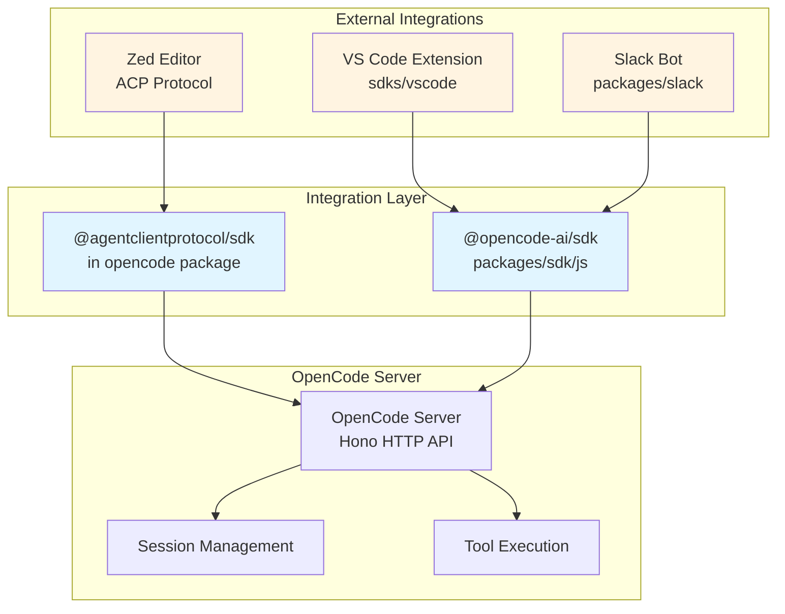
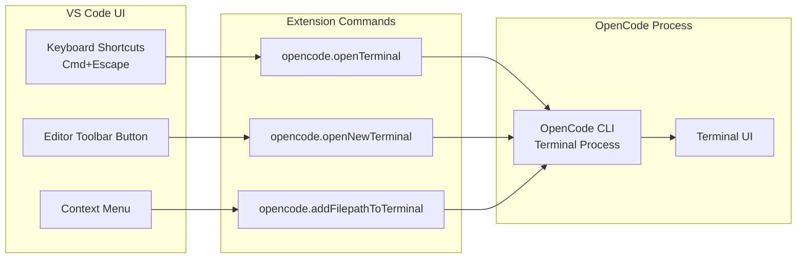
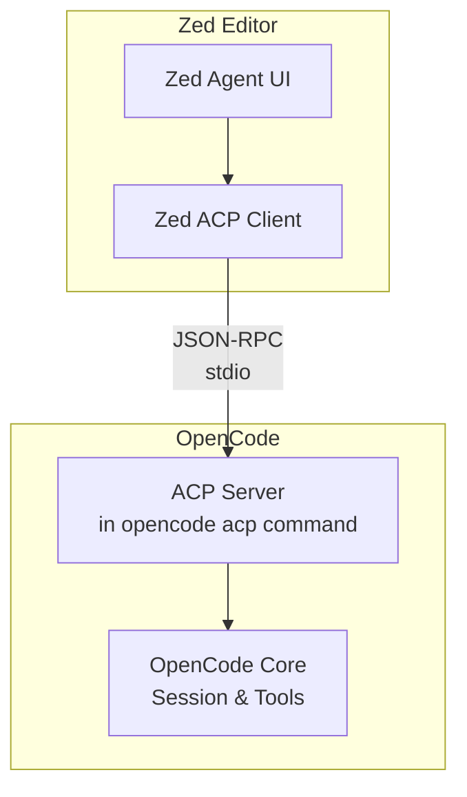
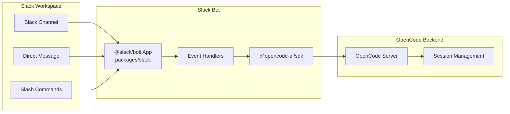

# IDE Extensions & Integrations

<details>
<summary>Relevant source files</summary>

The following files were used as context for generating this wiki page:

- [bun.lock](bun.lock)
- [packages/console/app/package.json](packages/console/app/package.json)
- [packages/console/core/package.json](packages/console/core/package.json)
- [packages/console/function/package.json](packages/console/function/package.json)
- [packages/console/mail/package.json](packages/console/mail/package.json)
- [packages/desktop/package.json](packages/desktop/package.json)
- [packages/function/package.json](packages/function/package.json)
- [packages/opencode/package.json](packages/opencode/package.json)
- [packages/plugin/package.json](packages/plugin/package.json)
- [packages/sdk/js/package.json](packages/sdk/js/package.json)
- [packages/slack/package.json](packages/slack/package.json)
- [packages/web/package.json](packages/web/package.json)
- [sdks/vscode/package.json](sdks/vscode/package.json)

</details>

This document provides an overview of OpenCode's integrations with development environments beyond its core CLI, TUI, Desktop, and Web interfaces. These integrations bring OpenCode's AI coding capabilities directly into popular IDEs and collaboration platforms, enabling developers to access OpenCode functionality within their existing workflows.

OpenCode provides three primary external integrations:

- **VS Code Extension** - Native extension for Visual Studio Code (see [VS Code Extension](#6.1))
- **Zed Extension** - Integration via Agent Client Protocol for Zed editor (see [Zed Extension](#6.2))
- **Slack Bot** - Conversational interface for team collaboration (see [Slack Integration](#6.3))

For information about OpenCode's built-in user interfaces, see [User Interfaces](#3). For details about the SDK that these integrations use to communicate with the OpenCode server, see [SDK & API](#5).

## Integration Architecture

All external integrations connect to the OpenCode server through the [@opencode-ai/sdk](packages/sdk/js/package.json:1-31) client library. This unified approach ensures consistent behavior across different platforms while allowing each integration to adapt to its host environment's conventions.



**Sources:** [sdks/vscode/package.json:1-108](), [packages/slack/package.json:1-19](), [packages/opencode/package.json:61](), [packages/sdk/js/package.json:1-31]()

## Integration Packages

OpenCode's external integrations are distributed as separate packages in the monorepo:

| Integration | Package Location     | Package Name                     | Key Dependencies                  |
| ----------- | -------------------- | -------------------------------- | --------------------------------- |
| VS Code     | `sdks/vscode/`       | `opencode` (VS Code Marketplace) | None (standalone extension)       |
| Zed         | `packages/opencode/` | N/A (embedded in core)           | `@agentclientprotocol/sdk`        |
| Slack       | `packages/slack/`    | `@opencode-ai/slack`             | `@slack/bolt`, `@opencode-ai/sdk` |

**Sources:** [sdks/vscode/package.json:2-6](), [packages/opencode/package.json:61](), [packages/slack/package.json:1-19]()

## VS Code Extension Overview

The VS Code extension provides native IDE integration through commands, keybindings, and editor UI elements. It launches OpenCode in an integrated terminal, passing context from the active editor.

### Key Features

- **Terminal Integration**: Opens OpenCode TUI in VS Code's integrated terminal
- **Context Injection**: Adds file paths from active editor to OpenCode session
- **Keybindings**: Quick access via `Cmd+Escape` (open) and `Cmd+Shift+Escape` (new tab)
- **Editor Controls**: Toolbar buttons for launching OpenCode from any file



**Sources:** [sdks/vscode/package.json:25-81]()

### Extension Commands

The extension contributes three primary commands:

| Command                          | Title                    | Keybinding         | Purpose                                            |
| -------------------------------- | ------------------------ | ------------------ | -------------------------------------------------- |
| `opencode.openTerminal`          | Open opencode            | `Cmd+Escape`       | Opens OpenCode in existing terminal or creates new |
| `opencode.openNewTerminal`       | Open opencode in new tab | `Cmd+Shift+Escape` | Always creates new terminal tab                    |
| `opencode.addFilepathToTerminal` | Add Filepath to Terminal | `Cmd+Alt+K`        | Inserts current file path as @-mention             |

**Sources:** [sdks/vscode/package.json:26-46](), [sdks/vscode/package.json:56-81]()

## Zed Extension via Agent Client Protocol

OpenCode integrates with Zed editor through the Agent Client Protocol (ACP), a standardized interface for AI coding assistants. Unlike the VS Code extension which spawns a separate terminal process, the ACP integration embeds OpenCode's capabilities directly into Zed's agent interface.

### ACP Integration Pattern



The ACP integration is implemented using the `@agentclientprotocol/sdk` package and exposed through the `opencode acp` command. This allows Zed to communicate with OpenCode through a standardized JSON-RPC protocol over stdio.

**Sources:** [packages/opencode/package.json:61]()

## Slack Bot Integration

The Slack integration transforms OpenCode into a conversational bot that teams can interact with in Slack channels and direct messages. Built using the `@slack/bolt` framework, it provides a chat-based interface to OpenCode sessions.

### Architecture



**Sources:** [packages/slack/package.json:1-19]()

### Key Capabilities

The Slack bot enables:

- **Session Management**: Create and resume OpenCode conversations in Slack threads
- **Collaboration**: Share AI-assisted coding sessions with team members
- **Notifications**: Receive updates on tool execution and agent progress
- **Async Workflows**: Continue sessions across time and team members

**Sources:** [packages/slack/package.json:10-12]()

## Deployment Models

Each integration uses a different deployment model suited to its platform:

| Integration | Deployment Model  | Distribution           | Installation                                |
| ----------- | ----------------- | ---------------------- | ------------------------------------------- |
| VS Code     | Extension Package | VS Code Marketplace    | `code --install-extension sst-dev.opencode` |
| Zed         | Binary + Config   | Zed extension registry | Zed's extension manager                     |
| Slack       | Bot Application   | Slack App Directory    | OAuth installation flow                     |

### VS Code Distribution

The VS Code extension is packaged using `esbuild` and published to the VS Code Marketplace under the publisher `sst-dev`. Users install it like any VS Code extension, and it requires the OpenCode CLI to be available in the system PATH.

**Sources:** [sdks/vscode/package.json:6](), [sdks/vscode/package.json:84-94]()

### Zed Binary Deployment

For Zed, the extension configuration references the OpenCode binary, which is distributed through multiple package managers (see [Build & Release](#8)). The ACP protocol allows Zed to spawn and communicate with the OpenCode process.

**Sources:** [packages/opencode/package.json:61]()

### Slack Bot Deployment

The Slack bot runs as a Node.js application, typically deployed to a server or serverless platform. It uses Slack's OAuth flow for installation and receives events via webhooks or WebSocket connections.

**Sources:** [packages/slack/package.json:7]()

## Communication Protocols

Different integrations use different communication protocols based on platform requirements:

```mermaid
graph TB
    subgraph "Protocol Layer"
        VSCodeProto["Process Spawning<br/>Terminal stdio"]
        ACPProto["JSON-RPC<br/>ACP Protocol"]
        SlackProto["HTTP + WebSocket<br/>Slack Events API"]
    end

    subgraph "SDK Layer"
        NoSDK["No SDK<br/>Direct CLI invocation"]
        ACPImpl["@agentclientprotocol/sdk"]
        HTTPSDK["@opencode-ai/sdk<br/>HTTP Transport"]
    end

    subgraph "Server Layer"
        CLIEntry["CLI Entrypoint"]
        ACPCmd["acp Command Handler"]
        HTTPServer["HTTP Server<br/>Hono"]
    end

    VSCodeProto --> NoSDK
    ACPProto --> ACPImpl
    SlackProto --> HTTPSDK

    NoSDK --> CLIEntry
    ACPImpl --> ACPCmd
    HTTPSDK --> HTTPServer
```



**Sources:** [sdks/vscode/package.json:1-108](), [packages/opencode/package.json:61](), [packages/slack/package.json:10-12]()

## Extension Development

Each integration is developed and built independently:

### VS Code Build Process

```bash
# Type checking
bun run check-types

# Linting
bun run lint

# Build with esbuild
node esbuild.js --production

# Package for marketplace
vsce package
```

**Sources:** [sdks/vscode/package.json:83-94]()

### Slack Bot Development

```bash
# Development server
bun run dev

# Type checking
bun run typecheck
```

**Sources:** [packages/slack/package.json:6-8]()

## Configuration

Each integration can be configured to connect to different OpenCode server instances:

- **VS Code**: Configures through launch arguments to the CLI
- **Zed**: Configures through ACP server options in the extension manifest
- **Slack**: Configures through environment variables for the bot server

For detailed configuration options for each integration, see their respective child pages: [VS Code Extension](#6.1), [Zed Extension](#6.2), and [Slack Integration](#6.3).
