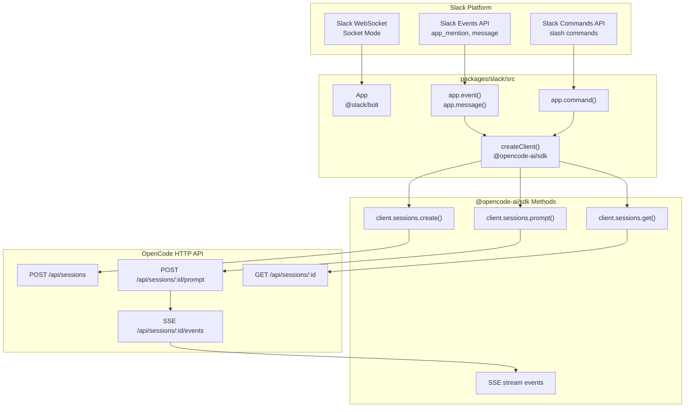
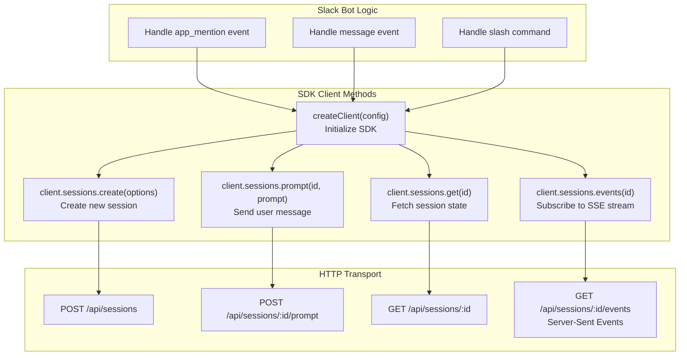
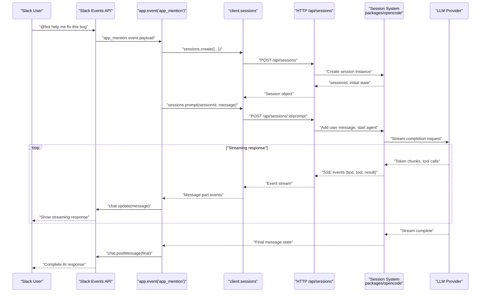
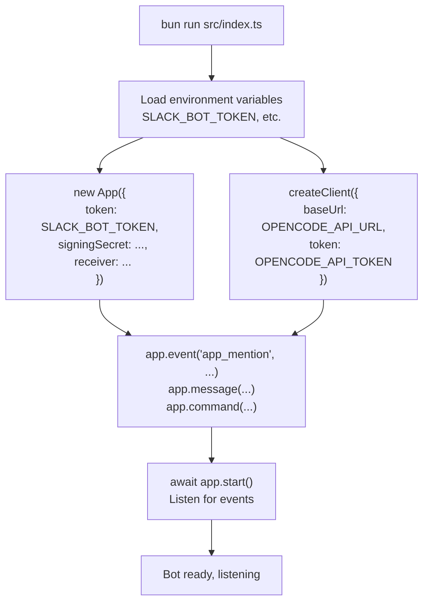
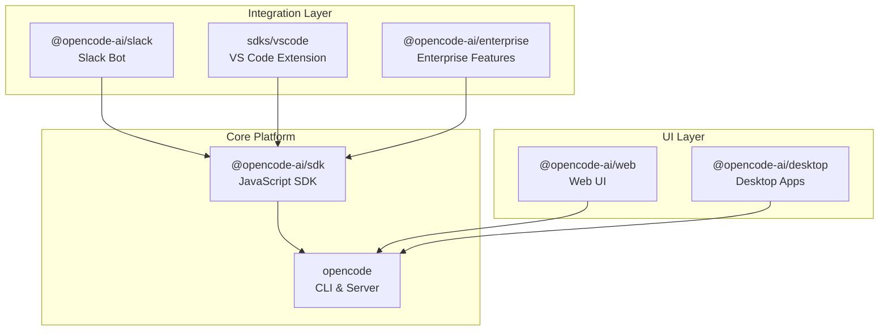
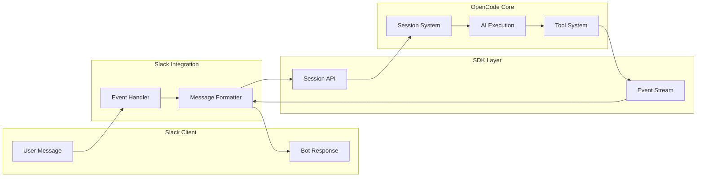

# Slack Integration

Relevant source files

The following files were used as context for generating this wiki page:

- [packages/slack/package.json](packages/slack/package.json)

## Overview

The `@opencode-ai/slack` package provides a Slack bot integration that exposes OpenCode's AI coding agent capabilities through Slack's messaging platform. Built on the `@slack/bolt` framework, this integration translates Slack events (mentions, messages, commands) into OpenCode SDK operations, enabling teams to interact with AI agents directly from their Slack workspace.

This integration is one of several IDE/platform integrations in the OpenCode ecosystem, alongside the VS Code Extension (see [VS Code Extension](#6.1)) and Zed Extension (see [Zed Extension](#6.2)). It depends on the JavaScript SDK (see [JavaScript SDK](#5.1)) for all backend communication.

**Sources:** [packages/slack/package.json:1-19]()
</thinking>

## Package Structure

| Property     | Value                    |
| ------------ | ------------------------ |
| Package Name | `@opencode-ai/slack`     |
| Location     | `packages/slack/`        |
| Version      | `1.2.27`                 |
| Module Type  | ES Module                |
| License      | MIT                      |
| Entry Point  | `src/index.ts`           |
| Runtime      | Bun (Node.js compatible) |

**Key Dependencies:**

- `@slack/bolt` v3.17.1 — Slack Bot framework
- `@opencode-ai/sdk` (workspace) — OpenCode client SDK

**Sources:** [packages/slack/package.json:1-19]()

---

## Architecture

### System Integration

**Diagram: Slack Bot Architecture with Code Entities**

**Sources:** [packages/slack/package.json:10-12]()

### Component Responsibilities

| Component        | Code Entity                    | Responsibility                                        |
| ---------------- | ------------------------------ | ----------------------------------------------------- |
| Bolt App         | `App` from `@slack/bolt`       | Manages Slack connection, OAuth, event routing        |
| Event Handlers   | `app.event()`, `app.message()` | Processes Slack events (app_mention, direct messages) |
| Command Handlers | `app.command()`                | Processes slash commands from users                   |
| SDK Client       | `createClient()` from SDK      | Interfaces with OpenCode HTTP server                  |
| Session Manager  | `client.sessions.*` methods    | Creates/manages OpenCode sessions per Slack thread    |

**Sources:** [packages/slack/package.json:1-19]()

---

## Dependencies

### @slack/bolt Framework

The integration uses `@slack/bolt` v3.17.1, which provides the core Slack bot functionality.

**Key API Methods Used:**

| Bolt API                            | Purpose                         |
| ----------------------------------- | ------------------------------- |
| `app.event('app_mention', handler)` | Handle @mentions of the bot     |
| `app.message(handler)`              | Handle direct messages to bot   |
| `app.command('/command', handler)`  | Register slash commands         |
| `app.action(actionId, handler)`     | Handle button/menu interactions |
| `app.view(callbackId, handler)`     | Handle modal submissions        |

**Connection Modes:**

- **Socket Mode:** Uses WebSocket (`SocketModeReceiver`) for event delivery
- **HTTP Mode:** Uses HTTP receiver for webhook-based event delivery

**Sources:** [packages/slack/package.json:12]()

### @opencode-ai/sdk Integration

The package depends on `@opencode-ai/sdk` (workspace dependency) for all OpenCode backend communication.

**Diagram: SDK API Surface Used by Slack Integration**

**Sources:** [packages/slack/package.json:11]()

---

## Message Flow and Event Handling

### Interaction Sequence

**Diagram: User Mention to AI Response Flow**

**Sources:** [packages/slack/package.json:10-12]()

### Event Handler Mapping

| Slack Event Type  | Bolt Handler                        | SDK Method Called                        | Purpose                       |
| ----------------- | ----------------------------------- | ---------------------------------------- | ----------------------------- |
| `app_mention`     | `app.event('app_mention', ...)`     | `sessions.create()`, `sessions.prompt()` | User @mentions bot in channel |
| `message` (DM)    | `app.message(...)`                  | `sessions.create()`, `sessions.prompt()` | Direct message to bot         |
| `slash_command`   | `app.command('/opencode', ...)`     | `sessions.create()`, custom logic        | Execute slash commands        |
| `app_home_opened` | `app.event('app_home_opened', ...)` | `config.get()` or custom API             | Show bot home screen          |
| `message_changed` | `app.event('message_changed', ...)` | `sessions.get()`                         | Track edits to messages       |
| `reaction_added`  | `app.event('reaction_added', ...)`  | Session state update                     | User feedback via reactions   |

**Sources:** [packages/slack/package.json:1-19]()

### Session-to-Thread Mapping

Each Slack thread (identified by `thread_ts`) typically maps to a single OpenCode session:

| Slack Identifier | OpenCode Entity              | Storage             |
| ---------------- | ---------------------------- | ------------------- |
| `team_id`        | Project/workspace identifier | Session metadata    |
| `channel_id`     | Channel context              | Session metadata    |
| `thread_ts`      | Unique thread timestamp      | Maps to `sessionId` |
| `user_id`        | User identity                | Permission context  |

**Sources:** [packages/slack/package.json:1-19]()

---

## Development and Deployment

### Development Scripts

| Script      | Command                | Purpose                                       |
| ----------- | ---------------------- | --------------------------------------------- |
| `dev`       | `bun run src/index.ts` | Launch bot with hot reload                    |
| `typecheck` | `tsgo --noEmit`        | Type checking with native TypeScript compiler |

**Sources:** [packages/slack/package.json:6-8]()

### Runtime Configuration

**Required Environment Variables:**

| Variable               | Purpose                                    | Example                               |
| ---------------------- | ------------------------------------------ | ------------------------------------- |
| `SLACK_BOT_TOKEN`      | OAuth bot user token (starts with `xoxb-`) | For Slack API calls                   |
| `SLACK_SIGNING_SECRET` | Request verification secret                | Validate incoming requests            |
| `SLACK_APP_TOKEN`      | App-level token (Socket Mode only)         | For WebSocket connection              |
| `OPENCODE_API_URL`     | OpenCode server endpoint                   | `http://localhost:8080` or remote URL |
| `OPENCODE_API_TOKEN`   | Authentication token (if required)         | For secured OpenCode instances        |

**Sources:** [packages/slack/package.json:1-19]()

### Deployment Architectures

**Diagram: Two Deployment Modes**

```mermaid
graph TB
    subgraph "Socket Mode Deployment"
        SlackAPI_Socket["Slack Platform"]
        WebSocket["WebSocket Connection"]
        BotSocket["Bot Instance<br/>SocketModeReceiver"]
        SDKSocket["SDK Client"]
        OpencodeSocket["OpenCode Server<br/>Local or Remote"]

        SlackAPI_Socket -->|"Events via WSS"| WebSocket
        WebSocket --> BotSocket
        BotSocket --> SDKSocket
        SDKSocket -->|"HTTP/Internal"| OpencodeSocket
    end

    subgraph "HTTP Mode Deployment"
        SlackAPI_HTTP["Slack Platform"]
        PublicEndpoint["Public HTTPS Endpoint"]
        BotHTTP["Bot Instance<br/>ExpressReceiver"]
        SDKHTTP["SDK Client"]
        OpencodeHTTP["OpenCode Server"]

        SlackAPI_HTTP -->|"POST webhook"| PublicEndpoint
        PublicEndpoint --> BotHTTP
        BotHTTP --> SDKHTTP
        SDKHTTP -->|"HTTP"| OpencodeHTTP
    end
```

**Deployment Mode Comparison:**

| Mode            | Receiver Class       | Connection      | Use Case                                          |
| --------------- | -------------------- | --------------- | ------------------------------------------------- |
| **Socket Mode** | `SocketModeReceiver` | WebSocket (WSS) | Development, private networks, no public endpoint |
| **HTTP Mode**   | `ExpressReceiver`    | HTTPS webhook   | Production, scalable deployments                  |

**Sources:** [packages/slack/package.json:1-19]()

### Initialization Flow

**Diagram: Bot Startup Sequence**

**Sources:** [packages/slack/package.json:7]()

---

## Type System and Development Tools

### TypeScript Configuration

The package uses TypeScript with native type checking via the `@typescript/native-preview` (tsgo) compiler.

**Development Dependencies:**

| Package                      | Version | Purpose                   |
| ---------------------------- | ------- | ------------------------- |
| `typescript`                 | catalog | TypeScript language       |
| `@typescript/native-preview` | catalog | Native TS compiler (tsgo) |
| `@types/node`                | catalog | Node.js type definitions  |

**Sources:** [packages/slack/package.json:14-18]()

### Type Sources

The Slack integration relies on types from multiple sources:

| Type Source        | Example Types                                                                     | Usage                |
| ------------------ | --------------------------------------------------------------------------------- | -------------------- |
| `@slack/bolt`      | `App`, `SlackEventMiddlewareArgs<'app_mention'>`, `KnownEventFromType`, `Context` | Slack event handlers |
| `@opencode-ai/sdk` | `Client`, `Session`, `Message`, `MessagePart`, `ToolCall`                         | OpenCode entities    |
| `@types/node`      | `process`, `Buffer`, `EventEmitter`                                               | Node.js runtime      |

**Sources:** [packages/slack/package.json:14-18]()

---

## Integration with OpenCode Ecosystem

### Position in System Architecture

The Slack integration sits alongside other integration packages in the OpenCode ecosystem:

**Sources:** [packages/slack/package.json:1-19]()

### Data Flow Integration

**Sources:** [packages/slack/package.json:10-12]()

---

## Package Characteristics

### Licensing and Versioning

| Property        | Value                          |
| --------------- | ------------------------------ |
| License         | MIT                            |
| Current Version | 1.2.21                         |
| Module Type     | ES Module (`"type": "module"`) |

The package follows semantic versioning and is part of the OpenCode workspace release cycle.

**Sources:** [packages/slack/package.json:3-5]()

### Build and Distribution

The package is designed to run with Bun but is compatible with Node.js environments. It uses:

- Native TypeScript compilation via `tsgo`
- Workspace protocol for SDK dependency
- Catalog-based dependency management for dev dependencies

**Sources:** [packages/slack/package.json:1-19]()
