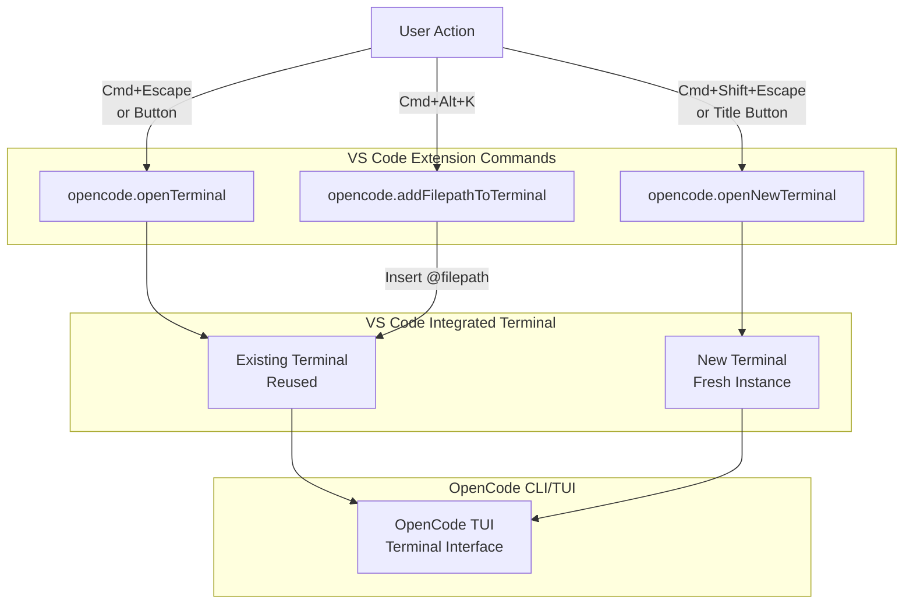
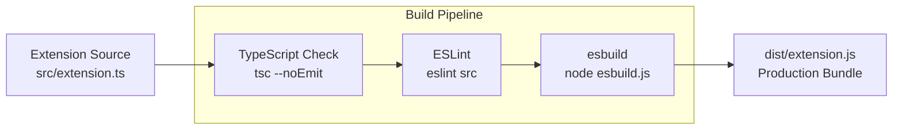
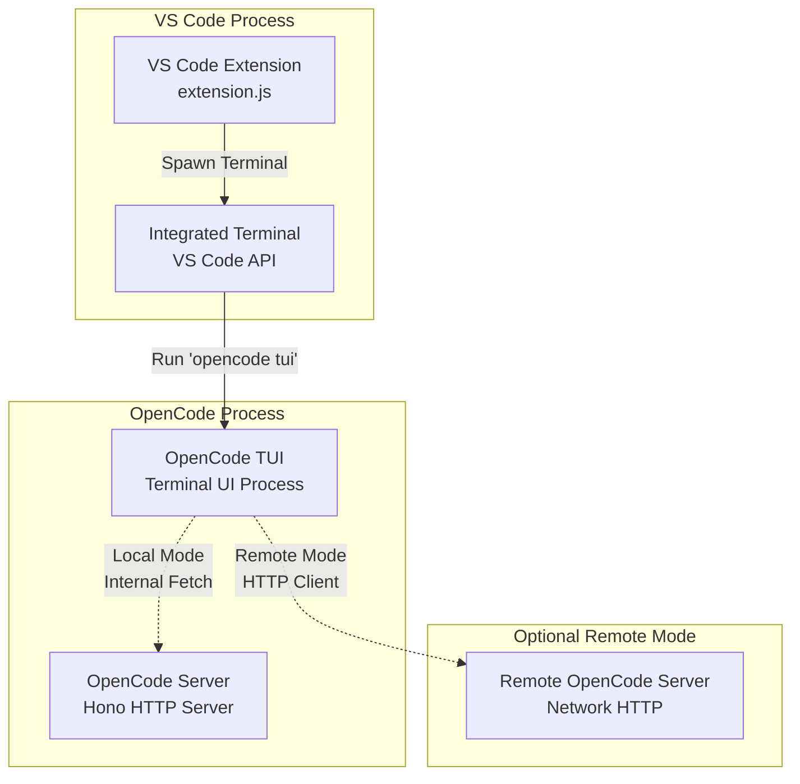
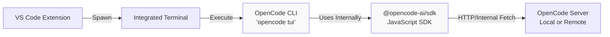

# VS Code Extension

Relevant source files

The following files were used as context for generating this wiki page:

- [bun.lock](bun.lock)
- [packages/console/app/package.json](packages/console/app/package.json)
- [packages/console/core/package.json](packages/console/core/package.json)
- [packages/console/function/package.json](packages/console/function/package.json)
- [packages/console/mail/package.json](packages/console/mail/package.json)
- [packages/desktop/package.json](packages/desktop/package.json)
- [packages/function/package.json](packages/function/package.json)
- [packages/opencode/package.json](packages/opencode/package.json)
- [packages/plugin/package.json](packages/plugin/package.json)
- [packages/sdk/js/package.json](packages/sdk/js/package.json)
- [packages/web/package.json](packages/web/package.json)
- [sdks/vscode/package.json](sdks/vscode/package.json)

The VS Code Extension provides native integration of OpenCode within Visual Studio Code. It enables developers to invoke OpenCode's AI coding agent directly from their editor through commands, keybindings, and UI buttons, opening OpenCode sessions in VS Code's integrated terminal.

For information about the JavaScript SDK that the extension may use to communicate with the OpenCode server, see [JavaScript SDK](#5.1). For information about other IDE integrations, see [Zed Extension](#6.2).

---

## Purpose and Scope

The VS Code Extension serves as a lightweight launcher that brings OpenCode functionality into the VS Code environment. It does not embed a custom UI; instead, it leverages VS Code's integrated terminal to run the OpenCode CLI/TUI, providing seamless access to OpenCode's capabilities without leaving the editor.

**Sources:** [sdks/vscode/package.json:1-109]()

---

## Extension Metadata and Distribution

The extension is published to the VS Code Marketplace with the following identity:

| Property                | Value                 |
| ----------------------- | --------------------- |
| Extension ID            | `opencode`            |
| Publisher               | `sst-dev`             |
| Display Name            | opencode              |
| Minimum VS Code Version | `^1.94.0`             |
| Main Entry Point        | `./dist/extension.js` |

The extension is bundled using esbuild and distributed with an icon and gallery banner optimized for dark themes.

**Sources:** [sdks/vscode/package.json:1-24]()

---

## Commands

The extension contributes three commands to VS Code's command palette:

### `opencode.openTerminal`

Opens OpenCode in an existing terminal or creates a new one if none exists. This command reuses the same terminal instance across invocations.

### `opencode.openNewTerminal`

Opens OpenCode in a new terminal tab. This command always creates a fresh terminal instance, allowing multiple concurrent OpenCode sessions.

This command also appears as a button in the editor title bar, providing quick visual access.

### `opencode.addFilepathToTerminal`

Adds the currently active file's path to the OpenCode terminal. This command facilitates passing file context to OpenCode by inserting file references (likely as `@filepath` mentions).

**Sources:** [sdks/vscode/package.json:26-46]()

**Diagram: VS Code Extension Command Flow**

**Sources:** [sdks/vscode/package.json:26-81]()

---

## Keybindings

The extension registers three platform-aware keybindings:

| Command                          | macOS              | Windows/Linux       | Purpose                        |
| -------------------------------- | ------------------ | ------------------- | ------------------------------ |
| `opencode.openTerminal`          | `Cmd+Escape`       | `Ctrl+Escape`       | Open/focus OpenCode terminal   |
| `opencode.openNewTerminal`       | `Cmd+Shift+Escape` | `Ctrl+Shift+Escape` | Open new OpenCode terminal     |
| `opencode.addFilepathToTerminal` | `Cmd+Alt+K`        | `Ctrl+Alt+K`        | Insert file path into terminal |

These keybindings provide keyboard-first access to OpenCode, aligning with developer workflows that prioritize keyboard navigation.

**Sources:** [sdks/vscode/package.json:56-81]()

---

## UI Integration Points

### Editor Title Bar Button

The `opencode.openNewTerminal` command is registered in the `editor/title` menu group `navigation`, displaying a button in the title bar of every editor window. The button uses different SVG icons for light and dark themes:

- **Light theme:** `images/button-dark.svg`
- **Dark theme:** `images/button-light.svg`

This visual affordance makes OpenCode discoverable to users who may not be familiar with the keybindings.

**Sources:** [sdks/vscode/package.json:48-54](), [sdks/vscode/package.json:30-41]()

---

## Build and Packaging System

The extension uses a custom build pipeline with the following scripts:

| Script              | Purpose                                                                |
| ------------------- | ---------------------------------------------------------------------- |
| `vscode:prepublish` | Entry point for VS Code packaging, runs full build pipeline            |
| `package`           | Production build with type checking, linting, and esbuild optimization |
| `compile`           | Development build with type checking and linting                       |
| `watch:esbuild`     | Watch mode for esbuild during development                              |
| `watch:tsc`         | Watch mode for TypeScript type checking                                |
| `check-types`       | Run TypeScript compiler in `--noEmit` mode for validation              |

The build system uses **esbuild** (via `node esbuild.js`) for fast bundling and **TypeScript** for type checking. The production build includes all quality checks before generating the distributable bundle.

**Sources:** [sdks/vscode/package.json:83-94]()

**Diagram: Extension Build Pipeline**

**Sources:** [sdks/vscode/package.json:83-94]()

---

## Development Dependencies

The extension relies on the following development toolchain:

| Dependency                         | Version   | Purpose                         |
| ---------------------------------- | --------- | ------------------------------- |
| `@types/vscode`                    | `^1.94.0` | VS Code API type definitions    |
| `@types/node`                      | `20.x`    | Node.js type definitions        |
| `esbuild`                          | `^0.25.3` | Fast JavaScript bundler         |
| `typescript`                       | `^5.8.3`  | TypeScript compiler             |
| `eslint`                           | `^9.25.1` | Code linting                    |
| `@typescript-eslint/parser`        | `^8.31.1` | TypeScript ESLint parser        |
| `@typescript-eslint/eslint-plugin` | `^8.31.1` | TypeScript ESLint rules         |
| `@vscode/test-cli`                 | `^0.0.11` | VS Code extension test runner   |
| `@vscode/test-electron`            | `^2.5.2`  | Electron-based test environment |

**Sources:** [sdks/vscode/package.json:96-107]()

---

## Architecture Integration

The VS Code Extension fits into the OpenCode ecosystem as a lightweight client that launches the OpenCode TUI in VS Code's integrated terminal. Unlike the Desktop applications or Web interface, it does not maintain persistent state or render custom UI components.

**Diagram: VS Code Extension in OpenCode Architecture**

The extension's primary role is to:

1. **Spawn Terminal Instances:** Use VS Code's terminal API to create or reuse terminal windows
2. **Execute OpenCode CLI:** Run the `opencode` command (likely `opencode tui` or `opencode run`) in the terminal
3. **Pass File Context:** Insert file paths into the terminal to provide context to the OpenCode agent

**Sources:** [sdks/vscode/package.json:1-109]()

---

## Activation and Lifecycle

Based on the package structure, the extension likely follows this lifecycle:

### Activation

The extension activates when VS Code starts (indicated by `"activationEvents": []` in package.json, which triggers on all activation events). The main entry point is `dist/extension.js`, which exports `activate()` and `deactivate()` functions per VS Code's extension API contract.

### Command Registration

During activation, the extension registers its three commands with VS Code's command registry, making them available through:

- Command palette (`Cmd+Shift+P`)
- Keybindings
- Editor title bar buttons

### Terminal Management

The extension maintains references to OpenCode terminal instances:

- **`opencode.openTerminal`:** Searches for an existing OpenCode terminal by name/ID and reuses it, or creates one if none exists
- **`opencode.openNewTerminal`:** Always creates a new terminal with a unique identifier
- **`opencode.addFilepathToTerminal`:** Identifies the active OpenCode terminal and sends text to it

**Sources:** [sdks/vscode/package.json:23-24](), [sdks/vscode/package.json:26-46]()

---

## File Path Insertion Mechanism

The `opencode.addFilepathToTerminal` command likely implements the following behavior:

1. **Get Active Editor:** Use `vscode.window.activeTextEditor` to retrieve the currently focused file
2. **Extract File Path:** Get the absolute or workspace-relative path of the file
3. **Format as Mention:** Convert the path to OpenCode's `@filepath` mention syntax
4. **Send to Terminal:** Use VS Code's `Terminal.sendText()` API to insert the mention into the active OpenCode terminal

This integration enables users to quickly reference files in their OpenCode prompts without typing paths manually.

**Sources:** [sdks/vscode/package.json:44-46](), [sdks/vscode/package.json:73-80]()

---

## Comparison with Other UI Clients

| Feature                  | VS Code Extension          | Desktop App                | TUI (Standalone)       |
| ------------------------ | -------------------------- | -------------------------- | ---------------------- |
| UI Framework             | VS Code Terminal           | SolidJS + Tauri/Electron   | Ink (React for CLI)    |
| Launch Method            | Command/Keybinding         | Standalone Application     | `opencode tui` command |
| Session Persistence      | Terminal-based (ephemeral) | App state persisted        | Session files on disk  |
| File Context Integration | `@filepath` insertion      | Drag-and-drop, file picker | Manual typing or args  |
| Auto-update              | Via VS Code Marketplace    | Tauri/Electron updater     | npm/package manager    |
| Cross-platform           | All platforms with VS Code | macOS, Windows, Linux      | All platforms          |

The VS Code Extension prioritizes simplicity and tight integration with the editor environment, whereas the Desktop and TUI clients provide richer standalone experiences.

**Sources:** [sdks/vscode/package.json:1-109]()

---

## Configuration and Customization

While the extension's package.json does not define contribution points for settings (no `"configuration"` section), users can configure OpenCode behavior through:

1. **Global OpenCode Configuration:** The extension runs the OpenCode CLI, which respects `~/.config/opencode/opencode.json` configuration files (see [Configuration System](#2.2))
2. **Project Configuration:** Project-level `.opencode/opencode.json` files override global settings
3. **Environment Variables:** The terminal inherits VS Code's environment, allowing users to set provider API keys and other env-based configuration

The extension itself does not add VS Code-specific configuration options, maintaining a minimal surface area.

**Sources:** [sdks/vscode/package.json:25-82]()

---

## Testing Infrastructure

The extension includes testing infrastructure using VS Code's official testing tools:

- **`@vscode/test-cli`:** Command-line test runner for VS Code extensions
- **`@vscode/test-electron`:** Electron-based test environment that simulates a full VS Code instance

Tests are compiled using the `compile-tests` script and run via the `test` script, which executes pre-test validation (type checking, linting, compilation) before running the test suite.

**Sources:** [sdks/vscode/package.json:89-94](), [sdks/vscode/package.json:105-106]()

---

## Distribution and Publishing

The extension is published to the Visual Studio Code Marketplace under the identifier `sst-dev.opencode`. The publishing process is triggered by the `vscode:prepublish` script, which:

1. Runs type checking (`check-types`)
2. Runs linting (`lint`)
3. Builds the production bundle with esbuild (`package`)
4. Generates a `.vsix` package for distribution

The extension's icon (`images/icon.png`) and gallery banner (dark theme with `#000000` background) provide branding on the marketplace.

**Sources:** [sdks/vscode/package.json:1-16](), [sdks/vscode/package.json:83-88]()

---

## Relationship to SDK and Server

While the package.json does not list `@opencode-ai/sdk` as a dependency, the extension likely operates in one of two modes:

### Terminal-Only Mode (Current Implementation)

The extension simply spawns the `opencode` CLI in a terminal, which handles all server communication. This approach:

- Keeps the extension lightweight (no SDK dependency)
- Delegates all OpenCode logic to the CLI
- Provides a consistent experience with standalone TUI usage

### Potential SDK Integration Mode

The extension could potentially use the SDK directly to:

- Check OpenCode server status before opening terminals
- Provide inline diagnostics or status indicators
- Implement custom UI panels with session information

Based on the package structure and lack of SDK dependency, the current implementation uses the terminal-only approach.

**Sources:** [sdks/vscode/package.json:1-109]()

**Diagram: Extension Communication Path**

**Sources:** [sdks/vscode/package.json:1-109]()

---

## Future Enhancement Opportunities

While the current extension provides essential launching functionality, potential enhancements could include:

1. **Workspace-Aware Configuration:** Detect and respect `.opencode/opencode.json` in the current workspace
2. **Status Bar Integration:** Display OpenCode server status or active session count
3. **Custom Sidebar Panel:** Embed a lightweight session browser or history viewer
4. **Language Server Protocol (LSP) Integration:** Provide inline suggestions powered by OpenCode
5. **WebView-Based UI:** Render a custom UI panel instead of relying solely on the terminal

These enhancements would require adding `@opencode-ai/sdk` as a dependency and expanding the extension's scope beyond simple terminal launching.

**Sources:** [sdks/vscode/package.json:1-109]()
