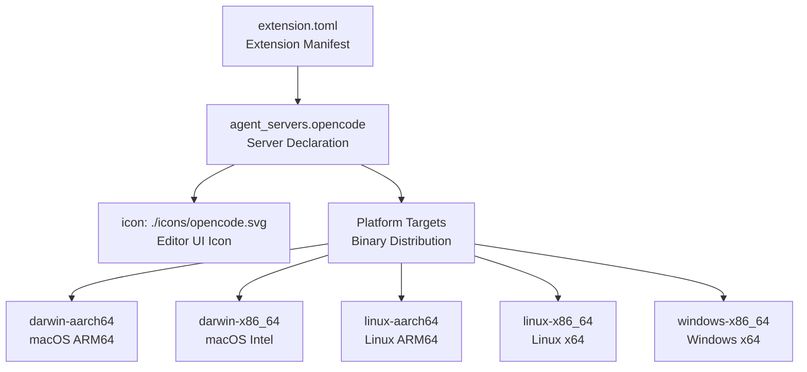
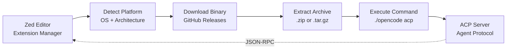
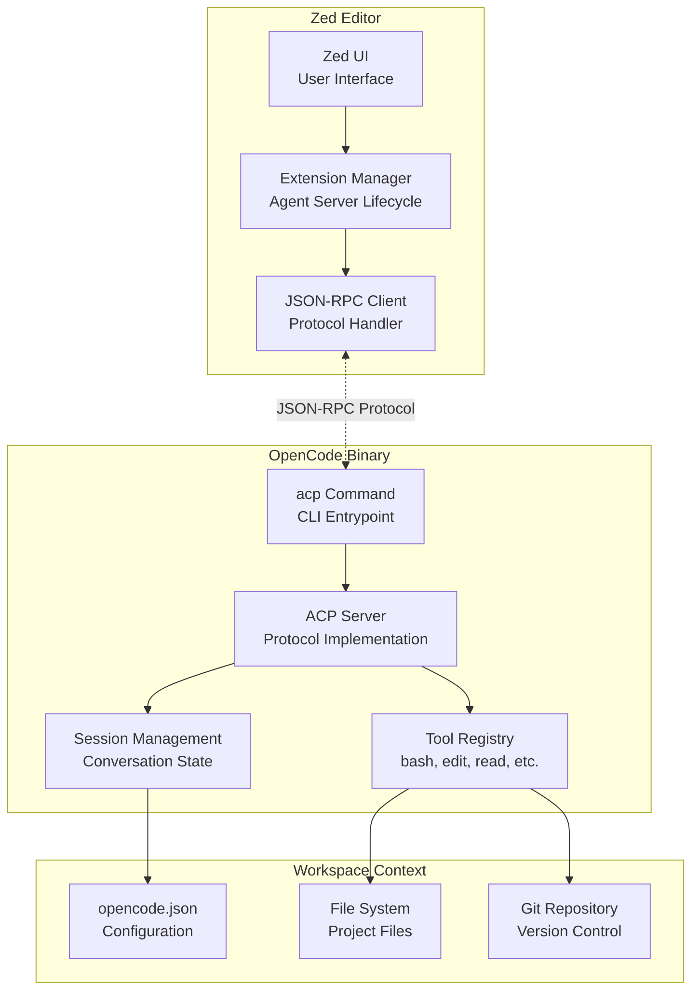
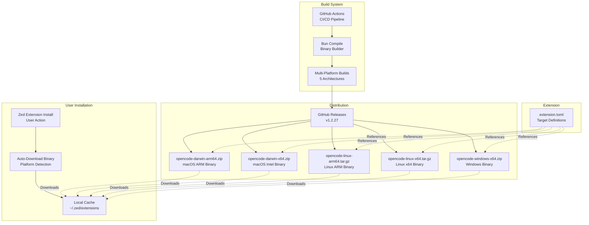

# Zed Extension

<details>
<summary>Relevant source files</summary>

The following files were used as context for generating this wiki page:

- [packages/extensions/zed/extension.toml](packages/extensions/zed/extension.toml)

</details>

The Zed Extension enables OpenCode to function as an agent server within the Zed editor, providing AI-powered coding assistance directly in the editor environment. The extension uses the Agent Client Protocol (ACP) to communicate with Zed and automatically downloads platform-specific OpenCode binaries from GitHub releases.

For information about integrating OpenCode with Visual Studio Code, see [VS Code Extension](#6.1). For details about the ACP command implementation, see [CLI Entrypoint & Commands](#2.1).

---

## Extension Configuration

The Zed extension is defined through a TOML configuration file that specifies metadata, agent server definitions, and platform-specific binary targets.

### Metadata Structure

The extension manifest defines core identification and versioning information:

| Property         | Value                                     | Purpose                                           |
| ---------------- | ----------------------------------------- | ------------------------------------------------- |
| `id`             | `"opencode"`                              | Unique identifier for the extension               |
| `name`           | `"OpenCode"`                              | Display name in Zed                               |
| `description`    | `"The open source coding agent."`         | User-facing description                           |
| `version`        | `"1.2.27"`                                | Extension version (synced with OpenCode releases) |
| `schema_version` | `1`                                       | Zed extension schema version                      |
| `repository`     | `"https://github.com/anomalyco/opencode"` | Source code repository                            |

[packages/extensions/zed/extension.toml:1-7]()

### Agent Server Declaration

The extension declares an agent server named `opencode` with platform-specific binary targets:



**Sources:** [packages/extensions/zed/extension.toml:9-11]()

---

## Platform Binary Targets

Each platform target specifies how Zed should download and execute the OpenCode binary for that architecture. All targets follow a consistent pattern with three properties: `archive`, `cmd`, and `args`.

### Target Configuration Pattern

| Platform         | Archive URL Pattern           | Executable       | Arguments |
| ---------------- | ----------------------------- | ---------------- | --------- |
| `darwin-aarch64` | `opencode-darwin-arm64.zip`   | `./opencode`     | `["acp"]` |
| `darwin-x86_64`  | `opencode-darwin-x64.zip`     | `./opencode`     | `["acp"]` |
| `linux-aarch64`  | `opencode-linux-arm64.tar.gz` | `./opencode`     | `["acp"]` |
| `linux-x86_64`   | `opencode-linux-x64.tar.gz`   | `./opencode`     | `["acp"]` |
| `windows-x86_64` | `opencode-windows-x64.zip`    | `./opencode.exe` | `["acp"]` |

### Binary Download and Execution Flow



All archive URLs follow the pattern:

```
https://github.com/anomalyco/opencode/releases/download/v{version}/opencode-{platform}-{arch}.{ext}
```

**Sources:** [packages/extensions/zed/extension.toml:13-36]()

---

## Agent Client Protocol (ACP) Integration

The Zed extension launches OpenCode in Agent Client Protocol mode by passing the `acp` argument to the binary. This protocol enables bi-directional communication between Zed and OpenCode through a JSON-RPC interface.

### ACP Command Invocation

For all platforms, the extension executes:

```
./opencode acp    # Unix-like systems
./opencode.exe acp  # Windows
```

The `acp` command starts the OpenCode server in a mode specifically designed for editor integration, handling:

- Agent server initialization
- JSON-RPC message parsing
- Request/response handling
- Tool execution within the editor context
- Configuration loading from the workspace

### Communication Architecture



**Sources:** [packages/extensions/zed/extension.toml:16,21,26,31,36]()

---

## Version Synchronization

The extension version in `extension.toml` must stay synchronized with OpenCode releases to ensure binary availability. The version appears in three locations within the configuration:

1. **Extension version field:** `version = "1.2.27"` [packages/extensions/zed/extension.toml:4]()
2. **Binary download URLs:** All five platform targets reference `v1.2.27` in their GitHub release URLs [packages/extensions/zed/extension.toml:14,19,24,29,34]()

### Version Update Process

When OpenCode releases a new version, the Zed extension requires updates to:

| Location                   | Example | Purpose                    |
| -------------------------- | ------- | -------------------------- |
| Root version               | Line 4  | Extension registry version |
| darwin-aarch64 archive URL | Line 14 | Binary download path       |
| darwin-x86_64 archive URL  | Line 19 | Binary download path       |
| linux-aarch64 archive URL  | Line 24 | Binary download path       |
| linux-x86_64 archive URL   | Line 29 | Binary download path       |
| windows-x86_64 archive URL | Line 34 | Binary download path       |

This synchronization ensures users receive compatible binaries that match the extension's declared version.

**Sources:** [packages/extensions/zed/extension.toml:4,14,19,24,29,34]()

---

## Binary Distribution Strategy

The extension relies on pre-built OpenCode binaries distributed through GitHub Releases rather than bundling binaries with the extension. This approach provides several benefits:

### Distribution Architecture



### Archive Format by Platform

| Platform       | Compression | Rationale                     |
| -------------- | ----------- | ----------------------------- |
| Darwin (macOS) | `.zip`      | Native macOS archive format   |
| Linux          | `.tar.gz`   | Standard Unix compression     |
| Windows        | `.zip`      | Native Windows archive format |

The extension does not include fallback URLs or mirror servers. All downloads must succeed from `github.com/anomalyco/opencode/releases`.

**Sources:** [packages/extensions/zed/extension.toml:13-36]()

---

## Installation and Usage

### Installation Flow

1. User installs the OpenCode extension from Zed's extension marketplace
2. Zed reads the `extension.toml` configuration
3. Zed detects the user's platform (`darwin-aarch64`, `linux-x86_64`, etc.)
4. Zed downloads the corresponding binary archive from GitHub Releases
5. Zed extracts the archive to the local extension directory
6. Zed launches `./opencode acp` when the agent server is needed

### Runtime Behavior

Once installed, the extension provides OpenCode functionality through Zed's agent interface:

- **Agent activation:** Users trigger OpenCode through Zed's agent UI
- **Session persistence:** Each interaction creates or continues an OpenCode session
- **Tool execution:** OpenCode tools (bash, edit, read, etc.) operate on workspace files
- **Configuration:** OpenCode loads settings from `opencode.json` in the workspace root
- **Permission handling:** Tool permissions follow the same rules as CLI mode

The extension does not provide custom UI within Zed; all interactions occur through Zed's native agent interface.

**Sources:** [packages/extensions/zed/extension.toml:1-36]()

---

## Related Configuration

The Zed extension respects the same configuration hierarchy as other OpenCode clients:

1. **Project configuration:** `<workspace>/.opencode/opencode.json`
2. **Global configuration:** `~/.opencode/opencode.json`
3. **Remote configuration:** Loaded from OpenCode Console (if authenticated)

For complete configuration options, see [Configuration System](#2.2) and [Configuration Schema Reference](#9.3).

For details about LLM provider setup and authentication, see [AI Provider & Model Management](#2.4) and [Providers & Models](#9.1).
