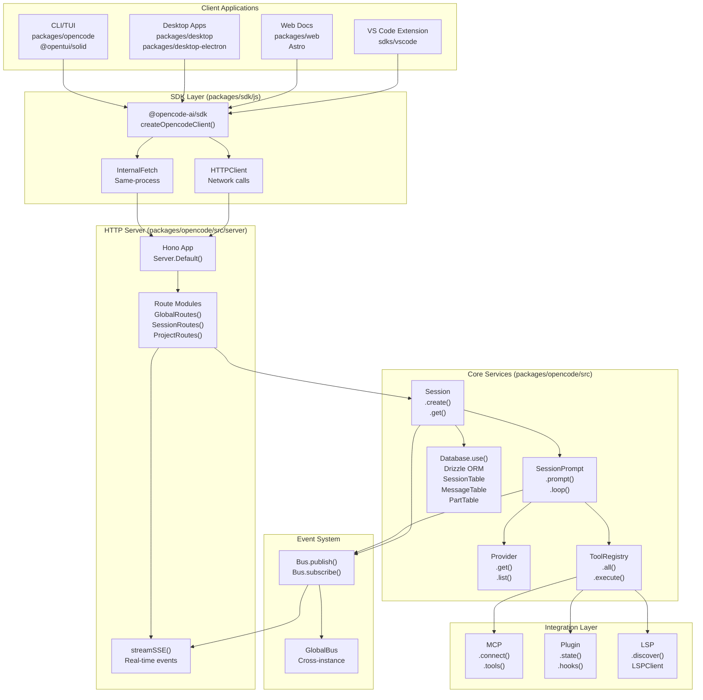
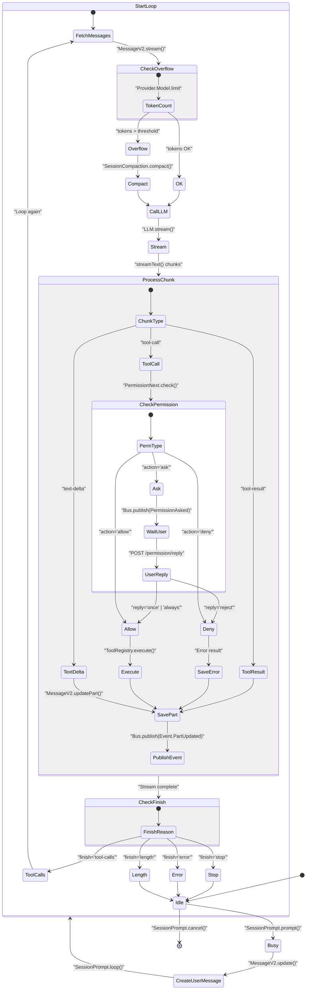
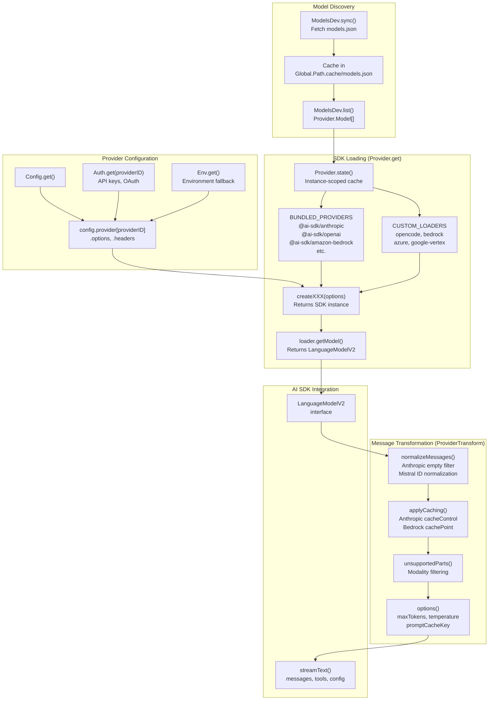
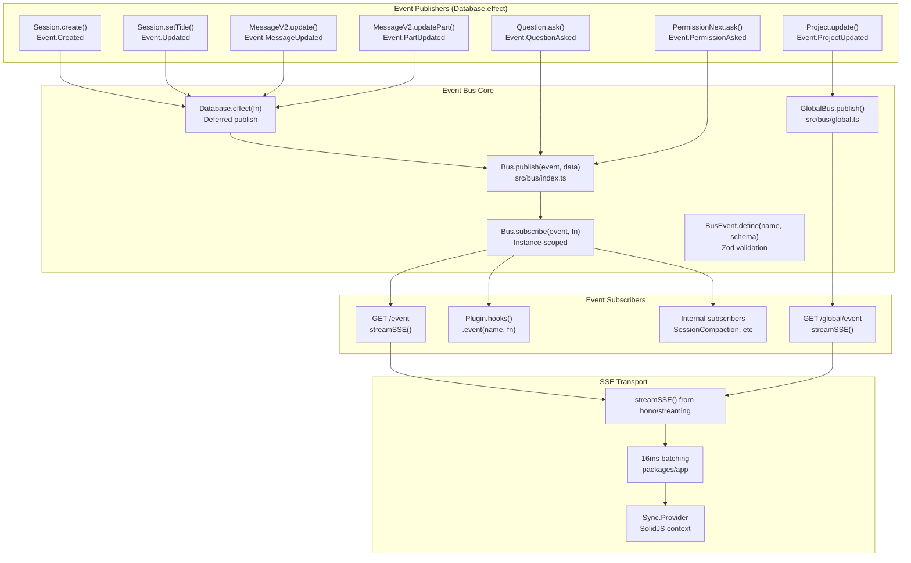
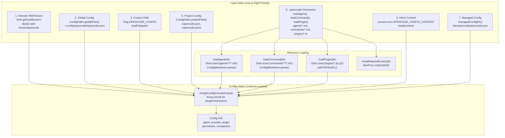
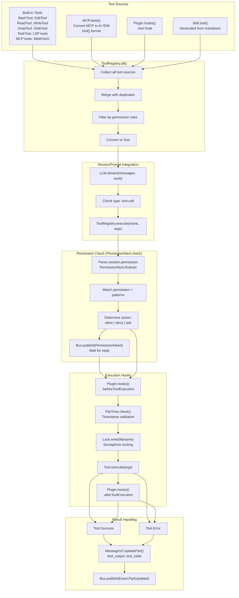

# Architecture Overview

<details>
<summary>Relevant source files</summary>

The following files were used as context for generating this wiki page:

- [bun.lock](bun.lock)
- [packages/console/app/package.json](packages/console/app/package.json)
- [packages/console/core/package.json](packages/console/core/package.json)
- [packages/console/function/package.json](packages/console/function/package.json)
- [packages/console/mail/package.json](packages/console/mail/package.json)
- [packages/desktop/package.json](packages/desktop/package.json)
- [packages/function/package.json](packages/function/package.json)
- [packages/opencode/package.json](packages/opencode/package.json)
- [packages/opencode/src/config/config.ts](packages/opencode/src/config/config.ts)
- [packages/opencode/src/env/index.ts](packages/opencode/src/env/index.ts)
- [packages/opencode/src/provider/error.ts](packages/opencode/src/provider/error.ts)
- [packages/opencode/src/provider/models.ts](packages/opencode/src/provider/models.ts)
- [packages/opencode/src/provider/provider.ts](packages/opencode/src/provider/provider.ts)
- [packages/opencode/src/provider/transform.ts](packages/opencode/src/provider/transform.ts)
- [packages/opencode/src/server/server.ts](packages/opencode/src/server/server.ts)
- [packages/opencode/src/session/compaction.ts](packages/opencode/src/session/compaction.ts)
- [packages/opencode/src/session/index.ts](packages/opencode/src/session/index.ts)
- [packages/opencode/src/session/llm.ts](packages/opencode/src/session/llm.ts)
- [packages/opencode/src/session/message-v2.ts](packages/opencode/src/session/message-v2.ts)
- [packages/opencode/src/session/message.ts](packages/opencode/src/session/message.ts)
- [packages/opencode/src/session/prompt.ts](packages/opencode/src/session/prompt.ts)
- [packages/opencode/src/session/revert.ts](packages/opencode/src/session/revert.ts)
- [packages/opencode/src/session/summary.ts](packages/opencode/src/session/summary.ts)
- [packages/opencode/src/tool/task.ts](packages/opencode/src/tool/task.ts)
- [packages/opencode/test/config/config.test.ts](packages/opencode/test/config/config.test.ts)
- [packages/opencode/test/provider/provider.test.ts](packages/opencode/test/provider/provider.test.ts)
- [packages/opencode/test/provider/transform.test.ts](packages/opencode/test/provider/transform.test.ts)
- [packages/opencode/test/session/llm.test.ts](packages/opencode/test/session/llm.test.ts)
- [packages/opencode/test/session/message-v2.test.ts](packages/opencode/test/session/message-v2.test.ts)
- [packages/opencode/test/session/revert-compact.test.ts](packages/opencode/test/session/revert-compact.test.ts)
- [packages/plugin/package.json](packages/plugin/package.json)
- [packages/sdk/js/package.json](packages/sdk/js/package.json)
- [packages/sdk/js/src/gen/sdk.gen.ts](packages/sdk/js/src/gen/sdk.gen.ts)
- [packages/sdk/js/src/gen/types.gen.ts](packages/sdk/js/src/gen/types.gen.ts)
- [packages/sdk/js/src/v2/gen/sdk.gen.ts](packages/sdk/js/src/v2/gen/sdk.gen.ts)
- [packages/sdk/js/src/v2/gen/types.gen.ts](packages/sdk/js/src/v2/gen/types.gen.ts)
- [packages/sdk/openapi.json](packages/sdk/openapi.json)
- [packages/web/package.json](packages/web/package.json)
- [sdks/vscode/package.json](sdks/vscode/package.json)

</details>

This document provides a high-level overview of the OpenCode system architecture, describing how the core components interact to provide an AI-powered coding assistant. It focuses on the backend infrastructure, API layer, and integration points between major subsystems.

For detailed information about the repository structure and package organization, see [Repository Structure](#1.1). For specific subsystem details, refer to [Core Application](#2), [User Interfaces](#3), and [SDK & API](#5).

## System Overview

OpenCode is built as a modular, event-driven system centered around the `packages/opencode` package that manages AI sessions, executes tools, and exposes a REST API. The architecture uses a monorepo structure with clear separation of concerns:

- **Core Backend** (`packages/opencode`): Session/message management, AI provider integration, tool execution, SQLite persistence via Drizzle ORM
- **API Layer**: Hono-based HTTP server with OpenAPI routes and SSE streaming via `streamSSE()` from `hono/streaming`
- **Client SDK** (`packages/sdk/js`): TypeScript SDK with transport abstraction (internal fetch vs HTTP)
- **UI Layer** (`packages/app`, `packages/ui`): SolidJS-based shared logic and components consumed by all frontends
- **Frontend Clients**: TUI (built-in with `@opentui/solid`), Tauri desktop, Electron desktop, Astro web, VS Code extension
- **Extensibility**: Plugin system (`@opencode-ai/plugin`), MCP integration, LSP servers

### High-Level Architecture



**Sources:** [packages/opencode/package.json:1-146](), [packages/sdk/js/package.json:1-31](), [packages/opencode/src/server/server.ts:53-195](), [packages/opencode/src/session/index.ts:36-336](), [packages/opencode/src/session/prompt.ts:65-188]()

## Request Flow Architecture

A user prompt flows through the system from HTTP endpoint to AI response, with streaming updates via SSE. The `SessionPrompt.loop()` function implements the core agentic reasoning loop.

### Prompt Processing Sequence

```mermaid
sequenceDiagram
    participant Client
    participant SessionRoutes["SessionRoutes<br/>POST /session/:id/prompt"]
    participant SessionPrompt["SessionPrompt.prompt()"]
    participant MessageV2["MessageV2"]
    participant SessionLoop["SessionPrompt.loop()"]
    participant LLMStream["LLM.stream()"]
    participant ProviderGet["Provider.get()"]
    participant StreamText["streamText()<br/>from ai SDK"]
    participant ToolRegistry["ToolRegistry.execute()"]
    participant PermissionCheck["PermissionNext.check()"]
    participant DatabaseUse["Database.use()"]
    participant BusPublish["Bus.publish()"]
    participant SSE["streamSSE()"]

    Client->>SessionRoutes: POST with PromptInput
    SessionRoutes->>SessionPrompt: prompt(input)
    SessionPrompt->>MessageV2: createUserMessage()
    MessageV2->>DatabaseUse: Insert into MessageTable
    SessionPrompt->>SessionLoop: loop(sessionID)

    loop "Agentic Loop (until finish='stop')"
        SessionLoop->>MessageV2: MessageV2.stream(sessionID)
        MessageV2-->>SessionLoop: Message[]
        SessionLoop->>LLMStream: stream(messages, tools, model)
        LLMStream->>ProviderGet: get(providerID, modelID)
        ProviderGet-->>LLMStream: LanguageModelV2
        LLMStream->>StreamText: streamText(config)

        loop "Stream Chunks"
            StreamText-->>SessionLoop: text-delta | tool-call
            SessionLoop->>MessageV2: updatePart()
            MessageV2->>DatabaseUse: Update PartTable
            MessageV2->>BusPublish: Event.PartUpdated
            BusPublish->>SSE: Stream to client
        end

        alt "Tool Call Required"
            SessionLoop->>PermissionCheck: check(permission, patterns)
            alt "Permission = allow"
                PermissionCheck-->>SessionLoop: Approved
                SessionLoop->>ToolRegistry: execute(name, args)
                ToolRegistry-->>SessionLoop: ToolResult
            else "Permission = ask"
                PermissionCheck->>BusPublish: Event.PermissionAsked
                BusPublish->>SSE: Ask user
                SSE-->>Client: Permission request
                Client->>SessionRoutes: POST /permission/reply
                SessionRoutes->>PermissionCheck: Reply received
                PermissionCheck-->>SessionLoop: User decision
            end
            SessionLoop->>MessageV2: updatePart(toolResult)
        end

        alt "finish='stop'"
            SessionLoop->>MessageV2: updateMessage(finish)
            MessageV2->>BusPublish: Event.MessageUpdated
            BusPublish->>SSE: Final event
        end
    end
```

**Sources:** [packages/opencode/src/server/routes/session.ts:1-300](), [packages/opencode/src/session/prompt.ts:161-188](), [packages/opencode/src/session/prompt.ts:277-600](), [packages/opencode/src/session/llm.ts:26-150](), [packages/opencode/src/tool/registry.ts:1-200](), [packages/opencode/src/permission/next.ts:1-150]()

## Core Component Mapping

The following table maps architectural components to their concrete code implementations:

| Component            | Primary File(s)             | Key Functions/Classes                                         | Purpose                                 |
| -------------------- | --------------------------- | ------------------------------------------------------------- | --------------------------------------- |
| HTTP Server          | `src/server/server.ts`      | `Server.Default()`, `Server.createApp()`                      | Hono-based REST API with OpenAPI routes |
| Session Management   | `src/session/index.ts`      | `Session.create()`, `Session.get()`, `Session.touch()`        | Conversation lifecycle and persistence  |
| AI Interaction Loop  | `src/session/prompt.ts`     | `SessionPrompt.prompt()`, `SessionPrompt.loop()`              | Agentic loop with tool calling          |
| Message Storage      | `src/session/message-v2.ts` | `MessageV2.update()`, `MessageV2.stream()`                    | Message and part CRUD operations        |
| Provider Integration | `src/provider/provider.ts`  | `Provider.get()`, `Provider.list()`, `Provider.state()`       | AI model discovery and SDK loading      |
| Provider Transform   | `src/provider/transform.ts` | `ProviderTransform.messages()`, `ProviderTransform.options()` | Message normalization and caching       |
| Tool System          | `src/tool/registry.ts`      | `ToolRegistry.all()`, `ToolRegistry.execute()`                | Tool discovery and execution            |
| Permission System    | `src/permission/next.ts`    | `PermissionNext.check()`, `PermissionNext.apply()`            | Permission enforcement                  |
| Event Bus            | `src/bus/index.ts`          | `Bus.publish()`, `Bus.subscribe()`                            | Pub/sub event system                    |
| Global Event Bus     | `src/bus/global.ts`         | `GlobalBus.publish()`                                         | Cross-instance events                   |
| Database             | `src/storage/db.ts`         | `Database.use()`, `Database.effect()`                         | SQLite with Drizzle ORM                 |
| Configuration        | `src/config/config.ts`      | `Config.state()`, `Config.get()`                              | Hierarchical config loading             |
| MCP Integration      | `src/mcp/index.ts`          | `MCP.state()`, `MCP.connect()`, `MCP.tools()`                 | Model Context Protocol                  |
| Plugin System        | `src/plugin/index.ts`       | `Plugin.state()`, `Plugin.hooks()`                            | Plugin loading and hook system          |
| LSP Integration      | `src/lsp/index.ts`          | `LSP.discover()`, `LSPClient`                                 | Language server protocol                |
| Instance Management  | `src/project/instance.ts`   | `Instance.state()`, `Instance.directory`                      | Multi-project isolation                 |

**Sources:** [packages/opencode/src/server/server.ts:53-80](), [packages/opencode/src/session/index.ts:36-350](), [packages/opencode/src/session/prompt.ts:65-277](), [packages/opencode/src/session/message-v2.ts:20-700](), [packages/opencode/src/provider/provider.ts:52-700](), [packages/opencode/src/tool/registry.ts:1-200](), [packages/opencode/src/permission/next.ts:1-150]()

## Data Model Architecture

OpenCode uses Drizzle ORM with SQLite, storing data in `.opencode/db.sqlite`. The schema has three core tables for session management, accessed via `Database.use()`.

### Database Schema

```mermaid
erDiagram
    SessionTable ||--o{ MessageTable : "session_id"
    MessageTable ||--o{ PartTable : "message_id"
    ProjectTable ||--o{ SessionTable : "project_id"

    SessionTable {
        string id PK "SessionID"
        string slug "Slug.create()"
        string project_id FK "ProjectID"
        string workspace_id "WorkspaceID"
        string parent_id FK "Parent SessionID"
        string directory "Instance.directory"
        string title "User-editable"
        string version "Installation.VERSION"
        json permission "PermissionNext.Ruleset"
        json summary "additions/deletions/files/diffs"
        string share_url "ShareNext URL"
        json revert "Revert state"
        number time_created
        number time_updated
        number time_compacting "Compaction timestamp"
        number time_archived "Archive timestamp"
    }

    MessageTable {
        string id PK "MessageID"
        string session_id FK
        string role "user | assistant"
        string parent_id FK "Parent MessageID"
        string agent "Agent name"
        string model_id "ModelID"
        string provider_id "ProviderID"
        number cost "Decimal cost"
        json tokens "input/output/cache"
        json error "NamedError.toObject()"
        string finish "stop | tool-calls | error"
        json summary "Title/body/diffs"
        json path "cwd/root"
        number time_created
        number time_completed
    }

    PartTable {
        string id PK "PartID"
        string session_id FK
        string message_id FK
        string type "text | tool | file | reasoning"
        string text "Text content"
        string tool_name "Tool identifier"
        json tool_input "Tool parameters"
        json tool_output "Tool result"
        string tool_call_id "AI SDK toolCallId"
        json tool_state "pending | running | success | error"
        string file_url "pathToFileURL()"
        string file_mime "MIME type"
        string file_filename "Display name"
        json file_source "File/Symbol source"
        json metadata "Part-specific data"
        number time_start "Part start time"
        number time_end "Part completion time"
    }

    ProjectTable {
        string id PK "ProjectID"
        string worktree "Absolute path"
        string vcs "git | undefined"
        string name "Display name"
        json icon "url/override/color"
        json commands "start command"
        number time_created
        number time_updated
        number time_initialized "Git init time"
    }
```



**Sources:** [packages/opencode/src/session/session.sql.ts:1-150](), [packages/opencode/src/project/project.sql.ts:1-100](), [packages/opencode/src/storage/db.ts:1-200](), [packages/opencode/src/session/index.ts:52-110]()

## Session State Machine

The `SessionPrompt.loop()` function at [packages/opencode/src/session/prompt.ts:277-600]() implements the core agentic loop with state tracking via `SessionStatus.set()`.

### Session Lifecycle States



**Sources:** [packages/opencode/src/session/prompt.ts:277-600](), [packages/opencode/src/session/status.ts:1-50](), [packages/opencode/src/session/compaction.ts:19-100](), [packages/opencode/src/session/llm.ts:26-150](), [packages/opencode/src/tool/registry.ts:1-200]()

## Provider Integration Layer

The provider system supports 20+ LLM services through a unified `Provider.get()` interface with model discovery, SDK loading, and message transformation.

### Provider Resolution Flow



**Sources:** [packages/opencode/src/provider/provider.ts:52-700](), [packages/opencode/src/provider/transform.ts:20-300](), [packages/opencode/src/provider/models.ts:14-100](), [packages/opencode/src/config/config.ts:78-241](), [packages/opencode/src/auth/index.ts:1-100]()

## Event Bus Architecture

The event bus implements pub/sub messaging for real-time state synchronization. Events are defined with `BusEvent.define()` and flow through `Bus.publish()` to SSE streams.

### Event Flow



### Key Event Types

| Event Name               | Publisher                                       | Schema               | Subscribers            |
| ------------------------ | ----------------------------------------------- | -------------------- | ---------------------- |
| `session.created`        | `Session.create()`                              | `Session.Info`       | SSE, GlobalSync        |
| `session.updated`        | `Session.setTitle()`, `Session.setPermission()` | `Session.Info`       | SSE, SessionRevert     |
| `message.updated`        | `MessageV2.update()`                            | `Message`            | SSE, SessionCompaction |
| `part.updated`           | `MessageV2.updatePart()`                        | `Part`               | SSE                    |
| `question.asked`         | `Question.ask()`                                | `QuestionRequest`    | SSE, TUI               |
| `permission.asked`       | `PermissionNext.ask()`                          | `PermissionRequest`  | SSE, TUI               |
| `project.updated`        | `Project.update()`                              | `Project`            | GlobalSSE              |
| `lsp.client.diagnostics` | `LSP.publishDiagnostics()`                      | `{ serverID, path }` | SSE                    |

**Sources:** [packages/opencode/src/bus/index.ts:1-100](), [packages/opencode/src/bus/global.ts:1-50](), [packages/opencode/src/session/index.ts:184-336](), [packages/opencode/src/session/message-v2.ts:1-700](), [packages/opencode/src/server/routes/session.ts:1-300]()

## Configuration System Architecture

The configuration system loads settings from seven sources in order of increasing precedence, merging with `mergeConfigConcatArrays()` to concatenate arrays like `plugin` and `instructions`.

### Configuration Loading Flow



### Configuration Structure

| Field          | Type                                 | Purpose                  | Example Source                                      |
| -------------- | ------------------------------------ | ------------------------ | --------------------------------------------------- |
| `agent`        | `Record<string, Agent>`              | Agent definitions        | `.opencode/agents/build.md`                         |
| `command`      | `Record<string, Command>`            | Command templates        | `.opencode/commands/deploy.md`                      |
| `plugin`       | `string[]`                           | Plugin specifiers        | `["oh-my-opencode", "file:///path/plugin.ts"]`      |
| `provider`     | `Record<ProviderID, ProviderConfig>` | Provider options/headers | `{ anthropic: { options: { apiKey } } }`            |
| `permission`   | `PermissionNext.Ruleset`             | Permission rules         | `[{ permission: "edit", action: "allow" }]`         |
| `mcp`          | `Record<string, McpConfig>`          | MCP server configs       | `{ filesystem: { type: "local", command: [...] } }` |
| `instructions` | `string[]`                           | System prompt additions  | `["Always use TypeScript"]`                         |
| `compaction`   | `{ auto, prune, reserved }`          | Token management         | `{ auto: true, prune: true }`                       |
| `tui`          | `TuiConfig`                          | TUI settings             | `{ theme: "default", keybindings: {...} }`          |

**Sources:** [packages/opencode/src/config/config.ts:78-266](), [packages/opencode/src/config/config.ts:384-509](), [packages/opencode/src/config/paths.ts:1-100](), [packages/opencode/src/config/markdown.ts:1-100]()

## Tool Execution Framework

The tool system provides 14+ built-in tools plus dynamic registration for MCP, plugins, and skills. All executions go through `PermissionNext.check()` for security.

### Tool Registration and Execution



### Core Tool Catalog

| Tool Name         | File                    | Purpose                                         | Permission        |
| ----------------- | ----------------------- | ----------------------------------------------- | ----------------- |
| `bash`            | `src/tool/bash.ts`      | Execute shell commands with tree-sitter parsing | `bash`            |
| `edit`            | `src/tool/edit.ts`      | File editing with 9 fallback strategies         | `edit`            |
| `read`            | `src/tool/read.ts`      | File reading with LSP integration               | `read`            |
| `write`           | `src/tool/write.ts`     | File writing with diagnostics                   | `write`           |
| `grep`            | `src/tool/grep.ts`      | Content search using ripgrep                    | `grep`            |
| `glob`            | `src/tool/glob.ts`      | Pattern matching with ripgrep                   | `glob`            |
| `task`            | `src/tool/task.ts`      | Parallel sub-agents for delegation              | `task`            |
| `lsp-hover`       | `src/tool/lsp.ts`       | Symbol information lookup                       | `lsp-hover`       |
| `lsp-diagnostics` | `src/tool/lsp.ts`       | Compiler error retrieval                        | `lsp-diagnostics` |
| `lsp-definition`  | `src/tool/lsp.ts`       | Go to definition                                | `lsp-definition`  |
| `lsp-references`  | `src/tool/lsp.ts`       | Find all references                             | `lsp-references`  |
| `mcp-read`        | `src/tool/mcp.ts`       | Read MCP resources                              | `mcp-read`        |
| `mcp-prompt`      | `src/tool/mcp.ts`       | Execute MCP prompts                             | `mcp-prompt`      |
| `web-fetch`       | `src/tool/web-fetch.ts` | Fetch URL content as markdown/html/text         | `web-fetch`       |

**Sources:** [packages/opencode/src/tool/registry.ts:1-200](), [packages/opencode/src/permission/next.ts:1-150](), [packages/opencode/src/tool/bash.ts:1-100](), [packages/opencode/src/tool/edit.ts:1-200](), [packages/opencode/src/tool/task.ts:1-100](), [packages/opencode/src/mcp/index.ts:1-200]()

## API Layer Structure

The REST API is organized into logical route modules with OpenAPI specification generation:

| Route Module | File                            | Primary Endpoints                                            | Purpose                  |
| ------------ | ------------------------------- | ------------------------------------------------------------ | ------------------------ |
| Global       | `src/server/routes/global.ts`   | `/global/health`, `/global/config`, `/global/event`          | System-wide operations   |
| Project      | `src/server/routes/project.ts`  | `/project`, `/project/{id}`, `/project/git/init`             | Project management       |
| Session      | `src/server/routes/session.ts`  | `/session`, `/session/{id}/prompt`, `/session/{id}/share`    | Session lifecycle        |
| Message      | Route handlers in session       | `/session/{id}/message`, `/session/{id}/message/{messageId}` | Message operations       |
| PTY          | `src/server/routes/pty.ts`      | `/pty`, `/pty/{id}/connect`                                  | Terminal sessions        |
| MCP          | `src/server/routes/mcp.ts`      | `/mcp`, `/mcp/{id}/oauth`                                    | MCP server management    |
| File         | `src/server/routes/file.ts`     | `/file/read`, `/file/write`, `/file/search`                  | Filesystem operations    |
| Provider     | `src/server/routes/provider.ts` | `/provider`, `/provider/{id}/models`                         | AI provider discovery    |
| Config       | `src/server/routes/config.ts`   | `/config`, `/config/update`                                  | Configuration management |

**Sources:** [packages/opencode/src/server/server.ts:60-300](), [packages/sdk/openapi.json:1-100]()

## Multi-Instance Architecture

OpenCode supports multiple concurrent project instances in a single server process via `Instance.state()`. Each instance has isolated database, config, sessions, and plugins.

### Instance Isolation Pattern

```mermaid
graph TB
    subgraph "Global Scope (Process-wide)"
        GlobalPath["Global.Path<br/>data, cache, config<br/>xdg-basedir"]
        GlobalBus["GlobalBus.publish()<br/>Cross-instance events"]
        GlobalConfig["Global Config<br/>~/.config/opencode/opencode.json"]
    end

    subgraph "Instance 1: /path/to/project1"
        Inst1["Instance.directory<br/>/path/to/project1"]
        Inst1State["Instance.state(fn)<br/>Lazy initialization"]
        DB1["Database.use()<br/>.opencode/db.sqlite"]
        Storage1["Storage.fromProject()<br/>.opencode/storage/"]
        Config1["Config.state()<br/>Merged hierarchy"]
        Session1["Session state<br/>Active prompts"]
        Provider1["Provider.state()<br/>SDK cache"]
        MCP1["MCP.state()<br/>Connected servers"]
        Plugin1["Plugin.state()<br/>Loaded hooks"]
    end

    subgraph "Instance 2: /path/to/project2"
        Inst2["Instance.directory<br/>/path/to/project2"]
        Inst2State["Instance.state(fn)<br/>Lazy initialization"]
        DB2["Database.use()<br/>.opencode/db.sqlite"]
        Storage2["Storage.fromProject()<br/>.opencode/storage/"]
        Config2["Config.state()<br/>Merged hierarchy"]
        Session2["Session state<br/>Active prompts"]
        Provider2["Provider.state()<br/>SDK cache"]
        MCP2["MCP.state()<br/>Connected servers"]
        Plugin2["Plugin.state()<br/>Loaded hooks"]
    end

    subgraph "HTTP Server (Shared Port 4096)"
        ServerDefault["Server.Default()<br/>lazy(() => createApp())"]
        WorkspaceMiddleware["WorkspaceRouterMiddleware<br/>Parse ?directory or ?workspace"]
        InstanceBootstrap["InstanceBootstrap.get()<br/>Initialize if needed"]
        Routes["Route handlers<br/>Access Instance.current"]
    end

    GlobalPath --> Inst1State
    GlobalPath --> Inst2State
    GlobalBus --> Inst1State
    GlobalBus --> Inst2State
    GlobalConfig --> Config1
    GlobalConfig --> Config2

    Inst1 --> Inst1State
    Inst1State --> DB1
    Inst1State --> Storage1
    Inst1State --> Config1
    Inst1State --> Session1
    Inst1State --> Provider1
    Inst1State --> MCP1
    Inst1State --> Plugin1

    Inst2 --> Inst2State
    Inst2State --> DB2
    Inst2State --> Storage2
    Inst2State --> Config2
    Inst2State --> Session2
    Inst2State --> Provider2
    Inst2State --> MCP2
    Inst2State --> Plugin2

    ServerDefault --> WorkspaceMiddleware
    WorkspaceMiddleware --> InstanceBootstrap
    InstanceBootstrap --> Routes
    Routes --> Inst1
    Routes --> Inst2
```



### Instance.state() Pattern

The `Instance.state()` function at [packages/opencode/src/project/instance.ts:1-100]() provides lazy, instance-scoped state initialization with cleanup:

```typescript
// Example from Config.state()
export const state = Instance.state(
  async () => {
    // Initialize state for this instance
    const result = await loadConfigHierarchy()
    return { config: result, directories, deps }
  },
  async (current) => {
    // Cleanup when instance is disposed
    await Promise.all(current.deps)
  }
)
```

Modules using `Instance.state()` include: `Config`, `Provider`, `Session`, `MCP`, `Plugin`, `LSP`, `Database`, `Storage`, and `ToolRegistry`.

**Sources:** [packages/opencode/src/project/instance.ts:1-100](), [packages/opencode/src/control-plane/workspace-router-middleware.ts:1-50](), [packages/opencode/src/global/index.ts:1-50](), [packages/opencode/src/config/config.ts:78-266](), [packages/opencode/src/provider/provider.ts:52-150]()

## Key Architectural Patterns

### Event-Driven State Management

All state mutations publish events through the `Bus` system, enabling reactive UI updates and plugin hooks:

```typescript
// Example from Session.create()
Database.use((db) => {
  db.insert(SessionTable).values(toRow(result)).run()
  Database.effect(() => Bus.publish(Event.Created, { info: result }))
})
```

### Instance-Scoped State

The `Instance.state()` pattern ensures proper isolation between concurrent project instances:

```typescript
export const state = Instance.state(
  async () => {
    // Initialize state for this instance
    return data
  },
  async (current) => {
    // Cleanup when instance is disposed
  }
)
```

### Lazy Initialization

Resources are loaded on-demand using the `lazy()` utility to minimize startup time:

```typescript
export const App: () => Hono = lazy(() =>
  app.use(...).route(...)
)
```

**Sources:** [packages/opencode/src/session/index.ts:75-241](), [packages/opencode/src/project/instance.ts:50-150](), [packages/opencode/src/server/server.ts:61-195]()

## Integration Points

### MCP (Model Context Protocol)

MCP servers are integrated as external tool sources with OAuth support:

- **Configuration**: Defined in `opencode.json` under the `mcp` field
- **Connection**: `MCP.connect()` establishes stdio or SSE connections
- **Tool Registration**: `MCP.tools()` converts MCP tools to AI SDK format
- **OAuth Flow**: `McpOAuth.authorize()` handles dynamic client registration

### Plugin System

Plugins extend functionality through hooks and custom tools:

- **Loading**: `Plugin.state()` loads plugins from config and filesystem
- **Hooks Interface**: `beforePrompt`, `afterResponse`, `beforeToolExecution`
- **Tool Registration**: Plugins can register custom tools via the registry
- **Built-in Plugins**: `CodexAuthPlugin`, `CopilotAuthPlugin`, `GitlabAuthPlugin`

### LSP Integration

Language Server Protocol integration provides code intelligence:

- **Server Discovery**: `LSP.discover()` finds LSP servers for file types
- **Client Management**: `LSPClient` handles JSON-RPC communication
- **Diagnostics**: `LSP.diagnostics()` retrieves compiler errors
- **Formatting**: `Format.run()` executes formatters on save

**Sources:** [packages/opencode/src/mcp/index.ts:1-200](), [packages/opencode/src/plugin/index.ts:16-80](), [packages/opencode/src/lsp/index.ts:1-100]()
