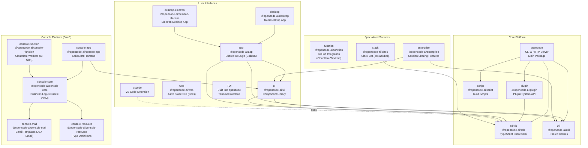
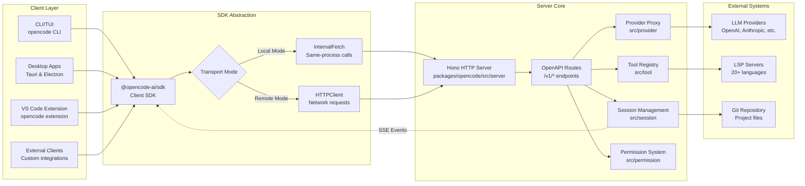
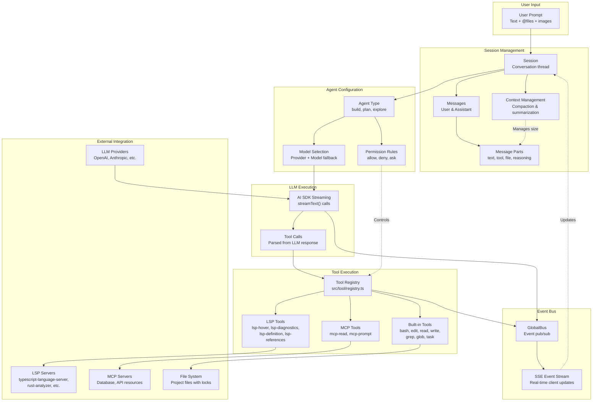

# Overview

Relevant source files

The following files were used as context for generating this wiki page:

- [README.md](README.md)
- [bun.lock](bun.lock)
- [packages/console/app/package.json](packages/console/app/package.json)
- [packages/console/core/package.json](packages/console/core/package.json)
- [packages/console/function/package.json](packages/console/function/package.json)
- [packages/console/mail/package.json](packages/console/mail/package.json)
- [packages/desktop/package.json](packages/desktop/package.json)
- [packages/function/package.json](packages/function/package.json)
- [packages/opencode/package.json](packages/opencode/package.json)
- [packages/opencode/script/schema.ts](packages/opencode/script/schema.ts)
- [packages/opencode/src/auth/index.ts](packages/opencode/src/auth/index.ts)
- [packages/opencode/src/auth/service.ts](packages/opencode/src/auth/service.ts)
- [packages/opencode/src/cli/ui.ts](packages/opencode/src/cli/ui.ts)
- [packages/opencode/test/provider/amazon-bedrock.test.ts](packages/opencode/test/provider/amazon-bedrock.test.ts)
- [packages/opencode/test/provider/gitlab-duo.test.ts](packages/opencode/test/provider/gitlab-duo.test.ts)
- [packages/plugin/package.json](packages/plugin/package.json)
- [packages/sdk/js/package.json](packages/sdk/js/package.json)
- [packages/web/package.json](packages/web/package.json)
- [packages/web/src/components/Lander.astro](packages/web/src/components/Lander.astro)
- [packages/web/src/content/docs/go.mdx](packages/web/src/content/docs/go.mdx)
- [packages/web/src/content/docs/index.mdx](packages/web/src/content/docs/index.mdx)
- [packages/web/src/content/docs/providers.mdx](packages/web/src/content/docs/providers.mdx)
- [packages/web/src/content/docs/zen.mdx](packages/web/src/content/docs/zen.mdx)
- [sdks/vscode/package.json](sdks/vscode/package.json)

## Purpose and Scope

This document provides a high-level overview of the OpenCode codebase, describing its purpose as an open source AI coding agent, the monorepo structure, core architecture patterns, and key capabilities. For detailed information about specific subsystems, see:

- Repository structure and package dependencies: [1.1](#1.1)
- Detailed architecture diagrams: [1.2](#1.2)
- Core application components: [2](#2)
- User interface implementations: [3](#3)
- SDK and API details: [5](#5)

---

## What is OpenCode

OpenCode is an open source AI coding agent that provides an alternative to proprietary solutions like Claude Code and GitHub Copilot. It is designed to be provider-agnostic, supporting 75+ LLM providers including OpenAI, Anthropic, Google, local models (Ollama, llama.cpp, LM Studio), and specialized services. The project emphasizes flexibility, extensibility, and user control.

**Key characteristics:**

- **Open source**: 100% open source under MIT license
- **Provider-agnostic**: Not coupled to any single LLM provider
- **Multiple interfaces**: Terminal UI (TUI), desktop apps, IDE extensions, web documentation
- **LSP integration**: Out-of-the-box Language Server Protocol support for 20+ languages
- **Client-server architecture**: Server can run locally or remotely

The codebase is organized as a monorepo containing the core server, multiple client implementations, SDK packages, and supporting infrastructure.

**Sources:** [README.md:1-142](), [packages/web/src/content/docs/index.mdx:1-361]()

---

## Repository Structure

The OpenCode repository is organized as a monorepo with three major subsystems and specialized services:

### Package Organization Diagram

### Core Platform

The core platform consists of five primary packages:

| Package             | Name                  | Purpose                                                                                                                  |
| ------------------- | --------------------- | ------------------------------------------------------------------------------------------------------------------------ |
| `packages/opencode` | `opencode`            | Main application containing CLI, HTTP server, TUI, session management, provider integration, tool system, LSP management |
| `packages/sdk/js`   | `@opencode-ai/sdk`    | TypeScript client SDK exposing OpenAPI-based methods for interacting with the server                                     |
| `packages/plugin`   | `@opencode-ai/plugin` | Plugin system API and base types for extending OpenCode functionality                                                    |
| `packages/util`     | `@opencode-ai/util`   | Shared utilities used across packages (error handling, data structures)                                                  |
| `packages/script`   | `@opencode-ai/script` | Build scripts and tooling for compilation and release                                                                    |

**Sources:** [bun.lock:1-638](), [packages/opencode/package.json:1-147](), [packages/sdk/js/package.json:1-32](), [packages/plugin/package.json:1-29]()

### User Interfaces

OpenCode provides multiple interface options:

| Package                     | Name                            | Technology              | Purpose                                                               |
| --------------------------- | ------------------------------- | ----------------------- | --------------------------------------------------------------------- |
| `packages/app`              | `@opencode-ai/app`              | SolidJS                 | Shared UI business logic consumed by desktop apps                     |
| `packages/ui`               | `@opencode-ai/ui`               | SolidJS + Kobalte       | Component library with SessionTurn, MessagePart, Diff viewer (Pierre) |
| `packages/desktop`          | `@opencode-ai/desktop`          | Tauri + Rust            | Native desktop application (macOS, Windows, Linux)                    |
| `packages/desktop-electron` | `@opencode-ai/desktop-electron` | Electron                | Alternative desktop application                                       |
| `packages/web`              | `@opencode-ai/web`              | Astro                   | Static documentation site at opencode.ai/docs                         |
| `sdks/vscode`               | `opencode`                      | VS Code Extension API   | VS Code integration with command palette and terminal                 |
| Built-in TUI                | N/A                             | @opentui/core + SolidJS | Terminal user interface inside `opencode` package                     |

**Sources:** [bun.lock:27-77](), [bun.lock:187-219](), [bun.lock:220-250](), [bun.lock:545-577](), [sdks/vscode/package.json:1-109]()

### Console Platform

The Console is a managed SaaS offering providing OpenCode Zen and OpenCode Go services:

| Package                     | Name                            | Purpose                                                               |
| --------------------------- | ------------------------------- | --------------------------------------------------------------------- |
| `packages/console/core`     | `@opencode-ai/console-core`     | Business logic, database operations (Drizzle ORM), Stripe integration |
| `packages/console/app`      | `@opencode-ai/console-app`      | SolidStart frontend deployed to Cloudflare Pages                      |
| `packages/console/function` | `@opencode-ai/console-function` | Cloudflare Workers handling LLM requests with AI SDK                  |
| `packages/console/mail`     | `@opencode-ai/console-mail`     | Email templates using JSX Email                                       |
| `packages/console/resource` | `@opencode-ai/console-resource` | Shared TypeScript types for Cloudflare resources                      |

**Sources:** [bun.lock:78-111](), [bun.lock:112-138](), [bun.lock:139-162](), [bun.lock:163-174](), [packages/console/core/package.json:1-52]()

### Specialized Services

| Package               | Name                      | Purpose                                                     |
| --------------------- | ------------------------- | ----------------------------------------------------------- |
| `packages/function`   | `@opencode-ai/function`   | GitHub integration via Cloudflare Workers (Octokit, JWT)    |
| `packages/enterprise` | `@opencode-ai/enterprise` | Enterprise features including session sharing functionality |
| `packages/slack`      | `@opencode-ai/slack`      | Slack bot integration using @slack/bolt framework           |

**Sources:** [bun.lock:280-295](), [bun.lock:251-279](), [bun.lock:453-465]()

---

## Core Architecture

### Client-Server Communication

OpenCode uses a flexible client-server architecture that supports both local (same-process) and remote (HTTP) operation modes. All clients communicate through the unified SDK layer.

**Key architectural components:**

| Component              | Location                             | Purpose                                                                  |
| ---------------------- | ------------------------------------ | ------------------------------------------------------------------------ |
| **Hono Server**        | [packages/opencode/src/server]()     | HTTP server exposing REST + SSE endpoints                                |
| **SDK Transport**      | [packages/sdk/js/src/client.ts]()    | Abstracts local vs. remote server communication                          |
| **Session Management** | [packages/opencode/src/session]()    | Manages conversation state, messages, context compaction                 |
| **Provider Proxy**     | [packages/opencode/src/provider]()   | Normalizes requests across 20+ LLM providers                             |
| **Tool Registry**      | [packages/opencode/src/tool]()       | Executes tools (bash, edit, read, write, grep, glob, task, lsp-_, mcp-_) |
| **Permission System**  | [packages/opencode/src/permission]() | Enforces allow/deny/ask rules for tool execution                         |

The server can run in two modes:

1. **Local mode**: Server runs in-process with the client (CLI/TUI default)
2. **Remote mode**: Server runs separately, clients connect via HTTP

**Sources:** [packages/opencode/package.json:1-147](), [packages/sdk/js/package.json:1-32]()

---

### Runtime Data Flow

The following diagram shows how user prompts flow through the system to generate AI responses with tool execution:

**Key runtime components:**

- **Agent types** (build, plan, explore): Different permission profiles and behavior patterns
- **AI SDK integration**: Uses Vercel AI SDK `streamText()` for streaming LLM responses with tool calling
- **Event Bus** (`GlobalBus`): Publishes events for file changes, tool execution, LLM streaming
- **SSE (Server-Sent Events)**: Streams real-time updates to connected clients
- **Context management**: Automatically compacts conversation history when approaching token limits

**Sources:** [packages/opencode/package.json:58-142]()

---

## Key Capabilities

### Multi-Provider LLM Support

OpenCode integrates with 75+ LLM providers through a unified abstraction layer:

**Provider categories:**

- **OpenCode services**: OpenCode Zen (pay-as-you-go), OpenCode Go ($10/month subscription)
- **Major providers**: OpenAI, Anthropic, Google (Gemini, Vertex AI), AWS Bedrock
- **Specialized providers**: Groq, Together AI, Cerebras, DeepSeek, Mistral, Cohere, Perplexity, xAI, Fireworks
- **Local models**: Ollama, llama.cpp, LM Studio
- **Enterprise**: GitLab Duo, Azure OpenAI, Cloudflare AI Gateway

Authentication methods include OAuth, API keys, environment variables, and bearer tokens. Provider configuration is managed through [packages/opencode/src/provider/provider.ts]() with authentication storage in [packages/opencode/src/auth]().

For details, see [Provider & Model Management](#2.4) and [Providers reference](#9.1).

**Sources:** [packages/web/src/content/docs/zen.mdx:1-278](), [packages/web/src/content/docs/providers.mdx:1-1000](), [packages/opencode/package.json:58-95]()

### Tool System

OpenCode provides an extensible tool system for AI agents to interact with code and resources:

**Built-in tool categories:**

| Tool              | Purpose                     | Key features                                  |
| ----------------- | --------------------------- | --------------------------------------------- |
| `bash`            | Execute shell commands      | Tree-sitter parsing for security analysis     |
| `edit`            | Modify files                | 9 fallback strategies for fuzzy text matching |
| `read`            | Read files                  | LSP integration for symbol information        |
| `write`           | Create/overwrite files      | LSP diagnostics validation                    |
| `grep`            | Search file contents        | Uses ripgrep for performance                  |
| `glob`            | Pattern-based file matching | Uses ripgrep for performance                  |
| `task`            | Parallel agent execution    | Subtask management for complex operations     |
| `lsp-hover`       | Symbol information          | LSP hover provider                            |
| `lsp-diagnostics` | Code errors                 | LSP diagnostics                               |
| `lsp-definition`  | Go to definition            | LSP definition provider                       |
| `lsp-references`  | Find references             | LSP references provider                       |
| `mcp-read`        | Read MCP resources          | Database, API access                          |
| `mcp-prompt`      | Execute MCP prompts         | Templated queries                             |
| `web-fetch`       | Fetch URL content           | Markdown, HTML, text extraction               |

The tool system includes file integrity checks (timestamp validation), concurrency control (semaphores), and permission enforcement. Custom tools can be added via plugins.

For details, see [Tool System & Permissions](#2.5) and [Plugin System](#2.9).

**Sources:** [packages/opencode/package.json:58-142]()

### LSP Integration

OpenCode automatically manages Language Server Protocol servers for 20+ programming languages:

- **Auto-download**: LSP servers are downloaded on-demand
- **Root detection**: Automatically detects project roots (e.g., `tsconfig.json`, `Cargo.toml`)
- **Diagnostics**: Real-time error checking during file operations
- **Navigation**: Hover, definition, references available to AI agents

This enables AI agents to understand code semantics, navigate projects intelligently, and validate changes.

For details, see [LSP & Code Formatting](#2.8).

**Sources:** [packages/opencode/package.json:58-142]()

### Session Management

OpenCode supports multiple concurrent sessions with shareable links:

- **Multi-session**: Work on multiple features simultaneously in separate sessions
- **Persistent state**: Sessions stored locally with conversation history
- **Context compaction**: Automatically summarizes history when approaching token limits
- **Shareable links**: Export sessions to https://opencode.ai/s/{id} for team collaboration

Sessions are disabled by default for privacy but can be enabled via configuration.

For details, see [Session & Agent System](#2.3).

**Sources:** [packages/web/src/content/docs/index.mdx:338-353]()

### Plugin System

OpenCode supports npm-based plugins for extending functionality:

- **Plugin types**: Tools, event handlers, shell environment modifications
- **Loading sources**: npm packages, local paths, global installations
- **Hook system**: `tool.execute.before/after`, `event`, `shell.env`
- **Configuration**: Specified in `opencode.json` `plugin` array

Example plugins include `@gitlab/opencode-gitlab-plugin` for GitLab API integration.

For details, see [Plugin System](#2.9).

**Sources:** [packages/plugin/package.json:1-29]()

### MCP Integration

OpenCode integrates with Model Context Protocol (MCP) servers for external resource access:

- **Resource types**: Databases, APIs, file systems, custom data sources
- **MCP tools**: `mcp-read`, `mcp-prompt` for interacting with configured servers
- **User configuration**: MCP servers defined in `opencode.json` `mcp` section

This enables AI agents to query databases, access APIs, and retrieve context from external systems.

For details, see [MCP Integration](#2.10).

**Sources:** [packages/opencode/package.json:87]()

---

## Distribution

OpenCode is distributed through 8+ package managers and 3 application formats:

### Installation Methods

| Method             | Command                                          | Platform     |
| ------------------ | ------------------------------------------------ | ------------ |
| **Install script** | `curl -fsSL https://opencode.ai/install \| bash` | All          |
| **npm**            | `npm install -g opencode-ai`                     | All          |
| **Homebrew**       | `brew install anomalyco/tap/opencode`            | macOS, Linux |
| **Pacman**         | `sudo pacman -S opencode`                        | Arch Linux   |
| **AUR**            | `paru -S opencode-bin`                           | Arch Linux   |
| **Chocolatey**     | `choco install opencode`                         | Windows      |
| **Scoop**          | `scoop install opencode`                         | Windows      |
| **Nix**            | `nix run nixpkgs#opencode`                       | All          |
| **Docker**         | `docker run ghcr.io/anomalyco/opencode`          | All          |

**Desktop applications:**

- Tauri-based native apps: `.dmg` (macOS), `.exe` (Windows), `.deb`/`.rpm`/AppImage (Linux)
- Electron-based apps: Alternative desktop implementation
- Auto-update support via `latest.json` (Tauri) and `latest.yml` (Electron)

**Binary formats:**

- CLI binaries: 12+ platform variants (darwin-arm64, darwin-x64, linux-x64-glibc, linux-x64-musl, etc.)
- Compiled with Bun's native compiler for fast startup and small size

For details, see [Build & Release](#8) and [Release Pipeline](#8.1).

**Sources:** [README.md:46-142](), [packages/web/src/components/Lander.astro:1-598]()

---

## Configuration and Authentication

OpenCode uses a hierarchical configuration system with multiple sources:

### Configuration Files

| File            | Location                            | Purpose                                         |
| --------------- | ----------------------------------- | ----------------------------------------------- |
| `opencode.json` | Project root, `~/.config/opencode/` | Provider settings, agent config, plugins, tools |
| `auth.json`     | `~/.local/share/opencode/`          | API keys, OAuth tokens (mode 0600)              |
| `.env`          | Project root                        | Environment variables for credentials           |

**Configuration precedence** (highest to lowest):

1. Remote configuration (OpenCode Console)
2. Project-local `opencode.json`
3. Global `~/.config/opencode/opencode.json`
4. Environment variables
5. Inline CLI arguments

**Authentication types:**

- **OAuth**: Refresh token, access token, expiry (e.g., Anthropic, GitLab)
- **API keys**: Simple bearer tokens
- **Well-known**: Pre-shared credentials for specific services
- **Environment variables**: Fallback for AWS, Azure, GitLab, etc.

Configuration schema is generated from Zod definitions via [packages/opencode/script/schema.ts]() and published to https://opencode.ai/config.json for IDE autocomplete.

For details, see [Configuration System](#2.2) and [AI Provider & Model Management](#2.4).

**Sources:** [packages/opencode/script/schema.ts:1-64](), [packages/opencode/src/auth/index.ts:1-58](), [packages/opencode/src/auth/service.ts:1-102]()

---

## Summary

OpenCode is a flexible, provider-agnostic AI coding agent with multiple interface options (CLI/TUI, desktop, IDE extensions) and comprehensive integration capabilities (LSP, MCP, Git, 75+ LLM providers). The codebase is organized as a monorepo with clear separation between core platform, user interfaces, console services, and specialized integrations. The client-server architecture with SDK abstraction enables both local and remote operation modes, supporting diverse deployment scenarios from individual developers to enterprise teams.

**Next steps:**

- For package-level details, see [Repository Structure & Packages](#1.1)
- For architectural deep-dives, see [Architecture Overview](#1.2)
- For server implementation details, see [Core Application](#2)
- For UI implementation details, see [User Interfaces](#3)
